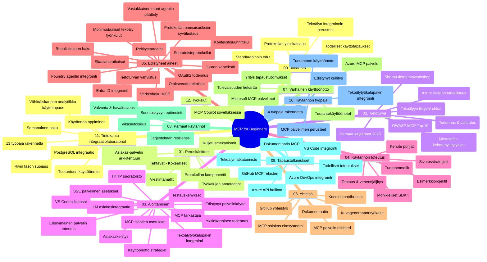

# Model Context Protocol (MCP) aloittelijoille - Opas

Tämä opas antaa yleiskatsauksen "Model Context Protocol (MCP) for Beginners" -oppimateriaalin repositorion rakenteeseen ja sisältöön. Käytä tätä opasta navigoidaksesi repositoriossa tehokkaasti ja hyödyntääksesi saatavilla olevat resurssit parhaalla mahdollisella tavalla.

## Repositorion yleiskatsaus

Model Context Protocol (MCP) on standardoitu kehys tekoälymallien ja asiakassovellusten välisiin vuorovaikutuksiin. Alun perin Anthropicin luoma MCP on nyt ylläpidetty laajemman MCP-yhteisön toimesta virallisessa GitHub-organisaatiossa. Tämä repositorio tarjoaa kattavan opetussuunnitelman käytännön koodiesimerkkien muodossa C#:ssa, Javassa, JavaScriptissä, Pythonissa ja TypeScriptissä, tarkoitettu tekoälykehittäjille, järjestelmäarkkitehdeille ja ohjelmistoinsinööreille.

## Visuaalinen opetussuunnitelmakartta

## Repositorion rakenne

Repositorio on järjestetty kahteentoista pääosioon, joista kukin keskittyy eri MCP:n osa-alueisiin:

1. **Johdanto (00-Introduction/)**
   - Yleiskatsaus Model Context Protocol -protokollaan
   - Miksi standardisointi on tärkeää tekoälyputkissa
   - Käytännön käyttötapaukset ja hyödyt

2. **Keskeiset käsitteet (01-CoreConcepts/)**
   - Asiakas-palvelin-arkkitehtuuri
   - Tärkeimmät protokollan komponentit
   - Viestintämallit MCP:ssä

3. **Turvallisuus (02-Security/)**
   - Turvallisuusuhat MCP-pohjaisissa järjestelmissä
   - Parhaat käytännöt toteutusten suojaamiseksi
   - Todennus- ja valtuutusstrategiat
   - **Kattava turvallisuusdokumentaatio**:
     - MCP Turvallisuuden parhaat käytännöt 2025
     - Azure Content Safety -toteutusopas
     - MCP:n turvatoimet ja tekniikat
     - MCP parhaat käytännöt pikaopas
   - **Keskeiset turvallisuusaiheet**:
     - Kehotteen injektointi ja työkalumyrkytykset
     - Istunnon kaappaus ja sekava varamiesongelma
     - Tokenien läpivientivulnerabiliteetit
     - Liialliset käyttöoikeudet ja pääsynhallinta
     - Toimitusketjun turvallisuus tekoälykomponenteissa
     - Microsoft Prompt Shields -integraatio

4. **Aloittaminen (03-GettingStarted/)**
   - Ympäristön asennus ja konfigurointi
   - Perus MCP-palvelimien ja -asiakkaiden luominen
   - Integrointi olemassa oleviin sovelluksiin
   - Sisältää osiot:
     - Ensimmäinen palvelin toteutus
     - Asiakaskehitys
     - LLM-asiakasintegrointi
     - VS Code -integraatio
     - Server-Sent Events (SSE) palvelin
     - Edistynyt palvelimen käyttö
     - HTTP-striimaus
     - AI Toolkit -integraatio
     - Testausstrategiat
     - Julkaisun ohjeet

5. **Käytännön toteutus (04-PracticalImplementation/)**
   - SDK:iden käyttö eri ohjelmointikielillä
   - Virheenkorjaus, testaus ja validointitekniikat
   - Uudelleenkäytettävien kehotepohjien ja työnkulkujen laatiminen
   - Esimerkkiprojekteja toteutuksineen

6. **Edistyneet aiheet (05-AdvancedTopics/)**
   - Kontekstisuunnittelutekniikat
   - Foundry-agentin integrointi
   - Monimodaaliset tekoälytyönkulut
   - OAuth2-todennusdemot
   - Reaaliaikaiset hakutoiminnot
   - Reaaliaikainen striimaus
   - Root-kontekstien toteutus
   - Reititystekniikat
   - Näytteenottotekniikat
   - Skaalausratkaisut
   - Turvallisuusnäkökulmat
   - Entra ID -turvaintegraatio
   - Web-hakujen integrointi
   - Kilpaileva moniedustajainen päättely (väittelymallit)

7. **Yhteisön panokset (06-CommunityContributions/)**
   - Kuinka osallistua koodilla ja dokumentaatiolla
   - Yhteistyö GitHubin kautta
   - Yhteisövetoinen parannus ja palaute
   - Eri MCP-asiakkaiden käyttö (Claude Desktop, Cline, VSCode)
   - Työskentely suosittujen MCP-palvelimien kanssa, mukaan lukien kuvageneraattorit

8. **Varhaisen käyttöönoton opit (07-LessonsfromEarlyAdoption/)**
   - Käytännön toteutukset ja menestystarinat
   - MCP-pohjaisten ratkaisujen rakentaminen ja käyttöönotto
   - Trendejä ja tulevaisuuden tiekartta
   - **Microsoft MCP Palvelinopas**: Kattava opas 10 tuotantovalmiiseen Microsoft MCP -palvelimeen, kuten:
     - Microsoft Learn Docs MCP -palvelin
     - Azure MCP -palvelin (15+ erikoisliitintä)
     - GitHub MCP -palvelin
     - Azure DevOps MCP -palvelin
     - MarkItDown MCP -palvelin
     - SQL Server MCP -palvelin
     - Playwright MCP -palvelin
     - Dev Box MCP -palvelin
     - Microsoft Foundry MCP -palvelin
     - Microsoft 365 Agents Toolkit MCP -palvelin

9. **Parhaat käytännöt (08-BestPractices/)**
   - Suorituskyvyn viritys ja optimointi
   - Vikasietävien MCP-järjestelmien suunnittelu
   - Testaus- ja resilientsstrategiat

10. **Tapaustutkimukset (09-CaseStudy/)**
    - **Seitsemän kattavaa tapaustutkimusta**, jotka osoittavat MCP:n monipuolisuuden eri tilanteissa:
    - **Azure AI Matka-agentit**: Moniedustajainen orkestrointi Azure OpenAI:n ja AI-haun kanssa
    - **Azure DevOps -integraatio**: Työnkulkujen automatisointi YouTube-tietojen päivityksellä
    - **Reaaliaikainen dokumentaation haku**: Python-konsoliasiakas HTTP-striimauksella
    - **Interaktiivinen opintosuunnitelman generaattori**: Chainlit-verkkosovellus keskustelevaa tekoälyä varten
    - **Sisäänrakennettu dokumentaatio**: VS Code -integraatio GitHub Copilot -työnkulkujen kanssa
    - **Azure API Management**: Yritys-API-integraatio MCP-palvelimen luomisella
    - **GitHub MCP Rekisteri**: Ekosysteemin kehitys ja agenttien integrointialusta
    - Toteutusesimerkkejä yritysintegraatioista, kehittäjätuottavuudesta ja ekosysteemin kehittämisestä

11. **Käytännön työpaja (10-StreamliningAIWorkflowsBuildingAnMCPServerWithAIToolkit/)**
    - Laaja käytännön työpaja MCP:n ja AI Toolkitin yhdistämiseksi
    - Älykkäiden sovellusten rakentaminen yhdistämään tekoälymallit reaalimaailman työkaluihin
    - Käytännön moduuleja kattaen perusteet, räätälöidyn palvelimen kehityksen ja tuotantokäyttöönoton strategiat
    - **Lab-rakenne**:
      - Lab 1: MCP-palvelimen perusteet
      - Lab 2: Edistynyt MCP-palvelimen kehitys
      - Lab 3: AI Toolkit -integraatio
      - Lab 4: Tuotantokäytön julkaisu ja skaalaus
    - Lab-pohjainen oppimismenetelmä vaihe vaiheelta

12. **MCP-palvelinten tietokantaintegraatiolaboratoriot (11-MCPServerHandsOnLabs/)**
    - **Kattava 13-labin oppimispolku** tuotantovalmiiden MCP-palvelinten rakentamiseen PostgreSQL-integraatiolla
    - **Käytännön vähittäiskaupan analytiikkatoteutus** Zava Retail -käyttötapauksen avulla
    - **Yritysluokan toimintamallit** kuten rivitason turvallisuus (RLS), semanttinen haku ja monivuokralaispääsy tietoihin
    - **Koko laboratoriorakenne**:
      - **Labit 00-03: Perustukset** - Johdanto, arkkitehtuuri, turvallisuus, ympäristön asennus
      - **Labit 04-06: MCP-palvelimen rakentaminen** - Tietokannan suunnittelu, MCP-palvelimen toteutus, työkalujen kehitys
      - **Labit 07-09: Edistyneet ominaisuudet** - Semanttinen haku, testaus ja virheenkorjaus, VS Code -integraatio
      - **Labit 10-12: Tuotanto ja parhaat käytännöt** - Julkaisu, seuranta, optimointi
    - **Käsitellyt teknologiat**: FastMCP-kehys, PostgreSQL, Azure OpenAI, Azure Container Apps, Application Insights
    - **Oppimistulokset**: Tuotantovalmiit MCP-palvelimet, tietokantaintegraatiomallit, tekoälypohjaiset analytiikat, yritysturvallisuus

13. **Työkalut (12-tooling/)**
    - Opi käyttämään MCP:tä Copilot-sovelluksessa ja muissa työkaluissa

## Lisäresurssit

Repositoriossa on tukiresursseja:

- **Kuvakansio**: Sisältää kaavioita ja kuvituksia opetussuunnitelman mukana
- **Käännökset**: Monikielinen tuki dokumentaation automaattisilla käännöksillä
- **Viralliset MCP-resurssit**:
  - [MCP-dokumentaatio](https://modelcontextprotocol.io/)
  - [MCP-määritys](https://spec.modelcontextprotocol.io/)
  - [MCP GitHub -repositorio](https://github.com/modelcontextprotocol)

## Kuinka käyttää tätä repositoriota

1. **Järjestelmällinen oppiminen**: Seuraa lukuja järjestyksessä (00–11) rakenteellisen oppimiskokemuksen saamiseksi.
2. **Kielikohtainen painotus**: Jos olet kiinnostunut tietystä ohjelmointikielestä, tutustu esimerkkihakemistoihin omalla suosikkikielelläsi.
3. **Käytännön toteutus**: Aloita "Aloittamisesta" -osiosta asentaaksesi ympäristö ja luodaksesi ensimmäisen MCP-palvelimen ja -asiakkaan.
4. **Edistynyt tutkimus**: Kun perustaidot ovat hallussa, sukeltaudu edistyneisiin aiheisiin laajentaaksesi osaamistasi.
5. **Yhteisön osallistuminen**: Liity MCP-yhteisöön GitHub-keskusteluiden ja Discord-kanavien kautta yhdistääksesi asiantuntijoihin ja muihin kehittäjiin.

## MCP-asiakkaat ja työkalut

Opetussuunnitelma kattaa eri MCP-asiakkaat ja työkalut:

1. **Viralliset asiakkaat**:
   - Visual Studio Code
   - MCP Visual Studio Codessa
   - Claude Desktop
   - Claude VSCodessa
   - Claude API

2. **Yhteisön asiakkaat**:
   - Cline (päätelaitepohjainen)
   - Cursor (koodieditori)
   - ChatMCP
   - Windsurf

3. **MCP-hallintatyökalut**:
   - MCP CLI
   - MCP Manager
   - MCP Linker
   - MCP Router

## Suositut MCP-palvelimet

Repositoriossa esitellään erilaisia MCP-palvelimia, mukaan lukien:

1. **Viralliset Microsoft MCP -palvelimet**:
   - Microsoft Learn Docs MCP -palvelin
   - Azure MCP -palvelin (15+ erikoisliitintä)
   - GitHub MCP -palvelin
   - Azure DevOps MCP -palvelin
   - MarkItDown MCP -palvelin
   - SQL Server MCP -palvelin
   - Playwright MCP -palvelin
   - Dev Box MCP -palvelin
   - Microsoft Foundry MCP -palvelin
   - Microsoft 365 Agents Toolkit MCP -palvelin

2. **Viralliset referenssipalvelimet**:
   - Tiedostojärjestelmä
   - Fetch
   - Muisti
   - Peräkkäinen ajattelu

3. **Kuvagenerointi**:
   - Azure OpenAI DALL-E 3
   - Stable Diffusion WebUI
   - Replicate

4. **Kehitystyökalut**:
   - Git MCP
   - Päätelaitteen ohjaus
   - Koodiassistentti

5. **Erikoistuneet palvelimet**:
   - Salesforce
   - Microsoft Teams
   - Jira & Confluence

## Osallistuminen

Tämä repositorio toivottaa yhteisön panokset tervetulleiksi. Katso Yhteisön panokset -osio, josta löydät ohjeita tehokkaaseen osallistumiseen MCP-ekosysteemissä.

----

*Tämä opas päivitettiin viimeksi 5. helmikuuta 2026, heijastaen uusinta MCP-määritystä 2025-11-25 ja antaa yleiskatsauksen repositoriosta tuolta päivältä. Repositorion sisältöä voidaan päivittää tämän jälkeen.*

---

<!-- CO-OP TRANSLATOR DISCLAIMER START -->
**Vastuuvapauslauseke**:
Tämä asiakirja on käännetty käyttämällä tekoälypohjaista käännöspalvelua [Co-op Translator](https://github.com/Azure/co-op-translator). Vaikka pyrimme tarkkuuteen, otathan huomioon, että automaattiset käännökset saattavat sisältää virheitä tai epätarkkuuksia. Alkuperäinen asiakirja sen alkuperäiskielellä on virallinen lähde. Tärkeissä asioissa suositellaan ammattimaista ihmiskäännöstä. Emme ole vastuussa tämän käännöksen käytöstä aiheutuvista väärinymmärryksistä tai tulkinnoista.
<!-- CO-OP TRANSLATOR DISCLAIMER END -->