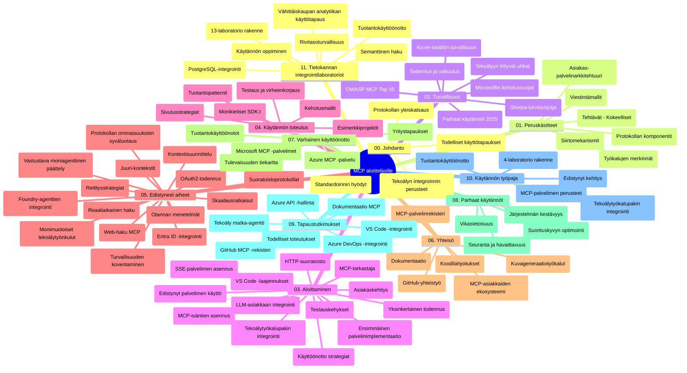

# Model Context Protocol (MCP) aloittelijoille - Opas

Tämä opas tarjoaa yleiskatsauksen "Model Context Protocol (MCP) aloittelijoille" -opetussuunnitelman repositorion rakenteesta ja sisällöstä. Käytä tätä opasta navigoidaksesi repositorio tehokkaasti ja hyödyntääksesi saatavilla olevia resursseja parhaalla mahdollisella tavalla.

## Repositorion yleiskatsaus

Model Context Protocol (MCP) on standardoitu kehys tekoälymallien ja asiakasohjelmien välisille vuorovaikutuksille. Alun perin Anthropicin luoma MCP on nyt laajemman MCP-yhteisön ylläpitämä virallisen GitHub-organisaation kautta. Tämä repositorio tarjoaa kattavan opetussuunnitelman käytännön koodiesimerkkien kanssa C#, Java, JavaScript, Python ja TypeScript -kielillä, suunnattu tekoälykehittäjille, järjestelmäarkkitehdeille ja ohjelmistokehittäjille.

## Visuaalinen opetussuunnitelmakartta

## Repositorion rakenne

Repositorio on jaettu yksitoista pääosioon, jotka keskittyvät eri MCP:n osa-alueisiin:

1. **Johdanto (00-Introduction/)**
   - Model Context Protocolin yleiskatsaus
   - Miksi standardointi on tärkeää tekoälyputkistoissa
   - Käytännön käyttötapaukset ja hyödyt

2. **Peruskäsitteet (01-CoreConcepts/)**
   - Asiakas-palvelin -arkkitehtuuri
   - Keskeiset protokollan komponentit
   - Viestintämallit MCP:ssä

3. **Turvallisuus (02-Security/)**
   - Turvauhat MCP-pohjaisissa järjestelmissä
   - Parhaat käytännöt toteutusten suojaamisessa
   - Todennus- ja valtuutusstrategiat
   - **Laaja turvallisuusdokumentaatio**:
     - MCP:n turvallisuuden parhaat käytännöt 2025
     - Azure Content Safetyn toteutusohjeet
     - MCP:n turvallisuusohjaimet ja -tekniikat
     - MCP:n parhaiden käytäntöjen pikaopas
   - **Keskeiset turvallisuusaiheet**:
     - Kehotteen injektointi ja työkalumyrkytyshyökkäykset
     - Istunnon kaappaus ja sekaisin oleva varamies -ongelmat
     - Tokenien läpivientihaavoittuvuudet
     - Liialliset oikeudet ja käyttöoikeuksien hallinta
     - Toimitusketjun turvallisuus tekoälykomponenteissa
     - Microsoft Prompt Shields -integraatio

4. **Aloittaminen (03-GettingStarted/)**
   - Ympäristön asetus ja konfigurointi
   - Perus MCP-palvelimien ja -asiakkaiden luominen
   - Integrointi olemassa oleviin sovelluksiin
   - Sisältää osiot:
     - Ensimmäinen palvelin toteutus
     - Asiakasohjelman kehitys
     - LLM-asiakasintegraatio
     - VS Code -integraatio
     - Server-Sent Events (SSE) -palvelin
     - Kehittynyt palvelimen käyttö
     - HTTP-suoratoisto
     - AI Toolkit -integraatio
     - Testausstrategiat
     - Julkaisulinjaukset

5. **Käytännön toteutus (04-PracticalImplementation/)**
   - SDK:iden käyttö eri ohjelmointikielillä
   - Virheenkorjaus, testaus ja validointitekniikat
   - Uudelleenkäytettävien kehotepohjien ja työnkulkujen laatiminen
   - Esimerkkiprojekteja toteutuksineen

6. **Edistyneet aiheet (05-AdvancedTopics/)**
   - Kontekstisuunnittelutekniikat
   - Foundry-agenttien integraatio
   - Monimodaaliset tekoälytyönkulut
   - OAuth2-todennuksen demonstrointi
   - Reaaliaikaiset hakutoiminnot
   - Reaaliaikainen suoratoisto
   - Root-kontekstien toteutus
   - Reititysstrategiat
   - Otannan menetelmät
   - Skaalausratkaisut
   - Turvallisuuskysymykset
   - Entra ID -turvallisuusintegraatio
   - Verkkohaun integraatio
   - Adversarielliset moni-agenttiajattelumallit (debaattikuvioita)

7. **Yhteisön kontribuutiot (06-CommunityContributions/)**
   - Kuinka osallistua koodin ja dokumentaation kehittämiseen
   - Yhteistyö GitHubin kautta
   - Yhteisön ohjaamat parannukset ja palaute
   - Erilaisten MCP-asiakkaiden käyttö (Claude Desktop, Cline, VSCode)
   - Suosittujen MCP-palvelimien käyttö kuvantuotanto mukaan lukien

8. **Varhaisen käyttöönoton opit (07-LessonsfromEarlyAdoption/)**
   - Todelliset toteutukset ja menestystarinat
   - MCP-pohjaisten ratkaisujen rakentaminen ja käyttöönotto
   - Trendit ja tulevaisuuden tiekartta
   - **Microsoft MCP -palvelimet Opas**: Kattava opas 10 tuotantovalmiiseen Microsoft MCP -palvelimeen, sisältäen:
     - Microsoft Learn Docs MCP -palvelin
     - Azure MCP -palvelin (15+ erikoistunutta liitintä)
     - GitHub MCP -palvelin
     - Azure DevOps MCP -palvelin
     - MarkItDown MCP -palvelin
     - SQL Server MCP -palvelin
     - Playwright MCP -palvelin
     - Dev Box MCP -palvelin
     - Microsoft Foundry MCP -palvelin
     - Microsoft 365 Agents Toolkit MCP -palvelin

9. **Parhaat käytännöt (08-BestPractices/)**
   - Suorituskyvyn viritys ja optimointi
   - Vikasietoisten MCP-järjestelmien suunnittelu
   - Testaus- ja resilienssistrategiat

10. **Tapaustutkimukset (09-CaseStudy/)**
    - **Seitsemän laajaa tapaustutkimusta** osoittamassa MCP:n monipuolisuutta eri tilanteissa:
    - **Azure AI Travel Agents**: Moni-agenttien orkestrointi Azure OpenAI:n ja AI-haun kanssa
    - **Azure DevOps -integraatio**: Työnkulkujen automatisointi YouTube-data päivityksillä
    - **Reaaliaikainen dokumentaation haku**: Python-konsoli asiakas HTTP-suoratoistolla
    - **Interaktiivinen opintosuunnitelman generaattori**: Chainlit-verkkosovellus keskusteleva tekoäly
    - **Editorin sisäinen dokumentaatio**: VS Code -integraatio GitHub Copilot -työnkulkujen kanssa
    - **Azure API Management**: Yritystason API-integraatio MCP-palvelimen luomisen yhteydessä
    - **GitHub MCP Registry**: Ekosysteemin kehitys ja agenttipohjainen integraatioalusta
    - Toteutusesimerkkejä yritysintegraatiosta, kehittäjien tuottavuudesta ja ekosysteemin kehittämisestä

11. **Käytännön työpaja (10-StreamliningAIWorkflowsBuildingAnMCPServerWithAIToolkit/)**
    - Laaja käytännön työpaja, joka yhdistää MCP:n ja AI Toolkitin
    - Älykkäiden sovellusten rakentaminen, jotka yhdistävät tekoälymallit oikean maailman työkaluihin
    - Käytännön moduulit kattavat perusteet, räätälöidyn palvelinkehityksen ja tuotantojulkaisut
    - **Lab-rakenne**:
      - Lab 1: MCP-palvelimen perusteet
      - Lab 2: Edistynyt MCP-palvelinkehitys
      - Lab 3: AI Toolkit -integraatio
      - Lab 4: Tuotantojulkaisu ja skaalaus
    - Lab-pohjainen oppimisote vaihe vaiheelta ohjeineen

12. **MCP-palvelimen tietokantaintegraatiolaboratoriot (11-MCPServerHandsOnLabs/)**
    - **Kattava 13 labran oppimispolku** tuotantovalmiiden MCP-palvelimien rakentamiseen PostgreSQL-integraatiolla
    - **Todelliseen vähittäiskaupan analytiikkaan perustuva toteutus** Zava Retail -käyttötapauksen avulla
    - **Yritysluokan mallit** sisältäen rivitason turvallisuuden (RLS), semanttisen haun ja monivuokraaja-datan käytön
    - **Täydellinen labrakenne**:
      - **Labrat 00-03: Perusteet** - Johdanto, arkkitehtuuri, turvallisuus, ympäristön asetus
      - **Labrat 04-06: MCP-palvelimen rakentaminen** - Tietokannan suunnittelu, MCP-palvelimen toteutus, työkalujen kehitys
      - **Labrat 07-09: Edistyneet ominaisuudet** - Semanttinen haku, testaus ja virheenkorjaus, VS Code -integraatio
      - **Labrat 10-12: Tuotanto ja parhaat käytännöt** - Julkaisu, valvonta, optimointi
    - **Käsitellyt teknologiat**: FastMCP-framework, PostgreSQL, Azure OpenAI, Azure Container Apps, Application Insights
    - **Oppimistulokset**: Tuotantovalmiit MCP-palvelimet, tietokantaintegraatiomallit, tekoälypohjaiset analytiikat, yritysturvallisuus

## Lisäresurssit

Repositoriossa on tukiresursseja:

- **Images-kansio**: Sisältää kaavioita ja kuvituksia koko opetussuunnitelmassa
- **Käännökset**: Monikielinen tuki automaattisilla käännöksillä dokumentaatiosta
- **Viralliset MCP-resurssit**:
  - [MCP-dokumentaatio](https://modelcontextprotocol.io/)
  - [MCP-määritykset](https://spec.modelcontextprotocol.io/)
  - [MCP GitHub Repositorio](https://github.com/modelcontextprotocol)

## Kuinka käyttää tätä repositoriota

1. **Järjestelmällinen opiskelu**: Seuraa lukujen järjestystä (00-11) oppimisen rakenteen ylläpitämiseksi.
2. **Kielikohtainen fokusoituminen**: Jos olet kiinnostunut tietystä ohjelmointikielestä, tutustu esimerkkihakemistoihin suosikkikielelläsi.
3. **Käytännön toteutus**: Aloita "Getting Started" -osiosta asentaaksesi ympäristösi ja luodaksesi ensimmäisen MCP-palvelimesi ja -asiakkaasi.
4. **Edistynyt tutkimus**: Kun olet varmempi perusasioissa, sukella syvemmälle edistyneisiin aiheisiin laajentaaksesi tietämystäsi.
5. **Yhteisön osallistuminen**: Liity MCP-yhteisöön GitHub-keskustelujen ja Discord-kanavien kautta yhdistääksesi asiantuntijoihin ja kehittäjätovereihin.

## MCP-asiakkaat ja työkalut

Opetussuunnitelma kattaa erilaisia MCP-asiakkaita ja työkaluja:

1. **Viralliset asiakkaat**:
   - Visual Studio Code
   - MCP Visual Studio Codessa
   - Claude Desktop
   - Claude VSCodessa
   - Claude API

2. **Yhteisön asiakkaat**:
   - Cline (päätepohjainen)
   - Cursor (koodieditori)
   - ChatMCP
   - Windsurf

3. **MCP-hallintatyökalut**:
   - MCP CLI
   - MCP Manager
   - MCP Linker
   - MCP Router

## Suositut MCP-palvelimet

Repositoriossa esitellään useita MCP-palvelimia, mukaan lukien:

1. **Viralliset Microsoft MCP -palvelimet**:
   - Microsoft Learn Docs MCP -palvelin
   - Azure MCP -palvelin (15+ erikoistunutta liitintä)
   - GitHub MCP -palvelin
   - Azure DevOps MCP -palvelin
   - MarkItDown MCP -palvelin
   - SQL Server MCP -palvelin
   - Playwright MCP -palvelin
   - Dev Box MCP -palvelin
   - Microsoft Foundry MCP -palvelin
   - Microsoft 365 Agents Toolkit MCP -palvelin

2. **Viralliset referenssipalvelimet**:
   - Filesystem
   - Fetch
   - Memory
   - Sequential Thinking

3. **Kuvagenerointi**:
   - Azure OpenAI DALL-E 3
   - Stable Diffusion WebUI
   - Replicate

4. **Kehitystyökalut**:
   - Git MCP
   - Terminal Control
   - Code Assistant

5. **Erikoistuneet palvelimet**:
   - Salesforce
   - Microsoft Teams
   - Jira & Confluence

## Osallistuminen

Tämä repositorio toivottaa yhteisön kontribuutiot tervetulleiksi. Katso Yhteisön kontribuutiot -osio oppiaksesi, kuinka voit tehokkaasti osallistua MCP-ekosysteemin kehittämiseen.

----

*Tämä opas päivitettiin viimeksi 5. helmikuuta 2026, ja se heijastaa uusinta MCP Specification 2025-11-25 -versiota sekä antaa yleiskatsauksen repositorion tilanteesta tuolloin. Repositorion sisältöä voidaan päivittää tämän päivämäärän jälkeen.*

---

<!-- CO-OP TRANSLATOR DISCLAIMER START -->
**Vastuuvapauslauseke**:
Tämä asiakirja on käännetty käyttämällä tekoälypohjaista käännöspalvelua [Co-op Translator](https://github.com/Azure/co-op-translator). Vaikka pyrimme tarkkuuteen, otathan huomioon, että automaattiset käännökset saattavat sisältää virheitä tai epätarkkuuksia. Alkuperäinen asiakirja sen alkuperäiskielellä on virallinen lähde. Tärkeissä asioissa suositellaan ammattimaista ihmiskäännöstä. Emme ole vastuussa tämän käännöksen käytöstä aiheutuvista väärinymmärryksistä tai tulkinnoista.
<!-- CO-OP TRANSLATOR DISCLAIMER END -->