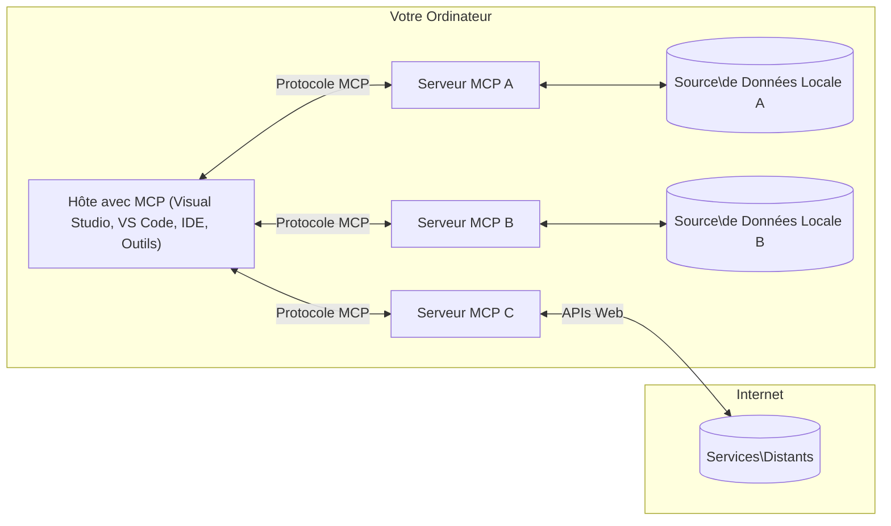

# Concepts de base du MCP : Maîtriser le Model Context Protocol pour l'intégration de l'IA

[](https://youtu.be/earDzWGtE84)

_(Cliquez sur l'image ci-dessus pour voir la vidéo de cette leçon)_

Le [Model Context Protocol (MCP)](https://github.com/modelcontextprotocol) est un cadre standardisé puissant qui optimise la communication entre les modèles de langage étendus (LLM) et les outils externes, applications et sources de données.  
Ce guide vous expliquera les concepts fondamentaux du MCP. Vous apprendrez son architecture client-serveur, ses composants essentiels, les mécanismes de communication, ainsi que les meilleures pratiques d'implémentation.

- **Consentement explicite de l'utilisateur** : Tout accès aux données et toute opération nécessitent l'approbation explicite de l'utilisateur avant exécution. Les utilisateurs doivent comprendre clairement quelles données seront accessibles et quelles actions seront effectuées, avec un contrôle granulaire sur les permissions et autorisations.

- **Protection de la vie privée des données** : Les données utilisateur ne sont exposées qu'avec consentement explicite et doivent être protégées par des contrôles d'accès robustes tout au long du cycle d'interaction. Les implémentations doivent empêcher la transmission non autorisée des données et maintenir des frontières strictes de confidentialité.

- **Sécurité d'exécution des outils** : Chaque invocation d'outil requiert le consentement explicite de l'utilisateur avec une compréhension claire des fonctionnalités, paramètres et impacts potentiels de l'outil. Des frontières de sécurité solides doivent prévenir toute exécution involontaire, dangereuse ou malveillante des outils.

- **Sécurité de la couche transport** : Tous les canaux de communication doivent utiliser des mécanismes appropriés de chiffrement et d'authentification. Les connexions distantes doivent implémenter des protocoles de transport sécurisés et une gestion appropriée des identifiants.

#### Directives d'implémentation :

- **Gestion des permissions** : Implémentez des systèmes de permissions fines qui permettent aux utilisateurs de contrôler quels serveurs, outils et ressources sont accessibles  
- **Authentification & autorisation** : Utilisez des méthodes d'authentification sécurisées (OAuth, clés API) avec une gestion correcte des jetons et leur expiration  
- **Validation des entrées** : Validez tous les paramètres et entrées de données selon des schémas définis pour prévenir les attaques par injection  
- **Journalisation des audits** : Maintenez des journaux complets de toutes les opérations pour la surveillance de la sécurité et la conformité

## Aperçu

Cette leçon explore l'architecture fondamentale et les composants qui forment l'écosystème du Model Context Protocol (MCP). Vous découvrirez l'architecture client-serveur, les composants clés et les mécanismes de communication qui alimentent les interactions MCP.

## Objectifs d'apprentissage clés

À la fin de cette leçon, vous serez en mesure de :

- Comprendre l'architecture client-serveur du MCP.  
- Identifier les rôles et responsabilités des Hôtes, Clients et Serveurs.  
- Analyser les fonctionnalités centrales qui font du MCP une couche d'intégration flexible.  
- Apprendre comment l'information circule dans l'écosystème MCP.  
- Obtenir des connaissances pratiques à travers des exemples de code en .NET, Java, Python et JavaScript.

## Architecture MCP : un regard approfondi

L'écosystème MCP est construit sur un modèle client-serveur. Cette structure modulaire permet aux applications d'IA d'interagir efficacement avec des outils, bases de données, API, et ressources contextuelles. Décomposons cette architecture en ses composants principaux.

Au cœur, le MCP suit une architecture client-serveur où une application hôte peut se connecter à plusieurs serveurs :


- **Hôtes MCP** : Programmes comme VSCode, Claude Desktop, IDEs ou outils IA qui souhaitent accéder aux données via MCP  
- **Clients MCP** : Clients de protocole qui maintiennent des connexions 1:1 avec les serveurs  
- **Serveurs MCP** : Programmes légers qui exposent chacun des capacités spécifiques via le Model Context Protocol standardisé  
- **Sources de données locales** : Les fichiers, bases de données et services de votre ordinateur auxquels les serveurs MCP peuvent accéder de manière sécurisée  
- **Services distants** : Systèmes externes disponibles sur internet que les serveurs MCP peuvent connecter via des API  

Le protocole MCP est un standard évolutif utilisant un versionnage basé sur la date (format AAAA-MM-JJ). La version actuelle du protocole est **2025-11-25**. Vous pouvez consulter les dernières mises à jour de la [spécification du protocole](https://modelcontextprotocol.io/specification/2025-11-25/)

### 1. Hôtes

Dans le Model Context Protocol (MCP), les **Hôtes** sont des applications d'IA qui servent d'interface principale par laquelle les utilisateurs interagissent avec le protocole. Les hôtes coordonnent et gèrent les connexions à plusieurs serveurs MCP en créant un client MCP dédié pour chaque connexion serveur. Exemples d'hôtes :

- **Applications d'IA** : Claude Desktop, Visual Studio Code, Claude Code  
- **Environnements de développement** : IDEs et éditeurs de code avec intégration MCP  
- **Applications personnalisées** : Agents IA et outils développés pour des usages spécifiques  

Les **Hôtes** sont des applications qui coordonnent les interactions avec le modèle IA. Ils :

- **Orchestrent les modèles IA** : Exécutent ou interagissent avec des LLM pour générer des réponses et coordonner les workflows IA  
- **Gèrent les connexions clients** : Créent et maintiennent un client MCP par connexion serveur MCP  
- **Contrôlent l'interface utilisateur** : Gèrent le flux de conversation, les interactions utilisateur et la présentation des réponses  
- **Appliquent la sécurité** : Contrôlent les permissions, les contraintes de sécurité et l'authentification  
- **Gèrent le consentement utilisateur** : Administrent l'approbation des utilisateurs pour le partage des données et l'exécution des outils  

### 2. Clients

Les **Clients** sont des composants essentiels qui maintiennent des connexions dédiées un-à-un entre les Hôtes et les serveurs MCP. Chaque client MCP est instancié par l'hôte pour se connecter à un serveur MCP spécifique, assurant des canaux de communication organisés et sécurisés. Plusieurs clients permettent aux hôtes de se connecter simultanément à plusieurs serveurs.

Les **Clients** sont des composants de connexion dans l'application hôte. Ils :

- **Communication protocolaire** : Envoient des requêtes JSON-RPC 2.0 aux serveurs avec des invites et instructions  
- **Négociation des capacités** : Négocient les fonctionnalités supportées et versions du protocole avec les serveurs lors de l'initialisation  
- **Exécution d'outils** : Gèrent les requêtes d'exécution d'outils provenant des modèles et les réponses associées  
- **Mises à jour en temps réel** : Traitent notifications et mises à jour en temps réel depuis les serveurs  
- **Traitement des réponses** : Traitent et formatent les réponses des serveurs pour affichage aux utilisateurs  

### 3. Serveurs

Les **Serveurs** sont des programmes qui fournissent contexte, outils et capacités aux clients MCP. Ils peuvent s'exécuter localement (sur la même machine que l'hôte) ou à distance (sur des plateformes externes), et sont responsables du traitement des requêtes clients et de la fourniture de réponses structurées. Les serveurs exposent des fonctionnalités spécifiques via le Model Context Protocol standardisé.

Les **Serveurs** sont des services fournissant contexte et capacités. Ils :

- **Enregistrement des fonctionnalités** : Enregistrent et exposent les primitives disponibles (ressources, invites, outils) aux clients  
- **Traitement des requêtes** : Reçoivent et exécutent les appels d'outils, requêtes de ressources et requêtes d'invites des clients  
- **Provision du contexte** : Fournissent des informations et données contextuelles pour enrichir les réponses du modèle  
- **Gestion de l'état** : Maintiennent l'état de session et gèrent les interactions avec état si nécessaire  
- **Notifications en temps réel** : Envoient des notifications sur les changements de capacités et mises à jour aux clients connectés  

Les serveurs peuvent être développés par n'importe qui pour étendre les capacités des modèles avec des fonctionnalités spécialisées, et ils supportent à la fois des scénarios de déploiement local et distant.

### 4. Primitives des Serveurs

Les serveurs dans le Model Context Protocol (MCP) offrent trois **primitives** principales qui définissent les blocs fonctionnels fondamentaux pour des interactions riches entre clients, hôtes et modèles de langage. Ces primitives spécifient les types d'informations contextuelles et d'actions accessibles via le protocole.

Les serveurs MCP peuvent exposer n'importe quelle combinaison des trois primitives de base suivantes :

#### Ressources

Les **Ressources** sont des sources de données qui fournissent des informations contextuelles aux applications IA. Elles représentent un contenu statique ou dynamique pouvant améliorer la compréhension et la prise de décision du modèle :

- **Données contextuelles** : Informations structurées et contexte pour la consommation par les modèles IA  
- **Bases de connaissances** : Répertoires de documents, articles, manuels et publications scientifiques  
- **Sources de données locales** : Fichiers, bases de données, et informations systèmes locales  
- **Données externes** : Réponses API, services web et données systèmes distantes  
- **Contenu dynamique** : Données en temps réel mises à jour selon des conditions externes  

Les ressources sont identifiées par des URI et supportent la découverte via les méthodes `resources/list` et la récupération via `resources/read` :

```text
file://documents/project-spec.md
database://production/users/schema
api://weather/current
```

#### Invites

Les **Invites** sont des modèles réutilisables qui aident à structurer les interactions avec les modèles de langage. Elles fournissent des schémas d'interaction standardisés et des workflows templatisés :

- **Interactions basées sur modèles** : Messages pré-structurés et amorces de conversation  
- **Modèles de workflow** : Séquences standardisées pour tâches et interactions courantes  
- **Exemples few-shot** : Modèles d'instruction basés sur des exemples  
- **Invites système** : Invites fondamentales définissant le comportement et contexte du modèle  
- **Modèles dynamiques** : Invites paramétrées qui s'adaptent à des contextes spécifiques  

Les invites supportent la substitution de variables et peuvent être découvertes via `prompts/list` et récupérées avec `prompts/get` :

```markdown
Generate a {{task_type}} for {{product}} targeting {{audience}} with the following requirements: {{requirements}}
```

#### Outils

Les **Outils** sont des fonctions exécutables que les modèles IA peuvent invoquer pour effectuer des actions spécifiques. Ils représentent les "verbes" de l'écosystème MCP, permettant aux modèles d'interagir avec des systèmes externes :

- **Fonctions exécutables** : Opérations définies que les modèles peuvent invoquer avec des paramètres spécifiques  
- **Intégration avec systèmes externes** : Appels API, requêtes bases de données, opérations fichiers, calculs  
- **Identité unique** : Chaque outil possède un nom distinct, une description et un schéma paramétrique  
- **Entrées/sorties structurées** : Outils acceptent des paramètres validés et retournent des réponses structurées et typées  
- **Capacités d'action** : Permettent aux modèles d'effectuer des actions réelles et d'obtenir des données en direct  

Les outils sont définis avec JSON Schema pour la validation des paramètres et découverts via `tools/list` puis exécutés via `tools/call`. Les outils peuvent aussi inclure des **icônes** comme métadonnées additionnelles pour une meilleure présentation UI.

**Annotations d'outils** : Les outils supportent des annotations comportementales (ex. : `readOnlyHint`, `destructiveHint`) qui indiquent si un outil est en lecture seule ou destructif, aidant les clients à prendre des décisions éclairées sur l'exécution.

Exemple de définition d'outil :

```typescript
server.tool(
  "search_products", 
  {
    query: z.string().describe("Search query for products"),
    category: z.string().optional().describe("Product category filter"),
    max_results: z.number().default(10).describe("Maximum results to return")
  }, 
  async (params) => {
    // Exécuter la recherche et retourner des résultats structurés
    return await productService.search(params);
  }
);
```

## Primitives des Clients

Dans le Model Context Protocol (MCP), les **clients** peuvent exposer des primitives qui permettent aux serveurs de demander des capacités supplémentaires à l'application hôte. Ces primitives côté client autorisent des implémentations serveur plus riches et interactives, pouvant accéder aux capacités des modèles IA et aux interactions utilisateur.

### Échantillonnage

L'**Échantillonnage** permet aux serveurs de demander des complétions de modèles linguistiques depuis l'application IA client. Cette primitive donne accès aux capacités LLM sans embarquer leurs propres dépendances modèles :

- **Accès indépendant du modèle** : Les serveurs peuvent demander des complétions sans inclure d'SDK LLM ni gérer l'accès au modèle  
- **IA initiée par le serveur** : Permet aux serveurs de générer du contenu de manière autonome avec le modèle IA du client  
- **Interactions LLM récursives** : Supporte les scénarios complexes où les serveurs ont besoin d'assistance IA pour le traitement  
- **Génération dynamique de contenu** : Permet aux serveurs de créer des réponses contextuelles avec le modèle de l'hôte  
- **Support d'appel d'outils** : Les serveurs peuvent inclure `tools` et `toolChoice` pour permettre au modèle du client d'invoquer des outils pendant l'échantillonnage  

L'échantillonnage est initié via la méthode `sampling/complete`, où les serveurs envoient des requêtes de complétion aux clients.

### Racines

Les **Racines** fournissent une manière standardisée pour les clients d'exposer les limites du système de fichiers aux serveurs, aidant ces derniers à comprendre quels répertoires et fichiers ils peuvent accéder :

- **Limites du système de fichiers** : Définissent les frontières où les serveurs peuvent opérer dans le système de fichiers  
- **Contrôle d'accès** : Aident les serveurs à connaître les répertoires et fichiers accessibles selon les permissions  
- **Mises à jour dynamiques** : Les clients peuvent notifier les serveurs lorsque la liste des racines change  
- **Identification basée sur URI** : Les racines utilisent des URI `file://` pour identifier les répertoires et fichiers accessibles  

Les racines sont découvertes via la méthode `roots/list`, avec envoi par le client de notifications `notifications/roots/list_changed` lorsqu'elles changent.

### Sollicitation  

La **Sollicitation** permet aux serveurs de demander des informations supplémentaires ou une confirmation aux utilisateurs via l'interface client :

- **Demandes de saisie utilisateur** : Les serveurs peuvent demander des informations additionnelles nécessaires à l'exécution d'outils  
- **Dialogues de confirmation** : Sollicitent l'approbation utilisateur pour les opérations sensibles ou impactantes  
- **Workflows interactifs** : Permettent aux serveurs de créer des interactions utilisateur pas à pas  
- **Collecte dynamique de paramètres** : Rassemblent les paramètres manquants ou optionnels durant l'exécution des outils  

Les requêtes de sollicitation se font via la méthode `elicitation/request` pour recueillir les entrées utilisateur par l'interface du client.

**Sollicitation en mode URL** : Les serveurs peuvent aussi demander des interactions utilisateur basées sur des URL, permettant de rediriger les utilisateurs vers des pages web externes pour authentification, confirmation ou saisie de données.

### Journalisation

La **Journalisation** permet aux serveurs d'envoyer des messages journalisés structurés aux clients pour débogage, surveillance et visibilité opérationnelle :

- **Support de débogage** : Permet aux serveurs de fournir des journaux d'exécution détaillés pour le dépannage  
- **Surveillance opérationnelle** : Envoie des mises à jour d'état et des métriques de performance aux clients  
- **Rapport d’erreurs** : Fournit un contexte d'erreur détaillé et des informations diagnostiques  
- **Pistes d'audit** : Crée des journaux complets des opérations et décisions du serveur  

Les messages de journalisation sont envoyés aux clients pour assurer la transparence des opérations serveur et faciliter le débogage.

## Flux d'information dans MCP

Le Model Context Protocol (MCP) définit un flux structuré d'informations entre hôtes, clients, serveurs et modèles. Comprendre ce flux aide à clarifier comment les demandes utilisateur sont traitées et comment les outils et données externes sont intégrés dans les réponses des modèles.
- **L’hôte initie la connexion**  
  L’application hôte (comme un IDE ou une interface de discussion) établit une connexion à un serveur MCP, généralement via STDIO, WebSocket ou un autre moyen de transport pris en charge.

- **Négociation des capacités**  
  Le client (intégré dans l’hôte) et le serveur échangent des informations sur leurs fonctionnalités, outils, ressources et versions de protocole prises en charge. Cela garantit que les deux parties comprennent les capacités disponibles pendant la session.

- **Demande de l’utilisateur**  
  L’utilisateur interagit avec l’hôte (par exemple, saisit une invite ou une commande). L’hôte recueille cette entrée et la transmet au client pour traitement.

- **Utilisation de ressource ou d’outil**  
  - Le client peut demander un contexte ou des ressources supplémentaires au serveur (comme des fichiers, des entrées de base de données ou des articles de base de connaissances) pour enrichir la compréhension du modèle.  
  - Si le modèle détermine qu’un outil est nécessaire (par exemple, récupérer des données, effectuer un calcul ou appeler une API), le client envoie une demande d’invocation d’outil au serveur, précisant le nom de l’outil et les paramètres.

- **Exécution côté serveur**  
  Le serveur reçoit la requête de ressource ou d’outil, exécute les opérations nécessaires (comme exécuter une fonction, interroger une base de données ou récupérer un fichier) et retourne les résultats au client sous un format structuré.

- **Génération de la réponse**  
  Le client intègre les réponses du serveur (données de ressource, sorties d’outil, etc.) dans l’interaction en cours avec le modèle. Le modèle utilise ces informations pour générer une réponse complète et pertinente dans son contexte.

- **Présentation du résultat**  
  L’hôte reçoit la sortie finale du client et la présente à l’utilisateur, souvent en incluant à la fois le texte généré par le modèle et les éventuels résultats de l’exécution des outils ou des recherches de ressources.

Ce flux permet à MCP de supporter des applications IA avancées, interactives et sensibles au contexte en connectant de manière transparente les modèles avec des outils et des sources de données externes.

## Architecture du protocole & couches

MCP se compose de deux couches architecturales distinctes qui travaillent ensemble pour fournir un cadre complet de communication :

### Couche Données

La **couche données** implémente le protocole MCP de base en utilisant **JSON-RPC 2.0** comme fondation. Cette couche définit la structure des messages, la sémantique et les schémas d’interaction :

#### Composants principaux :

- **Protocole JSON-RPC 2.0** : Toute communication utilise le format message standardisé JSON-RPC 2.0 pour les appels de méthodes, réponses et notifications  
- **Gestion du cycle de vie** : Gère l’initialisation de la connexion, la négociation des capacités et la terminaison de session entre clients et serveurs  
- **Primitives serveur** : Permet aux serveurs de fournir des fonctionnalités de base via outils, ressources et invites  
- **Primitives client** : Permet aux serveurs de demander des échantillons auprès des LLM, de solliciter l’entrée utilisateur et d’envoyer des messages de journal  
- **Notifications en temps réel** : Supporte les notifications asynchrones pour des mises à jour dynamiques sans interroger en continu

#### Fonctionnalités clés :

- **Négociation de version de protocole** : Utilise un versionnage basé sur des dates (AAAA-MM-JJ) pour garantir la compatibilité  
- **Découverte des capacités** : Clients et serveurs échangent les informations sur les fonctionnalités supportées lors de l’initialisation  
- **Sessions avec état** : Maintient l’état de la connexion à travers plusieurs interactions pour la continuité du contexte

### Couche Transport

La **couche transport** gère les canaux de communication, la structuration des messages et l’authentification entre les participants MCP :

#### Mécanismes de transport pris en charge :

1. **Transport STDIO** :  
   - Utilise les flux standard d’entrée/sortie pour une communication directe entre processus  
   - Optimal pour les processus locaux sur la même machine sans surcharge réseau  
   - Couramment utilisé pour les implémentations MCP locales

2. **Transport HTTP diffusible** :  
   - Utilise HTTP POST pour les messages client-serveur  
   - Optionnellement Server-Sent Events (SSE) pour la diffusion serveur-client  
   - Permet la communication serveur distante via réseaux  
   - Supporte l’authentification HTTP standard (jetons porteurs, clés API, en-têtes personnalisés)  
   - MCP recommande OAuth pour une authentification sécurisée via jetons

#### Abstraction du transport :

La couche transport abstrait les détails de communication de la couche données, permettant d’utiliser le même format JSON-RPC 2.0 sur tous les mécanismes de transport. Cette abstraction autorise les applications à alterner facilement entre serveurs locaux et distants.

### Considérations de sécurité

Les implémentations MCP doivent respecter plusieurs principes de sécurité critiques afin d’assurer des interactions sûres, fiables et sécurisées à travers toutes les opérations du protocole :

- **Consentement et contrôle utilisateur** : Les utilisateurs doivent fournir un consentement explicite avant tout accès aux données ou exécution d’opérations. Ils doivent pouvoir contrôler clairement quelles données sont partagées et quelles actions sont autorisées, soutenus par des interfaces utilisateur intuitives pour examiner et approuver les activités.

- **Confidentialité des données** : Les données utilisateurs ne doivent être exposées qu’avec un consentement explicite et doivent être protégées par des contrôles d’accès appropriés. Les implémentations MCP doivent empêcher toute transmission non autorisée de données et garantir la confidentialité tout au long des interactions.

- **Sécurité des outils** : Avant d’invoquer un outil, un consentement explicite de l’utilisateur est requis. Les utilisateurs doivent comprendre clairement la fonctionnalité de chaque outil, et des frontières de sécurité robustes doivent être appliquées pour éviter une exécution non intentionnelle ou dangereuse des outils.

En respectant ces principes de sécurité, MCP garantit la confiance, la confidentialité et la sécurité des utilisateurs à travers toutes les interactions du protocole, tout en permettant des intégrations IA puissantes.

## Exemples de code : composants clés

Voici des exemples de code dans plusieurs langages populaires illustrant comment implémenter des composants serveurs MCP clés et des outils.

### Exemple .NET : création d’un serveur MCP simple avec outils

Voici un exemple pratique en .NET démontrant comment implémenter un serveur MCP simple avec des outils personnalisés. Cet exemple montre comment définir et enregistrer des outils, traiter les requêtes et connecter le serveur avec le Model Context Protocol.

```csharp
using System;
using System.Threading.Tasks;
using ModelContextProtocol.Server;
using ModelContextProtocol.Server.Transport;
using ModelContextProtocol.Server.Tools;

public class WeatherServer
{
    public static async Task Main(string[] args)
    {
        // Create an MCP server
        var server = new McpServer(
            name: "Weather MCP Server",
            version: "1.0.0"
        );
        
        // Register our custom weather tool
        server.AddTool<string, WeatherData>("weatherTool", 
            description: "Gets current weather for a location",
            execute: async (location) => {
                // Call weather API (simplified)
                var weatherData = await GetWeatherDataAsync(location);
                return weatherData;
            });
        
        // Connect the server using stdio transport
        var transport = new StdioServerTransport();
        await server.ConnectAsync(transport);
        
        Console.WriteLine("Weather MCP Server started");
        
        // Keep the server running until process is terminated
        await Task.Delay(-1);
    }
    
    private static async Task<WeatherData> GetWeatherDataAsync(string location)
    {
        // This would normally call a weather API
        // Simplified for demonstration
        await Task.Delay(100); // Simulate API call
        return new WeatherData { 
            Temperature = 72.5,
            Conditions = "Sunny",
            Location = location
        };
    }
}

public class WeatherData
{
    public double Temperature { get; set; }
    public string Conditions { get; set; }
    public string Location { get; set; }
}
```

### Exemple Java : composants serveur MCP

Cet exemple montre le même serveur MCP et l’enregistrement d’outils présenté en .NET ci-dessus, mais implémenté en Java.

```java
import io.modelcontextprotocol.server.McpServer;
import io.modelcontextprotocol.server.McpToolDefinition;
import io.modelcontextprotocol.server.transport.StdioServerTransport;
import io.modelcontextprotocol.server.tool.ToolExecutionContext;
import io.modelcontextprotocol.server.tool.ToolResponse;

public class WeatherMcpServer {
    public static void main(String[] args) throws Exception {
        // Créer un serveur MCP
        McpServer server = McpServer.builder()
            .name("Weather MCP Server")
            .version("1.0.0")
            .build();
            
        // Enregistrer un outil météo
        server.registerTool(McpToolDefinition.builder("weatherTool")
            .description("Gets current weather for a location")
            .parameter("location", String.class)
            .execute((ToolExecutionContext ctx) -> {
                String location = ctx.getParameter("location", String.class);
                
                // Obtenir des données météorologiques (simplifié)
                WeatherData data = getWeatherData(location);
                
                // Retourner une réponse formatée
                return ToolResponse.content(
                    String.format("Temperature: %.1f°F, Conditions: %s, Location: %s", 
                    data.getTemperature(), 
                    data.getConditions(), 
                    data.getLocation())
                );
            })
            .build());
        
        // Connecter le serveur en utilisant le transport stdio
        try (StdioServerTransport transport = new StdioServerTransport()) {
            server.connect(transport);
            System.out.println("Weather MCP Server started");
            // Maintenir le serveur en fonctionnement jusqu'à la terminaison du processus
            Thread.currentThread().join();
        }
    }
    
    private static WeatherData getWeatherData(String location) {
        // L'implémentation appellerait une API météo
        // Simplifié à des fins d'exemple
        return new WeatherData(72.5, "Sunny", location);
    }
}

class WeatherData {
    private double temperature;
    private String conditions;
    private String location;
    
    public WeatherData(double temperature, String conditions, String location) {
        this.temperature = temperature;
        this.conditions = conditions;
        this.location = location;
    }
    
    public double getTemperature() {
        return temperature;
    }
    
    public String getConditions() {
        return conditions;
    }
    
    public String getLocation() {
        return location;
    }
}
```

### Exemple Python : création d’un serveur MCP

Cet exemple utilise fastmcp, assurez-vous de l’installer au préalable :

```python
pip install fastmcp
```
Code Sample:

```python
#!/usr/bin/env python3
import asyncio
from fastmcp import FastMCP
from fastmcp.transports.stdio import serve_stdio

# Créer un serveur FastMCP
mcp = FastMCP(
    name="Weather MCP Server",
    version="1.0.0"
)

@mcp.tool()
def get_weather(location: str) -> dict:
    """Gets current weather for a location."""
    return {
        "temperature": 72.5,
        "conditions": "Sunny",
        "location": location
    }

# Approche alternative utilisant une classe
class WeatherTools:
    @mcp.tool()
    def forecast(self, location: str, days: int = 1) -> dict:
        """Gets weather forecast for a location for the specified number of days."""
        return {
            "location": location,
            "forecast": [
                {"day": i+1, "temperature": 70 + i, "conditions": "Partly Cloudy"}
                for i in range(days)
            ]
        }

# Enregistrer les outils de la classe
weather_tools = WeatherTools()

# Démarrer le serveur
if __name__ == "__main__":
    asyncio.run(serve_stdio(mcp))
```

### Exemple JavaScript : création d’un serveur MCP

Cet exemple montre la création d’un serveur MCP en JavaScript et comment enregistrer deux outils liés à la météo.

```javascript
// Utilisation du SDK officiel du Protocole de Contexte de Modèle
import { McpServer } from "@modelcontextprotocol/sdk/server/mcp.js";
import { StdioServerTransport } from "@modelcontextprotocol/sdk/server/stdio.js";
import { z } from "zod"; // Pour la validation des paramètres

// Créer un serveur MCP
const server = new McpServer({
  name: "Weather MCP Server",
  version: "1.0.0"
});

// Définir un outil météo
server.tool(
  "weatherTool",
  {
    location: z.string().describe("The location to get weather for")
  },
  async ({ location }) => {
    // Ceci appellerait normalement une API météo
    // Simplifié pour la démonstration
    const weatherData = await getWeatherData(location);
    
    return {
      content: [
        { 
          type: "text", 
          text: `Temperature: ${weatherData.temperature}°F, Conditions: ${weatherData.conditions}, Location: ${weatherData.location}` 
        }
      ]
    };
  }
);

// Définir un outil de prévisions
server.tool(
  "forecastTool",
  {
    location: z.string(),
    days: z.number().default(3).describe("Number of days for forecast")
  },
  async ({ location, days }) => {
    // Ceci appellerait normalement une API météo
    // Simplifié pour la démonstration
    const forecast = await getForecastData(location, days);
    
    return {
      content: [
        { 
          type: "text", 
          text: `${days}-day forecast for ${location}: ${JSON.stringify(forecast)}` 
        }
      ]
    };
  }
);

// Fonctions d'assistance
async function getWeatherData(location) {
  // Simuler un appel API
  return {
    temperature: 72.5,
    conditions: "Sunny",
    location: location
  };
}

async function getForecastData(location, days) {
  // Simuler un appel API
  return Array.from({ length: days }, (_, i) => ({
    day: i + 1,
    temperature: 70 + Math.floor(Math.random() * 10),
    conditions: i % 2 === 0 ? "Sunny" : "Partly Cloudy"
  }));
}

// Connecter le serveur en utilisant le transport stdio
const transport = new StdioServerTransport();
server.connect(transport).catch(console.error);

console.log("Weather MCP Server started");
```

Cet exemple JavaScript démontre comment créer un serveur MCP avec le SDK Model Context Protocol. Il montre comment enregistrer deux outils nommés `weatherTool` et `forecastTool` et les rendre disponibles aux clients MCP via le `StdioServerTransport`.

## Sécurité et autorisation

MCP inclut plusieurs concepts et mécanismes intégrés de gestion de la sécurité et de l’autorisation tout au long du protocole :

1. **Contrôle des permissions d’outil** :  
  Les clients peuvent spécifier quels outils un modèle est autorisé à utiliser pendant une session. Cela garantit que seuls des outils explicitement autorisés sont accessibles, réduisant le risque d’opérations non intentionnelles ou dangereuses. Les permissions peuvent être configurées dynamiquement selon les préférences utilisateur, politiques organisationnelles ou contexte d’interaction.

2. **Authentification** :  
  Les serveurs peuvent exiger une authentification avant de permettre l’accès aux outils, ressources ou opérations sensibles. Cela peut impliquer des clés API, jetons OAuth ou autres schémas d’authentification. Une authentification appropriée garantit que seuls les clients et utilisateurs de confiance peuvent invoquer des capacités côté serveur.

3. **Validation** :  
  La validation des paramètres est appliquée à toutes les invocations d’outils. Chaque outil définit les types, formats et contraintes attendus pour ses paramètres, et le serveur valide les requêtes entrantes en conséquence. Cela empêche les entrées malformées ou malveillantes d’atteindre les implémentations d’outils et aide à maintenir l’intégrité des opérations.

4. **Limitation de débit** :  
  Pour prévenir les abus et assurer un usage équitable des ressources serveur, les serveurs MCP peuvent appliquer des limitations de débit pour les appels d’outils et l’accès aux ressources. Ces limites peuvent être appliquées par utilisateur, par session ou globalement, et protègent contre les attaques par déni de service ou une consommation excessive de ressources.

En combinant ces mécanismes, MCP fournit une base sécurisée pour intégrer les modèles de langage avec des outils et sources de données externes, tout en donnant aux utilisateurs et développeurs un contrôle fin sur l’accès et l’utilisation.

## Messages du protocole & flux de communication

La communication MCP utilise des messages **JSON-RPC 2.0** structurés pour faciliter des interactions claires et fiables entre hôtes, clients et serveurs. Le protocole définit des schémas de messages spécifiques pour différents types d’opérations :

### Types de messages principaux :

#### **Messages d’initialisation**  
- Requête `initialize` : établit la connexion et négocie la version du protocole et les capacités  
- Réponse `initialize` : confirme les fonctionnalités supportées et les informations serveur  
- `notifications/initialized` : signale que l’initialisation est terminée et que la session est prête

#### **Messages de découverte**  
- Requête `tools/list` : découvre les outils disponibles du serveur  
- Requête `resources/list` : liste les ressources disponibles (sources de données)  
- Requête `prompts/list` : récupère les modèles d’invites disponibles

#### **Messages d’exécution**  
- Requête `tools/call` : exécute un outil spécifique avec les paramètres fournis  
- Requête `resources/read` : récupère le contenu d’une ressource spécifique  
- Requête `prompts/get` : récupère un modèle d’invite avec paramètres optionnels

#### **Messages côté client**  
- Requête `sampling/complete` : serveur demande une complétion LLM au client  
- `elicitation/request` : serveur demande une entrée utilisateur via l’interface client  
- Messages de journalisation : serveur envoie des messages structurés de log au client

#### **Messages de notification**  
- `notifications/tools/list_changed` : serveur notifie le client d’un changement d’outils  
- `notifications/resources/list_changed` : serveur notifie le client d’un changement de ressources  
- `notifications/prompts/list_changed` : serveur notifie le client d’un changement d’invites

### Structure des messages :

Tous les messages MCP suivent le format JSON-RPC 2.0 avec :  
- **Messages de requête** : comprenant `id`, `method` et paramètres optionnels `params`  
- **Messages de réponse** : comprenant `id` et soit `result` soit `error`  
- **Messages de notification** : comprenant `method` et paramètres optionnels `params` (sans `id` ni réponse attendue)

Cette communication structurée garantit des interactions fiables, traçables et extensibles, supportant des scénarios avancés tels que mises à jour en temps réel, chaînage d’outils et gestion robuste des erreurs.

### Tâches (expérimental)

Les **tâches** sont une fonctionnalité expérimentale fournissant des enveloppes d’exécution durables permettant la récupération différée des résultats et le suivi du statut pour les requêtes MCP :

- **Opérations longues** : suivent des calculs coûteux, automatisations de workflows et traitements par lots  
- **Résultats différés** : interrogation de l’état des tâches et récupération des résultats à la fin des opérations  
- **Suivi de statut** : suivi de la progression à travers des états de cycle de vie définis  
- **Opérations multi-étapes** : gèrent des workflows complexes couvrant plusieurs interactions

Les tâches enveloppent les requêtes MCP standard pour permettre des schémas d’exécution asynchrones pour les opérations qui ne peuvent pas se terminer immédiatement.

## Points clés à retenir

- **Architecture** : MCP utilise une architecture client-serveur où les hôtes gèrent plusieurs connexions clients vers des serveurs  
- **Participants** : l’écosystème comprend des hôtes (applications IA), des clients (connecteurs de protocole) et des serveurs (fournisseurs de capacités)  
- **Mécanismes de transport** : la communication supporte STDIO (local) et HTTP diffusible avec SSE optionnel (à distance)  
- **Primitives principales** : les serveurs exposent des outils (fonctions exécutables), ressources (sources de données) et invites (modèles)  
- **Primitives client** : les serveurs peuvent demander des échantillonnages (complétions LLM avec appel d’outils), sollicitations (entrées utilisateur y compris mode URL), racines (limites système de fichiers) et journalisation des clients  
- **Fonctionnalités expérimentales** : les tâches fournissent des enveloppes durables pour opérations longues  
- **Fondation du protocole** : basé sur JSON-RPC 2.0 avec versionnement par date (actuelle : 2025-11-25)  
- **Capacités en temps réel** : supporte les notifications pour mises à jour dynamiques et synchronisation en temps réel  
- **Sécurité en priorité** : consentement explicite utilisateur, protection de la vie privée des données et transport sécurisé sont des exigences centrales

## Exercice

Concevez un outil MCP simple qui serait utile dans votre domaine. Définissez :  
1. Le nom de l’outil  
2. Les paramètres qu’il accepterait  
3. La sortie qu’il retournerait  
4. Comment un modèle pourrait utiliser cet outil pour résoudre les problèmes utilisateurs


---

## Quelle suite

Suivant : [Chapitre 2 : Sécurité](../02-Security/README.md)

---

<!-- CO-OP TRANSLATOR DISCLAIMER START -->
**Clause de non-responsabilité** :  
Ce document a été traduit à l’aide du service de traduction automatique [Co-op Translator](https://github.com/Azure/co-op-translator). Bien que nous nous efforçons d’assurer l’exactitude, veuillez noter que les traductions automatiques peuvent contenir des erreurs ou des inexactitudes. Le document original dans sa langue d’origine doit être considéré comme la source faisant foi. Pour toute information critique, il est recommandé de recourir à une traduction professionnelle effectuée par un humain. Nous déclinons toute responsabilité en cas de malentendus ou d’interprétations erronées résultant de l’utilisation de cette traduction.
<!-- CO-OP TRANSLATOR DISCLAIMER END -->