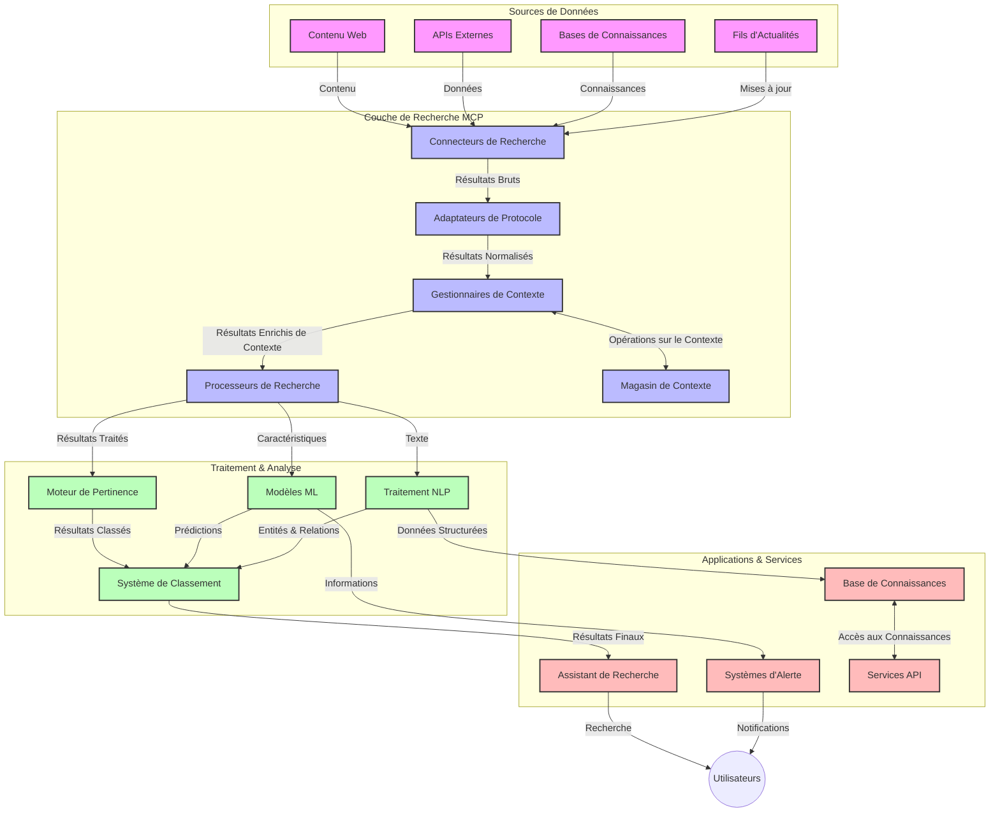
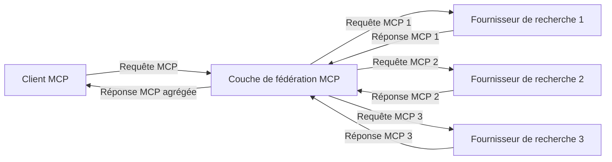
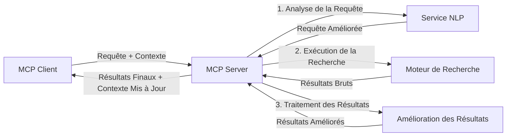

# Protocole de Contexte Modèle pour la Recherche Web en Temps Réel

## Vue d'ensemble

La recherche web en temps réel est devenue essentielle dans l’environnement actuel axé sur l’information, où les applications ont besoin d’un accès immédiat à des informations à jour sur internet afin de fournir des réponses pertinentes et opportunes. Le Protocole de Contexte Modèle (MCP) représente une avancée significative dans l’optimisation de ces processus de recherche en temps réel, améliorant l’efficacité de la recherche, préservant l’intégrité contextuelle et renforçant la performance globale du système.

Ce module explore comment le MCP transforme la recherche web en temps réel en fournissant une approche standardisée de gestion du contexte à travers les modèles IA, les moteurs de recherche et les applications.

### Ce que vous allez apprendre

Dans ce guide complet, vous découvrirez :

- Comment le MCP crée un pont fluide entre les modèles IA et les capacités de recherche web en temps réel
- Les modèles architecturaux pour implémenter des solutions de recherche efficaces et évolutives avec MCP
- Les techniques pour préserver le contexte de recherche à travers plusieurs requêtes et interactions
- Des implémentations pratiques en Python et JavaScript pour divers scénarios de recherche
- Les méthodes pour équilibrer pertinence, actualité et performance dans les systèmes de recherche propulsés par MCP

## Introduction à la Recherche Web en Temps Réel

La recherche web en temps réel est une approche technologique qui permet de requêter, traiter et analyser en continu des informations basées sur le web dès leur publication ou mise à jour, permettant aux systèmes de fournir des informations fraîches et pertinentes avec une latence minimale. Contrairement aux systèmes de recherche traditionnels qui fonctionnent sur des données indexées pouvant avoir plusieurs heures ou jours, la recherche en temps réel traite des données vivantes issues du web, offrant des insights et des informations reflétant l’état actuel du contenu en ligne.

### Concepts clés de la recherche web en temps réel :

- **Traitement Continu des Requêtes** : Les requêtes sont traitées sur des sources de données mises à jour en permanence
- **Priorisation de l’Actualité** : Les systèmes sont conçus pour privilégier les informations récentes
- **Équilibre de la Pertinence** : Maintien d’un équilibre entre pertinence et actualité
- **Architecture Évolutive** : Les systèmes doivent gérer des charges de requêtes et volumes de données variables
- **Compréhension Contextuelle** : Maintenir le contexte utilisateur au cours des itérations de recherche est crucial pour obtenir des résultats pertinents
- **Reformulation Dynamique des Requêtes** : Modification adaptative des requêtes basée sur le contexte et les résultats précédents
- **Intégration Multi-Sources** : Combinaison des résultats de plusieurs fournisseurs et sources web
- **Compréhension Sémantique** : Traitement des requêtes et contenus basé sur le sens plutôt que uniquement sur des mots-clés
- **Classement en Temps Réel** : Ajustement continu du classement des résultats à mesure que de nouvelles informations arrivent

### Le Protocole de Contexte Modèle et la Recherche Web en Temps Réel

Le Protocole de Contexte Modèle (MCP) répond à plusieurs défis critiques dans les environnements de recherche web en temps réel :

1. **Préservation du Contexte de Recherche** : MCP standardise la façon dont le contexte est maintenu à travers des composants de recherche répartis, garantissant que les modèles IA et les nœuds de traitement ont accès à l’historique pertinent des requêtes et aux préférences utilisateur.

2. **Gestion Efficace des Requêtes** : En fournissant des mécanismes structurés pour la transmission du contexte, MCP réduit la surcharge liée à la répétition du contexte à chaque itération de recherche.

3. **Interopérabilité** : MCP crée un langage commun pour le partage du contexte entre différentes technologies de recherche et modèles IA, permettant des architectures plus flexibles et extensibles.

4. **Contexte Optimisé pour la Recherche** : Les implémentations MCP peuvent prioriser les éléments contextuels les plus pertinents pour une recherche efficace, optimisant à la fois la performance et la précision.

5. **Traitement Adaptatif de la Recherche** : Grâce à une gestion contextuelle appropriée via MCP, les systèmes de recherche peuvent ajuster dynamiquement leur traitement en fonction des besoins évolutifs des utilisateurs et des paysages informationnels.

Dans les applications modernes allant de l’agrégation de nouvelles aux assistants de recherche, l’intégration de MCP avec les technologies de recherche web permet une recherche plus intelligente, consciente du contexte, capable de fournir des résultats de plus en plus pertinents au fil des interactions utilisateur.

## Objectifs d’apprentissage

À la fin de cette leçon, vous serez capable de :

- Comprendre les fondamentaux de la recherche web en temps réel et ses défis dans les applications modernes
- Expliquer comment le Protocole de Contexte Modèle (MCP) améliore les capacités de recherche web en temps réel
- Implémenter des solutions de recherche basées sur MCP en utilisant des frameworks et API populaires
- Concevoir et déployer des architectures de recherche évolutives et performantes avec MCP
- Appliquer les concepts MCP à divers cas d’usage incluant la recherche sémantique, l’assistance à la recherche et la navigation augmentée par IA
- Évaluer les tendances émergentes et les innovations futures dans les technologies de recherche basées sur MCP
- Développer des systèmes de recherche sensibles au contexte qui apprennent des interactions utilisateur
- Intégrer les capacités de recherche web dans des assistants IA en utilisant des protocoles MCP standardisés
- Créer des pipelines de recherche multi-étapes qui affinent progressivement les résultats en fonction du contexte
- Optimiser la performance de la recherche tout en maintenant une conscience contextuelle complète

### Définition et importance

La recherche web en temps réel implique la requête, la récupération et la livraison continues d’informations basées sur le web avec une latence minimale. Contrairement aux moteurs de recherche traditionnels qui parcourent et indexent périodiquement le web, la recherche en temps réel vise à faire remonter les informations dès leur disponibilité, permettant un accès immédiat aux contenus les plus actuels.

Les caractéristiques clés de la recherche web en temps réel incluent :

- **Fraîcheur** : Priorisation des contenus et mises à jour récentes
- **Traitement Continu** : Surveillance constante des nouvelles informations
- **Adaptation des Requêtes** : Affinage des requêtes en fonction du contexte et des retours
- **Livraison Immédiate** : Fourniture des résultats de recherche avec un délai minimal
- **Rétention du Contexte** : Construction sur les requêtes précédentes pour améliorer la pertinence

### Défis de la recherche web traditionnelle

Les approches traditionnelles de recherche web présentent plusieurs limites en contexte temps réel :

1. **Fragmentation du Contexte** : Difficulté à maintenir le contexte de recherche entre plusieurs requêtes
2. **Fraîcheur de l’Information** : Difficultés d’accès et de priorisation des informations les plus récentes
3. **Complexité d’Intégration** : Problèmes d’interopérabilité entre systèmes de recherche et applications
4. **Problèmes de Latence** : Équilibrer recherche exhaustive et exigences de temps de réponse
5. **Réglage de la Pertinence** : Garantir précision et pertinence tout en privilégiant l’actualité

## Comprendre le Protocole de Contexte Modèle (MCP) pour la Recherche

### Qu’est-ce que le MCP dans le contexte de la recherche ?

Le Protocole de Contexte Modèle (MCP) est un protocole de communication standardisé conçu pour faciliter une interaction efficace entre modèles IA et applications. Dans le contexte de la recherche web en temps réel, MCP fournit un cadre pour :

- Préserver le contexte de recherche tout au long des séquences de requêtes
- Standardiser les formats des requêtes et résultats de recherche
- Optimiser la transmission des paramètres et résultats de recherche
- Améliorer la communication entre modèles et moteurs de recherche

### Composants clés et architecture

L’architecture MCP pour la recherche web en temps réel comprend plusieurs composants clés :

1. **Gestionnaires de Contexte de Requête** : Gèrent et maintiennent le contexte de recherche à travers plusieurs requêtes
2. **Processeurs de Recherche** : Traitent les requêtes entrantes en utilisant des techniques conscientes du contexte
3. **Adaptateurs de Protocole** : Convertissent entre différentes API de recherche tout en préservant le contexte
4. **Stockage de Contexte** : Stockent et récupèrent efficacement l’historique de recherche et les préférences
5. **Connecteurs de Recherche** : Se connectent à divers moteurs de recherche et API web



### Comment MCP améliore la recherche web en temps réel

MCP répond aux défis traditionnels de la recherche web par :

- **Continuité Contextuelle** : Maintenir les relations entre requêtes durant toute la session de recherche
- **Transmission Optimisée** : Réduire la redondance des paramètres de recherche via une gestion intelligente du contexte
- **Interfaces Standardisées** : Fournir des API cohérentes pour les composants de recherche
- **Réduction de la Latence** : Minimiser le surcoût de traitement par une gestion efficace du contexte
- **Pertinence Améliorée** : Accroître la pertinence des résultats en préservant l’intention utilisateur à travers les requêtes multiples

## Intégration et mise en œuvre

Les systèmes de recherche web en temps réel requièrent une conception architecturale soignée et une mise en œuvre pour maintenir à la fois performance et intégrité contextuelle. Le Protocole de Contexte Modèle offre une approche standardisée pour intégrer les modèles IA et les technologies de recherche, permettant des chaînes de recherche plus sophistiquées et conscientes du contexte.

### Aperçu de l’intégration MCP dans les architectures de recherche

Mettre en œuvre MCP dans des environnements de recherche web en temps réel implique plusieurs considérations clés :

1. **Sérialisation du Contexte de Recherche** : MCP fournit des mécanismes efficaces pour encoder les informations contextuelles dans les requêtes de recherche, assurant que le contexte essentiel suit la requête tout au long du pipeline de traitement. Cela inclut des formats de sérialisation standardisés optimisés pour les métadonnées liées à la recherche.

2. **Traitement Stateful de la Recherche** : MCP permet un traitement plus intelligent avec maintien d’état en assurant une représentation cohérente du contexte à travers les itérations de recherche. Ceci est particulièrement utile dans les pipelines de recherche multi-étapes où le raffinement du contexte améliore les résultats.

3. **Expansion et Raffinement de Requête** : Les implémentations MCP dans les systèmes de recherche peuvent faciliter une expansion et un raffinement sophistiqués des requêtes basés sur le contexte accumulé, permettant des résultats de plus en plus pertinents au fil de la session.

4. **Mise en Cache et Priorisation des Résultats** : En standardisant la gestion du contexte, MCP aide à gérer la mise en cache et la priorisation des résultats, permettant aux composants de s’adapter en fonction du contexte de recherche évolutif.

5. **Fédération et Agrégation de Recherche** : MCP facilite la fédération plus sophistiquée de la recherche à travers plusieurs backends en fournissant des représentations structurées du contexte, permettant une agrégation plus significative des résultats provenant de diverses sources.

La mise en œuvre de MCP à travers différentes technologies de recherche crée une approche unifiée de gestion du contexte, réduisant le besoin de code d’intégration personnalisé tout en améliorant la capacité du système à maintenir un contexte significatif à mesure que les requêtes de recherche évoluent.

### MCP dans diverses implémentations de recherche web

Ces exemples suivent la spécification MCP actuelle qui se concentre sur un protocole basé sur JSON-RPC avec des mécanismes de transport distincts. Le code démontre comment vous pouvez implémenter des intégrations de recherche personnalisées tout en maintenant une compatibilité totale avec le protocole MCP.


<details>
<summary>Implémentation Python avec API de Recherche Générique</summary>

```python
import asyncio
import json
import aiohttp
from typing import Dict, Any, Optional, List
from contextlib import asynccontextmanager
from collections.abc import AsyncIterator

# Importer les bibliothèques MCP standard
from mcp.client.session import ClientSession
from mcp.client.streamable_http import streamablehttp_client
from mcp.types import TextContent, CreateMessageRequestParams, CreateMessageResult
from mcp.server.fastmcp import FastMCP

# Créer un serveur FastMCP pour la recherche sur le web
search_server = FastMCP("WebSearch")

# Classe pour gérer les opérations de recherche sur le web
class WebSearchHandler:
    def __init__(self, api_endpoint: str, api_key: str):
        self.api_endpoint = api_endpoint
        self.api_key = api_key
        self.session = None
        
    async def initialize(self):
        """Initialize the HTTP session"""
        self.session = aiohttp.ClientSession(
            headers={"Authorization": f"Bearer {self.api_key}"}
        )
    
    async def close(self):
        """Close the HTTP session"""
        if self.session:
            await self.session.close()
            
    async def perform_search(self, query: str, max_results: int = 5, 
                           include_domains: List[str] = None, 
                           exclude_domains: List[str] = None,
                           time_period: str = "any") -> Dict[str, Any]:
        """Perform web search using the search API"""
        # Construire les paramètres de recherche
        search_params = {
            "q": query,
            "limit": max_results,
            "time": time_period
        }
        
        if include_domains:
            search_params["site"] = ",".join(include_domains)
            
        if exclude_domains:
            search_params["exclude_site"] = ",".join(exclude_domains)
        
        # Effectuer la requête de recherche
        try:
            async with self.session.get(
                self.api_endpoint,
                params=search_params
            ) as response:
                if response.status != 200:
                    error_text = await response.text()
                    raise Exception(f"Search API error: {response.status} - {error_text}")
                
                search_data = await response.json()
                
                # Transformer la réponse spécifique à l'API en un format standard
                results = []
                for item in search_data.get("results", []):
                    results.append({
                        "title": item.get("title", ""),
                        "url": item.get("url", ""),
                        "snippet": item.get("snippet", ""),
                        "date": item.get("published_date", ""),
                        "source": item.get("source", "")
                    })
                
                return {
                    "query": query,
                    "totalResults": len(results),
                    "results": results
                }
        except Exception as e:
            print(f"Search API request error: {e}")
            raise

# Initialiser le gestionnaire de recherche
search_handler = WebSearchHandler(
    api_endpoint="https://api.search-service.example/search",
    api_key="your-api-key-here"
)

# Configurer la durée de vie pour gérer le gestionnaire de recherche
@asyncio.asynccontextmanager
async def app_lifespan(server: FastMCP):
    """Manage application lifecycle"""
    await search_handler.initialize()
    try:
        yield {"search_handler": search_handler}
    finally:
        await search_handler.close()

# Définir la durée de vie pour le serveur
search_server = FastMCP("WebSearch", lifespan=app_lifespan)

# Enregistrer un outil de recherche sur le web
@search_server.tool()
async def web_search(query: str, max_results: int = 5, 
                   include_domains: List[str] = None,
                   exclude_domains: List[str] = None,
                   time_period: str = "any") -> Dict[str, Any]:
    """
    Search the web for information
    
    Args:
        query: The search query
        max_results: Maximum number of results to return (default: 5)
        include_domains: List of domains to include in search results
        exclude_domains: List of domains to exclude from search results
        time_period: Time period for results ("day", "week", "month", "any")
        
    Returns:
        Dictionary containing search results
    """
    ctx = search_server.get_context()
    search_handler = ctx.request_context.lifespan_context["search_handler"]
    
    results = await search_handler.perform_search(
        query=query,
        max_results=max_results,
        include_domains=include_domains,
        exclude_domains=exclude_domains,
        time_period=time_period
    )
    
    return results

# Exemple d'utilisation client
async def client_example():
    # Se connecter au serveur de recherche en utilisant le transport HTTP Streamable
    async with streamablehttp_client("http://localhost:8000/mcp") as (read, write, _):
        async with ClientSession(read, write) as session:
            # Initialiser la connexion
            await session.initialize()
            
            # Appeler l'outil web_search
            search_results = await session.call_tool(
                "web_search", 
                {
                    "query": "latest developments in AI and Model Context Protocol",
                    "max_results": 5,
                    "time_period": "day",
                    "include_domains": ["github.com", "microsoft.com"]
                }
            )
            
            print(f"Search results: {search_results}")

# Exemple d'exécution du serveur
if __name__ == "__main__":
    # Lancer le serveur avec le transport HTTP Streamable
    search_server.run(transport="streamable-http")
```
</details> 

<details>
<summary>Implémentation JavaScript avec Recherche Basée sur Navigateur</summary>


```javascript
// Implémentation du serveur MCP pour la recherche web
import { McpServer, ResourceTemplate } from '@modelcontextprotocol/sdk/server/mcp.js';
import { StreamableHTTPServerTransport } from '@modelcontextprotocol/sdk/server/streamableHttp.js';
import { z } from 'zod';

// Créer un serveur MCP pour la recherche web
const searchServer = new McpServer({
    name: "BrowserSearch",
    description: "A server that provides web search capabilities"
});

// Classe de service de recherche
class SearchService {
    constructor(searchApiUrl, apiKey) {
        this.searchApiUrl = searchApiUrl;
        this.apiKey = apiKey;
    }

    async performSearch(parameters) {
        const {
            query = '',
            maxResults = 5,
            includeDomains = [],
            excludeDomains = [],
            timePeriod = 'any'
        } = parameters;
        
        // Construire l'URL de recherche avec les paramètres
        const url = new URL(this.searchApiUrl);
        url.searchParams.append('q', query);
        url.searchParams.append('limit', maxResults);
        url.searchParams.append('time', timePeriod);
        
        if (includeDomains.length > 0) {
            url.searchParams.append('site', includeDomains.join(','));
        }
        
        if (excludeDomains.length > 0) {
            url.searchParams.append('exclude_site', excludeDomains.join(','));
        }
        
        try {
            const response = await fetch(url.toString(), {
                method: 'GET',
                headers: {
                    'Authorization': `Bearer ${this.apiKey}`,
                    'Content-Type': 'application/json'
                }
            });
            
            if (!response.ok) {
                const errorText = await response.text();
                throw new Error(`Search API error: ${response.status} - ${errorText}`);
            }
            
            const searchData = await response.json();
            
            // Transformer la réponse spécifique à l'API en un format standard
            const results = searchData.results?.map(item => ({
                title: item.title || '',
                url: item.url || '',
                snippet: item.snippet || '',
                date: item.published_date || '',
                source: item.source || ''
            })) || [];
            
            return {
                query,
                totalResults: results.length,
                results
            };
        } catch (error) {
            console.error('Search API request error:', error);
            throw error;
        }
    }
}

// Initialiser le service de recherche
const searchService = new SearchService(
    'https://api.search-service.example/search',
    'your-api-key-here'
);

// Configurer le fournisseur de contexte pour le serveur
searchServer.setContextProvider(() => {
    return {
        searchService
    };
});

// Enregistrer l'outil de recherche web
searchServer.tool({
    name: 'web_search',
    description: 'Search the web for information',
    parameters: {
        type: 'object',
        properties: {
            query: {
                type: 'string',
                description: 'The search query'
            },
            maxResults: {
                type: 'integer',
                description: 'Maximum number of results to return',
                default: 5
            },
            includeDomains: {
                type: 'array',
                items: { type: 'string' },
                description: 'List of domains to include in search results'
            },
            excludeDomains: {
                type: 'array',
                items: { type: 'string' },
                description: 'List of domains to exclude from search results'
            },
            timePeriod: {
                type: 'string',
                description: 'Time period for results',
                enum: ['day', 'week', 'month', 'any'],
                default: 'any'
            }
        },
        required: ['query']
    },
    handler: async (params, context) => {
        const { searchService } = context;
        return await searchService.performSearch(params);
    }
});

// Exemple de code client pour se connecter au serveur de recherche
import { Client } from '@modelcontextprotocol/sdk/client/index.js';
import { StreamableHTTPClientTransport } from '@modelcontextprotocol/sdk/client/streamableHttp.js';

async function connectToSearchServer() {
    // Se connecter au serveur de recherche
    const transport = new StreamableHTTPClientTransport(
        new URL('http://localhost:8000/mcp')
    );
    
    const client = new Client({
        name: 'search-client',
        version: '1.0.0'
    });
    
    await client.connect(transport);
    
    // Exécuter l'outil de recherche
    const searchResults = await client.callTool({
        name: 'web_search',
        arguments: {
            query: 'Model Context Protocol implementation examples',
            maxResults: 10,
            timePeriod: 'week',
            includeDomains: ['github.com', 'docs.microsoft.com']
        }
    });
    
    console.log('Search results:', searchResults);
    
    // Nettoyage
    await client.disconnect();
}

// Démarrer le serveur
const transport = new StreamableHTTPServerTransport();
await searchServer.connect(transport);
console.log('Search server running at http://localhost:8000/mcp');

// Dans un processus séparé ou après le démarrage du serveur
// connectToSearchServer().catch(console.error);
```
</details> 


## Avertissement sur les exemples de code

> **Note importante** : Les exemples de code ci-dessous démontrent l’intégration du Protocole de Contexte Modèle (MCP) avec la fonctionnalité de recherche web. Bien qu’ils suivent les modèles et structures des SDK MCP officiels, ils ont été simplifiés à des fins pédagogiques.
> 
> Ces exemples présentent :
> 
> 1. **Implémentation Python** : Une implémentation serveur FastMCP qui fournit un outil de recherche web et se connecte à une API de recherche externe. Cet exemple illustre une gestion adéquate du cycle de vie, la gestion du contexte et l’implémentation d’outil suivant les modèles du [SDK MCP Python officiel](https://github.com/modelcontextprotocol/python-sdk). Le serveur utilise le transport HTTP Streamable recommandé qui a supplanté l’ancien transport SSE pour les déploiements en production.
> 
> 2. **Implémentation JavaScript** : Une implémentation TypeScript/JavaScript utilisant le pattern FastMCP issu du [SDK MCP TypeScript officiel](https://github.com/modelcontextprotocol/typescript-sdk) pour créer un serveur de recherche avec des définitions d’outils appropriées et des connexions clients. Elle suit les modèles recommandés les plus récents pour la gestion de session et la préservation du contexte.
> 
> Ces exemples nécessiteraient des mécanismes supplémentaires de gestion des erreurs, d’authentification et de code d’intégration API spécifique pour une utilisation en production. Les points de terminaison API de recherche affichés (`https://api.search-service.example/search`) sont des espaces réservés et devraient être remplacés par des points de service de recherche réels.
> 
> Pour des détails complets d’implémentation et les approches les plus récentes, veuillez consulter la [spécification MCP officielle](https://spec.modelcontextprotocol.io/) et la documentation des SDK.

## Concepts clés

### Le cadre du Protocole de Contexte Modèle (MCP)

Au cœur du MCP, ce protocole fournit une méthode standardisée pour que les modèles IA, applications et services échangent le contexte. Dans la recherche web en temps réel, ce cadre est essentiel pour créer des expériences de recherche cohérentes à interactions multiples. Les composants clés comprennent :

1. **Architecture Client-Serveur** : MCP établit une séparation claire entre clients de recherche (demandeurs) et serveurs de recherche (prestataires), permettant des modèles de déploiement flexibles.

2. **Communication JSON-RPC** : Le protocole utilise JSON-RPC pour l’échange de messages, le rendant compatible avec les technologies web et facile à implémenter sur différentes plateformes.

3. **Gestion du Contexte** : MCP définit des méthodes structurées pour maintenir, mettre à jour et exploiter le contexte de recherche à travers multiples interactions.

4. **Définitions d’Outils** : Les capacités de recherche sont exposées comme des outils standardisés avec des paramètres et valeurs de retour bien définis.

5. **Support du Streaming** : Le protocole supporte le streaming des résultats, essentiel pour la recherche en temps réel où les résultats peuvent arriver de façon progressive.

### Modèles d’intégration de recherche web

Lors de l’intégration de MCP avec la recherche web, plusieurs modèles apparaissent :

#### 1. Intégration directe du fournisseur de recherche


Dans ce modèle, le serveur MCP interfère directement avec une ou plusieurs API de recherche, traduisant les requêtes MCP en appels spécifiques à l’API et formatant les résultats en réponses MCP.

#### 2. Recherche fédérée avec préservation du contexte



Ce modèle répartit les requêtes de recherche à travers plusieurs fournisseurs compatibles MCP, chacun pouvant se spécialiser dans différents types de contenu ou capacités de recherche, tout en maintenant un contexte unifié.

#### 3. Chaîne de recherche enrichie par le contexte



Dans ce modèle, le processus de recherche est divisé en plusieurs étapes, le contexte étant enrichi à chaque phase, aboutissant à des résultats progressivement plus pertinents.

### Composants du contexte de recherche

Dans la recherche web basée MCP, le contexte comprend typiquement :

- **Historique des requêtes** : Les requêtes précédentes dans la session
- **Préférences utilisateur** : Langue, région, paramètres de recherche sécurisée
- **Historique des interactions** : Résultats cliqués, temps passé sur les résultats
- **Paramètres de recherche** : Filtres, ordres de tri et autres modificateurs
- **Connaissances de domaine** : Contexte spécifique au sujet pertinent pour la recherche
- **Contexte temporel** : Facteurs de pertinence basés sur le temps
- **Préférences de source** : Sources d’information fiables ou privilégiées

## Cas d’usage et applications

### Recherche et collecte d’informations

MCP améliore les flux de travail de recherche par :

- La conservation du contexte de recherche à travers les sessions
- La possibilité de requêtes plus sophistiquées et contextuellement pertinentes
- Le support de la fédération de recherche multi-sources
- La facilitation de l’extraction de connaissances à partir des résultats

### Suivi des actualités et des tendances en temps réel

La recherche alimentée par MCP offre des avantages pour la surveillance des nouvelles :

- Découverte quasi temps réel des actualités émergentes
- Filtrage contextuel de l’information pertinente
- Suivi des sujets et entités à travers plusieurs sources
- Alertes personnalisées basées sur le contexte utilisateur

### Navigation et recherche augmentées par IA

MCP crée de nouvelles possibilités pour la navigation augmentée par IA :

- Suggestions de recherche contextuelles basées sur l’activité du navigateur
- Intégration fluide de la recherche web avec des assistants propulsés par LLM
- Raffinement multi-tours de la recherche avec maintien du contexte
- Vérification factuelle améliorée et vérification de l’information

## Tendances et innovations futures

### Évolution du MCP dans la recherche web

En regardant vers l’avenir, nous anticipons que MCP évoluera pour aborder :
- **Recherche multimodale** : Intégration de la recherche textuelle, image, audio et vidéo avec conservation du contexte  
- **Recherche décentralisée** : Prise en charge des écosystèmes de recherche distribués et fédérés  
- **Confidentialité de la recherche** : Mécanismes de recherche respectueux de la vie privée et sensibles au contexte  
- **Compréhension des requêtes** : Analyse sémantique approfondie des requêtes de recherche en langage naturel  

### Progrès technologiques potentiels

Technologies émergentes qui façonneront l'avenir de la recherche MCP :

1. **Architectures de recherche neuronale** : Systèmes de recherche basés sur des embeddings optimisés pour MCP  
2. **Contexte de recherche personnalisé** : Apprentissage des comportements de recherche individuels au fil du temps  
3. **Intégration de graphes de connaissances** : Recherche contextuelle enrichie par des graphes de connaissances spécifiques au domaine  
4. **Contexte intermodal** : Maintien du contexte à travers différentes modalités de recherche  

## Exercices pratiques

### Exercice 1 : Mise en place d’une pipeline de recherche MCP basique

Dans cet exercice, vous apprendrez à :  
- Configurer un environnement de recherche MCP basique  
- Implémenter des gestionnaires de contexte pour la recherche web  
- Tester et valider la conservation du contexte à travers les itérations de recherche  

### Exercice 2 : Construction d’un assistant de recherche avec MCP

Créez une application complète qui :  
- Traite des questions de recherche en langage naturel  
- Effectue des recherches web sensibles au contexte  
- Synthétise les informations provenant de multiples sources  
- Présente les résultats de recherche organisés  

### Exercice 3 : Mise en œuvre de la fédération de recherche multi-source avec MCP

Exercice avancé couvrant :  
- L’envoi de requêtes sensibles au contexte vers plusieurs moteurs de recherche  
- Le classement et l’agrégation des résultats  
- La déduplication contextuelle des résultats de recherche  
- La gestion des métadonnées spécifiques aux sources  

## Ressources supplémentaires

- [Model Context Protocol Specification](https://spec.modelcontextprotocol.io/) - Spécification officielle du MCP et documentation détaillée du protocole  
- [Model Context Protocol Documentation](https://modelcontextprotocol.io/) - Tutoriels détaillés et guides d’implémentation  
- [MCP Python SDK](https://github.com/modelcontextprotocol/python-sdk) - Implémentation officielle Python du protocole MCP  
- [MCP TypeScript SDK](https://github.com/modelcontextprotocol/typescript-sdk) - Implémentation officielle TypeScript du protocole MCP  
- [MCP Reference Servers](https://github.com/modelcontextprotocol/servers) - Implémentations de référence des serveurs MCP  
- [Bing Web Search API Documentation](https://learn.microsoft.com/en-us/bing/search-apis/bing-web-search/overview) - API de recherche web de Microsoft  
- [Google Custom Search JSON API](https://developers.google.com/custom-search/v1/overview) - Moteur de recherche programmable de Google  
- [SerpAPI Documentation](https://serpapi.com/search-api) - API des pages de résultats des moteurs de recherche  
- [Meilisearch Documentation](https://www.meilisearch.com/docs) - Moteur de recherche open source  
- [Elasticsearch Documentation](https://www.elastic.co/guide/index.html) - Moteur de recherche et d’analyse distribué  
- [LangChain Documentation](https://python.langchain.com/docs/get_started/introduction) - Création d’applications avec des LLM  

## Résultats d’apprentissage

En terminant ce module, vous serez capable de :  

- Comprendre les fondamentaux de la recherche web en temps réel et ses défis  
- Expliquer comment le Model Context Protocol (MCP) améliore les capacités de recherche web en temps réel  
- Implémenter des solutions de recherche basées sur MCP en utilisant des frameworks et API populaires  
- Concevoir et déployer des architectures de recherche évolutives et performantes avec MCP  
- Appliquer les concepts MCP à divers cas d’usage incluant la recherche sémantique, l’assistance à la recherche et la navigation augmentée par IA  
- Évaluer les tendances émergentes et les innovations futures dans les technologies de recherche basées sur MCP  

### Considérations de confiance et de sécurité

Lors de la mise en œuvre de solutions de recherche web basées sur MCP, gardez à l’esprit ces principes importants issus de la spécification MCP :  

1. **Consentement et contrôle de l’utilisateur** : Les utilisateurs doivent consentir explicitement et comprendre tous les accès aux données et opérations. Ceci est particulièrement important pour les implémentations de recherche web pouvant accéder à des sources de données externes.  

2. **Confidentialité des données** : Assurez un traitement approprié des requêtes et résultats de recherche, notamment lorsqu’ils peuvent contenir des informations sensibles. Mettez en place des contrôles d’accès adéquats pour protéger les données utilisateur.  

3. **Sécurité des outils** : Implémentez des mécanismes d’autorisation et de validation pour les outils de recherche, car ils représentent des risques potentiels de sécurité via l’exécution de code arbitraire. Les descriptions du comportement des outils doivent être considérées comme non fiables sauf si elles proviennent d’un serveur de confiance.  

4. **Documentation claire** : Fournissez une documentation claire sur les capacités, limites et considérations de sécurité de votre implémentation de recherche basée sur MCP, en suivant les directives d’implémentation de la spécification MCP.  

5. **Flux de consentement robustes** : Construisez des flux robustes de consentement et d’autorisation qui expliquent clairement ce que fait chaque outil avant de l’autoriser, notamment pour les outils qui interagissent avec des ressources web externes.  

Pour tous les détails sur la sécurité et la confiance dans MCP, consultez la [documentation officielle](https://modelcontextprotocol.io/specification/2025-11-25/basic/security_best_practices).  

## Quelle est la suite  

- [5.12 Authentification Entra ID pour les serveurs Model Context Protocol](../mcp-security-entra/README.md)

---

<!-- CO-OP TRANSLATOR DISCLAIMER START -->
**Avertissement** :
Ce document a été traduit à l'aide du service de traduction automatique [Co-op Translator](https://github.com/Azure/co-op-translator). Bien que nous nous efforçions d'assurer l'exactitude, veuillez noter que les traductions automatisées peuvent contenir des erreurs ou des inexactitudes. Le document original dans sa langue native doit être considéré comme la source faisant autorité. Pour les informations critiques, il est recommandé de recourir à une traduction professionnelle réalisée par un humain. Nous ne saurions être tenus responsables des malentendus ou erreurs d'interprétation découlant de l'utilisation de cette traduction.
<!-- CO-OP TRANSLATOR DISCLAIMER END -->