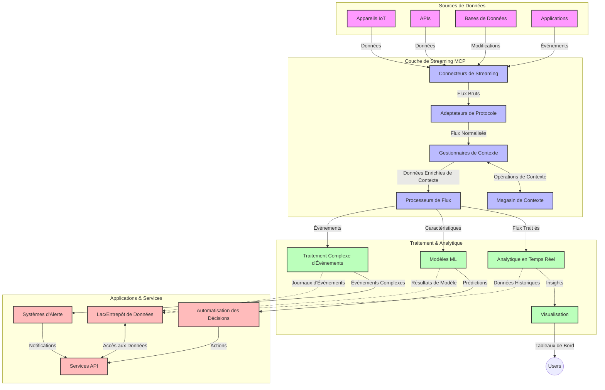

# Protocole de Contexte de Modèle pour le Streaming de Données en Temps Réel

## Aperçu

Le streaming de données en temps réel est devenu essentiel dans le monde axé sur les données d’aujourd’hui, où les entreprises et les applications nécessitent un accès immédiat à l’information pour prendre des décisions en temps opportun. Le Protocole de Contexte de Modèle (MCP) représente une avancée significative dans l’optimisation de ces processus de streaming en temps réel, améliorant l’efficacité du traitement des données, maintenant l’intégrité contextuelle et améliorant la performance globale du système.

Ce module explore comment le MCP transforme le streaming de données en temps réel en fournissant une approche standardisée de la gestion du contexte entre les modèles IA, les plateformes de streaming et les applications.

## Introduction au Streaming de Données en Temps Réel

Le streaming de données en temps réel est un paradigme technologique qui permet le transfert, le traitement et l’analyse continus des données dès leur génération, permettant aux systèmes de réagir immédiatement à de nouvelles informations. Contrairement au traitement par lots traditionnel qui opère sur des jeux de données statiques, le streaming traite les données en mouvement, fournissant des analyses et des actions avec une latence minimale.

### Concepts Clés du Streaming de Données en Temps Réel :

- **Flux Continu de Données** : Les données sont traitées sous forme d’un flux continu et ininterrompu d’événements ou d’enregistrements.
- **Traitement à Faible Latence** : Les systèmes sont conçus pour minimiser le temps entre la génération des données et leur traitement.
- **Scalabilité** : Les architectures de streaming doivent gérer des volumes et des vitesses de données variables.
- **Tolérance aux Pannes** : Les systèmes doivent être résilients face aux pannes pour garantir un flux de données ininterrompu.
- **Traitement avec État** : Maintenir le contexte entre les événements est crucial pour une analyse significative.

### Le Protocole de Contexte de Modèle et le Streaming en Temps Réel

Le Protocole de Contexte de Modèle (MCP) répond à plusieurs défis critiques dans les environnements de streaming en temps réel :

1. **Continuité Contextuelle** : Le MCP standardise la manière dont le contexte est maintenu à travers les composants de streaming distribués, garantissant que les modèles IA et les nœuds de traitement ont accès au contexte historique et environnemental pertinent.

2. **Gestion Efficace de l’État** : En fournissant des mécanismes structurés pour la transmission du contexte, le MCP réduit la surcharge de gestion de l’état dans les pipelines de streaming.

3. **Interopérabilité** : Le MCP crée un langage commun pour le partage de contexte entre diverses technologies de streaming et modèles IA, permettant des architectures plus flexibles et extensibles.

4. **Contexte Optimisé pour le Streaming** : Les implémentations du MCP peuvent prioriser quels éléments de contexte sont les plus pertinents pour la prise de décision en temps réel, optimisant à la fois la performance et la précision.

5. **Traitement Adaptatif** : Grâce à une bonne gestion du contexte via MCP, les systèmes de streaming peuvent ajuster dynamiquement le traitement en fonction des conditions et des tendances évolutives des données.

Dans les applications modernes allant des réseaux de capteurs IoT aux plateformes de trading financier, l’intégration du MCP avec les technologies de streaming permet un traitement plus intelligent et conscient du contexte, capable de répondre de manière appropriée à des situations complexes et évolutives en temps réel.

## Objectifs d’Apprentissage

À la fin de cette leçon, vous serez capable de :

- Comprendre les fondamentaux du streaming de données en temps réel et ses défis
- Expliquer comment le Protocole de Contexte de Modèle (MCP) améliore le streaming de données en temps réel
- Implémenter des solutions de streaming basées sur MCP utilisant des frameworks populaires comme Kafka et Pulsar
- Concevoir et déployer des architectures de streaming tolérantes aux pannes et à haute performance avec MCP
- Appliquer les concepts du MCP aux cas d’usage IoT, trading financier, et analyses pilotées par l’IA
- Évaluer les tendances émergentes et les innovations futures dans les technologies de streaming basées sur MCP

### Définition et Importance

Le streaming de données en temps réel implique la génération, le traitement et la livraison continus des données avec une latence minimale. Contrairement au traitement par lots, où les données sont collectées puis traitées en groupes, le streaming traite les données de manière incrémentielle dès leur arrivée, permettant des insights et des actions immédiats.

Les caractéristiques clés du streaming de données en temps réel comprennent :

- **Faible Latence** : Traitement et analyse des données en millisecondes à secondes
- **Flux Continu** : Flux ininterrompus de données provenant de diverses sources
- **Traitement Immédiat** : Analyse des données à leur arrivée plutôt qu’en lots
- **Architecture Événementielle** : Réponse aux événements au moment où ils se produisent

### Défis dans le Streaming de Données Traditionnel

Les approches traditionnelles de streaming de données font face à plusieurs limitations :

1. **Perte de Contexte** : Difficulté à maintenir le contexte à travers des systèmes distribués
2. **Problèmes de Scalabilité** : Difficultés à évoluer pour gérer des données à haut volume et haute vélocité
3. **Complexité d’Intégration** : Problèmes d’interopérabilité entre différents systèmes
4. **Gestion de la Latence** : Équilibre entre débit et temps de traitement
5. **Cohérence des Données** : Garantie de l’exactitude et de l’exhaustivité des données à travers le flux

## Comprendre le Protocole de Contexte de Modèle (MCP)

### Qu’est-ce que le MCP ?

Le Protocole de Contexte de Modèle (MCP) est un protocole de communication standardisé conçu pour faciliter une interaction efficace entre les modèles IA et les applications. Dans le contexte du streaming de données en temps réel, le MCP fournit un cadre pour :

- Préserver le contexte tout au long du pipeline de données
- Standardiser les formats d’échange de données
- Optimiser la transmission de grands ensembles de données
- Améliorer la communication entre modèles et entre modèles et applications

### Composants Clés et Architecture

L’architecture du MCP pour le streaming en temps réel se compose de plusieurs composants clés :

1. **Gestionnaires de Contexte** : Gèrent et maintiennent l’information contextuelle tout au long du pipeline de streaming
2. **Processeurs de Flux** : Traitent les flux de données entrants en utilisant des techniques conscientes du contexte
3. **Adaptateurs de Protocole** : Convertissent entre différents protocoles de streaming tout en préservant le contexte
4. **Magasin de Contexte** : Stocke et récupère efficacement les informations contextuelles
5. **Connecteurs de Streaming** : Se connectent à diverses plateformes de streaming (Kafka, Pulsar, Kinesis, etc.)



### Comment le MCP Améliore la Gestion des Données en Temps Réel

Le MCP répond aux défis traditionnels du streaming par :

- **Intégrité Contextuelle** : Maintien des relations entre les points de données à travers tout le pipeline
- **Transmission Optimisée** : Réduction des redondances dans les échanges de données grâce à une gestion intelligente du contexte
- **Interfaces Standardisées** : Fourniture d’API cohérentes pour les composants de streaming
- **Latence Réduite** : Minimisation de la surcharge de traitement grâce à une gestion efficace du contexte
- **Scalabilité Améliorée** : Support de la montée en charge horizontale tout en préservant le contexte

## Intégration et Implémentation

Les systèmes de streaming de données en temps réel nécessitent une conception et une implémentation architecturales soigneuses pour maintenir à la fois la performance et l’intégrité contextuelle. Le Protocole de Contexte de Modèle offre une approche standardisée d’intégration des modèles IA et des technologies de streaming, permettant des pipelines de traitement plus sophistiqués et conscients du contexte.

### Aperçu de l’Intégration du MCP dans les Architectures de Streaming

La mise en œuvre du MCP dans des environnements de streaming en temps réel implique plusieurs considérations clés :

1. **Sérialisation et Transport du Contexte** : Le MCP fournit des mécanismes efficaces pour encoder l’information contextuelle dans les paquets de données en streaming, assurant que le contexte essentiel accompagne les données tout au long du pipeline de traitement. Cela inclut des formats de sérialisation standardisés optimisés pour le transport en streaming.

2. **Traitement d’État Stateful** : Le MCP permet un traitement intelligent avec état en maintenant une représentation cohérente du contexte à travers les nœuds de traitement. Ceci est particulièrement utile dans les architectures de streaming distribuées où la gestion d’état est traditionnellement difficile.

3. **Temps d’Événement vs Temps de Traitement** : Les implémentations MCP dans les systèmes de streaming doivent aborder le défi courant de différencier le moment de survenue des événements et le moment de leur traitement. Le protocole peut intégrer un contexte temporel qui préserve la sémantique du temps d’événement.

4. **Gestion de la Contre-pression (Backpressure)** : En standardisant la gestion du contexte, le MCP aide à gérer la contre-pression dans les systèmes de streaming, permettant aux composants de communiquer leurs capacités de traitement et d’ajuster le flux en conséquence.

5. **Fenêtrage et Agrégation de Contexte** : Le MCP facilite des opérations de fenêtrage plus sophistiquées en fournissant des représentations structurées des contextes temporels et relationnels, permettant des agrégations plus significatives à travers les flux d’événements.

6. **Traitement Exactly-Once** : Dans les systèmes de streaming nécessitant une sémantique « exactement une fois », le MCP peut incorporer des métadonnées de traitement pour aider à suivre et vérifier le statut du traitement à travers des composants distribués.

La mise en œuvre du MCP à travers diverses technologies de streaming crée une approche unifiée de la gestion du contexte, réduisant la nécessité de code d’intégration personnalisé tout en renforçant la capacité du système à maintenir un contexte significatif au fur et à mesure que les données traversent le pipeline.

### MCP dans Divers Frameworks de Streaming de Données

Ces exemples suivent la spécification actuelle du MCP qui se concentre sur un protocole basé sur JSON-RPC avec des mécanismes de transport distincts. Le code montre comment implémenter des transports personnalisés qui intègrent des plateformes de streaming comme Kafka et Pulsar tout en conservant une compatibilité complète avec le protocole MCP.

Les exemples sont conçus pour montrer comment les plateformes de streaming peuvent être intégrées avec MCP afin de fournir un traitement de données en temps réel tout en préservant la conscience contextuelle centrale au MCP. Cette approche garantit que les exemples de code reflètent avec précision l’état actuel de la spécification MCP à juin 2025.

MCP peut être intégré avec des frameworks de streaming populaires, notamment :

#### Intégration Apache Kafka

```python
import asyncio
import json
from typing import Dict, Any, Optional
from confluent_kafka import Consumer, Producer, KafkaError
from mcp.client import Client, ClientCapabilities
from mcp.core.message import JsonRpcMessage
from mcp.core.transports import Transport

# Classe de transport personnalisée pour relier MCP avec Kafka
class KafkaMCPTransport(Transport):
    def __init__(self, bootstrap_servers: str, input_topic: str, output_topic: str):
        self.bootstrap_servers = bootstrap_servers
        self.input_topic = input_topic
        self.output_topic = output_topic
        self.producer = Producer({'bootstrap.servers': bootstrap_servers})
        self.consumer = Consumer({
            'bootstrap.servers': bootstrap_servers,
            'group.id': 'mcp-client-group',
            'auto.offset.reset': 'earliest'
        })
        self.message_queue = asyncio.Queue()
        self.running = False
        self.consumer_task = None
        
    async def connect(self):
        """Connect to Kafka and start consuming messages"""
        self.consumer.subscribe([self.input_topic])
        self.running = True
        self.consumer_task = asyncio.create_task(self._consume_messages())
        return self
        
    async def _consume_messages(self):
        """Background task to consume messages from Kafka and queue them for processing"""
        while self.running:
            try:
                msg = self.consumer.poll(1.0)
                if msg is None:
                    await asyncio.sleep(0.1)
                    continue
                
                if msg.error():
                    if msg.error().code() == KafkaError._PARTITION_EOF:
                        continue
                    print(f"Consumer error: {msg.error()}")
                    continue
                
                # Analyser la valeur du message comme JSON-RPC
                try:
                    message_str = msg.value().decode('utf-8')
                    message_data = json.loads(message_str)
                    mcp_message = JsonRpcMessage.from_dict(message_data)
                    await self.message_queue.put(mcp_message)
                except Exception as e:
                    print(f"Error parsing message: {e}")
            except Exception as e:
                print(f"Error in consumer loop: {e}")
                await asyncio.sleep(1)
    
    async def read(self) -> Optional[JsonRpcMessage]:
        """Read the next message from the queue"""
        try:
            message = await self.message_queue.get()
            return message
        except Exception as e:
            print(f"Error reading message: {e}")
            return None
    
    async def write(self, message: JsonRpcMessage) -> None:
        """Write a message to the Kafka output topic"""
        try:
            message_json = json.dumps(message.to_dict())
            self.producer.produce(
                self.output_topic,
                message_json.encode('utf-8'),
                callback=self._delivery_report
            )
            self.producer.poll(0)  # Déclencher les callbacks
        except Exception as e:
            print(f"Error writing message: {e}")
    
    def _delivery_report(self, err, msg):
        """Kafka producer delivery callback"""
        if err is not None:
            print(f'Message delivery failed: {err}')
        else:
            print(f'Message delivered to {msg.topic()} [{msg.partition()}]')
    
    async def close(self) -> None:
        """Close the transport"""
        self.running = False
        if self.consumer_task:
            self.consumer_task.cancel()
            try:
                await self.consumer_task
            except asyncio.CancelledError:
                pass
        self.consumer.close()
        self.producer.flush()

# Exemple d'utilisation du transport Kafka MCP
async def kafka_mcp_example():
    # Créer un client MCP avec le transport Kafka
    client = Client(
        {"name": "kafka-mcp-client", "version": "1.0.0"},
        ClientCapabilities({})
    )
    
    # Créer et connecter le transport Kafka
    transport = KafkaMCPTransport(
        bootstrap_servers="localhost:9092",
        input_topic="mcp-responses",
        output_topic="mcp-requests"
    )
    
    await client.connect(transport)
    
    try:
        # Initialiser la session MCP
        await client.initialize()
        
        # Exemple d'exécution d'un outil via MCP
        response = await client.execute_tool(
            "process_data",
            {
                "data": "sample data",
                "metadata": {
                    "source": "sensor-1",
                    "timestamp": "2025-06-12T10:30:00Z"
                }
            }
        )
        
        print(f"Tool execution response: {response}")
        
        # Arrêt propre
        await client.shutdown()
    finally:
        await transport.close()

# Exécuter l'exemple
if __name__ == "__main__":
    asyncio.run(kafka_mcp_example())
```

#### Implémentation Apache Pulsar

```python
import asyncio
import json
import pulsar
from typing import Dict, Any, Optional
from mcp.core.message import JsonRpcMessage
from mcp.core.transports import Transport
from mcp.server import Server, ServerOptions
from mcp.server.tools import Tool, ToolExecutionContext, ToolMetadata

# Créer un transport MCP personnalisé qui utilise Pulsar
class PulsarMCPTransport(Transport):
    def __init__(self, service_url: str, request_topic: str, response_topic: str):
        self.service_url = service_url
        self.request_topic = request_topic
        self.response_topic = response_topic
        self.client = pulsar.Client(service_url)
        self.producer = self.client.create_producer(response_topic)
        self.consumer = self.client.subscribe(
            request_topic,
            "mcp-server-subscription",
            consumer_type=pulsar.ConsumerType.Shared
        )
        self.message_queue = asyncio.Queue()
        self.running = False
        self.consumer_task = None
    
    async def connect(self):
        """Connect to Pulsar and start consuming messages"""
        self.running = True
        self.consumer_task = asyncio.create_task(self._consume_messages())
        return self
    
    async def _consume_messages(self):
        """Background task to consume messages from Pulsar and queue them for processing"""
        while self.running:
            try:
                # Réception non bloquante avec délai d'attente
                msg = self.consumer.receive(timeout_millis=500)
                
                # Traiter le message
                try:
                    message_str = msg.data().decode('utf-8')
                    message_data = json.loads(message_str)
                    mcp_message = JsonRpcMessage.from_dict(message_data)
                    await self.message_queue.put(mcp_message)
                    
                    # Accuser réception du message
                    self.consumer.acknowledge(msg)
                except Exception as e:
                    print(f"Error processing message: {e}")
                    # Accuser réception négative s'il y a eu une erreur
                    self.consumer.negative_acknowledge(msg)
            except Exception as e:
                # Gérer le délai d'attente ou d'autres exceptions
                await asyncio.sleep(0.1)
    
    async def read(self) -> Optional[JsonRpcMessage]:
        """Read the next message from the queue"""
        try:
            message = await self.message_queue.get()
            return message
        except Exception as e:
            print(f"Error reading message: {e}")
            return None
    
    async def write(self, message: JsonRpcMessage) -> None:
        """Write a message to the Pulsar output topic"""
        try:
            message_json = json.dumps(message.to_dict())
            self.producer.send(message_json.encode('utf-8'))
        except Exception as e:
            print(f"Error writing message: {e}")
    
    async def close(self) -> None:
        """Close the transport"""
        self.running = False
        if self.consumer_task:
            self.consumer_task.cancel()
            try:
                await self.consumer_task
            except asyncio.CancelledError:
                pass
        self.consumer.close()
        self.producer.close()
        self.client.close()

# Définir un outil MCP exemple qui traite des données en flux
@Tool(
    name="process_streaming_data",
    description="Process streaming data with context preservation",
    metadata=ToolMetadata(
        required_capabilities=["streaming"]
    )
)
async def process_streaming_data(
    ctx: ToolExecutionContext,
    data: str,
    source: str,
    priority: str = "medium"
) -> Dict[str, Any]:
    """
    Process streaming data while preserving context
    
    Args:
        ctx: Tool execution context
        data: The data to process
        source: The source of the data
        priority: Priority level (low, medium, high)
        
    Returns:
        Dict containing processed results and context information
    """
    # Traitement exemple qui utilise le contexte MCP
    print(f"Processing data from {source} with priority {priority}")
    
    # Accéder au contexte de la conversation depuis MCP
    conversation_id = ctx.conversation_id if hasattr(ctx, 'conversation_id') else "unknown"
    
    # Retourner les résultats avec un contexte amélioré
    return {
        "processed_data": f"Processed: {data}",
        "context": {
            "conversation_id": conversation_id,
            "source": source,
            "priority": priority,
            "processing_timestamp": ctx.get_current_time_iso()
        }
    }

# Exemple d'implémentation de serveur MCP utilisant le transport Pulsar
async def run_mcp_server_with_pulsar():
    # Créer le serveur MCP
    server = Server(
        {"name": "pulsar-mcp-server", "version": "1.0.0"},
        ServerOptions(
            capabilities={"streaming": True}
        )
    )
    
    # Enregistrer notre outil
    server.register_tool(process_streaming_data)
    
    # Créer et connecter le transport Pulsar
    transport = PulsarMCPTransport(
        service_url="pulsar://localhost:6650",
        request_topic="mcp-requests",
        response_topic="mcp-responses"
    )
    
    try:
        # Démarrer le serveur avec le transport Pulsar
        await server.run(transport)
    finally:
        await transport.close()

# Exécuter le serveur
if __name__ == "__main__":
    asyncio.run(run_mcp_server_with_pulsar())
```

### Bonnes Pratiques pour le Déploiement

Lors de la mise en œuvre du MCP pour le streaming en temps réel :

1. **Concevoir pour la Tolérance aux Pannes** :
   - Implémenter une gestion appropriée des erreurs
   - Utiliser des files de lettres mortes pour les messages échoués
   - Concevoir des processeurs idempotents

2. **Optimiser la Performance** :
   - Configurer des tailles de buffers appropriées
   - Utiliser le regroupement (batching) lorsque c’est pertinent
   - Mettre en œuvre des mécanismes de contre-pression

3. **Surveiller et Observer** :
   - Suivre les métriques de traitement de flux
   - Surveiller la propagation du contexte
   - Mettre en place des alertes en cas d’anomalies

4. **Sécuriser vos Flux** :
   - Implémenter le chiffrement pour les données sensibles
   - Utiliser l’authentification et l’autorisation
   - Appliquer des contrôles d’accès appropriés


### MCP dans l’IoT et l’Edge Computing

Le MCP améliore le streaming IoT en :

- Préservant le contexte des dispositifs tout au long du pipeline de traitement
- Permettant un streaming efficace de l’edge vers le cloud
- Supportant les analyses en temps réel sur les flux de données IoT
- Facilitant la communication entre dispositifs avec contexte

Exemple : Réseaux de Capteurs pour Villes Intelligentes  
```
Sensors → Edge Gateways → MCP Stream Processors → Real-time Analytics → Automated Responses
```

### Rôle dans les Transactions Financières et le Trading Haute Fréquence

Le MCP offre des avantages significatifs pour le streaming de données financières :

- Traitement à très faible latence pour les décisions de trading
- Maintien du contexte transactionnel tout au long du traitement
- Support du traitement d’événements complexes avec conscience contextuelle
- Garantie de la cohérence des données à travers les systèmes de trading distribués

### Amélioration de l’Analytique Pilotée par l’IA

Le MCP ouvre de nouvelles possibilités pour l’analytique en streaming :

- Entraînement et inférence de modèle en temps réel
- Apprentissage continu à partir des données en streaming
- Extraction de caractéristiques consciente du contexte
- Pipelines d’inférence multi-modèles avec contexte préservé

## Tendances Futures et Innovations

### Évolution du MCP dans les Environnements Temps Réel

À l’avenir, nous prévoyons que le MCP évoluera pour adresser :

- **Intégration du Calcul Quantique** : Préparation aux systèmes de streaming basés sur le quantique
- **Traitement Edge-Natif** : Déplacement de plus de traitements conscients du contexte vers les dispositifs edge
- **Gestion Autonome de Streaming** : Pipelines de streaming auto-optimisants
- **Streaming Fédéré** : Traitement distribué tout en préservant la confidentialité

### Progrès Technologiques Potentiels

Les technologies émergentes qui façonneront le futur du streaming MCP :

1. **Protocoles de Streaming Optimisés IA** : Protocoles personnalisés conçus spécifiquement pour les charges de travail IA
2. **Intégration du Calcul Neuromorphique** : Calcul inspiré du cerveau pour le traitement de flux
3. **Streaming Serverless** : Streaming scalable et piloté par événements sans gestion d’infrastructure
4. **Magasins de Contexte Distribués** : Gestion du contexte globalement distribuée mais fortement cohérente

## Exercices Pratiques

### Exercice 1 : Mise en Place d’un Pipeline de Streaming MCP Basique

Dans cet exercice, vous apprendrez à :  
- Configurer un environnement de streaming MCP basique  
- Implémenter des gestionnaires de contexte pour le traitement de flux  
- Tester et valider la préservation du contexte  

### Exercice 2 : Construction d’un Tableau de Bord Analytique en Temps Réel

Créez une application complète qui :  
- Ingest les données en streaming via MCP  
- Traite le flux tout en maintenant le contexte  
- Visualise les résultats en temps réel  

### Exercice 3 : Mise en Œuvre du Traitement d’Événements Complexes avec MCP

Exercice avancé couvrant :  
- Détection de motifs dans les flux  
- Corrélation contextuelle entre plusieurs flux  
- Génération d’événements complexes avec contexte préservé  

## Ressources Supplémentaires

- [Spécification du Protocole de Contexte de Modèle](https://modelcontextprotocol.io) - Spécification officielle MCP et documentation
- [Documentation Apache Kafka](https://kafka.apache.org/documentation/) - Apprenez Kafka pour le traitement de streaming
- [Apache Pulsar](https://pulsar.apache.org/) - Plateforme unifiée de messagerie et streaming
- [Streaming Systems: The What, Where, When, and How of Large-Scale Data Processing](https://www.oreilly.com/library/view/streaming-systems/9781491983867/) - Livre complet sur les architectures de streaming
- [Microsoft Azure Event Hubs](https://learn.microsoft.com/azure/event-hubs/event-hubs-about) - Service de streaming événementiel géré
- [Documentation MLflow](https://mlflow.org/docs/latest/index.html) - Pour le suivi et le déploiement des modèles ML
- [Analytique en Temps Réel avec Apache Storm](https://storm.apache.org/releases/current/index.html) - Cadre de traitement pour calcul en temps réel
- [Flink ML](https://nightlies.apache.org/flink/flink-ml-docs-master/) - Bibliothèque de machine learning pour Apache Flink
- [Documentation LangChain](https://python.langchain.com/docs/get_started/introduction) - Construction d’applications avec des LLM

## Résultats d’Apprentissage

En complétant ce module, vous serez capable de :

- Comprendre les fondamentaux du streaming de données en temps réel et ses défis
- Expliquer comment le Protocole de Contexte de Modèle (MCP) améliore le streaming de données en temps réel
- Implémenter des solutions basées sur MCP avec des frameworks populaires comme Kafka et Pulsar
- Concevoir et déployer des architectures de streaming tolérantes aux pannes et performantes avec MCP
- Appliquer les concepts MCP aux cas d’usage IoT, trading financier et analyses pilotées par IA
- Évaluer les tendances émergentes et innovations futures dans les technologies de streaming basées sur MCP

## Quelle est la suite

- [5.11 Recherche en Temps Réel](../mcp-realtimesearch/README.md)

---

<!-- CO-OP TRANSLATOR DISCLAIMER START -->
**Avertissement** :
Ce document a été traduit à l'aide du service de traduction automatique [Co-op Translator](https://github.com/Azure/co-op-translator). Bien que nous nous efforçions d'assurer l'exactitude, veuillez noter que les traductions automatisées peuvent contenir des erreurs ou des inexactitudes. Le document original dans sa langue native doit être considéré comme la source faisant autorité. Pour les informations critiques, il est recommandé de recourir à une traduction professionnelle réalisée par un humain. Nous ne saurions être tenus responsables des malentendus ou erreurs d'interprétation découlant de l'utilisation de cette traduction.
<!-- CO-OP TRANSLATOR DISCLAIMER END -->