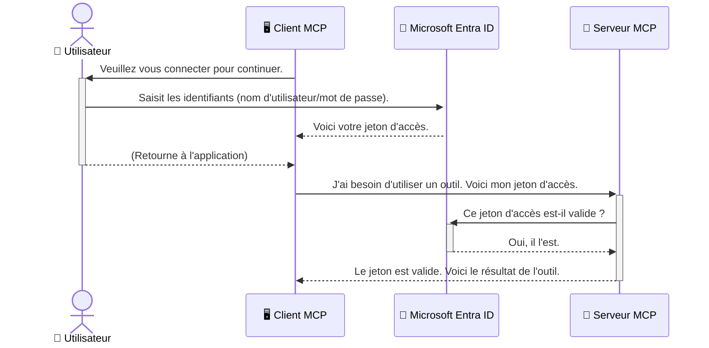

# Sécurisation des workflows IA : Authentification Entra ID pour les serveurs Model Context Protocol

## Introduction
Sécuriser votre serveur Model Context Protocol (MCP) est aussi important que de verrouiller la porte d'entrée de votre maison. Laisser votre serveur MCP ouvert expose vos outils et vos données à un accès non autorisé, ce qui peut entraîner des failles de sécurité. Microsoft Entra ID offre une solution robuste de gestion des identités et des accès basée sur le cloud, aidant à garantir que seuls les utilisateurs et applications autorisés peuvent interagir avec votre serveur MCP. Dans cette section, vous apprendrez comment protéger vos workflows IA en utilisant l’authentification Entra ID.

## Objectifs d'apprentissage
À la fin de cette section, vous serez capable de :

- Comprendre l’importance de sécuriser les serveurs MCP.
- Expliquer les bases de Microsoft Entra ID et de l’authentification OAuth 2.0.
- Reconnaître la différence entre clients publics et clients confidentiels.
- Implémenter l’authentification Entra ID dans les scénarios de serveurs MCP locaux (client public) et distants (client confidentiel).
- Appliquer les meilleures pratiques de sécurité lors du développement de workflows IA.

## Sécurité et MCP

Tout comme vous ne laisseriez pas la porte d'entrée de votre maison déverrouillée, vous ne devriez pas laisser votre serveur MCP accessible à tous. Sécuriser vos workflows IA est essentiel pour construire des applications robustes, fiables et sûres. Ce chapitre vous présentera l’utilisation de Microsoft Entra ID pour sécuriser vos serveurs MCP, en veillant à ce que seuls les utilisateurs et applications autorisés puissent interagir avec vos outils et données.

## Pourquoi la sécurité est importante pour les serveurs MCP

Imaginez que votre serveur MCP dispose d’un outil capable d’envoyer des emails ou d’accéder à une base de données clients. Un serveur non sécurisé signifierait que n’importe qui pourrait potentiellement utiliser cet outil, entraînant un accès non autorisé aux données, du spam ou d’autres activités malveillantes.

En mettant en place une authentification, vous vous assurez que chaque requête adressée à votre serveur est vérifiée, confirmant l’identité de l’utilisateur ou de l’application qui effectue la requête. C’est la première et la plus critique étape pour sécuriser vos workflows IA.

## Introduction à Microsoft Entra ID

[**Microsoft Entra ID**](https://adoption.microsoft.com/microsoft-security/entra/) est un service de gestion des identités et des accès basé sur le cloud. Pensez-y comme une sentinelle universelle pour vos applications. Il gère le processus complexe de vérification des identités des utilisateurs (authentification) et détermine ce qu’ils sont autorisés à faire (autorisation).

En utilisant Entra ID, vous pouvez :

- Permettre une connexion sécurisée aux utilisateurs.
- Protéger les API et services.
- Gérer les politiques d’accès depuis un emplacement centralisé.

Pour les serveurs MCP, Entra ID offre une solution robuste et largement reconnue pour gérer qui peut accéder aux fonctionnalités de votre serveur.

---

## Comprendre la magie : Comment fonctionne l’authentification Entra ID

Entra ID utilise des standards ouverts comme **OAuth 2.0** pour gérer l’authentification. Bien que les détails puissent être complexes, le concept principal est simple et peut être compris grâce à une analogie.

### Une introduction simple à OAuth 2.0 : La clé de voiturier

Considérez OAuth 2.0 comme un service de voiturier pour votre voiture. Lorsque vous arrivez au restaurant, vous ne donnez pas au voiturier votre clé principale. Au lieu de cela, vous fournissez une **clé de voiturier** qui a des permissions limitées — elle peut démarrer la voiture et verrouiller les portes, mais ne peut pas ouvrir le coffre ou la boîte à gants.

Dans cette analogie :

- **Vous** êtes l’**Utilisateur**.
- **Votre voiture** est le **Serveur MCP** avec ses outils et données précieux.
- Le **Voiturier** est **Microsoft Entra ID**.
- L’**Agent de stationnement** est le **Client MCP** (l’application qui essaie d’accéder au serveur).
- La **Clé de voiturier** est le **Jeton d’accès**.

Le jeton d’accès est une chaîne sécurisée que le client MCP reçoit d’Entra ID après votre connexion. Le client présente ensuite ce jeton au serveur MCP à chaque requête. Le serveur peut vérifier le jeton pour s’assurer que la requête est légitime et que le client dispose des permissions nécessaires, sans jamais avoir besoin de manipuler vos véritables identifiants (comme votre mot de passe).

### Le flux d’authentification

Voici comment le processus fonctionne en pratique :




### Présentation de la Microsoft Authentication Library (MSAL)

Avant de plonger dans le code, il est important d’introduire un composant clé que vous verrez dans les exemples : la **Microsoft Authentication Library (MSAL)**.

MSAL est une bibliothèque développée par Microsoft qui facilite grandement la gestion de l’authentification pour les développeurs. Au lieu d’avoir à écrire tout le code complexe pour gérer les tokens de sécurité, les connexions et le rafraîchissement des sessions, MSAL se charge de tout cela.

Utiliser une bibliothèque comme MSAL est fortement recommandé car :

- **C’est sécurisé :** Elle implémente les protocoles standards de l’industrie et les meilleures pratiques de sécurité, réduisant ainsi le risque de vulnérabilités dans votre code.
- **Elle simplifie le développement :** Elle masque la complexité des protocoles OAuth 2.0 et OpenID Connect, vous permettant d’ajouter une authentification robuste à votre application en quelques lignes de code.
- **Elle est maintenue :** Microsoft maintient activement MSAL et la met à jour pour faire face aux nouvelles menaces de sécurité et changements de plateforme.

MSAL prend en charge une large variété de langages et frameworks applicatifs, incluant .NET, JavaScript/TypeScript, Python, Java, Go, ainsi que les plateformes mobiles comme iOS et Android. Cela signifie que vous pouvez utiliser les mêmes modèles d’authentification cohérents dans l’ensemble de votre stack technologique.

Pour en savoir plus sur MSAL, vous pouvez consulter la [documentation officielle de présentation de MSAL](https://learn.microsoft.com/entra/identity-platform/msal-overview).

---

## Sécuriser votre serveur MCP avec Entra ID : Guide pas à pas

Maintenant, parcourons comment sécuriser un serveur MCP local (qui communique via `stdio`) en utilisant Entra ID. Cet exemple utilise un **client public**, adapté aux applications s’exécutant sur la machine d’un utilisateur, comme une application de bureau ou un serveur local de développement.

### Scénario 1 : Sécuriser un serveur MCP local (avec un client public)

Dans ce scénario, nous considérons un serveur MCP qui s’exécute localement, communique via `stdio`, et utilise Entra ID pour authentifier l’utilisateur avant de lui permettre d’accéder à ses outils. Le serveur disposera d’un seul outil qui récupère les informations du profil utilisateur via l’API Microsoft Graph.

#### 1. Configuration de l’application dans Entra ID

Avant d’écrire le moindre code, vous devez enregistrer votre application dans Microsoft Entra ID. Cela informe Entra ID de votre application et lui donne la permission d’utiliser le service d’authentification.

1. Rendez-vous sur le **[portail Microsoft Entra](https://entra.microsoft.com/)**.
2. Allez dans **App registrations** et cliquez sur **New registration**.
3. Donnez un nom à votre application (ex. : « My Local MCP Server »).
4. Pour **Supported account types**, sélectionnez **Accounts in this organizational directory only**.
5. Vous pouvez laisser le champ **Redirect URI** vide pour cet exemple.
6. Cliquez sur **Register**.

Une fois enregistrée, notez l’**Application (client) ID** et l’**Directory (tenant) ID**. Vous en aurez besoin dans votre code.

#### 2. Le code : un décryptage

Regardons les parties clés du code qui gèrent l’authentification. Le code complet de cet exemple est disponible dans le dossier [Entra ID - Local - WAM](https://github.com/Azure-Samples/mcp-auth-servers/tree/main/src/entra-id-local-wam) du [dépôt GitHub mcp-auth-servers](https://github.com/Azure-Samples/mcp-auth-servers).

**`AuthenticationService.cs`**

Cette classe est responsable de la gestion de l’interaction avec Entra ID.

- **`CreateAsync`** : Cette méthode initialise le `PublicClientApplication` provenant de MSAL (Microsoft Authentication Library). Il est configuré avec le `clientId` et le `tenantId` de votre application.
- **`WithBroker`** : Cela active l’utilisation d’un broker (comme le Windows Web Account Manager), qui offre une expérience de connexion unique plus sécurisée et fluide.
- **`AcquireTokenAsync`** : C’est la méthode clé. Elle tente d’abord d’obtenir un jeton de façon silencieuse (ce qui veut dire que l’utilisateur n’aura pas besoin de se reconnecter s’il a déjà une session valide). Si un jeton silencieux ne peut pas être obtenu, elle invitera l’utilisateur à se connecter de façon interactive.

```csharp
// Simplified for clarity
public static async Task<AuthenticationService> CreateAsync(ILogger<AuthenticationService> logger)
{
    var msalClient = PublicClientApplicationBuilder
        .Create(_clientId) // Your Application (client) ID
        .WithAuthority(AadAuthorityAudience.AzureAdMyOrg)
        .WithTenantId(_tenantId) // Your Directory (tenant) ID
        .WithBroker(new BrokerOptions(BrokerOptions.OperatingSystems.Windows))
        .Build();

    // ... cache registration ...

    return new AuthenticationService(logger, msalClient);
}

public async Task<string> AcquireTokenAsync()
{
    try
    {
        // Try silent authentication first
        var accounts = await _msalClient.GetAccountsAsync();
        var account = accounts.FirstOrDefault();

        AuthenticationResult? result = null;

        if (account != null)
        {
            result = await _msalClient.AcquireTokenSilent(_scopes, account).ExecuteAsync();
        }
        else
        {
            // If no account, or silent fails, go interactive
            result = await _msalClient.AcquireTokenInteractive(_scopes).ExecuteAsync();
        }

        return result.AccessToken;
    }
    catch (Exception ex)
    {
        _logger.LogError(ex, "An error occurred while acquiring the token.");
        throw; // Optionally rethrow the exception for higher-level handling
    }
}
```


**`Program.cs`**

C’est ici que le serveur MCP est configuré et que le service d’authentification est intégré.

- **`AddSingleton<AuthenticationService>`** : Cela enregistre `AuthenticationService` dans le conteneur d’injection de dépendances, afin qu’il puisse être utilisé par d’autres parties de l’application (comme notre outil).
- L’outil **`GetUserDetailsFromGraph`** : Cet outil requiert une instance de `AuthenticationService`. Avant de faire quoi que ce soit, il appelle `authService.AcquireTokenAsync()` pour obtenir un jeton d’accès valide. Si l’authentification réussit, il utilise ce jeton pour appeler l’API Microsoft Graph et récupérer les détails de l’utilisateur.

```csharp
// Simplified for clarity
[McpServerTool(Name = "GetUserDetailsFromGraph")]
public static async Task<string> GetUserDetailsFromGraph(
    AuthenticationService authService)
{
    try
    {
        // This will trigger the authentication flow
        var accessToken = await authService.AcquireTokenAsync();

        // Use the token to create a GraphServiceClient
        var graphClient = new GraphServiceClient(
            new BaseBearerTokenAuthenticationProvider(new TokenProvider(authService)));

        var user = await graphClient.Me.GetAsync();

        return System.Text.Json.JsonSerializer.Serialize(user);
    }
    catch (Exception ex)
    {
        return $"Error: {ex.Message}";
    }
}
```


#### 3. Comment tout cela fonctionne ensemble

1. Lorsque le client MCP tente d’utiliser l’outil `GetUserDetailsFromGraph`, cet outil appelle d’abord `AcquireTokenAsync`.
2. `AcquireTokenAsync` déclenche la bibliothèque MSAL qui vérifie s’il existe un jeton valide.
3. S’il n’y a pas de jeton, MSAL, via le broker, invite l’utilisateur à se connecter avec son compte Entra ID.
4. Une fois connecté, Entra ID émet un jeton d’accès.
5. L’outil reçoit ce jeton et l’utilise pour faire un appel sécurisé à l’API Microsoft Graph.
6. Les détails de l’utilisateur sont retournés au client MCP.

Ce processus garantit que seuls les utilisateurs authentifiés peuvent utiliser l’outil, sécurisant ainsi efficacement votre serveur MCP local.

### Scénario 2 : Sécuriser un serveur MCP distant (avec un client confidentiel)

Lorsque votre serveur MCP fonctionne sur une machine distante (comme un serveur cloud) et communique via un protocole comme le HTTP Streaming, les exigences de sécurité sont différentes. Dans ce cas, vous devez utiliser un **client confidentiel** et le **flux de code d’autorisation (Authorization Code Flow)**. C’est une méthode plus sécurisée car les secrets de l’application ne sont jamais exposés au navigateur.

Cet exemple utilise un serveur MCP basé sur TypeScript qui utilise Express.js pour gérer les requêtes HTTP.

#### 1. Configuration de l’application dans Entra ID

La configuration dans Entra ID est similaire au client public, mais avec une différence clé : vous devez créer un **secret client**.

1. Rendez-vous sur le **[portail Microsoft Entra](https://entra.microsoft.com/)**.
2. Dans l’enregistrement de votre application, allez dans l’onglet **Certificates & secrets**.
3. Cliquez sur **New client secret**, donnez-lui une description, puis cliquez sur **Add**.
4. **Important :** Copiez immédiatement la valeur du secret. Vous ne pourrez plus la voir ensuite.
5. Vous devez aussi configurer une **Redirect URI**. Allez dans l’onglet **Authentication**, cliquez sur **Add a platform**, choisissez **Web** et entrez l’URI de redirection de votre application (ex. : `http://localhost:3001/auth/callback`).

> **⚠️ Note de sécurité importante :** Pour les applications en production, Microsoft recommande fortement l’utilisation de méthodes d’**authentification sans secret** comme **Managed Identity** ou **Workload Identity Federation** plutôt que d’utiliser des secrets clients. Les secrets clients présentent des risques de sécurité car ils peuvent être exposés ou compromis. Les identités managées offrent une approche plus sécurisée en éliminant la nécessité de stocker des identifiants dans votre code ou configuration.
>
> Pour plus d’informations sur les identités managées et leur mise en œuvre, consultez la [vue d’ensemble des identités managées pour les ressources Azure](https://learn.microsoft.com/entra/identity/managed-identities-azure-resources/overview).

#### 2. Le code : un décryptage

Cet exemple utilise une approche basée sur les sessions. Lorsque l’utilisateur s’authentifie, le serveur stocke le jeton d’accès et le jeton de rafraîchissement dans une session et donne à l’utilisateur un jeton de session. Ce jeton de session est ensuite utilisé pour les requêtes suivantes. Le code complet de cet exemple est disponible dans le dossier [Entra ID - Confidential client](https://github.com/Azure-Samples/mcp-auth-servers/tree/main/src/entra-id-cca-session) du [dépôt GitHub mcp-auth-servers](https://github.com/Azure-Samples/mcp-auth-servers).

**`Server.ts`**

Ce fichier configure le serveur Express et la couche de transport MCP.

- **`requireBearerAuth`** : C’est un middleware qui protège les endpoints `/sse` et `/message`. Il vérifie la présence d’un jeton porteur valide dans l’en-tête `Authorization` de la requête.
- **`EntraIdServerAuthProvider`** : C’est une classe personnalisée qui implémente l’interface `McpServerAuthorizationProvider`. Elle gère le flux OAuth 2.0.
- **`/auth/callback`** : Ce point d’entrée gère la redirection depuis Entra ID après que l’utilisateur s’est authentifié. Il échange le code d’autorisation contre un jeton d’accès et un jeton de rafraîchissement.

```typescript
// Simplifié pour plus de clarté
const app = express();
const { server } = createServer();
const provider = new EntraIdServerAuthProvider();

// Protéger le point de terminaison SSE
app.get("/sse", requireBearerAuth({
  provider,
  requiredScopes: ["User.Read"]
}), async (req, res) => {
  // ... se connecter au transport ...
});

// Protéger le point de terminaison des messages
app.post("/message", requireBearerAuth({
  provider,
  requiredScopes: ["User.Read"]
}), async (req, res) => {
  // ... gérer le message ...
});

// Gérer le rappel OAuth 2.0
app.get("/auth/callback", (req, res) => {
  provider.handleCallback(req.query.code, req.query.state)
    .then(result => {
      // ... gérer le succès ou l'échec ...
    });
});
```


**`Tools.ts`**

Ce fichier définit les outils que le serveur MCP fournit. L’outil `getUserDetails` est similaire à celui de l’exemple précédent, mais il récupère le jeton d’accès depuis la session.

```typescript
// Simplifié pour plus de clarté
server.setRequestHandler(CallToolRequestSchema, async (request) => {
  const { name } = request.params;
  const context = request.params?.context as { token?: string } | undefined;
  const sessionToken = context?.token;

  if (name === ToolName.GET_USER_DETAILS) {
    if (!sessionToken) {
      throw new AuthenticationError("Authentication token is missing or invalid. Ensure the token is provided in the request context.");
    }

    // Récupérer le jeton Entra ID depuis le magasin de session
    const tokenData = tokenStore.getToken(sessionToken);
    const entraIdToken = tokenData.accessToken;

    const graphClient = Client.init({
      authProvider: (done) => {
        done(null, entraIdToken);
      }
    });

    const user = await graphClient.api('/me').get();

    // ... retourner les détails de l'utilisateur ...
  }
});
```


**`auth/EntraIdServerAuthProvider.ts`**

Cette classe gère la logique pour :

- Rediriger l’utilisateur vers la page de connexion Entra ID.
- Échanger le code d’autorisation contre un jeton d’accès.
- Stocker les jetons dans le `tokenStore`.
- Rafraîchir le jeton d’accès à son expiration.

#### 3. Comment tout cela fonctionne ensemble

1. Lorsqu’un utilisateur essaie pour la première fois de se connecter au serveur MCP, le middleware `requireBearerAuth` détecte qu’il n’a pas de session valide et le redirige vers la page de connexion Entra ID.
2. L’utilisateur se connecte avec son compte Entra ID.
3. Entra ID redirige l'utilisateur vers le point de terminaison `/auth/callback` avec un code d'autorisation.  
4. Le serveur échange le code contre un jeton d'accès et un jeton d'actualisation, les stocke, et crée un jeton de session qui est envoyé au client.  
5. Le client peut désormais utiliser ce jeton de session dans l'en-tête `Authorization` pour toutes les futures requêtes vers le serveur MCP.  
6. Lorsque l'outil `getUserDetails` est appelé, il utilise le jeton de session pour retrouver le jeton d'accès Entra ID, puis utilise ce dernier pour appeler l'API Microsoft Graph.

Ce flux est plus complexe que le flux client public, mais il est nécessaire pour les points de terminaison accessibles depuis Internet. Étant donné que les serveurs MCP distants sont accessibles via Internet public, ils nécessitent des mesures de sécurité renforcées pour se protéger contre les accès non autorisés et les attaques potentielles.


## Bonnes pratiques de sécurité

- **Utilisez toujours HTTPS** : Chiffrez la communication entre le client et le serveur pour protéger les jetons contre l'interception.  
- **Mettez en œuvre un contrôle d'accès basé sur les rôles (RBAC)** : Ne vérifiez pas seulement *si* un utilisateur est authentifié ; vérifiez *ce* qu'il est autorisé à faire. Vous pouvez définir des rôles dans Entra ID et les vérifier dans votre serveur MCP.  
- **Surveillez et auditez** : Enregistrez tous les événements d'authentification pour pouvoir détecter et répondre à toute activité suspecte.  
- **Gérez la limitation de débit et le throttling** : Microsoft Graph et d’autres API mettent en œuvre une limitation de débit pour prévenir les abus. Implémentez une stratégie de backoff exponentiel et une logique de nouvelle tentative dans votre serveur MCP pour gérer gracieusement les réponses HTTP 429 (Trop de requêtes). Envisagez de mettre en cache les données fréquemment consultées pour réduire les appels API.  
- **Stockage sécurisé des jetons** : Stockez les jetons d'accès et les jetons d'actualisation de manière sécurisée. Pour les applications locales, utilisez les mécanismes de stockage sécurisé du système. Pour les applications serveur, envisagez d’utiliser un stockage chiffré ou des services de gestion de clés sécurisés comme Azure Key Vault.  
- **Gestion de l'expiration des jetons** : Les jetons d'accès ont une durée de vie limitée. Implémentez le rafraîchissement automatique des jetons en utilisant les jetons d'actualisation pour maintenir une expérience utilisateur fluide sans nécessiter une ré-authentification.  
- **Envisagez d’utiliser Azure API Management** : Bien que mettre en œuvre la sécurité directement dans votre serveur MCP vous donne un contrôle granulaire, les passerelles API comme Azure API Management peuvent gérer automatiquement de nombreuses préoccupations de sécurité, y compris l’authentification, l’autorisation, la limitation de débit et la surveillance. Elles fournissent une couche de sécurité centralisée entre vos clients et vos serveurs MCP. Pour plus de détails sur l’utilisation des passerelles API avec MCP, consultez notre [Azure API Management Your Auth Gateway For MCP Servers](https://techcommunity.microsoft.com/blog/integrationsonazureblog/azure-api-management-your-auth-gateway-for-mcp-servers/4402690).


## Points clés à retenir

- Sécuriser votre serveur MCP est essentiel pour protéger vos données et outils.  
- Microsoft Entra ID offre une solution fiable et évolutive pour l’authentification et l’autorisation.  
- Utilisez un **client public** pour les applications locales et un **client confidentiel** pour les serveurs distants.  
- Le **flux de code d'autorisation** est l’option la plus sécurisée pour les applications web.


## Exercice

1. Réfléchissez à un serveur MCP que vous pourriez construire. S’agirait-il d’un serveur local ou distant ?  
2. En fonction de votre réponse, utiliseriez-vous un client public ou confidentiel ?  
3. Quelle permission votre serveur MCP demanderait-il pour effectuer des actions sur Microsoft Graph ?


## Exercices pratiques

### Exercice 1 : Enregistrer une application dans Entra ID  
Accédez au portail Microsoft Entra.  
Enregistrez une nouvelle application pour votre serveur MCP.  
Notez l'ID d’application (client) et l'ID de répertoire (locataire).

### Exercice 2 : Sécuriser un serveur MCP local (Client public)  
- Suivez l’exemple de code pour intégrer MSAL (Microsoft Authentication Library) pour l’authentification utilisateur.  
- Testez le flux d’authentification en appelant l’outil MCP qui récupère les détails utilisateur depuis Microsoft Graph.

### Exercice 3 : Sécuriser un serveur MCP distant (Client confidentiel)  
- Enregistrez un client confidentiel dans Entra ID et créez un secret client.  
- Configurez votre serveur MCP Express.js pour utiliser le flux de code d’autorisation.  
- Testez les points de terminaison protégés et confirmez l’accès basé sur les jetons.

### Exercice 4 : Appliquer les meilleures pratiques de sécurité  
- Activez HTTPS pour votre serveur local ou distant.  
- Implémentez le contrôle d’accès basé sur les rôles (RBAC) dans la logique de votre serveur.  
- Ajoutez la gestion de l’expiration des jetons et le stockage sécurisé des jetons.

## Ressources

1. **Documentation MSAL Overview**  
   Découvrez comment la bibliothèque Microsoft Authentication Library (MSAL) permet l’acquisition sécurisée de jetons sur plusieurs plateformes :  
   [MSAL Overview on Microsoft Learn](https://learn.microsoft.com/en-gb/entra/msal/overview)

2. **Dépôt GitHub Azure-Samples/mcp-auth-servers**  
   Implémentations de référence de serveurs MCP démontrant les flux d’authentification :  
   [Azure-Samples/mcp-auth-servers on GitHub](https://github.com/Azure-Samples/mcp-auth-servers)

3. **Présentation des identités gérées pour les ressources Azure**  
   Comprenez comment éliminer les secrets en utilisant des identités gérées assignées par le système ou l’utilisateur :  
   [Managed Identities Overview on Microsoft Learn](https://learn.microsoft.com/en-us/entra/identity/managed-identities-azure-resources/)

4. **Azure API Management : Votre passerelle d’authentification pour les serveurs MCP**  
   Une analyse approfondie de l'utilisation d’APIM comme passerelle OAuth2 sécurisée pour les serveurs MCP :  
   [Azure API Management Your Auth Gateway For MCP Servers](https://techcommunity.microsoft.com/blog/integrationsonazureblog/azure-api-management-your-auth-gateway-for-mcp-servers/4402690)

5. **Référence des permissions Microsoft Graph**  
   Liste complète des autorisations déléguées et application pour Microsoft Graph :  
   [Microsoft Graph Permissions Reference](https://learn.microsoft.com/zh-tw/graph/permissions-reference)


## Compétences acquises  
Après avoir complété cette section, vous serez capable de :

- Expliquer pourquoi l’authentification est cruciale pour les serveurs MCP et les workflows IA.  
- Configurer et paramétrer l’authentification Entra ID pour les scénarios de serveurs MCP locaux et distants.  
- Choisir le type de client approprié (public ou confidentiel) selon le déploiement de votre serveur.  
- Mettre en œuvre des pratiques de codage sécurisées, y compris le stockage des jetons et l’autorisation basée sur les rôles.  
- Protéger en toute confiance votre serveur MCP et ses outils contre les accès non autorisés.

## Suite  

- [5.13 Intégration du protocole de contexte de modèle (MCP) avec Microsoft Foundry](../mcp-foundry-agent-integration/README.md)

---

<!-- CO-OP TRANSLATOR DISCLAIMER START -->
**Avertissement** :
Ce document a été traduit à l'aide du service de traduction automatique [Co-op Translator](https://github.com/Azure/co-op-translator). Bien que nous nous efforçions d'assurer l'exactitude, veuillez noter que les traductions automatisées peuvent contenir des erreurs ou des inexactitudes. Le document original dans sa langue native doit être considéré comme la source faisant autorité. Pour les informations critiques, il est recommandé de recourir à une traduction professionnelle réalisée par un humain. Nous ne saurions être tenus responsables des malentendus ou erreurs d'interprétation découlant de l'utilisation de cette traduction.
<!-- CO-OP TRANSLATOR DISCLAIMER END -->