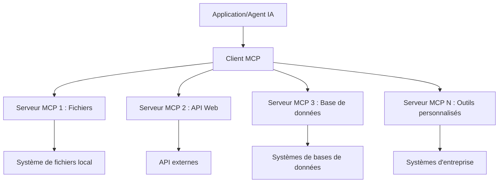

# 🌐 Module 2 : MCP avec les fondamentaux de Microsoft Foundry Toolkit

[]()
[]()
[]()

## 📋 Objectifs d’apprentissage

À la fin de ce module, vous serez capable de :
- ✅ Comprendre l’architecture et les avantages du Model Context Protocol (MCP)
- ✅ Explorer l’écosystème des serveurs MCP de Microsoft
- ✅ Intégrer les serveurs MCP avec Microsoft Foundry Toolkit Agent Builder
- ✅ Construire un agent d’automatisation de navigateur fonctionnel en utilisant Playwright MCP
- ✅ Configurer et tester les outils MCP au sein de vos agents
- ✅ Exporter et déployer des agents alimentés par MCP pour une utilisation en production

## 🎯 Fondations du Module 1

Dans le Module 1, nous avons maîtrisé les bases de Microsoft Foundry Toolkit et créé notre premier Agent Python. Maintenant, nous allons **booster** vos agents en les connectant à des outils et services externes grâce au révolutionnaire **Model Context Protocol (MCP)**.

Pensez à cela comme passer d’une calculatrice basique à un véritable ordinateur : vos agents IA acquerront la capacité de :
- 🌐 Naviguer et interagir avec des sites web
- 📁 Accéder et manipuler des fichiers
- 🔧 S’intégrer aux systèmes d’entreprise
- 📊 Traiter des données en temps réel depuis des APIs

## 🧠 Comprendre le Model Context Protocol (MCP)

### 🔍 Qu'est-ce que le MCP ?

Le Model Context Protocol (MCP) est le **« USB-C pour les applications IA »** - une norme ouverte révolutionnaire qui connecte les grands modèles de langage (LLMs) à des outils externes, sources de données et services. Tout comme l’USB-C a éliminé le chaos des câbles en fournissant un connecteur universel, le MCP supprime la complexité d’intégration IA avec un protocole standardisé unique.

### 🎯 Le problème que résout le MCP

**Avant le MCP :**
- 🔧 Intégrations personnalisées pour chaque outil
- 🔄 Verrouillage fournisseur avec des solutions propriétaires
- 🔒 Vulnérabilités de sécurité liées aux connexions ad hoc
- ⏱️ Plusieurs mois de développement pour des intégrations basiques

**Avec le MCP :**
- ⚡ Intégration d’outils plug-and-play
- 🔄 Architecture agnostique au fournisseur
- 🛡️ Meilleures pratiques de sécurité intégrées
- 🚀 Ajout de nouvelles fonctionnalités en quelques minutes

### 🏗️ Plongée dans l’architecture MCP

Le MCP suit une **architecture client-serveur** qui crée un écosystème sécurisé et évolutif :



**🔧 Composants clés :**

| Composant | Rôle | Exemples |
|-----------|------|----------|
| **Hôtes MCP** | Applications consommant les services MCP | Claude Desktop, VS Code, Microsoft Foundry Toolkit |
| **Clients MCP** | Gestionnaires de protocole (1:1 avec serveurs) | Intégrés dans les applications hôtes |
| **Serveurs MCP** | Exposent des capacités via le protocole standard | Playwright, Fichiers, Azure, GitHub |
| **Couche Transport** | Méthodes de communication | stdio, HTTP, WebSockets |


## 🏢 Écosystème des serveurs MCP de Microsoft

Microsoft est le leader de l’écosystème MCP avec une suite complète de serveurs de niveau entreprise répondant aux besoins métiers réels.

### 🌟 Serveurs MCP Microsoft mis en avant

#### 1. ☁️ Serveur Azure MCP
**🔗 Dépôt** : [azure/azure-mcp](https://github.com/azure/azure-mcp)
**🎯 Objectif** : Gestion complète des ressources Azure avec intégration IA

**✨ Fonctionnalités clés :**
- Provisionnement déclaratif d’infrastructure
- Surveillance en temps réel des ressources
- Recommandations d’optimisation des coûts
- Contrôle de la conformité sécurité

**🚀 Cas d’utilisation :**
- Infrastructure as Code avec assistance IA
- Mise à l’échelle automatisée des ressources
- Optimisation des coûts cloud
- Automatisation des workflows DevOps

#### 2. 📊 Microsoft Dataverse MCP
**📚 Documentation** : [Intégration Microsoft Dataverse](https://go.microsoft.com/fwlink/?linkid=2320176)
**🎯 Objectif** : Interface en langage naturel pour données métier

**✨ Fonctionnalités clés :**
- Requêtes base de données en langage naturel
- Compréhension du contexte métier
- Modèles de prompt personnalisés
- Gouvernance des données d’entreprise

**🚀 Cas d’utilisation :**
- Reporting business intelligence
- Analyse des données clients
- Insights sur le pipeline de vente
- Requêtes de conformité réglementaire

#### 3. 🌐 Serveur Playwright MCP
**🔗 Dépôt** : [microsoft/playwright-mcp](https://github.com/microsoft/playwright-mcp)
**🎯 Objectif** : Automatisation de navigateur et interaction web

**✨ Fonctionnalités clés :**
- Automatisation multi-navigateurs (Chrome, Firefox, Safari)
- Détection intelligente d’éléments
- Captures d’écran et génération PDF
- Surveillance du trafic réseau

**🚀 Cas d’utilisation :**
- Workflows de tests automatisés
- Web scraping et extraction de données
- Surveillance UI/UX
- Automatisation d’analyses concurrentielles

#### 4. 📁 Serveur Fichiers MCP
**🔗 Dépôt** : [microsoft/files-mcp-server](https://github.com/microsoft/files-mcp-server)
**🎯 Objectif** : Opérations intelligentes sur le système de fichiers

**✨ Fonctionnalités clés :**
- Gestion déclarative des fichiers
- Synchronisation de contenu
- Intégration avec contrôle de version
- Extraction de métadonnées

**🚀 Cas d’utilisation :**
- Gestion de documentation
- Organisation de répertoires de code
- Workflows de publication de contenu
- Gestion des fichiers dans les pipelines de données

#### 5. 📝 Serveur MarkItDown MCP
**🔗 Dépôt** : [microsoft/markitdown](https://github.com/microsoft/markitdown)
**🎯 Objectif** : Traitement et manipulation avancée du Markdown

**✨ Fonctionnalités clés :**
- Analyse riche du Markdown
- Conversion de formats (MD ↔ HTML ↔ PDF)
- Analyse de structure de contenu
- Traitement de templates

**🚀 Cas d’utilisation :**
- Workflows de documentation technique
- Systèmes de gestion de contenu
- Génération de rapports
- Automatisation de bases de connaissances

#### 6. 📈 Serveur Clarity MCP
**📦 Package** : [@microsoft/clarity-mcp-server](https://www.npmjs.com/package/@microsoft/clarity-mcp-server)
**🎯 Objectif** : Analyse web et comportement utilisateur

**✨ Fonctionnalités clés :**
- Analyse de données heatmap
- Enregistrements de sessions utilisateur
- Métriques de performance
- Analyse entonnoirs de conversion

**🚀 Cas d’utilisation :**
- Optimisation de site web
- Recherche sur l’expérience utilisateur
- Analyses de tests A/B
- Tableaux de bord business intelligence

### 🌍 Écosystème communautaire

Au-delà des serveurs Microsoft, l’écosystème MCP inclut :
- **🐙 GitHub MCP** : Gestion de dépôts et analyse de code
- **🗄️ MCP bases de données** : Intégrations PostgreSQL, MySQL, MongoDB
- **☁️ MCP fournisseurs Cloud** : Outils AWS, GCP, Digital Ocean
- **📧 MCP communication** : Intégrations Slack, Teams, Email

## 🛠️ Atelier pratique : Construire un agent d’automatisation de navigateur

**🎯 But du projet** : Créer un agent intelligent d’automatisation navigateur en utilisant le serveur Playwright MCP capable de naviguer sur des sites web, extraire des informations et effectuer des interactions web complexes.

### 🚀 Phase 1 : Mise en place de la base de l’agent

#### Étape 1 : Initialiser votre agent
1. **Ouvrir Microsoft Foundry Toolkit Agent Builder**
2. **Créer un nouvel agent** avec la configuration suivante :
   - **Nom** : `BrowserAgent`
   - **Modèle** : Choisir GPT-4o 


### 🔧 Phase 2 : Workflow d’intégration MCP

#### Étape 3 : Ajouter une intégration serveur MCP
1. **Naviguer dans la section Outils** de l’Agent Builder
2. **Cliquer sur "Add Tool"** pour ouvrir le menu d’intégration
3. **Sélectionner "MCP Server"** parmi les options disponibles


**🔍 Comprendre les types d’outils :**
- **Outils intégrés** : Fonctions préconfigurées de Microsoft Foundry Toolkit
- **Serveurs MCP** : Intégrations de services externes
- **API personnalisées** : Vos propres points d’accès services
- **Appels de fonction** : Accès direct aux fonctions du modèle

#### Étape 4 : Sélection du serveur MCP
1. **Choisir l’option "MCP Server"** pour continuer


2. **Explorer le catalogue MCP** pour parcourir les intégrations disponibles


### 🎮 Phase 3 : Configuration Playwright MCP

#### Étape 5 : Sélectionner et configurer Playwright
1. **Cliquer sur "Use Featured MCP Servers"** pour accéder aux serveurs vérifiés par Microsoft
2. **Sélectionner "Playwright"** dans la liste en vedette
3. **Accepter l’ID MCP par défaut** ou personnaliser pour votre environnement


#### Étape 6 : Activer les capacités Playwright
**🔑 Étape critique** : Sélectionner **TOUTES** les méthodes Playwright disponibles pour une fonctionnalité maximale


**🛠️ Outils Playwright essentiels :**
- **Navigation** : `goto`, `goBack`, `goForward`, `reload`
- **Interaction** : `click`, `fill`, `press`, `hover`, `drag`
- **Extraction** : `textContent`, `innerHTML`, `getAttribute`
- **Validation** : `isVisible`, `isEnabled`, `waitForSelector`
- **Capture** : `screenshot`, `pdf`, `video`
- **Réseau** : `setExtraHTTPHeaders`, `route`, `waitForResponse`

#### Étape 7 : Vérifier la réussite de l’intégration
**✅ Indicateurs de succès :**
- Tous les outils apparaissent dans l’interface de l’Agent Builder
- Aucune erreur dans le panneau d’intégration
- Le statut du serveur Playwright indique "Connected"


**🔧 Résolution des problèmes courants :**
- **Échec de connexion** : Vérifier la connectivité internet et les paramètres du pare-feu
- **Outils manquants** : S’assurer que toutes les capacités ont été sélectionnées durant la configuration
- **Erreurs d’autorisation** : Vérifier que VS Code dispose des permissions système nécessaires

### 🎯 Phase 4 : Ingénierie avancée des prompts

#### Étape 8 : Concevoir des prompts système intelligents
Créer des prompts sophistiqués qui exploitent toutes les capacités de Playwright :

```markdown
# Web Automation Expert System Prompt

## Core Identity
You are an advanced web automation specialist with deep expertise in browser automation, web scraping, and user experience analysis. You have access to Playwright tools for comprehensive browser control.

## Capabilities & Approach
### Navigation Strategy
- Always start with screenshots to understand page layout
- Use semantic selectors (text content, labels) when possible
- Implement wait strategies for dynamic content
- Handle single-page applications (SPAs) effectively

### Error Handling
- Retry failed operations with exponential backoff
- Provide clear error descriptions and solutions
- Suggest alternative approaches when primary methods fail
- Always capture diagnostic screenshots on errors

### Data Extraction
- Extract structured data in JSON format when possible
- Provide confidence scores for extracted information
- Validate data completeness and accuracy
- Handle pagination and infinite scroll scenarios

### Reporting
- Include step-by-step execution logs
- Provide before/after screenshots for verification
- Suggest optimizations and alternative approaches
- Document any limitations or edge cases encountered

## Ethical Guidelines
- Respect robots.txt and rate limiting
- Avoid overloading target servers
- Only extract publicly available information
- Follow website terms of service
```

#### Étape 9 : Créer des prompts utilisateur dynamiques
Concevoir des prompts montrant diverses capacités :

**🌐 Exemple d’analyse web :**
```markdown
Navigate to github.com/kinfey and provide a comprehensive analysis including:
1. Repository structure and organization
2. Recent activity and contribution patterns  
3. Documentation quality assessment
4. Technology stack identification
5. Community engagement metrics
6. Notable projects and their purposes

Include screenshots at key steps and provide actionable insights.
```


### 🚀 Phase 5 : Exécution et test

#### Étape 10 : Exécuter votre première automatisation
1. **Cliquer sur "Run"** pour lancer la séquence d’automatisation
2. **Surveiller l’exécution en temps réel** :
   - Le navigateur Chrome se lance automatiquement
   - L’agent navigue vers le site cible
   - Des captures d’écran sont prises à chaque étape majeure
   - Les résultats d’analyse s’affichent en flux continu


#### Étape 11 : Analyser les résultats et insights
Consulter l’analyse complète dans l’interface de l’Agent Builder :


### 🌟 Phase 6 : Capacités avancées et déploiement

#### Étape 12 : Exporter et déployer en production
Agent Builder supporte plusieurs options de déploiement :


## 🎓 Résumé du Module 2 & prochaines étapes

### 🏆 Succès débloqué : Maîtrise de l’intégration MCP

**✅ Compétences maîtrisées :**
- [ ] Compréhension de l’architecture et des avantages MCP
- [ ] Navigation dans l’écosystème des serveurs MCP de Microsoft
- [ ] Intégration Playwright MCP avec Microsoft Foundry Toolkit
- [ ] Construction d’agents sophistiqués d’automatisation navigateur
- [ ] Ingénierie avancée de prompts pour l’automatisation web

### 📚 Ressources supplémentaires

- **🔗 Spécification MCP** : [Documentation officielle du protocole](https://modelcontextprotocol.io/)
- **🛠️ API Playwright** : [Référence complète des méthodes](https://playwright.dev/docs/api/class-playwright)
- **🏢 Serveurs MCP Microsoft** : [Guide d’intégration entreprise](https://github.com/microsoft/mcp-servers)
- **🌍 Exemples communautaires** : [Galerie de serveurs MCP](https://github.com/modelcontextprotocol/servers)

**🎉 Félicitations !** Vous avez réussi à maîtriser l’intégration MCP et pouvez maintenant construire des agents IA prêts pour la production avec des capacités d’outils externes !


### 🔜 Continuer vers le module suivant

Prêt à passer vos compétences MCP au niveau supérieur ? Passez au **[Module 3 : Développement avancé MCP avec Microsoft Foundry Toolkit](../lab3/README.md)** où vous apprendrez à :
- Créer vos propres serveurs MCP personnalisés
- Configurer et utiliser le dernier SDK MCP Python
- Mettre en place le MCP Inspector pour le débogage
- Maîtriser les workflows avancés de développement serveur MCP
- Construire un serveur MCP météo de A à Z

---

<!-- CO-OP TRANSLATOR DISCLAIMER START -->
**Avertissement** :
Ce document a été traduit à l'aide du service de traduction automatique [Co-op Translator](https://github.com/Azure/co-op-translator). Bien que nous nous efforçions d'assurer l'exactitude, veuillez noter que les traductions automatisées peuvent contenir des erreurs ou des inexactitudes. Le document original dans sa langue native doit être considéré comme la source faisant autorité. Pour les informations critiques, il est recommandé de recourir à une traduction professionnelle réalisée par un humain. Nous ne saurions être tenus responsables des malentendus ou erreurs d'interprétation découlant de l'utilisation de cette traduction.
<!-- CO-OP TRANSLATOR DISCLAIMER END -->