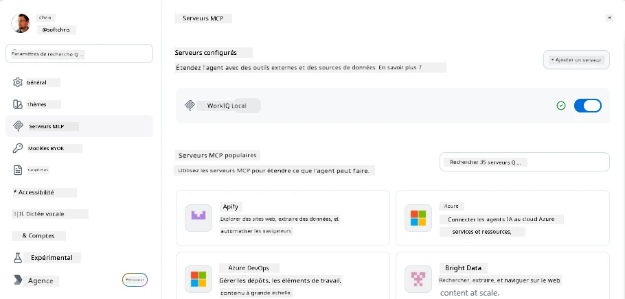
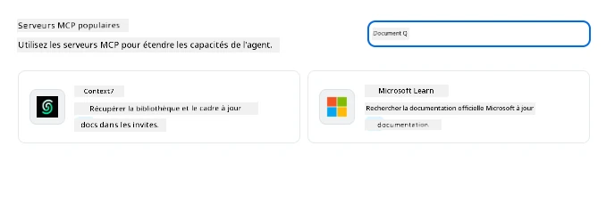
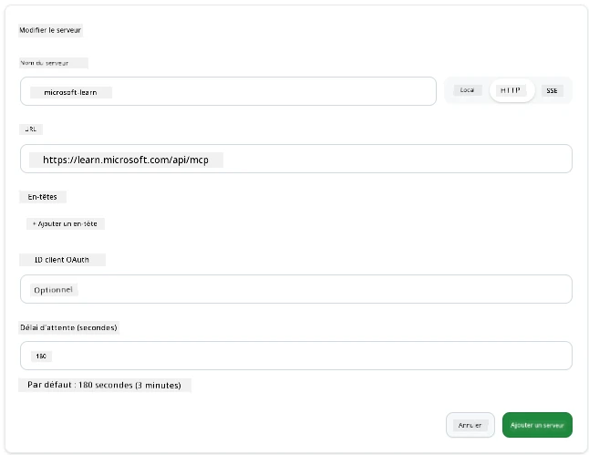
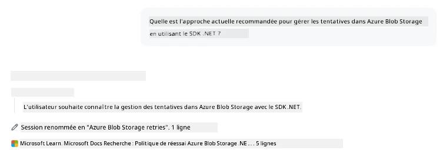
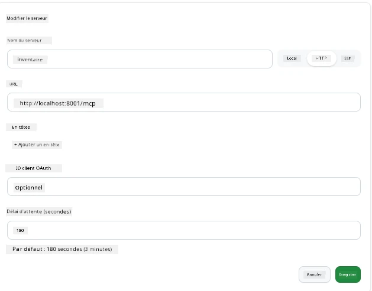
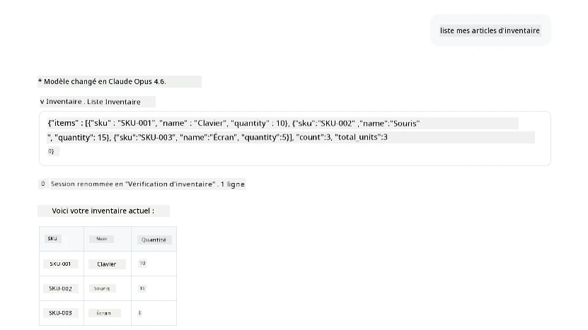
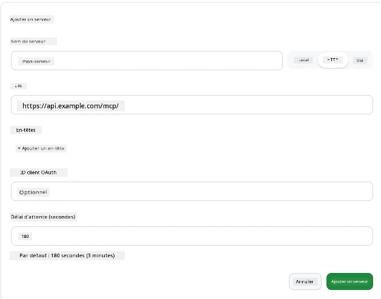
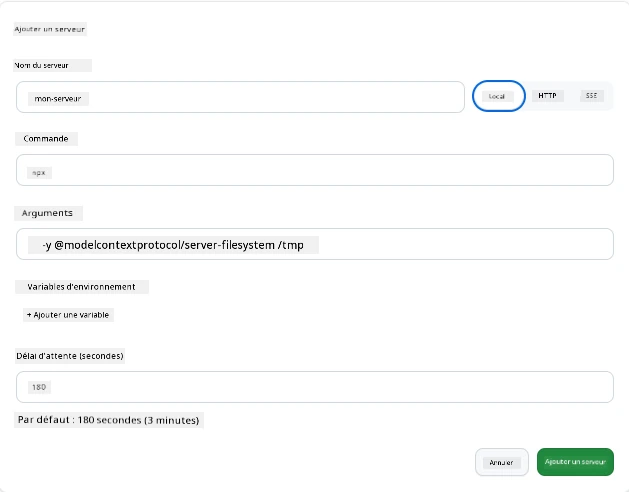

# Utilisation des serveurs MCP dans l’application GitHub Copilot

Vous savez maintenant comment MCP fonctionne. Vous avez construit des serveurs, défini des outils et des ressources, et raccordé des clients. Ce que nous n’avons pas encore fait, c’est inverser la perspective : au lieu que ce soit vous qui construisiez le serveur, à quoi ressemble le fait d’être du côté *consommateur*—en tant qu’utilisateur d’une application alimentée par l’IA qui supporte MCP ?

[GitHub Copilot App](https://github.com/github/app) est une application de bureau qui peut utiliser des serveurs MCP. En connectant des serveurs MCP à cette application, vous débloquez un nouveau niveau : Copilot peut désormais accéder à votre documentation, appeler vos API internes, interroger votre base de données, ou communiquer avec n’importe quel service que vous avez enveloppé dans un serveur. L’application devient l’hôte ; vos serveurs MCP deviennent ses outils.

Cette leçon vous guide à travers cette expérience de bout en bout—depuis la recherche du panneau des paramètres MCP jusqu’à la connexion d’un serveur de documentation réel, puis le raccordement d’un serveur personnalisé de votre propre création.

## Objectifs d’apprentissage

À la fin de cette leçon, vous serez capable de :

- Localiser et naviguer dans le panneau des serveurs MCP dans les paramètres de l’application Copilot.
- Connecter un serveur de documentation hébergé et l’utiliser dans une session.
- Enregistrer un serveur personnalisé et vérifier que Copilot peut invoquer ses outils.
- Configurer la façon dont un serveur est appelé en fournissant soit des variables d’environnement, soit des en-têtes personnalisés (si HTTP).

## L’application Copilot comme hôte MCP

Voici l’idée fondamentale : **les agents de Copilot sont intelligents, mais ils ne savent que ce que vous leur dites.** Par défaut, un agent peut lire les fichiers dans votre espace de travail et exécuter des commandes terminal, mais il ne peut pas interroger votre base de données, consulter votre calendrier, ou appeler une API personnalisée sans aide. C’est là qu’interviennent les serveurs MCP. Ils servent de ponts entre Copilot et vos systèmes—bases de données, contrôle de version, API, outils de design—offrant aux agents l’accès aux informations et aux actions nécessaires pour accomplir leur travail.

Commençons par trouver ces paramètres pour gérer les serveurs MCP de votre application.

## Étape 1 : Trouver le panneau des paramètres MCP

Ouvrez l’application Copilot et localisez une icône d’engrenage en bas à gauche puis cliquez dessus.


Assurez-vous de sélectionner « MCP Servers » et vous devriez voir vos serveurs déjà configurés en haut, une marketplace de serveurs populaires en bas, ainsi qu’un bouton « Add Server » en haut comme ceci :



C’est votre centre de contrôle. Vous pouvez ajouter, supprimer, activer, et désactiver des serveurs ici. Les changements prennent effet pour les nouvelles sessions ; si vous avez une session ouverte, vous devrez en démarrer une nouvelle après avoir modifié cette liste.

## Étape 2 : Connecter un serveur de documentation

Faisons quelque chose d’immédiatement utile. Le serveur MCP Microsoft Docs donne à Copilot l’accès à la documentation officielle Microsoft. Cela inclut Azure, .NET, TypeScript, et plus encore. Au lieu que l’agent se base uniquement sur ses données d’entraînement (qui ont une date limite), il peut récupérer la documentation actuelle au moment de la requête.

Voici comment l’ajouter :

1. Dans la grille des serveurs populaires, tapez **learn** et sélectionnez le serveur appelé « Microsoft Learn ».

   

   Une fois sélectionné, un formulaire s’affiche avec le nom, le type de transport et l’URL préremplis, il vous suffit de cliquer sur « Add Server ».

2. Cliquez sur « Add Server », cela devrait prendre quelques secondes pour se connecter au serveur.

   

   Une fois ajouté, il devrait apparaître dans la zone supérieure comme un serveur configuré. Essayons-le maintenant.

3. Fermez la boîte de dialogue et sélectionnez « Quick chat ».

4. Tapez la requête ci-dessous pour déclencher un outil sur le serveur Microsoft Learn.

   ```text
   What's the current recommended approach for handling Azure Blob Storage 
   retries using the .NET SDK?
   ```

   

Vous devriez voir comment il fait référence au serveur MCP que nous venons d’ajouter.

## Étape 3 : Connecter un serveur stdio personnalisé

Les presets sont pratiques, mais le vrai pouvoir réside dans la connexion de vos propres serveurs. Disons que vous avez construit un serveur (ou qu’on vous en a fourni un) qui expose votre API interne ou une base de connaissances d’entreprise. Dans ce cas, nous allons utiliser un serveur MCP que nous avons construit et qui gère la gestion d’inventaire de notre entreprise.

1. Cliquez sur l’engrenage et sélectionnez de nouveau « MCP servers ».

2. Cliquez sur le bouton « Add Server » puis sur « + Add Custom server », et fournissez les valeurs suivantes :

   - Nom : `Inventory Server`
   - Sélectionnez le transport (à droite), **http**

   Sélectionnez « Add Server » et il devrait apparaître dans votre liste de serveurs configurés.

   

4. Pour le tester, exécutez une requête comme celle-ci :

    ```
    list inventory
    ```

   

   Vous devriez maintenant voir une liste d’articles d’inventaire retournée par votre serveur personnalisé.

Super, vous devriez maintenant bien comprendre comment ajouter des serveurs MCP externes ainsi que vos propres serveurs dans l’application Copilot. Parlons maintenant de la gestion des secrets et des variables d’environnement.

## Étape 4 : Paramètres avancés

Jusqu’à présent, vous avez vu comment ajouter des serveurs MCP en fournissant simplement un nom et une URL. Mais que faire si votre serveur nécessite une clé API ou une autre valeur ? Eh bien, selon le type de transport, nous pouvons lui fournir ce dont il a besoin.

- **transport http ou SSE** : Ici, nous pouvons définir les en-têtes si nécessaire.

   Pour l’authentification, vous pouvez spécifier un en-tête Authorization par exemple. La valeur peut être une chaîne statique. Si vous utilisez OAuth, vous pouvez plutôt fournir un ID client OAuth.

   

- **transport stdio** : Des variables d’environnement peuvent être définies.

   Ici, vous pouvez spécifier autant de variables d’environnement que nécessaire qui seront transmises au serveur lors de son démarrage.

   

## Résumé

L’application Copilot traite les serveurs MCP comme des extensions de première classe des capacités de l’agent. Vous avez vu tout le parcours dans cette leçon, depuis l’ajout de serveurs MCP jusqu’à leur utilisation dans une session. Vous pouvez désormais vous connecter à des serveurs publics, des API internes, et des outils personnalisés, donnant à vos agents la capacité d’accéder aux informations et aux actions dont ils ont besoin pour accomplir des tâches de manière autonome.

## 📚 Ressources supplémentaires

### Docs officiels

- [GitHub Copilot App](https://github.com/github/app)
- [Spécification MCP](https://modelcontextprotocol.io/specification/2025-03-26) - spécification Model Context Protocol

### Communauté

- [MCP Community Discord](https://discord.com/invite/ByRwuEEgH4) - discussions en direct
- [GitHub Discussions](https://github.com/microsoft/MCP-Server-and-PostgreSQL-Sample-Retail/discussions) - questions-réponses et partage
- [Stack Overflow](https://stackoverflow.com/questions/tagged/model-context-protocol) - questions techniques

---

<!-- CO-OP TRANSLATOR DISCLAIMER START -->
**Avertissement** :
Ce document a été traduit à l'aide du service de traduction automatique [Co-op Translator](https://github.com/Azure/co-op-translator). Bien que nous nous efforçions d'assurer l'exactitude, veuillez noter que les traductions automatisées peuvent contenir des erreurs ou des inexactitudes. Le document original dans sa langue native doit être considéré comme la source faisant autorité. Pour les informations critiques, il est recommandé de recourir à une traduction professionnelle réalisée par un humain. Nous ne saurions être tenus responsables des malentendus ou erreurs d'interprétation découlant de l'utilisation de cette traduction.
<!-- CO-OP TRANSLATOR DISCLAIMER END -->