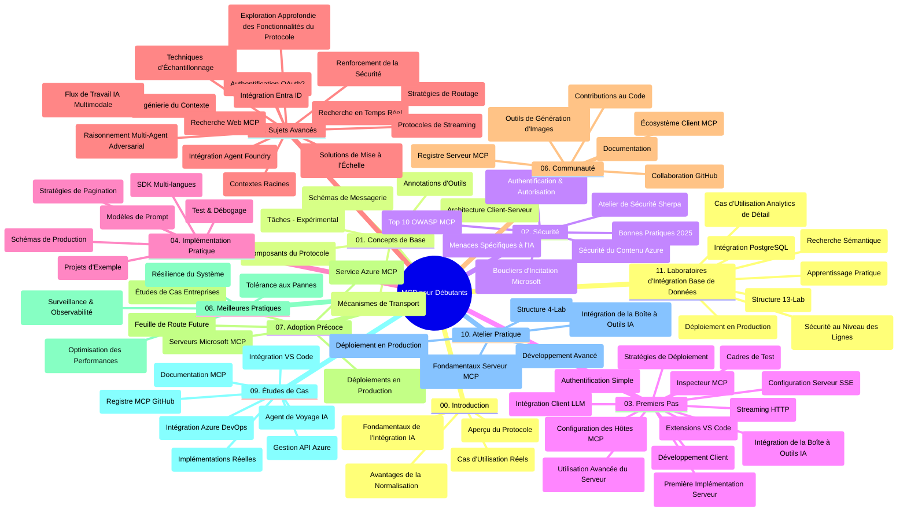

# Protocole de Contexte de Modèle (MCP) pour Débutants - Guide d'Étude

Ce guide d'étude fournit un aperçu de la structure et du contenu du dépôt pour le programme "Protocole de Contexte de Modèle (MCP) pour Débutants". Utilisez ce guide pour naviguer efficacement dans le dépôt et tirer le meilleur parti des ressources disponibles.

## Aperçu du Dépôt

Le Protocole de Contexte de Modèle (MCP) est un cadre standardisé pour les interactions entre les modèles d'IA et les applications clientes. Initialement créé par Anthropic, le MCP est maintenant maintenu par la communauté plus large du MCP via l'organisation GitHub officielle. Ce dépôt propose un cursus complet avec des exemples de code pratiques en C#, Java, JavaScript, Python et TypeScript, conçu pour les développeurs IA, les architectes systèmes et les ingénieurs logiciels.

## Carte Visuelle du Cursus

## Structure du Dépôt

Le dépôt est organisé en onze sections principales, chacune se concentrant sur différents aspects du MCP :

1. **Introduction (00-Introduction/)**
   - Aperçu du Protocole de Contexte de Modèle
   - Pourquoi la standardisation est importante dans les pipelines IA
   - Cas d'utilisation pratiques et avantages

2. **Concepts de Base (01-CoreConcepts/)**
   - Architecture client-serveur
   - Composants clés du protocole
   - Schémas de messagerie dans MCP

3. **Sécurité (02-Security/)**
   - Menaces de sécurité dans les systèmes basés sur MCP
   - Meilleures pratiques pour sécuriser les implémentations
   - Stratégies d'authentification et d'autorisation
   - **Documentation de Sécurité Complète** :
     - Meilleures Pratiques de Sécurité MCP 2025
     - Guide d'Implémentation de la Sécurité de Contenu Azure
     - Contrôles et Techniques de Sécurité MCP
     - Référence Rapide des Bonnes Pratiques MCP
   - **Sujets Clés de Sécurité** :
     - Attaques par injection de prompt et empoisonnement d'outils
     - Détournement de session et problèmes de délégué confus
     - Vulnérabilités de passage de jetons
     - Permissions excessives et contrôle d'accès
     - Sécurité de la chaîne d'approvisionnement pour les composants IA
     - Intégration Microsoft Prompt Shields

4. **Prise en Main (03-GettingStarted/)**
   - Configuration et mise en place de l'environnement
   - Création de serveurs et clients MCP de base
   - Intégration avec les applications existantes
   - Comprend des sections pour :
     - Première implémentation de serveur
     - Développement client
     - Intégration client LLM
     - Intégration VS Code
     - Serveur Server-Sent Events (SSE)
     - Utilisation avancée du serveur
     - Streaming HTTP
     - Intégration AI Toolkit
     - Stratégies de test
     - Directives de déploiement

5. **Implémentation Pratique (04-PracticalImplementation/)**
   - Utilisation des SDK dans différents langages de programmation
   - Techniques de débogage, test et validation
   - Élaboration de modèles de prompt et workflows réutilisables
   - Projets exemples avec exemples d'implémentation

6. **Sujets Avancés (05-AdvancedTopics/)**
   - Techniques d'ingénierie de contexte
   - Intégration d'agents Foundry
   - Workflows IA multimodaux
   - Démos d'authentification OAuth2
   - Capacités de recherche en temps réel
   - Streaming en temps réel
   - Implémentation des contextes racines
   - Stratégies de routage
   - Techniques d'échantillonnage
   - Approches de mise à l'échelle
   - Considérations de sécurité
   - Intégration de la sécurité Entra ID
   - Intégration de la recherche web
   - Raisonnement multi-agent antagoniste (modèles de débat)

7. **Contributions Communautaires (06-CommunityContributions/)**
   - Comment contribuer au code et à la documentation
   - Collaboration via GitHub
   - Améliorations pilotées par la communauté et retours
   - Utilisation de divers clients MCP (Claude Desktop, Cline, VSCode)
   - Travail avec des serveurs MCP populaires incluant la génération d'images

8. **Leçons des Premières Adoption (07-LessonsfromEarlyAdoption/)**
   - Implémentations et réussites concrètes
   - Construction et déploiement de solutions basées sur MCP
   - Tendances et feuille de route future
   - **Guide des Serveurs MCP Microsoft** : Guide complet de 10 serveurs MCP Microsoft prêts pour la production incluant :
     - Serveur MCP Microsoft Learn Docs
     - Serveur MCP Azure (15+ connecteurs spécialisés)
     - Serveur MCP GitHub
     - Serveur MCP Azure DevOps
     - Serveur MCP MarkItDown
     - Serveur MCP SQL Server
     - Serveur MCP Playwright
     - Serveur MCP Dev Box
     - Serveur MCP Microsoft Foundry
     - Serveur MCP Microsoft 365 Agents Toolkit

9. **Bonnes Pratiques (08-BestPractices/)**
   - Optimisation et réglage des performances
   - Conception de systèmes MCP tolérants aux pannes
   - Stratégies de test et de résilience

10. **Études de Cas (09-CaseStudy/)**
    - **Sept études de cas complètes** démontrant la polyvalence du MCP dans divers scénarios :
    - **Agents de voyage IA Azure** : Orchestration multi-agent avec Azure OpenAI et AI Search
    - **Intégration Azure DevOps** : Automatisation des flux de travail avec des mises à jour de données YouTube
    - **Récupération documentaire en temps réel** : Client console Python avec streaming HTTP
    - **Générateur de plans d'étude interactif** : Application web Chainlit avec IA conversationnelle
    - **Documentation In-Editor** : Intégration VS Code avec workflows GitHub Copilot
    - **Gestion API Azure** : Intégration API entreprise avec création de serveur MCP
    - **Registre MCP GitHub** : Développement d’écosystème et plateforme d’intégration agentique
    - Exemples d’implémentation couvrant l’intégration entreprise, la productivité développeur et le développement d’écosystème

11. **Atelier Pratique (10-StreamliningAIWorkflowsBuildingAnMCPServerWithAIToolkit/)**
    - Atelier pratique complet combinant MCP avec AI Toolkit
    - Création d’applications intelligentes faisant le lien entre modèles IA et outils réels
    - Modules pratiques couvrant les fondamentaux, le développement serveur personnalisé et les stratégies de déploiement en production
    - **Structure du laboratoire** :
      - Laboratoire 1 : Fondamentaux du serveur MCP
      - Laboratoire 2 : Développement serveur MCP avancé
      - Laboratoire 3 : Intégration AI Toolkit
      - Laboratoire 4 : Déploiement en production et mise à l’échelle
    - Approche d’apprentissage basée sur le laboratoire avec instructions pas à pas

12. **Laboratoires d’Intégration Base de Données Serveur MCP (11-MCPServerHandsOnLabs/)**
    - **Parcours d’apprentissage complet de 13 laboratoires** pour construire des serveurs MCP prêts pour la production avec intégration PostgreSQL
    - **Implémentation d’analyse de vente au détail concrète** utilisant l’exemple d’usage Zava Retail
    - **Modèles de niveau entreprise** incluant la Sécurité au Niveau des Lignes (RLS), la recherche sémantique et l’accès multi-tenant aux données
    - **Structure complète des laboratoires** :
      - **Laboratoires 00-03 : Fondations** - Introduction, architecture, sécurité, configuration de l’environnement
      - **Laboratoires 04-06 : Construction du serveur MCP** - Conception de base de données, implémentation serveur MCP, développement d’outils
      - **Laboratoires 07-09 : Fonctionnalités avancées** - Recherche sémantique, test & débogage, intégration VS Code
      - **Laboratoires 10-12 : Production & Bonnes Pratiques** - Déploiement, surveillance, optimisation
    - **Technologies couvertes** : Framework FastMCP, PostgreSQL, Azure OpenAI, Azure Container Apps, Application Insights
    - **Résultats d’apprentissage** : Serveurs MCP prêts pour la production, modèles d’intégration base de données, analyses propulsées par IA, sécurité entreprise

## Ressources Supplémentaires

Le dépôt comprend des ressources complémentaires :

- **Dossier Images** : Contient des diagrammes et illustrations utilisés tout au long du cursus
- **Traductions** : Support multilingue avec traductions automatiques de la documentation
- **Ressources Officielles MCP** :
  - [Documentation MCP](https://modelcontextprotocol.io/)
  - [Spécification MCP](https://spec.modelcontextprotocol.io/)
  - [Dépôt GitHub MCP](https://github.com/modelcontextprotocol)

## Comment Utiliser Ce Dépôt

1. **Apprentissage Séquentiel** : Suivez les chapitres dans l’ordre (00 à 11) pour une expérience d’apprentissage structurée.
2. **Focalisation sur un Langage Spécifique** : Si vous êtes intéressé par un langage de programmation particulier, explorez les répertoires d’exemples pour des implémentations dans votre langue préférée.
3. **Implémentation Pratique** : Commencez par la section "Prise en Main" pour configurer votre environnement et créer votre premier serveur et client MCP.
4. **Exploration Avancée** : Une fois à l’aise avec les bases, plongez dans les sujets avancés pour approfondir vos connaissances.
5. **Engagement Communautaire** : Rejoignez la communauté MCP via les discussions GitHub et les canaux Discord pour échanger avec des experts et d’autres développeurs.

## Clients et Outils MCP

Le cursus couvre différents clients et outils MCP :

1. **Clients Officiels** :
   - Visual Studio Code
   - MCP dans Visual Studio Code
   - Claude Desktop
   - Claude dans VSCode
   - Claude API

2. **Clients Communautaires** :
   - Cline (terminal)
   - Cursor (éditeur de code)
   - ChatMCP
   - Windsurf

3. **Outils de Gestion MCP** :
   - MCP CLI
   - MCP Manager
   - MCP Linker
   - MCP Router

## Serveurs MCP Populaires

Le dépôt présente divers serveurs MCP, dont :

1. **Serveurs MCP Officiels Microsoft** :
   - Serveur MCP Microsoft Learn Docs
   - Serveur MCP Azure (15+ connecteurs spécialisés)
   - Serveur MCP GitHub
   - Serveur MCP Azure DevOps
   - Serveur MCP MarkItDown
   - Serveur MCP SQL Server
   - Serveur MCP Playwright
   - Serveur MCP Dev Box
   - Serveur MCP Microsoft Foundry
   - Serveur MCP Microsoft 365 Agents Toolkit

2. **Serveurs de Référence Officiels** :
   - Filesystem
   - Fetch
   - Memory
   - Sequential Thinking

3. **Génération d’Images** :
   - Azure OpenAI DALL-E 3
   - Stable Diffusion WebUI
   - Replicate

4. **Outils de Développement** :
   - Git MCP
   - Terminal Control
   - Code Assistant

5. **Serveurs Spécialisés** :
   - Salesforce
   - Microsoft Teams
   - Jira & Confluence

## Contribution

Ce dépôt accueille les contributions de la communauté. Voir la section Contributions Communautaires pour des conseils sur comment contribuer efficacement à l’écosystème MCP.

----

*Ce guide d'étude a été mis à jour pour la dernière fois le 5 février 2026, reflétant la dernière Spécification MCP 2025-11-25 et offre un aperçu du dépôt à cette date. Le contenu du dépôt peut être mis à jour après cette date.*

---

<!-- CO-OP TRANSLATOR DISCLAIMER START -->
**Avertissement** :
Ce document a été traduit à l'aide du service de traduction automatique [Co-op Translator](https://github.com/Azure/co-op-translator). Bien que nous nous efforçions d'assurer l'exactitude, veuillez noter que les traductions automatisées peuvent contenir des erreurs ou des inexactitudes. Le document original dans sa langue native doit être considéré comme la source faisant autorité. Pour les informations critiques, il est recommandé de recourir à une traduction professionnelle réalisée par un humain. Nous ne saurions être tenus responsables des malentendus ou erreurs d'interprétation découlant de l'utilisation de cette traduction.
<!-- CO-OP TRANSLATOR DISCLAIMER END -->