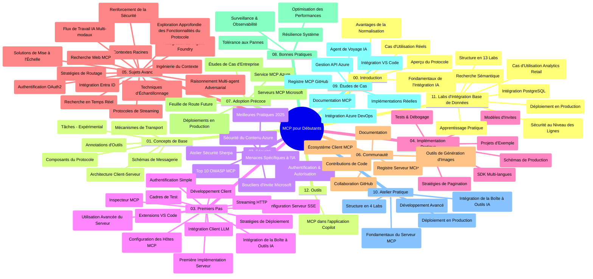

# Protocole de Contexte de Modèle (MCP) pour Débutants - Guide d'Étude

Ce guide d'étude fournit un aperçu de la structure et du contenu du dépôt pour le programme "Protocole de Contexte de Modèle (MCP) pour Débutants". Utilisez ce guide pour naviguer efficacement dans le dépôt et tirer le meilleur parti des ressources disponibles.

## Aperçu du Dépôt

Le Protocole de Contexte de Modèle (MCP) est un cadre standardisé pour les interactions entre les modèles d'IA et les applications clientes. Initialement créé par Anthropic, MCP est désormais maintenu par la communauté MCP au sens large via l'organisation officielle GitHub. Ce dépôt propose un programme complet avec des exemples pratiques en C#, Java, JavaScript, Python et TypeScript, conçu pour les développeurs d'IA, les architectes système et les ingénieurs logiciels.

## Carte Visuelle du Programme

## Structure du Dépôt

Le dépôt est organisé en douze sections principales, chacune se concentrant sur différents aspects du MCP :

1. **Introduction (00-Introduction/)**
   - Vue d'ensemble du Protocole de Contexte de Modèle
   - Pourquoi la standardisation est importante dans les pipelines IA
   - Cas d'usage pratiques et avantages

2. **Concepts de Base (01-CoreConcepts/)**
   - Architecture client-serveur
   - Composants clés du protocole
   - Modèles de messages dans MCP

3. **Sécurité (02-Security/)**
   - Menaces de sécurité dans les systèmes basés sur MCP
   - Bonnes pratiques pour sécuriser les implémentations
   - Stratégies d'authentification et d'autorisation
   - **Documentation complète sur la sécurité** :
     - Bonnes pratiques de sécurité MCP 2025
     - Guide d'implémentation Azure Content Safety
     - Contrôles et techniques de sécurité MCP
     - Référence rapide des meilleures pratiques MCP
   - **Sujets clés sur la sécurité** :
     - Attaques par injection de prompt et empoisonnement d'outils
     - Détournement de session et problèmes de "confused deputy"
     - Vulnérabilités liées au passage de jetons
     - Permissions excessives et contrôle d'accès
     - Sécurité de la chaîne d'approvisionnement pour composants IA
     - Intégration Microsoft Prompt Shields

4. **Premiers Pas (03-GettingStarted/)**
   - Configuration de l'environnement
   - Création de serveurs et clients MCP de base
   - Intégration aux applications existantes
   - Comprend des sections pour :
     - Première implémentation de serveur
     - Développement client
     - Intégration client LLM
     - Intégration VS Code
     - Serveur Server-Sent Events (SSE)
     - Usage avancé du serveur
     - Streaming HTTP
     - Intégration AI Toolkit
     - Stratégies de test
     - Directives de déploiement

5. **Implémentation Pratique (04-PracticalImplementation/)**
   - Utilisation des SDK dans différents langages de programmation
   - Techniques de débogage, test et validation
   - Création de templates de prompt réutilisables et workflows
   - Projets exemples avec démonstrations d'implémentation

6. **Sujets Avancés (05-AdvancedTopics/)**
   - Techniques de conception du contexte
   - Intégration d'agents Foundry
   - Workflows IA multimodaux
   - Démos d'authentification OAuth2
   - Capacités de recherche en temps réel
   - Streaming temps réel
   - Implémentation des contextes racines
   - Stratégies de routage
   - Techniques d’échantillonnage
   - Approches de montée en charge
   - Considérations de sécurité
   - Intégration sécurité Entra ID
   - Intégration recherche web
   - Raisonnement multi-agent adversarial (patterns de débat)

7. **Contributions Communautaires (06-CommunityContributions/)**
   - Comment contribuer au code et à la documentation
   - Collaboration via GitHub
   - Améliorations et retours communautaires
   - Utilisation de divers clients MCP (Claude Desktop, Cline, VSCode)
   - Travail avec des serveurs MCP populaires incluant la génération d’image

8. **Leçons des Premiers Adopteurs (07-LessonsfromEarlyAdoption/)**
   - Implémentations réelles et succès
   - Construction et déploiement de solutions basées MCP
   - Tendances et feuille de route future
   - **Guide des serveurs MCP Microsoft** : Guide complet de 10 serveurs MCP Microsoft prêts pour la production incluant :
     - Serveur MCP Microsoft Learn Docs
     - Serveur MCP Azure (15+ connecteurs spécialisés)
     - Serveur MCP GitHub
     - Serveur MCP Azure DevOps
     - Serveur MCP MarkItDown
     - Serveur MCP SQL Server
     - Serveur MCP Playwright
     - Serveur MCP Dev Box
     - Serveur MCP Microsoft Foundry
     - Serveur MCP Microsoft 365 Agents Toolkit

9. **Bonnes Pratiques (08-BestPractices/)**
   - Optimisation et réglage des performances
   - Conception de systèmes MCP tolérants aux pannes
   - Stratégies de test et résilience

10. **Études de Cas (09-CaseStudy/)**
    - **Sept études de cas complètes** démontrant la polyvalence MCP à travers divers scénarios :
    - **Agents de voyage AI Azure** : orchestration multi-agents avec Azure OpenAI et AI Search
    - **Intégration Azure DevOps** : automatisation des workflows avec mise à jour des données YouTube
    - **Récupération documentaire en temps réel** : client console Python avec streaming HTTP
    - **Générateur de plan d’étude interactif** : application web Chainlit avec IA conversationnelle
    - **Documentation intégrée à l’éditeur** : intégration VS Code avec workflows GitHub Copilot
    - **Gestion Azure API** : intégration API d’entreprise avec création de serveur MCP
    - **Registre MCP GitHub** : plateforme de développement écosystémique et intégration agentique
    - Exemples d’implémentation couvrant intégration enterprise, productivité développeur, et développement écosystémique

11. **Atelier Pratique (10-StreamliningAIWorkflowsBuildingAnMCPServerWithAIToolkit/)**
    - Atelier complet combinant MCP avec AI Toolkit
    - Construction d’applications intelligentes reliant modèles IA et outils pratiques
    - Modules pratiques couvrant fondamentaux, développement serveur personnalisé, et stratégies de déploiement en production
    - **Structure du laboratoire** :
      - Lab 1 : Fondamentaux du serveur MCP
      - Lab 2 : Développement avancé serveur MCP
      - Lab 3 : Intégration AI Toolkit
      - Lab 4 : Déploiement et montée en charge en production
    - Approche d’apprentissage par laboratoire avec instructions étape par étape

12. **Laboratoires d’Intégration Base de Données Serveur MCP (11-MCPServerHandsOnLabs/)**
    - **Parcours d’apprentissage complet en 13 laboratoires** pour construire des serveurs MCP prêts pour la production avec intégration PostgreSQL
    - **Implémentation analytique commerce de détail réel** avec le cas d’usage Zava Retail
    - **Patterns d’entreprise** incluant sécurité au niveau ligne (RLS), recherche sémantique, et accès multi-locataires à données
    - **Structure complète des laboratoires** :
      - **Labs 00-03 : Fondations** - Introduction, Architecture, Sécurité, Configuration environnement
      - **Labs 04-06 : Construction du serveur MCP** - Conception base données, Implémentation serveur MCP, Développement d’outils
      - **Labs 07-09 : Fonctionnalités avancées** - Recherche sémantique, Tests & débogage, Intégration VS Code
      - **Labs 10-12 : Production & Bonnes pratiques** - Déploiement, Surveillance, Optimisation
    - **Technologies couvertes** : framework FastMCP, PostgreSQL, Azure OpenAI, Azure Container Apps, Application Insights
    - **Résultats d'apprentissage** : serveurs MCP prêts production, intégration base données, analytique IA, sécurité entreprise

13. **Outils (12-tooling/)**
    - Apprenez à utiliser MCP dans l’application Copilot et autres outils

## Ressources supplémentaires

Le dépôt inclut des ressources complémentaires :

- **Dossier Images** : Contient diagrammes et illustrations utilisées tout au long du programme
- **Traductions** : Support multi-langues avec traductions automatisées de la documentation
- **Ressources officielles MCP** :
  - [Documentation MCP](https://modelcontextprotocol.io/)
  - [Spécification MCP](https://spec.modelcontextprotocol.io/)
  - [Dépôt GitHub MCP](https://github.com/modelcontextprotocol)

## Comment utiliser ce dépôt

1. **Apprentissage séquentiel** : Suivez les chapitres dans l’ordre (00 à 11) pour une expérience structurée.
2. **Focus par langage** : Si vous préférez un langage spécifique, explorez les répertoires d’exemples pour les implémentations dans la langue choisie.
3. **Mise en œuvre pratique** : Commencez par la section "Premiers pas" pour configurer votre environnement et créer votre premier serveur et client MCP.
4. **Exploration avancée** : Une fois à l’aise avec les bases, approfondissez les sujets avancés pour élargir vos connaissances.
5. **Engagement communautaire** : Rejoignez la communauté MCP via les discussions GitHub et les canaux Discord pour échanger avec des experts et autres développeurs.

## Clients et Outils MCP

Le programme couvre divers clients et outils MCP :

1. **Clients officiels** :
   - Visual Studio Code
   - MCP dans Visual Studio Code
   - Claude Desktop
   - Claude dans VSCode
   - Claude API

2. **Clients communautaires** :
   - Cline (terminal)
   - Cursor (éditeur de code)
   - ChatMCP
   - Windsurf

3. **Outils de gestion MCP** :
   - MCP CLI
   - MCP Manager
   - MCP Linker
   - MCP Router

## Serveurs MCP populaires

Le dépôt présente plusieurs serveurs MCP, notamment :

1. **Serveurs MCP Microsoft officiels** :
   - Serveur MCP Microsoft Learn Docs
   - Serveur MCP Azure (15+ connecteurs spécialisés)
   - Serveur MCP GitHub
   - Serveur MCP Azure DevOps
   - Serveur MCP MarkItDown
   - Serveur MCP SQL Server
   - Serveur MCP Playwright
   - Serveur MCP Dev Box
   - Serveur MCP Microsoft Foundry
   - Serveur MCP Microsoft 365 Agents Toolkit

2. **Serveurs de référence officiels** :
   - Filesystem
   - Fetch
   - Memory
   - Sequential Thinking

3. **Génération d’images** :
   - Azure OpenAI DALL-E 3
   - Stable Diffusion WebUI
   - Replicate

4. **Outils de développement** :
   - Git MCP
   - Terminal Control
   - Code Assistant

5. **Serveurs spécialisés** :
   - Salesforce
   - Microsoft Teams
   - Jira & Confluence

## Contributions

Ce dépôt accueille les contributions de la communauté. Consultez la section Contributions Communautaires pour des conseils sur comment contribuer efficacement à l’écosystème MCP.

----

*Ce guide d’étude a été mis à jour pour la dernière fois le 5 février 2026, reflétant la dernière Spécification MCP 2025-11-25, et présente un aperçu du contenu du dépôt à cette date. Le contenu du dépôt peut être mis à jour après cette date.*

---

<!-- CO-OP TRANSLATOR DISCLAIMER START -->
**Avertissement** :
Ce document a été traduit à l'aide du service de traduction automatique [Co-op Translator](https://github.com/Azure/co-op-translator). Bien que nous nous efforçions d'assurer l'exactitude, veuillez noter que les traductions automatisées peuvent contenir des erreurs ou des inexactitudes. Le document original dans sa langue native doit être considéré comme la source faisant autorité. Pour les informations critiques, il est recommandé de recourir à une traduction professionnelle réalisée par un humain. Nous ne saurions être tenus responsables des malentendus ou erreurs d'interprétation découlant de l'utilisation de cette traduction.
<!-- CO-OP TRANSLATOR DISCLAIMER END -->