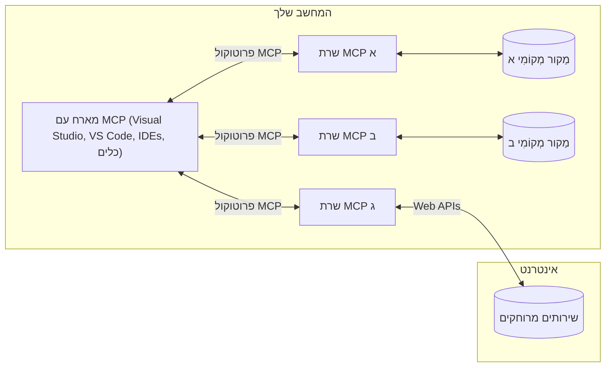

# מושגי יסוד ב-MCP: שליטה בפרוטוקול הקשר המודלי לאינטגרציה עם בינה מלאכותית

[](https://youtu.be/earDzWGtE84)

_(לחצו על התמונה למעלה כדי לצפות בסרטון של השיעור)_

[פרוטוקול הקשר המודלי (MCP)](https://github.com/modelcontextprotocol) הוא מסגרת סטנדרטית, חזקה, הממקסמת את התקשורת בין מודלים שפתיים גדולים (LLMs) וכלים, יישומים, ומקורות נתונים חיצוניים.  
מדריך זה ילווה אתכם דרך מושגי היסוד של MCP. תלמדו על ארכיטקטורת לקוח-שרת, רכיבים בסיסיים, מנגנוני תקשורת ושיטות מומלצות ליישום.

- **אישור מפורש של המשתמש**: כל גישה לנתונים וביצוע פעולות דורשים אישור מפורש של המשתמש לפני ביצוען. על המשתמשים להבין בבירור איזה נתונים ייגשו ואילו פעולות יתבצעו, עם בקרה מפורטת על הרשאות ואישורים.

- **הגנה על פרטיות הנתונים**: נתוני המשתמש נחשפים רק עם הסכמה מפורשת וצריכים להיות מוגנים באמצעות בקרות גישה חזקות לאורך כל מחזור האינטראקציה. יש למנוע העברת נתונים בלתי מורשית ולשמור על גבולות פרטיות מחמירים.

- **בטיחות ביצוע כלים**: כל קריאה לכלי דורשת הסכמת משתמש מפורשת והבנה ברורה של פונקציונליות הכלי, פרמטרים והשפעה פוטנציאלית. גבולות אבטחה חזקים מונעים ביצוע כלים לא בטוחים, לא מכוונים או זדוניים.

- **אבטחת שכבת העברת נתונים**: כל ערוצי התקשורת צריכים להשתמש בהצפנה ומנגנוני אימות מתאימים. חיבורים מרוחקים צריכים ליישם פרוטוקולי העברה מאובטחים וניהול קרדנציאלים תקין.

#### הנחיות יישום:

- **ניהול הרשאות**: יש ליישם מערכות הרשאות מפורטות המאפשרות למשתמשים לשלוט באילו שרתים, כלים ומשאבים נגישים  
- **אימות ואישור גישה**: השתמשו בשיטות אימות מאובטחות (OAuth, מפתחות API) עם ניהול וטוקנים מתאימים ותוקף  
- **אימות קלט**: אמתו את כל הפרמטרים ונתוני הקלט בהתאם לסכמות מוגדרות למניעת התקפות הזרקה  
- **רישום תהליכים**: שמרו יומנים מפורטים של כל הפעולות לניטור אבטחה ועמידה בדרישות  

## סקירה כללית

בשיעור זה נחקור את הארכיטקטורה הבסיסית והרכיבים שמרכיבים את מערכת פרוטוקול הקשר המודלי (MCP). תלמדו על ארכיטקטורת לקוח-שרת, הרכיבים המרכזיים, והמנגנונים לתקשורת שמאפשרים אינטראקציות MCP.

## יעדי למידה מרכזיים

בתום השיעור תוכלו:

- להבין את ארכיטקטורת הלקוח-שרת של MCP.  
- לזהות תפקידים ואחריויות של מארחים, לקוחות ושרתים.  
- לנתח את התכונות המרכזיות שהופכות את MCP לשכבת אינטגרציה גמישה.  
- ללמוד כיצד זורמת המידע בתוך מערכת MCP.  
- לקבל תובנות מעשיות באמצעות דוגמאות קוד ב-.NET, Java, Python ו-JavaScript.  

## ארכיטקטורת MCP: מבט מעמיק יותר

מערכת MCP בנויה על מודל לקוח-שרת. מבנה מודולרי זה מאפשר ליישומי בינה מלאכותית לתקשר ביעילות עם כלים, מסדי נתונים, APIs ומשאבים הקשריים. בואו נפרק את הארכיטקטורה הזו לרכיביה המרכזיים.

בליבה שלה, MCP פועלת על ארכיטקטורת לקוח-שרת שבה אפליקציית מארח יכולה להתחבר לכמה שרתים:


- **מארחי MCP**: תוכנות כמו VSCode, Claude Desktop, IDEs, או כלים של בינה מלאכותית שרוצים לגשת לנתונים דרך MCP  
- **לקוחות MCP**: לקוחות הפרוטוקול ששומרים על חיבורים של אחד לאחד עם השרתים  
- **שרתים MCP**: תוכנות קלות שמציגות יכולות ספציפיות דרך פרוטוקול הקשר המודלי הסטנדרטי  
- **מקורות נתונים מקומיים**: קבצים, מסדי נתונים ושירותים במחשב שלכם שאליהם שרתי MCP יכולים לגשת בצורה מאובטחת  
- **שירותים מרוחקים**: מערכות חיצוניות הזמינות באינטרנט ששרת MCP יכול להתחבר אליהן דרך APIs.  

פרוטוקול MCP הוא תקן מתפתח המשתמש בגירסת זמן מבוססת תאריך (פורמט YYYY-MM-DD). גרסת הפרוטוקול הנוכחית היא **2025-11-25**. ניתן לעיין בעדכונים האחרונים ל-[מפרט הפרוטוקול](https://modelcontextprotocol.io/specification/2025-11-25/)

### 1. מארחים

בפרוטוקול הקשר המודלי (MCP), **מארחים** הם אפליקציות בינה מלאכותית המשמשות כתווך ראשי דרכו המשתמשים מתקשרים עם הפרוטוקול. המארחים מתאמים ומנהלים חיבורים עם שרתי MCP רבים על ידי יצירת לקוחות MCP ייעודיים לכל חיבור שרת. דוגמאות למארחים כוללות:

- **אפליקציות בינה מלאכותית**: Claude Desktop, Visual Studio Code, Claude Code  
- **סביבות פיתוח**: IDEs ועורכי קוד עם אינטגרציה ל-MCP  
- **אפליקציות מותאמות אישית**: סוכני AI וכלים ייעודיים  

**המארחים** הם אפליקציות שמתאמות אינטראקציות עם מודלי AI. הן:

- **מתזמנות מודלים**: מבצעות או מתקשרות עם LLMs ליצירת תגובות ומתאמות תהליכי עבודה של AI  
- **מנהל חיבורי לקוחות**: יוצרות ושומרות על לקוח MCP אחד לכל חיבור שרת MCP  
- **שולטות בממשק המשתמש**: מנהלות את זרימת השיחה, אינטראקציות המשתמש והצגת תגובות  
- **מחויבות לאבטחה**: שולטות בהרשאות, מגבלות אבטחה ואימות  
- **מטפלות באישור משתמש**: מנהלות את אישור המשתמש לשיתוף נתונים וביצוע כלים  

### 2. לקוחות

**לקוחות** הם רכיבים חיוניים השומרים על חיבורים ייעודיים של אחד לאחד בין מארחים לשרתים MCP. כל לקוח MCP נוצר על ידי המארח כדי להתחבר לשרת MCP מסוים, ומבטיח ערוצי תקשורת מאורגנים ובטוחים. מרובות לקוחות מאפשרות למארחים להתחבר לשרתים רבים במקביל.

**לקוחות** הם רכיבי חיבור בתוך האפליקציית המארח. הם:

- **מתקשרים בפרוטוקול**: שולחים בקשות JSON-RPC 2.0 לשרתים עם הקשרים והנחיות  
- **מנהל משא ומתן על יכולות**: מנהלים משא ומתן על תכונות נתמכות וגרסאות פרוטוקול עם השרת בזמן האתחול  
- **מנהל ביצוע כלים**: מנהלים בקשות להרצת כלים מהמודלים ומעבדים תגובות  
- **עדכונים בזמן אמת**: מטפלים בהודעות ועדכונים בזמן אמת מהשרתים  
- **עיבוד תגובות**: מעבדים ומעוצבים תגובות השרת להצגה למשתמשים  

### 3. שרתים

**שרתים** הם תוכניות המספקות הקשר, כלים ויכולות ללקוחות MCP. הם יכולים לפעול מקומית (על אותו מחשב עם המארח) או מרחוק (בפלטפורמות חיצוניות), ואחראים לטפל בבקשות הלקוחות ולספק תגובות מאורגנות. השרתים מציגים פונקציונליות ספציפית דרך פרוטוקול הקשר המודלי המאוחד.

**שרתים** הם שירותים המספקים הקשר ויכולות. הם:

- **רישום תכונות**: רושמים ומציגים פרימיטיבים זמינים (משאבים, תבניות, כלים) ללקוחות  
- **עיבוד בקשות**: מקבלים ומבצעים קריאות כלים, בקשות משאבים ובקשות תבניות מהלקוחות  
- **מתן הקשר**: מספקים מידע הקשרי ונתונים לשיפור תגובות המודל  
- **ניהול מצב**: שומרים על מצב הפעלה ומטפלים באינטראקציות עם מצב כשנדרש  
- **הודעות בזמן אמת**: שולחים הודעות על שינויים ביכולות ועדכונים ללקוחות המחוברים  

שרתים ניתן לפתח על ידי כל אחד כדי להרחיב יכולות מודל עם פונקציונליות מיוחדת, ותומכים גם בפריסות מקומיות וגם מרוחקות.

### 4. פרימיטיבים של השרת

שרתים בפרוטוקול הקשר המודלי (MCP) מספקים שלושה **פרימיטיבים** מרכזיים המגדירים אבני בניין בסיסיות לאינטראקציות עשירות בין לקוחות, מארחים ומודלי שפה. הפרימיטיבים הללו מגדירים את סוגי המידע ההקשרי והפעולות הזמינות בפרוטוקול.

שרתים MCP יכולים לחשוף כל שילוב מתוך שלושת הפרימיטיבים הבסיסיים הבאים:

#### משאבים

**משאבים** הם מקורות נתונים שמספקים מידע הקשרי ליישומי AI. הם מייצגים תוכן סטטי או דינמי שיכול לשפר את ההבנה של המודל וקבלת ההחלטות:

- **נתונים הקשריים**: מידע מאורגן והקשר לצריכת מודל AI  
- **מאגרי ידע**: מאגרי מסמכים, מאמרים, מדריכים ומאמרים אקדמיים  
- **מקורות נתונים מקומיים**: קבצים, מסדי נתונים ומידע מקומי של המערכת  
- **נתונים חיצוניים**: תגובות API, שירותי רשת ונתוני מערכות מרוחקות  
- **תוכן דינמי**: נתונים בזמן אמת שמתעדכנים בהתאם לתנאים חיצוניים  

משאבים מזוהים באמצעות URI ותומכים בגילוי דרך השיטות `resources/list` ושליפת נתונים דרך `resources/read`:

```text
file://documents/project-spec.md
database://production/users/schema
api://weather/current
```
  
#### תבניות (Prompts)

**תבניות** הן תבניות רב-פעמים שעוזרות לבנות אינטראקציה עם מודלי שפה. הן מספקות דפוסי אינטראקציה סטנדרטיים וזרימות עבודה מתבניות:

- **אינטראקציות מבוססות תבנית**: הודעות מובנות מראש והתחלות שיחה  
- **תבניות זרימות עבודה**: רצפים סטנדרטיים למשימות ואינטראקציות נפוצות  
- **דוגמאות Few-shot**: תבניות מבוססות דוגמאות להוראות מודל  
- **תבניות מערכת**: תבניות יסודיות שמגדירות התנהגות הקשר מודל  
- **תבניות דינמיות**: תבניות עם פרמטרים שמסתגלות להקשרים ספציפיים  

תבניות תומכות בהחלפת משתנים וניתן לגלות אותן דרך `prompts/list` ולשליפתן עם `prompts/get`:

```markdown
Generate a {{task_type}} for {{product}} targeting {{audience}} with the following requirements: {{requirements}}
```
  
#### כלים

**כלים** הם פונקציות הניתנות להפעלה שיכולות להיות מוזמנות על ידי מודלי AI לביצוע פעולות ספציפיות. הם מייצגים את "הפעלים" במערכת MCP, ומאפשרים למודלים לתקשר עם מערכות חיצוניות:

- **פונקציות ניתנות להרצה**: פעולות מובחנות שמודלים יכולים להזמין עם פרמטרים ספציפיים  
- **אינטגרציה עם מערכות חיצוניות**: קריאות API, שאילתות למסדי נתונים, פעולות על קבצים, חישובים  
- **זהות ייחודית**: לכל כלי יש שם, תיאור, וסכמת פרמטרים מובחנת  
- **קלט ופלט מובנים**: כלים מקבלים פרמטרים מאומתים ומחזירים תגובות מובנות ומטיפוס  
- **יכולות פעולה**: מאפשרים למודלים לבצע פעולות בעולם האמיתי ולקבל נתונים חיים  

כלים מוגדרים עם סכמת JSON לאימות פרמטרים ונחשפים דרך `tools/list` ומופעלים דרך `tools/call`. כלים יכולים לכלול גם **אייקונים** כמטא-דאטה נוספת להצגה בממשק.

**הערות כלים**: כלים תומכים בהערות התנהגותיות (לדוגמה, `readOnlyHint`, `destructiveHint`) המתארות אם הכלי הוא לקריאה בלבד או הרסני, ומסייעות ללקוחות לקבל החלטות מושכלות לגבי הפעלת הכלי.

דוגמה להגדרת כלי:

```typescript
server.tool(
  "search_products", 
  {
    query: z.string().describe("Search query for products"),
    category: z.string().optional().describe("Product category filter"),
    max_results: z.number().default(10).describe("Maximum results to return")
  }, 
  async (params) => {
    // בצע חיפוש והחזר תוצאות מובנות
    return await productService.search(params);
  }
);
```
  
## פרימיטיבים של הלקוח

בפרוטוקול הקשר המודלי (MCP), **לקוחות** יכולים לחשוף פרימיטיבים שמאפשרים לשרתים לבקש יכולות נוספות מאפליקציית המארח. פרימיטיבים בצד הלקוח אלה מאפשרים מימושים עשירים ופעילים יותר של שרתים שיכולים לגשת ליכולות מודלי AI ואינטראקציות משתמש.

### דגימה (Sampling)

**דגימה** מאפשרת לשרתים לבקש השלמות ממודל השפה באפליקציית AI של הלקוח. פרימיטיב זה מאפשר לשרתים לגשת ליכולות LLM ללא הטמעת תלויות מודל מיוחדות:

- **גישה בלתי תלויה במודל**: שרתים יכולים לבקש השלמות ללא הצורך ב-SDK של LLM או ניהול גישה למודל  
- **AI המופעל על ידי השרת**: מאפשר לשרתים ליצור תוכן באופן עצמאי באמצעות המודל של הלקוח  
- **אינטראקציות רקורסיביות עם LLM**: תומך בתרחישים מורכבים שבהם שרתים זקוקים לעזרת AI לעיבודים  
- **יצירת תוכן דינמי**: מאפשר לשרתים ליצור תגובות הקשריות באמצעות המודל של המארח  
- **תמיכה בקריאת כלים**: שרתים יכולים לכלול פרמטרים `tools` ו-`toolChoice` כדי לאפשר למודל הלקוח להפעיל כלים במהלך הדגימה  

דגימה מאותחלת דרך השיטה `sampling/complete`, שם השרתים שולחים בקשות השלמה ללקוחות.

### שורשים (Roots)

**שורשים** מספקים דרך סטנדרטית עבור הלקוחות לחשוף גבולות מערכת קבצים לשרתים, ומסייעים לשרתים להבין לאילו תיקיות וקבצים יש גישה:

- **גבולות מערכת קבצים**: מגדירים את הגבולות שבהם השרתים יכולים לפעול בתוך מערכת הקבצים  
- **בקרת גישה**: מסייעים לשרתים להבין לאילו תיקיות וקבצים יש להם הרשאה לגשת  
- **עדכונים דינמיים**: לקוחות יכולים להודיע לשרתים כאשר רשימת השורשים משתנה  
- **זיהוי מבוסס URI**: שורשים משתמשים ב-URI מסוג `file://` לזיהוי תיקיות וקבצים נגישים  

שורשים מתגלים דרך השיטה `roots/list`, עם שליחת התראות `notifications/roots/list_changed` מלקוחות כששורשים משתנים.

### בקשות מידע (Elicitation)

**בקשות מידע** מאפשרות לשרתים לבקש מידע נוסף או אישור מהמשתמשים דרך ממשק הלקוח:

- **בקשות קלט משתמש**: שרתים יכולים לבקש מידע נוסף כאשר נדרש להפעלת כלים  
- **תיבות אישור**: בקשת אישור משתמש עבור פעולות רגישות או בעלות השפעה משמעותית  
- **זרימות עבודה אינטראקטיביות**: מאפשרים לשרתים ליצור אינטראקציות משתמש שלב אחרי שלב  
- **איסוף פרמטרים דינמי**: איסוף פרמטרים חסרים או אופציונליים במהלך הפעלת הכלי  

בקשות אלו נעשות באמצעות השיטה `elicitation/request` לאיסוף קלט משתמש דרך ממשק הלקוח.

**בקשת אינטראקציה במצב URL**: שרתים יכולים גם לבקש אינטראקציות משתמש מבוססות URL, ומאפשרים לשרתים להפנות משתמשים לדפי אינטרנט חיצוניים לאימות, אישור או הזנת נתונים.

### רישום יומנים (Logging)

**רישום יומנים** מאפשר לשרתים לשלוח הודעות לוג מובנות ללקוחות למטרות ניפוי שגיאות, ניטור וחשיפת פעולות:

- **תמיכה בניפוי שגיאות**: מאפשר לשרתים לספק יומני ביצוע מפורטים לפתרון בעיות  
- **ניטור תפעולי**: שליחת עדכוני מצב ומדדי ביצועים ללקוחות  
- **דיווח על שגיאות**: מתן הקשר שגיאה מפורט ומידע דיאגנוסטי  
- **שבילים ביקורתיים**: יצירת יומנים מקיפים של פעולות והחלטות השרת  

הודעות רישום נשלחות ללקוחות כדי לספק שקיפות לפעולות השרת ולסייע בניפוי שגיאות.

## זרימת מידע ב-MCP

פרוטוקול הקשר המודלי (MCP) מגדיר זרימה מאורגנת של מידע בין מארחים, לקוחות, שרתים ומודלים. הבנת הזרימה הזו מסייעת להבהיר כיצד בקשות המשתמש מעובדות וכיצד כלים חיצוניים ונתונים משתלבים בתגובות המודל.
- **המארח יוזם את הקשר**  
  אפליקציית המארח (כגון IDE או ממשק שיחה) מייצרת קשר עם שרת MCP, בדרך כלל באמצעות STDIO, WebSocket או אמצעי העברה נתמך אחר.

- **משא ומתן על יכולות**  
  הלקוח (המוטמע במארח) והשרת מחליפים מידע על התכונות, הכלים, המשאבים וגרסאות הפרוטוקול הנתמכים. זה מבטיח ששני הצדדים מבינים אילו יכולות זמינות למפגש.

- **בקשת משתמש**  
  המשתמש מתקשר עם המארח (למשל, מזין בקשה או פקודה). המארח אוסף את הקלט ומעביר אותו ללקוח לעיבוד.

- **שימוש במשאבים או בכלים**  
  - הלקוח עשוי לבקש הקשר נוסף או משאבים מהשרת (כגון קבצים, רשומות ממסד נתונים או מאמרים ממאגר ידע) כדי להעשיר את הבנת המודל.  
  - אם המודל קובע שכלי דרוש (למשל, לשלוף נתונים, לבצע חישוב או לקרוא ל-API), הלקוח שולח בקשת קריאה לכלי לשרת, וציין את שם הכלי והפרמטרים.

- **ביצוע בשרת**  
  השרת מקבל את בקשת המשאב או הכלי, מבצע את הפעולות הנדרשות (כגון הרצת פונקציה, שאילתא למסד נתונים או שליפת קובץ), ומחזיר את התוצאות ללקוח בפורמט מובנה.

- **יצירת תגובה**  
  הלקוח משלב את תגובות השרת (נתוני משאבים, פלטים של כלים וכו') באינטראקציה השוטפת עם המודל. המודל משתמש במידע זה כדי ליצור תגובה מקיפה ורלוונטית להקשר.

- **הצגת התוצאה**  
  המארח מקבל את הפלט הסופי מהלקוח ומציג אותו למשתמש, לעיתים כולל גם את הטקסט שנוצר על ידי המודל ואת התוצאות מביצוע הכלים או שליפת המשאבים.

זרימה זו מאפשרת ל-MCP לתמוך באפליקציות AI מתקדמות, אינטראקטיביות ומודעות להקשר באמצעות חיבור חלק בין מודלים לכלים ומשאבים חיצוניים.

## ארכיטקטורת הפרוטוקול ושכבותיו

MCP מורכב משתי שכבות ארכיטקטוניות נפרדות שפועלות יחד כדי לספק מסגרת תקשורת מלאה:

### שכבת הנתונים

שכבת **הנתונים** מממשת את פרוטוקול MCP המרכזי באמצעות **JSON-RPC 2.0** כבסיס. שכבה זו מגדירה את מבנה ההודעה, סמנטיקה ודפוסי אינטראקציה:

#### רכיבים עיקריים:

- **פרוטוקול JSON-RPC 2.0**: כל התקשורת משתמשת בפורמט הודעות JSON-RPC 2.0 סטנדרטי לקריאות, תגובות והודעות  
- **ניהול מחזור חיים**: מטפל באתחול הקשר, משא ומתן על יכולות וסיום מפגש בין לקוחות לשרתים  
- **Primitive של השרת**: מאפשר לשרתים לספק פונקציונליות בסיסית באמצעות כלים, משאבים והנחיות  
- **Primitive של הלקוח**: מאפשר לשרתים לדרוש דגימה מ-LLMs, לקבל כניסות משתמש ולשלוח הודעות לוג  
- **התראות בזמן אמת**: תומך בהתראות אסינכרוניות לעדכונים דינמיים ללא poll

#### תכונות מרכזיות:

- **משא ומתן על גרסת פרוטוקול**: משתמש בגרסאות מבוססות תאריך (YYYY-MM-DD) להבטחת תאימות  
- **גילוי יכולות**: לקוחות ושרתים מחליפים מידע על תכונות נתמכות באתחול  
- **מפגשים בעלי מצב**: שומר על מצב קשר לאורך אינטראקציות מרובות לשמירת הקשר

### שכבת ההעברה

שכבת **ההעברה** מנהלת את ערוצי התקשורת, מסגור ההודעות ואימות בין משתתפי MCP:

#### מנגנוני העברה נתמכים:

1. **העברת STDIO**:  
   - משתמשת בזרמי קלט/פלט סטנדרטיים לתקשורת ישירה בין תהליכים  
   - מיטבית לתהליכים מקומיים על אותו מכשיר ללא עומס רשת  
   - נפוצה ליישום שרתי MCP מקומיים

2. **העברת HTTP המאפשרת סטרימינג**:  
   - משתמשת ב-HTTP POST להודעות מלקוח לשרת  
   - אירועי שרת חוזרים (SSE) אופציונליים לסטרימינג משרת ללקוח  
   - מאפשרת תקשורת מרוחקת בין שרתים דרך רשתות  
   - תומכת באימות HTTP סטנדרטי (Bearer Tokens, מפתחות API, כותרות מותאמות)  
   - MCP ממליצה על OAuth לאימות בטוח מבוסס טוקנים

#### אבסטרקציה של ההעברה:

שכבת ההעברה מבודדת את פרטי התקשורת משכבת הנתונים, ומאפשרת שימוש בפורמט הודעות JSON-RPC 2.0 אחיד בכל מנגנוני ההעברה. אבסטרקציה זו מאפשרת מעבר חלק בין שרתים מקומיים ומרוחקים.

### שיקולי אבטחה

יישומי MCP חייבים לעמוד בכמה עקרונות אבטחה קריטיים כדי להבטיח אינטראקציות בטוחות, אמינות ומאובטחות בכל פעולות הפרוטוקול:

- **הסכמה ושליטה של המשתמש**: על המשתמשים לתת הסכמה מפורשת לפני כל גישה לנתונים או ביצוע פעולות. עליהם לשלוט בבירור איזה מידע משותף ואילו פעולות מורשות, נתמך בממשקי משתמש אינטואיטיביים לסקירה ואישור פעילויות.

- **פרטיות נתונים**: נתוני משתמש יוצגו רק ברשות מפורשת ויימנע גישה לא מורשית. יישומי MCP חייבים להגן מפני העברת מידע בלתי מורשית ולהבטיח פרטיות לאורך כל האינטראקציות.

- **בטיחות הכלים**: לפני הפעלת כל כלי דרושה הסכמה מפורשת של המשתמש. המשתמש צריך להבין בבירור את פונקציונליות הכלי, וגבולות אבטחה חזקים צריכים למנוע הפעלה בלתי מכוונת או מסוכנת של הכלים.

כאשר עקרונות אבטחה אלו מיושמים, MCP מבטיח אמון, פרטיות ובטיחות המשתמשים בכל האינטראקציות, ומאפשר אינטגרציות AI חזקות.

## דוגמאות קוד: רכיבים עיקריים

להלן דוגמאות קוד במספר שפות תכנות פופולריות המדגימות כיצד לממש רכיבי שרת MCP וכלים.

### דוגמת .NET: יצירת שרת MCP פשוט עם כלים

הנה דוגמת קוד מעשית ב-.NET המדגימה כיצד לממש שרת MCP פשוט עם כלים מותאמים. דוגמה זו מראה כיצד להגדיר ולהרשם כלים, לטפל בבקשות ולחבר את השרת באמצעות פרוטוקול Model Context.

```csharp
using System;
using System.Threading.Tasks;
using ModelContextProtocol.Server;
using ModelContextProtocol.Server.Transport;
using ModelContextProtocol.Server.Tools;

public class WeatherServer
{
    public static async Task Main(string[] args)
    {
        // Create an MCP server
        var server = new McpServer(
            name: "Weather MCP Server",
            version: "1.0.0"
        );
        
        // Register our custom weather tool
        server.AddTool<string, WeatherData>("weatherTool", 
            description: "Gets current weather for a location",
            execute: async (location) => {
                // Call weather API (simplified)
                var weatherData = await GetWeatherDataAsync(location);
                return weatherData;
            });
        
        // Connect the server using stdio transport
        var transport = new StdioServerTransport();
        await server.ConnectAsync(transport);
        
        Console.WriteLine("Weather MCP Server started");
        
        // Keep the server running until process is terminated
        await Task.Delay(-1);
    }
    
    private static async Task<WeatherData> GetWeatherDataAsync(string location)
    {
        // This would normally call a weather API
        // Simplified for demonstration
        await Task.Delay(100); // Simulate API call
        return new WeatherData { 
            Temperature = 72.5,
            Conditions = "Sunny",
            Location = location
        };
    }
}

public class WeatherData
{
    public double Temperature { get; set; }
    public string Conditions { get; set; }
    public string Location { get; set; }
}
```

### דוגמת Java: רכיבי שרת MCP

דוגמה זו מדגימה את אותו שרת MCP והרשמת כלים כמו בדוגמת .NET מעלה, אך מיושמת ב-Java.

```java
import io.modelcontextprotocol.server.McpServer;
import io.modelcontextprotocol.server.McpToolDefinition;
import io.modelcontextprotocol.server.transport.StdioServerTransport;
import io.modelcontextprotocol.server.tool.ToolExecutionContext;
import io.modelcontextprotocol.server.tool.ToolResponse;

public class WeatherMcpServer {
    public static void main(String[] args) throws Exception {
        // יצירת שרת MCP
        McpServer server = McpServer.builder()
            .name("Weather MCP Server")
            .version("1.0.0")
            .build();
            
        // רישום כלי למזג אוויר
        server.registerTool(McpToolDefinition.builder("weatherTool")
            .description("Gets current weather for a location")
            .parameter("location", String.class)
            .execute((ToolExecutionContext ctx) -> {
                String location = ctx.getParameter("location", String.class);
                
                // קבלת נתוני מזג אוויר (פשטני)
                WeatherData data = getWeatherData(location);
                
                // החזר תגובה מעוצבת
                return ToolResponse.content(
                    String.format("Temperature: %.1f°F, Conditions: %s, Location: %s", 
                    data.getTemperature(), 
                    data.getConditions(), 
                    data.getLocation())
                );
            })
            .build());
        
        // חיבור השרת באמצעות תחבורה stdio
        try (StdioServerTransport transport = new StdioServerTransport()) {
            server.connect(transport);
            System.out.println("Weather MCP Server started");
            // שמירת השרת פועל עד שהפרוסס יופסק
            Thread.currentThread().join();
        }
    }
    
    private static WeatherData getWeatherData(String location) {
        // יישום היה קורא ל-API של מזג אוויר
        // פושט לצורכי דוגמה
        return new WeatherData(72.5, "Sunny", location);
    }
}

class WeatherData {
    private double temperature;
    private String conditions;
    private String location;
    
    public WeatherData(double temperature, String conditions, String location) {
        this.temperature = temperature;
        this.conditions = conditions;
        this.location = location;
    }
    
    public double getTemperature() {
        return temperature;
    }
    
    public String getConditions() {
        return conditions;
    }
    
    public String getLocation() {
        return location;
    }
}
```

### דוגמת Python: בניית שרת MCP

דוגמה זו משתמשת ב-fastmcp, יש לוודא שהתקנתם מראש:

```python
pip install fastmcp
```
דוגמת קוד:

```python
#!/usr/bin/env python3
import asyncio
from fastmcp import FastMCP
from fastmcp.transports.stdio import serve_stdio

# יצירת שרת FastMCP
mcp = FastMCP(
    name="Weather MCP Server",
    version="1.0.0"
)

@mcp.tool()
def get_weather(location: str) -> dict:
    """Gets current weather for a location."""
    return {
        "temperature": 72.5,
        "conditions": "Sunny",
        "location": location
    }

# גישה חלופית באמצעות מחלקה
class WeatherTools:
    @mcp.tool()
    def forecast(self, location: str, days: int = 1) -> dict:
        """Gets weather forecast for a location for the specified number of days."""
        return {
            "location": location,
            "forecast": [
                {"day": i+1, "temperature": 70 + i, "conditions": "Partly Cloudy"}
                for i in range(days)
            ]
        }

# רישום כלים של המחלקה
weather_tools = WeatherTools()

# הפעלת השרת
if __name__ == "__main__":
    asyncio.run(serve_stdio(mcp))
```

### דוגמת JavaScript: יצירת שרת MCP

דוגמה זו מראה יצירת שרת MCP ב-JavaScript וכיצד לרשום שני כלים הקשורים למזג אוויר.

```javascript
// שימוש ב-SDK הרשמי של פרוטוקול הקשר של הדגם
import { McpServer } from "@modelcontextprotocol/sdk/server/mcp.js";
import { StdioServerTransport } from "@modelcontextprotocol/sdk/server/stdio.js";
import { z } from "zod"; // לאימות פרמטרים

// יצירת שרת MCP
const server = new McpServer({
  name: "Weather MCP Server",
  version: "1.0.0"
});

// הגדרת כלי חיזוי מזג אוויר
server.tool(
  "weatherTool",
  {
    location: z.string().describe("The location to get weather for")
  },
  async ({ location }) => {
    // זוהי בדרך כלל קריאה ל-API של מזג אוויר
    // מופשט לצורכי הדגמה
    const weatherData = await getWeatherData(location);
    
    return {
      content: [
        { 
          type: "text", 
          text: `Temperature: ${weatherData.temperature}°F, Conditions: ${weatherData.conditions}, Location: ${weatherData.location}` 
        }
      ]
    };
  }
);

// הגדרת כלי תחזית
server.tool(
  "forecastTool",
  {
    location: z.string(),
    days: z.number().default(3).describe("Number of days for forecast")
  },
  async ({ location, days }) => {
    // זוהי בדרך כלל קריאה ל-API של מזג אוויר
    // מופשט לצורכי הדגמה
    const forecast = await getForecastData(location, days);
    
    return {
      content: [
        { 
          type: "text", 
          text: `${days}-day forecast for ${location}: ${JSON.stringify(forecast)}` 
        }
      ]
    };
  }
);

// פונקציות עזר
async function getWeatherData(location) {
  // סימולציה של קריאת API
  return {
    temperature: 72.5,
    conditions: "Sunny",
    location: location
  };
}

async function getForecastData(location, days) {
  // סימולציה של קריאת API
  return Array.from({ length: days }, (_, i) => ({
    day: i + 1,
    temperature: 70 + Math.floor(Math.random() * 10),
    conditions: i % 2 === 0 ? "Sunny" : "Partly Cloudy"
  }));
}

// חיבור השרת באמצעות תחבורה stdio
const transport = new StdioServerTransport();
server.connect(transport).catch(console.error);

console.log("Weather MCP Server started");
```

דוגמה זו מדגימה יצירת שרת MCP באמצעות ה-SDK של פרוטוקול Model Context. היא מראה כיצד לרשום שני כלים בשם `weatherTool` ו-`forecastTool` ולהפוך אותם לזמינים ללקוחות MCP דרך ה-StdioServerTransport.

## אבטחה והרשאות

MCP כולל מספר מושגים ומנגנונים מובנים לניהול אבטחה והרשאות לאורך כל הפרוטוקול:

1. **בקרת הרשאות כלים**:  
  לקוחות יכולים לציין אילו כלים מותר למודל להשתמש במהלך מפגש. זה מוודא שרק כלים מורשים במפורש נגישים, ומקטין סיכון לפעולות בלתי מכוונות או מסוכנות. הרשאות יכולות להיות מוגדרות דינמית על סמך העדפות משתמש, מדיניות ארגונית או הקשר האינטראקציה.

2. **זיהוי ואימות**:  
  שרתים יכולים לדרוש אימות לפני מתן גישה לכלים, משאבים או פעולות רגישות. זה יכול לכלול מפתחות API, טוקני OAuth או שיטות אימות אחרות. אימות נכון מבטיח שרק לקוחות ומשתמשים מהימנים יכולים לקרוא את יכולות השרת.

3. **אימות פרמטרים**:  
  אימות הפרמטרים נאכף בכל קריאות הכלים. כל כלי מגדיר את סוגי, הפורמטים והמגבלות הצפויים לפרמטרים שלו, והשרת מאמת בקשות נכנסות בהתאם. זה מונע קלט שגוי או זדוני מהגעה למימוש הכלי ועוזר לשמור על תקינות הפעולות.

4. **הגבלת קצב**:  
  למניעת ניצול לרעה והבטחת שימוש הוגן במשאבי השרת, שרתי MCP יכולים לממש הגבלת קצב לקריאות כלים ולגישה למשאבים. הגבלות יכולות להיות ליחידת משתמש, מפגש או גלובליות, ומגנות מפני מתקפות מניעת שירות או שימוש יתר במשאבים.

באמצעות שילוב מנגנונים אלו, MCP מספק תשתית מאובטחת לשילוב מודלי שפה עם כלים ומשאבים חיצוניים, תוך מתן שליטה מדויקת למשתמשים ולמפתחים על גישה ושימוש.

## הודעות הפרוטוקול וזרימת התקשורת

תקשורת MCP משתמשת בהודעות **JSON-RPC 2.0** מובנות כדי לאפשר אינטראקציות ברורות ואמינות בין מארחים, לקוחות ושרתים. הפרוטוקול מגדיר דפוסי הודעות ספציפיים לסוגי פעולות שונים:

### סוגי הודעות בסיסיים:

#### **הודעות אתחול**  
- בקשת `initialize`: מקימה קשר ומנהלת משא ומתן על גרסת הפרוטוקול ויכולות  
- תגובת `initialize`: מאשרת תכונות נתמכות ומידע על השרת  
- `notifications/initialized`: מסמן כי האתחול הושלם והמושב מוכן

#### **הודעות גילוי**  
- בקשת `tools/list`: מגלה כלים זמינים מהשרת  
- בקשת `resources/list`: מפרט משאבים זמינים (מקורות נתונים)  
- בקשת `prompts/list`: מביא תבניות הנחיה זמינות

#### **הודעות ביצוע**  
- בקשת `tools/call`: מבצעת קריאה לכלי מסוים עם פרמטרים ניתנים  
- בקשת `resources/read`: מושכת תוכן ממשאב מסוים  
- בקשת `prompts/get`: מביאה תבנית הנחיה עם פרמטרים אופציונליים

#### **הודעות צד לקוח**  
- בקשת `sampling/complete`: השרת מבקש השלמה מ-LLM מהלקוח  
- `elicitation/request`: השרת מבקש קלט משתמש דרך ממשק הלקוח  
- הודעות רישום (Logging): השרת שולח הודעות לוג מובנות ללקוח

#### **הודעות התראה**  
- `notifications/tools/list_changed`: השרת מודיע ללקוח על שינוי ברשימת הכלים  
- `notifications/resources/list_changed`: השרת מודיע ללקוח על שינוי ברשימת המשאבים  
- `notifications/prompts/list_changed`: השרת מודיע ללקוח על שינוי ברשימת ההנחיות

### מבנה ההודעה:

כל הודעות MCP עוקבות אחרי פורמט JSON-RPC 2.0 עם:  
- הודעות בקשה: כוללות `id`, `method` ופרמטרים אופציונליים  
- הודעות תגובה: כוללות `id` ו-`result` או `error`  
- הודעות התראה: כוללות `method` ופרמטרים אופציונליים (ללא `id` או תגובה צפויה)

תשתית תקשורת זו מבטיחה אינטראקציה אמינה, ניתנת למעקב והרחבה, התומכת בתרחישים מתקדמים כגון עדכונים בזמן אמת, שרשור כלים וטיפול שגיאות חזק.

### משימות (ניסיוניות)

**משימות** הן תכונה ניסיונית המספקת עטיפות ביצוע עמידות המאפשרות אחזור תוצאות מאוחר ומעקב סטטוס עבור בקשות MCP:

- פעולות ארוכות טווח: מעקב אחרי חישובים יקרים, אוטומציה של זרימות עבודה, עיבוד אצוות  
- תוצאות במועד מאוחר: שאילת סטטוס המשימה ואחזור תוצאות לאחר סיום ההפעלה  
- מעקב סטטוס: ניטור התקדמות המשימה דרך מצבי מחזור חיים מוגדרים  
- פעולות מרובות שלבים: תמיכה בזרימות עבודה מורכבות המשתרעות על פני אינטראקציות רבות

משימות עוטפות בקשות MCP סטנדרטיות כדי לאפשר דפוסי ביצוע אסינכרוניים עבור פעולות שאינן יכולות להסתיים מיידית.

## מסקנות מרכזיות

- **ארכיטקטורה**: MCP משתמש בארכיטקטורת לקוח-שרת שבה מארחים מנהלים חיבורים מרובים של לקוחות לשרתים  
- **משתתפים**: האקוסיסטם כולל מארחים (אפליקציות AI), לקוחות (מחברי פרוטוקול) ושרתים (מייצרי יכולות)  
- **מנגנוני העברה**: תקשורת תומכת ב- STDIO (מקומי) ו- HTTP סטרימינג עם אפשרות SSE (מרוחק)  
- **Primitive עיקריים**: שרתים חושפים כלים (פונקציות ניתנות להרצה), משאבים (מקורות נתונים) והנחיות (תבניות)  
- **Primitive של הלקוח**: שרתים יכולים לבקש דגימות (השלמות LLM עם תמיכה בקריאה לכלים), קבלת קלט (כולל מצב URL), גבולות מערכת קבצים, ולוגים מהלקוחות  
- **תכונות ניסיוניות**: משימות מספקות עטיפות ביצוע עמידות לפעולות ארוכות טווח  
- **בסיס הפרוטוקול**: מבוסס JSON-RPC 2.0 עם גרסת תאריך (נוכחי: 2025-11-25)  
- **יכולות בזמן אמת**: תומך בהתראות לעדכונים דינמיים וסינכרון בזמן אמת  
- **אבטחה בראש סדר העדיפויות**: הסכמה מפורשת של המשתמש, הגנת פרטיות, ותקשורת מאובטחת הם דרישות ליבה

## תרגיל

עצב כלי MCP פשוט שיהיה שימושי בתחום שלך. הגדר:  
1. שם הכלי  
2. אילו פרמטרים הוא יקבל  
3. איזה פלט הוא יחזיר  
4. כיצד מודל יכול להשתמש בכלי זה לפתרון בעיות משתמשים


---

## מה הלאה

הבא: [פרק 2: אבטחה](../02-Security/README.md)

---

<!-- CO-OP TRANSLATOR DISCLAIMER START -->
**כתב ויתור**:  
מסמך זה תורגם באמצעות שירות תרגום מבוסס בינה מלאכותית [Co-op Translator](https://github.com/Azure/co-op-translator). למרות שאנו שואפים לדיוק, יש להיות מודעים לכך שתרגומים אוטומטיים עשויים להכיל שגיאות או אי דיוקים. יש להתחשב במסמך המקורי בשפתו המקורית כמקור הסמכות. למידע הקריטי מומלץ להיעזר בתרגום מקצועי ובידי אדם. אנו לא נושאים באחריות לכל אי הבנה או פרשנות שגויה הנובעת משימוש בתרגום זה.
<!-- CO-OP TRANSLATOR DISCLAIMER END -->