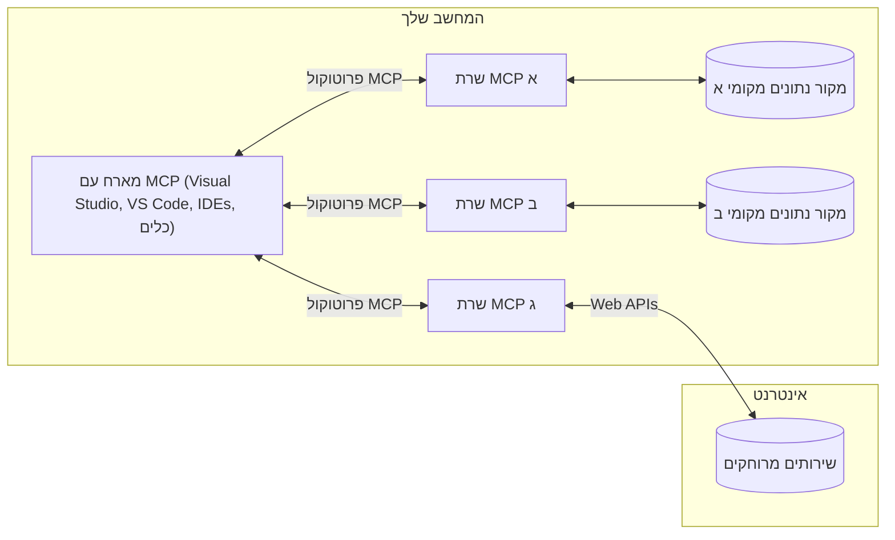

# מושגי יסוד ב-MCP: שליטה בפרוטוקול הקשר המודל לשילוב AI

[](https://youtu.be/earDzWGtE84)

_(לחצו על התמונה למעלה לצפייה בסרטון השיעור)_

[פרוטוקול הקשר של המודל (MCP)](https://github.com/modelcontextprotocol) הוא מסגרת סטנדרטית וחזקה המייעלת את התקשורת בין מודלים לשוניים גדולים (LLMs) לכלים חיצוניים, אפליקציות ומקורות נתונים. 
מדריך זה ילווה אתכם במושגי היסוד של MCP. תלמדו על ארכיטקטורת הלקוח-שרת שלו, רכיבים חיוניים, מנגנוני תקשורת, ופרקטיקות מימוש מיטביות.

- **אישור מפורש מהמשתמש**: כל גישה לנתונים ופעולות מחייבות אישור מפורש מהמשתמש לפני ביצוע. המשתמשים חייבים להבין בצורה ברורה איזה נתונים ייגשו ואילו פעולות יתבצעו, עם שליטה מדויקת בהרשאות ובאישורים.

- **הגנת פרטיות הנתונים**: נתוני משתמשים נחשפים רק עם אישור מפורש וחייבים להיות מוגנים באמצעות בקרות גישה קפדניות לאורך כל מחזור האינטראקציה. יש למנוע העברת נתונים בלתי מורשית ולשמור על גבולות פרטיות מחמירים.

- **בטיחות ביצוע כלים**: כל קריאה לכלי מחייבת אישור מפורש של המשתמש עם הבנה ברורה של תפקוד הכלי, הפרמטרים וההשפעה האפשרית. גבולות אבטחה חזקים חייבים למנוע ביצוע כלים לא בטוח, לא מכוון או זדוני.

- **אבטחת שכבת התעבורה**: כל ערוצי התקשורת צריכים להשתמש במנגנוני הצפנה ואימות מתאימים. חיבורים מרוחקים חייבים ליישם פרוטוקולי תעבורה מאובטחים וניהול נתונים מתאים.

#### קווי הנחיה למימוש:

- **ניהול הרשאות**: ליישם מערכות הרשאה מדויקות המאפשרות למשתמשים לשלוט באילו שרתים, כלים ומשאבים נגישים  
- **אימות והרשאות**: להשתמש בשיטות אימות בטוחות (OAuth, מפתחות API) עם ניהול תוקף וסימני גישה  
- **אימות קלט**: לאמת את כל הפרמטרים והנתונים לפי סכימות מוגדרות למניעת מתקפות הזרקה  
- **רישום בקרה**: לשמור יומנים מלאים של כל הפעולות לצורך ניטור אבטחה וציות

## סקירה כללית

שיעור זה בוחן את הארכיטקטורה הבסיסית והרכיבים שמהווים את אקוסיסטם פרוטוקול הקשר של המודל (MCP). תלמדו על ארכיטקטורת לקוח-שרת, רכיבים מרכזיים ומנגנוני תקשורת המניעים את אינטראקציות ה-MCP.

## יעדים מרכזיים ללמידה

בסיום שיעור זה, תוכלו:

- להבין את ארכיטקטורת הלקוח-שרת של MCP.
- לזהות תפקידים ואחריות של Hosts, Clients ו-Servers.
- לנתח את התכונות המרכזיות שהופכות את MCP לשכבת אינטגרציה גמישה.
- ללמוד כיצד המידע זורם בתוך אקוסיסטם ה-MCP.
- להשיג תובנות מעשיות באמצעות דוגמאות קוד ב-.NET, Java, Python ו-JavaScript.

## ארכיטקטורת MCP: מבט עמוק יותר

אקוסיסטם MCP בנוי על מודל לקוח-שרת. מבנה מודולרי זה מאפשר לאפליקציות AI לקיים אינטראקציה עם כלים, מסדי נתונים, APIs ומשאבי הקשר באופן יעיל. נפרק את הארכיטקטורה לרכיבים מרכזיים.

בלב הפרוטוקול, MCP פועל בארכיטקטורת לקוח-שרת שבה אפליקציית מארח יכולה להתחבר למספר שרתים:


- **MCP Hosts**: תוכניות כמו VSCode, Claude Desktop, IDEs או כלים ל-AI שרוצים לגשת לנתונים דרך MCP  
- **MCP Clients**: לקוחות פרוטוקול שמקיימים חיבורים 1:1 עם שרתים  
- **MCP Servers**: תוכניות קלות שמציגות יכולות ספציפיות דרך פרוטוקול הקשר של המודל הסטנדרטי  
- **מקורות נתונים מקומיים**: קבצים, מסדי נתונים ושירותים במחשב שלכם שאליהם שרתי MCP יכולים לגשת בביטחה  
- **שירותים מרוחקים**: מערכות חיצוניות זמינות דרך האינטרנט שאליהם שרתי MCP יכולים להתחבר דרך APIs.

פרוטוקול MCP הוא תקן מתפתח המשתמש בגרסאות לפי תאריך (פורמט YYYY-MM-DD). גרסת הפרוטוקול הנוכחית היא **2025-11-25**. ניתן לראות את העדכונים האחרונים ב-[מפרט הפרוטוקול](https://modelcontextprotocol.io/specification/2025-11-25/)

### 1. מארחים (Hosts)

בפרוטוקול הקשר של המודל (MCP), **המארחים** הם אפליקציות AI המשמשות כממשק הראשי שדרכו המשתמשים מתקשרים עם הפרוטוקול. המארחים מתאמים ומנהלים חיבורים למספר שרתי MCP על ידי יצירת לקוחות MCP ייעודיים לכל חיבור שרת. דוגמאות למארחים כוללות:

- **אפליקציות AI**: Claude Desktop, Visual Studio Code, Claude Code  
- **סביבות פיתוח**: IDEs ועורכי קוד עם אינטגרציית MCP   
- **אפליקציות מותאמות אישית**: סוכני AI וכלים ייעודיים

**מארחים** הם אפליקציות המתאמות אינטראקציות עם מודלים. הם:

- **מתאמים מודלים של AI**: מבצעים או מקיימים אינטראקציה עם LLMs ליצירת תגובות ותיאום זרימות עבודה  
- **מנהלים חיבורי לקוח**: יוצרים ומתחזקים לקוח MCP אחד לכך חיבור שרת אחד  
- **שולטים בממשק המשתמש**: מנהלים זרימת שיחה, אינטראקציות משתמש והצגת תגובות  
- **אוכפים אבטחה**: שולטות בהרשאות, מגבלות אבטחה ואימות  
- **מומשכים אישור משתמש**: מנהלים הסכמות משתמש לשיתוף נתונים ולהרצת כלים

### 2. לקוחות (Clients)

**הלקוחות** הם רכיבים חיוניים המתאמים חיבורים ייעודיים אחד-על-אחד בין מארחים לשרתי MCP. כל לקוח MCP מופעל על ידי המארח כדי להתחבר לשרת MCP ספציפי, ומבטיח ערוצי תקשורת מאורגנים ובטוחים. מספר לקוחות מאפשרים למארחים להתחבר למספר שרתים במקביל.

**לקוחות** הם רכיבי חיבור בתוך אפליקציית המארח. הם:

- **תקשורת פרוטוקול**: שולחים בקשות JSON-RPC 2.0 לשרתים עם בקשות והוראות  
- **משא ומתן על יכולות**: מנהלים משא ומתן עם השרתים על תכונות נתמכות וגרסאות פרוטוקול בהפעלה  
- **הרצת כלים**: מנהלים בקשות להרצת כלים מהמודלים ומעבדים תגובות  
- **עדכונים בזמן אמת**: מטפלים בהתראות ועדכונים בזמן אמת מהשרתים  
- **עיבוד תגובות**: מעבדים ומעצבנים תגובות שרת להצגה למשתמשים

### 3. שרתים (Servers)

**השרתים** הם תוכניות המספקות הקשר, כלים ויכולות ללקוחות MCP. הם יכולים לפעול במחשב המקומי (אותו מכשיר כמו המארח) או מרחוק (על פלטפורמות חיצוניות), ובאחריותם לטפל בבקשות הלקוחות ולספק תגובות מובנות. השרתים מציגים פונקציונליות ספציפית דרך פרוטוקול הקשר הסטנדרטי.

**שרתים** הם שירותים המספקים הקשר ויכולות. הם:

- **רישום תכונות**: רושמים ומציגים פרימיטיבים זמינים (משאבים, תבניות, כלים) ללקוחות  
- **עיבוד בקשות**: מקבלים ומבצעים קריאות לכלים, בקשות משאבים ותבניות מהלקוחות  
- **מתן הקשר**: מספקים מידע הקשרי ונתונים לשיפור תגובות המודל  
- **ניהול מצב**: שומרים מצב סשן ומטפלים באינטראקציות מצביות אם נדרש  
- **התראות בזמן אמת**: שולחים התראות על שינויים ביכולות ועדכונים ללקוחות המחוברים

אפשר לפתח שרתים על ידי כל אחד להרחיב את יכולות המודל עם פונקציונליות מתמחה, והם תומכים בתרחישי פריסה מקומיים ומרוחקים.

### 4. פרימיטיבים של השרת

שרתים בפרוטוקול הקשר של המודל (MCP) מספקים שלושה **פרימיטיבים** מרכזיים המגדירים את אבני היסוד לאינטראקציות עשירות בין לקוחות, מארחים ומודלים לשוניים. פרימיטיבים אלו מגדירים את סוגי המידע ההקשרי והפעולות הזמינות בפרוטוקול.

שרתים ב-MCP יכולים לחשוף כל שילוב מהפרימיטיבים המרכזיים הבאים:

#### משאבים

**משאבים** הם מקורות נתונים המספקים מידע הקשרי לאפליקציות AI. הם מייצגים תוכן סטטי או דינמי שיכול לשפר את הבנת המודל וקבלת ההחלטות:

- **נתוני הקשר**: מידע מובנה והקשר לצריכת מודל AI  
- **מאגרי ידע**: מאגרי מסמכים, מאמרים, מדריכים ומחקרים  
- **מקורות נתונים מקומיים**: קבצים, מסדי נתונים ומידע מערכת מקומי  
- **נתונים חיצוניים**: תגובות API, שירותי רשת ונתוני מערכת מרחוק  
- **תוכן דינמי**: נתונים בזמן אמת שמתעדכנים על פי תנאים חיצוניים

משאבים מזוהים על ידי URI ותומכים בגילוי באמצעות `resources/list` ושליפה דרך `resources/read`:

```text
file://documents/project-spec.md
database://production/users/schema
api://weather/current
```

#### תבניות (Prompts)

**תבניות** הן תבניות שימוש חוזר המסייעות במבנה האינטראקציות עם מודלים לשוניים. הן מספקות דפוסי אינטראקציה סטנדרטיים וזרימות עבודה מתבניות:

- **אינטראקציות מבוססות תבנית**: הודעות מובנות מראש ומתחילי שיחה  
- **תבניות זרימת עבודה**: רצפים סטנדרטיים למשימות ואינטראקציות נפוצות  
- **דוגמאות ספורות**: תבניות מבוססות דוגמה להדרכת המודל  
- **תבניות מערכת**: תבניות יסודיות המגדירות התנהגות והקשר של המודל  
- **תבניות דינמיות**: תבניות פרמטריות שמתאימות להקשרים ספציפיים

תבניות תומכות בהחלפת משתנים וניתן למצוא אותן דרך `prompts/list` ולקבל אותן ב-`prompts/get`:

```markdown
Generate a {{task_type}} for {{product}} targeting {{audience}} with the following requirements: {{requirements}}
```

#### כלים

**כלים** הם פונקציות שניתנות להרצה שיכולים מודלים AI להפעיל כדי לבצע פעולות ספציפיות. הם מייצגים את "פעלי הפעולה" של אקוסיסטם MCP, ומאפשרים למודלים לקיים אינטראקציה עם מערכות חיצוניות:

- **פונקציות ניתנות להרצה**: פעולות נפרדות שהמודלים יכולים להפעיל עם פרמטרים ספציפיים  
- **אינטגרציה עם מערכות חיצוניות**: קריאות API, שאילתות למסדי נתונים, פעולות קבצים, חישובים  
- **זהות ייחודית**: לכל כלי יש שם ייחודי, תיאור וסכימת פרמטרים  
- **קלט/פלט מובנים**: כלים מקבלים פרמטרים מאומתים ומחזירים תגובות מובנות ומסומנות  
- **יכולות פעולה**: מאפשרים למודלים לבצע פעולות בעולם האמיתי ולשלוף נתונים חיים

כלים מוגדרים עם סכמת JSON לאימות פרמטרים וניתן לגלות אותם דרך `tools/list` ולהריץ באמצעות `tools/call`. כלים יכולים לכלול גם **אייקונים** כמטא-נתונים נוספים להצגה גרפית טובה יותר.

**הערות לכלים**: כלים תומכים בכך שכותרות התנהגותיות (למשל, `readOnlyHint`, `destructiveHint`) המתארות האם הכלי לקריאה בלבד או הרסני, מסייעות ללקוחות לקבל החלטות מושכלות לגבי ביצוע הכלי.

דוגמה להגדרת כלי:

```typescript
server.tool(
  "search_products", 
  {
    query: z.string().describe("Search query for products"),
    category: z.string().optional().describe("Product category filter"),
    max_results: z.number().default(10).describe("Maximum results to return")
  }, 
  async (params) => {
    // בצע חיפוש והחזר תוצאות מובנות
    return await productService.search(params);
  }
);
```

## פרימיטיבים של לקוח

בפרוטוקול הקשר של המודל (MCP), **לקוחות** יכולים לחשוף פרימיטיבים שמאפשרים לשרתים לבקש יכולות נוספות מאפליקציית המארח. פרימיטיבים אלה בצד הלקוח מאפשרים מימושים עשירים ואינטראקטיביים יותר של השרת שיכולים לגשת ליכולות מודל AI ואינטראקציות משתמש.

### דגימה (Sampling)

**דגימה** מאפשרת לשרתים לבקש השלמות ממודל שפה מאפליקציית AI של הלקוח. פרימיטיב זה מאפשר לשרתים לגשת ליכולות LLM ללא צורך בשילוב SDKs של מודלים או ניהול גישה למודל:

- **גישה בלתי תלויה במודל**: שרתים יכולים לבקש השלמות ללא צורך בשילוב SDK או ניהול גישה למודל  
- **AI מיוזם על ידי השרת**: מאפשר לשרתים לייצר תוכן באופן עצמאי דרך מודל AI של הלקוח  
- **אינטראקציות רקורסיביות עם LLM**: תומך בתרחישים מורכבים שבהם שרתים זקוקים לעזרה של AI לעיבוד  
- **יצירת תוכן דינמי**: מאפשר לשרתים ליצור תגובות הקשריות באמצעות מודל המארח  
- **תמיכה בקריאת כלים**: שרתים יכולים לכלול פרמטרים `tools` ו-`toolChoice` כדי לאפשר למודל הלקוח להפעיל כלים במהלך הדגימה

דגימה מופעלת דרך שיטת `sampling/complete`, שבה השרתים שולחים בקשות השלמה ללקוחות.

### שורשים (Roots)

**שורשים** מספקים דרך סטנדרטית ללקוחות לחשוף גבולות מערכת הקבצים לשרתים, כדי לסייע לשרתים להבין אילו ספריות וקבצים נגישים להם:

- **גבולות מערכת קבצים**: מגדירים את גבולות הפעולה של השרת בתוך מערכת הקבצים  
- **בקרת גישה**: עוזרים לשרתים להבין אילו ספריות וקבצים יש להם הרשאה לגשת אליהם  
- **עדכונים דינמיים**: לקוחות יכולים להודיע לשרתים כאשר רשימת השורשים משתנה  
- **זיהוי מבוסס URI**: שורשים משתמשים ב-URI מסוג `file://` לזיהוי ספריות וקבצים נגישים

שורשים מתגלים דרך שיטת `roots/list`, ולקוחות שולחים התראות `notifications/roots/list_changed` כאשר השורשים משתנים.

### בקשת קלט נוסף (Elicitation)

**בקשת קלט נוסף** מאפשרת לשרתים לבקש מידע נוסף או אישור מהמשתמשים דרך ממשק הלקוח:

- **בקשות קלט משתמש**: שרתים יכולים לבקש מידע נוסף כאשר הוא נדרש להפעלת כלים  
- **תיבות אישור**: לבקש אישור משתמש לפעולות רגישות או בעלות השפעה  
- **זרימות עבודה אינטראקטיביות**: לאפשר לשרתים ליצור אינטראקציות משתמש של שלב אחר שלב  
- **איסוף פרמטרים דינמי**: לאסוף פרמטרים חסרים או אופציונליים במהלך הפעלת הכלי

בקשות אלה נעשות דרך שיטת `elicitation/request` לאיסוף קלט המשתמש דרך ממשק הלקוח.

**בקשת קלט במצב URL**: שרתים יכולים גם לבקש אינטראקציות מבוססות URL, שמאפשרות לשרתים לכוון משתמשים לדפי אינטרנט חיצוניים לצורך אימות, אישור או הזנת נתונים.

### רישום (Logging)

**רישום** מאפשר לשרתים לשלוח הודעות לוג מובנות ללקוחות לצורך איתור תקלות, ניטור, ונראות תפעולית:

- **תמיכה באיתור תקלות**: מאפשר לשרתים לספק יומני ביצוע מפורטים לפתרון בעיות  
- **ניטור תפעולי**: שליחת עדכוני סטטוס ומדדי ביצועים ללקוחות  
- **דיווח שגיאות**: סיפוק הקשר מפורט ואינפורמציה דיאגנוסטית על שגיאות  
- **עקבות ביקורת**: יצירת יומנים מקיפים של פעולות והחלטות השרת  

הודעות הרשום נשלחות ללקוחות כדי לאפשר שקיפות לפעילות השרת ולסייע באיתור תקלות.

## זרימת מידע ב-MCP

פרוטוקול הקשר של המודל (MCP) מגדיר זרימה מובנית של מידע בין מארחים, לקוחות, שרתים ומודלים. הבנת זרימה זו מסייעת להבהיר כיצד בקשות משתמש מעובדות וכיצד כלים חיצוניים ונתונים משולבים בתגובות המודל.
- **המארח יוזם חיבור**  
  אפליקציית המארח (כגון IDE או ממשק צ'אט) יוצרת חיבור לשרת MCP, בדרך כלל באמצעות STDIO, WebSocket או אמצעי תקשורת נתמך אחר.

- **משא ומתן על יכולות**  
  הלקוח (שמשובץ במארח) והשרת מחליפים מידע על התכונות, הכלים, המשאבים וגרסאות הפרוטוקול הנתמכים. זה מבטיח ששני הצדדים מבינים אילו יכולות זמינות במפגש.

- **בקשת משתמש**  
  המשתמש מתקשר עם המארח (למשל, מקליד פקודה או הנחייה). המארח אוסף את הקלט ומעביר אותו ללקוח לעיבוד.

- **שימוש במשאב או כלי**  
  - הלקוח עשוי לבקש הקשר נוסף או משאבים מהשרת (כגון קבצים, רשומות מסד נתונים, או מאמרים מבסיס ידע) להעשיר את הבנת הדגם.  
  - אם הדגם קובע כי יש צורך בכלי (למשל, לשלוף נתונים, לבצע חישוב, או לקרוא ל-API), הלקוח שולח בקשת קריאת כלי לשרת, ומציין את שם הכלי והפרמטרים.

- **ביצוע בשרת**  
  השרת מקבל את הבקשה למשאב או לכלי, מבצע את הפעולות הנדרשות (כגון הרצת פונקציה, שאילתת מסד נתונים, או שליפת קובץ), ומחזיר את התוצאות ללקוח בפורמט מובנה.

- **יצירת תגובה**  
  הלקוח משלב את תגובות השרת (נתוני משאב, פלט כלי וכו') באינטראקציה הנמשכת עם המודל. המודל משתמש במידע זה ליצירת תגובה מקיפה ורלוונטית להקשר.

- **הצגת תוצאה**  
  המארח מקבל את הפלט הסופי מהלקוח ומציגו למשתמש, לעיתים כולל גם את הטקסט שנוצר על ידי המודל וכל תוצאות שפעולות הכלים או חיפוש המשאבים הניבו.

זרימה זו מאפשרת ל-MCP לתמוך ביישומי AI מתקדמים, אינטראקטיביים ורגישים להקשר על ידי חיבור חלק בין מודלים לכלים ומשאבי נתונים חיצוניים.

## ארכיטקטורת הפרוטוקול ושכבותיו

MCP מורכב משתי שכבות ארכיטקטוניות נפרדות העובדות יחד לספק מסגרת תקשורת מלאה:

### שכבת הנתונים

שכבת הנתונים מממשת את פרוטוקול MCP הראשי באמצעות **JSON-RPC 2.0** כבסיס שלה. שכבה זו מגדירה את מבנה ההודעות, הסמנטיקה ודפוסי האינטראקציה:

#### רכיבים עיקריים:

- **פרוטוקול JSON-RPC 2.0**: כל התקשורת משתמשת בפורמט הודעות JSON-RPC 2.0 סטנדרטי לקריאות שיטות, תגובות והודעות  
- **ניהול מחזור חיים**: מטפלת באתחול חיבור, משא ומתן יכולות, וסיום מושבים בין לקוחות לשרתים  
- **Primitive של שרת**: מאפשר לשרתים לספק פונקציונליות מרכזית דרך כלים, משאבים והנחיות  
- **Primitive של לקוח**: מאפשר לשרתים לבקש דגימה מ-LLM, להעלב את קלט המשתמש, ולשלוח הודעות יומן  
- **הודעות בזמן אמת**: תומך בהודעות אסינכרוניות לעדכונים דינמיים ללא סקר

#### תכונות מפתח:

- **משא ומתן על גרסת פרוטוקול**: משתמש בתאריך כגרסת פרוטוקול (YYYY-MM-DD) להבטחת תאימות  
- **גילוי יכולות**: לקוחות ושרתים מחליפים מידע על תכונות נתמכות בזמן האתחול  
- **מושבים מצביים**: שומר על מצב החיבור במהלך אינטראקציות מרובות להמשכיות הקשר

### שכבת התעבורה

שכבת התעבורה מנהלת את ערוצי התקשורת, מסגירת ההודעות, ואימות בין משתתפי MCP:

#### מנגנוני תעבורה נתמכים:

1. **תעבורת STDIO**:  
   - משתמשת בזרמי קלט/פלט סטנדרטיים לתקשורת ישירה בין תהליכים  
   - אופטימלי לתהליכים מקומיים במכונה אחת ללא עומס רשת  
   - משמש לעיתים קרובות למימוש שרתי MCP מקומיים

2. **תעבורת HTTP סטרימבילית**:  
   - משתמשת ב-HTTP POST לשליחת הודעות מהלקוח לשרת  
   - אפשרות ל-Server-Sent Events (SSE) לסטרימינג מהשרת ללקוח  
   - מאפשרת תקשורת עם שרתים מרוחקים דרך רשתות  
   - תומכת באימות HTTP סטנדרטי (אסימוני bearer, מפתחות API, כותרות מותאמות)  
   - MCP ממליץ על OAuth לאימות מאובטח מבוסס אסימון

#### אבסטרקציית התעבורה:

שכבת התעבורה מבודדת את פרטי התקשורת משכבת הנתונים, ונותנת אפשרות להשתמש באותו פורמט הודעות JSON-RPC 2.0 על פני כל מנגנוני התעבורה. אבסטרקציה זו מאפשרת להחליף בקלות בין שרתים מקומיים ומרוחקים.

### שיקולי אבטחה

מימושי MCP חייבים לעמוד בכמה עקרונות אבטחה קריטיים להבטחת אינטראקציות בטוחות, אמינות ומאובטחות בכל פעולות הפרוטוקול:

- **הסכמה ושליטה של המשתמש**: יש לקבל הסכמה מפורשת של המשתמש לפני גישה לכל נתון או ביצוע פעולות. על המשתמש להיות בשליטה ברורה לגבי אילו נתונים משותפים ואילו פעולות מורשות, באמצעות ממשקי משתמש אינטואיטיביים לסקירה ואישור הפעילויות.

- **פרטיות הנתונים**: נתוני המשתמש צריכים להיות חשופים רק בהסכמה מפורשת, ולהיות מוגנים באמצעות בקרות גישה נאותות. יש להגן על הנתונים מפני שידור בלתי מורשה ולהבטיח פרטיות לאורך כל האינטראקציות.

- **בטיחות הכלים**: לפני שקוראים לכל כלי, נדרשת הסכמה מפורשת של המשתמש. המשתמשים צריכים להבין היטב את פונקציונליות הכלי, וגבולות אבטחה חזקים צריכים להיות מאכפים למניעת ביצוע כלים בלתי מתוכנן או מסוכן.

על ידי שמירה על עקרונות האבטחה הללו, MCP מבטיח אמון, פרטיות ובטיחות למשתמשים בכל האינטראקציות בפרוטוקול, תוך מתן אפשרות לאינטגרציות AI מתקדמות וחזקות.

## דוגמאות קוד: רכיבים עיקריים

להלן דוגמאות קוד בשפות תכנות נפוצות המדגישות כיצד לממש רכיבי שרת MCP וכלים עיקריים.

### דוגמת .NET: יצירת שרת MCP פשוט עם כלים

זוהי דוגמה מעשית בקוד .NET המראה כיצד לממש שרת MCP פשוט הכולל כלים מותאמים. הדוגמה מציגה כיצד להגדיר ולרשום כלים, לטפל בבקשות, ולחבר את השרת באמצעות פרוטוקול Model Context.

```csharp
using System;
using System.Threading.Tasks;
using ModelContextProtocol.Server;
using ModelContextProtocol.Server.Transport;
using ModelContextProtocol.Server.Tools;

public class WeatherServer
{
    public static async Task Main(string[] args)
    {
        // Create an MCP server
        var server = new McpServer(
            name: "Weather MCP Server",
            version: "1.0.0"
        );
        
        // Register our custom weather tool
        server.AddTool<string, WeatherData>("weatherTool", 
            description: "Gets current weather for a location",
            execute: async (location) => {
                // Call weather API (simplified)
                var weatherData = await GetWeatherDataAsync(location);
                return weatherData;
            });
        
        // Connect the server using stdio transport
        var transport = new StdioServerTransport();
        await server.ConnectAsync(transport);
        
        Console.WriteLine("Weather MCP Server started");
        
        // Keep the server running until process is terminated
        await Task.Delay(-1);
    }
    
    private static async Task<WeatherData> GetWeatherDataAsync(string location)
    {
        // This would normally call a weather API
        // Simplified for demonstration
        await Task.Delay(100); // Simulate API call
        return new WeatherData { 
            Temperature = 72.5,
            Conditions = "Sunny",
            Location = location
        };
    }
}

public class WeatherData
{
    public double Temperature { get; set; }
    public string Conditions { get; set; }
    public string Location { get; set; }
}
```

### דוגמת Java: רכיבי שרת MCP

דוגמה זו מציגה את אותו שרת MCP ורישום כלים כפי בדוגמת .NET לעיל, אך מיושמת בשפת Java.

```java
import io.modelcontextprotocol.server.McpServer;
import io.modelcontextprotocol.server.McpToolDefinition;
import io.modelcontextprotocol.server.transport.StdioServerTransport;
import io.modelcontextprotocol.server.tool.ToolExecutionContext;
import io.modelcontextprotocol.server.tool.ToolResponse;

public class WeatherMcpServer {
    public static void main(String[] args) throws Exception {
        // יצירת שרת MCP
        McpServer server = McpServer.builder()
            .name("Weather MCP Server")
            .version("1.0.0")
            .build();
            
        // רישום כלי מזג אוויר
        server.registerTool(McpToolDefinition.builder("weatherTool")
            .description("Gets current weather for a location")
            .parameter("location", String.class)
            .execute((ToolExecutionContext ctx) -> {
                String location = ctx.getParameter("location", String.class);
                
                // קבלת נתוני מזג אוויר (מופשט)
                WeatherData data = getWeatherData(location);
                
                // החזרת תגובה מעוצבת
                return ToolResponse.content(
                    String.format("Temperature: %.1f°F, Conditions: %s, Location: %s", 
                    data.getTemperature(), 
                    data.getConditions(), 
                    data.getLocation())
                );
            })
            .build());
        
        // חיבור השרת באמצעות הובלת stdio
        try (StdioServerTransport transport = new StdioServerTransport()) {
            server.connect(transport);
            System.out.println("Weather MCP Server started");
            // שמירת השרת פעיל עד לסיום התהליך
            Thread.currentThread().join();
        }
    }
    
    private static WeatherData getWeatherData(String location) {
        // היישום יקרא ל-API של מזג אוויר
        // מופשט למטרות דוגמה
        return new WeatherData(72.5, "Sunny", location);
    }
}

class WeatherData {
    private double temperature;
    private String conditions;
    private String location;
    
    public WeatherData(double temperature, String conditions, String location) {
        this.temperature = temperature;
        this.conditions = conditions;
        this.location = location;
    }
    
    public double getTemperature() {
        return temperature;
    }
    
    public String getConditions() {
        return conditions;
    }
    
    public String getLocation() {
        return location;
    }
}
```

### דוגמת Python: בניית שרת MCP

דוגמה זו משתמשת ב-fastmcp, לכן ודא להתקין אותו קודם:

```python
pip install fastmcp
```


דוגמת קוד:

```python
#!/usr/bin/env python3
import asyncio
from fastmcp import FastMCP
from fastmcp.transports.stdio import serve_stdio

# צור שרת FastMCP
mcp = FastMCP(
    name="Weather MCP Server",
    version="1.0.0"
)

@mcp.tool()
def get_weather(location: str) -> dict:
    """Gets current weather for a location."""
    return {
        "temperature": 72.5,
        "conditions": "Sunny",
        "location": location
    }

# גישה חלופית תוך שימוש במחלקה
class WeatherTools:
    @mcp.tool()
    def forecast(self, location: str, days: int = 1) -> dict:
        """Gets weather forecast for a location for the specified number of days."""
        return {
            "location": location,
            "forecast": [
                {"day": i+1, "temperature": 70 + i, "conditions": "Partly Cloudy"}
                for i in range(days)
            ]
        }

# רישום כלים של מחלקה
weather_tools = WeatherTools()

# הפעל את השרת
if __name__ == "__main__":
    asyncio.run(serve_stdio(mcp))
```

### דוגמת JavaScript: יצירת שרת MCP

דוגמה זו מראה יצירת שרת MCP ב-JavaScript וכיצד לרשום שני כלים הקשורים למזג אוויר.

```javascript
// שימוש ב-SDK הרשמי של פרוטוקול הקשר למודל
import { McpServer } from "@modelcontextprotocol/sdk/server/mcp.js";
import { StdioServerTransport } from "@modelcontextprotocol/sdk/server/stdio.js";
import { z } from "zod"; // לאימות פרמטרים

// יצירת שרת MCP
const server = new McpServer({
  name: "Weather MCP Server",
  version: "1.0.0"
});

// הגדרת כלי תחזית מזג אוויר
server.tool(
  "weatherTool",
  {
    location: z.string().describe("The location to get weather for")
  },
  async ({ location }) => {
    // בדרך כלל יתקשר ל-API של מזג אוויר
    // מפושט לצורך הדגמה
    const weatherData = await getWeatherData(location);
    
    return {
      content: [
        { 
          type: "text", 
          text: `Temperature: ${weatherData.temperature}°F, Conditions: ${weatherData.conditions}, Location: ${weatherData.location}` 
        }
      ]
    };
  }
);

// הגדרת כלי תחזית
server.tool(
  "forecastTool",
  {
    location: z.string(),
    days: z.number().default(3).describe("Number of days for forecast")
  },
  async ({ location, days }) => {
    // בדרך כלל יתקשר ל-API של מזג אוויר
    // מפושט לצורך הדגמה
    const forecast = await getForecastData(location, days);
    
    return {
      content: [
        { 
          type: "text", 
          text: `${days}-day forecast for ${location}: ${JSON.stringify(forecast)}` 
        }
      ]
    };
  }
);

// פונקציות עזר
async function getWeatherData(location) {
  // הדמיית קריאת API
  return {
    temperature: 72.5,
    conditions: "Sunny",
    location: location
  };
}

async function getForecastData(location, days) {
  // הדמיית קריאת API
  return Array.from({ length: days }, (_, i) => ({
    day: i + 1,
    temperature: 70 + Math.floor(Math.random() * 10),
    conditions: i % 2 === 0 ? "Sunny" : "Partly Cloudy"
  }));
}

// חיבור השרת באמצעות תחבורת stdio
const transport = new StdioServerTransport();
server.connect(transport).catch(console.error);

console.log("Weather MCP Server started");
```


דוגמת JavaScript זו מדגימה כיצד ליצור שרת MCP הרשום עם כלים למזג אוויר ומחובר באמצעות תעבורת stdio לטיפול בבקשות נכנסות מהלקוח.

## אבטחה והרשאות

MCP כולל מספר מושגים ומנגנונים מובנים לניהול אבטחה והרשאות לאורך כל הפרוטוקול:

1. **בקרת הרשאות לכלים**:  
  הלקוחות יכולים להגדיר אילו כלים הדגם מורשה להשתמש בהם במהלך מושב. זה מבטיח שרק כלים שזכו לאישור מפורש זמינים, ומפחית סיכונים של פעולות לא מכוונות או לא בטוחות. הרשאות ניתן להגדיר באופן דינמי בהתאם להעדפות משתמש, מדיניות ארגונית, או הקשר האינטראקציה.

2. **אימות**:  
  השרתים יכולים לדרוש אימות לפני מתן גישה לכלים, משאבים, או פעולות רגישות. זה יכול לכלול מפתחות API, אסימוני OAuth, או סכמות אימות אחרות. אימות מתאים מבטיח שרק לקוחות ומשתמשים מהימנים יוכלו להפעיל יכולות צד-שרת.

3. **אימות פרמטרים**:  
  מתבצע אימות לפרמטרים בכל קריאות הכלים. כל כלי מגדיר את סוגי, הפורמטים והמגבלות הצפויים לפרמטרים שלו, והשרת מאמת בקשות נכנסות בהתאם. זה מונע קלט פגום או זדוני מלהגיע למימושי הכלים ותורם לשמירת שלמות הפעולות.

4. **הגבלת קצב**:  
  כדי למנוע שימוש לרעה ולהבטיח שימוש הוגן במשאבי השרת, שרתי MCP יכולים ליישם הגבלת קצב לקריאות לכלים ולגישה למשאבים. הגבלות יכולות להיות לכל משתמש, למושב, או גלובליות, ומסייעות בהגנה מפני התקפות מניעת שירות או צריכת משאבים מוגזמת.

באמצעות שילוב מנגנונים אלה, MCP מספק בסיס מאובטח לאינטגרציה בין מודלי שפה לכלים ומשאבי נתונים חיצוניים, ומאפשר למשתמשים ולמפתחים שליטה מדויקת בגישה ושימוש.

## הודעות הפרוטוקול וזרימת התקשורת

תקשורת MCP משתמשת בהודעות **JSON-RPC 2.0** מובנות להקלה על אינטראקציות ברורות ואמינות בין מארחים, לקוחות ושרתים. הפרוטוקול מגדיר דפוסי הודעות ייחודיים לסוגי פעולות שונות:

### סוגי הודעות מרכזיים:

#### **הודעות אתחול**  
- בקשת `initialize`: מכריזה על הקמת החיבור ומשא ומתן על גרסת הפרוטוקול ויכולות  
- תגובת `initialize`: מאשרת תכונות נתמכות ומידע על השרת  
- `notifications/initialized`: מציין כי האתחול הושלם והמפגש מוכן

#### **הודעות גילוי**  
- בקשת `tools/list`: מגלה כלים זמינים מהשרת  
- בקשת `resources/list`: מציגה רשימת משאבים זמינים (מקורות נתונים)  
- בקשת `prompts/list`: מביאה תבניות הנחיה זמינות

#### **הודעות ביצוע**  
- בקשת `tools/call`: מפעילה כלי ספציפי עם פרמטרים ניתנים  
- בקשת `resources/read`: מושכת תוכן ממשאב מסוים  
- בקשת `prompts/get`: מביאה תבנית הנחיה עם פרמטרים אופציונליים

#### **הודעות צד לקוח**  
- בקשת `sampling/complete`: השרת מבקש השלמה מ-LLM דרך הלקוח  
- בקשת `elicitation/request`: השרת מבקש קלט משתמש דרך ממשק הלקוח  
- הודעות רישום: השרת שולח הודעות יומן מובנות ללקוח

#### **הודעות התראה**  
- `notifications/tools/list_changed`: השרת מודיע ללקוח על שינויים בכלים  
- `notifications/resources/list_changed`: השרת מודיע ללקוח על שינויים במשאבים  
- `notifications/prompts/list_changed`: השרת מודיע ללקוח על שינויים בתבניות הנחיה

### מבנה ההודעה:

כל הודעות MCP עוקבות אחרי פורמט JSON-RPC 2.0 עם:  
- הודעות בקשה: מכילות `id`, `method`, ו-`params` אופציונליים  
- הודעות תגובה: מכילות `id` ו-`result` או `error`  
- הודעות התראה: מכילות `method` ו-`params` אופציונליים (לא כוללות `id` ואין צפייה לתגובה)

תקשורת מובנית זו מבטיחה אינטראקציות אמינות, ניתנות למעקב ומותאמות להרחבה, התומכות בתרחישים מתקדמים כמו עדכונים בזמן אמת, שרשור כלים, וטיפול שגיאות חזק.

### משימות (ניסיוני)

**משימות** הן תכונה ניסיונית המציעה עטיפות ביצוע עמידות המאפשרות אחזור תוצאות מצטבר ומעקב סטטוס לבקשות MCP:

- **פעולות ארוכות טווח**: לעקוב אחר חישובים יקרים, אוטומציה של זרימות עבודה, ועיבוד באצוות  
- **תוצאות מפושטות**: לסקור סטטוס משימה ולקבל תוצאות כשפעולות מסתיימות  
- **מעקב סטטוס**: לנטר התקדמות משימה דרך מצבי מחזור חיים מוגדרים  
- **פעולות מרובות שלבים**: תומכות בזרימות עבודה מורכבות המשתרעות על פני אינטראקציות רבות

משימות עוטפות בקשות MCP סטנדרטיות לאפשר דפוסי ביצוע אסינכרוניים לפעולות שאינן יכולות להסתיים מיד.

## נקודות מפתח

- **ארכיטקטורה**: MCP משתמש בארכיטקטורת לקוח-שרת שבה המארחים מנהלים חיבורים רבים לשרתים  
- **משתתפים**: האקוסיסטם כולל מארחים (יישומי AI), לקוחות (מקשרי פרוטוקול), ושרתים (ספקי יכולות)  
- **מנגנוני תעבורה**: מתקיימת תמיכה ב-STDIO (מקומי) וב-HTTP סטרימבילי עם SSE אופציונלי (מרוחק)  
- **Primitives ראשיות**: השרתים חושפים כלים (פונקציות ניתנות להרצה), משאבים (מקורות נתונים), ותבניות הנחיה  
- **Primitives של לקוח**: השרתים יכולים לבקש דגימה (השלמה מפורטת עם תמיכה בקריאה לכלים), העלבת קלט משתמש (כולל מצב URL), גבולות מערכת קבצים, ורישום מהלקוחות  
- **תכונות ניסיוניות**: משימות מספקות עטיפות ביצוע עמידות לפעולות ארוכות טווח  
- **יסוד הפרוטוקול**: מבוסס על JSON-RPC 2.0 עם גרסאות מבוססות תאריכים (נוכחי: 2025-11-25)  
- **יכולות בזמן אמת**: תומך בהתראות לעדכונים דינמיים וסינכרון מיידי  
- **אבטחה בראש סדר העדיפויות**: הסכמה מפורשת של המשתמש, הגנת פרטיות נתונים, ותעבורה מאובטחת הם דרישות יסוד

## תרגיל

עצב כלי MCP פשוט שיהיה שימושי בתחום שלך. הגדר:  
1. שם הכלי  
2. אילו פרמטרים הכלי יקבל  
3. מה הפלט שהכלי יחזיר  
4. כיצד דגם יכול להשתמש בכלי זה לפתרון בעיות משתמש

---

## מה הלאה

הבא: [פרק 2: אבטחה](../02-Security/README.md)

---

<!-- CO-OP TRANSLATOR DISCLAIMER START -->
**כתב ויתור**:  
מסמך זה תורגם באמצעות שירות תרגום מבוסס בינה מלאכותית [Co-op Translator](https://github.com/Azure/co-op-translator). למרות שאנו שואפים לדיוק, אנא היו מודעים לכך שתרגומים אוטומטיים עלולים להכיל שגיאות או אי-דיוקים. יש להתייחס למסמך המקורי בשפתו המקורית כמקור מוסמך. למידע קריטי מומלץ להיעזר בתרגום מקצועי על ידי אדם. אנו לא נושאים באחריות על כל אי-הבנות או פרשנויות שגויות הנובעות משימוש בתרגום זה.
<!-- CO-OP TRANSLATOR DISCLAIMER END -->