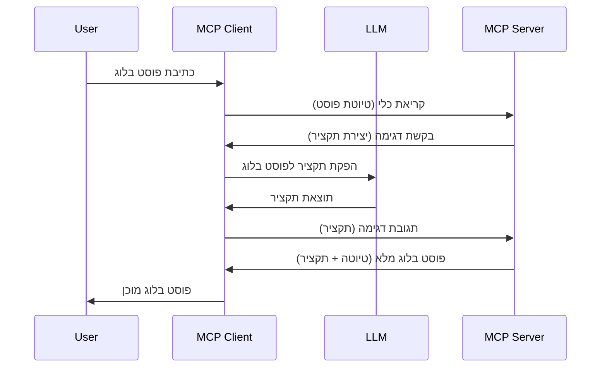

# דגימה - להעביר תכונות ללקוח

לפעמים, צריך שהלקוח של MCP והשרת של MCP ישתפו פעולה כדי להשיג מטרה משותפת. ייתכן ויש לך מקרה שבו השרת זקוק לעזרת LLM שנמצא אצל הלקוח. במצב כזה, דגימה היא מה שעליך להשתמש בו.

בואו נחקור כמה מקרים של שימוש ואיך לבנות פתרון שכולל דגימה.

## סקירה כללית

בפרק זה נתמקד בהסבר מתי ואיפה להשתמש בדגימה ואיך להגדיר אותה.

## מטרות הלמידה

בפרק זה, נ:

- נסביר מהי דגימה ומתי להשתמש בה.
- נציג איך להגדיר דגימה ב-MCP.
- נספק דוגמאות של דגימה בפעולה.

## מהי דגימה ולמה להשתמש בה?

דגימה היא תכונה מתקדמת שעובדת באופן הבא:



### בקשת דגימה

טוב, עכשיו שיש לנו מבט כולל על תרחיש אמין, בוא נדבר על בקשת הדגימה שהשרת שולח ללקוח. כך בקשה כזו יכולה להיראות בפורמט JSON-RPC:

```json
{
  "jsonrpc": "2.0",
  "id": 1,
  "method": "sampling/createMessage",
  "params": {
    "messages": [
      {
        "role": "user",
        "content": {
          "type": "text",
          "text": "Create a blog post summary of the following blog post: <BLOG POST>"
        }
      }
    ],
    "modelPreferences": {
      "hints": [
        {
          "name": "claude-3-sonnet"
        }
      ],
      "intelligencePriority": 0.8,
      "speedPriority": 0.5
    },
    "systemPrompt": "You are a helpful assistant.",
    "maxTokens": 100
  }
}
```

יש כאן כמה דברים שכדאי לציין:

- Prompt, תחת content -> text, זה ההנחיה שלנו שהיא הוראה ל-LLM לסכם את תוכן פוסט הבלוג.

- **modelPreferences**. הסקשן הזה הוא פשוט העדפה, המלצה על איזו תצורה להשתמש עם ה-LLM. המשתמש יכול לבחור אם ללכת עם ההמלצות האלו או לשנות אותן. במקרה הזה יש המלצות על המודל לשימוש ועל מהירות ועקביות אינטיליגנציה.
- **systemPrompt**, זה ה-prompt המערכת שלך הרגיל שנותן ל-LLM שלך אישיות ומכיל הוראות הנחיה.
- **maxTokens**, זוהי תכונה נוספת שמשתמשים בה כדי לציין כמה טוקנים מומלץ להשתמש במשימה הזו.

### תגובת דגימה

תגובה זו היא מה שהלקוח של MCP בסופו של דבר שולח בחזרה לשרת ה-MCP והיא התוצאה של הקריאה של הלקוח ל-LLM, המתנה לתגובה ואז בניית ההודעה הזו. כך זה יכול להיראות ב-JSON-RPC:

```json
{
  "jsonrpc": "2.0",
  "id": 1,
  "result": {
    "role": "assistant",
    "content": {
      "type": "text",
      "text": "Here's your abstract <ABSTRACT>"
    },
    "model": "gpt-5",
    "stopReason": "endTurn"
  }
}
```

שים לב איך התגובה היא תקציר של פוסט הבלוג בדיוק כפי שביקשנו. גם שים לב ש`model` שהשתמשנו בו אינו זה שביקשנו אלא "gpt-5" במקום "claude-3-sonnet". זה להמחיש שהמשתמש יכול לשנות את דעתו לגבי מה להשתמש ושהבקשה לדגימה שלך היא המלצה.

טוב, עכשיו שהבנו את הזרם המרכזי, ומשימה מועילה לשימוש לכך "יצירת פוסט בלוג + תקציר", בוא נראה מה צריך לעשות כדי שזה יעבוד.

### סוגי הודעות

הודעות דגימה לא מוגבלות רק לטקסט אלא אתה יכול גם לשלוח תמונות וקול. כך JSON-RPC נראה שונה:

**טקסט**

```json
{
  "type": "text",
  "text": "The message content"
}
```

**תוכן תמונה**

```json
{
  "type": "image",
  "data": "base64-encoded-image-data",
  "mimeType": "image/jpeg"
}
```

**תוכן אודיו**

```json
{
  "type": "audio",
  "data": "base64-encoded-audio-data",
  "mimeType": "audio/wav"
}
```

> NOTE: למידע מפורט יותר על דגימה, עיין ב-[המסמכים הרשמיים](https://modelcontextprotocol.io/specification/2025-11-25/client/sampling)

## איך להגדיר דגימה בלקוח

> שים לב: אם אתה בונה רק שרת, אין צורך לעשות הרבה כאן.

ב-client, עליך לציין את התכונה הבאה כך:

```json
{
  "capabilities": {
    "sampling": {}
  }
}
```

היא תתפס כאשר הלקוח הנבחר שלך מאתחל עם השרת.

## דוגמה לדגימה בפעולה - יצירת פוסט בלוג

בואו נכתוב יחד שרת דגימה, נצטרך לעשות את הדברים הבאים:

1. ליצור כלי בשרת.
1. הכלי הזה צריך ליצור בקשת דגימה
1. הכלי צריך להמתין לתשובת בקשת הדגימה של הלקוח.
1. לאחר מכן יש להפיק את תוצאת הכלי.

בואו נראה את הקוד שלב אחר שלב:

### -1- יצירת הכלי

**python**

```python
@mcp.tool()
async def create_blog(title: str, content: str, ctx: Context[ServerSession, None]) -> str:
    """Create a blog post and generate a summary"""

```

### -2- יצירת בקשת דגימה

הרחב את הכלי שלך עם הקוד הבא:

**python**

```python
post = BlogPost(
        id=len(posts) + 1,
        title=title,
        content=content,
        abstract=""
    )

prompt = f"Create an abstract of the following blog post: title: {title} and draft: {content} "

result = await ctx.session.create_message(
        messages=[
            SamplingMessage(
                role="user",
                content=TextContent(type="text", text=prompt),
            )
        ],
        max_tokens=100,
)

```

### -3- המתן לתגובה והחזיר תגובה

**python**

```python
post.abstract = result.content.text

posts.append(post)

# החזר את המוצר המלא
return json.dumps({
    "id": post.title,
    "abstract": post.abstract
})
```

### -4- קוד מלא

**python**

```python
from starlette.applications import Starlette
from starlette.routing import Mount, Host

from mcp.server.fastmcp import Context, FastMCP

from mcp.server.session import ServerSession
from mcp.types import SamplingMessage, TextContent

import json


from uuid import uuid4
from typing import List
from pydantic import BaseModel


mcp = FastMCP("Blog post generator")

# app = FastAPI()

posts = []

class BlogPost(BaseModel):
    id: int
    title: str
    content: str
    abstract: str

posts: List[BlogPost] = []

@mcp.tool()
async def create_blog(title: str, content: str, ctx: Context[ServerSession, None]) -> str:
    """Create a blog post and generate a summary"""

    post = BlogPost(
        id=len(posts) + 1,
        title=title,
        content=content,
        abstract=""
    )

    prompt = f"Create an abstract of the following blog post: title: {title} and draft: {content} "

    result = await ctx.session.create_message(
        messages=[
            SamplingMessage(
                role="user",
                content=TextContent(type="text", text=prompt),
            )
        ],
        max_tokens=100,
    )

    post.abstract = result.content.text

    posts.append(post)

    # להחזיר את הפוסט של הבלוג המלא
    return json.dumps({
        "id": post.title,
        "abstract": post.abstract
    })

if __name__ == "__main__":
    print("Starting server...")
    # mcp.run()
    mcp.run(transport="streamable-http")

# הרץ את האפליקציה עם: python server.py
```

### -5- בדיקה ב-Visual Studio Code

כדי לבדוק זאת ב-Visual Studio Code, בצע את הפעולות הבאות:

1. הפעל שרת בטרמינל
1. הוסף אותו ל-*mcp.json* (ודא שהוא פועל), למשל כך:

   ```json
   "servers": {
      "blog-server": {
        "type": "http",
        "url": "http://localhost:8000/mcp"
      }
   }
   ```

1. הקלד prompt:

   ```text
   create a blog post named "Where Python comes from", the content is "Python is actually named after Monty Python Flying Circus"
   ```

1. אפשר לדגימה לקרות. בפעם הראשונה שתבדוק זאת יוצג לך דו-שיח נוסף שעליך לקבל, אז תראה את הדו-שיח הרגיל שמבקש ממך להפעיל כלי.

1. בדוק את התוצאות. תראה את התוצאות מוצגות יפה ב-GitHub Copilot Chat, אבל תוכל גם לבדוק את תשובת ה-JSON הגולמית.

**בונוס**. כלי Visual Studio Code תומך היטב בדגימה. ניתן להגדיר גישה לדגימה על השרת המותקן שלך על ידי ניווט כך:

1. ניווט לקטע ההרחבות.
1. בחר באיקון הגלגל שיניים עבור השרת שהתקנת בקטע "MCP SERVERS - INSTALLED".
1 בחר "Configure Model Access", כאן תוכל לבחור אילו מודלים GitHub Copilot מורשה להשתמש בהם בעת ביצוע דגימה. תוכל גם לראות את כל בקשות הדגימה שהתרחשו לאחרונה על ידי בחירת "Show Sampling requests".

## מטלה

במטלה זו, תבנה דגימה קצת שונה, כלומר אינטגרציית דגימה התומכת ביצירת תיאור מוצר. הנה התרחיש שלך:

**תרחיש**: עובד גב ב-e-commerce זקוק לעזרה, זה לוקח יותר מדי זמן ליצור תיאורי מוצרים. לכן, עליך לבנות פתרון שבו תוכל לקרוא לכלי "create_product" עם "title" ו-"keywords" כפרמטרים והוא צריך לייצר מוצר מלא כולל שדה "description" שיש למלא על ידי LLM של הלקוח.

TIP: השתמש במה שלמדת קודם כדי לבנות את השרת וכלי שלו באמצעות בקשת דגימה.

## פתרון

[Solution](./solution/README.md)

## נקודות מפתח

דגימה היא תכונה חזקה שמאפשרת לשרת להאציל משימות ללקוח כאשר הוא זקוק לעזרת LLM.

## מה הלאה

- [פרק 4 - יישום מעשי](../../04-PracticalImplementation/README.md)

---

<!-- CO-OP TRANSLATOR DISCLAIMER START -->
**כתב ויתור**:
מסמך זה תורגם באמצעות שירות תרגום אוטומטי [Co-op Translator](https://github.com/Azure/co-op-translator). למרות שאנו שואפים לדיוק, יש לקחת בחשבון שתרגומים אוטומטיים עלולים להכיל שגיאות או אי-דיוקים. יש להחשיב את המסמך המקורי בשפתו הטבעית כמקור הסמכות. למידע קריטי מומלץ להשתמש בתרגום מקצועי על ידי מתרגם אדם. אנו לא אחראים לכל אי-הבנה או פירוש שגוי הנובע מהשימוש בתרגום זה.
<!-- CO-OP TRANSLATOR DISCLAIMER END -->