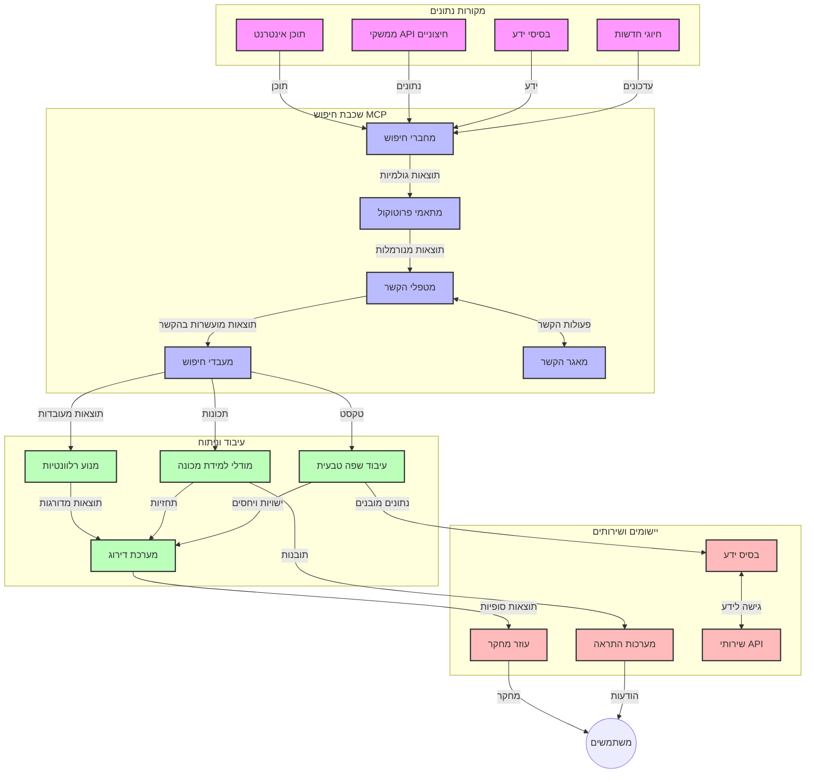
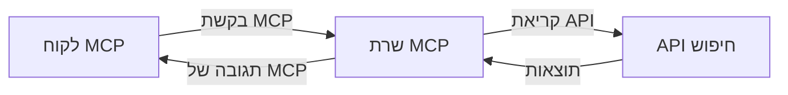
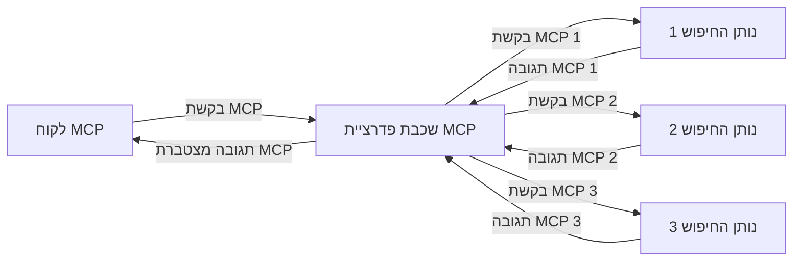
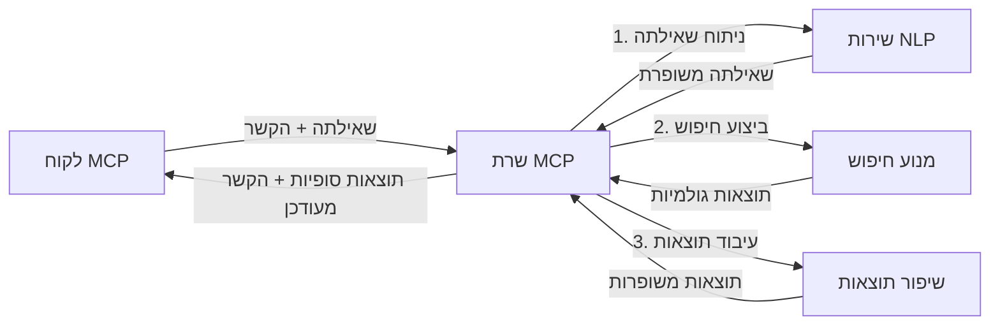

# פרוטוקול הקשר של מודל לחיפוש אינטרנטי בזמן אמת

## סקירה כללית

חיפוש אינטרנטי בזמן אמת הפך לחיוני בסביבת המידע של היום, שבה יישומים זקוקים לגישה מיידית למידע עדכני ברחבי האינטרנט בכדי לספק תגובות רלוונטיות ובזמן. פרוטוקול הקשר של מודל (MCP) מייצג התקדמות משמעותית באופטימיזציה של תהליכי חיפוש בזמן אמת אלה, משפר את יעילות החיפוש, שומר על שלמות הקשר ומשפר את הביצועים הכוללים של המערכת.

מודול זה בוחן כיצד MCP משנה את חיפוש האינטרנט בזמן אמת על ידי מתן גישה סטנדרטית לניהול ההקשר בין מודלים של בינה מלאכותית, מנועי חיפוש ויישומים.

### מה תלמדו

מדריך מקיף זה יחשוף בפניכם:

- כיצד MCP יוצר גשר חלק בין מודלים של בינה מלאכותית ליכולות חיפוש אינטרנטי בזמן אמת
- תבניות ארכיטקטוניות למימוש פתרונות חיפוש יעילים ומדרגים עם MCP
- טכניקות לשימור הקשר חיפוש לאורך שאלות ואינטראקציות מרובות
- מימושים מעשיים בקוד ב-Python ו-JavaScript לתרחישי חיפוש שונים
- שיטות לאיזון בין רלוונטיות, עדכניות וביצועים במערכות חיפוש מופעלות ב-MCP

## מבוא לחיפוש אינטרנטי בזמן אמת

חיפוש אינטרנטי בזמן אמת הוא גישה טכנולוגית המאפשרת שאילתות, עיבוד וניתוח רציפים של מידע מבוסס אינטרנט כשהוא מתפרסם או מתעדכן, ומאפשרת למערכות לספק מידע טרי ורלוונטי תוך השהיה מינימלית. בשונה ממערכות חיפוש מסורתיות הפועלות על נתונים ממופים שיכולים להיות בני שעות או ימים, חיפוש בזמן אמת מעבד נתונים חיים מהאינטרנט, ומספק תובנות ומידע המשקפים את המצב הנוכחי של התוכן המקוון.

### מושגי יסוד בחיפוש אינטרנטי בזמן אמת:

- **עיבוד רציף של שאילתות**: שאילתות חיפוש מעובדות מול מקורות נתונים שמתעדכנים באופן תמידי
- **עדיפות לעדכניות**: מערכות מתוכננות להעדיף מידע טרי
- **איזון רלוונטיות**: שמירת איזון בין רלוונטיות ועדכניות
- **ארכיטקטורה מדרגת**: מערכות חייבות להתמודד עם עומס משתנה של שאילתות ונפחי נתונים
- **הבנת הקשר**: שמירת הקשר משתמש לאורך איטרציות החיפוש חיונית לתוצאות משמעותיות
- **רפורמולציה דינמית של השאילתות**: התאמת השאילתות בהתבסס על ההקשר והתוצאות הקודמות
- **אינטגרציה מרובת מקורות**: שילוב תוצאות מספקי חיפוש שונים ומקורות אינטרנטיים
- **הבנה סמנטית**: עיבוד השאילתות והתוכן על בסיס משמעות ולא רק מילות מפתח
- **דירוג בזמן אמת**: התאמת דירוג התוצאות באופן רציף עם הופעת מידע חדש

### פרוטוקול הקשר של מודל וחיפוש אינטרנטי בזמן אמת

פרוטוקול הקשר של מודל (MCP) מתמודד עם מספר אתגרים קריטיים בסביבות חיפוש אינטרנטי בזמן אמת:

1. **שימור הקשר חיפוש**: MCP מאחד כיצד נשמר ההקשר בין רכיבי החיפוש המבוזרים, ומבטיח שלמודלים של בינה מלאכותית ולצמתים העיבוד יהיה גישה להיסטוריית השאילתות וההעדפות של המשתמש.

2. **ניהול שאילתות יעיל**: על ידי מתן מנגנונים מובנים להעברת ההקשר, MCP מפחית את העומס של חזרה על ההקשר בכל איטרציית חיפוש.

3. **אינטרופרביליות**: MCP יוצר שפה משותפת לשיתוף הקשר בין טכנולוגיות חיפוש ומודלים של בינה מלאכותית מגוונים, ומאפשר ארכיטקטורות גמישות ומורחבות.

4. **הקשר מותאם לחיפוש**: מימושי MCP יכולים להעדיף אילו אלמנטים של ההקשר הם הרלוונטיים ביותר לחיפוש יעיל, ולמטב גם ביצועים וגם דיוק.

5. **עיבוד חיפוש אדפטיבי**: באמצעות ניהול הקשר תקין דרך MCP, מערכות חיפוש יכולות להתאים את העיבוד דינמית בהתאם לצרכי המשתמש המשתנים ולנופים המידע המשתנים.

ביישומים מודרניים החל מאגרגציה של חדשות ועד לעוזרי מחקר, השילוב של MCP עם טכנולוגיות חיפוש אינטרנטי מאפשר חיפוש חכם, מודע הקשר, המספק תוצאות רלוונטיות יותר ככל שאינטראקציות המשתמש נמשכות.

## מטרות הלמידה

בסיום שיעור זה תוכל/י:

- להבין את היסודות של חיפוש אינטרנטי בזמן אמת ואת האתגרים ביישומים מודרניים
- להסביר כיצד פרוטוקול הקשר של מודל (MCP) משפר את יכולות החיפוש בזמן אמת
- לממש פתרונות חיפוש מבוססי MCP באמצעות מסגרות API פופולריות
- לתכנן ולפרוס ארכיטקטורות חיפוש מדרגות ובעלות ביצועים גבוהים עם MCP
- ליישם מושגי MCP במגוון תרחישים כולל חיפוש סמנטי, סיוע למחקר ודפדוף מועשר AI
- להעריך מגמות מתפתחות וחדשנות עתידית בטכנולוגיות חיפוש מבוססות MCP
- לפתח מערכות חיפוש מודעות הקשר שלומדות מאינטראקציות משתמש
- לשלב יכולות חיפוש אינטרנטי בעוזרי בינה מלאכותית באמצעות פרוטוקולי MCP סטנדרטיים
- ליצור צינורות חיפוש רב-שלביים שמחדדים בהדרגה תוצאות בהתבסס על ההקשר
- לאופטם ביצועי חיפוש תוך שמירה על מודעות הקשר מלאה

### הגדרה ומשמעות

חיפוש אינטרנטי בזמן אמת כולל שאילתות רציפות, אחזור והעברה של מידע מבוסס אינטרנט עם השהיה מינימלית. בניגוד למנועי חיפוש מסורתיים אשר סורקים ומאינדקסים את האינטרנט בתקופות מחזוריות, חיפוש בזמן אמת שואף לחשוף מידע ברגע שהוא זמין, ומאפשר גישה מיידית לתוכן העדכני ביותר.

מאפיינים מרכזיים של חיפוש אינטרנטי בזמן אמת כוללים:

- **טריות**: העדפת תוכן ועדכונים אחרונים
- **עיבוד רציף**: ניטור מתמיד של מידע חדש
- **התאמת שאילתות**: שיפור שאילתות חיפוש על בסיס הקשר ומשוב
- **אספקה מיידית**: מתן תוצאות חיפוש בהשהיה מינימלית
- **שימור הקשר**: בניה על שאילתות קודמות לשיפור הרלוונטיות

### אתגרים בחיפוש אינטרנטי מסורתי

גישות חיפוש אינטרנטי מסורתיות מתמודדות עם מגבלות רבות כאשר מוחלות על תרחישי זמן אמת:

1. **פירוק הקשר**: קושי בשמירת הקשר חיפוש לאורך שאילתות מרובות
2. **טריות מידע**: אתגרים בגישה והעדפה של המידע העדכני ביותר
3. **מורכבות אינטגרציה**: בעיות באינטרופרביליות בין מערכות חיפוש ויישומים
4. **בעיות השהיה**: איזון בין חיפוש מקיף ודורש זמן תגובה מיטבי
5. **כיוונון רלוונטיות**: הבטחת דיוק ורלוונטיות תוך העדפת עדכניות

## הבנת פרוטוקול הקשר של מודל (MCP) לחיפוש

### מהו MCP בהקשרי חיפוש?

פרוטוקול הקשר של מודל (MCP) הוא פרוטוקול תקשורת סטנדרטי המיועד להקל על אינטראקציה יעילה בין מודלים של בינה מלאכותית ויישומים. בהקשר של חיפוש אינטרנטי בזמן אמת, MCP מספק מסגרת ל:

- שימור הקשר חיפוש לאורך רצפי שאילתות
- סטנדרטיזציה של פורמטים של שאילתות ותוצאות
- אופטימיזציה של שידור פרמטרים ותוצאות חיפוש
- שיפור התקשורת בין מודלים למנועי חיפוש

### רכיבים עיקריים וארכיטקטורה

ארכיטקטורת MCP לחיפוש אינטרנטי בזמן אמת מורכבת ממספר רכיבים מרכזיים:

1. **מאגרי הקשר של שאילתות**: מנהלים ושומרים על הקשר חיפוש לאורך שאילתות מרובות
2. **מעבדי חיפוש**: מעבדים בקשות חיפוש נכנסות בטכניקות מודעות הקשר
3. **מתאמי פרוטוקול**: ממירים בין ממשקי API שונים לשמירת ההקשר
4. **מאגר הקשר**: מאחסן ומקור היסטוריית חיפוש והעדפות ביעילות
5. **מחברים לחיפוש**: מתחברים למנועי חיפוש ו-API אינטרנטיים מגוונים



### כיצד MCP משפר חיפוש אינטרנטי בזמן אמת

MCP מתמודד עם אתגרי חיפוש אינטרנטי מסורתי באמצעות:

- **רציפות הקשר**: שמירת קשר בין שאילתות לאורך כל מושב החיפוש
- **אופטימיזציה בשידור**: צמצום כפילויות בפרמטרי החיפוש בעזרת ניהול הקשר אינטיליגנטי
- **ממשקים סטנדרטיים**: מתן API אחיד ורציף עבור רכיבי החיפוש
- **הפחתת השהיה**: צמצום עומס העיבוד באמצעות טיפול יעיל בהקשר
- **רלוונטיות משופרת**: שיפור הרלוונטיות באמצעות שימור כוונת המשתמש בין שאילתות מרובות

## אינטגרציה ומימוש

מערכות חיפוש אינטרנטי בזמן אמת דורשות תכנון ארכיטקטוני ומימוש זהיר לשמירת ביצועים ושלמות הקשר. פרוטוקול הקשר של מודל מציע גישה סטנדרטית לשילוב מודלים של AI וטכנולוגיות חיפוש, ומאפשר צינורות חיפוש מתוחכמים ומודעי הקשר.

### סקירת אינטגרציית MCP בארכיטקטורות חיפוש

מימוש MCP בסביבות חיפוש בזמן אמת כולל מספר שיקולים מרכזיים:

1. **סיריאליזציה של הקשר חיפוש**: MCP מספק מנגנונים יעילים לקידוד מידע הקשר בתוך בקשות חיפוש, ומבטיח שההקשר החיוני מלווה את השאילתה לאורך צינור העיבוד. זה כולל פורמטים סטנדרטיים לסיריאליזציה המותאמים לנתוני חיפוש.

2. **עיבוד חיפוש מצב סטייטפול**: MCP מאפשר עיבוד אדיב חכם ע"י שמירת ייצוג עקבי של ההקשר לאורך איטרציות חיפוש. זה שימושי במיוחד בצינורות חיפוש רב-שלביים שבהם ייעול ההקשר משפר תוצאות.

3. **הרחבה ושיפור שאילתות**: מימושי MCP במערכות חיפוש יכולים להקל על הרחבה ושיפור מתוחכמים של השאילתות בהתבסס על ההקשר המצטבר, ומאפשרים תוצאות רלוונטיות יותר ככל שמושב החיפוש מתקדם.

4. **מטמון תוצאות והעדפה**: באמצעות סטנדרטיזציה של ניהול ההקשר, MCP מסייע בניהול מטמון התוצאות והעדפתן, ומאפשר לרכיבים להתאים את עצמם בהתבסס על ההקשר המשתנה.

5. **פדרציה ואגרגציה של חיפוש**: MCP מאפשר פדרציה מתוחכמת יותר של חיפוש על פני מספר בקאנדים באמצעות ייצוגים מובנים של הקשר החיפוש, ומאפשר אגרגציה משמעותית יותר של תוצאות ממקורות מגוונים.

היישום של MCP בטכנולוגיות חיפוש שונות יוצר גישה מאוחדת לניהול הקשר, מצמצם את הצורך בקוד אינטגרציה מותאם ומקדם יכולת המערכת לשמור על הקשר משמעותי ככל ששאילתות החיפוש מתפתחות.

### MCP במימושי חיפוש אינטרנט שונים

דוגמאות אלו מבוססות על מפרט MCP הנוכחי המסונכרן עם פרוטוקול JSON-RPC עם מנגנוני תחבורה מובחנים. הקוד ממחיש כיצד ניתן לממש אינטגרציות חיפוש מותאמות תוך שמירה על תאימות מלאה לפרוטוקול MCP.

<details>
<summary>מימוש ב-Python עם API חיפוש גנרי</summary>

```python
import asyncio
import json
import aiohttp
from typing import Dict, Any, Optional, List
from contextlib import asynccontextmanager
from collections.abc import AsyncIterator

# ייבוא ספריות MCP סטנדרטיות
from mcp.client.session import ClientSession
from mcp.client.streamable_http import streamablehttp_client
from mcp.types import TextContent, CreateMessageRequestParams, CreateMessageResult
from mcp.server.fastmcp import FastMCP

# יצירת שרת FastMCP לחיפוש באינטרנט
search_server = FastMCP("WebSearch")

# מחלקה לניהול פעולות חיפוש באינטרנט
class WebSearchHandler:
    def __init__(self, api_endpoint: str, api_key: str):
        self.api_endpoint = api_endpoint
        self.api_key = api_key
        self.session = None
        
    async def initialize(self):
        """Initialize the HTTP session"""
        self.session = aiohttp.ClientSession(
            headers={"Authorization": f"Bearer {self.api_key}"}
        )
    
    async def close(self):
        """Close the HTTP session"""
        if self.session:
            await self.session.close()
            
    async def perform_search(self, query: str, max_results: int = 5, 
                           include_domains: List[str] = None, 
                           exclude_domains: List[str] = None,
                           time_period: str = "any") -> Dict[str, Any]:
        """Perform web search using the search API"""
        # בניית פרמטרים לחיפוש
        search_params = {
            "q": query,
            "limit": max_results,
            "time": time_period
        }
        
        if include_domains:
            search_params["site"] = ",".join(include_domains)
            
        if exclude_domains:
            search_params["exclude_site"] = ",".join(exclude_domains)
        
        # ביצוע בקשת החיפוש
        try:
            async with self.session.get(
                self.api_endpoint,
                params=search_params
            ) as response:
                if response.status != 200:
                    error_text = await response.text()
                    raise Exception(f"Search API error: {response.status} - {error_text}")
                
                search_data = await response.json()
                
                # המרת תגובה ספציפית ל-API לפורמט סטנדרטי
                results = []
                for item in search_data.get("results", []):
                    results.append({
                        "title": item.get("title", ""),
                        "url": item.get("url", ""),
                        "snippet": item.get("snippet", ""),
                        "date": item.get("published_date", ""),
                        "source": item.get("source", "")
                    })
                
                return {
                    "query": query,
                    "totalResults": len(results),
                    "results": results
                }
        except Exception as e:
            print(f"Search API request error: {e}")
            raise

# אתחול מטפל החיפוש
search_handler = WebSearchHandler(
    api_endpoint="https://api.search-service.example/search",
    api_key="your-api-key-here"
)

# הגדרת אורך חיים לניהול מטפל החיפוש
@asyncio.asynccontextmanager
async def app_lifespan(server: FastMCP):
    """Manage application lifecycle"""
    await search_handler.initialize()
    try:
        yield {"search_handler": search_handler}
    finally:
        await search_handler.close()

# קביעת אורך חיים לשרת
search_server = FastMCP("WebSearch", lifespan=app_lifespan)

# רישום כלי חיפוש באינטרנט
@search_server.tool()
async def web_search(query: str, max_results: int = 5, 
                   include_domains: List[str] = None,
                   exclude_domains: List[str] = None,
                   time_period: str = "any") -> Dict[str, Any]:
    """
    Search the web for information
    
    Args:
        query: The search query
        max_results: Maximum number of results to return (default: 5)
        include_domains: List of domains to include in search results
        exclude_domains: List of domains to exclude from search results
        time_period: Time period for results ("day", "week", "month", "any")
        
    Returns:
        Dictionary containing search results
    """
    ctx = search_server.get_context()
    search_handler = ctx.request_context.lifespan_context["search_handler"]
    
    results = await search_handler.perform_search(
        query=query,
        max_results=max_results,
        include_domains=include_domains,
        exclude_domains=exclude_domains,
        time_period=time_period
    )
    
    return results

# דוגמת שימוש של לקוח
async def client_example():
    # התחברות לשרת החיפוש באמצעות העברת HTTP ניתנת להזרים
    async with streamablehttp_client("http://localhost:8000/mcp") as (read, write, _):
        async with ClientSession(read, write) as session:
            # אתחול החיבור
            await session.initialize()
            
            # קריאת כלי החיפוש באינטרנט
            search_results = await session.call_tool(
                "web_search", 
                {
                    "query": "latest developments in AI and Model Context Protocol",
                    "max_results": 5,
                    "time_period": "day",
                    "include_domains": ["github.com", "microsoft.com"]
                }
            )
            
            print(f"Search results: {search_results}")

# דוגמת הרצת שרת
if __name__ == "__main__":
    # הרצת השרת עם העברת HTTP ניתנת להזרים
    search_server.run(transport="streamable-http")
```
</details> 

<details>
<summary>מימוש ב-JavaScript עם חיפוש מבוסס דפדפן</summary>

```javascript
// מימוש שרת MCP לחיפוש באינטרנט
import { McpServer, ResourceTemplate } from '@modelcontextprotocol/sdk/server/mcp.js';
import { StreamableHTTPServerTransport } from '@modelcontextprotocol/sdk/server/streamableHttp.js';
import { z } from 'zod';

// יצירת שרת MCP לחיפוש באינטרנט
const searchServer = new McpServer({
    name: "BrowserSearch",
    description: "A server that provides web search capabilities"
});

// מחלקת שירות החיפוש
class SearchService {
    constructor(searchApiUrl, apiKey) {
        this.searchApiUrl = searchApiUrl;
        this.apiKey = apiKey;
    }

    async performSearch(parameters) {
        const {
            query = '',
            maxResults = 5,
            includeDomains = [],
            excludeDomains = [],
            timePeriod = 'any'
        } = parameters;
        
        // בניית כתובת URL של החיפוש עם פרמטרים
        const url = new URL(this.searchApiUrl);
        url.searchParams.append('q', query);
        url.searchParams.append('limit', maxResults);
        url.searchParams.append('time', timePeriod);
        
        if (includeDomains.length > 0) {
            url.searchParams.append('site', includeDomains.join(','));
        }
        
        if (excludeDomains.length > 0) {
            url.searchParams.append('exclude_site', excludeDomains.join(','));
        }
        
        try {
            const response = await fetch(url.toString(), {
                method: 'GET',
                headers: {
                    'Authorization': `Bearer ${this.apiKey}`,
                    'Content-Type': 'application/json'
                }
            });
            
            if (!response.ok) {
                const errorText = await response.text();
                throw new Error(`Search API error: ${response.status} - ${errorText}`);
            }
            
            const searchData = await response.json();
            
            // המרת תגובת API ספציפית לפורמט סטנדרטי
            const results = searchData.results?.map(item => ({
                title: item.title || '',
                url: item.url || '',
                snippet: item.snippet || '',
                date: item.published_date || '',
                source: item.source || ''
            })) || [];
            
            return {
                query,
                totalResults: results.length,
                results
            };
        } catch (error) {
            console.error('Search API request error:', error);
            throw error;
        }
    }
}

// אתחול שירות החיפוש
const searchService = new SearchService(
    'https://api.search-service.example/search',
    'your-api-key-here'
);

// הגדרת ספק ההקשר לשרת
searchServer.setContextProvider(() => {
    return {
        searchService
    };
});

// רישום כלי חיפוש באינטרנט
searchServer.tool({
    name: 'web_search',
    description: 'Search the web for information',
    parameters: {
        type: 'object',
        properties: {
            query: {
                type: 'string',
                description: 'The search query'
            },
            maxResults: {
                type: 'integer',
                description: 'Maximum number of results to return',
                default: 5
            },
            includeDomains: {
                type: 'array',
                items: { type: 'string' },
                description: 'List of domains to include in search results'
            },
            excludeDomains: {
                type: 'array',
                items: { type: 'string' },
                description: 'List of domains to exclude from search results'
            },
            timePeriod: {
                type: 'string',
                description: 'Time period for results',
                enum: ['day', 'week', 'month', 'any'],
                default: 'any'
            }
        },
        required: ['query']
    },
    handler: async (params, context) => {
        const { searchService } = context;
        return await searchService.performSearch(params);
    }
});

// דוגמת קוד לקוח לחיבור לשרת החיפוש
import { Client } from '@modelcontextprotocol/sdk/client/index.js';
import { StreamableHTTPClientTransport } from '@modelcontextprotocol/sdk/client/streamableHttp.js';

async function connectToSearchServer() {
    // התחברות לשרת החיפוש
    const transport = new StreamableHTTPClientTransport(
        new URL('http://localhost:8000/mcp')
    );
    
    const client = new Client({
        name: 'search-client',
        version: '1.0.0'
    });
    
    await client.connect(transport);
    
    // הרצת כלי החיפוש
    const searchResults = await client.callTool({
        name: 'web_search',
        arguments: {
            query: 'Model Context Protocol implementation examples',
            maxResults: 10,
            timePeriod: 'week',
            includeDomains: ['github.com', 'docs.microsoft.com']
        }
    });
    
    console.log('Search results:', searchResults);
    
    // ניקוי משאבים
    await client.disconnect();
}

// הפעלת השרת
const transport = new StreamableHTTPServerTransport();
await searchServer.connect(transport);
console.log('Search server running at http://localhost:8000/mcp');

// בתהליך נפרד או לאחר שהשרת הופעל
// connectToSearchServer().catch(console.error);
```
</details> 

## התמצאות בדוגמאות קוד

> **הערה חשובה**: דוגמאות הקוד להלן ממחישות את השילוב של פרוטוקול הקשר של מודל (MCP) עם יכולות חיפוש אינטרנטי. למרות שהן עוקבות אחר התבניות והמבנים של ה-SDK הרשמי של MCP, הן פושטו לצרכים חינוכיים.
> 
> דוגמאות אלו מציגות:
> 
> 1. **מימוש ב-Python**: יישום שרת FastMCP המספק כלי חיפוש אינטרנטי ומתחבר ל-API חיפוש חיצוני. דוגמה זו מדגימה ניהול מחזור חיים תקין, ניהול הקשר, ומימוש כלי בהתאם לתבניות של [MCP Python SDK הרשמי](https://github.com/modelcontextprotocol/python-sdk). השרת משתמש בתחבורה Streamable HTTP המומלצת שהחליפה את תחבורה SSE להטמעות בפרודקשן.
> 
> 2. **מימוש ב-JavaScript**: מימוש TypeScript/JavaScript על בסיס תבנית FastMCP מה-[MCP TypeScript SDK הרשמי](https://github.com/modelcontextprotocol/typescript-sdk) ליצירת שרת חיפוש עם הגדרות כלים וחיבורים ללקוחות כנדרש. מימוש זה עוקב אחר תבניות עדכניות לניהול מושבים ושימור הקשר.
> 
> דוגמאות אלו דורשות טיפול שגיאות, אימות ואינטגרציית API ספציפית לשימוש פרודקשן. נקודות הקצה ל-API החיפוש (`https://api.search-service.example/search`) הן מילוי מקומות בלבד וצריכות להחלף בנקודות שירות אמתיות.
> 
> לפרטים מלאים ולשיטות העדכניות ביותר נא לעיין ב-[מפרט MCP הרשמי](https://spec.modelcontextprotocol.io/) ובדוקומנטציית ה-SDK.

## מושגי יסוד

### מסגרת פרוטוקול הקשר של מודל (MCP)

ביסודו, פרוטוקול הקשר של מודל מספק דרך סטנדרטית להחלפת הקשר בין מודלים של AI, יישומים ושירותים. בחיפוש אינטרנטי בזמן אמת, מסגרת זו חיונית ליצירת חוויות חיפוש עקביות ורב-סיבוביות. רכיבים מרכזיים כוללים:

1. **ארכיטקטורת לקוח-שרת**: MCP קובע הפרדה ברורה בין לקוחות חיפוש (מבקשים) ושרתים (ספקים), ומאפשר מודלי פריסה גמישים.

2. **תקשורת JSON-RPC**: הפרוטוקול משתמש ב-JSON-RPC להחלפת הודעות, מה שהופך אותו לתואם לטכנולוגיות רשת וקל למימוש בפלטפורמות שונות.

3. **ניהול הקשר**: MCP מגדיר שיטות מובנות לשמירה, עדכון וניצול הקשר החיפוש באינטראקציות מרובות.

4. **הגדרות כלים**: יכולות החיפוש מוצגות ככלים סטנדרטיים עם פרמטרים וערכי החזרה מוגדרים היטב.

5. **תמיכה בזרימה**: הפרוטוקול תומך בזרימת תוצאות, חיוני לחיפוש בזמן אמת בו התוצאות מגיעות בהדרגה.

### תבניות אינטגרציה של חיפוש אינטרנטי

בעת שילוב MCP עם חיפוש אינטרנטי, מתגלות מספר תבניות:

#### 1. אינטגרציה ישירה עם ספק חיפוש



בתבנית זו, שרת MCP מתקשר ישירות עם אחד או יותר API של חיפוש, מתרגם בקשות MCP לקריאות מותאמות ומעצב את התוצאות כתשובות MCP.

#### 2. חיפוש פדרטיבי עם שימור הקשר



תבנית זו מפזרת את שאילתות החיפוש בין ספקים תואמי MCP מרובים, שלכל אחד מהם מומחיות בסוגי תוכן או יכולות חיפוש שונות, תוך שמירת הקשר מאוחד.

#### 3. שרשרת חיפוש משופרת בהקשר



בתבנית זו, תהליך החיפוש מחולק לשלבים רבים, כאשר ההקשר מועשר בכל שלב, מה שמניב תוצאות המשפרות בהדרגה את הרלוונטיות.

### רכיבי הקשר בחיפוש

בחיפוש אינטרנטי מבוסס MCP, ההקשר כולל בדרך כלל:

- **היסטוריית שאילתות**: שאילתות החיפוש הקודמות במושב
- **העדפות משתמש**: שפה, אזור, הגדרות חיפוש בטוח
- **היסטוריית אינטראקציות**: אילו תוצאות נלחצו, זמן שהייה על תוצאות
- **פרמטרי חיפוש**: פילטרים, סדרי מיון ומודיפיירים אחרים לחיפוש
- **ידע תחומי**: הקשר ספציפי לנושא הרלוונטי לחיפוש
- **הקשר זמני**: גורמי רלוונטיות מבוססי זמן
- **העדפות מקורות**: מקורות מידע מהימנים או מועדפים

## מקרים שימוש ויישומים

### מחקר ואיסוף מידע

MCP משפר זרימות עבודה מחקריות על ידי:

- שימור הקשר מחקרי בין מושבי חיפוש
- אפשרות לשאילתות מתוחכמות ורלוונטיות להקשר
- תמיכה בפדרציה מרובת מקורות
- הקלה על הפקת ידע מתוך תוצאות החיפוש

### ניטור חדשות ומגמות בזמן אמת

חיפוש מופעל MCP מציע יתרונות לניטור חדשות:

- גילוי חדשות מתהוות כמעט בזמן אמת
- סינון הקשרי של מידע רלוונטי
- מעקב אחר נושאים וישויות במקורות רבים
- התראות חדשות מותאמות על בסיס הקשר משתמש

### גלישה ומחקר מועשרים בבינה מלאכותית

MCP יוצר אפשרויות חדשות לגלישה מועשרת בבינה מלאכותית:

- הצעות חיפוש הקשריות בהתבסס על פעילות דפדפן נוכחית
- אינטגרציה חלקה של חיפוש אינטרנטי עם עוזרי שפה גדולים (LLM)
- שיפור חיפוש רב-סיבובי עם שמירת ההקשר
- שיפור בדיקת עובדות ואימות מידע

## מגמות וחדשנות עתידיות

### התפתחות MCP בחיפוש אינטרנטי

בהסתכלות קדימה, אנו צופים שהתפתחות MCP תתמקד בכתיבת פתרונות עבור:
- **חיפוש מולטימודלי**: שילוב חיפוש טקסט, תמונה, אודיו ווידאו עם שמירת ההקשר  
- **חיפוש מבוזר**: תמיכה באקוסיסטמים של חיפוש מופץ ובעל-ברית  
- **פרטיות בחיפוש**: מנגנוני חיפוש השומרים על פרטיות בהקשר מודע  
- **הבנת שאילתות**: ניתוח סמנטי עמוק של שאילתות חיפוש בשפה טבעית  

### התקדמויות טכנולוגיות פוטנציאליות

טכנולוגיות מתפתחות שיעצבו את עתיד חיפוש MCP:

1. **ארכיטקטורות חיפוש נוירוניות**: מערכות חיפוש מבוססות האשמה מותאמות ל-MCP  
2. **הקשר חיפוש מותאם אישית**: למידת דפוסי חיפוש של משתמש ספציפי לאורך זמן  
3. **אינטגרציה של גרף ידע**: חיפוש הקשר מודגש על ידי גרפים תחומיים של ידע  
4. **הקשר חוצה-מודלי**: שמירת ההקשר בין מודאליות חיפוש שונות  

## תרגילים מעשיים

### תרגיל 1: הקמת צינור חיפוש בסיסי ב-MCP

בתרגיל זה תלמד כיצד:  
- להגדיר סביבה בסיסית לחיפוש MCP  
- לממש מטפלי הקשר לחיפוש אינטרנט  
- לבדוק ולאמת שמירת הקשר לאורך איטרציות חיפוש  

### תרגיל 2: בניית עוזר מחקר עם חיפוש MCP

צור יישום מלא ש:  
- מעבד שאלות מחקר בשפה טבעית  
- מבצע חיפושים אינטרנטיים מודעי הקשר  
- מסנתז מידע ממקורות שונים  
- מציג ממצאים מחקריים מאורגנים  

### תרגיל 3: יישום ഫെדראציה של חיפוש רב-מקורות עם MCP

תרגיל מתקדם המכסה:  
- הפצת שאילתות מודעת הקשר למנועי חיפוש מרובים  
- דירוג ואגרגציה של תוצאות  
- נטרול כפילויות בהקשר של תוצאות החיפוש  
- טיפול במטא-נתונים ספציפיים למקור  

## משאבים נוספים

- [Model Context Protocol Specification](https://spec.modelcontextprotocol.io/) - מפרט MCP רשמי ותיעוד פרוטוקול מפורט  
- [Model Context Protocol Documentation](https://modelcontextprotocol.io/) - מדריכים מפורטים ומדריכי יישום  
- [MCP Python SDK](https://github.com/modelcontextprotocol/python-sdk) - יישום רשמי של MCP בפייתון  
- [MCP TypeScript SDK](https://github.com/modelcontextprotocol/typescript-sdk) - יישום רשמי של MCP ב-TypeScript  
- [MCP Reference Servers](https://github.com/modelcontextprotocol/servers) - יישומים מתועדים של שרתי MCP  
- [Bing Web Search API Documentation](https://learn.microsoft.com/en-us/bing/search-apis/bing-web-search/overview) - API חיפוש אינטרנט של מיקרוסופט  
- [Google Custom Search JSON API](https://developers.google.com/custom-search/v1/overview) - מנוע חיפוש ניתנת לתכנות של גוגל  
- [SerpAPI Documentation](https://serpapi.com/search-api) - API לדפי תוצאות של מנועי חיפוש  
- [Meilisearch Documentation](https://www.meilisearch.com/docs) - מנוע חיפוש בקוד פתוח  
- [Elasticsearch Documentation](https://www.elastic.co/guide/index.html) - מנוע חיפוש וניתוח מבוזר  
- [LangChain Documentation](https://python.langchain.com/docs/get_started/introduction) - בניית יישומים עם LLM  

## תוצאות למידה

בסיום מודול זה תוכל:

- להבין את יסודות החיפוש האינטרנטי בזמן אמת והאתגרים בו  
- להסביר כיצד Model Context Protocol (MCP) משפר יכולות חיפוש אינטרנטי בזמן אמת  
- לממש פתרונות חיפוש מבוססי MCP באמצעות מסגרות ו-API פופולריים  
- לתכנן ולפרוס ארכיטקטורות חיפוש סקיילביליות ובעלות ביצועים גבוהים עם MCP  
- ליישם עקרונות MCP למגוון שימושים כולל חיפוש סמנטי, סיוע מחקר ודפדוף בתמיכה של בינה מלאכותית  
- להעריך מגמות מתפתחות וחידושים עתידיים בטכנולוגיות חיפוש מבוססות MCP  

### שיקולי אמון ובטיחות

בעת יישום פתרונות חיפוש אינטרנט מבוססי MCP, זכור עקרונות חשובים אלה מהמפרט של MCP:

1. **הסכמה ובקרה של המשתמש**: יש לקבל הסכמה מפורשת מהמשתמש ולהבטיח הבנה מלאה של גישה ופעולות על הנתונים. זה חשוב במיוחד ביישומי חיפוש אינטרנט שעשויים לגשת למקורות נתונים חיצוניים.

2. **פרטיות נתונים**: יש להבטיח טיפול הולם בשאילתות ותוצאות חיפוש, במיוחד כשהן עלולות להכיל מידע רגיש. יש ליישם בקרות נגישות מתאימות להגנה על נתוני המשתמש.

3. **בטיחות כלים**: יש ליישם אישור ואימות נאותים לכלי חיפוש, שכן הם עלולים להוות סיכוני אבטחה בשל הרצת קוד שרירותית. תיאורי התנהגות הכלים יש להחשיב כבלתי מהימנים אלא אם מגיעים משרת מהימן.

4. **תיעוד ברור**: ספק תיעוד ברור לגבי היכולות, המגבלות והשיקולים הביטחוניים של יישום החיפוש שלך מבוסס MCP, בהתאם להנחיות היישום במפרט MCP.

5. **זרימות הסכמה חזקות**: בנה זרימות הסכמה ואישור חזקות שמסבירות בבירור מה עושה כל כלי לפני מתן הרשאה לשימוש בו, במיוחד כלים המתקשרים עם משאבי אינטרנט חיצוניים.

לפרטים מלאים לגבי שיקולי אבטחה ואמון במפרט MCP, עיין ב[התיעוד הרשמי](https://modelcontextprotocol.io/specification/2025-11-25/basic/security_best_practices).

## מה הלאה

- [5.12 אימות Entra ID לשרתי Model Context Protocol](../mcp-security-entra/README.md)

---

<!-- CO-OP TRANSLATOR DISCLAIMER START -->
**כתב ויתור**:
מסמך זה תורגם באמצעות שירות תרגום אוטומטי [Co-op Translator](https://github.com/Azure/co-op-translator). למרות שאנו שואפים לדיוק, יש לקחת בחשבון שתרגומים אוטומטיים עלולים להכיל שגיאות או אי-דיוקים. יש להחשיב את המסמך המקורי בשפתו הטבעית כמקור הסמכות. למידע קריטי מומלץ להשתמש בתרגום מקצועי על ידי מתרגם אדם. אנו לא אחראים לכל אי-הבנה או פירוש שגוי הנובע מהשימוש בתרגום זה.
<!-- CO-OP TRANSLATOR DISCLAIMER END -->