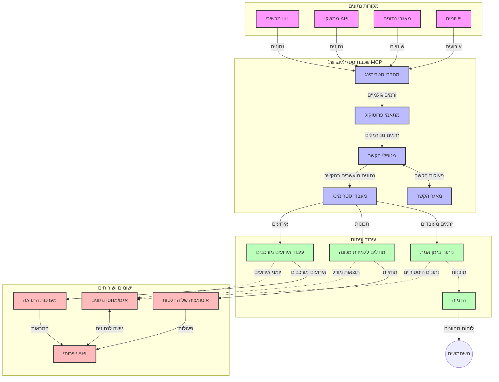

# פרוטוקול הקשר למודל לזרימת נתונים בזמן אמת

## סקירה כללית

זרימת נתונים בזמן אמת הפכה לחיונית בעולם הנתונים של היום, שבו עסקים ויישומים דורשים גישה מיידית למידע על מנת לקבל החלטות בזמן. פרוטוקול הקשר למודל (MCP) מייצג התקדמות משמעותית באופטימיזציה של תהליכי הזרימה בזמן אמת הללו, משפר את יעילות עיבוד הנתונים, שומר על שלמות הקשר ומשפר את ביצועי המערכת הכוללים.

מודול זה בוחן כיצד MCP משנה את זרימת הנתונים בזמן אמת על ידי מתן גישה תקנית לניהול הקשר בין מודלי AI, פלטפורמות זרימה ויישומים.

## מבוא לזרימת נתונים בזמן אמת

זרימת נתונים בזמן אמת היא פרדיגמה טכנולוגית המאפשרת העברה, עיבוד וניתוח מתמשכים של נתונים כשהם נוצרים, ומאפשרת למערכות להגיב מיד למידע חדש. בשונה מעיבוד אצוות מסורתי הפועל על מערכי נתונים סטטיים, תהליכי הזרימה מעבדים נתונים בתנועה, ומספקים תובנות ופעולות עם זמן השיהוי מינימלי.

### מושגים מרכזיים בזרימת נתונים בזמן אמת:

- **זרם נתונים רציף**: הנתונים מעובדים כזרם רציף, בלתי פוסק של אירועים או רשומות.
- **עיבוד עם השיהוי נמוך**: מערכות מתוכננות למזער את הזמן בין יצירת הנתונים לעיבודם.
- **סקלאביליות**: ארכיטקטורות הזרימה חייבות להתמודד עם נפחי נתונים ומהירויות משתנות.
- **עמידות לתקלות**: מערכות נדרשות להיות חסינות לישלונות על מנת להבטיח זרימת נתונים ללא הפרעה.
- **עיבוד שומר-מצב**: שמירת הקשר לאורך האירועים חיונית לניתוחים משמעותיים.

### פרוטוקול הקשר למודל וזרימה בזמן אמת

פרוטוקול הקשר למודל (MCP) מתמודד עם מספר אתגרים מרכזיים בסביבות זרימה בזמן אמת:

1. **המשכיות הקשר**: MCP מסטנדרט את האופן שבו שומרים על הקשר בין רכיבי הזרימה המופצים, ומבטיח שמודלי AI וציודים בעיבוד יקבלו גישה להקשרים היסטוריים וסביבתיים רלוונטיים.

2. **ניהול מצב יעיל**: על ידי מתן מנגנונים מבניים להעברת הקשר, MCP מפחית את העומס של ניהול מצב בצינורות הזרימה.

3. **אינטרופרביליות**: MCP יוצר שפה משותפת לשיתוף הקשר בין טכנולוגיות זרימה שונות ומודלי AI, ומאפשר ארכיטקטורות גמישות ומורחבות יותר.

4. **קשר מותאם לזרימה**: יישומי MCP יכולים להעדיף אילו אלמנטים של הקשר רלוונטיים ביותר לקבלת החלטות בזמן אמת, ואופטימיזציה הן לביצועים והן לדיוק.

5. **עיבוד אדפטיבי**: עם ניהול הקשר הנכון דרך MCP, מערכות הזרימה יכולות להתאים את העיבוד דינמית על בסיס תנאים ודפוסים מתפתחים בנתונים.

ביישומים מודרניים, החל מרשתות חיישנים של IoT ועד פלטפורמות מסחר פיננסיות, שילוב MCP עם טכנולוגיות זרימה מאפשר עיבוד חכם יותר, מודע להקשר, שיכול להגיב בהתאם למצבים מורכבים ומתפתחים בזמן אמת.

## מטרות למידה

בסוף שיעור זה, תוכלו:

- להבין את יסודות זרימת הנתונים בזמן אמת ואת האתגרים שלה  
- להסביר כיצד פרוטוקול הקשר למודל (MCP) משפר את זרימת הנתונים בזמן אמת  
- ליישם פתרונות זרימה מבוססי MCP באמצעות מסגרות פופולריות כמו Kafka ו-Pulsar  
- לעצב ולפרוס ארכיטקטורות זרימה עמידות לתקלות ובעלות ביצועים גבוהים עם MCP  
- ליישם מושגי MCP במקרים שימוש ב-IoT, מסחר פיננסי וניתוחי AI  
- להעריך מגמות מתפתחות וחדשנויות עתידיות בטכנולוגיות זרימה מבוססות MCP  

### הגדרה ומשמעות

זרימת נתונים בזמן אמת כוללת יצירה, עיבוד והעברה רציפה של נתונים עם השיהוי מינימלי. בניגוד לעיבוד אצוות, שבו הנתונים נאספים ומעובדים בקבוצות, זרימת הנתונים מעובדת בהדרגה עם הגעתם, ומאפשרת תובנות ופעולות מיידיות.

מאפיינים מרכזיים של זרימת נתונים בזמן אמת כוללים:

- **השיהוי נמוך**: עיבוד וניתוח הנתונים בתוך מילישניות עד שניות  
- **זרימה רציפה**: זרם בלתי מנותק של נתונים ממקורות שונים  
- **עיבוד מיידי**: ניתוח הנתונים עם הגעתם במקום באצוות  
- **ארכיטקטורת מבוססת אירועים**: תגובה לאירועים כשהם מתרחשים  

### אתגרים בזרימת נתונים מסורתית

גישות מסורתיות לזרימת נתונים מתמודדות עם הגבלות רבות:

1. **אובדן קשר**: קושי בשמירת הקשר בין מערכות מופצות  
2. **בעיות סקלאביליות**: אתגרים בקנה מידה להתמודדות עם נפחי ומהירויות גבוהות  
3. **מורכבות אינטגרציה**: בעיות באינטגרציה בין מערכות שונות  
4. **ניהול השיהוי**: איזון בין תפוקה לזמן עיבוד  
5. **עקביות נתונים**: הבטחת דיוק ושלמות הנתונים לאורך כל הזרם  

## הבנת פרוטוקול הקשר למודל (MCP)

### מהו MCP?

פרוטוקול הקשר למודל (MCP) הוא פרוטוקול תקשורת תקני שנועד להקל על אינטראקציה יעילה בין מודלי AI ויישומים. במסגרת זרימת נתונים בזמן אמת, MCP מספק מסגרת ל:

- שימור הקשר לאורך צינור הנתונים  
- סטנדרטיזציה של פורמטים להחלפת נתונים  
- אופטימיזציה של העברת מערכי נתונים גדולים  
- שיפור התקשורת בין מודל-למודל ובין מודל ליישום  

### רכיבים מרכזיים וארכיטקטורה

ארכיטקטורת MCP לזרימה בזמן אמת כוללת מספר רכיבים מרכזיים:

1. **מנהלני קשר**: מנהלים ושומרים על מידע הקשר לאורך צינור הזרימה  
2. **מעבדי זרם**: מעבדים זרמי נתונים נכנסים בטכניקות מודעות הקשר  
3. **ממירים פרוטוקול**: ממירים בין פרוטוקולי זרימה שונים תוך שמירה על הקשר  
4. **מאגר קשר**: מאחסן ומחזיר מידע הקשר ביעילות  
5. **מחברי זרימה**: מחברים לפלטפורמות זרימה שונות (Kafka, Pulsar, Kinesis, ועוד)



### כיצד MCP משפר את ניהול הנתונים בזמן אמת

MCP מתמודד עם אתגרי הזרימה המסורתיים באמצעות:

- **שלמות הקשר**: שמירת הקשרים בין נקודות נתונים לאורך כל צינור הזרימה  
- **העברה אופטימלית**: צמצום כפילויות בהחלפת הנתונים דרך ניהול הקשר החכם  
- **ממשקים סטנדרטיים**: מתן APIs עקביים לרכיבי הזרימה  
- **הפחתת השיהוי**: הקטנת העומס בעיבוד דרך טיפול יעיל בקשר  
- **שיפור הסקלאביליות**: תמיכה בקנה מידה אופקי תוך שמירת הקשר  

## אינטגרציה ויישום

מערכות זרימת נתונים בזמן אמת דורשות תכנון ארכיטקטוני ויישום קפדניים לשמירה על ביצועים ושלמות הקשר. פרוטוקול הקשר למודל מספק גישה תקנית לשילוב מודלי AI וטכנולוגיות זרימה, ומאפשר צינורות עיבוד מתוחכמים ומודעי הקשר.

### סקירה של אינטגרציה MCP בארכיטקטורות זרימה

יישום MCP בסביבות זרימה בזמן אמת מחייב התייחסות למספר היבטים חשובים:

1. **סיריאליזציה והעברת הקשר**: MCP מספק מנגנונים יעילים לקידוד מידע הקשר בתוך חבילות נתונים זורמות, ומבטיח שהקשר הדרוש עוקב אחרי הנתונים לאורך הצינור. זה כולל פורמטים סטנדרטיים של סיריאליזציה המותאמים לזרימת העברת נתונים.

2. **עיבוד שומר-מצב בזרם**: MCP מאפשר עיבוד מודע מצב חכם יותר על ידי שמירת ייצוג עקבי של הקשר לרוחב נקודות העיבוד. זה חשוב במיוחד בארכיטקטורות זרימה מבוזרות שבהן ניהול מצב הוא אתגר מסורתי.

3. **זמן אירוע לעומת זמן עיבוד**: יישומי MCP במערכות זרימה צריכים להתמודד עם ההבדל בין מועד התרחשות אירועים למועד עיבודם. הפרוטוקול יכול לכלול הקשר זמני המייצג את סמנטיקת זמן האירוע.

4. **ניהול לחץ חוזר** (Backpressure): על ידי סטנדרטיזציה של הטיפול בקשר, MCP מסייע בניהול לחץ חוזר במערכות זרימה, ומאפשר לרכיבים לתקשר את יכולות העיבוד שלהם ולהתאים את זרימת הנתונים בהתאם.

5. **חלונות ואגירה של הקשר**: MCP מאפשר פעולות חלון מורכבות יותר באמצעות ייצוגים מבניים של הקשרים זמניים ויחסיים, ומאפשר אגירות משמעותיות בטווחי זרמי אירועים.

6. **עיבוד חד-פעמי מדויק**: במערכות זרימה הדורשות סמנטיקה של עיבוד חד-פעמי מדויק (exactly-once), MCP יכול לשלב מטא-נתוני עיבוד לעקוב ולאמת את מצב העיבוד בין רכיבים מופצים.

יישום MCP על פני טכנולוגיות זרימה שונות יוצר גישה מאוחדת לניהול הקשר, מפחית את הצורך בקוד אינטגרציה מותאם בזמן ששומר על יכולת המערכת לשמור על הקשר משמעותי כשהנתונים זורמים בצינור.

### MCP במסגרת מסגרות זרימת נתונים שונות

דוגמאות אלו מבוססות על מפרט MCP הנוכחי המתמקד בפרוטוקול JSON-RPC עם מנגנוני העברה מובחנים. הקוד מדגים כיצד ניתן ליישם מנגנוני העברה מותאמים שמשלבים פלטפורמות זרימה כמו Kafka ו-Pulsar תוך שמירת תאימות מלאה לפרוטוקול MCP.

הדוגמאות נועדו להראות כיצד פלטפורמות זרימה יכולות להשתלב עם MCP לספק עיבוד נתונים בזמן אמת תוך שמירת מודעות הקשר שהיא מרכזית ל-MCP. גישה זו מבטיחה שמדגמי הקוד משקפים בדיוק את מצב המפרט של MCP נכון ליוני 2025.

MCP ניתן לשילוב עם מסגרות זרימה פופולריות הכוללות:

#### אינטגרציה עם Apache Kafka

```python
import asyncio
import json
from typing import Dict, Any, Optional
from confluent_kafka import Consumer, Producer, KafkaError
from mcp.client import Client, ClientCapabilities
from mcp.core.message import JsonRpcMessage
from mcp.core.transports import Transport

# מחלקת תחבורה מותאמת לחיבור MCP עם Kafka
class KafkaMCPTransport(Transport):
    def __init__(self, bootstrap_servers: str, input_topic: str, output_topic: str):
        self.bootstrap_servers = bootstrap_servers
        self.input_topic = input_topic
        self.output_topic = output_topic
        self.producer = Producer({'bootstrap.servers': bootstrap_servers})
        self.consumer = Consumer({
            'bootstrap.servers': bootstrap_servers,
            'group.id': 'mcp-client-group',
            'auto.offset.reset': 'earliest'
        })
        self.message_queue = asyncio.Queue()
        self.running = False
        self.consumer_task = None
        
    async def connect(self):
        """Connect to Kafka and start consuming messages"""
        self.consumer.subscribe([self.input_topic])
        self.running = True
        self.consumer_task = asyncio.create_task(self._consume_messages())
        return self
        
    async def _consume_messages(self):
        """Background task to consume messages from Kafka and queue them for processing"""
        while self.running:
            try:
                msg = self.consumer.poll(1.0)
                if msg is None:
                    await asyncio.sleep(0.1)
                    continue
                
                if msg.error():
                    if msg.error().code() == KafkaError._PARTITION_EOF:
                        continue
                    print(f"Consumer error: {msg.error()}")
                    continue
                
                # פרש את ערך ההודעה כ-JSON-RPC
                try:
                    message_str = msg.value().decode('utf-8')
                    message_data = json.loads(message_str)
                    mcp_message = JsonRpcMessage.from_dict(message_data)
                    await self.message_queue.put(mcp_message)
                except Exception as e:
                    print(f"Error parsing message: {e}")
            except Exception as e:
                print(f"Error in consumer loop: {e}")
                await asyncio.sleep(1)
    
    async def read(self) -> Optional[JsonRpcMessage]:
        """Read the next message from the queue"""
        try:
            message = await self.message_queue.get()
            return message
        except Exception as e:
            print(f"Error reading message: {e}")
            return None
    
    async def write(self, message: JsonRpcMessage) -> None:
        """Write a message to the Kafka output topic"""
        try:
            message_json = json.dumps(message.to_dict())
            self.producer.produce(
                self.output_topic,
                message_json.encode('utf-8'),
                callback=self._delivery_report
            )
            self.producer.poll(0)  # הפעל קריאות חוזרות
        except Exception as e:
            print(f"Error writing message: {e}")
    
    def _delivery_report(self, err, msg):
        """Kafka producer delivery callback"""
        if err is not None:
            print(f'Message delivery failed: {err}')
        else:
            print(f'Message delivered to {msg.topic()} [{msg.partition()}]')
    
    async def close(self) -> None:
        """Close the transport"""
        self.running = False
        if self.consumer_task:
            self.consumer_task.cancel()
            try:
                await self.consumer_task
            except asyncio.CancelledError:
                pass
        self.consumer.close()
        self.producer.flush()

# דוגמה לשימוש בתחבורת Kafka MCP
async def kafka_mcp_example():
    # צור לקוח MCP עם תחבורת Kafka
    client = Client(
        {"name": "kafka-mcp-client", "version": "1.0.0"},
        ClientCapabilities({})
    )
    
    # צור וקשור את תחבורת Kafka
    transport = KafkaMCPTransport(
        bootstrap_servers="localhost:9092",
        input_topic="mcp-responses",
        output_topic="mcp-requests"
    )
    
    await client.connect(transport)
    
    try:
        # אתחול סשן MCP
        await client.initialize()
        
        # דוגמה להרצת כלי דרך MCP
        response = await client.execute_tool(
            "process_data",
            {
                "data": "sample data",
                "metadata": {
                    "source": "sensor-1",
                    "timestamp": "2025-06-12T10:30:00Z"
                }
            }
        )
        
        print(f"Tool execution response: {response}")
        
        # כיבוי נקי
        await client.shutdown()
    finally:
        await transport.close()

# הרץ את הדוגמה
if __name__ == "__main__":
    asyncio.run(kafka_mcp_example())
```

#### יישום Apache Pulsar

```python
import asyncio
import json
import pulsar
from typing import Dict, Any, Optional
from mcp.core.message import JsonRpcMessage
from mcp.core.transports import Transport
from mcp.server import Server, ServerOptions
from mcp.server.tools import Tool, ToolExecutionContext, ToolMetadata

# צור תחבורה מותאמת אישית ל-MCP המשתמשת ב-Pulsar
class PulsarMCPTransport(Transport):
    def __init__(self, service_url: str, request_topic: str, response_topic: str):
        self.service_url = service_url
        self.request_topic = request_topic
        self.response_topic = response_topic
        self.client = pulsar.Client(service_url)
        self.producer = self.client.create_producer(response_topic)
        self.consumer = self.client.subscribe(
            request_topic,
            "mcp-server-subscription",
            consumer_type=pulsar.ConsumerType.Shared
        )
        self.message_queue = asyncio.Queue()
        self.running = False
        self.consumer_task = None
    
    async def connect(self):
        """Connect to Pulsar and start consuming messages"""
        self.running = True
        self.consumer_task = asyncio.create_task(self._consume_messages())
        return self
    
    async def _consume_messages(self):
        """Background task to consume messages from Pulsar and queue them for processing"""
        while self.running:
            try:
                # קבלה לא חוסמת עם זמן המתנה
                msg = self.consumer.receive(timeout_millis=500)
                
                # עבד את ההודעה
                try:
                    message_str = msg.data().decode('utf-8')
                    message_data = json.loads(message_str)
                    mcp_message = JsonRpcMessage.from_dict(message_data)
                    await self.message_queue.put(mcp_message)
                    
                    # אשר את ההודעה
                    self.consumer.acknowledge(msg)
                except Exception as e:
                    print(f"Error processing message: {e}")
                    # אשר שלילי אם הייתה תקלה
                    self.consumer.negative_acknowledge(msg)
            except Exception as e:
                # טיפול בזמן המתנה או בשגיאות אחרות
                await asyncio.sleep(0.1)
    
    async def read(self) -> Optional[JsonRpcMessage]:
        """Read the next message from the queue"""
        try:
            message = await self.message_queue.get()
            return message
        except Exception as e:
            print(f"Error reading message: {e}")
            return None
    
    async def write(self, message: JsonRpcMessage) -> None:
        """Write a message to the Pulsar output topic"""
        try:
            message_json = json.dumps(message.to_dict())
            self.producer.send(message_json.encode('utf-8'))
        except Exception as e:
            print(f"Error writing message: {e}")
    
    async def close(self) -> None:
        """Close the transport"""
        self.running = False
        if self.consumer_task:
            self.consumer_task.cancel()
            try:
                await self.consumer_task
            except asyncio.CancelledError:
                pass
        self.consumer.close()
        self.producer.close()
        self.client.close()

# הגדר כלי MCP לדוגמה שמעבד נתוני סטרימינג
@Tool(
    name="process_streaming_data",
    description="Process streaming data with context preservation",
    metadata=ToolMetadata(
        required_capabilities=["streaming"]
    )
)
async def process_streaming_data(
    ctx: ToolExecutionContext,
    data: str,
    source: str,
    priority: str = "medium"
) -> Dict[str, Any]:
    """
    Process streaming data while preserving context
    
    Args:
        ctx: Tool execution context
        data: The data to process
        source: The source of the data
        priority: Priority level (low, medium, high)
        
    Returns:
        Dict containing processed results and context information
    """
    # עיבוד לדוגמה המשתמש בקונטקסט של MCP
    print(f"Processing data from {source} with priority {priority}")
    
    # גש להקשר השיחה מ-MCP
    conversation_id = ctx.conversation_id if hasattr(ctx, 'conversation_id') else "unknown"
    
    # החזר תוצאות עם הקשר משודרג
    return {
        "processed_data": f"Processed: {data}",
        "context": {
            "conversation_id": conversation_id,
            "source": source,
            "priority": priority,
            "processing_timestamp": ctx.get_current_time_iso()
        }
    }

# מימוש שרת MCP לדוגמה באמצעות תחבורה של Pulsar
async def run_mcp_server_with_pulsar():
    # צור שרת MCP
    server = Server(
        {"name": "pulsar-mcp-server", "version": "1.0.0"},
        ServerOptions(
            capabilities={"streaming": True}
        )
    )
    
    # רשם את הכלי שלנו
    server.register_tool(process_streaming_data)
    
    # צור ותחבר תחבורת Pulsar
    transport = PulsarMCPTransport(
        service_url="pulsar://localhost:6650",
        request_topic="mcp-requests",
        response_topic="mcp-responses"
    )
    
    try:
        # הפעל את השרת עם תחבורת Pulsar
        await server.run(transport)
    finally:
        await transport.close()

# הפעל את השרת
if __name__ == "__main__":
    asyncio.run(run_mcp_server_with_pulsar())
```

### שיטות עבודה מומלצות לפריסה

בעת יישום MCP לזרימה בזמן אמת:

1. **עיצוב לעמידות לתקלות**:
   - יישום טיפול שגיאות מתאים  
   - שימוש בתורים של הודעות שנכשלו (dead-letter)  
   - עיצוב מעבדים איפדומנטיים (idempotent)  

2. **אופטימיזציה לביצועים**:
   - קביעת גדלי זיכרון מטמון מתאימים  
   - שימוש באצווה במידת הצורך  
   - יישום מנגנוני לחץ חוזר  

3. **ניטור ותצפית**:
   - מעקב אחרי מדדי עיבוד זרם  
   - ניטור הפצת הקשר  
   - הקמת התראות לחריגות  

4. **אבטחת הזרמים**:
   - יישום הצפנה לנתונים רגישים  
   - שימוש באימות והרשאות  
   - הטמעת בקרות גישה נאותות  


### MCP ב-IoT ומחשוב קצה

MCP משפר את הזרימה של IoT על ידי:

- שימור הקשר של התקנים לאורך צינור העיבוד  
- אפשרות זרימת נתונים יעילה מקצה לענן  
- תמיכה בניתוח בזמן אמת של זרמי נתוני IoT  
- הקלה על תקשורת בין התקנים עם הקשר  

דוגמה: רשתות חיישנים לעיר חכמה  
```
Sensors → Edge Gateways → MCP Stream Processors → Real-time Analytics → Automated Responses
```

### תפקיד במסחר פיננסי ותדירות גבוהה

MCP מספק יתרונות משמעותיים לזרימת נתונים פיננסית:

- עיבוד עם השיהוי נמוך במיוחד לקבלת החלטות מסחר  
- שמירת הקשר העסקה לאורך כל תהליך העיבוד  
- תמיכה בעיבוד אירועים מורכב עם מודעות הקשר  
- הבטחת עקביות הנתונים במערכות מסחר מופצות  

### שיפור ניתוח נתונים מונחה AI

MCP יוצר אפשרויות חדשות לניתוח זרימה:

- אימון מודל והסקה בזמן אמת  
- למידה מתמשכת מנתוני זרם  
- חילוץ תכונות מודעי הקשר  
- צינורות הסקה מרובי מודלים עם הקשר שנשמר  

## מגמות עתידיות וחדשנות

### התפתחות MCP בסביבות זמן אמת

מבט לעתיד, אנו מצפים ש-MCP יתפתח כדי להתמודד עם:

- **אינטגרציה של מחשוב קוונטי**: התכוננות למערכות זרימה מבוססות קוונטים  
- **עיבוד כבני קצה**: העברת עיבוד מודע-הקשר למכשירי הקצה  
- **ניהול זרימה אוטונומי**: צינורות זרימה המתאימים את עצמם אוטומטית  
- **זרימה מפוזרת**: עיבוד מופץ תוך שמירת פרטיות  

### התפתחויות טכנולוגיות אפשריות

טכנולוגיות מתקדמות שיצרו את עתיד זרימת MCP:

1. **פרוטוקולי זרימה מותאמים ל-AI**: פרוטוקולים ייעודיים לעומסי עבודה של AI  
2. **אינטגרציה של מחשוב ניורומורפי**: מחשוב בהשראת המוח לעיבוד זרם  
3. **זרימה ללא שרתים**: זרימה מבוססת אירועים, מדרגית ללא ניהול תשתית  
4. **מאגרי קשר מפוזרים**: ניהול קשר עקבי ברחבי העולם  

## תרגילים מעשיים

### תרגיל 1: הקמת צינור זרימה בסיסי עם MCP

בתרגיל זה תלמדו כיצד:  
- להגדיר סביבה בסיסית לזרימת MCP  
- ליישם מנהלי קשר לעיבוד זרם  
- לבדוק ולאמת את שימור הקשר  

### תרגיל 2: בניית לוח מחוונים לניתוח בזמן אמת

צרו יישום שלם שמבצע:  
- קליטת נתוני זרימה באמצעות MCP  
- עיבוד הזרם תוך שמירת הקשר  
- הצגת תוצאות בזמן אמת  

### תרגיל 3: יישום עיבוד אירועים מורכב עם MCP

תרגיל מתקדם הכולל:  
- זיהוי דפוסים בזרמים  
- קורלציה הקשרית בין זרמים מרובים  
- יצירת אירועים מורכבים עם הקשר שנשמר  

## מקורות מידע נוספים

- [Model Context Protocol Specification](https://modelcontextprotocol.io) - מפרט ותיעוד רשמי של MCP  
- [Apache Kafka Documentation](https://kafka.apache.org/documentation/) - למידה על Kafka לעיבוד זרם  
- [Apache Pulsar](https://pulsar.apache.org/) - פלטפורמת הודעות וזרימה מאוחדת  
- [Streaming Systems: The What, Where, When, and How of Large-Scale Data Processing](https://www.oreilly.com/library/view/streaming-systems/9781491983867/) - ספר מקיף על ארכיטקטורות זרימה  
- [Microsoft Azure Event Hubs](https://learn.microsoft.com/azure/event-hubs/event-hubs-about) - שירות זרימת אירועים מנוהל  
- [MLflow Documentation](https://mlflow.org/docs/latest/index.html) - לניטור ופריסת מודלי ML  
- [Real-Time Analytics with Apache Storm](https://storm.apache.org/releases/current/index.html) - מסגרת לעיבוד בזמן אמת  
- [Flink ML](https://nightlies.apache.org/flink/flink-ml-docs-master/) - ספריית למידת מכונה ל-Apache Flink  
- [LangChain Documentation](https://python.langchain.com/docs/get_started/introduction) - בניית יישומים עם LLMs  

## תוצאות הלמידה

עם השלמת מודול זה תוכלו:

- להבין את יסודות זרימת הנתונים בזמן אמת ואת האתגרים שלה  
- להסביר כיצד פרוטוקול הקשר למודל (MCP) משפר את זרימת הנתונים בזמן אמת  
- ליישם פתרונות זרימה מבוססי MCP באמצעות מסגרות פופולריות כמו Kafka ו-Pulsar  
- לעצב ולפרוס ארכיטקטורות זרימה עמידות לתקלות ובעלות ביצועים גבוהים עם MCP  
- ליישם מושגי MCP ב-IoT, מסחר פיננסי וניתוחי AI  
- להעריך מגמות מתפתחות וחדשנויות עתידיות בטכנולוגיות זרימה מבוססות MCP  

## מה הלאה

- [5.11 חיפוש בזמן אמת](../mcp-realtimesearch/README.md)

---

<!-- CO-OP TRANSLATOR DISCLAIMER START -->
**כתב ויתור**:
מסמך זה תורגם באמצעות שירות תרגום אוטומטי [Co-op Translator](https://github.com/Azure/co-op-translator). למרות שאנו שואפים לדיוק, יש לקחת בחשבון שתרגומים אוטומטיים עלולים להכיל שגיאות או אי-דיוקים. יש להחשיב את המסמך המקורי בשפתו הטבעית כמקור הסמכות. למידע קריטי מומלץ להשתמש בתרגום מקצועי על ידי מתרגם אדם. אנו לא אחראים לכל אי-הבנה או פירוש שגוי הנובע מהשימוש בתרגום זה.
<!-- CO-OP TRANSLATOR DISCLAIMER END -->