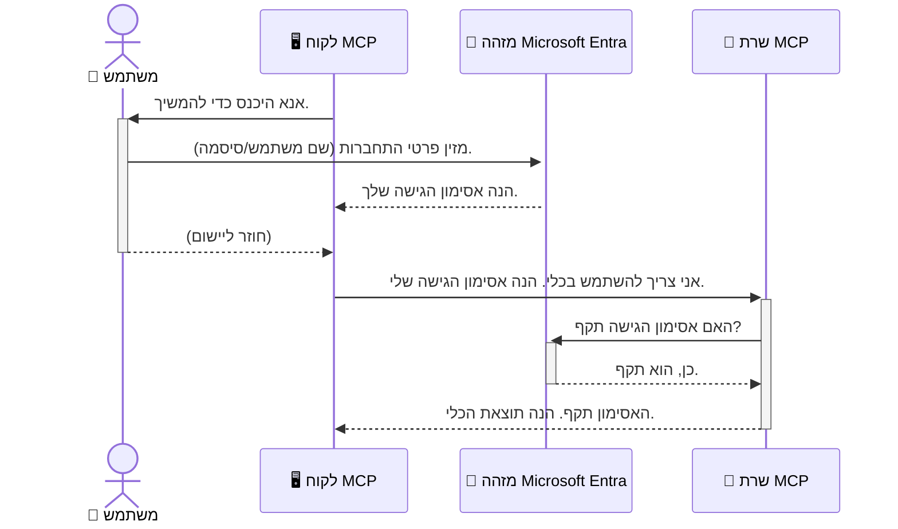

# אבטחת זרימות עבודה של בינה מלאכותית: אימות Entra ID עבור שרתי פרוטוקול הקשר של מודלים

## מבוא
אבטחת שרת פרוטוקול הקשר של מודלים (MCP) שלך חשובה כמו לנעול את דלת הבית. השארת שרת ה-MCP פתוח חושפת את הכלים והנתונים שלך לגישה לא מאושרת, שעלולה להוביל להפרות אבטחה. Microsoft Entra ID מספקת פתרון ניהול זהויות וגישה חזק מבוסס ענן, המסייע להבטיח שרק משתמשים ואפליקציות מורשים יוכלו לתקשר עם שרת ה-MCP שלך. בסעיף זה תלמד כיצד להגן על זרימות העבודה של הבינה המלאכותית שלך באמצעות אימות Entra ID.

## מטרות הלמידה
בסיום סעיף זה תוכל:

- להבין את חשיבות אבטחת שרתי MCP.
- להסביר את היסודות של Microsoft Entra ID ואימות OAuth 2.0.
- לזהות את ההבדל בין לקוחות ציבוריים לסודיים.
- ליישם אימות Entra ID בתרחישים של שרתי MCP מקומיים (לקוח ציבורי) ומרוחקים (לקוח סודי).
- ליישם שיטות אבטחה מיטביות בפיתוח זרימות עבודה של בינה מלאכותית.

## אבטחה ו-MCP

כשם שלא היית משאיר את דלת הבית שלך לא נעולה, כך לא רצוי להשאיר את שרת ה-MCP פתוח לגישה חופשית. אבטחת זרימות העבודה של הבינה המלאכותית שלך היא חיונית לבניית יישומים חזקים, אמינים ובטוחים. פרק זה יציג בפניך כיצד להשתמש ב-Microsoft Entra ID לאבטחת שרתי MCP, להבטיח שרק משתמשים ואפליקציות מורשים יוכלו לגשת לכלים והנתונים שלך.

## מדוע אבטחה חשובה לשרתי MCP

דמיין שלשרת ה-MCP שלך יש כלי שיכול לשלוח אימיילים או לגשת למסד נתונים של לקוחות. שרת לא מאובטח משמעותו שכל אחד עלול להשתמש בכלי זה, מה שעלול להוביל לגישה לא מורשית לנתונים, ספאם או פעילויות זדוניות אחרות.

על ידי יישום אימות, אתה מבטיח שכל בקשה לשרת תאומת זהות, ומאמת שאתה מזוהה כמשתמש או אפליקציה שמבצעת את הבקשה. זהו השלב הראשון והקריטי ביותר באבטחת זרימות העבודה של הבינה המלאכותית שלך.

## מבוא ל-Microsoft Entra ID

[**Microsoft Entra ID**](https://adoption.microsoft.com/microsoft-security/entra/) היא שירות ניהול זהויות וגישה מבוסס ענן. חשבו עליה כשומר ביטחון אוניברסלי לאפליקציות שלכם. היא מנהלת את התהליך המורכב של אימות זהויות משתמשים (Authentication) וקביעת ההרשאות שלהם (Authorization).

על ידי שימוש ב-Entra ID, ניתן:

- לאפשר כניסה מאובטחת למשתמשים.
- להגן על APIs ושירותים.
- לנהל מדיניות גישה ממקום מרכזי.

לשרתי MCP, Entra ID מספקת פתרון אמין וחזק לניהול מי יכול לגשת ליכולות השרת שלך.

---

## הבנת הקסם: כיצד עובד אימות Entra ID

Entra ID משתמשת בסטנדרטים פתוחים כמו **OAuth 2.0** לטיפול באימות. בעוד שהפרטים יכולים להיות מורכבים, הרעיון המרכזי פשוט וניתן להבין אותו באמצעות אנלוגיה.

### מבוא עדין ל-OAuth 2.0: מפתח החניה

חשבו על OAuth 2.0 כשירות חניה לרכב שלכם. כשאתם מגיעים למסעדה, אינכם נותנים למפקיד את מפתח הבית שלכם. במקום זאת, אתם נותנים לו **מפתח חניה** שמוגבל בהרשאות — הוא יכול להניע את הרכב ולנעול את הדלתות, אך לא יכול לפתוח את תא המטען או תא הכפפות.

בהקבלה זו:

- **אתה** הוא ה-**משתמש**.
- **הרכב שלך** הוא שרת ה-**MCP** עם הכלים והנתונים היקרים שלו.
- ה-**מפקיד** הוא **Microsoft Entra ID**.
- ה-**מנהל החניה** הוא **לקוח MCP** (האפליקציה המנסה לגשת לשרת).
- ה-**מפתח החניה** הוא **אסימון הגישה (Access Token)**.

אסימון הגישה הוא מחרוזת מאובטחת שטוען לקוח ה-MCP מקבל מ-Entra ID לאחר ההתחברות שלך. הלקוח לאחר מכן מציג את האסימון לשרת ה-MCP בכל בקשה. השרת יכול לוודא את האסימון כדי להבטיח שהבקשה חוקית ושהלקוח מחזיק בהרשאות הנדרשות, כל זאת מבלי לטפל בסיסמאות או פרטי ההזדהות שלך.

### תהליך האימות

כך התהליך מתבצע בפועל:



### היכרות עם Microsoft Authentication Library (MSAL)

לפני שנצלול לקוד, חשוב להציג רכיב מרכזי שתראה בדוגמאות: **ספריית האימות של מיקרוסופט (MSAL)**.

MSAL היא ספרייה שפותחה על ידי מיקרוסופט שמקלה מאוד על המפתחים לטפל באימות. במקום לכתוב את כל הקוד המורכב לטיפול באסימונים מאובטחים, ניהול כניסות ורענון סשנים, MSAL עושה את העבודה הכבדה.

שימוש בספרייה כמו MSAL מומלץ מאוד מאחר ש:

- **מאובטח**: מיישם פרוטוקולים ונהלים אבטחתיים סטנדרטיים בתעשייה, ומפחית סיכונים לפגיעות בקוד.
- **מפשט את הפיתוח**: מסתיר את המורכבות של פרוטוקולי OAuth 2.0 ו-OpenID Connect, ומאפשר להוסיף אימות חזק לאפליקציה בכמה שורות קוד בלבד.
- **מתוחזק**: מיקרוסופט ממשיכה לתחזק ולעדכן את MSAL כדי להתמודד עם איומי אבטחה חדשים ושינויים בפלטפורמות.

MSAL תומכת במגוון רחב של שפות ומסגרות לפיתוח אפליקציות, כולל .NET, JavaScript/TypeScript, Python, Java, Go ופורטלים סלולריים כמו iOS ואנדרואיד, כך שניתן להשתמש בתבניות אימות עקביות על פני כל טכנולוגיות הפיתוח שלך.

למידע נוסף על MSAL, ניתן לעיין בתיעוד הרשמי [MSAL overview documentation](https://learn.microsoft.com/entra/identity-platform/msal-overview).

---

## אבטחת שרת MCP עם Entra ID: מדריך שלב אחר שלב

כעת נעבור כיצד לאבטח שרת MCP מקומי (שאיתו מתקשרים דרך `stdio`) באמצעות Entra ID. דוגמה זו משתמשת ב**לקוח ציבורי**, המתאים לאפליקציות שרצות על מחשב המשתמש, כמו אפליקציית שולחן עבודה או שרת פיתוח מקומי.

### תרחיש 1: אבטחת שרת MCP מקומי (עם לקוח ציבורי)

בתרחיש זה נבחן שרת MCP שרץ מקומית, מתקשר דרך `stdio` ומשתמש ב-Entra ID לאימות המשתמש לפני מתן גישה לכלים שלו. לשרת יהיה כלי יחיד שמופק את פרטי הפרופיל של המשתמש מ-Microsoft Graph API.

#### 1. הגדרת האפליקציה ב-Entra ID

לפני כתיבת קוד, יש לרשום את האפליקציה ב-Microsoft Entra ID. זה מודיע ל-Entra ID על האפליקציה ומעניק לה הרשאות להשתמש בשירות האימות.

1. עבור אל **[פורטל Microsoft Entra](https://entra.microsoft.com/)**.
2. עבור ל- **App registrations** ולחץ על **New registration**.
3. תן שם לאפליקציה שלך (לדוגמה, "שרת MCP מקומי שלי").
4. בחר ב- **Supported account types** את האפשרות **Accounts in this organizational directory only**.
5. ניתן להשאיר את **Redirect URI** ריק בדוגמה זו.
6. לחץ על **Register**.

לאחר ההרשמה, רשום את **Application (client) ID** ואת **Directory (tenant) ID**. תצטרך אותם בקוד.

#### 2. הקוד: הסבר

נעיין בחלקי מפתח בקוד המטפל באימות. הקוד המלא לדוגמה זו זמין בתיקיית [Entra ID - Local - WAM](https://github.com/Azure-Samples/mcp-auth-servers/tree/main/src/entra-id-local-wam) ממאגר [mcp-auth-servers GitHub](https://github.com/Azure-Samples/mcp-auth-servers).

**`AuthenticationService.cs`**

מחלקה זו אחראית על האינטראקציה עם Entra ID.

- **`CreateAsync`**: שיטה המאתחלת את `PublicClientApplication` מתוך MSAL, ומוגדרת עם `clientId` ו- `tenantId` של האפליקציה שלך.
- **`WithBroker`**: מאפשר שימוש בברוקר (כגון Windows Web Account Manager) שמספק חוויית כניסה מאובטחת וחלקה.
- **`AcquireTokenAsync`**: השיטה המרכזית. מנסה תחילה לקבל אסימון בשקט (ללא בקשת כניסה מחדש אם כבר קיימת סשן תקין). אם לא מצליח לקבל אסימון בשקט, תבקש מהמשתמש להתחבר באופן אינטראקטיבי.

```csharp
// Simplified for clarity
public static async Task<AuthenticationService> CreateAsync(ILogger<AuthenticationService> logger)
{
    var msalClient = PublicClientApplicationBuilder
        .Create(_clientId) // Your Application (client) ID
        .WithAuthority(AadAuthorityAudience.AzureAdMyOrg)
        .WithTenantId(_tenantId) // Your Directory (tenant) ID
        .WithBroker(new BrokerOptions(BrokerOptions.OperatingSystems.Windows))
        .Build();

    // ... cache registration ...

    return new AuthenticationService(logger, msalClient);
}

public async Task<string> AcquireTokenAsync()
{
    try
    {
        // Try silent authentication first
        var accounts = await _msalClient.GetAccountsAsync();
        var account = accounts.FirstOrDefault();

        AuthenticationResult? result = null;

        if (account != null)
        {
            result = await _msalClient.AcquireTokenSilent(_scopes, account).ExecuteAsync();
        }
        else
        {
            // If no account, or silent fails, go interactive
            result = await _msalClient.AcquireTokenInteractive(_scopes).ExecuteAsync();
        }

        return result.AccessToken;
    }
    catch (Exception ex)
    {
        _logger.LogError(ex, "An error occurred while acquiring the token.");
        throw; // Optionally rethrow the exception for higher-level handling
    }
}
```

**`Program.cs`**

כאן מוגדר שרת ה-MCP ומשולבת שירות האימות.

- **`AddSingleton<AuthenticationService>`**: רושם את `AuthenticationService` במכולת ההזרקה (dependency injection), כך שניתן להשתמש בו בחלקים אחרים של האפליקציה (כמו הכלי).
- הכלי **`GetUserDetailsFromGraph`** זקוק למופע של `AuthenticationService`. לפני ביצוע פעילות, הוא קורא ל- `authService.AcquireTokenAsync()` כדי לקבל אסימון גישה תקף. אם האימות מצליח, הוא משתמש באסימון כדי לקרוא ל-Microsoft Graph API ולהביא את פרטי המשתמש.

```csharp
// Simplified for clarity
[McpServerTool(Name = "GetUserDetailsFromGraph")]
public static async Task<string> GetUserDetailsFromGraph(
    AuthenticationService authService)
{
    try
    {
        // This will trigger the authentication flow
        var accessToken = await authService.AcquireTokenAsync();

        // Use the token to create a GraphServiceClient
        var graphClient = new GraphServiceClient(
            new BaseBearerTokenAuthenticationProvider(new TokenProvider(authService)));

        var user = await graphClient.Me.GetAsync();

        return System.Text.Json.JsonSerializer.Serialize(user);
    }
    catch (Exception ex)
    {
        return $"Error: {ex.Message}";
    }
}
```

#### 3. כיצד כל זה עובד יחד

1. כאשר לקוח MCP מנסה להשתמש בכלי `GetUserDetailsFromGraph`, הכלי קורא תחילה ל- `AcquireTokenAsync`.
2. `AcquireTokenAsync` מפעיל את ספריית MSAL כדי לבדוק אם יש אסימון תקף.
3. אם לא נמצא אסימון, MSAL, דרך הברוקר, תבקש מהמשתמש להיכנס עם חשבון Entra ID שלו.
4. לאחר שהמשתמש נכנס, Entra ID מוציאה אסימון גישה.
5. הכלי מקבל את האסימון ומשתמש בו לביצוע קריאה מאובטחת ל-Microsoft Graph API.
6. פרטי המשתמש מוחזרים ללקוח MCP.

תהליך זה מבטיח שרק משתמשים מאומתים יכולים להשתמש בכלי, וכך מאבטח את שרת ה-MCP המקומי שלך.

### תרחיש 2: אבטחת שרת MCP מרוחק (עם לקוח סודי)

כאשר שרת ה-MCP שלך פועל על מכונה מרוחקת (כגון שרת ענן) ומתקשר בפרוטוקול כמו HTTP Streaming, דרישות האבטחה שונות. במקרה זה יש להשתמש ב**לקוח סודי** ובזרימת **Authorization Code Flow**. זוהי שיטה יותר מאובטחת מאחר וסודות האפליקציה לא נחשפים לדפדפן.

הדוגמה משתמשת בשרת MCP מבוסס TypeScript שמשתמש ב-Express.js לטיפול בבקשות HTTP.

#### 1. הגדרת האפליקציה ב-Entra ID

ההגדרה ב-Entra ID דומה ללקוח הציבורי, אך עם הבדל מרכזי — יש ליצור **סוד לקוח (client secret)**.

1. עבור אל **[פורטל Microsoft Entra](https://entra.microsoft.com/)**.
2. בהרשאת האפליקציה שלך, עבור ללשונית **Certificates & secrets**.
3. לחץ על **New client secret**, תן לו תיאור ולחץ **Add**.
4. **חשוב:** העתק את ערך הסוד מיידית. לא תוכל לראות אותו שוב.
5. כמו כן, עליך להגדיר **Redirect URI**. עבור ללשונית **Authentication**, לחץ על **Add a platform**, בחר **Web**, והזן את כתובת ה-redirect של האפליקציה שלך (למשל, `http://localhost:3001/auth/callback`).

> **⚠️ הערת אבטחה חשובה:** עבור יישומים בסביבה יצרנית, מיקרוסופט ממליצה בחום להשתמש בשיטות אימות ללא סודות כמו **Managed Identity** או **Workload Identity Federation** במקום סודות לקוח. סודות לקוח מהווים סיכון אבטחתי שכן הם עלולים להיחשף או להיות מופרים. זהויות מנוהלות מספקות גישה מאובטחת יותר בכך שהן מבטלות את הצורך לאחסן קרדנציאלים בקוד או בקונפיגורציה.
>
> למידע נוסף על זהויות מנוהלות וכיצד ליישמן, ראה את [סקירת זהויות מנוהלות למשאבי Azure](https://learn.microsoft.com/entra/identity/managed-identities-azure-resources/overview).

#### 2. הקוד: הסבר

הדוגמה משתמשת בגישה מבוססת סשנים. כאשר המשתמש מאומת, השרת מאחסן את אסימון הגישה והאסימון החדש בסשן ומעניק למשתמש אסימון סשן. אסימון סשן זה משמש לבקשות הבאות. הקוד המלא זמין בתיקיית [Entra ID - Confidential client](https://github.com/Azure-Samples/mcp-auth-servers/tree/main/src/entra-id-cca-session) ממאגר [mcp-auth-servers GitHub](https://github.com/Azure-Samples/mcp-auth-servers).

**`Server.ts`**

קובץ זה מגדיר את שרת ה-Express ושכבת התקשורת של MCP.

- **`requireBearerAuth`**: זהו תווך (middleware) המגן על נקודות הקצה `/sse` ו-`/message`. הוא בודק את תקפות אסימון הBearer ב-header Authorization של הבקשה.
- **`EntraIdServerAuthProvider`**: מחלקה מותאמת שמיישמת את הממשק `McpServerAuthorizationProvider`. אחראית לטיפול בזרימת OAuth 2.0.
- **`/auth/callback`**: נקודת סוף המטפלת בהפניה מ-Entra ID לאחר שהמשתמש אותת. מחליפה את קוד האישור באסימון גישה ואסימון רענון.

```typescript
// מפושט לשם בהירות
const app = express();
const { server } = createServer();
const provider = new EntraIdServerAuthProvider();

// הגן על נקודת הקצה של SSE
app.get("/sse", requireBearerAuth({
  provider,
  requiredScopes: ["User.Read"]
}), async (req, res) => {
  // ... התחבר לטרנספורט ...
});

// הגן על נקודת הקצה של ההודעה
app.post("/message", requireBearerAuth({
  provider,
  requiredScopes: ["User.Read"]
}), async (req, res) => {
  // ... טיפול בהודעה ...
});

// טיפול בקריאת החזרה של OAuth 2.0
app.get("/auth/callback", (req, res) => {
  provider.handleCallback(req.query.code, req.query.state)
    .then(result => {
      // ... טיפול בהצלחה או כישלון ...
    });
});
```

**`Tools.ts`**

קובץ זה מגדיר את הכלים שהשרת מספק. הכלי `getUserDetails` דומה לזה שבדוגמה הקודמת, אך מביא את אסימון הגישה מהסשן.

```typescript
// פושט לצורך בהירות
server.setRequestHandler(CallToolRequestSchema, async (request) => {
  const { name } = request.params;
  const context = request.params?.context as { token?: string } | undefined;
  const sessionToken = context?.token;

  if (name === ToolName.GET_USER_DETAILS) {
    if (!sessionToken) {
      throw new AuthenticationError("Authentication token is missing or invalid. Ensure the token is provided in the request context.");
    }

    // השג את אסימון מזהה Entra מאחסון המפגש
    const tokenData = tokenStore.getToken(sessionToken);
    const entraIdToken = tokenData.accessToken;

    const graphClient = Client.init({
      authProvider: (done) => {
        done(null, entraIdToken);
      }
    });

    const user = await graphClient.api('/me').get();

    // ... החזר פרטי משתמש ...
  }
});
```

**`auth/EntraIdServerAuthProvider.ts`**

מחלקה זו מטפלת בלוגיקה של:

- הפניית המשתמש לדף הכניסה של Entra ID.
- החלפת קוד האישור באסימון גישה.
- אחסון האסימונים ב-`tokenStore`.
- רענון אסימון הגישה בעת שפג תוקפו.

#### 3. כיצד כל זה עובד יחד

1. כאשר משתמש מנסה להתחבר לשרת MCP בפעם הראשונה, ה-middleware `requireBearerAuth` מזהה שאין לו סשן תקף ומפנה אותו לדף הכניסה של Entra ID.
2. המשתמש נכנס עם חשבון Entra ID שלו.
3. Entra ID מפנה את המשתמש חזרה לנתיב `/auth/callback` עם קוד הרשאה.  
4. השרת מחליף את הקוד באסימון גישה ואסימון רענון, מאחסן אותם, ויוצר אסימון מושב שנשלח ללקוח.  
5. כעת הלקוח יכול להשתמש באסימון המושב הזה בכותרת `Authorization` עבור כל הבקשות העתידיות לשרת MCP.  
6. כאשר מופעל הכלי `getUserDetails`, הוא משתמש באסימון המושב כדי לאתר את אסימון הגישה של Entra ID ואז משתמש בו כדי לקרוא ל-API של Microsoft Graph.

זרימה זו מורכבת יותר מזו של הלקוח הציבורי, אך נדרשת עבור נקודות קצה הפונות לאינטרנט. מכיוון ששרתים מרוחקים של MCP נגישים דרך האינטרנט הציבורי, הם זקוקים לאמצעי אבטחה חזקים יותר כדי להגן מפני גישה לא מורשית והתקפות פוטנציאליות.


## שיטות עבודה מומלצות לאבטחה

- **תמיד השתמש ב-HTTPS**: הצפן את התקשורת בין הלקוח לשרת כדי להגן על האסימונים מפני יירוט.  
- **יישם בקרת גישה מבוססת תפקידים (RBAC)**: אל תבדוק רק *אם* משתמש מאומת; בדוק *מה* הוא מורשה לעשות. ניתן להגדיר תפקידים ב-Entra ID ולבדוק אותם בשרת ה-MCP שלך.  
- **נטר ובצע ביקורת**: רשום את כל אירועי האימות כדי שתוכל לזהות ולהגיב לפעילות חשודה.  
- **טפל במגבלות תדירות וב-throttling**: Microsoft Graph ו-APIs אחרים מפעילים מגבלות תדירות כדי למנוע שימוש לרעה. יישם לוגיקת backoff אקספוננציאלית ונסיונות חוזרים בשרת ה-MCP כדי להתמודד בצורה אלגנטית עם תגובות HTTP 429 (בקשות מרובות מדי). שקול לשמור במטמון נתונים שניגשים אליהם לעיתים קרובות כדי להפחית קריאות API.  
- **אחסון בטוח של אסימונים**: אחסן אסימוני גישה ואסימוני רענון באופן בטוח. עבור אפליקציות מקומיות, השתמש במנגנוני האחסון הבטוח של המערכת. עבור אפליקציות שרת, שקול להשתמש באחסון מוצפן או בשירותי ניהול מפתחות מאובטחים כגון Azure Key Vault.  
- **טיפול בתוקף אסימונים**: לאסימוני גישה יש תוקף מוגבל. יישם רענון אוטומטי של אסימונים באמצעות אסימוני רענון לשמירה על חוויית משתמש רציפה ללא צורך באימות מחדש.  
- **שקול להשתמש ב-Azure API Management**: בעוד שיישום האבטחה ישירות בשרת ה-MCP נותן לך שליטה מדויקת, שערי API כמו Azure API Management יכולים לטפל בהרבה דאגות אבטחה אלה אוטומטית, כולל אימות, הרשאה, מגבלות תדירות וניטור. הם מספקים שכבת אבטחה מרכזית היושבת בין הלקוחות שלך לבין שרתי ה-MCP שלך. לפרטים נוספים על שימוש בשערי API עם MCP, עיין ב-[Azure API Management Your Auth Gateway For MCP Servers](https://techcommunity.microsoft.com/blog/integrationsonazureblog/azure-api-management-your-auth-gateway-for-mcp-servers/4402690).


## נקודות מרכזיות

- אבטחת שרת ה-MCP שלך חיונית להגנה על הנתונים והכלים שלך.  
- Microsoft Entra ID מספק פתרון עמיד וניתן להרחבה עבור אימות והרשאה.  
- השתמש ב**לקוח ציבורי** עבור אפליקציות מקומיות וב**לקוח סודי** עבור שרתים מרוחקים.  
- **זרימת קוד ההרשאה** היא האופציה המאובטחת ביותר עבור אפליקציות רשת.  


## תרגיל

1. חשוב על שרת MCP שאתה עשוי לבנות. האם הוא יהיה שרת מקומי או שרת מרוחק?  
2. בהתבסס על תשובתך, האם תשתמש בלקוח ציבורי או סודי?  
3. איזו הרשאה שרת MCP שלך יבקש לביצוע פעולות מול Microsoft Graph?  


## תרגילים מעשיים

### תרגיל 1: רישום אפליקציה ב-Entra ID  
נווט אל פורטל Microsoft Entra.  
רשום אפליקציה חדשה עבור שרת ה-MCP שלך.  
רשום את מזהה האפליקציה (מזהה לקוח) ומזהה הספרייה (מזהה שוכר).

### תרגיל 2: אבטחת שרת MCP מקומי (לקוח ציבורי)  
- עקוב אחר דוגמת הקוד לשילוב MSAL (Microsoft Authentication Library) לאימות משתמש.  
- בדוק את זרימת האימות על ידי קריאה לכלי MCP שמביא פרטי משתמש ממיקרוסופט גרף.

### תרגיל 3: אבטחת שרת MCP מרוחק (לקוח סודי)  
- רשם לקוח סודי ב-Entra ID וצור סוד לקוח.  
- קונפג את שרת ה-MCP שלך ב-Express.js לשימוש בזרימת קוד ההרשאה.  
- בדוק את נקודות הקצה המוגנות ואשר גישה מבוססת אסימון.

### תרגיל 4: יישום שיטות אבטחה מיטביות  
- אפשר HTTPS בשרת המקומי או המרוחק שלך.  
- יישם בקרת גישה מבוססת תפקידים (RBAC) בלוגיקת השרת שלך.  
- הוסף טיפול בתוקף אסימונים ואחסון בטוח של אסימונים.

## משאבים

1. **מסמך סקירה של MSAL**  
   למד כיצד ספריית האימות של מיקרוסופט (MSAL) מאפשרת רכישת אסימונים מאובטחת בפלטפורמות שונות:  
   [MSAL Overview on Microsoft Learn](https://learn.microsoft.com/en-gb/entra/msal/overview)

2. **מאגר GitHub של Azure-Samples/mcp-auth-servers**  
   מימושים לדוגמה של שרתי MCP המדגימים זרימות אימות:  
   [Azure-Samples/mcp-auth-servers on GitHub](https://github.com/Azure-Samples/mcp-auth-servers)

3. **סקירה של זהויות מנוהלות למשאבי Azure**  
   הבן כיצד ניתן לבטל סודות באמצעות זהויות מנוהלות שהוקצו למערכת או למשתמש:  
   [Managed Identities Overview on Microsoft Learn](https://learn.microsoft.com/en-us/entra/identity/managed-identities-azure-resources/)

4. **Azure API Management: שער האימות שלך לשרתי MCP**  
   סקירה מעמיקה של השימוש ב-APIM כשער OAuth2 מאובטח עבור שרתי MCP:  
   [Azure API Management Your Auth Gateway For MCP Servers](https://techcommunity.microsoft.com/blog/integrationsonazureblog/azure-api-management-your-auth-gateway-for-mcp-servers/4402690)

5. **רפרנס הרשאות Microsoft Graph**  
   רשימה מקיפה של הרשאות מוגדרות ומאושרות עבור Microsoft Graph:  
   [Microsoft Graph Permissions Reference](https://learn.microsoft.com/zh-tw/graph/permissions-reference)


## תוצאות למידה  
בסיום חלק זה תוכל:

- להסביר מדוע אימות הוא קריטי עבור שרתי MCP וזרימות עבודה של AI.  
- להגדיר ולתאם אימות ב-Entra ID עבור תרחישי שרת MCP מקומיים ומרוחקים.  
- לבחור את סוג הלקוח המתאים (ציבורי או סודי) בהתבסס על פריסת השרת שלך.  
- ליישם שיטות תכנות מאובטחות, כולל אחסון אסימונים והרשאה מבוססת תפקיד.  
- להגן בביטחון על שרת ה-MCP שלך וכליו מפני גישה לא מורשית.

## מה הלאה 

- [5.13 אינטגרציה של פרוטוקול הקשר מודל (MCP) עם Microsoft Foundry](../mcp-foundry-agent-integration/README.md)

---

<!-- CO-OP TRANSLATOR DISCLAIMER START -->
**כתב ויתור**:
מסמך זה תורגם באמצעות שירות תרגום אוטומטי [Co-op Translator](https://github.com/Azure/co-op-translator). למרות שאנו שואפים לדיוק, יש לקחת בחשבון שתרגומים אוטומטיים עלולים להכיל שגיאות או אי-דיוקים. יש להחשיב את המסמך המקורי בשפתו הטבעית כמקור הסמכות. למידע קריטי מומלץ להשתמש בתרגום מקצועי על ידי מתרגם אדם. אנו לא אחראים לכל אי-הבנה או פירוש שגוי הנובע מהשימוש בתרגום זה.
<!-- CO-OP TRANSLATOR DISCLAIMER END -->