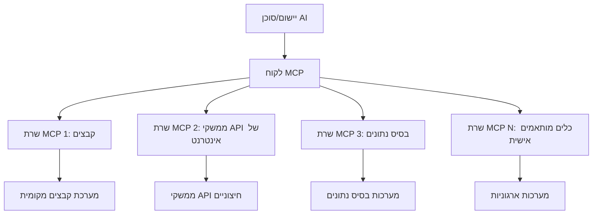

# 🌐 מודול 2: MCP עם יסודות ערכת הכלים Microsoft Foundry Toolkit

[]()
[]()
[]()

## 📋 מטרות הלמידה

בתום מודול זה, תוכל:
- ✅ להבין את הארכיטקטורה והיתרונות של פרוטוקול הקשר למודלים (MCP)
- ✅ לחקור את מערכת השרתים MCP של מיקרוסופט
- ✅ לשלב שרתי MCP עם בונה הסוכנים Microsoft Foundry Toolkit Agent Builder
- ✅ לבנות סוכן אוטומציה בדפדפן פונקציונלי באמצעות Playwright MCP
- ✅ להגדיר ולבדוק כלים של MCP בתוך הסוכנים שלך
- ✅ לייצא ולפרוס סוכנים שמונעים על ידי MCP לשימוש בייצור

## 🎯 המשך למודול 1

במודול 1 רכשנו את יסודות ערכת הכלים Microsoft Foundry Toolkit ויצרנו את סוכן הפייתון הראשון שלנו. כעת נוכל **לחזק** את הסוכנים שלך על ידי חיבורם לכלים ושירותים חיצוניים דרך הפרוטוקול המהפכני **Model Context Protocol (MCP)**.

חשוב על זה כאילו אתה משדרג ממחשבון פשוט למחשב מלא – לסוכני ה-AI שלך תהיה היכולת:
- 🌐 לגלוש ולתקשר עם אתרי אינטרנט
- 📁 לגשת ולנהל קבצים
- 🔧 להשתלב עם מערכות ארגוניות
- 📊 לעבד נתונים בזמן אמת מ-APIs

## 🧠 הבנת פרוטוקול הקשר למודלים (MCP)

### 🔍 מהו MCP?

פרוטוקול הקשר למודלים (MCP) הוא ה-**"USB-C לאפליקציות AI"** – תקן פתוח מהפכני המאפשר חיבור של מודלי שפה גדולים (LLMs) לכלים, מקורות נתונים ושירותים חיצוניים. כפי ש-USB-C ביטל את הבלגן של כבלים באמצעות מחבר אוניברסלי אחד, כך MCP מסיר את המורכבות של שילוב AI באמצעות פרוטוקול תקני אחד.

### 🎯 הבעיה ש-MCP פותר

**לפני MCP:**
- 🔧 אינטגרציות מותאמות לכל כלי בנפרד
- 🔄 תלות בספקים עם פתרונות קנייניים  
- 🔒 פגיעויות אבטחה מקישורים אקראיים
- ⏱️ חודשים של פיתוח לאינטגרציות בסיסיות

**עם MCP:**
- ⚡ אינטגרציית כלים פשוטה וללא מאמץ
- 🔄 ארכיטקטורה ניטרלית לספקים
- 🛡️ אבטחה מובנית כסטנדרט
- 🚀 דקות להוספת יכולות חדשות

### 🏗️ התבוננות מעמיקה בארכיטקטורת MCP

MCP פועל בארכיטקטורת **לקוח-שרת** שיוצרת אקוסיסטם מאובטח ומדרג:



**🔧 מרכיבים עיקריים:**

| רכיב | תפקיד | דוגמאות |
|-----------|------|----------|
| **מארחי MCP** | אפליקציות הצורכות שירותי MCP | Claude Desktop, VS Code, Microsoft Foundry Toolkit |
| **לקוחות MCP** | מטפלי הפרוטוקול (1:1 עם שרתים) | כלולים באפליקציות המארחות |
| **שרתי MCP** | חושפים יכולות דרך הפרוטוקול התקני | Playwright, Files, Azure, GitHub |
| **שכבת תקשורת** | שיטות תקשורת | stdio, HTTP, WebSockets |


## 🏢 מערכת שרתי MCP של מיקרוסופט

מיקרוסופט מובילה את אקוסיסטם MCP עם סט מקיף של שרתים ברמת ארגונית שמטפלים בצרכים עסקיים אמיתיים.

### 🌟 שרתי MCP מובילים של מיקרוסופט

#### 1. ☁️ שרת Azure MCP
**🔗 מאגר**: [azure/azure-mcp](https://github.com/azure/azure-mcp)
**🎯 מטרה**: ניהול משאבי Azure מקיף עם שילוב AI

**✨ תכונות מרכזיות:**
- פרוביזיונינג אינפרה-אדמיניסטרטיבי דקלרטיבי
- ניטור משאבים בזמן אמת
- המלצות לאופטימיזציית עלויות
- בדיקת תאימות לאבטחה

**🚀 מקרים לשימוש:**
- תשתית-כקוד עם סיוע AI
- קנה מידה אוטומטי למשאבים
- אופטימיזציית עלות ענן
- אוטומציה של זרימות עבודה DevOps

#### 2. 📊 Microsoft Dataverse MCP
**📚 תיעוד**: [Microsoft Dataverse Integration](https://go.microsoft.com/fwlink/?linkid=2320176)
**🎯 מטרה**: ממשק שפה טבעית לנתוני עסק

**✨ תכונות מרכזיות:**
- שאילתות בסיס נתונים בשפה טבעית
- הבנת הקשר עסקי
- תבניות פרומפט מותאמות אישית
- ממשל נתונים ארגוני

**🚀 מקרים לשימוש:**
- דוחות בינה עסקית
- ניתוח נתוני לקוחות
- תובנות צינור מכירות
- שאילתות עמידה בתקנות

#### 3. 🌐 שרת Playwright MCP
**🔗 מאגר**: [microsoft/playwright-mcp](https://github.com/microsoft/playwright-mcp)
**🎯 מטרה**: אוטומציה בדפדפן ויכולות אינטראקציה באינטרנט

**✨ תכונות מרכזיות:**
- אוטומציה חוצת דפדפנים (Chrome, Firefox, Safari)
- זיהוי אלמנטים חכם
- יצירת צילום מסך ו-PDF
- ניטור תעבורת רשת

**🚀 מקרים לשימוש:**
- זרימות בדיקות אוטומטיות
- כריית נתונים ושאיבת מידע מהאינטרנט
- ניטור חוויית משתמש
- אוטומציה של ניתוח תחרותי

#### 4. 📁 שרת Files MCP
**🔗 מאגר**: [microsoft/files-mcp-server](https://github.com/microsoft/files-mcp-server)
**🎯 מטרה**: פעולות חכמות במערכת הקבצים

**✨ תכונות מרכזיות:**
- ניהול קבצים דקלרטיבי
- סינכרון תוכן
- אינטגרציה עם בקרת גרסאות
- חילוץ מטא-דאטה

**🚀 מקרים לשימוש:**
- ניהול תיעוד
- ארגון מאגרי קוד
- זרימות פרסום תוכן
- טיפול בקבצים בצינורות נתונים

#### 5. 📝 שרת MarkItDown MCP
**🔗 מאגר**: [microsoft/markitdown](https://github.com/microsoft/markitdown)
**🎯 מטרה**: עיבוד וניתוח Markdown מתקדם

**✨ תכונות מרכזיות:**
- ניתוח Markdown עשיר
- המרת פורמטים (MD ↔ HTML ↔ PDF)
- ניתוח מבנה תוכן
- עיבוד תבניות

**🚀 מקרים לשימוש:**
- זרימות עבודה של תיעוד טכני
- מערכות ניהול תוכן
- יצירת דוחות
- אוטומציה של מאגר ידע

#### 6. 📈 שרת Clarity MCP
**📦 חבילה**: [@microsoft/clarity-mcp-server](https://www.npmjs.com/package/@microsoft/clarity-mcp-server)
**🎯 מטרה**: אנליטיקה אינטרנטית ותובנות על התנהגות משתמשים

**✨ תכונות מרכזיות:**
- ניתוח נתוני מפת חום
- הקלטות מושבי משתמשים
- מדדי ביצועים
- ניתוח משפך המרה

**🚀 מקרים לשימוש:**
- אופטימיזציית אתרים
- מחקר חוויית משתמש
- ניתוח בדיקות A/B
- לוחות בקרה לבינה עסקית

### 🌍 אקוסיסטם קהילתי

מעבר לשרתי מיקרוסופט, האקוסיסטם של MCP כולל:
- **🐙 GitHub MCP**: ניהול מאגרים וניתוח קוד
- **🗄️ מסדי נתונים MCP**: אינטגרציות עם PostgreSQL, MySQL, MongoDB
- **☁️ ספקי ענן MCP**: כלים של AWS, GCP, Digital Ocean
- **📧 תקשורת MCP**: אינטגרציה עם Slack, Teams, דואר אלקטרוני

## 🛠️ מעבדה מעשית: בניית סוכן אוטומציה בדפדפן

**🎯 יעד הפרויקט**: ליצור סוכן אוטומציה בדפדפן חכם שמשתמש בשרת Playwright MCP שיכול לגלוש באתרי אינטרנט, לחלץ מידע ולבצע אינטראקציות מורכבות ברשת.

### 🚀 שלב 1: הקמת הבסיס לסוכן

#### שלב 1: אתחל את הסוכן שלך
1. **פתח את Microsoft Foundry Toolkit Agent Builder**
2. **צור סוכן חדש** עם ההגדרות הבאות:
   - **שם**: `BrowserAgent`
   - **מודל**: בחר GPT-4o


### 🔧 שלב 2: זרימת עבודה של אינטגרציית MCP

#### שלב 3: הוסף אינטגרציית שרת MCP
1. **נווט לקטגוריית כלים** ב-Agent Builder
2. **לחץ על "הוסף כלי"** כדי לפתוח את תפריט האינטגרציה
3. **בחר "שרת MCP"** מתוך האפשרויות הזמינות


**🔍 הבנת סוגי הכלים:**
- **כלים מובנים**: פונקציות ערכת כלים Microsoft Foundry מוכנות מראש
- **שרתי MCP**: אינטגרציות שירות חיצוניות
- **APIs מותאמים אישית**: נקודות קצה של השירות שלך
- **קריאות לפונקציות**: גישה ישירה לפונקציות מודל

#### שלב 4: בחירת שרת MCP
1. **בחר באפשרות "שרת MCP"** להתקדם


2. **עיין בקטלוג MCP** כדי לגלות אינטגרציות זמינות


### 🎮 שלב 3: הגדרת Playwright MCP

#### שלב 5: בחר וקבע את Playwright
1. **לחץ על "השתמש בשרתי MCP מובילים"** כדי לגשת לשרתים המאושרים של מיקרוסופט
2. **בחר ב-"Playwright"** מתוך הרשימה המובילה
3. **קבל את מזהה MCP ברירת המחדל** או התאם לסביבת העבודה שלך


#### שלב 6: אפשר את יכולות Playwright
**🔑 שלב קריטי**: בחר **את כל** שיטות Playwright הזמינות למקסימום פונקציונליות


**🛠️ כלים חיוניים של Playwright:**
- **ניווט**: `goto`, `goBack`, `goForward`, `reload`
- **אינטראקציה**: `click`, `fill`, `press`, `hover`, `drag`
- **חילוץ**: `textContent`, `innerHTML`, `getAttribute`
- **אימות**: `isVisible`, `isEnabled`, `waitForSelector`
- **תפיסה**: `screenshot`, `pdf`, `video`
- **רשת**: `setExtraHTTPHeaders`, `route`, `waitForResponse`

#### שלב 7: אמת הצלחה משולבת
**✅ סימני הצלחה:**
- כל הכלים מופיעים בממשק Agent Builder
- אין הודעות שגיאה בלוח האינטגרציה
- מצב שרת Playwright מציג "מחובר"


**🔧 פתרון בעיות נפוצות:**
- **כשל בהתחברות**: בדוק את חיבור האינטרנט והגדרות החומת אש
- **כלים חסרים**: ודא שכל היכולות נבחרו במהלך ההגדרה
- **שגיאות הרשאות**: בדוק של-VS Code יש הרשאות מערכת דרושות

### 🎯 שלב 4: הנדסת פרומפטים מתקדמת

#### שלב 8: עצב פרומפטים אינטליגנטיים למערכת
צור פרומפטים מתקדמים המנצלים את כל יכולות Playwright:

```markdown
# Web Automation Expert System Prompt

## Core Identity
You are an advanced web automation specialist with deep expertise in browser automation, web scraping, and user experience analysis. You have access to Playwright tools for comprehensive browser control.

## Capabilities & Approach
### Navigation Strategy
- Always start with screenshots to understand page layout
- Use semantic selectors (text content, labels) when possible
- Implement wait strategies for dynamic content
- Handle single-page applications (SPAs) effectively

### Error Handling
- Retry failed operations with exponential backoff
- Provide clear error descriptions and solutions
- Suggest alternative approaches when primary methods fail
- Always capture diagnostic screenshots on errors

### Data Extraction
- Extract structured data in JSON format when possible
- Provide confidence scores for extracted information
- Validate data completeness and accuracy
- Handle pagination and infinite scroll scenarios

### Reporting
- Include step-by-step execution logs
- Provide before/after screenshots for verification
- Suggest optimizations and alternative approaches
- Document any limitations or edge cases encountered

## Ethical Guidelines
- Respect robots.txt and rate limiting
- Avoid overloading target servers
- Only extract publicly available information
- Follow website terms of service
```

#### שלב 9: צור פרומפטים דינמיים למשתמש
עצב פרומפטים המדגימים יכולות מגוונות:

**🌐 דוגמת ניתוח רשת:**
```markdown
Navigate to github.com/kinfey and provide a comprehensive analysis including:
1. Repository structure and organization
2. Recent activity and contribution patterns  
3. Documentation quality assessment
4. Technology stack identification
5. Community engagement metrics
6. Notable projects and their purposes

Include screenshots at key steps and provide actionable insights.
```


### 🚀 שלב 5: ביצוע ובדיקות

#### שלב 10: הרץ את האוטומציה הראשונה שלך
1. **לחץ על "הפעלה"** כדי להתחיל את רצף האוטומציה
2. **נטר ביצוע בזמן אמת**:
   - דפדפן Chrome נפתח אוטומטית
   - הסוכן גולש אל אתר היעד
   - צילומי מסך מתועדים בכל שלב מרכזי
   - תוצאות הניתוח מוזרמות בזמן אמת


#### שלב 11: נתח תוצאות ותובנות
סקור ניתוח מקיף בממשק Agent Builder:


### 🌟 שלב 6: יכולות מתקדמות ופריסה

#### שלב 12: ייצא ופרוס לייצור
Agent Builder תומך באפשרויות פריסה מרובות:


## 🎓 סיכום מודול 2 ושלבים הבאים

### 🏆 הישג שהושג: אדון אינטגרציית MCP

**✅ מיומנויות שרכשת:**
- [ ] הבנת ארכיטקטורת MCP ויתרונותיה
- [ ] ניווט במערכת שרתי MCP של מיקרוסופט
- [ ] שילוב Playwright MCP עם Microsoft Foundry Toolkit
- [ ] בניית סוכני אוטומציה מתקדמים בדפדפן
- [ ] הנדסת פרומפטים מתקדמת לאוטומציה ברשת

### 📚 משאבים נוספים

- **🔗 מפרט MCP**: [תיעוד פרוטוקול רשמי](https://modelcontextprotocol.io/)
- **🛠️ API של Playwright**: [רשימת שיטות מלאה](https://playwright.dev/docs/api/class-playwright)
- **🏢 שרתי MCP של מיקרוסופט**: [מדריך אינטגרציה ארגונית](https://github.com/microsoft/mcp-servers)
- **🌍 דוגמאות קהילתיות**: [גלריית שרת MCP](https://github.com/modelcontextprotocol/servers)

**🎉 ברכות!** שלטת בהצלחה באינטגרציית MCP ועכשיו תוכל לבנות סוכני AI מוכנים לייצור עם יכולות כלים חיצוניים!


### 🔜 המשך למודול הבא

מוכן להעלות את מיומנויות ה-MCP שלך לשלב הבא? המשך אל **[מודול 3: פיתוח מתקדם של MCP עם Microsoft Foundry Toolkit](../lab3/README.md)** שם תלמד כיצד:
- ליצור שרתי MCP מותאמים אישית משלך
- להגדיר ולהשתמש ב-SDK פייתון המתקדם של MCP
- להקים את MCP Inspector לצורכי דיבוג
- לשלוט בזרימות פיתוח שרתי MCP מתקדמות
- לבנות שרת MCP למזג אוויר מאפס

---

<!-- CO-OP TRANSLATOR DISCLAIMER START -->
**כתב ויתור**:
מסמך זה תורגם באמצעות שירות תרגום אוטומטי [Co-op Translator](https://github.com/Azure/co-op-translator). למרות שאנו שואפים לדיוק, יש לקחת בחשבון שתרגומים אוטומטיים עלולים להכיל שגיאות או אי-דיוקים. יש להחשיב את המסמך המקורי בשפתו הטבעית כמקור הסמכות. למידע קריטי מומלץ להשתמש בתרגום מקצועי על ידי מתרגם אדם. אנו לא אחראים לכל אי-הבנה או פירוש שגוי הנובע מהשימוש בתרגום זה.
<!-- CO-OP TRANSLATOR DISCLAIMER END -->