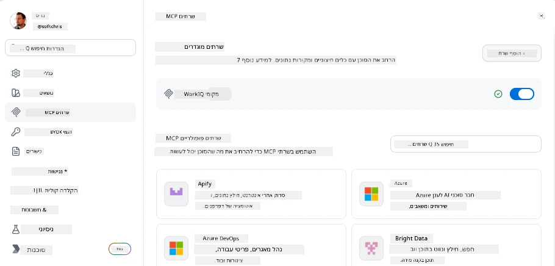
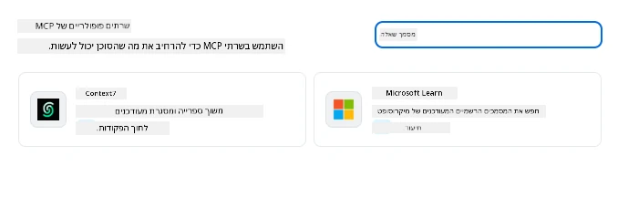
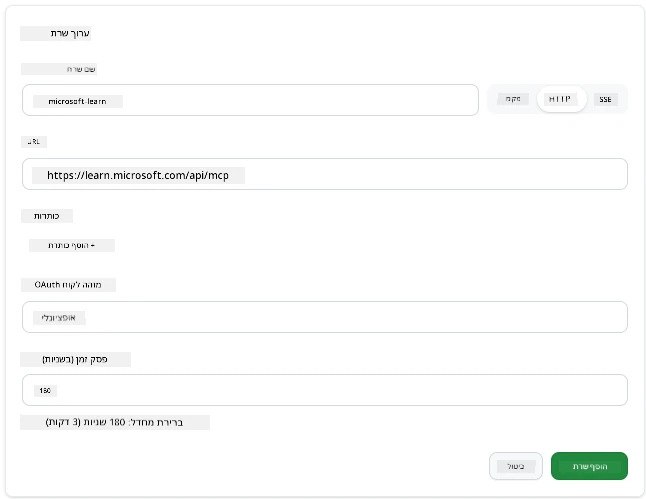
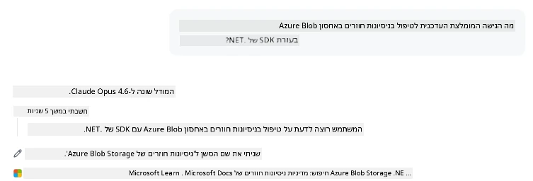
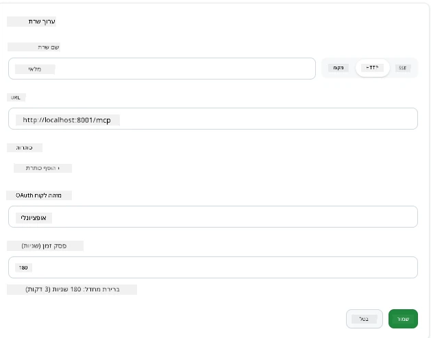
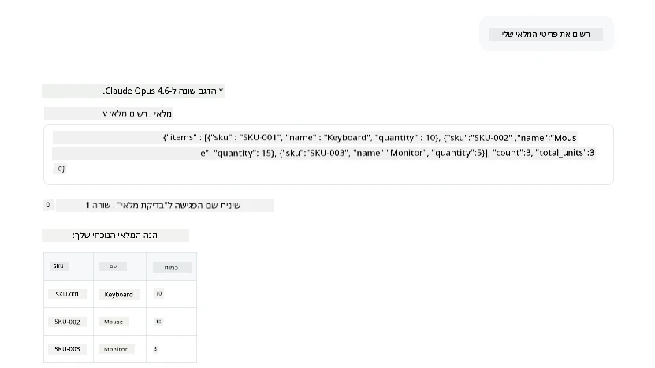
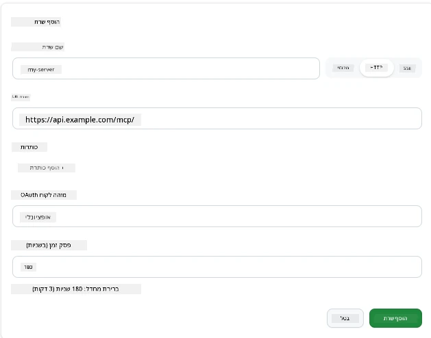
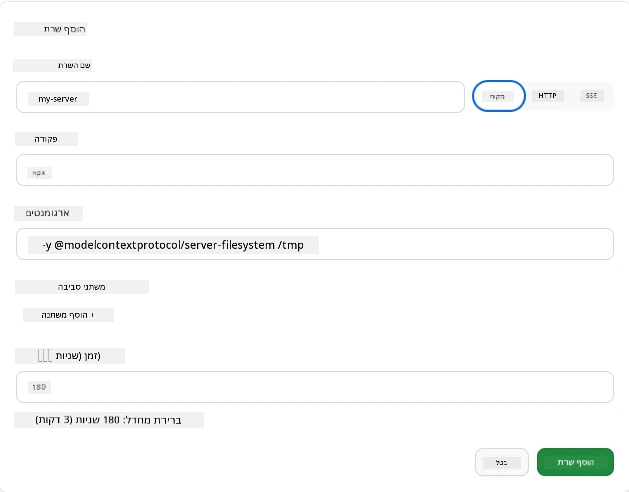

# שימוש בשרתים MCP באפליקציית GitHub Copilot

כבר עכשיו אתם יודעים איך MCP עובד. בניתם שרתים, הגדרתם כלים ומשאבים, וחיברתם לקוחות. מה שעדיין לא עשינו הוא להחליף את הפרספקטיבה: במקום שאתם אלו שבונים את השרת, איך נראה להיות הצד ה*צרכן*—כמשתמש באפליקציה מונעת בינה מלאכותית שתומכת ב-MCP?

[GitHub Copilot App](https://github.com/github/app) היא אפליקציית שולחן עבודה שיכולה להשתמש בשרתי MCP. על ידי חיבור שרתי MCP אליה, אתם משחררים רמה חדשה: Copilot יכול כעת לגשת לתיעוד שלכם, לקרוא ל-API הפנימי שלכם, לשאול את מסד הנתונים שלכם, או לדבר עם כל שירות שעטפתם בשרת. האפליקציה הופכת למארחת; שרתי MCP שלכם הופכים לכלים שלה.

השיעור הזה מוביל אתכם דרך הניסיון הזה מקצה לקצה—ממציאת לוח ההגדרות של MCP ועד חיבור שרת תיעוד אמיתי ואז חיבור אחד מותאם אישית משלכם.

## יעדי הלמידה

בסיום השיעור תוכלו:

- לאתר ולהתמצא בלוח שרתי MCP בהגדרות אפליקציית Copilot.
- לחבר שרת תיעוד מתארח ולהשתמש בו במפגש.
- לרשום שרת מותאם אישית ולאמת ש-Copilot יכול לקרוא לכלים שלו.
- להגדיר כיצד מתקשרים עם שרת על ידי מתן משתני סביבה או כותרות מותאמות (אם HTTP).

## אפליקציית Copilot כמארחת MCP

זו הרעיון הבסיסי: **הסוכנים של Copilot חכמים, אבל הם יודעים רק מה שאתם מספרים להם.** כברירת מחדל, סוכן יכול לקרוא קבצים בסביבת העבודה שלכם ולהריץ פקודות טרמינל, אבל הוא לא יכול לשאול את מסד הנתונים שלכם, להציץ ביומן שלכם, או לקרוא API מותאם בלי עזרה. כאן נכנסים שרתי MCP. הם משמשים כגשרים בין Copilot למערכות שלכם—מאגרי מידע, בקרת גרסאות, APIs, כלי עיצוב—ומעניקים לסוכנים גישה למידע ולפעולות שהם צריכים כדי להשלים עבודה.

נתחיל במציאת ההגדרות האלה לניהול שרתי האפליקציה שלכם.

## שלב 1: מציאת לוח ההגדרות של MCP

פתחו את אפליקציית Copilot ומצאו אייקון גלגל שיניים בתחתית-שמאל ולחצו עליו.


ודאו שאתם בוחרים "MCP Servers" ועכשיו תראו את השרתים שהגדרתם כבר בחלק העליון, שוק של שרתים פופולריים בחלק התחתון, וכפתור "Add Server" בחלק העליון כך:



זה מרכז הבקרה שלכם. אתם מוסיפים, מסירים, מפעילים ומכבים שרתים כאן. שינויים נכנסים לתוקף במפגשים חדשים; אם יש לכם מפגש פתוח, תצטרכו להתחיל אחד חדש לאחר שינוי הרשימה.

## שלב 2: חיבור שרת תיעוד

נעשה משהו שימושי מיידית. שרת Microsoft Docs MCP מעניק ל-Copilot גישה לתיעודים הרשמיים של Microsoft. כולל Azure, .NET, TypeScript ועוד. במקום שהסוכן יתבסס על נתוני האימון שלו (שיש להם תאריך הפסקה), הוא יכול לשלוף תיעוד עדכני בזמן השאילתה.

כך מוסיפים אותו:

1. ברשת השרתים הפופולריים, הקלידו **learn** ובחרו בשרת בשם "Microsoft Learn".

   

   עם לחיצה, ייפתח טופס בו השם, סוג התעבורה וה-URL מלאים מראש, כל שנותר לכם הוא ללחוץ "Add Server".

2. לחצו על "Add Server", זה ייקח כמה שניות להתחבר לשרת.

   

   לאחר ההוספה, הוא יופיע באזור העליון כשרת שהוגדר. ננסה אותו בהמשך.

3. סגרו את החלון ובחרו ב-Quick chat.

4. הקלידו את ההנחיה למטה כדי להפעיל כלי בשרת Microsoft Learn.

   ```text
   What's the current recommended approach for handling Azure Blob Storage 
   retries using the .NET SDK?
   ```

   

רואים איך הוא מתייחס לשרת MCP שהוספנו זה עתה.

## שלב 3: חיבור שרת stdio מותאם אישית

ההגדרות המוצעות נוחות, אבל הכוח האמיתי הוא בחיבור שרתים משלכם. נניח שיצרתם שרת (או שקיבלתם אחד) שמציג את ה-API הפנימי שלכם או את בסיס הידע של החברה. במקרה הזה, נשתמש בשרת MCP שבנינו שמטפל בניהול המלאי של החברה שלנו.

1. לחצו על גלגל השיניים ובחרו שוב "MCP servers".

2. בחרו ב"כפתור Add Server" ואז "+ Add Custom server", וספקו את הערכים הבאים:

   - שם: `Inventory Server`
   - בחרו סוג תעבורה (מימין), **http**

   בחרו "Add Server" והוא יופיע ברשימת השרתים שהגדרתם.

   

4. כדי לבדוק, הריצו הנחיה כמו זו:

    ```
    list inventory
    ```

   

   אתם אמורים כעת לראות רשימת פריטים במלאי החוזרת מהשרת המותאם אישית שלכם.

מצוין, עכשיו יש לכם הבנה טובה כיצד להוסיף שרתי MCP חיצוניים וגם משלכם לאפליקציית Copilot. בהמשך נדבר על טיפול בסודות ומשתני סביבה.

## שלב 4: הגדרות מתקדמות

עד כה ראיתם איך להוסיף שרתי MCP כשאתם רק מספקים שם ו-URL. אבל מה אם השרת שלכם צריך מפתח API או ערך אחר? תלוי בסוג התעבורה, אפשר לספק לו את מה שהוא צריך.

- **תעבורת http או SSE**: כאן אפשר להגדיר כותרות לפי הצורך.

   לאימות, תוכלו לציין כותרת Authorization, לדוגמה. הערך יכול להיות מחרוזת קבועה. אם אתם משתמשים ב-OAuth, אפשר במקום זאת לתת מזהה לקוח OAuth.

   

- **תעבורת stdio**: אפשר להגדיר משתני סביבה.

   כאן ניתן לציין כל כמות של משתני סביבה שאתם צריכים שיעברו לשרת כשאתם מפעילים אותו.

   

## סיכום

אפליקציית Copilot מתייחסת לשרתי MCP כהרחבות בדרגה ראשונה של יכולות הסוכן. ראיתם את המסלול המלא בשיעור זה מהוספת שרתי MCP ועד לשימוש בהם במפגש. כעת אתם יכולים להתחבר לשרתים ציבוריים, API פנימיים, וכלים מותאמים אישית, ומעניקים לסוכנים שלכם את היכולת לגשת למידע ולפעולות שהם צריכים כדי להשלים משימות באופן אוטונומי.

## 📚 מקורות נוספים

### תיעוד רשמי

- [GitHub Copilot App](https://github.com/github/app)
- [MCP Specification](https://modelcontextprotocol.io/specification/2025-03-26) - מפרט פרוטוקול הקשר מודל

### קהילה
- [MCP Community Discord](https://discord.com/invite/ByRwuEEgH4) - שיחות בזמן אמת
- [GitHub Discussions](https://github.com/microsoft/MCP-Server-and-PostgreSQL-Sample-Retail/discussions) - שאלות ותשובות ושיתופים
- [Stack Overflow](https://stackoverflow.com/questions/tagged/model-context-protocol) - שאלות טכניות

---

<!-- CO-OP TRANSLATOR DISCLAIMER START -->
**כתב ויתור**:
מסמך זה תורגם באמצעות שירות תרגום אוטומטי [Co-op Translator](https://github.com/Azure/co-op-translator). למרות שאנו שואפים לדיוק, יש לקחת בחשבון שתרגומים אוטומטיים עלולים להכיל שגיאות או אי-דיוקים. יש להחשיב את המסמך המקורי בשפתו הטבעית כמקור הסמכות. למידע קריטי מומלץ להשתמש בתרגום מקצועי על ידי מתרגם אדם. אנו לא אחראים לכל אי-הבנה או פירוש שגוי הנובע מהשימוש בתרגום זה.
<!-- CO-OP TRANSLATOR DISCLAIMER END -->