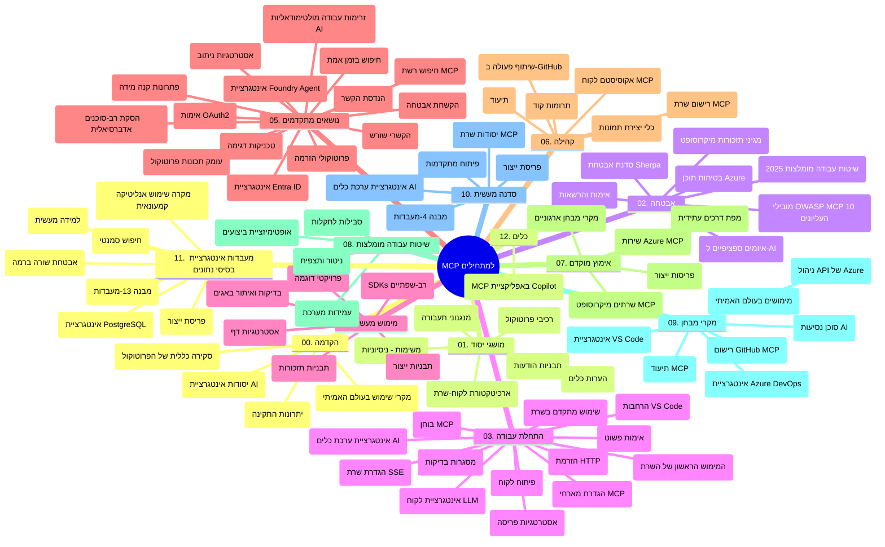

# פרוטוקול הקשר של הדגם (MCP) למתחילים - מדריך לימוד

מדריך הלימוד הזה מספק סקירה כללית של מבנה ותוכן המאגר עבור תכנית הלימודים "פרוטוקול הקשר של הדגם (MCP) למתחילים". השתמש במדריך זה כדי לנווט במאגר ביעילות ולהפיק את המרב מהמשאבים הזמינים.

## סקירת המאגר

פרוטוקול הקשר של הדגם (MCP) הוא מסגרת סטנדרטית לאינטראקציות בין דגמי AI ליישומי לקוח. שנוצר במקור על ידי Anthropic, ה-MCP מנוהל כעת על ידי קהילת MCP הרחבה דרך הארגון הרשמי ב-GitHub. מאגר זה מספק תכנית לימודים מקיפה עם דוגמאות קוד מעשיות ב-C#, Java, JavaScript, Python ו-TypeScript, המיועדת למפתחי AI, אדריכלי מערכות ומהנדסי תוכנה.

## מפת תכנית לימודים ויזואלית

## מבנה המאגר

המאגר מאורגן לתריסר חלקים עיקריים, שכל אחד מתמקד בהיבטים שונים של MCP:

1. **הקדמה (00-Introduction/)**
   - סקירה של פרוטוקול הקשר של הדגם
   - מדוע סטנדרטיזציה חשובה בצינורות AI
   - מקרים לשימוש מעשי ויתרונות

2. **מושגים מרכזיים (01-CoreConcepts/)**
   - ארכיטקטורת לקוח-שרת
   - רכיבי הפרוטוקול העיקריים
   - דפוסי הודעות ב-MCP

3. **אבטחה (02-Security/)**
   - איומי אבטחה במערכות מבוססות MCP
   - שיטות מומלצות לאבטחת יישומים
   - אסטרטגיות אימות והרשאה
   - **תיעוד אבטחה מקיף**:
     - שיטות אבטחה מומלצות ל-MCP 2025
     - מדריך יישום Azure Content Safety
     - בקרות וטכניקות אבטחה ב-MCP
     - הפניה מהירה לשיטות מומלצות ב-MCP
   - **נושאי אבטחה מרכזיים**:
     - התקפות הזרקת פרומפט ורעלת כלי
     - חטיפת סשן ובעיות סבא תמהון (confused deputy)
     - פגיעויות בהעברת טוקנים
     - הרשאות נרחבות ושליטת גישה
     - אבטחת שרשרת אספקה לרכיבי AI
     - שילוב Microsoft Prompt Shields

4. **התחלה מהירה (03-GettingStarted/)**
   - הגדרת סביבה וקונפיגורציה
   - יצירת שרתי MCP ולקוחות בסיסיים
   - אינטגרציה עם יישומים קיימים
   - כולל חלקים עבור:
     - יישום שרת ראשון
     - פיתוח לקוח
     - אינטגרציית לקוח LLM
     - אינטגרציה עם VS Code
     - שרת אירועים שנשלחים מהשרת (SSE)
     - שימוש מתקדם בשרת
     - סטרימינג ב-HTTP
     - אינטגרציה עם AI Toolkit
     - אסטרטגיות בדיקה
     - קווים מנחים לפריסה

5. **יישום מעשי (04-PracticalImplementation/)**
   - שימוש ב-SDK בשפות תכנות שונות
   - ניפוי שגיאות, בדיקות וטכניקות אימות
   - יצירת תבניות פרומפט וזרימות עבודה לריבוי שימושים
   - פרויקטים לדוגמה עם דוגמאות יישום

6. **נושאים מתקדמים (05-AdvancedTopics/)**
   - טכניקות הנדסת הקשר
   - אינטגרציית סוכן Foundry
   - זרימות עבודה רב-מודליות של AI
   - הדגמות אימות OAuth2
   - יכולות חיפוש בזמן אמת
   - סטרימינג בזמן אמת
   - יישום הקשרים שורשיים
   - אסטרטגיות ניתוב
   - טכניקות דגימה
   - גישות לשינוי קנה מידה
   - שיקולי אבטחה
   - אינטגרציית אבטחה ב-Entra ID
   - אינטגרציית חיפוש באינטרנט
   - היגיון רב-סוכן עויין (דפוסי דיבייט)

7. **תרומות קהילה (06-CommunityContributions/)**
   - כיצד לתרום קוד ותיעוד
   - שיתוף פעולה דרך GitHub
   - שיפורים והיזון חוזר מונחים קהילתית
   - שימוש בלקוחות MCP שונים (Claude Desktop, Cline, VSCode)
   - עבודה עם שרתי MCP פופולריים כולל יצירת תמונות

8. **לקחים מאימוץ מוקדם (07-LessonsfromEarlyAdoption/)**
   - יישומים מהעולם האמיתי וסיפור הצלחה
   - בנייה ופריסה של פתרונות מבוססי MCP
   - מגמות ומפת דרכים עתידית
   - **מדריך שרתי Microsoft MCP**: מדריך מקיף ל-10 שרתי Microsoft MCP מוכנים לייצור הכוללים:
     - Microsoft Learn Docs MCP Server
     - Azure MCP Server (15+ מחברים ייעודיים)
     - GitHub MCP Server
     - Azure DevOps MCP Server
     - MarkItDown MCP Server
     - SQL Server MCP Server
     - Playwright MCP Server
     - Dev Box MCP Server
     - Microsoft Foundry MCP Server
     - Microsoft 365 Agents Toolkit MCP Server

9. **שיטות מומלצות (08-BestPractices/)**
   - כיוונון ביצועים ואופטימיזציה
   - תכנון מערכות MCP חסינות לתקלות
   - אסטרטגיות בדיקות וחוסן

10. **מקרי בוחן (09-CaseStudy/)**
    - **שבע מקרי בוחן מקיפים** הממחישים את הגמישות של MCP בתרחישים שונים:
    - **סוכני נסיעות ב-Azure AI**: תיאום רב-סוכני עם Azure OpenAI ו-AI Search
    - **אינטגרציית Azure DevOps**: אוטומציה של תהליכי זרימת עבודה עם עדכוני נתוני YouTube
    - **שליפת תיעוד בזמן אמת**: לקוח קונסול Python עם סטרימינג HTTP
    - **גנרטור תוכנית לימוד אינטראקטיבי**: אפליקציית Chainlit עם AI שיחתי
    - **תיעוד בתוך עורך**: אינטגרציה עם VS Code וזרימות עבודה ב-GitHub Copilot
    - **ניהול API ב-Azure**: אינטגרציית ארגונית עם יצירת שרת MCP
    - **רישום MCP ב-GitHub**: פלטפורמת פיתוח אינטגרציה סוכנית ואקוסיסטם
    - דוגמאות יישום הכוללות אינטגרציה ארגונית, פרודוקטיביות מפתחים ופיתוח אקוסיסטם

11. **סדנת עבודה מעשית (10-StreamliningAIWorkflowsBuildingAnMCPServerWithAIToolkit/)**
    - סדנה מקיפה שמשלבת MCP עם AI Toolkit
    - בניית יישומים אינטליגנטיים שמחברים בין דגמי AI לכלים מהעולם האמיתי
    - מודולים מעשיים המכסים יסודות, פיתוח שרת מותאם ואסטרטגיות פריסת ייצור
    - **מבנה הסדנה**:
      - מעבדה 1: יסודות שרת MCP
      - מעבדה 2: פיתוח שרת MCP מתקדם
      - מעבדה 3: אינטגרציה עם AI Toolkit
      - מעבדה 4: פריסה וסקיילינג בייצור
    - גישת למידה מבוססת מעבדות עם הוראות שלב-אחר-שלב

12. **מעבדות אינטגרציה למסדי נתונים של שרתי MCP (11-MCPServerHandsOnLabs/)**
    - **מסלול למידה מקיף של 13 מעבדות** לבניית שרתי MCP מוכנים לייצור עם אינטגרציית PostgreSQL
    - **יישום אנליטיקה קמעונית מעולם האמיתי** באמצעות מקרה השימוש Zava Retail
    - **דפוסי ארגון ברמת הארגון** הכוללים אבטחה לרמת שורה (RLS), חיפוש סמנטי וגישה לנתונים מרובי שוכרים
    - **מבנה מלא של המעבדות**:
      - **מעבדות 00-03: יסודות** - הקדמה, ארכיטקטורה, אבטחה, הקמת סביבה
      - **מעבדות 04-06: בניית שרת MCP** - עיצוב מסד נתונים, יישום שרת MCP, פיתוח כלים
      - **מעבדות 07-09: תכונות מתקדמות** - חיפוש סמנטי, בדיקות וניפוי שגיאות, אינטגרציה עם VS Code
      - **מעבדות 10-12: ייצור ושיטות מומלצות** - פריסה, ניטור, אופטימיזציה
    - **טכנולוגיות מכוסות**: מסגרת FastMCP, PostgreSQL, Azure OpenAI, Azure Container Apps, Application Insights
    - **תוצאות למידה**: שרתי MCP מוכנים לייצור, דפוסי אינטגרציה למסדי נתונים, אנליטיקה מונעת AI, אבטחה ארגונית

13. **כלי פיתוח (12-tooling/)**
    - למידה על שימוש ב-MCP באפליקציית Copilot וכלים אחרים

## משאבים נוספים

המאגר כולל משאבים תומכים:

- **תיקיית תמונות**: מכילה דיאגרמות ואיור המשמשים לאורך כל התכנית
- **תרגומים**: תמיכה רב-שפתית עם תרגומים אוטומטיים של התיעוד
- **משאבים רשמיים של MCP**:
  - [תיעוד MCP](https://modelcontextprotocol.io/)
  - [מפרט MCP](https://spec.modelcontextprotocol.io/)
  - [מאגר GitHub של MCP](https://github.com/modelcontextprotocol)

## כיצד להשתמש במאגר זה

1. **למידה ברצף**: עקוב אחר הפרקים לפי הסדר (00 עד 11) לחוויית למידה מאורגנת.
2. **מיקוד בשפה ספציפית**: אם אתה מעוניין בשפת תכנות מסוימת, חפש בתיקיות הדוגמאות יישומים בשפה המועדפת עליך.
3. **יישום מעשי**: התחל עם חלק "התחלה מהירה" כדי להגדיר את הסביבה שלך וליצור את שרת ה-MCP והלקוח הראשונים שלך.
4. **חקירה מתקדמת**: לאחר שהתבססת ביסודות, העמק בנושאים המתקדמים להרחבת הידע.
5. **מעורבות קהילתית**: הצטרף לקהילת MCP דרך דיונים ב-GitHub וערוצים ב-Discord כדי להתחבר למומחים ולמפתחים נוספים.

## לקוחות MCP וכלים

תכנית הלימודים מקיפה לקוחות וכלים שונים של MCP:

1. **לקוחות רשמיים**:
   - Visual Studio Code
   - MCP ב-Visual Studio Code
   - Claude Desktop
   - Claude ב-VSCode
   - Claude API

2. **לקוחות קהילתיים**:
   - Cline (ממשק שורת פקודה)
   - Cursor (עורך קוד)
   - ChatMCP
   - Windsurf

3. **כלי ניהול MCP**:
   - MCP CLI
   - MCP Manager
   - MCP Linker
   - MCP Router

## שרתי MCP פופולריים

המאגר מציג שרתי MCP שונים, כולל:

1. **שרתי Microsoft MCP רשמיים**:
   - Microsoft Learn Docs MCP Server
   - Azure MCP Server (15+ מחברים ייעודיים)
   - GitHub MCP Server
   - Azure DevOps MCP Server
   - MarkItDown MCP Server
   - SQL Server MCP Server
   - Playwright MCP Server
   - Dev Box MCP Server
   - Microsoft Foundry MCP Server
   - Microsoft 365 Agents Toolkit MCP Server

2. **שרתי ייחוס רשמיים**:
   - Filesystem
   - Fetch
   - Memory
   - Sequential Thinking

3. **יצירת תמונות**:
   - Azure OpenAI DALL-E 3
   - Stable Diffusion WebUI
   - Replicate

4. **כלי פיתוח**:
   - Git MCP
   - Terminal Control
   - Code Assistant

5. **שרתי התמחות**:
   - Salesforce
   - Microsoft Teams
   - Jira & Confluence

## תרומה

מאגר זה מקבל בברכה תרומות מהקהילה. עיין בחלק תרומות הקהילה לקבלת הנחיות כיצד לתרום ביעילות לאקוסיסטם של MCP.

----

*מדריך לימוד זה עודכן לאחרונה ב-5 בפברואר 2026, ומשקף את מפרט MCP האחרון מ-25 בנובמבר 2025 ומספק סקירה של המאגר עד לתאריך זה. תוכן המאגר עשוי להתעדכן לאחר תאריך זה.*

---

<!-- CO-OP TRANSLATOR DISCLAIMER START -->
**כתב ויתור**:
מסמך זה תורגם באמצעות שירות תרגום אוטומטי [Co-op Translator](https://github.com/Azure/co-op-translator). למרות שאנו שואפים לדיוק, יש לקחת בחשבון שתרגומים אוטומטיים עלולים להכיל שגיאות או אי-דיוקים. יש להחשיב את המסמך המקורי בשפתו הטבעית כמקור הסמכות. למידע קריטי מומלץ להשתמש בתרגום מקצועי על ידי מתרגם אדם. אנו לא אחראים לכל אי-הבנה או פירוש שגוי הנובע מהשימוש בתרגום זה.
<!-- CO-OP TRANSLATOR DISCLAIMER END -->