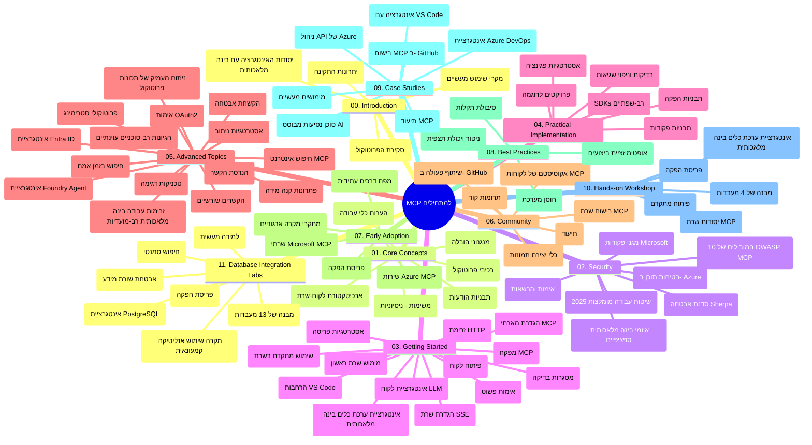

# פרוטוקול הקשר למודל (MCP) למתחילים - מדריך לימוד

מדריך לימוד זה מספק סקירה של מבנה ותוכן המאגר עבור תכנית הלימודים "פרוטוקול הקשר למודל (MCP) למתחילים". השתמש במדריך זה כדי לנווט במאגר בצורה יעילה ולהפיק את המירב מהמשאבים הזמינים.

## סקירת המאגר

פרוטוקול הקשר למודל (MCP) הוא מסגרת סטנדרטית לאינטראקציות בין מודלים של בינה מלאכותית ליישומי לקוח. נוצר תחילה על ידי Anthropic, MCP מנוהל כיום על ידי קהילת MCP הרחבה דרך ארגון GitHub הרשמי. מאגר זה מציע תכנית לימודים מקיפה עם דוגמאות קוד מעשיות ב- C#, Java, JavaScript, Python ו-TypeScript, המיועדת למפתחי AI, ארכיטקטי מערכות ומהנדסי תוכנה.

## מפת תכנית לימודים חזותית

## מבנה המאגר

המאגר מאורגן לאחד עשר חלקים עיקריים, כל אחד מתמקד בהיבטים שונים של MCP:

1. **הקדמה (00-Introduction/)**
   - סקירה של פרוטוקול הקשר למודל
   - למה תקינה חשובה בצנרת AI
   - מקרי שימוש ויתרונות מעשיים

2. **מושגי יסוד (01-CoreConcepts/)**
   - ארכיטקטורת לקוח-שרת
   - רכיבי פרוטוקול מרכזיים
   - דפוסי הודעות ב-MCP

3. **אבטחה (02-Security/)**
   - איומים אבטחתיים במערכות מבוססות MCP
   - שיטות עבודה מומלצות לאבטחת יישומים
   - אסטרטגיות אימות והרשאה
   - **תיעוד מקיף לאבטחה**:
     - שיטות עבודה מומלצות לאבטחת MCP 2025
     - מדריך יישום אבטחת תוכן Azure
     - בקרות וטכניקות אבטחה של MCP
     - התקציר המהיר של שיטות עבודה מומלצות לאבטחה ב-MCP
   - **נושאי אבטחה מרכזיים**:
     - התקפות הזרקת פקודות ורעלים לכלים
     - חטיפת סשנים ובעיות נציג מבולבל
     - נקודות תורפה להעברת אסימונים
     - הרשאות מופרזות ושליטת גישה
     - אבטחת שרשרת אספקה לרכיבי AI
     - אינטגרציה של Microsoft Prompt Shields

4. **התחלה (03-GettingStarted/)**
   - הגדרת סביבה וקונפיגורציה
   - יצירת שרתי ולקוחות MCP בסיסיים
   - אינטגרציה עם יישומים קיימים
   - מכיל קטעים עבור:
     - יישום השרת הראשון
     - פיתוח לקוח
     - אינטגרציית לקוח LLM
     - אינטגרציית VS Code
     - שרת SSE (אירועים נשלחים מהשרת)
     - שימוש מתקדם בשרת
     - סטרימינג HTTP
     - אינטגרציית AI Toolkit
     - אסטרטגיות בדיקה
     - הנחיות פריסה

5. **יישום מעשי (04-PracticalImplementation/)**
   - שימוש ב-SDKs בשפות תכנות שונות
   - טכניקות דיבוג, בדיקה ואימות
   - יצירת תבניות פרומפט וזרימות עבודה שניתנות לשימוש חוזר
   - פרויקטים לדוגמה עם דוגמאות יישום

6. **נושאים מתקדמים (05-AdvancedTopics/)**
   - טכניקות הנדסת הקשר
   - אינטגרציית סוכן Foundry
   - זרימות עבודה רבת-מודל של AI
   - הדגמות אימות OAuth2
   - יכולות חיפוש בזמן אמת
   - סטרימינג בזמן אמת
   - יישום הקשרים שורשיים
   - אסטרטגיות ניתוב
   - טכניקות דגימה
   - גישות סקיילינג
   - שיקולי אבטחה
   - אינטגרציית אבטחה עם Entra ID
   - אינטגרציית חיפוש באינטרנט
   - ניתוח רב-סוכני עויין (דפוסי דיבייט)

7. **תרומות מהקהילה (06-CommunityContributions/)**
   - כיצד לתרום קוד ותיעוד
   - שיתופי פעולה דרך GitHub
   - שיפורים והערות מונחי קהילה
   - שימוש במגוון לקוחות MCP (Claude Desktop, Cline, VSCode)
   - עבודה עם שרתי MCP פופולריים הכוללים יצירת תמונות

8. **לקחים מאימוץ מוקדם (07-LessonsfromEarlyAdoption/)**
   - יישומים מהעולם האמיתי וסיפורי הצלחה
   - בנייה ופריסה של פתרונות מבוססי MCP
   - מגמות ומפת דרכים לעתיד
   - **מדריך שרתי MCP של מיקרוסופט**: מדריך מקיף ל-10 שרתי MCP מיקרוסופט מוכנים לייצור הכולל:
     - שרת Microsoft Learn Docs MCP
     - שרת Azure MCP (15+ מחברים מתמחים)
     - שרת GitHub MCP
     - שרת Azure DevOps MCP
     - שרת MarkItDown MCP
     - שרת SQL Server MCP
     - שרת Playwright MCP
     - שרת Dev Box MCP
     - שרת Microsoft Foundry MCP
     - שרת Microsoft 365 Agents Toolkit MCP

9. **שיטות עבודה מומלצות (08-BestPractices/)**
   - כיוונון ביצועים ואופטימיזציה
   - עיצוב מערכות MCP עמידות לתקלות
   - אסטרטגיות בדיקה וחוסן

10. **מחקרי מקרה (09-CaseStudy/)**
    - **שבעה מחקרי מקרה מקיפים** המדגימים את הרב-גוניות של MCP בתרחישים מגוונים:
    - **סוכני נסיעות AI באzure**: תיאום רב-סוכנים עם Azure OpenAI ו-AI Search
    - **אינטגרציית Azure DevOps**: אוטומציה של תהליכים עם עדכוני מידע מ-YouTube
    - **משיכת מסמכים בזמן אמת**: לקוח קונסול Python עם סטרימינג HTTP
    - **מחולל תוכנית לימודים אינטראקטיבי**: אפליקציית רשת Chainlit עם AI שיחתי
    - **תיעוד בתוך העורך**: אינטגרציית VS Code עם זרימות עבודה של GitHub Copilot
    - **ניהול API של Azure**: אינטגרציית API ארגונית עם יצירת שרת MCP
    - **רישום MCP של GitHub**: פלטפורמת פיתוח ואינטגרציה סוכנית באקוסיסטם
    - דוגמאות יישום המתפרשות על אינטגרציית ארגונים, פרודקטיביות מפתחים ופיתוח אקוסיסטם

11. **סדנת עבודה מעשית (10-StreamliningAIWorkflowsBuildingAnMCPServerWithAIToolkit/)**
    - סדנה מעשית מקיפה המשלבת MCP עם AI Toolkit
    - בניית יישומים חכמים המחברים בין מודלי AI לכלים מהעולם האמיתי
    - מודולים מעשיים המכסים יסודות, פיתוח שרת מותאם ואסטרטגיות פריסת ייצור
    - **מבנה המעבדה**:
      - מעבדה 1: יסודות שרת MCP
      - מעבדה 2: פיתוח שרת MCP מתקדם
      - מעבדה 3: אינטגרציית AI Toolkit
      - מעבדה 4: פריסה וסקיילינג בייצור
    - גישת למידה מבוססת מעבדות עם הוראות שלב-אחר-שלב

12. **מעבדות אינטגרציית מאגרי נתונים לשרת MCP (11-MCPServerHandsOnLabs/)**
    - **מסלול למידה מקיף המכיל 13 מעבדות** לבניית שרתי MCP מוכנים לייצור עם אינטגרציית PostgreSQL
    - **יישום אנליטיקה לקמעונאות מהעולם האמיתי** עם מקרה השימוש של Zava Retail
    - **דפוסים ברמת ארגון** כולל אבטחת רמת שורה (RLS), חיפוש סמנטי וגישה מרובת שוכרים לנתונים
    - **מבנה מעבדות מלא**:
      - **מעבדות 00-03: יסודות** - הקדמה, ארכיטקטורה, אבטחה, הגדרת סביבה
      - **מעבדות 04-06: בניית שרת MCP** - תכנון מאגר נתונים, יישום שרת MCP, פיתוח כלים
      - **מעבדות 07-09: תכונות מתקדמות** - חיפוש סמנטי, בדיקה ודיבוג, אינטגרציית VS Code
      - **מעבדות 10-12: ייצור ושיטות עבודה מומלצות** - פריסה, ניטור, אופטימיזציה
    - **טכנולוגיות נכללות**: מסגרת FastMCP, PostgreSQL, Azure OpenAI, Azure Container Apps, Application Insights
    - **תוצאות למידה**: שרתי MCP מוכנים לייצור, דפוסי אינטגרציה עם מאגרי נתונים, אנליטיקה מבוססת AI, אבטחה ברמת ארגון

## משאבים נוספים

המאגר כולל משאבים תומכים:

- **תיקיית תמונות**: מכילה דיאגרמות ואיורים המשמשים לאורך כל תכנית הלימודים
- **תרגומים**: תמיכה בריבוי שפות עם תרגומים אוטומטיים של התיעוד
- **משאבי MCP רשמיים**:
  - [תיעוד MCP](https://modelcontextprotocol.io/)
  - [מפרט MCP](https://spec.modelcontextprotocol.io/)
  - [מאגר GitHub של MCP](https://github.com/modelcontextprotocol)

## איך להשתמש במאגר זה

1. **למידה סדרתית**: עקוב אחרי הפרקים לפי הסדר (00 עד 11) לחוויית לימוד מאורגנת.
2. **מיקוד בשפה ספציפית**: אם אתה מתעניין בשפת תכנות מסוימת, חקור את תיקיות הדוגמאות עבור יישומים בשפה המועדפת עליך.
3. **יישום מעשי**: התחל עם החלק "התחלה" כדי להגדיר את הסביבה שלך וליצור שרת ולקוח MCP הראשונים שלך.
4. **חקירה מתקדמת**: לאחר שתהיה נוח עם היסודות, התעמק בנושאים המתקדמים כדי להרחיב את הידע שלך.
5. **מעורבות קהילתית**: הצטרף לקהילת MCP דרך הדיונים ב-GitHub וערוצי דיסקורד כדי להתחבר עם מומחים ומפתחים אחרים.

## לקוחות וכלים של MCP

תכנית הלימודים כוללת לקוחות וכלים שונים של MCP:

1. **לקוחות רשמיים**:
   - Visual Studio Code
   - MCP ב-Visual Studio Code
   - Claude Desktop
   - Claude ב-VSCode
   - Claude API

2. **לקוחות קהילתיים**:
   - Cline (בסביבה טקסטואלית)
   - Cursor (עורך קוד)
   - ChatMCP
   - Windsurf

3. **כלי ניהול MCP**:
   - MCP CLI
   - MCP Manager
   - MCP Linker
   - MCP Router

## שרתי MCP פופולריים

המאגר מציג שרתי MCP שונים, כולל:

1. **שרתי MCP רשמיים של מיקרוסופט**:
   - שרת Microsoft Learn Docs MCP
   - שרת Azure MCP (15+ מחברים מתמחים)
   - שרת GitHub MCP
   - שרת Azure DevOps MCP
   - שרת MarkItDown MCP
   - שרת SQL Server MCP
   - שרת Playwright MCP
   - שרת Dev Box MCP
   - שרת Microsoft Foundry MCP
   - שרת Microsoft 365 Agents Toolkit MCP

2. **שרתי הפניה רשמיים**:
   - Filesystem
   - Fetch
   - Memory
   - Sequential Thinking

3. **יצירת תמונות**:
   - Azure OpenAI DALL-E 3
   - Stable Diffusion WebUI
   - Replicate

4. **כלי פיתוח**:
   - Git MCP
   - Terminal Control
   - Code Assistant

5. **שרתי מומחים**:
   - Salesforce
   - Microsoft Teams
   - Jira & Confluence

## תרומה

מאגר זה מקבל בברכה תרומות מהקהילה. ראה את החלק תרומות מהקהילה לקבלת הנחיות כיצד לתרום ביעילות לאקוסיסטם של MCP.

----

*מדריך לימוד זה עודכן לאחרונה ב-5 בפברואר 2026, משקף את מפרט MCP העדכני מ-25 בנובמבר 2025 ומספק סקירה של המאגר נכון לתאריך זה. תוכן המאגר עשוי להתעדכן לאחר תאריך זה.*

---

<!-- CO-OP TRANSLATOR DISCLAIMER START -->
**כתב ויתור**:
מסמך זה תורגם באמצעות שירות תרגום אוטומטי [Co-op Translator](https://github.com/Azure/co-op-translator). למרות שאנו שואפים לדיוק, יש לקחת בחשבון שתרגומים אוטומטיים עלולים להכיל שגיאות או אי-דיוקים. יש להחשיב את המסמך המקורי בשפתו הטבעית כמקור הסמכות. למידע קריטי מומלץ להשתמש בתרגום מקצועי על ידי מתרגם אדם. אנו לא אחראים לכל אי-הבנה או פירוש שגוי הנובע מהשימוש בתרגום זה.
<!-- CO-OP TRANSLATOR DISCLAIMER END -->