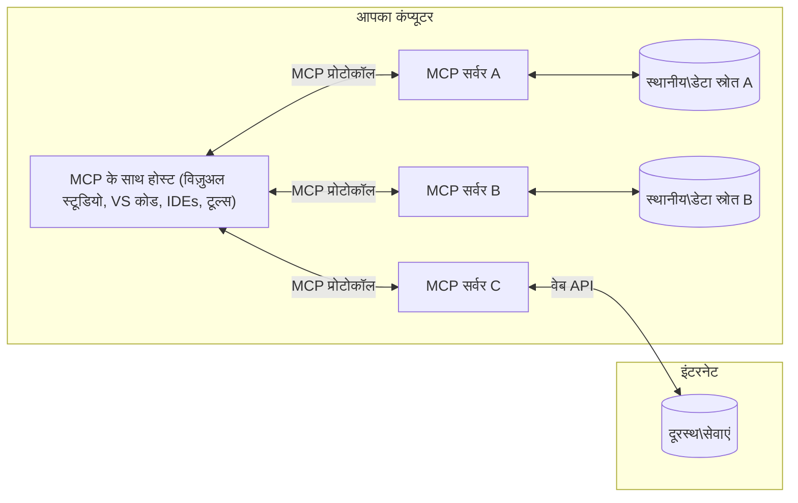

# MCP कोर अवधारणाएं: एआई एकीकरण के लिए मॉडल संदर्भ प्रोटोकॉल में महारत हासिल करना

[](https://youtu.be/earDzWGtE84)

_(इस पाठ का वीडियो देखने के लिए ऊपर की छवि पर क्लिक करें)_

[Model Context Protocol (MCP)](https://github.com/modelcontextprotocol) एक शक्तिशाली, मानकीकृत फ्रेमवर्क है जो बड़े भाषा मॉडल (LLMs) और बाहरी टूल्स, एप्लिकेशन, और डेटा स्रोतों के बीच संचार को अनुकूलित करता है। यह गाइड आपको MCP के मुख्य सिद्धांतों से परिचित कराएगा। आप इसके क्लाइंट-सर्वर आर्किटेक्चर, आवश्यक घटकों, संचार मैकेनिक्स, और कार्यान्वयन सर्वोत्तम प्रथाओं के बारे में सीखेंगे।

- **स्पष्ट उपयोगकर्ता सहमति**: सभी डेटा पहुंच और संचालन के लिए निष्पादन से पहले स्पष्ट उपयोगकर्ता अनुमोदन आवश्यक है। उपयोगकर्ताओं को स्पष्ट रूप से समझना चाहिए कि कौन सा डेटा एक्सेस किया जाएगा और कौन से क्रियाएं की जाएंगी, जिसमें अनुमतियों और प्राधिकरणों पर सूक्ष्म नियंत्रण हो।

- **डेटा गोपनीयता संरक्षण**: उपयोगकर्ता डेटा केवल स्पष्ट सहमति के साथ ही प्रकट किया जाता है और पूरे इंटरैक्शन जीवनचक्र के दौरान मजबूत एक्सेस नियंत्रण द्वारा सुरक्षित रहना चाहिए। कार्यान्वयन अनधिकृत डेटा ट्रांसमिशन को रोकना और कड़े गोपनीयता सीमाओं को बनाए रखना चाहिए।

- **टूल निष्पादन सुरक्षा**: हर टूल इनवोकेशन के लिए उपयोगकर्ता की स्पष्ट सहमति आवश्यक है, जिसमें टूल की कार्यक्षमता, पैरामीटर, और संभावित प्रभाव की स्पष्ट समझ हो। मजबूत सुरक्षा सीमाओं को अनचाहे, असुरक्षित, या दुर्भावनापूर्ण टूल निष्पादन को रोकना चाहिए।

- **ट्रांसपोर्ट लेयर सुरक्षा**: सभी संचार चैनल उचित एन्क्रिप्शन और प्रमाणीकरण तंत्र का उपयोग करें। दूरस्थ कनेक्शन को सुरक्षित ट्रांसपोर्ट प्रोटोकॉल और उचित क्रेडेंशियल प्रबंधन लागू करना चाहिए।

#### कार्यान्वयन मार्गदर्शिकाएँ:

- **अनुमति प्रबंधन**: सूक्ष्म अनुमतियाँ लागू करें जो उपयोगकर्ताओं को नियंत्रित करने की अनुमति दें कि कौन से सर्वर, टूल, और संसाधन सुलभ हैं
- **प्रमाणीकरण एवं प्राधिकरण**: सुरक्षित प्रमाणीकरण विधियों (OAuth, API कुंजी) का उपयोग करें, उचित टोकन प्रबंधन और समाप्ति के साथ  
- **इनपुट मान्यता**: सभी पैरामीटर और डेटा इनपुट को परिभाषित स्कीमाओं के अनुसार मान्य करें ताकि इंजेक्शन हमलों को रोका जा सके
- **ऑडिट लॉगिंग**: सुरक्षा निगरानी और अनुपालन के लिए सभी ऑपरेशनों के व्यापक लॉग बनाए रखें

## अवलोकन

यह पाठ Model Context Protocol (MCP) इकोसिस्टम की बुनियादी वास्तुकला और घटकों का परिचय कराता है। आप क्लाइंट-सर्वर आर्किटेक्चर, मुख्य घटकों, और MCP इंटरैक्शन को संचालित करने वाले संचार तंत्रों के बारे में जानेंगे।

## मुख्य शिक्षण उद्देश्य

इस पाठ के अंत तक, आप:

- MCP क्लाइंट-सर्वर आर्किटेक्चर को समझेंगे।
- होस्ट, क्लाइंट, और सर्वर की भूमिकाओं और जिम्मेदारियों की पहचान करेंगे।
- MCP को एक लचीले एकीकरण स्तर बनाने वाली मुख्य विशेषताओं का विश्लेषण करेंगे।
- MCP इकोसिस्टम के भीतर जानकारी के प्रवाह को जानेंगे।
- .NET, जावा, पाइथन, और जावास्क्रिप्ट में कोड उदाहरणों के माध्यम से व्यावहारिक अंतर्दृष्टि प्राप्त करेंगे।

## MCP आर्किटेक्चर: गहराई से नजर

MCP इकोसिस्टम क्लाइंट-सर्वर मॉडल पर आधारित है। यह मॉड्यूलर संरचना एआई एप्लिकेशन को टूल्स, डेटाबेस, एपीआई, और संदर्भ संसाधनों के साथ कुशलता से इंटरैक्ट करने की अनुमति देती है। आइए इस आर्किटेक्चर को इसके मुख्य घटकों में विभाजित करें।

MCP अपने मूल में एक क्लाइंट-सर्वर आर्किटेक्चर का अनुसरण करता है जहां एक होस्ट एप्लिकेशन कई सर्वरों से कनेक्ट हो सकता है:


- **MCP होस्ट**: VSCode, Claude Desktop, IDEs, या AI टूल्स जैसे प्रोग्राम जो MCP के माध्यम से डेटा एक्सेस करना चाहते हैं
- **MCP क्लाइंट**: प्रोटोकॉल क्लाइंट जो सर्वरों के साथ 1:1 कनेक्शन बनाए रखते हैं
- **MCP सर्वर**: हल्के प्रोग्राम जो प्रत्येक मानकीकृत Model Context Protocol के माध्यम से विशिष्ट क्षमताएं प्रदान करते हैं
- **स्थानीय डेटा स्रोत**: आपके कंप्यूटर की फाइलें, डेटाबेस, और सेवाएं जिन तक MCP सर्वर सुरक्षित रूप से पहुंच सकते हैं
- **रिमोट सेवाएं**: इंटरनेट पर उपलब्ध बाहरी सिस्टम जिनसे MCP सर्वर APIs के जरिए कनेक्ट हो सकते हैं।

MCP प्रोटोकॉल एक विकसित होता मानक है जो दिनांक-आधारित संस्करणीयता (YYYY-MM-DD फॉर्मेट) का उपयोग करता है। वर्तमान प्रोटोकॉल संस्करण **2025-11-25** है। आप नवीनतम अपडेट्स [प्रोटोकॉल विनिर्देशन](https://modelcontextprotocol.io/specification/2025-11-25/) में देख सकते हैं।

### 1. होस्ट्स

Model Context Protocol (MCP) में, **होस्ट्स** AI एप्लिकेशन होते हैं जो उपयोगकर्ताओं को प्रोटोकॉल के साथ इंटरैक्ट करने के लिए प्राथमिक इंटरफ़ेस प्रदान करते हैं। होस्ट कई MCP सर्वरों से कनेक्शन को समन्वयित और प्रबंधित करते हैं प्रत्येक सर्वर कनेक्शन के लिए समर्पित MCP क्लाइंट बनाकर। होस्ट्स के उदाहरण हैं:

- **AI एप्लिकेशन**: Claude Desktop, Visual Studio Code, Claude Code
- **डेवलपमेंट एनवायरनमेंट**: MCP इंटीग्रेशन वाले IDEs और कोड संपादक  
- **कस्टम एप्लिकेशन**: उद्देश्य-निर्मित AI एजेंट और टूल्स

**होस्ट्स** वे एप्लिकेशन हैं जो AI मॉडल इंटरैक्शन्स का समन्वय करते हैं। वे:

- **AI मॉडल्स का संचालन करते हैं**: LLMs के साथ इंटरैक्ट या निष्पादित कर प्रतिक्रियाएं उत्पन्न करते हैं और AI वर्कफ़्लो को समन्वित करते हैं
- **क्लाइंट कनेक्शन प्रबंधित करते हैं**: प्रत्येक MCP सर्वर कनेक्शन के लिए एक MCP क्लाइंट बनाते और बनाए रखते हैं
- **उपयोगकर्ता इंटरफ़ेस नियंत्रित करते हैं**: संवाद प्रवाह, उपयोगकर्ता इंटरैक्शन, और प्रतिक्रिया प्रस्तुति को संभालते हैं  
- **सुरक्षा लागू करते हैं**: अनुमतियों, सुरक्षा प्रतिबंधों, और प्रमाणीकरण को नियंत्रित करते हैं
- **उपयोगकर्ता सहमति संभालते हैं**: डेटा साझा करने और टूल निष्पादन के लिए उपयोगकर्ता अनुमोदन को प्रबंधित करते हैं


### 2. क्लाइंट्स

**क्लाइंट्स** आवश्यक घटक हैं जो होस्ट्स और MCP सर्वरों के बीच समर्पित 1:1 कनेक्शन बनाए रखते हैं। प्रत्येक MCP क्लाइंट को होस्ट द्वारा एक विशिष्ट MCP सर्वर से कनेक्ट करने के लिए बनाया जाता है, जिससे व्यवस्थित और सुरक्षित संचार चैनल सुनिश्चित होते हैं। कई क्लाइंट होस्ट्स को एक साथ कई सर्वरों से जोड़ना सक्षम करते हैं।

**क्लाइंट्स** होस्ट एप्लिकेशन के भीतर कनेक्टर घटक होते हैं। वे:

- **प्रोटोकॉल संचार**: सर्वरों को JSON-RPC 2.0 अनुरोध भेजते हैं जिनमें प्रॉम्प्ट्स और निर्देश होते हैं
- **क्षमता सौदेबाजी**: आरंभ के दौरान समर्थन योग्य फीचर्स और प्रोटोकॉल संस्करणों पर सर्वरों के साथ सहमति करते हैं
- **टूल निष्पादन**: मॉडलों से टूल निष्पादन अनुरोधों का प्रबंधन करते हैं और प्रतिक्रियाओं को संसाधित करते हैं
- **रीयल-टाइम अपडेट्स**: सर्वरों से सूचनाएं और रियल-टाइम अपडेट्स संभालते हैं
- **प्रतिक्रिया प्रसंस्करण**: उपयोगकर्ताओं को प्रदर्शित करने के लिए सर्वर प्रतिक्रियाओं को संसाधित और फॉर्मेट करते हैं

### 3. सर्वर

**सर्वर** वे प्रोग्राम हैं जो MCP क्लाइंट्स को संदर्भ, टूल और क्षमताएं प्रदान करते हैं। ये स्थानीय रूप से (होस्ट के समान मशीन पर) या दूरस्थ रूप से (बाहरी प्लेटफार्मों पर) निष्पादित हो सकते हैं, और क्लाइंट अनुरोधों को संभालने तथा संरचित प्रतिक्रियाएं प्रदान करने के लिए जिम्मेदार हैं। सर्वर मानकीकृत Model Context Protocol के माध्यम से विशिष्ट कार्यक्षमता प्रदान करते हैं।

**सर्वर** सेवाएं हैं जो संदर्भ और क्षमताएं प्रदान करती हैं। वे:

- **फीचर पंजीकरण**: क्लाइंट्स को उपलब्ध प्रिमिटिव्स (संसाधन, प्रॉम्प्ट, टूल) पंजीकृत और प्रस्तुत करते हैं
- **अनुरोध प्रसंस्करण**: टूल कॉल्स, संसाधन अनुरोध, और प्रॉम्प्ट अनुरोध ग्रहण और निष्पादित करते हैं
- **संदर्भ प्रदान करते हैं**: मॉडल प्रतिक्रियाओं को बेहतर बनाने हेतु संदर्भ जानकारी एवं डेटा देते हैं
- **राज्य प्रबंधन**: आवश्यकता होने पर सत्र स्थिति बनाए रखते हैं और राज्यपूर्ण इंटरैक्शन संभालते हैं
- **रियल-टाइम सूचनाएं**: कनेक्टेड क्लाइंट्स को क्षमता परिवर्तनों और अपडेट्स के बारे में सूचनाएं भेजते हैं

सर्वर किसी के द्वारा विकसित किए जा सकते हैं ताकि मॉडल क्षमताओं का विस्तार विशेष कार्यक्षमताओं के साथ किया जा सके, और ये स्थानीय और दूरस्थ दोनों कार्यान्वयन परिदृश्यों का समर्थन करते हैं।

### 4. सर्वर प्रिमिटिव्स

Model Context Protocol (MCP) के सर्वर तीन मुख्य **प्रिमिटिव्स** प्रदान करते हैं जो क्लाइंट्स, होस्ट्स, और भाषा मॉडलों के बीच समृद्ध इंटरैक्शन के बुनियादी निर्माण खंडों को परिभाषित करते हैं। ये प्रिमिटिव्स प्रोटोकॉल के माध्यम से उपलब्ध संदर्भीय जानकारी और क्रियाओं के प्रकार निर्दिष्ट करते हैं।

MCP सर्वर निम्नलिखित तीन मुख्य प्रिमिटिव्स के किसी भी संयोजन को प्रस्तुत कर सकते हैं:

#### संसाधन (Resources)

**संसाधन** डेटा स्रोत होते हैं जो AI एप्लिकेशन को संदर्भीय जानकारी प्रदान करते हैं। वे स्थिर या गतिशील सामग्री का प्रतिनिधित्व करते हैं जो मॉडल की समझ और निर्णय लेने को बढ़ा सकते हैं:

- **संदर्भीय डेटा**: AI मॉडल उपभोग के लिए संरचित जानकारी और संदर्भ
- **ज्ञान आधार**: दस्तावेज़ भंडार, लेख, मैनुअल, और शोध पेपर
- **स्थानीय डेटा स्रोत**: फाइलें, डेटाबेस, और स्थानीय सिस्टम जानकारी  
- **बाहरी डेटा**: API प्रतिक्रियाएं, वेब सेवाएं, और दूरस्थ सिस्टम डेटा
- **गतिशील सामग्री**: बाहरी परिस्थितियों के अनुसार अपडेट होने वाला वास्तविक समय डेटा

संसाधनों को URI द्वारा पहचाना जाता है और इन्हें `resources/list` के माध्यम से खोजा और `resources/read` विधि से निकाला जा सकता है:

```text
file://documents/project-spec.md
database://production/users/schema
api://weather/current
```

#### प्रॉम्प्ट्स (Prompts)

**प्रॉम्प्ट्स** पुन: उपयोग योग्य टेम्प्लेट होते हैं जो भाषा मॉडलों के साथ इंटरैक्शन संरचित करने में मदद करते हैं। वे मानकीकृत इंटरैक्शन पैटर्न और टेम्प्लेटेड वर्कफ़्लोज़ प्रदान करते हैं:

- **टेम्प्लेट-आधारित इंटरैक्शन**: पूर्व-संरचित संदेश और संवाद आरंभकर्ता
- **वर्कफ़्लो टेम्प्लेट**: सामान्य कार्यों और इंटरैक्शन के मानकीकृत अनुक्रम
- **फ्यू-शॉट उदाहरण**: मॉडल निर्देश के लिए उदाहरण-आधारित टेम्प्लेट
- **सिस्टम प्रॉम्प्ट्स**: मूलभूत प्रॉम्प्ट जो मॉडल के व्यवहार और संदर्भ को परिभाषित करते हैं
- **गतिशील टेम्प्लेट**: पैरामीटरयुक्त प्रॉम्प्ट जो विशिष्ट संदर्भों के अनुरूप समायोजित होते हैं

प्रॉम्प्ट्स परिवर्तनीय प्रतिस्थापन का समर्थन करते हैं और इन्हें `prompts/list` से खोजा और `prompts/get` द्वारा प्राप्त किया जा सकता है:

```markdown
Generate a {{task_type}} for {{product}} targeting {{audience}} with the following requirements: {{requirements}}
```

#### टूल्स (Tools)

**टूल्स** निष्पादन योग्य फ़ंक्शन हैं जिन्हें AI मॉडल विशिष्ट क्रियाओं को करने के लिए इनवोक कर सकते हैं। ये MCP इकोसिस्टम के "क्रियाएं" हैं, जो मॉडलों को बाहरी प्रणालियों के साथ इंटरैक्ट करने में सक्षम बनाते हैं:

- **निष्पादन योग्य फ़ंक्शन**: पृथक संचालन जिन्हें मॉडल विशिष्ट पैरामीटर के साथ इनवोक कर सकते हैं
- **बाहरी सिस्टम एकीकरण**: API कॉल्स, डेटाबेस क्वेरीज, फ़ाइल संचालन, गणनाएँ
- **अद्वितीय पहचान**: प्रत्येक टूल का एक अलग नाम, वर्णन, और पैरामीटर स्कीमा होता है
- **संरचित इनपुट/आउटपुट**: टूल मान्यीकृत पैरामीटर स्वीकार करते हैं और संरचित, टाइप्ड प्रतिक्रियाएं लौटाते हैं
- **कार्रवाई क्षमताएं**: मॉडल को वास्तविक विश्व क्रियाएं करने और लाइव डेटा पुनः प्राप्त करने में सक्षम बनाते हैं

टूल्स JSON स्कीमा के साथ पैरामीटर मान्यता के लिए परिभाषित होते हैं और `tools/list` के माध्यम से खोजे जाते हैं तथा `tools/call` के माध्यम से निष्पादित किए जाते हैं। टूल्स बेहतर UI प्रस्तुति के लिए **आइकॉन्स** को अतिरिक्त मेटाडेटा के रूप में भी शामिल कर सकते हैं।

**टूल एनोटेशन**: टूल्स बिहेवियरल एनोटेशन का समर्थन करते हैं (जैसे, `readOnlyHint`, `destructiveHint`) जो बताते हैं कि टूल केवल पढ़ने योग्य है या विनाशकारी है, जिससे क्लाइंट्स को टूल निष्पादन के बारे में सूचित निर्णय लेने में मदद मिलती है।

उदाहरण टूल परिभाषा:

```typescript
server.tool(
  "search_products", 
  {
    query: z.string().describe("Search query for products"),
    category: z.string().optional().describe("Product category filter"),
    max_results: z.number().default(10).describe("Maximum results to return")
  }, 
  async (params) => {
    // खोज निष्पादित करें और संरचित परिणाम लौटाएं
    return await productService.search(params);
  }
);
```

## क्लाइंट प्रिमिटिव्स

Model Context Protocol (MCP) में, **क्लाइंट्स** ऐसे प्रिमिटिव्स प्रस्तुत कर सकते हैं जो सर्वरों को होस्ट एप्लिकेशन से अतिरिक्त क्षमताओं का अनुरोध करने में सक्षम बनाते हैं। ये क्लाइंट-साइड प्रिमिटिव्स अधिक समृद्ध, इंटरैक्टिव सर्वर कार्यान्वयन संभव बनाते हैं जो AI मॉडल क्षमताओं और उपयोगकर्ता इंटरैक्शन को एक्सेस कर सकते हैं।

### सैंपलिंग (Sampling)

**सैंपलिंग** सर्वरों को क्लाइंट के AI एप्लिकेशन से भाषा मॉडल पूर्णताओं का अनुरोध करने की अनुमति देता है। यह प्रिमिटिव सर्वरों को बिना अपने स्वयं के मॉडल निर्भरता सम्मिलित किए LLM क्षमताओं तक पहुंचने में सक्षम बनाता है:

- **मॉडल-स्वतंत्र पहुंच**: सर्वर पूर्णताएं अनुरोध कर सकते हैं बिना LLM SDKs शामिल किए या मॉडल एक्सेस प्रबंधन के
- **सर्वर प्रारंभित AI**: सर्वरों को क्लाइंट के AI मॉडल का उपयोग करके स्वायत्त रूप से सामग्री उत्पन्न करने में सक्षम बनाता है
- **पुनरावर्ती LLM इंटरैक्शन**: जटिल परिदृश्यों का समर्थन करता है जहाँ सर्वरों को प्रसंस्करण के लिए AI सहायता चाहिए
- **गतिशील सामग्री निर्माण**: सर्वरों को होस्ट के मॉडल का उपयोग करके संदर्भीय प्रतिक्रियाएं बनाने की अनुमति देता है
- **टूल कॉलिंग समर्थन**: सर्वर `tools` और `toolChoice` पैरामीटर शामिल कर सकते हैं ताकि क्लाइंट का मॉडल सैंपलिंग के दौरान टूल्स को इनवोक कर सके

सैंपलिंग को `sampling/complete` विधि के माध्यम से आरंभ किया जाता है, जहां सर्वर क्लाइंट को पूर्णता अनुरोध भेजते हैं।

### रूट्स (Roots)

**रूट्स** सर्वरों को फ़ाइल सिस्टम सीमाओं को क्लाइंट्स द्वारा उजागर करने का मानकीकृत तरीका प्रदान करते हैं, जिससे सर्वर समझ पाते हैं कि उन्हें किन डायरेक्टरियों और फाइलों तक पहुंच प्राप्त है:

- **फ़ाइल सिस्टम सीमाएं**: उस सीमा को परिभाषित करते हैं जहाँ सर्वर फ़ाइल सिस्टम के भीतर ऑपरेट कर सकते हैं
- **पहुँच नियंत्रण**: सर्वर को समझने में मदद करते हैं कि उन्हें किन डायरेक्टरियों और फाइलों की पहुंच अनुमति है
- **गतिशील अपडेट्स**: क्लाइंट सर्वरों को तब सूचित कर सकते हैं जब रूट्स की सूची बदलती है
- **URI-आधारित पहचान**: रूट्स `file://` URI का उपयोग कर सुलभ डायरेक्टरीज और फाइलें पहचानते हैं

रूट्स को `roots/list` विधि के माध्यम से खोजा जाता है, और क्लाइंट `notifications/roots/list_changed` भेजते हैं जब रूट्स बदलते हैं।

### elicitation (सूचना एकत्रीकरण)

**elicitation** सर्वरों को क्लाइंट इंटरफ़ेस के माध्यम से उपयोगकर्ताओं से अतिरिक्त जानकारी या पुष्टि का अनुरोध करने में सक्षम बनाता है:

- **उपयोगकर्ता इनपुट अनुरोध**: सर्वर तब अतिरिक्त जानकारी मांग सकते हैं जब टूल निष्पादन के लिए आवश्यकता हो
- **पुष्टि संवाद**: संवेदनशील या प्रभावशाली संचालन के लिए उपयोगकर्ता अनुमोदन का अनुरोध
- **इंटरैक्टिव वर्कफ़्लोज**: सर्वरों को चरण-दर-चरण उपयोगकर्ता इंटरैक्शन बनाने के सक्षम बनाता है
- **गतिशील पैरामीटर संग्रह**: टूल निष्पादन के दौरान लापता या वैकल्पिक पैरामीटर एकत्रित करें

elicitation अनुरोध `elicitation/request` विधि का उपयोग करके भेजे जाते हैं ताकि क्लाइंट इंटरफ़ेस के माध्यम से उपयोगकर्ता इनपुट एकत्रित किया जा सके।

**URL मोड elicitation**: सर्वर URL-आधारित उपयोगकर्ता इंटरैक्शन का अनुरोध भी कर सकते हैं, जिससे सर्वर उपयोगकर्ताओं को प्रमाणीकरण, पुष्टि, या डेटा प्रविष्टि के लिए बाहरी वेब पेज पर निर्देशित कर सकते हैं।

### लॉगिंग (Logging)

**लॉगिंग** सर्वरों को क्लाइंट्स को डिबगिंग, निगरानी, और संचालन दृश्यता के लिए संरचित लॉग संदेश भेजने की अनुमति देता है:

- **डिबगिंग समर्थन**: सर्वरों को समस्याओं के समाधान के लिए विस्तृत निष्पादन लॉग प्रदान करने में सक्षम बनाता है
- **संचालन निगरानी**: क्लाइंट्स को स्टेटस अपडेट और प्रदर्शन मीट्रिक्स भेजता है
- **त्रुटि रिपोर्टिंग**: विस्तृत त्रुटि संदर्भ और निदान जानकारी प्रदान करता है
- **ऑडिट ट्रेल्स**: सर्वर ऑपरेशनों और निर्णयों के व्यापक लॉग बनाता है

लॉगिंग संदेश क्लाइंट्स को भेजे जाते हैं ताकि सर्वर ऑपरेशनों में पारदर्शिता प्रदान की जा सके और डिबगिंग में सहायता मिले।

## MCP में सूचना प्रवाह

Model Context Protocol (MCP) होस्ट्स, क्लाइंट्स, सर्वर, और मॉडलों के बीच सूचना के संरचित प्रवाह को परिभाषित करता है। इस प्रवाह को समझने से यह स्पष्ट होता है कि उपयोगकर्ता अनुरोध कैसे संसाधित होते हैं और बाहरी टूल्स और डेटा मॉडल प्रतिक्रियाओं में कैसे एकीकृत होते हैं।
- **होस्ट कनेक्शन शुरू करता है**  
  होस्ट एप्लिकेशन (जैसे एक IDE या चैट इंटरफेस) आमतौर पर STDIO, WebSocket, या अन्य समर्थित ट्रांसपोर्ट के माध्यम से MCP सर्वर से कनेक्शन स्थापित करता है।

- **क्षमता वार्ता**  
  क्लाइंट (जो होस्ट में एम्बेडेड होता है) और सर्वर अपने समर्थित फीचर्स, टूल्स, संसाधनों, और प्रोटोकॉल वर्शन के बारे में जानकारी का आदान-प्रदान करते हैं। इससे दोनों पक्ष यह समझ पाते हैं कि सेशन के लिए कौन-कौन सी क्षमताएं उपलब्ध हैं।

- **उपयोगकर्ता अनुरोध**  
  उपयोगकर्ता होस्ट के साथ इंटरैक्ट करता है (जैसे कोई प्रांप्ट या कमांड दर्ज करता है)। होस्ट इस इनपुट को इकट्ठा करता है और इसे प्रोसेसिंग के लिए क्लाइंट को देता है।

- **संसाधन या टूल का उपयोग**  
  - क्लाइंट सर्वर से अतिरिक्त संदर्भ या संसाधन (जैसे फाइलें, डेटाबेस रिकॉर्ड, या ज्ञान आधार लेख) प्राप्त करने का अनुरोध कर सकता है ताकि मॉडल की समझ को समृद्ध किया जा सके।  
  - यदि मॉडल निर्णय लेता है कि किसी टूल की आवश्यकता है (जैसे डेटा प्राप्त करने के लिए, गणना करने के लिए, या API कॉल करने के लिए), क्लाइंट सर्वर को टूल इनवोकेशन अनुरोध भेजता है, जिसमें टूल का नाम और पैरामीटर निर्दिष्ट होते हैं।

- **सर्वर निष्पादन**  
  सर्वर संसाधन या टूल अनुरोध प्राप्त करता है, आवश्यक ऑपरेशंस करता है (जैसे फ़ंक्शन चलाना, डेटाबेस क्वेरी, या फाइल पुनःप्राप्त करना), और परिणाम को संरचित फॉर्मेट में क्लाइंट को वापस भेजता है।

- **प्रतिक्रिया निर्माण**  
  क्लाइंट सर्वर की प्रतिक्रियाओं (संसाधन डेटा, टूल आउटपुट आदि) को मॉडल इंटरैक्शन में जोड़ता है। मॉडल इस जानकारी का उपयोग करते हुए व्यापक और सन्दर्भ-उपयुक्त प्रतिक्रिया तैयार करता है।

- **परिणाम प्रस्तुति**  
  होस्ट क्लाइंट से अंतिम आउटपुट प्राप्त करता है और उपयोगकर्ता को प्रस्तुत करता है, जिसमें अक्सर मॉडल द्वारा उत्पन्न टेक्स्ट और टूल निष्पादन या संसाधन खोज के परिणाम शामिल होते हैं।

यह प्रवाह MCP को उन्नत, इंटरैक्टिव, और सन्दर्भ-जागरूक AI एप्लिकेशन का समर्थन करने में सक्षम बनाता है, जो मॉडल्स को बाहरी टूल्स और डेटा स्रोतों से सहजता से जोड़ता है।

## प्रोटोकॉल वास्तुकला और परतें

MCP दो अलग-अलग वास्तुशिल्पीय परतों से बना है जो मिलकर पूर्ण संचार ढांचा प्रदान करती हैं:

### डेटा परत

**डेटा परत** कोर MCP प्रोटोकॉल को **JSON-RPC 2.0** पर आधारित रूप में लागू करती है। यह परत संदेश संरचना, अर्थशास्त्र, और इंटरैक्शन पैटर्न को परिभाषित करती है:

#### मुख्य घटक:

- **JSON-RPC 2.0 प्रोटोकॉल**: सभी संचार मानकीकृत JSON-RPC 2.0 संदेश प्रारूप में होता है, जिसमें मेथड कॉल, प्रतिक्रियाएँ, और सूचनाएं शामिल हैं  
- **लाइफसायकल प्रबंधन**: क्लाइंट और सर्वर के बीच कनेक्शन प्रारंभ, क्षमता वार्ता, और सत्र समाप्ति को संभालता है  
- **सर्वर प्रिमिटिव्स**: टूल्स, संसाधनों, और प्रॉम्प्ट्स के माध्यम से कोर कार्यक्षमता प्रदान करने में सक्षम बनाता है  
- **क्लाइंट प्रिमिटिव्स**: सर्वरों को LLMs से सैंपलिंग अनुरोध करने, उपयोगकर्ता इनपुट प्राप्त करने, और लॉग संदेश भेजने की अनुमति देता है  
- **रीयल-टाइम सूचनाएं**: बिना पोलिंग के डायनेमिक अपडेट के लिए असिंक्रोनस सूचनाओं का समर्थन करता है

#### मुख्य विशेषताएँ:

- **प्रोटोकॉल संस्करण वार्ता**: संगतता सुनिश्चित करने के लिए तिथि-आधारित संस्करणन (YYYY-MM-DD) का उपयोग करता है  
- **क्षमता खोज**: क्लाइंट और सर्वर शुरूआत के दौरान समर्थित फीचर जानकारी का आदान-प्रदान करते हैं  
- **स्टेटफुल सेशन्स**: कई इंटरैक्शन में संदर्भ निरंतरता के लिए कनेक्शन की स्थिति बनाए रखता है

### ट्रांसपोर्ट लेयर

**ट्रांसपोर्ट लेयर** MCP प्रतिभागियों के बीच संचार चैनल, संदेश फ्रेमिंग, और प्रमाणीकरण को प्रबंधित करता है:

#### समर्थित ट्रांसपोर्ट मेकेनिज्म:

1. **STDIO ट्रांसपोर्ट**:  
   - प्रत्यक्ष प्रक्रिया संचार के लिए मानक इनपुट/आउटपुट स्ट्रीम्स का उपयोग करता है  
   - एक ही मशीन पर स्थानीय प्रक्रियाओं के लिए सर्वोत्तम, बिना नेटवर्क ओवरहेड के  
   - स्थानीय MCP सर्वर कार्यान्वयन के लिए आमतौर पर उपयोग किया जाता है

2. **स्ट्रिमेबल HTTP ट्रांसपोर्ट**:  
   - HTTP POST का उपयोग करता है क्लाइंट-से-सर्वर संदेशों के लिए  
   - वैकल्पिक सर्वर-सेंट इवेंट्स (SSE) का उपयोग करता है सर्वर-से-क्लाइंट स्ट्रीमिंग के लिए  
   - नेटवर्क के पार दूरस्थ सर्वर संचार सक्षम करता है  
   - मानक HTTP प्रमाणीकरण (बीयरर टोकन, API कुंजी, कस्टम हेडर) का समर्थन करता है  
   - MCP सुरक्षित टोकन आधारित प्रमाणीकरण के लिए OAuth की सिफारिश करता है

#### ट्रांसपोर्ट अमूर्तन:

ट्रांसपोर्ट लेयर डेटा लेयर से संचार के विवरणों को अलग करता है, जिससे सभी ट्रांसपोर्ट मेकेनिज्म में समान JSON-RPC 2.0 संदेश प्रारूप का उपयोग संभव होता है। यह अमूर्तन एप्लिकेशन को स्थानीय और दूरस्थ सर्वरों के बीच सहजता से स्विच करने की अनुमति देता है।

### सुरक्षा विचार

MCP कार्यान्वयन को कई महत्वपूर्ण सुरक्षा सिद्धांतों का पालन करना चाहिए ताकि सभी प्रोटोकॉल संचालन में सुरक्षित, भरोसेमंद, और सुरक्षात्मक इंटरैक्शन सुनिश्चित हो सकें:

- **उपयोगकर्ता सहमति और नियंत्रण**: किसी भी डेटा एक्सेस या ऑपरेशंस से पहले उपयोगकर्ताओं की स्पष्ट सहमति आवश्यक है। उन्हें यह नियंत्रण स्पष्ट रूप से होना चाहिए कि कौन-सा डेटा साझा किया जा रहा है और कौन-से क्रियाएं अधिकृत हैं, जिसके लिए सहज उपयोगकर्ता इंटरफेस उपलब्ध हों।  
- **डेटा गोपनीयता**: उपयोगकर्ता डेटा केवल स्पष्ट सहमति के साथ ही उजागर किया जाना चाहिए और उपयुक्त एक्सेस नियंत्रणों द्वारा संरक्षित रखना चाहिए। MCP कार्यान्वयन अनधिकृत डेटा ट्रांसमिशन से बचाव करेंगे और सभी इंटरैक्शन में गोपनीयता बनाए रखेंगे।  
- **टूल सुरक्षा**: किसी भी टूल को इनवोक करने से पहले उपयोगकर्ता की स्पष्ट सहमति आवश्यक है। उपयोगकर्ताओं को प्रत्येक टूल के कार्यों की स्पष्ट समझ होनी चाहिए, और अनचाही या असुरक्षित टूल निष्पादन से बचाने के लिए मजबूत सुरक्षा सीमाएं लागू करनी चाहिए।

इन सुरक्षा सिद्धांतों का पालन करके, MCP उपयोगकर्ता विश्वास, गोपनीयता, और सुरक्षा को सभी प्रोटोकॉल इंटरैक्शन में बनाए रखता है, साथ ही शक्तिशाली AI इंटीग्रेशन सक्षम करता है।

## कोड उदाहरण: मुख्य घटक

नीचे दिए गए कोड उदाहरण विभिन्न लोकप्रिय प्रोग्रामिंग भाषाओं में प्रमुख MCP सर्वर घटकों और टूल्स को लागू करने का तरीका दर्शाते हैं।

### .NET उदाहरण: साधारण MCP सर्वर टूल्स के साथ बनाना

यहां एक व्यावहारिक .NET कोड उदाहरण है जो कस्टम टूल्स के साथ सरल MCP सर्वर बनाने का तरीका दिखाता है। यह टूल्स को परिभाषित और रजिस्टर करना, अनुरोधों को संभालना, और Model Context Protocol के माध्यम से सर्वर से कनेक्ट करना दिखाता है।

```csharp
using System;
using System.Threading.Tasks;
using ModelContextProtocol.Server;
using ModelContextProtocol.Server.Transport;
using ModelContextProtocol.Server.Tools;

public class WeatherServer
{
    public static async Task Main(string[] args)
    {
        // Create an MCP server
        var server = new McpServer(
            name: "Weather MCP Server",
            version: "1.0.0"
        );
        
        // Register our custom weather tool
        server.AddTool<string, WeatherData>("weatherTool", 
            description: "Gets current weather for a location",
            execute: async (location) => {
                // Call weather API (simplified)
                var weatherData = await GetWeatherDataAsync(location);
                return weatherData;
            });
        
        // Connect the server using stdio transport
        var transport = new StdioServerTransport();
        await server.ConnectAsync(transport);
        
        Console.WriteLine("Weather MCP Server started");
        
        // Keep the server running until process is terminated
        await Task.Delay(-1);
    }
    
    private static async Task<WeatherData> GetWeatherDataAsync(string location)
    {
        // This would normally call a weather API
        // Simplified for demonstration
        await Task.Delay(100); // Simulate API call
        return new WeatherData { 
            Temperature = 72.5,
            Conditions = "Sunny",
            Location = location
        };
    }
}

public class WeatherData
{
    public double Temperature { get; set; }
    public string Conditions { get; set; }
    public string Location { get; set; }
}
```
  
### Java उदाहरण: MCP सर्वर घटक

यह उदाहरण ऊपर दिए गए .NET उदाहरण के समान MCP सर्वर और टूल पंजीकरण को दर्शाता है, लेकिन इसे Java में लागू किया गया है।

```java
import io.modelcontextprotocol.server.McpServer;
import io.modelcontextprotocol.server.McpToolDefinition;
import io.modelcontextprotocol.server.transport.StdioServerTransport;
import io.modelcontextprotocol.server.tool.ToolExecutionContext;
import io.modelcontextprotocol.server.tool.ToolResponse;

public class WeatherMcpServer {
    public static void main(String[] args) throws Exception {
        // एक MCP सर्वर बनाएं
        McpServer server = McpServer.builder()
            .name("Weather MCP Server")
            .version("1.0.0")
            .build();
            
        // एक मौसम उपकरण पंजीकृत करें
        server.registerTool(McpToolDefinition.builder("weatherTool")
            .description("Gets current weather for a location")
            .parameter("location", String.class)
            .execute((ToolExecutionContext ctx) -> {
                String location = ctx.getParameter("location", String.class);
                
                // मौसम डेटा प्राप्त करें (सरलीकृत)
                WeatherData data = getWeatherData(location);
                
                // स्वरूपित प्रतिक्रिया लौटाएं
                return ToolResponse.content(
                    String.format("Temperature: %.1f°F, Conditions: %s, Location: %s", 
                    data.getTemperature(), 
                    data.getConditions(), 
                    data.getLocation())
                );
            })
            .build());
        
        // stdio ट्रांसपोर्ट का उपयोग करके सर्वर से कनेक्ट करें
        try (StdioServerTransport transport = new StdioServerTransport()) {
            server.connect(transport);
            System.out.println("Weather MCP Server started");
            // प्रक्रिया समाप्त होने तक सर्वर को चलाए रखें
            Thread.currentThread().join();
        }
    }
    
    private static WeatherData getWeatherData(String location) {
        // कार्यान्वयन एक मौसम API को कॉल करेगा
        // उदाहरण के उद्देश्य से सरलीकृत
        return new WeatherData(72.5, "Sunny", location);
    }
}

class WeatherData {
    private double temperature;
    private String conditions;
    private String location;
    
    public WeatherData(double temperature, String conditions, String location) {
        this.temperature = temperature;
        this.conditions = conditions;
        this.location = location;
    }
    
    public double getTemperature() {
        return temperature;
    }
    
    public String getConditions() {
        return conditions;
    }
    
    public String getLocation() {
        return location;
    }
}
```
  
### Python उदाहरण: MCP सर्वर बनाना

यह उदाहरण fastmcp का उपयोग करता है, इसलिए कृपया पहले इसे इंस्टॉल करें:  

```python
pip install fastmcp
```
Code Sample:

```python
#!/usr/bin/env python3
import asyncio
from fastmcp import FastMCP
from fastmcp.transports.stdio import serve_stdio

# एक FastMCP सर्वर बनाएं
mcp = FastMCP(
    name="Weather MCP Server",
    version="1.0.0"
)

@mcp.tool()
def get_weather(location: str) -> dict:
    """Gets current weather for a location."""
    return {
        "temperature": 72.5,
        "conditions": "Sunny",
        "location": location
    }

# एक क्लास का उपयोग करके वैकल्पिक तरीका
class WeatherTools:
    @mcp.tool()
    def forecast(self, location: str, days: int = 1) -> dict:
        """Gets weather forecast for a location for the specified number of days."""
        return {
            "location": location,
            "forecast": [
                {"day": i+1, "temperature": 70 + i, "conditions": "Partly Cloudy"}
                for i in range(days)
            ]
        }

# क्लास टूल्स को रजिस्टर करें
weather_tools = WeatherTools()

# सर्वर शुरू करें
if __name__ == "__main__":
    asyncio.run(serve_stdio(mcp))
```
  
### JavaScript उदाहरण: MCP सर्वर बनाना

यह उदाहरण JavaScript में MCP सर्वर निर्माण दिखाता है और दो मौसम संबंधी टूल्स को पंजीकृत करता है।

```javascript
// आधिकारिक मॉडल संदर्भ प्रोटोकॉल SDK का उपयोग करना
import { McpServer } from "@modelcontextprotocol/sdk/server/mcp.js";
import { StdioServerTransport } from "@modelcontextprotocol/sdk/server/stdio.js";
import { z } from "zod"; // पैरामीटर सत्यापन के लिए

// एक MCP सर्वर बनाएं
const server = new McpServer({
  name: "Weather MCP Server",
  version: "1.0.0"
});

// एक मौसम उपकरण परिभाषित करें
server.tool(
  "weatherTool",
  {
    location: z.string().describe("The location to get weather for")
  },
  async ({ location }) => {
    // यह सामान्यतः एक मौसम API को कॉल करता है
    // प्रदर्शन के लिए सरलीकृत
    const weatherData = await getWeatherData(location);
    
    return {
      content: [
        { 
          type: "text", 
          text: `Temperature: ${weatherData.temperature}°F, Conditions: ${weatherData.conditions}, Location: ${weatherData.location}` 
        }
      ]
    };
  }
);

// एक पूर्वानुमान उपकरण परिभाषित करें
server.tool(
  "forecastTool",
  {
    location: z.string(),
    days: z.number().default(3).describe("Number of days for forecast")
  },
  async ({ location, days }) => {
    // यह सामान्यतः एक मौसम API को कॉल करता है
    // प्रदर्शन के लिए सरलीकृत
    const forecast = await getForecastData(location, days);
    
    return {
      content: [
        { 
          type: "text", 
          text: `${days}-day forecast for ${location}: ${JSON.stringify(forecast)}` 
        }
      ]
    };
  }
);

// सहायक फ़ंक्शन्स
async function getWeatherData(location) {
  // API कॉल का अनुकरण करें
  return {
    temperature: 72.5,
    conditions: "Sunny",
    location: location
  };
}

async function getForecastData(location, days) {
  // API कॉल का अनुकरण करें
  return Array.from({ length: days }, (_, i) => ({
    day: i + 1,
    temperature: 70 + Math.floor(Math.random() * 10),
    conditions: i % 2 === 0 ? "Sunny" : "Partly Cloudy"
  }));
}

// stdio ट्रांसपोर्ट का उपयोग करके सर्वर से कनेक्ट करें
const transport = new StdioServerTransport();
server.connect(transport).catch(console.error);

console.log("Weather MCP Server started");
```
  
यह JavaScript उदाहरण दर्शाता है कि कैसे Model Context Protocol SDK का उपयोग करके MCP सर्वर बनाया जा सकता है। इसमें दो टूल्स `weatherTool` और `forecastTool` पंजीकृत किए गए हैं, जिन्हें MCP क्लाइंट्स के लिए `StdioServerTransport` के माध्यम से उपलब्ध कराया गया है।

## सुरक्षा और प्राधिकरण

MCP में प्रोटोकॉल के पूरे संचालन में सुरक्षा और प्राधिकरण प्रबंधन के लिए कई अंतर्निहित अवधारणाएं और तंत्र शामिल हैं:

1. **टूल अनुमति नियंत्रण**:  
   क्लाइंट सेशन के दौरान यह निर्दिष्ट कर सकता है कि मॉडल किन टूल्स का उपयोग कर सकता है। इससे केवल स्पष्ट रूप से अधिकृत टूल्स ही उपयोग हो पाते हैं, जो अनचाहे या असुरक्षित ऑपरेशंस के जोखिम को कम करता है। अनुमतियां उपयोगकर्ता वरीयताओं, संगठनात्मक नीतियों, या इंटरैक्शन के संदर्भ के आधार पर डायनेमिकली कॉन्फ़िगर की जा सकती हैं।

2. **प्रमाणीकरण**:  
   सर्वर टूल्स, संसाधनों, या संवेदनशील ऑपरेशंस तक पहुंच देने से पहले प्रमाणीकरण की मांग कर सकते हैं। इसमें API कुंजियाँ, OAuth टोकन, या अन्य प्रमाणीकरण योजनाएं शामिल हो सकती हैं। उचित प्रमाणीकरण यह सुनिश्चित करता है कि केवल विश्वसनीय क्लाइंट्स और उपयोगकर्ता सर्वर-साइड क्षमताओं को इनवोक कर सकें।

3. **वैधता जाँच**:  
   सभी टूल इनवोकेशंस के लिए पैरामीटर वैधता लागू की जाती है। प्रत्येक टूल अपने पैरामीटर के लिए अपेक्षित प्रकार, फॉर्मेट, और बाधाएं परिभाषित करता है, और सर्वर इनपुट अनुरोधों की जांच करता है। यह गलत या दुर्भावनापूर्ण इनपुट को टूल कार्यान्वयन तक पहुँचने से रोकता है और ऑपरेशंस की स्थिरता बनाए रखता है।

4. **रेट लिमिटिंग**:  
   सर्वर संसाधनों के दुरुपयोग को रोकने और उचित उपयोग सुनिश्चित करने के लिए MCP सर्वर टूल कॉल और संसाधन पहुंच के लिए रेट लिमिटिंग लागू कर सकते हैं। रेट लिमिट उपयोगकर्ता, सेशन, या वैश्विक स्तर पर लागू हो सकती है, जो डिनायल-ऑफ-सर्विस हमलों या अत्यधिक संसाधन खपत से सुरक्षा करती है।

इन तंत्रों को मिलाकर, MCP भाषा मॉडल्स को बाहरी टूल्स और डेटा स्रोतों के साथ सुरक्षित रूप से इंटीग्रेट करने के लिए मजबूत आधार प्रदान करता है, जबकि उपयोगकर्ताओं और डेवलपर्स को एक्सेस और उपयोग पर सूक्ष्म नियंत्रण देता है।

## प्रोटोकॉल संदेश और संचार प्रवाह

MCP संचार स्पष्ट और विश्वसनीय इंटरैक्शन के लिए संरचित **JSON-RPC 2.0** संदेशों का उपयोग करता है। प्रोटोकॉल अलग-अलग ऑपरेशंस के लिए विशेष संदेश पैटर्न परिभाषित करता है:

### मुख्य संदेश प्रकार:

#### **इनिशियलाइजेशन संदेश**  
- **`initialize` अनुरोध**: कनेक्शन स्थापित करता है और प्रोटोकॉल संस्करण व क्षमताओं पर वार्ता करता है  
- **`initialize` प्रतिक्रिया**: समर्थित फ़ीचर्स और सर्वर जानकारी की पुष्टि करता है  
- **`notifications/initialized`**: संकेत करता है कि इनिशियलाइजेशन पूरा हो चुका है और सत्र तैयार है

#### **खोज संदेश**  
- **`tools/list` अनुरोध**: सर्वर से उपलब्ध टूल्स की खोज करता है  
- **`resources/list` अनुरोध**: उपलब्ध संसाधनों (डेटा स्रोत) की सूची प्राप्त करता है  
- **`prompts/list` अनुरोध**: उपलब्ध प्रॉम्प्ट टेम्प्लेट्स का पुनःप्राप्ति करता है

#### **निष्पादन संदेश**  
- **`tools/call` अनुरोध**: प्रदान किए गए पैरामीटर के साथ विशिष्ट टूल निष्पादित करता है  
- **`resources/read` अनुरोध**: किसी विशिष्ट संसाधन की सामग्री प्राप्त करता है  
- **`prompts/get` अनुरोध**: वैकल्पिक पैरामीटर के साथ प्रॉम्प्ट टेम्प्लेट लाता है

#### **क्लाइंट-साइड संदेश**  
- **`sampling/complete` अनुरोध**: सर्वर क्लाइंट से LLM पूर्णता का अनुरोध करता है  
- **`elicitation/request`**: सर्वर क्लाइंट इंटरफ़ेस के माध्यम से उपयोगकर्ता इनपुट मांगता है  
- **लॉगिंग संदेश**: सर्वर संरचित लॉग संदेश क्लाइंट को भेजता है

#### **सूचना संदेश**  
- **`notifications/tools/list_changed`**: टूल परिवर्तनों की सूचना सर्वर से क्लाइंट को  
- **`notifications/resources/list_changed`**: संसाधन परिवर्तनों की सूचना  
- **`notifications/prompts/list_changed`**: प्रॉम्प्ट परिवर्तनों की सूचना

### संदेश संरचना:

सभी MCP संदेश JSON-RPC 2.0 प्रारूप का पालन करते हैं:
- **अनुरोध संदेश**: `id`, `method`, और वैकल्पिक `params` शामिल करते हैं  
- **प्रतिक्रिया संदेश**: `id` और या तो `result` या `error` शामिल करते हैं  
- **सूचना संदेश**: `method` और वैकल्पिक `params` शामिल करते हैं (कोई `id` या प्रतिक्रिया अपेक्षित नहीं)

यह संरचित संचार विश्वसनीय, ट्रेस करने योग्य, और विस्तारित इंटरैक्शन सुनिश्चित करता है, जो रीयल-टाइम अपडेट, टूल चेनिंग, और मजबूत त्रुटि हैंडलिंग जैसे उन्नत परिदृश्यों का समर्थन करता है।

### टास्क (प्रयोगात्मक)

**टास्क** एक प्रयोगात्मक विशेषता है जो स्थायी निष्पादन रैपर प्रदान करती है, जिससे MCP अनुरोधों के लिए परिणाम की विलंबित पुनःप्राप्ति और स्थिति ट्रैकिंग संभव होती है:

- **लंबे चलने वाले ऑपरेशन**: महंगे गणना कार्य, वर्कफ़्लो स्वचालन, और बैच प्रसंस्करण को ट्रैक करता है  
- **विलंबित परिणाम**: टास्क की स्थिति के लिए पोलिंग और ऑपरेशन पूर्ण होने पर परिणाम प्राप्त करना  
- **स्थिति ट्रैकिंग**: परिभाषित जीवनचक्र अवस्थाओं के माध्यम से टास्क प्रगति की निगरानी  
- **मल्टी-स्टेप ऑपरेशंस**: जटिल वर्कफ़्लोज़ जो कई इंटरैक्शन में फैले हों उनका समर्थन

टास्क MCP अनुरोधों को asynchronously निष्पादित करने के लिए आवरण (wrappers) प्रदान करते हैं जो तुरंत पूर्ण नहीं हो सकते।

## मुख्य अंश

- **वास्तुकला**: MCP क्लाइंट-सर्वर वास्तुकला का उपयोग करता है जहाँ होस्ट कई क्लाइंट कनेक्शन सर्वरों के साथ प्रबंधित करते हैं  
- **प्रतिभागी**: इकोसिस्टम में होस्ट (AI एप्लिकेशन), क्लाइंट (प्रोटोकॉल कनेक्टर्स), और सर्वर (क्षमता प्रदाता) शामिल हैं  
- **ट्रांसपोर्ट मेकेनिज़्म**: संचार STDIO (स्थानीय) और स्ट्रीमेबल HTTP के साथ वैकल्पिक SSE (दूरस्थ) का समर्थन करता है  
- **कोर प्रिमिटिव्स**: सर्वर टूल्स (क्रियान्वयन योग्य फंक्शंस), संसाधन (डेटा स्रोत), और प्रॉम्प्ट्स (टेम्प्लेट्स) को एक्सपोज़ करते हैं  
- **क्लाइंट प्रिमिटिव्स**: सर्वर सैंपलिंग (टूल कॉलिंग सपोर्ट के साथ LLM पूर्णताएं), एलिसिटेशन (URL मोड सहित उपयोगकर्ता इनपुट), रूट्स (फाइल सिस्टम सीमाएं), और क्लाइंट से लॉगिंग माँग सकते हैं  
- **प्रयोगात्मक फीचर्स**: टास्क लंबे चलने वाले ऑपरेशंस के लिए स्थायी निष्पादन रैपर प्रदान करते हैं  
- **प्रोटोकॉल आधार**: JSON-RPC 2.0 पर आधारित, तिथि-आधारित संस्करणन (वर्तमान: 2025-11-25)  
- **रीयल-टाइम क्षमताएं**: डायनेमिक अपडेट और रीयल-टाइम सिंक्रोनाइजेशन के लिए सूचनाओं का समर्थन  
- **सुरक्षा प्रथम**: स्पष्ट उपयोगकर्ता सहमति, डेटा गोपनीयता सुरक्षा, और सुरक्षित ट्रांसपोर्ट मुख्य आवश्यकताएं हैं

## अभ्यास

अपने डोमेन में उपयोगी एक सरल MCP टूल डिज़ाइन करें। परिभाषित करें:
1. टूल का नाम क्या होगा  
2. कौन-कौन से पैरामीटर स्वीकार करेगा  
3. यह क्या आउटपुट लौटाएगा  
4. मॉडल इस टूल का उपयोग उपयोगकर्ता की समस्याओं को हल करने के लिए कैसे कर सकता है

---

## आगे क्या है

अगला: [अध्याय 2: सुरक्षा](../02-Security/README.md)

---

<!-- CO-OP TRANSLATOR DISCLAIMER START -->
**अस्वीकरण**:
यह दस्तावेज़ AI अनुवाद सेवा [Co-op Translator](https://github.com/Azure/co-op-translator) का उपयोग करके अनूदित किया गया है। जबकि हम सटीकता के लिए प्रयासरत हैं, कृपया ध्यान दें कि स्वचालित अनुवादों में त्रुटियाँ या अशुद्धियाँ हो सकती हैं। मूल दस्तावेज़ अपनी मूल भाषा में अधिकारिक स्रोत माना जाना चाहिए। महत्वपूर्ण जानकारी के लिए, पेशेवर मानव अनुवाद सलाहकार की अनुशंसा की जाती है। इस अनुवाद के उपयोग से उत्पन्न किसी भी गलतफहमी या गलत व्याख्या के लिए हम उत्तरदायी नहीं हैं।
<!-- CO-OP TRANSLATOR DISCLAIMER END -->