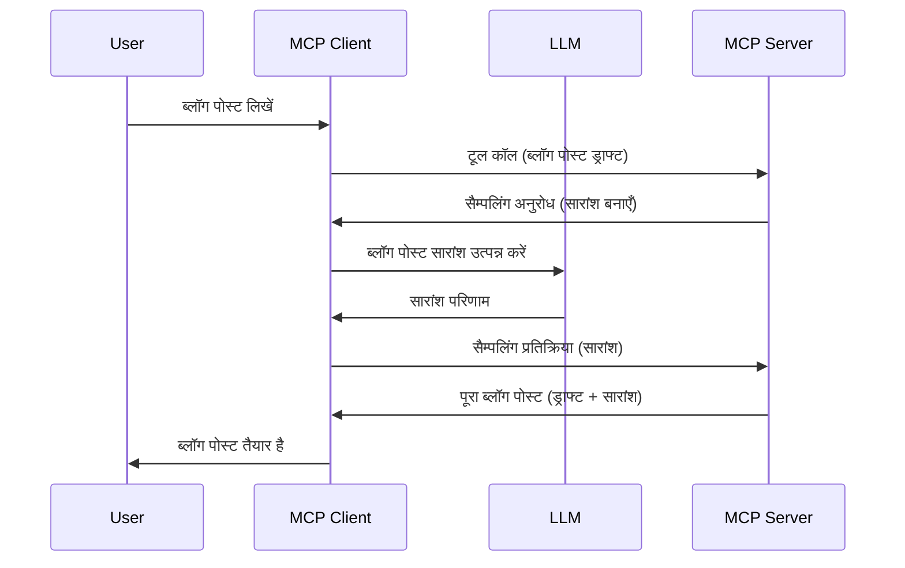

# सैम्पलिंग - क्लाइंट को फीचर्स सौंपना

कभी-कभी, आपको MCP क्लाइंट और MCP सर्वर को एक साझा लक्ष्य प्राप्त करने के लिए सहयोग करना पड़ता है। ऐसा हो सकता है कि सर्वर को क्लाइंट पर स्थित एक LLM की मदद चाहिए। इस स्थिति के लिए, सैम्पलिंग का उपयोग करना चाहिए।

आइए कुछ उपयोग के मामलों की जांच करें और सैम्पलिंग से संबंधित समाधान कैसे बनाएं।

## अवलोकन

इस पाठ में, हम सैम्पलिंग कब और कहां उपयोग करनी है और इसे कैसे कॉन्फ़िगर करना है, इस पर ध्यान केंद्रित करेंगे।

## सीखने के उद्देश्य

इस अध्याय में, हम:

- समझाएंगे कि सैम्पलिंग क्या है और इसे कब उपयोग करें।
- MCP में सैम्पलिंग को कैसे कॉन्फ़िगर करें, दिखाएंगे।
- सैम्पलिंग के उदाहरण प्रदान करेंगे।

## सैम्पलिंग क्या है और इसे क्यों उपयोग करें?

सैम्पलिंग एक उन्नत फीचर है जो निम्नलिखित तरीके से कार्य करता है:



### सैम्पलिंग अनुरोध

ठीक है, अब हमारे पास एक विश्वसनीय परिदृश्य का व्यापक दृश्य है, चलिए उस सैम्पलिंग अनुरोध के बारे में बात करते हैं जो सर्वर क्लाइंट को वापस भेजता है। JSON-RPC प्रारूप में यह अनुरोध कुछ इस तरह दिख सकता है:

```json
{
  "jsonrpc": "2.0",
  "id": 1,
  "method": "sampling/createMessage",
  "params": {
    "messages": [
      {
        "role": "user",
        "content": {
          "type": "text",
          "text": "Create a blog post summary of the following blog post: <BLOG POST>"
        }
      }
    ],
    "modelPreferences": {
      "hints": [
        {
          "name": "claude-3-sonnet"
        }
      ],
      "intelligencePriority": 0.8,
      "speedPriority": 0.5
    },
    "systemPrompt": "You are a helpful assistant.",
    "maxTokens": 100
  }
}
```

यहाँ कुछ बातें हैं जिन्हें उठाना जरूरी है:

- प्रॉम्प्ट, content -> text के अंतर्गत, हमारा प्रॉम्प्ट है जो LLM को ब्लॉग पोस्ट सामग्री का सारांश बनाने का निर्देश देता है।

- **modelPreferences**। यह अनुभाग बस एक पसंद है, LLM के साथ कौन सा कॉन्फ़िगरेशन उपयोग करना है, इसका सुझाव। उपयोगकर्ता चुन सकता है कि वे इन सुझावों के साथ जाएं या इन्हें बदलें। इस मामले में मॉडल के उपयोग, गति और बुद्धिमत्ता प्राथमिकता पर सुझाव हैं।
- **systemPrompt**, यह आपका सामान्य सिस्टम प्रॉम्प्ट है जो आपके LLM को एक व्यक्तित्व देता है और निर्देशात्मक मार्गदर्शन प्रदान करता है।
- **maxTokens**, यह एक और गुण है जो दर्शाता है कि इस कार्य के लिए कितने टोकन उपयोग करने की सिफारिश की जाती है।

### सैम्पलिंग प्रतिक्रिया

यह प्रतिक्रिया MCP क्लाइंट अंततः MCP सर्वर को भेजता है और यह क्लाइंट द्वारा LLM को कॉल करने, उस प्रतिक्रिया का इंतजार करने और फिर इस संदेश का निर्माण करने का परिणाम है। JSON-RPC में यह कुछ इस तरह दिख सकता है:

```json
{
  "jsonrpc": "2.0",
  "id": 1,
  "result": {
    "role": "assistant",
    "content": {
      "type": "text",
      "text": "Here's your abstract <ABSTRACT>"
    },
    "model": "gpt-5",
    "stopReason": "endTurn"
  }
}
```

ध्यान दें कि प्रतिक्रिया ब्लॉग पोस्ट का सार है जैसे हमने मांगा था। साथ ही ध्यान दें कि उपयोग किया गया `model` वह नहीं है जो हमने मांगा था, बल्कि "gpt-5" है न कि "claude-3-sonnet"। यह दिखाने के लिए है कि उपयोगकर्ता अपने निर्णय को बदल सकता है और आपका सैम्पलिंग अनुरोध केवल एक सुझाव है।

ठीक है, अब जब हम मुख्य प्रवाह और उपयोगी कार्य "ब्लॉग पोस्ट निर्माण + सारांश" को समझ चुके हैं, तो देखते हैं इसे काम करने के लिए हमें क्या करना होगा।

### संदेश प्रकार

सैम्पलिंग संदेश केवल टेक्स्ट तक सीमित नहीं हैं बल्कि आप चित्र और ऑडियो भी भेज सकते हैं। JSON-RPC इस प्रकार भिन्न दिखता है:

**टेक्स्ट**

```json
{
  "type": "text",
  "text": "The message content"
}
```

**छवि सामग्री**

```json
{
  "type": "image",
  "data": "base64-encoded-image-data",
  "mimeType": "image/jpeg"
}
```

**ऑडियो सामग्री**

```json
{
  "type": "audio",
  "data": "base64-encoded-audio-data",
  "mimeType": "audio/wav"
}
```

> NOTE: सैम्पलिंग पर और अधिक विस्तृत जानकारी के लिए, [आधिकारिक दस्तावेज़](https://modelcontextprotocol.io/specification/2025-11-25/client/sampling) देखें

## क्लाइंट में सैम्पलिंग को कैसे कॉन्फ़िगर करें

> नोट: यदि आप केवल सर्वर बना रहे हैं, तो यहाँ ज्यादा करने की जरूरत नहीं है।

क्लाइंट में, आपको निम्नलिखित फीचर इस तरह निर्दिष्ट करनी होगी:

```json
{
  "capabilities": {
    "sampling": {}
  }
}
```

जब आपका चुना हुआ क्लाइंट सर्वर के साथ इनिशियलाइज़ होगा, तो इसे पकड़ा जाएगा।

## सैम्पलिंग के साथ उदाहरण - ब्लॉग पोस्ट बनाएं

आइए मिलकर एक सैम्पलिंग सर्वर कोड करें, हमें निम्न करना होगा:

1. सर्वर पर एक टूल बनाएं।
1. वह टूल एक सैम्पलिंग अनुरोध बनाए।
1. टूल को क्लाइंट के सैम्पलिंग अनुरोध के उत्तर का इंतजार करना चाहिए।
1. फिर टूल का परिणाम उत्पन्न होना चाहिए।

आइए कोड को चरण दर चरण देखें:

### -1- टूल बनाएँ

**python**

```python
@mcp.tool()
async def create_blog(title: str, content: str, ctx: Context[ServerSession, None]) -> str:
    """Create a blog post and generate a summary"""

```

### -2- एक सैम्पलिंग अनुरोध बनाएँ

अपने टूल का विस्तार निम्न कोड के साथ करें:

**python**

```python
post = BlogPost(
        id=len(posts) + 1,
        title=title,
        content=content,
        abstract=""
    )

prompt = f"Create an abstract of the following blog post: title: {title} and draft: {content} "

result = await ctx.session.create_message(
        messages=[
            SamplingMessage(
                role="user",
                content=TextContent(type="text", text=prompt),
            )
        ],
        max_tokens=100,
)

```

### -3- प्रतिक्रिया का इंतजार करें और प्रतिक्रिया लौटाएँ

**python**

```python
post.abstract = result.content.text

posts.append(post)

# पूर्ण उत्पाद लौटाएं
return json.dumps({
    "id": post.title,
    "abstract": post.abstract
})
```

### -4- पूर्ण कोड

**python**

```python
from starlette.applications import Starlette
from starlette.routing import Mount, Host

from mcp.server.fastmcp import Context, FastMCP

from mcp.server.session import ServerSession
from mcp.types import SamplingMessage, TextContent

import json


from uuid import uuid4
from typing import List
from pydantic import BaseModel


mcp = FastMCP("Blog post generator")

# app = FastAPI()

posts = []

class BlogPost(BaseModel):
    id: int
    title: str
    content: str
    abstract: str

posts: List[BlogPost] = []

@mcp.tool()
async def create_blog(title: str, content: str, ctx: Context[ServerSession, None]) -> str:
    """Create a blog post and generate a summary"""

    post = BlogPost(
        id=len(posts) + 1,
        title=title,
        content=content,
        abstract=""
    )

    prompt = f"Create an abstract of the following blog post: title: {title} and draft: {content} "

    result = await ctx.session.create_message(
        messages=[
            SamplingMessage(
                role="user",
                content=TextContent(type="text", text=prompt),
            )
        ],
        max_tokens=100,
    )

    post.abstract = result.content.text

    posts.append(post)

    # पूर्ण ब्लॉग पोस्ट वापस करें
    return json.dumps({
        "id": post.title,
        "abstract": post.abstract
    })

if __name__ == "__main__":
    print("Starting server...")
    # mcp.run()
    mcp.run(transport="streamable-http")

# ऐप चलाने के लिए: python server.py
```

### -5- Visual Studio Code में परीक्षण करना

Visual Studio Code में इसे आज़माने के लिए निम्न करें:

1. टर्मिनल में सर्वर शुरू करें
1. इसे *mcp.json* में जोड़ें (और सुनिश्चित करें कि यह चालू है) कुछ इस तरह:

   ```json
   "servers": {
      "blog-server": {
        "type": "http",
        "url": "http://localhost:8000/mcp"
      }
   }
   ```

1. एक प्रॉम्प्ट टाइप करें:

   ```text
   create a blog post named "Where Python comes from", the content is "Python is actually named after Monty Python Flying Circus"
   ```

1. सैम्पलिंग को अनुमति दें। पहली बार परीक्षण करने पर अतिरिक्त संवाद आएगा जिसे आपको स्वीकार करना होगा, फिर आप आम संवाद देखेंगे जो आपसे टूल चलाने के लिए कहेगा।

1. परिणामों का निरीक्षण करें। आप परिणाम दोनों GitHub Copilot Chat में अच्छे से प्रस्तुत देखेंगे और कच्ची JSON प्रतिक्रिया का भी निरीक्षण कर सकते हैं।

**बोनस**। Visual Studio Code टूलिंग सैम्पलिंग के लिए बेहतरीन समर्थन प्रदान करती है। आप अपने इंस्टॉल किए गए सर्वर पर सैम्पलिंग एक्सेस इस तरह कॉन्फ़िगर कर सकते हैं:

1. एक्सटेंशन सेक्शन पर जाएं।
1. "MCP SERVERS - INSTALLED" अनुभाग में अपने इंस्टॉल किए गए सर्वर के लिए गियर आइकन चुनें।
1 "Configure Model Access" चुनें, यहाँ आप चयन कर सकते हैं कि GitHub Copilot सैम्पलिंग करते समय किन मॉडलों का उपयोग कर सकता है। आप हाल ही में हुए सभी सैम्पलिंग अनुरोध भी "Show Sampling requests" चुनकर देख सकते हैं।

## असाइनमेंट

इस असाइनमेंट में, आप एक थोड़ा अलग सैम्पलिंग बनाएंगे, अर्थात् एक सैम्पलिंग इंटीग्रेशन जो उत्पाद विवरण जनरेटिंग का समर्थन करता है। आपकी स्थिति इस प्रकार है:

**परिदृश्य**: ई-कॉमर्स के बैक ऑफिस कर्मचारी को मदद चाहिए, उत्पाद विवरण बनाने में बहुत समय लगता है। इसलिए, आपको ऐसा समाधान बनाना है जहां आप "create_product" नामक टूल को "title" और "keywords" के साथ कॉल करें और यह एक पूर्ण उत्पाद उत्पन्न करे जिसमें "description" फील्ड हो जो क्लाइंट के LLM द्वारा भरा जाए।

TIP: जो कुछ आपने पहले सीखा है उसका उपयोग करें और इस सर्वर और इसके टूल को सैम्पलिंग अनुरोध का उपयोग करके बनाएँ।

## समाधान

[Solution](./solution/README.md)

## मुख्य निष्कर्ष

सैम्पलिंग एक शक्तिशाली फीचर है जो सर्वर को क्लाइंट को कार्य सौंपने की सुविधा देता है जब उसे LLM की मदद चाहिए।

## आगे क्या है

- [अध्याय 4 - व्यावहारिक कार्यान्वयन](../../04-PracticalImplementation/README.md)

---

<!-- CO-OP TRANSLATOR DISCLAIMER START -->
**अस्वीकरण**:
इस दस्तावेज़ का अनुवाद AI अनुवाद सेवा [Co-op Translator](https://github.com/Azure/co-op-translator) का उपयोग करके किया गया है। जबकि हम सटीकता के लिए प्रयास करते हैं, कृपया ध्यान दें कि स्वचालित अनुवादों में त्रुटियाँ या अशुद्धियाँ हो सकती हैं। मूल दस्तावेज़ अपनी मूल भाषा में ही प्रामाणिक स्रोत माना जाना चाहिए। महत्वपूर्ण जानकारी के लिए, पेशेवर मानव अनुवाद की सिफारिश की जाती है। इस अनुवाद के उपयोग से उत्पन्न किसी भी गलतफहमी या गलत व्याख्या के लिए हम उत्तरदायी नहीं हैं।
<!-- CO-OP TRANSLATOR DISCLAIMER END -->