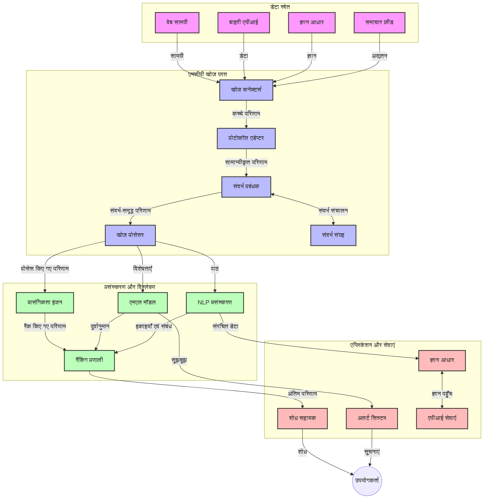
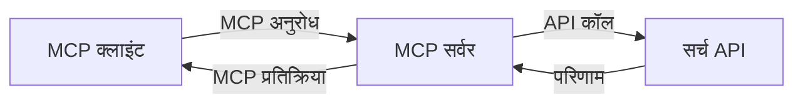
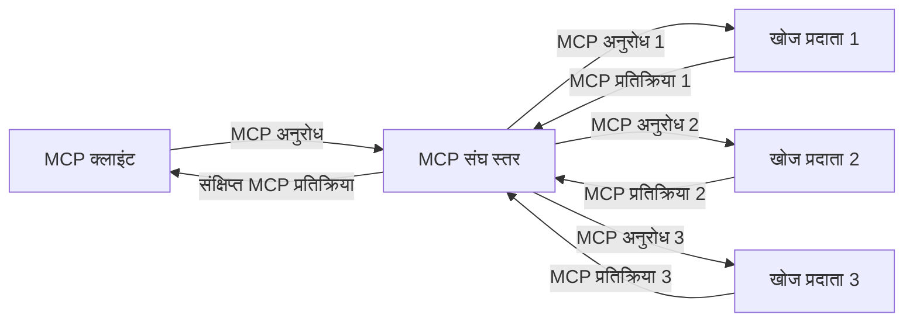
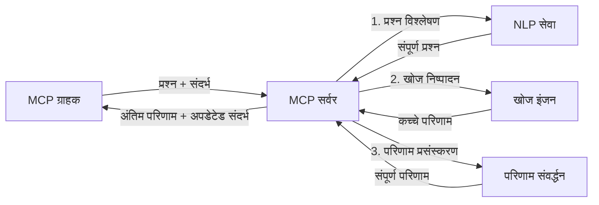

# रियल-टाइम वेब खोज के लिए मॉडल संदर्भ प्रोटोकॉल

## अवलोकन

रियल-टाइम वेब खोज आज की सूचना-संचालित दुनिया में अनिवार्य हो गई है, जहां एप्लिकेशन को इंटरनेट भर में अद्यतित जानकारी तक तत्काल पहुँच की आवश्यकता होती है ताकि वे प्रासंगिक और सटीक उत्तर प्रदान कर सकें। मॉडल संदर्भ प्रोटोकॉल (MCP) इन रियल-टाइम खोज प्रक्रियाओं को अनुकूलित करने में एक महत्वपूर्ण प्रगति दर्शाता है, जिससे खोज कार्यक्षमता में सुधार, संदर्भीय अखंडता बनाए रखना और समग्र सिस्टम प्रदर्शन बढ़ाना संभव होता है।

यह मॉड्यूल एक्सप्लोर करता है कि कैसे MCP AI मॉडल, सर्च इंजन और एप्लिकेशन के बीच संदर्भ प्रबंधन के लिए एक मानकीकृत तरीका प्रदान करके रियल-टाइम वेब खोज को बदल देता है।

### आप क्या सीखेंगे

इस व्यापक मार्गदर्शिका में, आप जानेंगे:

- कैसे MCP AI मॉडल और रियल-टाइम वेब खोज क्षमताओं के बीच एक सहज सेतु बनाता है
- MCP के साथ कुशल और स्केलेबल खोज समाधान लागू करने के वास्तुशिल्प पैटर्न
- कई प्रश्नों और इंटरैक्शन के दौरान खोज संदर्भ को बनाए रखने की तकनीकें
- विभिन्न खोज परिदृश्यों के लिए Python और JavaScript में व्यावहारिक कोड कार्यान्वयन
- MCP-संचालित खोज प्रणालियों में प्रासंगिकता, नवीनता और प्रदर्शन का संतुलन कैसे करें

## रियल-टाइम वेब खोज का परिचय

रियल-टाइम वेब खोज एक तकनीकी दृष्टिकोण है जो प्रकाशित या अद्यतन होती वेब-आधारित जानकारी का निरंतर क्वेरी, प्रसंस्करण और विश्लेषण सक्षम करता है, जिससे सिस्टम बिना विलंब के ताजा और प्रासंगिक जानकारी प्रदान कर सके। पारंपरिक खोज प्रणालियों के विपरीत, जो शायद घंटों या दिनों पुराने सूचकांकित डेटा पर कार्य करती हैं, रियल-टाइम खोज वेब से लाइव डेटा को संसाधित करती है, वास्तविक समय में ऑनलाइन सामग्री की वर्तमान स्थिति को दर्शाते हुए जानकारी प्रदान करती है।

### रियल-टाइम वेब खोज के मुख्य सिद्धांत:

- **निरंतर क्वेरी प्रसंस्करण**: खोज क्वेरियाँ लगातार अपडेट हो रहे डेटा स्रोतों के खिलाफ संसाधित होती हैं
- **नवीनता को प्राथमिकता**: सिस्टम ताजा जानकारी को प्राथमिकता देने के लिए डिज़ाइन किए जाते हैं
- **प्रासंगिकता संतुलन**: प्रासंगिकता और नवीनता के बीच संतुलन बनाए रखना
- **स्केलेबल वास्तुकला**: सिस्टम को विभिन्न क्वेरी लोड और डेटा मात्राओं को संभालना चाहिए
- **संदर्भीय समझ**: खोज पुनरावृत्तियों के दौरान उपयोगकर्ता संदर्भ बनाए रखना सार्थक परिणामों के लिए आवश्यक है
- **गतिशील क्वेरी पुनःस्वरूपण**: संदर्भ और पिछली परिणामों के आधार पर क्वेरियों को अनुकूलित रूप से संशोधित करना
- **मल्टी-स्रोत एकीकरण**: कई खोज प्रदाताओं और वेब स्रोतों से परिणाम संयोजित करना
- **सामान्यबोधी समझ**: केवल कीवर्ड पर आधारित नहीं, बल्कि अर्थ के आधार पर क्वेरी और सामग्री संसाधित करना
- **रियल-टाइम रैंकिंग**: जैसे-जैसे नई जानकारी आती है, परिणाम रैंकिंग लगातार समायोजित होती रहती है

### मॉडल संदर्भ प्रोटोकॉल और रियल-टाइम वेब खोज

मॉडल संदर्भ प्रोटोकॉल (MCP) वास्तविक-समय वेब खोज वातावरण में कई महत्वपूर्ण चुनौतियों का समाधान करता है:

1. **खोज संदर्भ संरक्षण**: MCP मानकीकृत करता है कि वितरित खोज घटकों के बीच संदर्भ कैसे बनाए रखा जाए, यह सुनिश्चित करता है कि AI मॉडल और प्रसंस्करण नोड्स को प्रासंगिक क्वेरी इतिहास और उपयोगकर्ता प्राथमिकताओं तक पहुंच हो।

2. **कुशल क्वेरी प्रबंधन**: संदर्भ संचार के लिए संरचित तंत्र प्रदान करके, MCP प्रत्येक खोज पुनरावृत्ति में संदर्भ दोहराने के अधिभार को कम करता है।

3. **अंतर-संचालन क्षमता**: MCP विभिन्न खोज तकनीकों और AI मॉडलों के बीच संदर्भ साझा करने के लिए एक सामान्य भाषा बनाता है, जिससे अधिक लचीली और विस्तारशील वास्तुकलाएं संभव होती हैं।

4. **खोज-अनुकूल संदर्भ**: MCP कार्यान्वयन यह प्राथमिकता दे सकते हैं कि कौन से संदर्भ तत्व प्रभावी खोज के लिए सबसे अधिक प्रासंगिक हैं, जिससे प्रदर्शन और सटीकता दोनों के लिए अनुकूलन होता है।

5. **अनुकूली खोज प्रसंस्करण**: MCP के माध्यम से उचित संदर्भ प्रबंधन के साथ, खोज सिस्टम बढ़ती उपयोगकर्ता आवश्यकताओं और सूचना परिदृश्यों के आधार पर गतिशील रूप से प्रसंस्करण समायोजित कर सकते हैं।

आधुनिक अनुप्रयोगों में, जैसे समाचार संग्रह से लेकर शोध सहायक तक, वेब खोज तकनीकों के साथ MCP का एकीकरण अधिक बुद्धिमान, संदर्भ-सजग खोज को सक्षम बनाता है, जो उपयोगकर्ता इंटरैक्शन जारी रहने पर अधिक प्रासंगिक परिणाम प्रदान कर सकता है।

## सीखने के उद्देश्य

इस पाठ के अंत तक, आप सक्षम होंगे:

- रियल-टाइम वेब खोज के मूल सिद्धांतों और आधुनिक अनुप्रयोगों में उसकी चुनौतियों को समझना
- समझाना कि मॉडल संदर्भ प्रोटोकॉल (MCP) कैसे रियल-टाइम वेब खोज क्षमताओं को बढ़ाता है
- लोकप्रिय फ्रेमवर्क और APIs का उपयोग कर MCP-आधारित खोज समाधान लागू करना
- MCP के साथ स्केलेबल, उच्च प्रदर्शन खोज वास्तुकलाएं डिजाइन और तैनात करना
- MCP अवधारणाओं को सार्थक खोज, शोध सहायता, और AI-संवर्धित ब्राउज़िंग सहित विभिन्न उपयोग मामलों में लागू करना
- MCP-आधारित खोज तकनीकों में उभरते रुझान और भविष्य के नवाचारों का मूल्यांकन करना
- उपयोगकर्ता इंटरैक्शन से सीखने वाली संदर्भ-संवेदनशील खोज प्रणालियाँ विकसित करना
- मानकीकृत MCP प्रोटोकॉल का उपयोग कर AI सहायकों में वेब खोज क्षमताओं को एकीकृत करना
- संदर्भ के आधार पर परिणामों को धीरे-धीरे परिष्कृत करने वाली बहु-चरणीय खोज पाइपलाइनों का निर्माण करना
- व्यापक संदर्भ जागरूकता बनाए रखते हुए खोज प्रदर्शन का अनुकूलन करना

### परिभाषा और महत्व

रियल-टाइम वेब खोज न्यूनतम विलंब के साथ वेब-आधारित जानकारी की निरंतर क्वेरी, पुनर्प्राप्ति, और वितरण है। पारंपरिक खोज इंजन जो वेब को आवधिक रूप से क्रॉल और इंडेक्स करते हैं, उनकी तुलना में रियल-टाइम खोज उपलब्ध होते ही जानकारी को सतह पर लाने का लक्ष्य रखती है, जिससे सबसे वर्तमान सामग्री तक त्वरित पहुँच सुनिश्चित होती है।

रियल-टाइम वेब खोज की मुख्य विशेषताएं:

- **ताजगी**: हालिया सामग्री और अपडेट्स को प्राथमिकता देना
- **निरंतर प्रसंस्करण**: नई जानकारी के लिए लगातार निगरानी
- **क्वेरी अनुकूलन**: संदर्भ और प्रतिक्रिया के आधार पर खोज क्वेरियों का परिष्कार
- **तात्कालिक वितरण**: न्यूनतम विलंब के साथ खोज परिणाम प्रदान करना
- **संदर्भ संरक्षण**: बेहतर प्रासंगिकता के लिए पिछली क्वेरियों पर निर्माण करना

### पारंपरिक वेब खोज में चुनौतियां

पारंपरिक वेब खोज दृष्टिकोणों को रियल-टाइम परिदृश्यों में लागू करते समय कई सीमाओं का सामना करना पड़ता है:

1. **संदर्भ खंडन**: कई क्वेरियों के बीच खोज संदर्भ बनाए रखने में कठिनाई
2. **सूचना ताजगी**: नवीनतम जानकारी तक पहुँच और प्राथमिकता में चुनौतियां
3. **एकीकरण जटिलता**: खोज प्रणालियों और एप्लिकेशन के बीच अंतर-संचालन संबंधी समस्याएं
4. **विलंब समस्याएं**: व्यापक खोज और प्रत्युत्तर समय आवश्यकताओं के बीच संतुलन
5. **प्रासंगिकता समायोजन**: नवीनता को प्राथमिकता देते हुए सटीकता और प्रासंगिकता सुनिश्चित करना

## खोज के लिए मॉडल संदर्भ प्रोटोकॉल (MCP) को समझना

### खोज संदर्भ में MCP क्या है?

मॉडल संदर्भ प्रोटोकॉल (MCP) एक मानकीकृत संवाद प्रोटोकॉल है जो AI मॉडल और एप्लिकेशन के बीच कुशल इंटरैक्शन की सुविधा प्रदान करने के लिए डिज़ाइन किया गया है। रियल-टाइम वेब खोज के संदर्भ में, MCP निम्नलिखित के लिए एक फ्रेमवर्क प्रदान करता है:

- क्वेरी अनुक्रमों के दौरान खोज संदर्भ का संरक्षण
- खोज क्वेरी और परिणाम प्रारूपों का मानकीकरण
- खोज पैरामीटर और परिणामों के संचार का अनुकूलन
- मॉडल और खोज इंजन के बीच संवाद में सुधार

### मुख्य घटक और वास्तुकला

रियल-टाइम वेब खोज के लिए MCP की वास्तुकला कुछ प्रमुख घटकों से मिलकर बनती है:

1. **क्वेरी संदर्भ हैंडलर**: कई क्वेरियों के बीच खोज संदर्भ का प्रबंधन और संरक्षण
2. **खोज प्रोसेसर**: संदर्भ-सजग तकनीकों का उपयोग कर इनकमिंग खोज अनुरोधों को संसाधित करना
3. **प्रोटोकॉल एडेप्टर**: विभिन्न खोज APIs के बीच अनुरोधों को संदर्भ बनाए रखते हुए परिवर्तित करना
4. **संदर्भ भंडार**: खोज इतिहास और प्राथमिकताओं को कुशलतापूर्वक संग्रहित और पुनः प्राप्त करना
5. **खोज कनेक्टर**: विभिन्न खोज इंजन और वेब APIs से कनेक्ट करना



### MCP कैसे रियल-टाइम वेब खोज में सुधार करता है

MCP पारंपरिक वेब खोज चुनौतियों को इस प्रकार संबोधित करता है:

- **संदर्भीय निरंतरता**: पूरी खोज सत्र के दौरान क्वेरियों के बीच संबंध बनाए रखना
- **अनुकूलित संचार**: बुद्धिमान संदर्भ प्रबंधन के माध्यम से खोज पैरामीटर में अतिशयोक्ति कम करना
- **मानकीकृत इंटरफेस**: खोज घटकों के लिए सुसंगत APIs प्रदान करना
- **विलंब में कमी**: कुशल संदर्भ प्रबंधन द्वारा प्रसंस्करण अधिभार न्यूनतम करना
- **सुधारित प्रासंगिकता**: कई क्वेरियों में उपयोगकर्ता उद्देश्य को संरक्षित करके खोज प्रासंगिकता बढ़ाना

## एकीकरण और कार्यान्वयन

रियल-टाइम वेब खोज प्रणालियों को प्रदर्शन और संदर्भीय अखंडता दोनों बनाए रखने के लिए सावधानीपूर्वक वास्तुशिल्प डिजाइन और कार्यान्वयन की आवश्यकता होती है। मॉडल संदर्भ प्रोटोकॉल AI मॉडल और खोज तकनीकों को एकीकृत करने के लिए एक मानकीकृत दृष्टिकोण प्रदान करता है, जिससे अधिक परिष्कृत, संदर्भ-सजग खोज पाइपलाइनों का निर्माण संभव होता है।

### खोज वास्तुकलाओं में MCP एकीकरण का अवलोकन

रियल-टाइम वेब खोज वातावरण में MCP लागू करने के कई महत्वपूर्ण पहलू हैं:

1. **खोज संदर्भ सीरियलाइजेशन**: MCP खोज अनुरोधों में संदर्भीय जानकारी को एन्कोड करने के लिए कुशल तंत्र प्रदान करता है, यह सुनिश्चित करता है कि आवश्यक संदर्भ क्वेरी के साथ प्रसंस्करण पाइपलाइन के माध्यम से जाता रहे। इसमें खोज-सम्बंधित मेटाडेटा के लिए अनुकूलित मानकीकृत सीरियलाइजेशन प्रारूप शामिल हैं।

2. **स्थिति-संवेदनशील खोज प्रसंस्करण**: MCP खोज पुनरावृत्तियों के दौरान एक सुसंगत संदर्भ प्रतिनिधित्व बनाए रखकर अधिक बुद्धिमान स्थिति-संवेदनशील प्रसंस्करण सक्षम बनाता है। यह विशेष रूप से बहु-चरण खोज पाइपलाइनों में मूल्यवान है जहां संदर्भ परिष्कार परिणामों में सुधार करता है।

3. **क्वेरी विस्तार और परिष्कार**: MCP कार्यान्वयन संचयी संदर्भ के आधार पर परिष्कृत क्वेरी विस्तार और परिष्कार को सुगम बना सकते हैं, जिससे जैसे-जैसे खोज सत्र बढ़ता है, परिणाम अधिक प्रासंगिक होते जाते हैं।

4. **परिणाम कैशिंग और प्राथमिकता**: संदर्भ प्रबंधन को मानकीकृत करके, MCP परिणाम कैशिंग और प्राथमिकता प्रबंधन में सहायता करता है, जिससे घटक विकासशील खोज संदर्भ के आधार पर अनुकूलित हो सकते हैं।

5. **खोज संघ और संचयन**: MCP कई बैकएंड्स के बीच अधिक परिष्कृत संघ के लिए संरचित संदर्भ प्रतिनिधित्व प्रदान करता है, जिससे विविध स्रोतों से परिणामों का अधिक सार्थक संचयन संभव होता है।

विभिन्न खोज तकनीकों में MCP के कार्यान्वयन से संदर्भ प्रबंधन के लिए एक एकीकृत दृष्टिकोण बनता है, जिससे कस्टम एकीकरण कोड की आवश्यकता कम होती है और खोज क्वेरियों के विकास के साथ सार्थक संदर्भ बनाए रखने की प्रणाली की क्षमता बढ़ती है।

### विभिन्न वेब खोज कार्यान्वयनों में MCP

ये उदाहरण वर्तमान MCP विनिर्देश का पालन करते हैं जो एक JSON-RPC आधारित प्रोटोकॉल पर केंद्रित है जिसमें भिन्न-भिन्न ट्रांसपोर्ट तंत्र शामिल हैं। कोड दिखाता है कि आप कस्टम खोज एकीकरण कैसे लागू कर सकते हैं जबकि MCP प्रोटोकॉल के साथ पूर्ण संगतता बनाए रखते हैं।

<details>
<summary>Generic Search API के साथ Python कार्यान्वयन</summary>

```python
import asyncio
import json
import aiohttp
from typing import Dict, Any, Optional, List
from contextlib import asynccontextmanager
from collections.abc import AsyncIterator

# मानक MCP पुस्तकालयों को आयात करें
from mcp.client.session import ClientSession
from mcp.client.streamable_http import streamablehttp_client
from mcp.types import TextContent, CreateMessageRequestParams, CreateMessageResult
from mcp.server.fastmcp import FastMCP

# वेब खोज के लिए FastMCP सर्वर बनाएं
search_server = FastMCP("WebSearch")

# वेब खोज संचालन को संभालने के लिए वर्ग
class WebSearchHandler:
    def __init__(self, api_endpoint: str, api_key: str):
        self.api_endpoint = api_endpoint
        self.api_key = api_key
        self.session = None
        
    async def initialize(self):
        """Initialize the HTTP session"""
        self.session = aiohttp.ClientSession(
            headers={"Authorization": f"Bearer {self.api_key}"}
        )
    
    async def close(self):
        """Close the HTTP session"""
        if self.session:
            await self.session.close()
            
    async def perform_search(self, query: str, max_results: int = 5, 
                           include_domains: List[str] = None, 
                           exclude_domains: List[str] = None,
                           time_period: str = "any") -> Dict[str, Any]:
        """Perform web search using the search API"""
        # खोज मानदंड बनाएं
        search_params = {
            "q": query,
            "limit": max_results,
            "time": time_period
        }
        
        if include_domains:
            search_params["site"] = ",".join(include_domains)
            
        if exclude_domains:
            search_params["exclude_site"] = ",".join(exclude_domains)
        
        # खोज अनुरोध करें
        try:
            async with self.session.get(
                self.api_endpoint,
                params=search_params
            ) as response:
                if response.status != 200:
                    error_text = await response.text()
                    raise Exception(f"Search API error: {response.status} - {error_text}")
                
                search_data = await response.json()
                
                # API-विशिष्ट प्रतिक्रिया को मानक प्रारूप में परिवर्तित करें
                results = []
                for item in search_data.get("results", []):
                    results.append({
                        "title": item.get("title", ""),
                        "url": item.get("url", ""),
                        "snippet": item.get("snippet", ""),
                        "date": item.get("published_date", ""),
                        "source": item.get("source", "")
                    })
                
                return {
                    "query": query,
                    "totalResults": len(results),
                    "results": results
                }
        except Exception as e:
            print(f"Search API request error: {e}")
            raise

# खोज हैंडलर प्रारंभ करें
search_handler = WebSearchHandler(
    api_endpoint="https://api.search-service.example/search",
    api_key="your-api-key-here"
)

# खोज हैंडलर को प्रबंधित करने के लिए जीवनकाल सेटअप करें
@asyncio.asynccontextmanager
async def app_lifespan(server: FastMCP):
    """Manage application lifecycle"""
    await search_handler.initialize()
    try:
        yield {"search_handler": search_handler}
    finally:
        await search_handler.close()

# सर्वर के लिए जीवनकाल सेट करें
search_server = FastMCP("WebSearch", lifespan=app_lifespan)

# वेब खोज उपकरण पंजीकृत करें
@search_server.tool()
async def web_search(query: str, max_results: int = 5, 
                   include_domains: List[str] = None,
                   exclude_domains: List[str] = None,
                   time_period: str = "any") -> Dict[str, Any]:
    """
    Search the web for information
    
    Args:
        query: The search query
        max_results: Maximum number of results to return (default: 5)
        include_domains: List of domains to include in search results
        exclude_domains: List of domains to exclude from search results
        time_period: Time period for results ("day", "week", "month", "any")
        
    Returns:
        Dictionary containing search results
    """
    ctx = search_server.get_context()
    search_handler = ctx.request_context.lifespan_context["search_handler"]
    
    results = await search_handler.perform_search(
        query=query,
        max_results=max_results,
        include_domains=include_domains,
        exclude_domains=exclude_domains,
        time_period=time_period
    )
    
    return results

# उदाहरण ग्राहक उपयोग
async def client_example():
    # Streamable HTTP परिवहन का उपयोग करके खोज सर्वर से कनेक्ट करें
    async with streamablehttp_client("http://localhost:8000/mcp") as (read, write, _):
        async with ClientSession(read, write) as session:
            # कनेक्शन प्रारंभ करें
            await session.initialize()
            
            # वेब_खोज उपकरण कॉल करें
            search_results = await session.call_tool(
                "web_search", 
                {
                    "query": "latest developments in AI and Model Context Protocol",
                    "max_results": 5,
                    "time_period": "day",
                    "include_domains": ["github.com", "microsoft.com"]
                }
            )
            
            print(f"Search results: {search_results}")

# सर्वर निष्पादन उदाहरण
if __name__ == "__main__":
    # Streamable HTTP परिवहन के साथ सर्वर चलाएं
    search_server.run(transport="streamable-http")
```
</details> 

<details>
<summary>ब्राउज़र-आधारित खोज के साथ JavaScript कार्यान्वयन</summary>

```javascript
// वेब खोज के लिए MCP सर्वर कार्यान्वयन
import { McpServer, ResourceTemplate } from '@modelcontextprotocol/sdk/server/mcp.js';
import { StreamableHTTPServerTransport } from '@modelcontextprotocol/sdk/server/streamableHttp.js';
import { z } from 'zod';

// वेब खोज के लिए MCP सर्वर बनाएं
const searchServer = new McpServer({
    name: "BrowserSearch",
    description: "A server that provides web search capabilities"
});

// खोज सेवा क्लास
class SearchService {
    constructor(searchApiUrl, apiKey) {
        this.searchApiUrl = searchApiUrl;
        this.apiKey = apiKey;
    }

    async performSearch(parameters) {
        const {
            query = '',
            maxResults = 5,
            includeDomains = [],
            excludeDomains = [],
            timePeriod = 'any'
        } = parameters;
        
        // पैरामीटर के साथ खोज URL बनाएँ
        const url = new URL(this.searchApiUrl);
        url.searchParams.append('q', query);
        url.searchParams.append('limit', maxResults);
        url.searchParams.append('time', timePeriod);
        
        if (includeDomains.length > 0) {
            url.searchParams.append('site', includeDomains.join(','));
        }
        
        if (excludeDomains.length > 0) {
            url.searchParams.append('exclude_site', excludeDomains.join(','));
        }
        
        try {
            const response = await fetch(url.toString(), {
                method: 'GET',
                headers: {
                    'Authorization': `Bearer ${this.apiKey}`,
                    'Content-Type': 'application/json'
                }
            });
            
            if (!response.ok) {
                const errorText = await response.text();
                throw new Error(`Search API error: ${response.status} - ${errorText}`);
            }
            
            const searchData = await response.json();
            
            // API-विशिष्ट प्रतिक्रिया को एक मानक प्रारूप में बदलें
            const results = searchData.results?.map(item => ({
                title: item.title || '',
                url: item.url || '',
                snippet: item.snippet || '',
                date: item.published_date || '',
                source: item.source || ''
            })) || [];
            
            return {
                query,
                totalResults: results.length,
                results
            };
        } catch (error) {
            console.error('Search API request error:', error);
            throw error;
        }
    }
}

// खोज सेवा को प्रारंभ करें
const searchService = new SearchService(
    'https://api.search-service.example/search',
    'your-api-key-here'
);

// सर्वर के लिए संदर्भ प्रदाता सेटअप करें
searchServer.setContextProvider(() => {
    return {
        searchService
    };
});

// वेब खोज उपकरण पंजीकृत करें
searchServer.tool({
    name: 'web_search',
    description: 'Search the web for information',
    parameters: {
        type: 'object',
        properties: {
            query: {
                type: 'string',
                description: 'The search query'
            },
            maxResults: {
                type: 'integer',
                description: 'Maximum number of results to return',
                default: 5
            },
            includeDomains: {
                type: 'array',
                items: { type: 'string' },
                description: 'List of domains to include in search results'
            },
            excludeDomains: {
                type: 'array',
                items: { type: 'string' },
                description: 'List of domains to exclude from search results'
            },
            timePeriod: {
                type: 'string',
                description: 'Time period for results',
                enum: ['day', 'week', 'month', 'any'],
                default: 'any'
            }
        },
        required: ['query']
    },
    handler: async (params, context) => {
        const { searchService } = context;
        return await searchService.performSearch(params);
    }
});

// खोज सर्वर से कनेक्ट करने के लिए उदाहरण क्लाइंट कोड
import { Client } from '@modelcontextprotocol/sdk/client/index.js';
import { StreamableHTTPClientTransport } from '@modelcontextprotocol/sdk/client/streamableHttp.js';

async function connectToSearchServer() {
    // खोज सर्वर से कनेक्ट करें
    const transport = new StreamableHTTPClientTransport(
        new URL('http://localhost:8000/mcp')
    );
    
    const client = new Client({
        name: 'search-client',
        version: '1.0.0'
    });
    
    await client.connect(transport);
    
    // खोज उपकरण को निष्पादित करें
    const searchResults = await client.callTool({
        name: 'web_search',
        arguments: {
            query: 'Model Context Protocol implementation examples',
            maxResults: 10,
            timePeriod: 'week',
            includeDomains: ['github.com', 'docs.microsoft.com']
        }
    });
    
    console.log('Search results:', searchResults);
    
    // सफाई करें
    await client.disconnect();
}

// सर्वर शुरू करें
const transport = new StreamableHTTPServerTransport();
await searchServer.connect(transport);
console.log('Search server running at http://localhost:8000/mcp');

// एक अलग प्रक्रिया में या सर्वर शुरू होने के बाद
// connectToSearchServer().catch(console.error);
```
</details> 

## कोड उदाहरण अस्वीकरण

> **महत्वपूर्ण नोट**: नीचे दिए गए कोड उदाहरण मॉडल संदर्भ प्रोटोकॉल (MCP) को वेब खोज क्षमताओं के साथ एकीकृत करने का प्रदर्शन करते हैं। जबकि वे आधिकारिक MCP SDK के पैटर्न और संरचनाओं का अनुसरण करते हैं, इन्हें शैक्षिक उद्देश्यों के लिए सरल बनाया गया है।
> 
> ये उदाहरण दिखाते हैं:
> 
> 1. **Python कार्यान्वयन**: एक FastMCP सर्वर कार्यान्वयन जो वेब खोज उपकरण प्रदान करता है और बाहरी खोज API से जुड़ता है। यह उदाहरण ठीक जीवनकाल प्रबंधन, संदर्भ संचालन और उपकरण कार्यान्वयन को प्रदर्शित करता है, जो [आधिकारिक MCP Python SDK](https://github.com/modelcontextprotocol/python-sdk) के पैटर्न का पालन करता है। सर्वर सुझाए गए Streamable HTTP ट्रांसपोर्ट का उपयोग करता है, जिसने उत्पादन तैनाती के लिए पुराने SSE ट्रांसपोर्ट को प्रतिस्थापित कर दिया है।
> 
> 2. **JavaScript कार्यान्वयन**: [आधिकारिक MCP TypeScript SDK](https://github.com/modelcontextprotocol/typescript-sdk) से FastMCP पैटर्न का उपयोग करते हुए TypeScript/JavaScript कार्यान्वयन जो उचित उपकरण परिभाषाओं और ग्राहक कनेक्शनों के साथ एक खोज सर्वर बनाता है। यह सत्र प्रबंधन और संदर्भ संरक्षण के लिए नवीनतम अनुशंसित पैटर्न का पालन करता है।
> 
> ये उदाहरण उत्पादन उपयोग के लिए अतिरिक्त त्रुटि हैंडलिंग, प्रमाणीकरण, और विशिष्ट API एकीकरण कोड की आवश्यकता होगी। प्रदर्शित खोज API एंडपॉइंट्स (`https://api.search-service.example/search`) प्लेसहोल्डर हैं और इन्हें वास्तविक खोज सेवा एंडपॉइंट्स से प्रतिस्थापित करना होगा।
> 
> पूर्ण कार्यान्वयन विवरण और नवीनतम दृष्टिकोणों के लिए कृपया [आधिकारिक MCP विनिर्देश](https://spec.modelcontextprotocol.io/) और SDK प्रलेखन देखें।

## मुख्य अवधारणाएँ

### मॉडल संदर्भ प्रोटोकॉल (MCP) फ्रेमवर्क

अपने मूल में, मॉडल संदर्भ प्रोटोकॉल AI मॉडल, एप्लिकेशन और सेवाओं के बीच संदर्भ आदान-प्रदान के लिए एक मानकीकृत तरीका प्रदान करता है। रियल-टाइम वेब खोज में, यह फ्रेमवर्क सुसंगत, बहु-टर्न खोज अनुभव बनाने के लिए आवश्यक है। मुख्य घटक शामिल हैं:

1. **क्लाइंट-सर्वर वास्तुकला**: MCP खोज क्लाइंट्स (अनुरोधकर्ता) और खोज सर्वरों (प्रदाता) के बीच स्पष्ट पृथक्करण स्थापित करता है, जिससे लचीली तैनाती मॉडल संभव होती है।

2. **JSON-RPC संचार**: प्रोटोकॉल संदेश विनिमय के लिए JSON-RPC का उपयोग करता है, जो वेब तकनीकों के साथ संगत है और विभिन्न प्लेटफार्मों पर आसानी से लागू किया जा सकता है।

3. **संदर्भ प्रबंधन**: MCP कई इंटरैक्शन के दौरान खोज संदर्भ बनाए रखने, अपडेट करने और उपयोग करने के लिए संरचित विधियाँ परिभाषित करता है।

4. **उपकरण परिभाषाएँ**: खोज क्षमताओं को मानकीकृत उपकरणों के रूप में उजागर किया जाता है जिनके स्पष्ट पैरामीटर और रिटर्न मान होते हैं।

5. **स्ट्रीमिंग समर्थन**: प्रोटोकॉल स्ट्रीमिंग परिणामों का समर्थन करता है, जो रियल-टाइम खोज के लिए आवश्यक है जहाँ परिणाम प्रगतिशील रूप से आ सकते हैं।

### वेब खोज एकीकरण पैटर्न

जब MCP को वेब खोज के साथ एकीकृत किया जाता है, तो कई पैटर्न उभरकर आते हैं:

#### 1. प्रत्यक्ष खोज प्रदाता एकीकरण



इस पैटर्न में, MCP सर्वर सीधे एक या अधिक खोज APIs के साथ इंटरफेस करता है, MCP अनुरोधों को API-विशिष्ट कॉल में अनुवाद करता है और परिणामों को MCP प्रतिक्रियाओं के रूप में प्रारूपित करता है।

#### 2. संदर्भ संरक्षण के साथ संधारित खोज



यह पैटर्न खोज क्वेरियों को कई MCP-संगत खोज प्रदाताओं में वितरित करता है, जिनमें से प्रत्येक संभवतः सामग्री या खोज क्षमताओं के विभिन्न प्रकारों में विशेषज्ञता रखता है, जबकि एकीकृत संदर्भ बनाए रखता है।

#### 3. संदर्भ-संवर्धित खोज श्रृंखला



इस पैटर्न में, खोज प्रक्रिया को कई चरणों में विभाजित किया जाता है, प्रत्येक कदम पर संदर्भ संवर्धित होता है, जिसके परिणामस्वरूप क्रमिक रूप से अधिक प्रासंगिक परिणाम प्राप्त होते हैं।

### खोज संदर्भ घटक

MCP-आधारित वेब खोज में, संदर्भ सामान्यतः शामिल होता है:

- **क्वेरी इतिहास**: सत्र में पहले की गई खोज क्वेरियां
- **उपयोगकर्ता प्राथमिकताएं**: भाषा, क्षेत्र, सेफ सर्च सेटिंग्स
- **इंटरैक्शन इतिहास**: कौन से परिणाम क्लिक किए गए, परिणामों पर व्यतीत समय
- **खोज पैरामीटर**: फ़िल्टर, क्रमबद्ध आदेश, और अन्य खोज संशोधक
- **डोमेन ज्ञान**: खोज से संबंधित विषय-विशिष्ट संदर्भ
- **कालिक संदर्भ**: समय आधारित प्रासंगिकता कारक
- **स्रोत प्राथमिकताएं**: विश्वसनीय या पसंदीदा सूचना स्रोत

## उपयोग के मामले और अनुप्रयोग

### शोध और सूचना संग्रह

MCP शोध कार्यप्रवाहों को बढ़ाता है:

- खोज सत्रों के दौरान शोध संदर्भ का संरक्षण
- अधिक परिष्कृत और संदर्भ-संवेदनशील क्वेरियों को सक्षम करना
- मल्टी-सोर्स खोज संघ का समर्थन
- खोज परिणामों से ज्ञान निष्कर्षण को सुगम बनाना

### रियल-टाइम समाचार और ट्रेंड मॉनिटरिंग

MCP-संचालित खोज समाचार मॉनिटरिंग के लिए फायदेमंद है:

- उभरती हुई समाचार कहानियों की निकट-रियल-टाइम खोज
- प्रासंगिक जानकारी का संदर्भीय फ़िल्टरिंग
- कई स्रोतों में विषय और इकाई ट्रैकिंग
- उपयोगकर्ता संदर्भ के आधार पर व्यक्तिगत समाचार सूचनाएं

### AI-संवर्धित ब्राउज़िंग और शोध

MCP AI-संवर्धित ब्राउज़िंग के लिए नई संभावनाएँ बनाता है:

- मौजूदा ब्राउज़र गतिविधि के आधार पर संदर्भीय खोज सुझाव
- LLM-संचालित सहायकों के साथ वेब खोज का सहज एकीकरण
- संग्रहीत संदर्भ के साथ बहु-टर्न खोज परिष्कार
- तथ्य-जांच और सूचना सत्यापन में सुधार

## भविष्य के रुझान और नवाचार

### वेब खोज में MCP का विकास

आगे देखते हुए, हम उम्मीद करते हैं कि MCP निम्नलिखित मुद्दों को संबोधित करने के लिए विकसित होगा:
- **मल्टीमॉडल सर्च**: पाठ, छवि, ऑडियो, और वीडियो खोज को संदर्भ के संरक्षण के साथ एकीकृत करना  
- **विकेंद्रीकृत खोज**: वितरित और संघटित खोज पारिस्थितिकी तंत्र का समर्थन करना  
- **खोज गोपनीयता**: संदर्भ-सचेत गोपनीयता-संरक्षित खोज तंत्र  
- **क्वेरी समझना**: स्वाभाविक भाषा खोज क्वेरियों का गहरा अर्थात्मक विश्लेषण  

### तकनीकी संभावित उन्नतियाँ

उभरती हुई तकनीकें जो MCP खोज के भविष्य को आकार देंगी:

1. **न्यूरल सर्च आर्किटेक्चर**: MCP के लिए अनुकूलित एम्बेडिंग-आधारित खोज प्रणाली  
2. **व्यक्तिगत खोज संदर्भ**: व्यक्तिगत उपयोगकर्ता खोज पैटर्न को समय के साथ सीखना  
3. **नॉलेज ग्राफ एकीकरण**: डोमेन-विशिष्ट ज्ञान ग्राफ द्वारा संवर्धित संदर्भीय खोज  
4. **क्रॉस-मोडल संदर्भ**: विभिन्न खोज माध्यमों के बीच संदर्भ को बनाए रखना  

## व्यावहारिक अभ्यास

### अभ्यास 1: एक बुनियादी MCP खोज पाइपलाइन सेटअप करना

इस अभ्यास में, आप सीखेंगे कि कैसे:  
- एक बुनियादी MCP खोज पर्यावरण कॉन्फ़िगर करें  
- वेब खोज के लिए संदर्भ हैंडलर लागू करें  
- खोज पुनरावृत्ति के दौरान संदर्भ संरक्षण का परीक्षण और सत्यापन करें  

### अभ्यास 2: MCP खोज के साथ एक रिसर्च असिस्टेंट बनाना

एक पूर्ण एप्लिकेशन बनाएं जो:  
- स्वाभाविक भाषा अनुसंधान प्रश्नों को संसाधित करता है  
- संदर्भ-सचेत वेब खोज करता है  
- कई स्रोतों से जानकारी संश्लेषित करता है  
- व्यवस्थित अनुसंधान निष्कर्ष प्रस्तुत करता है  

### अभ्यास 3: MCP के साथ मल्टी-सोर्स सर्च फेडरेशन लागू करना

उन्नत अभ्यास जिसमें शामिल हैं:  
- कई सर्च इंजनों को संदर्भ-सचेत क्वेरी प्रेषण  
- परिणामों की रैंकिंग और एकत्रीकरण  
- खोज परिणामों का संदर्भीय डुप्लिकेशन हटाना  
- स्रोत-विशिष्ट मेटाडेटा का प्रबंधन  

## अतिरिक्त संसाधन

- [Model Context Protocol Specification](https://spec.modelcontextprotocol.io/) - आधिकारिक MCP विनिर्देश और विस्तृत प्रोटोकॉल दस्तावेज़ीकरण  
- [Model Context Protocol Documentation](https://modelcontextprotocol.io/) - विस्तृत ट्यूटोरियल और कार्यान्वयन मार्गदर्शिकाएँ  
- [MCP Python SDK](https://github.com/modelcontextprotocol/python-sdk) - MCP प्रोटोकॉल का आधिकारिक पायथन कार्यान्वयन  
- [MCP TypeScript SDK](https://github.com/modelcontextprotocol/typescript-sdk) - MCP प्रोटोकॉल का आधिकारिक टाइपस्क्रिप्ट कार्यान्वयन  
- [MCP Reference Servers](https://github.com/modelcontextprotocol/servers) - MCP सर्वरों के संदर्भ कार्यान्वयन  
- [Bing Web Search API Documentation](https://learn.microsoft.com/en-us/bing/search-apis/bing-web-search/overview) - माइक्रोसॉफ्ट का वेब खोज API  
- [Google Custom Search JSON API](https://developers.google.com/custom-search/v1/overview) - गूगल का प्रोग्रामेबल खोज इंजन  
- [SerpAPI Documentation](https://serpapi.com/search-api) - सर्च इंजन रिजल्ट पेज API  
- [Meilisearch Documentation](https://www.meilisearch.com/docs) - ओपन-सोर्स खोज इंजन  
- [Elasticsearch Documentation](https://www.elastic.co/guide/index.html) - वितरित खोज और विश्लेषिकी इंजन  
- [LangChain Documentation](https://python.langchain.com/docs/get_started/introduction) - LLMs के साथ एप्लिकेशन बनाना  

## सीखने के परिणाम

यह मॉड्यूल पूरा करने के बाद, आप सक्षम होंगे:  

- वास्तविक समय वेब खोज के मूल सिद्धांतों और चुनौतियों को समझना  
- समझाना कि मॉडल कंटेक्स्ट प्रोटोकॉल (MCP) कैसे वास्तविक समय वेब खोज क्षमताओं को बढ़ाता है  
- लोकप्रिय फ्रेमवर्क और APIs का उपयोग करके MCP आधारित खोज समाधान लागू करना  
- एमसीपी के साथ स्केलेबल, उच्च प्रदर्शन खोज आर्किटेक्चर डिजाइन और तैनात करना  
- MCP अवधारणाओं को सेमांटिक खोज, शोध सहायता, और AI-समर्थित ब्राउज़िंग सहित विभिन्न उपयोग मामलों में लागू करना  
- MCP-आधारित खोज तकनीकों में उभरती प्रवृत्तियों और भविष्य के नवाचारों का मूल्यांकन करना  

### विश्वास और सुरक्षा विचार

MCP-आधारित वेब खोज समाधान लागू करते समय, MCP विनिर्देश से इन महत्वपूर्ण सिद्धांतों को याद रखें:  

1. **उपयोगकर्ता की सहमति और नियंत्रण**: उपयोगकर्ताओं को सभी डेटा पहुँच और संचालन के लिए स्पष्ट सहमति और समझ होनी चाहिए। यह विशेष रूप से वेब खोज कार्यान्वयन के लिए महत्वपूर्ण है जो बाहरी डेटा स्रोतों तक पहुंच सकते हैं।  

2. **डेटा गोपनीयता**: खोज क्वेरियों और परिणामों के उचित प्रबंधन को सुनिश्चित करें, विशेष रूप से जब वे संवेदनशील जानकारी हो सकती है। उपयोगकर्ता डेटा की सुरक्षा के लिए उचित पहुँच नियंत्रण लागू करें।  

3. **उपकरण सुरक्षा**: खोज उपकरणों के लिए उचित प्राधिकरण और मान्यकरण लागू करें, क्योंकि वे मनमाने कोड निष्पादन के माध्यम से संभावित सुरक्षा जोखिम प्रस्तुत कर सकते हैं। उपकरण व्यवहार के विवरणों को विश्वसनीय सर्वर से प्राप्त न होने तक अविश्वसनीय माना जाना चाहिए।  

4. **स्पष्ट दस्तावेज़ीकरण**: MCP आधारित खोज कार्यान्वयन की क्षमताओं, सीमाओं और सुरक्षा विचारों के बारे में स्पष्ट दस्तावेज़ीकरण प्रदान करें, MCP विनिर्देश से प्राप्त कार्यान्वयन दिशानिर्देशों का पालन करते हुए।  

5. **मजबूत सहमति प्रक्रिया**: मजबूत सहमति और प्राधिकरण प्रवाह बनाएं जो प्रत्येक उपकरण के उपयोग को अधिकृत करने से पहले उसके कार्यों को स्पष्ट रूप से समझाएं, विशेष रूप से उन उपकरणों के लिए जो बाहरी वेब संसाधनों से इंटरैक्ट करते हैं।  

MCP सुरक्षा और विश्वास के पूर्ण विवरण के लिए, कृपया [आधिकारिक दस्तावेज़](https://modelcontextprotocol.io/specification/2025-11-25/basic/security_best_practices) देखें।  

## आगे क्या है  

- [5.12 Entra ID Authentication for Model Context Protocol Servers](../mcp-security-entra/README.md)

---

<!-- CO-OP TRANSLATOR DISCLAIMER START -->
**अस्वीकरण**:
इस दस्तावेज़ का अनुवाद AI अनुवाद सेवा [Co-op Translator](https://github.com/Azure/co-op-translator) का उपयोग करके किया गया है। जबकि हम सटीकता के लिए प्रयास करते हैं, कृपया ध्यान दें कि स्वचालित अनुवादों में त्रुटियाँ या अशुद्धियाँ हो सकती हैं। मूल दस्तावेज़ अपनी मूल भाषा में ही प्रामाणिक स्रोत माना जाना चाहिए। महत्वपूर्ण जानकारी के लिए, पेशेवर मानव अनुवाद की सिफारिश की जाती है। इस अनुवाद के उपयोग से उत्पन्न किसी भी गलतफहमी या गलत व्याख्या के लिए हम उत्तरदायी नहीं हैं।
<!-- CO-OP TRANSLATOR DISCLAIMER END -->