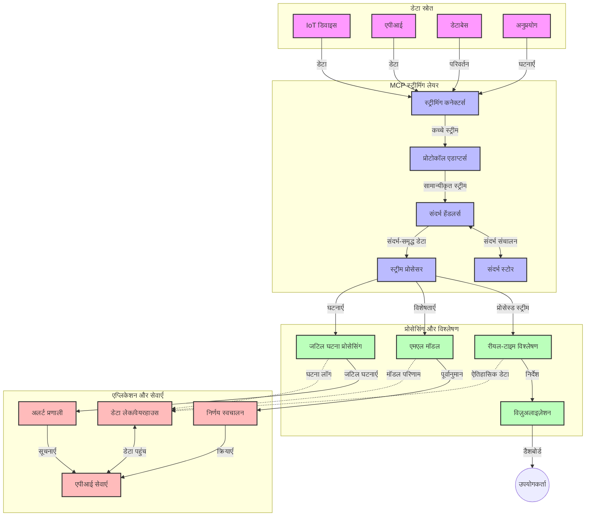

# रियल-टाइम डेटा स्ट्रीमिंग के लिए मॉडल कॉन्टेक्स्ट प्रोटोकॉल

## अवलोकन

आज के डेटा-संचालित विश्व में, जहाँ व्यवसायों और अनुप्रयोगों को तात्कालिक निर्णय लेने के लिए तुरंत सूचना की आवश्यकता होती है, रियल-टाइम डेटा स्ट्रीमिंग अनिवार्य हो गया है। मॉडल कॉन्टेक्स्ट प्रोटोकॉल (MCP) रियल-टाइम स्ट्रीमिंग प्रक्रियाओं के अनुकूलन में एक महत्वपूर्ण उन्नति का प्रतिनिधित्व करता है, जो डेटा प्रोसेसिंग की दक्षता बढ़ाता है, संदर्भीय अखंडता बनाए रखता है, और समग्र सिस्टम प्रदर्शन को सुधारता है।

यह मॉड्यूल यह पता लगाता है कि MCP कैसे AI मॉडल, स्ट्रीमिंग प्लेटफार्मों और अनुप्रयोगों के बीच संदर्भ प्रबंधन के लिए एक मानकीकृत दृष्टिकोण प्रदान करके रियल-टाइम डेटा स्ट्रीमिंग को बदलता है।

## रियल-टाइम डेटा स्ट्रीमिंग का परिचय

रियल-टाइम डेटा स्ट्रीमिंग एक तकनीकी सिद्धांत है जो डेटा के उत्पादित होते ही उसके निरंतर स्थानांतरण, प्रसंस्करण और विश्लेषण को सक्षम बनाता है, जिससे सिस्टम नई जानकारी पर तुरंत प्रतिक्रिया दे सकें। पारंपरिक बैच प्रोसेसिंग के विपरीत, जो स्थिर डेटा सेट पर काम करता है, स्ट्रीमिंग डेटा को गतिमान अवस्था में संसाधित करता है, न्यूनतम विलंबता के साथ जानकारी और क्रियाएँ प्रदान करता है।

### रियल-टाइम डेटा स्ट्रीमिंग के मूल सिद्धांत:

- **सतत डेटा प्रवाह**: डेटा को घटनाओं या रिकॉर्ड्स की अंतहीन धारा के रूप में लगातार संसाधित किया जाता है।
- **कम विलंबता प्रोसेसिंग**: सिस्टम डेटा उत्पन्न होने और संसाधित होने के बीच के समय को न्यूनतम रखने के लिए डिज़ाइन किए गए हैं।
- **विस्तारशीलता**: स्ट्रीमिंग वास्तुकला को विविध डेटा मात्रा और वेग को संभालने में सक्षम होना चाहिए।
- **त्रुटि सहिष्णुता**: सिस्टम को विफलताओं के प्रति लचीला होना चाहिए ताकि डेटा प्रवाह बाधित न हो।
- **स्थिति-आधारित प्रोसेसिंग**: महत्वपूर्ण विश्लेषण के लिए घटनाओं के बीच संदर्भ बनाए रखना आवश्यक है।

### मॉडल कॉन्टेक्स्ट प्रोटोकॉल और रियल-टाइम स्ट्रीमिंग

मॉडल कॉन्टेक्स्ट प्रोटोकॉल (MCP) रियल-टाइम स्ट्रीमिंग वातावरण में कई महत्वपूर्ण चुनौतियों को संबोधित करता है:

1. **संदर्भीय निरंतरता**: MCP वितरित स्ट्रीमिंग घटकों में संदर्भ कैसे बनाए रखा जाता है, इसे मानकीकृत करता है, जिससे AI मॉडल और प्रोसेसिंग नोड्स को प्रासंगिक ऐतिहासिक और पर्यावरणीय संदर्भ तक पहुंच सुनिश्चित होती है।

2. **कुशल स्थिति प्रबंधन**: संदर्भ संचरण के लिए संरचित तंत्र प्रदान करके, MCP स्ट्रीमिंग पाइपलाइनों में स्थिति प्रबंधन के ओवरहेड को कम करता है।

3. **इंटरऑपरेबिलिटी**: MCP विभिन्न स्ट्रीमिंग तकनीकों और AI मॉडल के बीच संदर्भ साझा करने के लिए एक सामान्य भाषा बनाता है, जिससे अधिक लचीली और विस्तारित वास्तुकला संभव होती है।

4. **स्ट्रीमिंग-उन्मुख संदर्भ**: MCP कार्यान्वयन उन संदर्भ तत्वों को प्राथमिकता दे सकते हैं जो रियल-टाइम निर्णय लेने के लिए सबसे प्रासंगिक हैं, प्रदर्शन और सटीकता दोनों के लिए अनुकूलित।

5. **अनुकूली प्रोसेसिंग**: MCP के माध्यम से उचित संदर्भ प्रबंधन के साथ, स्ट्रीमिंग सिस्टम डेटा में विकसित होती स्थितियों और पैटर्न के आधार पर प्रोसेसिंग को गतिशील रूप से समायोजित कर सकते हैं।

आधुनिक अनुप्रयोगों में, जो IoT सेंसर नेटवर्क से लेकर वित्तीय ट्रेडिंग प्लेटफ़ॉर्म तक फैलते हैं, MCP का स्ट्रीमिंग तकनीकों के साथ एकीकरण अधिक बुद्धिमान, संदर्भ-सचेत प्रोसेसिंग सक्षम करता है जो जटिल, विकसित होती परिस्थितियों में उचित रूप से प्रतिक्रिया दे सकता है।

## सीखने के उद्देश्य

इस पाठ के अंत तक, आप सक्षम होंगे:

- रियल-टाइम डेटा स्ट्रीमिंग के मूलभूत सिद्धांतों और चुनौतियों को समझना
- समझाना कि मॉडल कॉन्टेक्स्ट प्रोटोकॉल (MCP) रियल-टाइम डेटा स्ट्रीमिंग को कैसे बेहतर बनाता है
- Kafka और Pulsar जैसे लोकप्रिय फ्रेमवर्क का उपयोग करके MCP-आधारित स्ट्रीमिंग समाधान लागू करना
- MCP के साथ त्रुटि सहिष्णु, उच्च-प्रदर्शन स्ट्रीमिंग आर्किटेक्चर डिजाइन और तैनात करना
- MCP अवधारणाओं को IoT, वित्तीय ट्रेडिंग, और AI-चालित विश्लेषिकी के उपयोग मामलों में लागू करना
- MCP-आधारित स्ट्रीमिंग तकनीकों में उभरते रुझानों और भविष्य की नवाचारों का मूल्यांकन करना


### परिभाषा और महत्व

रियल-टाइम डेटा स्ट्रीमिंग डेटा के निरंतर उत्पादन, प्रसंस्करण, और न्यूनतम विलंबता के साथ वितरण को शामिल करता है। बैच प्रोसेसिंग में जहां डेटा समूहों में एकत्र और संसाधित होता है, स्ट्रीमिंग डेटा आते ही वृद्धिशील रूप से संसाधित होता है, जिससे तत्काल अन्वेषण और कार्य संभव होते हैं।

रियल-टाइम डेटा स्ट्रीमिंग की मुख्य विशेषताएँ:

- **कम विलंबता**: मिलीसेकंड से सेकंड के भीतर डेटा का प्रोसेसिंग और विश्लेषण
- **सतत प्रवाह**: विभिन्न स्रोतों से डेटा की बिना रुके स्ट्रीम
- **तत्काल प्रोसेसिंग**: डेटा को बैच में प्रोसेस करने के बजाय जैसे ही आता है विश्लेषण करना
- **इवेंट-चालित वास्तुकला**: जैसे ही घटनाएँ होती हैं, उनका त्वरित जवाब देना

### पारंपरिक डेटा स्ट्रीमिंग की चुनौतियाँ

पारंपरिक डेटा स्ट्रीमिंग विधियों में कई सीमाएं हैं:

1. **संदर्भ हानि**: वितरित सिस्टमों में संदर्भ बनाए रखने में कठिनाई
2. **विस्तारशीलता समस्याएँ**: उच्च मात्रा और उच्च वेग वाले डेटा को संभालने में चुनौतियाँ
3. **एकीकरण जटिलता**: विभिन्न सिस्टमों के बीच इंटरऑपरेबिलिटी में समस्याएँ
4. **विलंबता प्रबंधन**: थ्रूपुट और प्रोसेसिंग समय के बीच संतुलन बनाना
5. **डेटा संगति**: स्ट्रीम में डेटा की सटीकता और पूर्णता सुनिश्चित करना

## मॉडल कॉन्टेक्स्ट प्रोटोकॉल (MCP) को समझना

### MCP क्या है?

मॉडल कॉन्टेक्स्ट प्रोटोकॉल (MCP) एक मानकीकृत संचार प्रोटोकॉल है जो AI मॉडल और अनुप्रयोगों के बीच कुशल इंटरैक्शन को सुविधाजनक बनाता है। रियल-टाइम डेटा स्ट्रीमिंग के संदर्भ में, MCP एक रूपरेखा प्रदान करता है जो:

- डेटा पाइपलाइन के माध्यम से संदर्भ बनाए रखता है
- डेटा विनिमय प्रारूपों को मानकीकृत करता है
- बड़े डेटा सेट के संप्रेषण को अनुकूलित करता है
- मॉडल-टू-मॉडल और मॉडल-टू-एप्लिकेशन संचार को बढ़ावा देता है

### मुख्य घटक और वास्तुकला

रियल-टाइम स्ट्रीमिंग के लिए MCP वास्तुकला में कई मुख्य घटक होते हैं:

1. **संदर्भ हैंडलर्स**: स्ट्रीमिंग पाइपलाइन के संपूर्ण संदर्भीय जानकारी का प्रबंधन और रखरखाव करते हैं
2. **स्ट्रीम प्रोसेसर**: संदर्भ-सचेत तकनीकों का उपयोग करके आने वाले डेटा स्ट्रीम को संसाधित करते हैं
3. **प्रोटोकॉल एडाप्टर**: विभिन्न स्ट्रीमिंग प्रोटोकॉल के बीच संदर्भ बनाए रखते हुए रूपांतरण करते हैं
4. **संदर्भ स्टोर**: संदर्भीय जानकारी को प्रभावी ढंग से संग्रहीत और पुनः प्राप्त करता है
5. **स्ट्रीमिंग कनेक्टर्स**: विभिन्न स्ट्रीमिंग प्लेटफ़ॉर्म से कनेक्ट करते हैं (Kafka, Pulsar, Kinesis, आदि)



### MCP रियल-टाइम डेटा हैंडलिंग को कैसे सुधारता है

MCP पारंपरिक स्ट्रीमिंग चुनौतियों का समाधान करता है:

- **संदर्भीय अखंडता**: संपूर्ण पाइपलाइन में डेटा बिंदुओं के बीच संबंध बनाए रखना
- **संचरण का अनुकूलन**: बुद्धिमान संदर्भ प्रबंधन के माध्यम से डेटा विनिमय में पुनरावृत्ति कम करना
- **मानकीकृत इंटरफ़ेस**: स्ट्रीमिंग घटकों के लिए सुसंगत API प्रदान करना
- **कम विलंबता**: कुशल संदर्भ हैंडलिंग के माध्यम से प्रोसेसिंग ओवरहेड को न्यूनतम करना
- **सुधारित विस्तारशीलता**: संदर्भ बनाए रखते हुए क्षैतिज विस्तार का समर्थन करना

## एकीकरण और कार्यान्वयन

रियल-टाइम डेटा स्ट्रीमिंग सिस्टमों को प्रदर्शन और संदर्भीय अखंडता दोनों बनाए रखने के लिए सावधानीपूर्वक वास्तुकला डिज़ाइन और कार्यान्वयन की आवश्यकता होती है। मॉडल कॉन्टेक्स्ट प्रोटोकॉल AI मॉडल और स्ट्रीमिंग तकनीकों के एकीकरण के लिए एक मानकीकृत दृष्टिकोण प्रदान करता है, जिससे अधिक परिष्कृत, संदर्भ-सचेत प्रोसेसिंग पाइपलाइनों की अनुमति मिलती है।

### स्ट्रीमिंग आर्किटेक्चर में MCP एकीकरण का अवलोकन

रियल-टाइम स्ट्रीमिंग वातावरण में MCP को लागू करते समय कई महत्वपूर्ण विचार होते हैं:

1. **संदर्भ सीरियलाइज़ेशन और ट्रांसपोर्ट**: MCP संदर्भीय जानकारी को स्ट्रीमिंग डेटा पैकेटों के भीतर एन्कोड करने के लिए कुशल तंत्र प्रदान करता है, यह सुनिश्चित करते हुए कि आवश्यक संदर्भ पूरे प्रोसेसिंग पाइपलाइन में डेटा के साथ चलता रहे। इसमें स्ट्रीमिंग ट्रांसपोर्ट के लिए अनुकूलित मानकीकृत सीरियलाइज़ेशन प्रारूप शामिल हैं।

2. **स्थिति-आधारित स्ट्रीम प्रोसेसिंग**: MCP स्थिर संदर्भ प्रस्तुति बनाए रखकर अधिक बुद्धिमान स्थिति-आधारित प्रोसेसिंग की अनुमति देता है। यह विशेष रूप से वितरित स्ट्रीमिंग आर्किटेक्चर में मूल्यवान है जहाँ स्थिति प्रबंधन पारंपरिक रूप से चुनौतीपूर्ण होता है।

3. **इवेंट-टाइम बनाम प्रोसेसिंग-टाइम**: MCP स्ट्रीमिंग सिस्टमों में सामान्य चुनौती को संबोधित करता है कि घटनाएँ कब हुईं और कब प्रोसेस की गईं। प्रोटोकॉल ऐसे कालिक संदर्भ को समाहित कर सकता है जो इवेंट टाइम सेमॅन्टिक्स बनाए रखता है।

4. **बैकप्रेशर प्रबंधन**: संदर्भ हैंडलिंग को मानकीकृत करके, MCP स्ट्रीमिंग सिस्टम में बैकप्रेशर प्रबंधन में मदद करता है, जिससे घटक अपनी प्रोसेसिंग क्षमता संवाद कर सकें और प्रवाह के अनुसार समायोजित कर सकें।

5. **संदर्भ विंडोइंग और एग्रीगेशन**: MCP कालिक और संबंधपरक संदर्भों के संरचित प्रस्तुतिकरण प्रदान करके अधिक परिष्कृत विंडोइंग ऑपरेशनों को संभव बनाता है, जिससे इवेंट स्ट्रीम्स के पार अधिक सार्थक समेकन हो।

6. **एक्सैक्टली-वन प्रोसेसिंग**: उन स्ट्रीमिंग सिस्टमों में जिन्हें बिल्कुल-एक semantics चाहिए, MCP प्रोसेसिंग मेटाडेटा को शामिल कर सकता है जो वितरित घटकों में प्रोसेसिंग की स्थिति को ट्रैक और सत्यापित करने में मदद करता है।

विभिन्न स्ट्रीमिंग तकनीकों में MCP के कार्यान्वयन से संदर्भ प्रबंधन के लिए एकीकृत दृष्टिकोण बनता है, जो कस्टम एकीकरण कोड की आवश्यकता को कम करता है, जबकि डेटा पाइपलाइन के माध्यम से संदर्भ बनाए रखने में सिस्टम की क्षमता को बढ़ाता है।

### विभिन्न डेटा स्ट्रीमिंग फ्रेमवर्क में MCP

ये उदाहरण वर्तमान MCP विनिर्देश का पालन करते हैं जो JSON-RPC आधारित प्रोटोकॉल पर केंद्रित है जिसमें विशिष्ट ट्रांसपोर्ट तंत्र शामिल हैं। कोड दिखाता है कि आप कैसे कस्टम ट्रांसपोर्ट लागू कर सकते हैं जो Kafka और Pulsar जैसे स्ट्रीमिंग प्लेटफॉर्म को MCP प्रोटोकॉल के साथ पूर्ण संगतता के साथ एकीकृत करते हैं।

ये उदाहरण दिखाते हैं कि कैसे स्ट्रीमिंग प्लेटफॉर्म को MCP के साथ जोड़ा जा सकता है ताकि रियल-टाइम डेटा प्रोसेसिंग के साथ MCP के संदर्भ-सचेतता को संरक्षित किया जा सके। यह दृष्टिकोण सुनिश्चित करता है कि कोड नमूने MCP विनिर्देश की जून 2025 तक की वर्तमान स्थिति को सही रूप में दर्शाते हैं।

MCP को लोकप्रिय स्ट्रीमिंग फ्रेमवर्क के साथ एकीकृत किया जा सकता है जिनमें शामिल हैं:

#### Apache Kafka एकीकरण

```python
import asyncio
import json
from typing import Dict, Any, Optional
from confluent_kafka import Consumer, Producer, KafkaError
from mcp.client import Client, ClientCapabilities
from mcp.core.message import JsonRpcMessage
from mcp.core.transports import Transport

# MCP को Kafka के साथ जोड़ने के लिए कस्टम ट्रांसपोर्ट क्लास
class KafkaMCPTransport(Transport):
    def __init__(self, bootstrap_servers: str, input_topic: str, output_topic: str):
        self.bootstrap_servers = bootstrap_servers
        self.input_topic = input_topic
        self.output_topic = output_topic
        self.producer = Producer({'bootstrap.servers': bootstrap_servers})
        self.consumer = Consumer({
            'bootstrap.servers': bootstrap_servers,
            'group.id': 'mcp-client-group',
            'auto.offset.reset': 'earliest'
        })
        self.message_queue = asyncio.Queue()
        self.running = False
        self.consumer_task = None
        
    async def connect(self):
        """Connect to Kafka and start consuming messages"""
        self.consumer.subscribe([self.input_topic])
        self.running = True
        self.consumer_task = asyncio.create_task(self._consume_messages())
        return self
        
    async def _consume_messages(self):
        """Background task to consume messages from Kafka and queue them for processing"""
        while self.running:
            try:
                msg = self.consumer.poll(1.0)
                if msg is None:
                    await asyncio.sleep(0.1)
                    continue
                
                if msg.error():
                    if msg.error().code() == KafkaError._PARTITION_EOF:
                        continue
                    print(f"Consumer error: {msg.error()}")
                    continue
                
                # संदेश मान को JSON-RPC के रूप में पार्स करें
                try:
                    message_str = msg.value().decode('utf-8')
                    message_data = json.loads(message_str)
                    mcp_message = JsonRpcMessage.from_dict(message_data)
                    await self.message_queue.put(mcp_message)
                except Exception as e:
                    print(f"Error parsing message: {e}")
            except Exception as e:
                print(f"Error in consumer loop: {e}")
                await asyncio.sleep(1)
    
    async def read(self) -> Optional[JsonRpcMessage]:
        """Read the next message from the queue"""
        try:
            message = await self.message_queue.get()
            return message
        except Exception as e:
            print(f"Error reading message: {e}")
            return None
    
    async def write(self, message: JsonRpcMessage) -> None:
        """Write a message to the Kafka output topic"""
        try:
            message_json = json.dumps(message.to_dict())
            self.producer.produce(
                self.output_topic,
                message_json.encode('utf-8'),
                callback=self._delivery_report
            )
            self.producer.poll(0)  # कॉलबैक ट्रिगर करें
        except Exception as e:
            print(f"Error writing message: {e}")
    
    def _delivery_report(self, err, msg):
        """Kafka producer delivery callback"""
        if err is not None:
            print(f'Message delivery failed: {err}')
        else:
            print(f'Message delivered to {msg.topic()} [{msg.partition()}]')
    
    async def close(self) -> None:
        """Close the transport"""
        self.running = False
        if self.consumer_task:
            self.consumer_task.cancel()
            try:
                await self.consumer_task
            except asyncio.CancelledError:
                pass
        self.consumer.close()
        self.producer.flush()

# Kafka MCP ट्रांसपोर्ट का उदाहरण उपयोग
async def kafka_mcp_example():
    # Kafka ट्रांसपोर्ट के साथ MCP क्लाइंट बनाएं
    client = Client(
        {"name": "kafka-mcp-client", "version": "1.0.0"},
        ClientCapabilities({})
    )
    
    # Kafka ट्रांसपोर्ट बनाएं और कनेक्ट करें
    transport = KafkaMCPTransport(
        bootstrap_servers="localhost:9092",
        input_topic="mcp-responses",
        output_topic="mcp-requests"
    )
    
    await client.connect(transport)
    
    try:
        # MCP सत्र को प्रारंभ करें
        await client.initialize()
        
        # MCP के माध्यम से टूल निष्पादित करने का उदाहरण
        response = await client.execute_tool(
            "process_data",
            {
                "data": "sample data",
                "metadata": {
                    "source": "sensor-1",
                    "timestamp": "2025-06-12T10:30:00Z"
                }
            }
        )
        
        print(f"Tool execution response: {response}")
        
        # साफ-सुथरी शटडाउन
        await client.shutdown()
    finally:
        await transport.close()

# उदाहरण चलाएं
if __name__ == "__main__":
    asyncio.run(kafka_mcp_example())
```

#### Apache Pulsar कार्यान्वयन

```python
import asyncio
import json
import pulsar
from typing import Dict, Any, Optional
from mcp.core.message import JsonRpcMessage
from mcp.core.transports import Transport
from mcp.server import Server, ServerOptions
from mcp.server.tools import Tool, ToolExecutionContext, ToolMetadata

# एक कस्टम MCP ट्रांसपोर्ट बनाएं जो पल्सर का उपयोग करता है
class PulsarMCPTransport(Transport):
    def __init__(self, service_url: str, request_topic: str, response_topic: str):
        self.service_url = service_url
        self.request_topic = request_topic
        self.response_topic = response_topic
        self.client = pulsar.Client(service_url)
        self.producer = self.client.create_producer(response_topic)
        self.consumer = self.client.subscribe(
            request_topic,
            "mcp-server-subscription",
            consumer_type=pulsar.ConsumerType.Shared
        )
        self.message_queue = asyncio.Queue()
        self.running = False
        self.consumer_task = None
    
    async def connect(self):
        """Connect to Pulsar and start consuming messages"""
        self.running = True
        self.consumer_task = asyncio.create_task(self._consume_messages())
        return self
    
    async def _consume_messages(self):
        """Background task to consume messages from Pulsar and queue them for processing"""
        while self.running:
            try:
                # टाइमआउट के साथ नॉन-ब्लॉकिंग रिसीव
                msg = self.consumer.receive(timeout_millis=500)
                
                # संदेश को प्रोसेस करें
                try:
                    message_str = msg.data().decode('utf-8')
                    message_data = json.loads(message_str)
                    mcp_message = JsonRpcMessage.from_dict(message_data)
                    await self.message_queue.put(mcp_message)
                    
                    # संदेश को पुष्ट करें
                    self.consumer.acknowledge(msg)
                except Exception as e:
                    print(f"Error processing message: {e}")
                    # यदि कोई त्रुटि हुई तो नेगेटिव अक्कनॉलेज करें
                    self.consumer.negative_acknowledge(msg)
            except Exception as e:
                # टाइमआउट या अन्य अपवादों को संभालें
                await asyncio.sleep(0.1)
    
    async def read(self) -> Optional[JsonRpcMessage]:
        """Read the next message from the queue"""
        try:
            message = await self.message_queue.get()
            return message
        except Exception as e:
            print(f"Error reading message: {e}")
            return None
    
    async def write(self, message: JsonRpcMessage) -> None:
        """Write a message to the Pulsar output topic"""
        try:
            message_json = json.dumps(message.to_dict())
            self.producer.send(message_json.encode('utf-8'))
        except Exception as e:
            print(f"Error writing message: {e}")
    
    async def close(self) -> None:
        """Close the transport"""
        self.running = False
        if self.consumer_task:
            self.consumer_task.cancel()
            try:
                await self.consumer_task
            except asyncio.CancelledError:
                pass
        self.consumer.close()
        self.producer.close()
        self.client.close()

# एक नमूना MCP टूल परिभाषित करें जो स्ट्रीमिंग डेटा को प्रोसेस करता है
@Tool(
    name="process_streaming_data",
    description="Process streaming data with context preservation",
    metadata=ToolMetadata(
        required_capabilities=["streaming"]
    )
)
async def process_streaming_data(
    ctx: ToolExecutionContext,
    data: str,
    source: str,
    priority: str = "medium"
) -> Dict[str, Any]:
    """
    Process streaming data while preserving context
    
    Args:
        ctx: Tool execution context
        data: The data to process
        source: The source of the data
        priority: Priority level (low, medium, high)
        
    Returns:
        Dict containing processed results and context information
    """
    # MCP संदर्भ का उपयोग करने वाला उदाहरण प्रोसेसिंग
    print(f"Processing data from {source} with priority {priority}")
    
    # MCP से वार्तालाप संदर्भ तक पहुंचें
    conversation_id = ctx.conversation_id if hasattr(ctx, 'conversation_id') else "unknown"
    
    # संवर्धित संदर्भ के साथ परिणाम लौटाएं
    return {
        "processed_data": f"Processed: {data}",
        "context": {
            "conversation_id": conversation_id,
            "source": source,
            "priority": priority,
            "processing_timestamp": ctx.get_current_time_iso()
        }
    }

# पल्सर ट्रांसपोर्ट का उपयोग करते हुए MCP सर्वर का उदाहरण कार्यान्वयन
async def run_mcp_server_with_pulsar():
    # MCP सर्वर बनाएं
    server = Server(
        {"name": "pulsar-mcp-server", "version": "1.0.0"},
        ServerOptions(
            capabilities={"streaming": True}
        )
    )
    
    # हमारे टूल को पंजीकृत करें
    server.register_tool(process_streaming_data)
    
    # पल्सर ट्रांसपोर्ट बनाएं और कनेक्ट करें
    transport = PulsarMCPTransport(
        service_url="pulsar://localhost:6650",
        request_topic="mcp-requests",
        response_topic="mcp-responses"
    )
    
    try:
        # पल्सर ट्रांसपोर्ट के साथ सर्वर शुरू करें
        await server.run(transport)
    finally:
        await transport.close()

# सर्वर चलाएँ
if __name__ == "__main__":
    asyncio.run(run_mcp_server_with_pulsar())
```

### तैनाती के लिए सर्वोत्तम प्रथाएँ

जब MCP को रियल-टाइम स्ट्रीमिंग के लिए लागू करें:

1. **त्रुटि सहिष्णुता के लिए डिज़ाइन करें**:
   - उचित त्रुटि प्रबंधन लागू करें
   - विफल संदेशों के लिए डेड-लेटर कतारों का उपयोग करें
   - आइडेम्पोटेंट प्रोसेसर डिज़ाइन करें

2. **प्रदर्शन के लिए अनुकूलित करें**:
   - उपयुक्त बफ़र आकार सेट करें
   - जहां आवश्यक हो, बैचिंग का उपयोग करें
   - बैकप्रेशर तंत्र लागू करें

3. **निगरानी और अवलोकन करें**:
   - स्ट्रीम प्रोसेसिंग मेट्रिक्स ट्रैक करें
   - संदर्भ संचरण की निगरानी करें
   - असामान्यताओं के लिए अलर्ट सेट करें

4. **अपने स्ट्रीम सुरक्षित रखें**:
   - संवेदनशील डेटा के लिए एन्क्रिप्शन लागू करें
   - प्रमाणीकरण और प्राधिकरण का उपयोग करें
   - उचित पहुँच नियंत्रण लागू करें


### IoT और एज कंप्यूटिंग में MCP

MCP IoT स्ट्रीमिंग को बेहतर बनाता है:

- प्रोसेसिंग पाइपलाइन में डिवाइस संदर्भ बनाए रखना
- एज से क्लाउड तक कुशल डेटा स्ट्रीमिंग सक्षम करना
- IoT डेटा स्ट्रीम पर रियल-टाइम विश्लेषिकी का समर्थन करना
- संदर्भ के साथ डिवाइस-टू-डिवाइस संचार को सुविधाजनक बनाना

उदाहरण: स्मार्ट सिटी सेंसर नेटवर्क
```
Sensors → Edge Gateways → MCP Stream Processors → Real-time Analytics → Automated Responses
```

### वित्तीय लेनदेन और उच्च-आवृत्ति ट्रेडिंग में भूमिका

MCP वित्तीय डेटा स्ट्रीमिंग के लिए महत्वपूर्ण फायदे प्रदान करता है:

- ट्रेडिंग निर्णयों के लिए अत्यंत कम विलंबता प्रोसेसिंग
- पूरी प्रोसेसिंग में लेनदेन संदर्भ बनाए रखना
- संदर्भीय जागरूकता के साथ जटिल इवेंट प्रोसेसिंग का समर्थन
- वितरित ट्रेडिंग सिस्टमों में डेटा संगति सुनिश्चित करना

### AI-चालित डेटा विश्लेषिकी में सुधार

MCP स्ट्रीमिंग विश्लेषण के लिए नई संभावनाएं बनाता है:

- रियल-टाइम मॉडल प्रशिक्षण और निष्कर्षण
- स्ट्रीमिंग डेटा से सतत शिक्षण
- संदर्भ-सचेत फीचर निष्कर्षण
- संरक्षित संदर्भ के साथ मल्टी-मॉडल निष्कर्ष पाइपलाइंस

## भविष्य के रुझान और नवाचार

### रियल-टाइम वातावरण में MCP का विकास

आगे देखते हुए, हम उम्मीद करते हैं कि MCP निम्नलिखित को संबोधित करेगा:

- **क्वांटम कंप्यूटिंग एकीकरण**: क्वांटम-आधारित स्ट्रीमिंग सिस्टम के लिए तैयारी
- **एज-नेटिव प्रोसेसिंग**: अधिक संदर्भ-सचेत प्रोसेसिंग एज डिवाइसों पर स्थानांतरित करना
- **स्वायत्त स्ट्रीम प्रबंधन**: स्वयं-अनुकूलित स्ट्रीमिंग पाइपलाइंस
- **संघटक स्ट्रीमिंग**: गोपनीयता बनाए रखते हुए वितरित प्रोसेसिंग

### प्रौद्योगिकी में संभावित उन्नयन

नव विकसित तकनीकें जो MCP स्ट्रीमिंग के भविष्य को आकार देंगी:

1. **AI-उन्मुख स्ट्रीमिंग प्रोटोकॉल**: AI कार्यभार के लिए विशेष रूप से डिजाइन किए गए कस्टम प्रोटोकॉल
2. **न्यूरोमॉर्फिक कंप्यूटिंग एकीकरण**: स्ट्रीम प्रोसेसिंग के लिए मस्तिष्क-प्रेरित कंप्यूटिंग
3. **सरवरलेस स्ट्रीमिंग**: इन्फ्रास्ट्रक्चर प्रबंधन के बिना इवेंट-चालित, मापनीय स्ट्रीमिंग
4. **वितरित संदर्भ स्टोर**: विश्वव्यापी रूप से वितरित लेकिन अत्यधिक संगत संदर्भ प्रबंधन

## प्रायोगिक अभ्यास

### अभ्यास 1: बुनियादी MCP स्ट्रीमिंग पाइपलाइन सेटअप करना

इस अभ्यास में, आप सीखेंगे कि:
- एक बुनियादी MCP स्ट्रीमिंग पर्यावरण को कॉन्फ़िगर करना
- स्ट्रीम प्रोसेसिंग के लिए संदर्भ हैंडलर लागू करना
- संदर्भ संरक्षण का परीक्षण और सत्यापन

### अभ्यास 2: रियल-टाइम एनालिटिक्स डैशबोर्ड बनाना

एक पूर्ण अनुप्रयोग बनाएं जो:
- MCP का उपयोग करके स्ट्रीमिंग डेटा ग्रहण करता है
- संदर्भ बनाए रखते हुए स्ट्रीम को प्रोसेस करता है
- रियल-टाइम में परिणामों को दृश्यमान बनाता है

### अभ्यास 3: MCP के साथ जटिल इवेंट प्रोसेसिंग लागू करना

उन्नत अभ्यास जिसमें शामिल हैं:
- स्ट्रीम्स में पैटर्न डिटेक्शन
- कई स्ट्रीम्स में संदर्भीय सहसंबंध
- संरक्षित संदर्भ के साथ जटिल घटनाओं को उत्पन्न करना

## अतिरिक्त संसाधन

- [Model Context Protocol Specification](https://modelcontextprotocol.io) - आधिकारिक MCP विनिर्देश और प्रलेखन
- [Apache Kafka Documentation](https://kafka.apache.org/documentation/) - स्ट्रीम प्रोसेसिंग के लिए Kafka के बारे में जानें
- [Apache Pulsar](https://pulsar.apache.org/) - एकीकृत संदेश और स्ट्रीमिंग प्लेटफ़ॉर्म
- [Streaming Systems: The What, Where, When, and How of Large-Scale Data Processing](https://www.oreilly.com/library/view/streaming-systems/9781491983867/) - स्ट्रीमिंग वास्तुकला पर व्यापक पुस्तक
- [Microsoft Azure Event Hubs](https://learn.microsoft.com/azure/event-hubs/event-hubs-about) - प्रबंधित इवेंट स्ट्रीमिंग सेवा
- [MLflow Documentation](https://mlflow.org/docs/latest/index.html) - ML मॉडल ट्रैकिंग और तैनाती के लिए
- [Real-Time Analytics with Apache Storm](https://storm.apache.org/releases/current/index.html) - रियल-टाइम गणना के लिए प्रोसेसिंग फ्रेमवर्क
- [Flink ML](https://nightlies.apache.org/flink/flink-ml-docs-master/) - Apache Flink के लिए मशीन लर्निंग पुस्तकालय
- [LangChain Documentation](https://python.langchain.com/docs/get_started/introduction) - LLM के साथ अनुप्रयोग निर्माण

## सीखने के परिणाम

इस मॉड्यूल को पूरा करके, आप सक्षम होंगे:

- रियल-टाइम डेटा स्ट्रीमिंग के मूल तथ्य और चुनौतियाँ समझना
- समझाना कि मॉडल कॉन्टेक्स्ट प्रोटोकॉल (MCP) रियल-टाइम डेटा स्ट्रीमिंग को कैसे बेहतर बनाता है
- Kafka और Pulsar जैसे लोकप्रिय फ्रेमवर्क का उपयोग करके MCP-आधारित स्ट्रीमिंग समाधान लागू करना
- MCP के साथ त्रुटि सहिष्णु, उच्च-प्रदर्शन स्ट्रीमिंग वास्तुकला डिजाइन और तैनात करना
- MCP अवधारणाओं को IoT, वित्तीय ट्रेडिंग, और AI-चालित विश्लेषिकी के उपयोग मामलों में लागू करना
- MCP-आधारित स्ट्रीमिंग तकनीकों में उभरते रुझानों और भविष्य के नवाचारों का मूल्यांकन करना

## आगे क्या है

- [5.11 रियलटाइम सर्च](../mcp-realtimesearch/README.md)

---

<!-- CO-OP TRANSLATOR DISCLAIMER START -->
**अस्वीकरण**:
इस दस्तावेज़ का अनुवाद AI अनुवाद सेवा [Co-op Translator](https://github.com/Azure/co-op-translator) का उपयोग करके किया गया है। जबकि हम सटीकता के लिए प्रयास करते हैं, कृपया ध्यान दें कि स्वचालित अनुवादों में त्रुटियाँ या अशुद्धियाँ हो सकती हैं। मूल दस्तावेज़ अपनी मूल भाषा में ही प्रामाणिक स्रोत माना जाना चाहिए। महत्वपूर्ण जानकारी के लिए, पेशेवर मानव अनुवाद की सिफारिश की जाती है। इस अनुवाद के उपयोग से उत्पन्न किसी भी गलतफहमी या गलत व्याख्या के लिए हम उत्तरदायी नहीं हैं।
<!-- CO-OP TRANSLATOR DISCLAIMER END -->