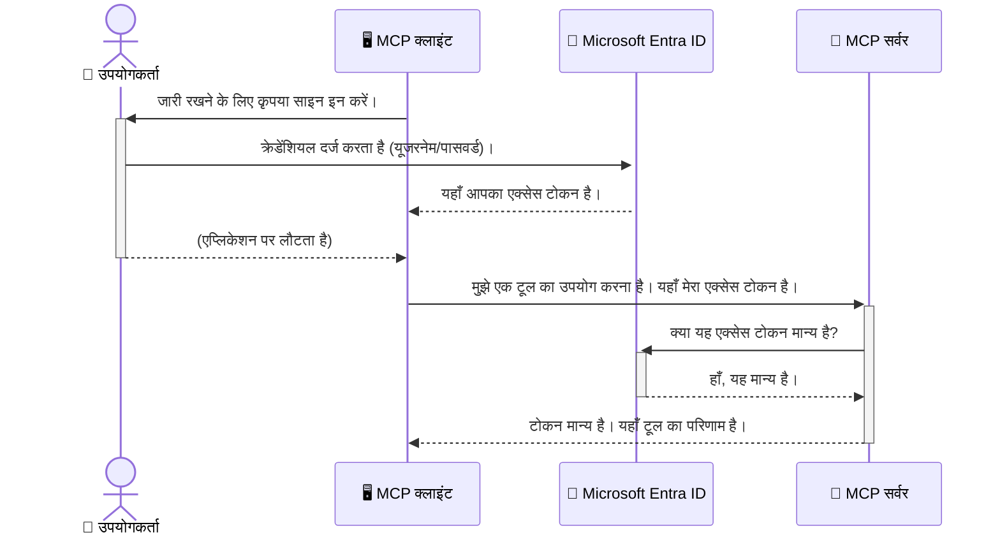

# AI वर्कफ़्लो को सुरक्षित करना: मॉडल कॉन्टेक्स्ट प्रोटोकॉल सर्वरों के लिए Entra ID प्रमाणीकरण

## परिचय
अपने मॉडल कॉन्टेक्स्ट प्रोटोकॉल (MCP) सर्वर को सुरक्षित करना ठीक वैसा ही है जैसे आप अपने घर के मुख्य दरवाज़े को लॉक करते हैं। अपना MCP सर्वर खुला छोड़ना आपके उपकरणों और डेटा को अस्वीकृत पहुँच के लिए उजागर कर देता है, जिससे सुरक्षा उल्लंघन हो सकते हैं। Microsoft Entra ID एक मजबूत क्लाउड-आधारित पहचान और पहुँच प्रबंधन समाधान प्रदान करता है, जो केवल अधिकृत उपयोगकर्ताओं और एप्लिकेशन को आपके MCP सर्वर से संवाद करने की अनुमति देता है। इस अनुभाग में, आप सीखेंगे कि Entra ID प्रमाणीकरण का उपयोग करके अपने AI वर्कफ़्लो को कैसे सुरक्षित करें।

## सीखने के उद्देश्य
इस अनुभाग के अंत तक, आप सक्षम होंगे:

- MCP सर्वरों को सुरक्षित रखने के महत्व को समझना।
- Microsoft Entra ID और OAuth 2.0 प्रमाणीकरण की मूल बातें समझाना।
- सार्वजनिक और गोपनीय क्लाइंट के बीच अंतर को पहचानना।
- स्थानीय (सार्वजनिक क्लाइंट) और दूरस्थ (गोपनीय क्लाइंट) MCP सर्वर परिदृश्यों में Entra ID प्रमाणीकरण लागू करना।
- AI वर्कफ़्लो विकसित करते समय सुरक्षा सर्वोत्तम प्रथाओं को लागू करना।

## सुरक्षा और MCP

जैसे आप अपने घर का मुख्य दरवाजा खुला नहीं छोड़ते, वैसे ही आपको अपने MCP सर्वर को भी किसी के लिए खुला नहीं छोड़ना चाहिए। अपने AI वर्कफ़्लो को सुरक्षित रखना मजबूत, विश्वसनीय और सुरक्षित ऐप्लिकेशन बनाने के लिए आवश्यक है। इस अध्याय में, हम आपको Microsoft Entra ID का उपयोग करके अपने MCP सर्वर को सुरक्षित करने का तरीका बताएंगे, जिससे केवल अधिकृत उपयोगकर्ता और एप्लिकेशन ही आपके उपकरण और डेटा से संवाद कर सकें।

## MCP सर्वरों के लिए सुरक्षा क्यों महत्वपूर्ण है

कल्पना करें कि आपके MCP सर्वर में एक टूल है जो ईमेल भेज सकता है या ग्राहक डेटाबेस तक पहुंच सकता है। यदि सर्वर असुरक्षित है, तो कोई भी वह टूल इस्तेमाल कर सकता है, जिससे अनधिकारिक डेटा की पहुंच, स्पैम, या अन्य दुर्भावनापूर्ण गतिविधियां हो सकती हैं।

प्रमाणीकरण लागू करके, आप यह सुनिश्चित करते हैं कि आपके सर्वर को हर अनुरोध सत्यापित किया गया है, जो उस उपयोगकर्ता या एप्लिकेशन की पहचान की पुष्टि करता है जो अनुरोध कर रहा है। यह आपके AI वर्कफ़्लो को सुरक्षित करने का पहला और सबसे महत्वपूर्ण कदम है।

## Microsoft Entra ID का परिचय

[**Microsoft Entra ID**](https://adoption.microsoft.com/microsoft-security/entra/) एक क्लाउड-आधारित पहचान और पहुँच प्रबंधन सेवा है। इसे अपने ऐप्लिकेशन के लिए एक सार्वभौमिक सुरक्षा गार्ड की तरह समझें। यह उपयोगकर्ता पहचान (प्रमाणीकरण) की जांच और तय करता है कि उन्हें क्या करने की अनुमति है (प्राधिकरण)।

Entra ID का उपयोग करके, आप:

- उपयोगकर्ताओं के लिए सुरक्षित साइन-इन सक्षम कर सकते हैं।
- API और सेवाओं की सुरक्षा कर सकते हैं।
- केंद्रीय स्थान से पहुँच नीति प्रबंधित कर सकते हैं।

MCP सर्वरों के लिए, Entra ID एक मजबूत और व्यापक रूप से विश्वसनीय समाधान प्रदान करता है जो यह प्रबंधित करता है कि कौन आपके सर्वर की क्षमताओं तक पहुँच सकता है।

---

## जादू को समझना: Entra ID प्रमाणीकरण कैसे काम करता है

Entra ID प्रमाणीकरण के लिए **OAuth 2.0** जैसे खुले मानकों का उपयोग करता है। जबकि विवरण जटिल हो सकते हैं, इसका मूल विचार सरल है और एक उपमा से समझा जा सकता है।

### OAuth 2.0 का सहज परिचय: वैलेट कुंजी

OAuth 2.0 को अपनी कार के लिए एक वैलेट सेवा की तरह सोचें। जब आप किसी रेस्तरां पहुंचते हैं, तो आप वैलेट को अपनी मास्टर चाबी नहीं देते। इसके बजाय, आप एक **वैलेट कुंजी** देते हैं जिसमें सीमित अनुमतियां होती हैं—यह कार स्टार्ट कर सकता है और दरवाज़े लॉक कर सकता है, लेकिन ट्रंक या दस्ताने के डिब्बे को खोल नहीं सकता।

इस उपमा में:

- **आप** हैं **उपयोगकर्ता**।
- **आपकी कार** है **MCP सर्वर** जिसमें उसके मूल्यवान उपकरण और डेटा हैं।
- **वैलेट** है **Microsoft Entra ID**।
- **पार्किंग अटेंडेंट** है **MCP क्लाइंट** (सर्वर का उपयोग करने वाला एप्लिकेशन)।
- **वैलेट कुंजी** है **एक्सेस टोकन**।

एक्सेस टोकन एक सुरक्षित टेक्स्ट स्ट्रिंग है जो MCP क्लाइंट को Entra ID से साइन-इन के बाद मिलता है। क्लाइंट तब इस टोकन को MCP सर्वर को हर अनुरोध के साथ प्रस्तुत करता है। सर्वर टोकन की पुष्टि कर सकता है ताकि अनुरोध वैध हो और क्लाइंट के पास आवश्यक अनुमतियां हों, और ऐसा करते समय आपको अपनी वास्तविक क्रेडेंशियल्स (जैसे पासवर्ड) संभालने की जरूरत नहीं होती।

### प्रमाणीकरण प्रवाह

यहां व्यावहारिक रूप से यह प्रक्रिया कैसे काम करती है:



### Microsoft Authentication Library (MSAL) का परिचय

कोड में जाने से पहले, एक प्रमुख घटक से परिचय आवश्यक है जो आप उदाहरणों में देखेंगे: **Microsoft Authentication Library (MSAL)**।

MSAL एक लाइब्रेरी है जिसे Microsoft ने विकसित किया है जो डेवलपर्स के लिए प्रमाणीकरण को संभालना बहुत आसान बनाता है। सुरक्षा टोकन संभालने, साइन-इन प्रबंधन, और सत्र रीफ्रेश करने कोड लिखने के बजाय, MSAL यह सब भारी कार्य संभालता है।

MSAL का उपयोग करने की सिफारिश इसलिए की जाती है क्योंकि:

- **यह सुरक्षित है:** यह उद्योग मानकों के प्रोटोकॉल और सुरक्षा सर्वोत्तम प्रथाओं को लागू करता है, जिससे आपके कोड में कमजोरियों का जोखिम कम होता है।
- **यह विकास को सरल बनाता है:** OAuth 2.0 और OpenID Connect प्रोटोकॉल की जटिलता को छुपाता है, जिससे आप कुछ ही कोड लाइनों में मजबूत प्रमाणीकरण जोड़ सकते हैं।
- **यह मेंटेन किया जाता है:** Microsoft इसे सक्रिय रूप से सुरक्षा खतरों और प्लेटफ़ॉर्म परिवर्तनों के अनुसार अपडेट करता रहता है।

MSAL .NET, JavaScript/TypeScript, Python, Java, Go, और iOS व Android जैसे मोबाइल प्लेटफॉर्म सहित कई भाषाओं और ऐप्लिकेशन ढांचों का समर्थन करता है। इसका मतलब है कि आप अपनी पूरी तकनीकी स्टैक में एक समान प्रमाणीकरण पैटर्न का उपयोग कर सकते हैं।

MSAL के बारे में अधिक जानने के लिए, आप आधिकारिक [MSAL अवलोकन दस्तावेज़](https://learn.microsoft.com/entra/identity-platform/msal-overview) देख सकते हैं।

---

## Entra ID के साथ अपने MCP सर्वर को सुरक्षित करना: चरण-दर-चरण मार्गदर्शन

अब, चलिए वे चरण देखते हैं जिनसे आप Entra ID का उपयोग करके एक स्थानीय MCP सर्वर (जो `stdio` के माध्यम से संवाद करता है) को सुरक्षित कर सकते हैं। यह उदाहरण एक **सार्वजनिक क्लाइंट** का उपयोग करता है, जो उपयोगकर्ता की मशीन पर चलने वाले एप्लिकेशन जैसे डेस्कटॉप ऐप या स्थानीय विकास सर्वर के लिए उपयुक्त है।

### परिदृश्य 1: स्थानीय MCP सर्वर को सुरक्षित करना (सार्वजनिक क्लाइंट के साथ)

इस परिदृश्य में, हम एक ऐसे MCP सर्वर को देखते हैं जो स्थानीय रूप से चल रहा है, `stdio` के माध्यम से संवाद करता है, और उपयोगकर्ता को इसके उपकरणों तक पहुँचने से पहले प्रमाणित करने के लिए Entra ID का उपयोग करता है। सर्वर में एक टूल होगा जो Microsoft Graph API से उपयोगकर्ता की प्रोफ़ाइल जानकारी प्राप्त करता है।

#### 1. Entra ID में एप्लिकेशन सेट करना

कोई कोड लिखने से पहले, आपको अपने एप्लिकेशन को Microsoft Entra ID में रजिस्टर करना होगा। यह Entra ID को आपके एप्लिकेशन के बारे में बताता है और प्रमाणीकरण सेवा का उपयोग करने की अनुमति देता है।

1. **[Microsoft Entra पोर्टल](https://entra.microsoft.com/)** पर जाएं।
2. **App registrations** पर जाएं और **New registration** पर क्लिक करें।
3. अपने एप्लिकेशन को एक नाम दें (जैसे, "My Local MCP Server")।
4. **Supported account types** के तहत, केवल **Accounts in this organizational directory only** चुनें।
5. इस उदाहरण के लिए **Redirect URI** खाली छोड़ सकते हैं।
6. **Register** पर क्लिक करें।

रजिस्टर होने के बाद, **Application (client) ID** और **Directory (tenant) ID** नोट करें। आपको इन्हें कोड में उपयोग करना होगा।

#### 2. कोड: एक विखंडन

आइए प्रमाणीकरण नियंत्रित करने वाले कोड के प्रमुख भाग देखें। इस उदाहरण के लिए पूरा कोड [Entra ID - Local - WAM](https://github.com/Azure-Samples/mcp-auth-servers/tree/main/src/entra-id-local-wam) फ़ोल्डर में [mcp-auth-servers GitHub रिपॉजिटरी](https://github.com/Azure-Samples/mcp-auth-servers) में उपलब्ध है।

**`AuthenticationService.cs`**

यह क्लास Entra ID के साथ बातचीत को संभालती है।

- **`CreateAsync`**: यह MSAL (Microsoft Authentication Library) से `PublicClientApplication` को इनिशियलाइज़ करता है। इसे आपके एप्लिकेशन के `clientId` और `tenantId` के साथ कॉन्फ़िगर किया गया है।
- **`WithBroker`**: यह एक ब्रोकर के उपयोग को सक्षम करता है (जैसे Windows Web Account Manager), जो अधिक सुरक्षित और सहज एकल साइन-ऑन अनुभव प्रदान करता है।
- **`AcquireTokenAsync`**: यह मुख्य विधि है। यह पहले चुपचाप एक टोकन प्राप्त करने की कोशिश करता है (यानि उपयोगकर्ता को फिर से साइन-इन करने की आवश्यकता नहीं होती यदि उनका सत्र वैध है)। यदि चुपचाप टोकन प्राप्त नहीं हो पाता, तो यह उपयोगकर्ता को इंटरैक्टिव रूप से साइन-इन करने का संकेत देता है।

```csharp
// Simplified for clarity
public static async Task<AuthenticationService> CreateAsync(ILogger<AuthenticationService> logger)
{
    var msalClient = PublicClientApplicationBuilder
        .Create(_clientId) // Your Application (client) ID
        .WithAuthority(AadAuthorityAudience.AzureAdMyOrg)
        .WithTenantId(_tenantId) // Your Directory (tenant) ID
        .WithBroker(new BrokerOptions(BrokerOptions.OperatingSystems.Windows))
        .Build();

    // ... cache registration ...

    return new AuthenticationService(logger, msalClient);
}

public async Task<string> AcquireTokenAsync()
{
    try
    {
        // Try silent authentication first
        var accounts = await _msalClient.GetAccountsAsync();
        var account = accounts.FirstOrDefault();

        AuthenticationResult? result = null;

        if (account != null)
        {
            result = await _msalClient.AcquireTokenSilent(_scopes, account).ExecuteAsync();
        }
        else
        {
            // If no account, or silent fails, go interactive
            result = await _msalClient.AcquireTokenInteractive(_scopes).ExecuteAsync();
        }

        return result.AccessToken;
    }
    catch (Exception ex)
    {
        _logger.LogError(ex, "An error occurred while acquiring the token.");
        throw; // Optionally rethrow the exception for higher-level handling
    }
}
```

**`Program.cs`**

यहां MCP सर्वर सेटअप है और प्रमाणीकरण सेवा को एकीकृत किया गया है।

- **`AddSingleton<AuthenticationService>`**: यह `AuthenticationService` को डिपेंडेंसी इंजेक्शन कंटेनर में पंजीकृत करता है, ताकि इसे एप्लिकेशन के अन्य हिस्सों (जैसे हमारे टूल) द्वारा उपयोग किया जा सके।
- **`GetUserDetailsFromGraph` टूल**: इस टूल को `AuthenticationService` की एक प्रति चाहिए। इससे पहले कि यह कुछ करे, यह `authService.AcquireTokenAsync()` कॉल करता है ताकि एक मान्य एक्सेस टोकन प्राप्त किया जा सके। यदि प्रमाणीकरण सफल होता है, तो यह टोकन का उपयोग Microsoft Graph API को कॉल करने और उपयोगकर्ता के विवरण प्राप्त करने के लिए करता है।

```csharp
// Simplified for clarity
[McpServerTool(Name = "GetUserDetailsFromGraph")]
public static async Task<string> GetUserDetailsFromGraph(
    AuthenticationService authService)
{
    try
    {
        // This will trigger the authentication flow
        var accessToken = await authService.AcquireTokenAsync();

        // Use the token to create a GraphServiceClient
        var graphClient = new GraphServiceClient(
            new BaseBearerTokenAuthenticationProvider(new TokenProvider(authService)));

        var user = await graphClient.Me.GetAsync();

        return System.Text.Json.JsonSerializer.Serialize(user);
    }
    catch (Exception ex)
    {
        return $"Error: {ex.Message}";
    }
}
```

#### 3. पूरा संयोजन कैसे काम करता है

1. जब MCP क्लाइंट `GetUserDetailsFromGraph` टूल का उपयोग करने की कोशिश करता है, तो टूल पहले `AcquireTokenAsync` को कॉल करता है।
2. `AcquireTokenAsync` MSAL लाइब्रेरी को वैध टोकन खोजने के लिए ट्रिगर करता है।
3. यदि कोई टोकन नहीं मिलता, तो MSAL, ब्रोकर के माध्यम से, उपयोगकर्ता को उनके Entra ID खाते से साइन-इन करने के लिए कहेगा।
4. उपयोगकर्ता साइन-इन करता है, और Entra ID एक एक्सेस टोकन जारी करता है।
5. टूल टोकन प्राप्त करता है और Microsoft Graph API को एक सुरक्षित कॉल करता है।
6. उपयोगकर्ता का विवरण MCP क्लाइंट को लौटाया जाता है।

यह प्रक्रिया सुनिश्चित करती है कि केवल प्रमाणित उपयोगकर्ता ही टूल का उपयोग कर सकें, जिससे आपका स्थानीय MCP सर्वर प्रभावी ढंग से सुरक्षित हो जाता है।

### परिदृश्य 2: दूरस्थ MCP सर्वर को सुरक्षित करना (गोपनीय क्लाइंट के साथ)

जब आपका MCP सर्वर दूरस्थ मशीन (जैसे क्लाउड सर्वर) पर चलता है और HTTP Streaming जैसे प्रोटोकॉल के माध्यम से संवाद करता है, तब सुरक्षा आवश्यकताएँ भिन्न होती हैं। इस स्थिति में, आपको **गोपनीय क्लाइंट** और **Authorization Code Flow** का उपयोग करना चाहिए। यह एक अधिक सुरक्षित विधि है क्योंकि एप्लिकेशन के गुप्त जानकारी ब्राउज़र तक कभी खुलती नहीं।

यह उदाहरण TypeScript आधारित MCP सर्वर का उपयोग करता है जो HTTP अनुरोधों को संभालने के लिए Express.js का उपयोग करता है।

#### 1. Entra ID में एप्लिकेशन सेट करना

Entra ID में सेटअप सार्वजनिक क्लाइंट से मिलता-जुलता है, लेकिन एक महत्वपूर्ण अंतर है: आपको एक **क्लाइंट सीक्रेट** बनाना होगा।

1. **[Microsoft Entra पोर्टल](https://entra.microsoft.com/)** पर जाएं।
2. अपने ऐप रजिस्ट्रेशन में, **Certificates & secrets** टैब पर जाएं।
3. **New client secret** पर क्लिक करें, एक विवरण दें, और **Add** पर क्लिक करें।
4. **महत्वपूर्ण:** सीधे सीक्रेट मान को कॉपी करें। आप इसे बाद में नहीं देख पाएंगे।
5. आपको एक **Redirect URI** भी कॉन्फ़िगर करनी होगी। **Authentication** टैब पर जाएं, **Add a platform** पर क्लिक करें, **Web** चुनें, और अपने एप्लिकेशन के लिए रीडायरेक्ट URI दर्ज करें (जैसे `http://localhost:3001/auth/callback`)।

> **⚠️ महत्वपूर्ण सुरक्षा नोट:** उत्पादन एप्लिकेशन के लिए, Microsoft दृढ़ता से अनुशंसा करता है कि **क्लाइंट सीक्रेट** के बजाय **गुप्त रहित प्रमाणीकरण** जैसे **Managed Identity** या **Workload Identity Federation** का उपयोग किया जाए। क्लाइंट सीक्रेट सुरक्षा जोखिम पैदा करते हैं क्योंकि वे उजागर या समझौता किए जा सकते हैं। मैनेज्ड आइडेंटिटीज सुरक्षा बढ़ाती हैं क्योंकि इसके लिए आपके कोड या कॉन्फ़िगरेशन में क्रेडेंशियल्स संग्रहीत करने की आवश्यकता नहीं होती।
>
> मैनेज्ड आइडेंटिटीज और उन्हें लागू करने के लिए अधिक जानकारी हेतु देखें: [Managed identities for Azure resources overview](https://learn.microsoft.com/entra/identity/managed-identities-azure-resources/overview)।

#### 2. कोड: एक विखंडन

यह उदाहरण एक सत्र-आधारित दृष्टिकोण उपयोग करता है। जब उपयोगकर्ता प्रमाणित होता है, तो सर्वर एक्सेस टोकन और रिफ्रेश टोकन को एक सत्र में संग्रहीत करता है और उपयोगकर्ता को एक सत्र टोकन देता है। यह सत्र टोकन बाद के अनुरोधों के लिए उपयोग होता है। इस उदाहरण का पूरा कोड [Entra ID - Confidential client](https://github.com/Azure-Samples/mcp-auth-servers/tree/main/src/entra-id-cca-session) फ़ोल्डर में [mcp-auth-servers GitHub रिपॉजिटरी](https://github.com/Azure-Samples/mcp-auth-servers) में उपलब्ध है।

**`Server.ts`**

यह फ़ाइल Express सर्वर और MCP ट्रांसपोर्ट लेयर को सेटअप करती है।

- **`requireBearerAuth`**: यह एक मिडलवेयर है जो `/sse` और `/message` एंडपॉइंट्स की सुरक्षा करता है। यह अनुरोध के `Authorization` हेडर में एक वैध बेयरर टोकन की जांच करता है।
- **`EntraIdServerAuthProvider`**: यह एक कस्टम क्लास है जो `McpServerAuthorizationProvider` इंटरफेस को लागू करता है। यह OAuth 2.0 प्रवाह को संभालने के लिए जिम्मेदार है।
- **`/auth/callback`**: यह एंडपॉइंट Entra ID से उपयोगकर्ता के प्रमाणीकरण के बाद रीडायरेक्ट को संभालता है। यह ऑथराइजेशन कोड को एक्सेस टोकन और रिफ्रेश टोकन में बदल देता है।

```typescript
// स्पष्टता के लिए सरलित
const app = express();
const { server } = createServer();
const provider = new EntraIdServerAuthProvider();

// SSE एन्डपॉइंट की सुरक्षा करें
app.get("/sse", requireBearerAuth({
  provider,
  requiredScopes: ["User.Read"]
}), async (req, res) => {
  // ... परिवहन से कनेक्ट करें ...
});

// संदेश एन्डपॉइंट की सुरक्षा करें
app.post("/message", requireBearerAuth({
  provider,
  requiredScopes: ["User.Read"]
}), async (req, res) => {
  // ... संदेश को संभालें ...
});

// OAuth 2.0 कॉलबैक को संभालें
app.get("/auth/callback", (req, res) => {
  provider.handleCallback(req.query.code, req.query.state)
    .then(result => {
      // ... सफलता या विफलता को संभालें ...
    });
});
```

**`Tools.ts`**

यह फाइल MCP सर्वर द्वारा प्रदान किए गए टूल्स को परिभाषित करती है। `getUserDetails` टूल पिछले उदाहरण के समान है, लेकिन यह एक्सेस टोकन को सत्र से प्राप्त करता है।

```typescript
// स्पष्टता के लिए सरल किया गया
server.setRequestHandler(CallToolRequestSchema, async (request) => {
  const { name } = request.params;
  const context = request.params?.context as { token?: string } | undefined;
  const sessionToken = context?.token;

  if (name === ToolName.GET_USER_DETAILS) {
    if (!sessionToken) {
      throw new AuthenticationError("Authentication token is missing or invalid. Ensure the token is provided in the request context.");
    }

    // सेशन स्टोर से Entra ID टोकन प्राप्त करें
    const tokenData = tokenStore.getToken(sessionToken);
    const entraIdToken = tokenData.accessToken;

    const graphClient = Client.init({
      authProvider: (done) => {
        done(null, entraIdToken);
      }
    });

    const user = await graphClient.api('/me').get();

    // ... उपयोगकर्ता विवरण वापस करें ...
  }
});
```

**`auth/EntraIdServerAuthProvider.ts`**

यह क्लास निम्न कार्य करता है:

- उपयोगकर्ता को Entra ID साइन-इन पेज पर रीडायरेक्ट करना।
- ऑथराइजेशन कोड को एक्सेस टोकन में बदलना।
- टोकन को `tokenStore` में संग्रहीत करना।
- एक्सेस टोकन की अवधि समाप्त होने पर उसे रीफ्रेश करना।

#### 3. पूरा संयोजन कैसे काम करता है

1. जब कोई उपयोगकर्ता पहली बार MCP सर्वर से कनेक्ट होने की कोशिश करता है, तो `requireBearerAuth` मिडलवेयर देखेगा कि उसके पास वैध सत्र नहीं है और उसे Entra ID साइन-इन पेज पर रीडायरेक्ट कर देगा।
2. उपयोगकर्ता अपने Entra ID खाते से साइन-इन करता है।
3. Entra ID उपयोगकर्ता को `/auth/callback` अंत बिंदु पर एक प्राधिकरण कोड के साथ वापस भेजता है।  
4. सर्वर कोड का एक्सचेंज करता है एक एक्सेस टोकन और एक रिफ्रेश टोकन के लिए, उन्हें संग्रहीत करता है, और एक सेशन टोकन बनाता है जिसे क्लाइंट को भेजा जाता है।  
5. क्लाइंट अब इस सेशन टोकन का उपयोग `Authorization` हेडर में सभी भविष्य के अनुरोधों के लिए MCP सर्वर को कर सकता है।  
6. जब `getUserDetails` टूल को कॉल किया जाता है, तो यह सेशन टोकन का उपयोग करके Entra ID एक्सेस टोकन ढूंढता है और फिर इसका उपयोग Microsoft Graph API को कॉल करने के लिए करता है।  

यह प्रवाह सार्वजनिक क्लाइंट प्रवाह से अधिक जटिल है, लेकिन इंटरनेट-सामना करने वाले अंत बिंदुओं के लिए आवश्यक है। चूंकि रिमोट MCP सर्वर सार्वजनिक इंटरनेट के माध्यम से सुलभ हैं, उन्हें अनधिकृत पहुंच और संभावित हमलों से सुरक्षा के लिए मजबूत सुरक्षा उपाय चाहिए।  


## सुरक्षा सर्वोत्तम प्रथाएँ

- **हमेशा HTTPS का उपयोग करें**: क्लाइंट और सर्वर के बीच संचार को एन्क्रिप्ट करें ताकि टोकन को इंटरसेप्ट किए जाने से बचाया जा सके।  
- **रोल-आधारित एक्सेस कंट्रोल (RBAC) लागू करें**: केवल यह जांचें कि उपयोगकर्ता प्रमाणित है या नहीं; यह भी जांचें कि वह क्या करने के लिए अधिकृत है। आप Entra ID में रोल परिभाषित कर सकते हैं और उन्हें अपने MCP सर्वर में परख सकते हैं।  
- **मॉनिटर और ऑडिट करें**: सभी प्रमाणीकरण घटनाओं को लॉग करें ताकि आप संदिग्ध गतिविधि का पता लगा सकें और प्रतिक्रिया दे सकें।  
- **रेट लिमिटिंग और थ्रॉटलिंग को संभालें**: Microsoft Graph और अन्य APIs दुरुपयोग को रोकने के लिए रेट लिमिटिंग लागू करते हैं। अपने MCP सर्वर में एक्सपोनेंशियल बैकऑफ और रिट्राई लॉजिक लागू करें ताकि HTTP 429 (बहुत अधिक अनुरोध) प्रतिक्रियाओं को सहजता से संभाला जा सके। अक्सर एक्सेस किए जाने वाले डेटा को कैश करने पर विचार करें ताकि API कॉल कम हो सके।  
- **सुरक्षित टोकन संग्रहण**: एक्सेस टोकन और रिफ्रेश टोकन को सुरक्षित रूप से संग्रहीत करें। स्थानीय अनुप्रयोगों के लिए, सिस्टम के सुरक्षित संग्रहण तंत्र का उपयोग करें। सर्वर अनुप्रयोगों के लिए, एन्क्रिप्टेड संग्रहण या Azure Key Vault जैसे सुरक्षित कुंजी प्रबंधन सेवाओं को देखें।  
- **टोकन समाप्ति प्रबंधन**: एक्सेस टोकन की सीमित अवधि होती है। रिफ्रेश टोकन का उपयोग करके स्वचालित टोकन पुनः प्राप्ति लागू करें ताकि पुनः प्रमाणीकरण के बिना निर्बाध उपयोगकर्ता अनुभव बनाए रखा जा सके।  
- **Azure API Management उपयोग पर विचार करें**: जबकि सीधे MCP सर्वर में सुरक्षा लागू करना आपको सूक्ष्म नियंत्रण देता है, Azure API Management जैसे API गेटवे कई सुरक्षा चिंताओं को स्वचालित रूप से संभाल सकते हैं, जिनमें प्रमाणीकरण, प्राधिकरण, रेट लिमिटिंग, और मॉनिटरिंग शामिल हैं। ये आपके क्लाइंट्स और MCP सर्वर्स के बीच एक केंद्रीकृत सुरक्षा परत प्रदान करते हैं। MCP के साथ API गेटवे के उपयोग पर अधिक जानकारी के लिए देखें [Azure API Management Your Auth Gateway For MCP Servers](https://techcommunity.microsoft.com/blog/integrationsonazureblog/azure-api-management-your-auth-gateway-for-mcp-servers/4402690)।  


## मुख्य निष्कर्ष

- अपने MCP सर्वर की सुरक्षा आपके डेटा और टूल्स की सुरक्षा के लिए बहुत महत्वपूर्ण है।  
- Microsoft Entra ID प्रमाणीकरण और प्राधिकरण के लिए एक मजबूत और स्केलेबल समाधान प्रदान करता है।  
- स्थानीय अनुप्रयोगों के लिए **सार्वजनिक क्लाइंट** और रिमोट सर्वर्स के लिए **गोपनीय क्लाइंट** का उपयोग करें।  
- **Authorization Code Flow** वेब अनुप्रयोगों के लिए सबसे सुरक्षित विकल्प है।  


## अभ्यास

1. उस MCP सर्वर के बारे में सोचें जिसे आप बना सकते हैं। क्या यह एक स्थानीय सर्वर होगा या एक रिमोट सर्वर?  
2. अपने उत्तर के आधार पर, क्या आप सार्वजनिक या गोपनीय क्लाइंट का उपयोग करेंगे?  
3. Microsoft Graph के खिलाफ कार्रवाई करने के लिए आपका MCP सर्वर कौन-सा अनुमति मांगता?  


## व्यावहारिक अभ्यास

### अभ्यास 1: Entra ID में एक एप्लिकेशन पंजीकृत करें  
Microsoft Entra पोर्टल पर जाएं।  
अपने MCP सर्वर के लिए एक नया एप्लिकेशन पंजीकृत करें।  
एप्लिकेशन (क्लाइंट) ID और डायरेक्टरी (टेनेंट) ID को रिकॉर्ड करें।  

### अभ्यास 2: स्थानीय MCP सर्वर सुरक्षित करें (सार्वजनिक क्लाइंट)  
- उपयोगकर्ता प्रमाणीकरण के लिए MSAL (Microsoft Authentication Library) को एकीकृत करने के लिए कोड उदाहरण का पालन करें।  
- Microsoft Graph से उपयोगकर्ता विवरण प्राप्त करने वाले MCP टूल को कॉल करके प्रमाणीकरण प्रवाह का परीक्षण करें।  

### अभ्यास 3: रिमोट MCP सर्वर सुरक्षित करें (गोपनीय क्लाइंट)  
- Entra ID में एक गोपनीय क्लाइंट पंजीकृत करें और एक क्लाइंट सीक्रेट बनाएं।  
- अपने Express.js MCP सर्वर को Authorization Code Flow का उपयोग करने के लिए कॉन्फ़िगर करें।  
- सुरक्षित अंत बिंदुओं का परीक्षण करें और टोकन-आधारित पहुंच की पुष्टि करें।  

### अभ्यास 4: सुरक्षा सर्वोत्तम प्रथाओं को लागू करें  
- अपने स्थानीय या रिमोट सर्वर के लिए HTTPS सक्षम करें।  
- अपने सर्वर लॉजिक में रोल-आधारित एक्सेस कंट्रोल (RBAC) लागू करें।  
- टोकन समाप्ति प्रबंधन और सुरक्षित टोकन संग्रहण जोड़ें।  


## संसाधन

1. **MSAL अवलोकन दस्तावेज़ीकरण**  
   जानें कि Microsoft Authentication Library (MSAL) विभिन्न प्लेटफार्मों पर सुरक्षित टोकन प्राप्ति कैसे सक्षम करता है:  
   [MSAL Overview on Microsoft Learn](https://learn.microsoft.com/en-gb/entra/msal/overview)  

2. **Azure-Samples/mcp-auth-servers GitHub रिपॉजिटरी**  
   MCP सर्वर के प्रमाणन प्रवाह दिखाने वाले संदर्भ कार्यान्वयन:  
   [Azure-Samples/mcp-auth-servers on GitHub](https://github.com/Azure-Samples/mcp-auth-servers)  

3. **Azure संसाधनों के लिए Managed Identities अवलोकन**  
   समझें कि सिस्टम- या उपयोगकर्ता-आवंटित प्रबंधित पहचान का उपयोग करके कैसे सीक्रेट्स समाप्त किये जा सकते हैं:  
   [Managed Identities Overview on Microsoft Learn](https://learn.microsoft.com/en-us/entra/identity/managed-identities-azure-resources/)  

4. **Azure API Management: MCP सर्वर्स के लिए आपका Auth गेटवे**  
   MCP सर्वर्स के लिए एक सुरक्षित OAuth2 गेटवे के रूप में APIM के उपयोग में गहराई से:  
   [Azure API Management Your Auth Gateway For MCP Servers](https://techcommunity.microsoft.com/blog/integrationsonazureblog/azure-api-management-your-auth-gateway-for-mcp-servers/4402690)  

5. **Microsoft Graph अनुमतियों का संदर्भ**  
   Microsoft Graph के लिए प्रतिनिधि और एप्लिकेशन अनुमतियों की व्यापक सूची:  
   [Microsoft Graph Permissions Reference](https://learn.microsoft.com/zh-tw/graph/permissions-reference)  


## शिक्षण परिणाम  
इस खंड को पूरा करने के बाद, आप सक्षम होंगे:  

- स्पष्ट रूप से समझाएं कि MCP सर्वर और AI वर्कफ़्लोज़ के लिए प्रमाणीकरण क्यों महत्वपूर्ण है।  
- दोनों स्थानीय और रिमोट MCP सर्वर परिदृश्यों के लिए Entra ID प्रमाणीकरण सेटअप और कॉन्फ़िगर करें।  
- अपने सर्वर की तैनाती के आधार पर उपयुक्त क्लाइंट प्रकार (सार्वजनिक या गोपनीय) चुनें।  
- टोकन संग्रहण और रोल-आधारित प्राधिकरण सहित सुरक्षित कोडिंग प्रथाओं को लागू करें।  
- अपने MCP सर्वर और उसके टूल्स को अनधिकृत पहुंच से सुरक्षित रूप से बचाएं।  

## अगला कदम  

- [5.13 मॉडल कंटेक्स्ट प्रोटोकॉल (MCP) का Microsoft Foundry के साथ एकीकरण](../mcp-foundry-agent-integration/README.md)

---

<!-- CO-OP TRANSLATOR DISCLAIMER START -->
**अस्वीकरण**:
इस दस्तावेज़ का अनुवाद AI अनुवाद सेवा [Co-op Translator](https://github.com/Azure/co-op-translator) का उपयोग करके किया गया है। जबकि हम सटीकता के लिए प्रयास करते हैं, कृपया ध्यान दें कि स्वचालित अनुवादों में त्रुटियाँ या अशुद्धियाँ हो सकती हैं। मूल दस्तावेज़ अपनी मूल भाषा में ही प्रामाणिक स्रोत माना जाना चाहिए। महत्वपूर्ण जानकारी के लिए, पेशेवर मानव अनुवाद की सिफारिश की जाती है। इस अनुवाद के उपयोग से उत्पन्न किसी भी गलतफहमी या गलत व्याख्या के लिए हम उत्तरदायी नहीं हैं।
<!-- CO-OP TRANSLATOR DISCLAIMER END -->