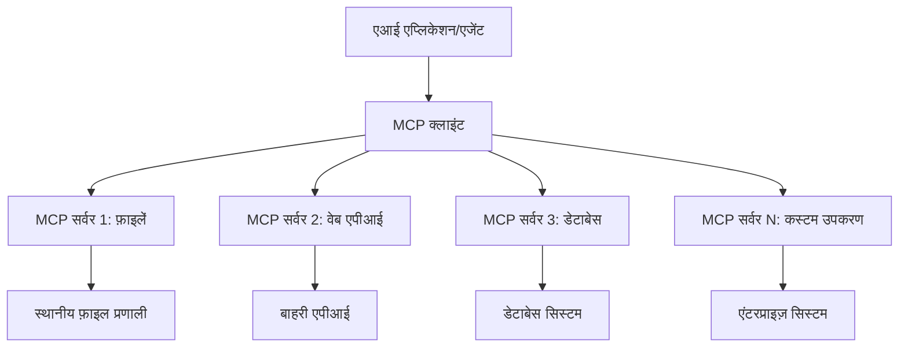

# 🌐 मॉड्यूल 2: Microsoft Foundry Toolkit Fundamentals के साथ MCP

[]()
[]()
[]()

## 📋 सीखने के उद्देश्य

इस मॉड्यूल के अंत तक, आप सक्षम होंगे:
- ✅ मॉडल कॉन्टेक्स्ट प्रोटोकॉल (MCP) आर्किटेक्चर और लाभों को समझना
- ✅ Microsoft के MCP सर्वर इकोसिस्टम का अन्वेषण करना
- ✅ Microsoft Foundry Toolkit एजेंट बिल्डर के साथ MCP सर्वरों का एकीकरण करना
- ✅ Playwright MCP का उपयोग करके एक कार्यशील ब्राउज़र ऑटोमेशन एजेंट बनाना
- ✅ अपने एजेंटों के भीतर MCP उपकरणों को कॉन्फ़िगर और परीक्षण करना
- ✅ उत्पादन उपयोग के लिए MCP-संचालित एजेंट का निर्यात और तैनाती करना

## 🎯 मॉड्यूल 1 पर निर्माण

मॉड्यूल 1 में, हमने Microsoft Foundry Toolkit की बुनियादी बातें सीखी और अपना पहला Python एजेंट बनाया। अब हम आपके एजेंटों को बाहरी उपकरणों और सेवाओं से जोड़कर उन्हें **सुपरचार्ज** करेंगे, वह भी क्रांतिकारी **मॉडल कॉन्टेक्स्ट प्रोटोकॉल (MCP)** के माध्यम से।

इसे ऐसे समझें जैसे एक बेसिक कैलकुलेटर से एक पूर्ण कंप्यूटर में अपग्रेड करना — आपके AI एजेंट सक्षम होंगे:
- 🌐 वेबसाइट ब्राउज़ और इंटरैक्ट कर सकेंगे
- 📁 फाइलों तक पहुँच और संसाधित कर सकेंगे
- 🔧 एंटरप्राइज सिस्टम्स के साथ इंटीग्रेट हो सकेंगे
- 📊 APIs से रियल-टाइम डेटा प्रोसेस कर सकेंगे

## 🧠 मॉडल कॉन्टेक्स्ट प्रोटोकॉल (MCP) को समझना

### 🔍 MCP क्या है?

मॉडल कॉन्टेक्स्ट प्रोटोकॉल (MCP) है **"AI अनुप्रयोगों के लिए USB-C"** — एक क्रांतिकारी खुला मानक जो बड़े भाषा मॉडल (LLMs) को बाहरी उपकरणों, डेटा स्रोतों और सेवाओं से जोड़ता है। जैसे USB-C ने केबल की जटिलता को खत्म किया एक सार्वभौमिक कनेक्टर प्रदान करके, MCP AI इंटीग्रेशन की जटिलता को एक मानकीकृत प्रोटोकॉल के माध्यम से समाप्त करता है।

### 🎯 MCP द्वारा हल की गई समस्या

**MCP से पहले:**
- 🔧 हर उपकरण के लिए कस्टम इंटीग्रेशन
- 🔄 मालिकाना समाधान के कारण विक्रेता पर निर्भरता  
- 🔒 अनियमित कनेक्शनों से सुरक्षा जोखिम
- ⏱️ बुनियादी इंटीग्रेशन के लिए महीनों का विकास

**MCP के साथ:**
- ⚡ प्लग-एंड-प्ले उपकरण इंटीग्रेशन
- 🔄 विक्रेता-स्वतंत्र आर्किटेक्चर
- 🛡️ सुरक्षितता के सर्वोत्तम अभ्यास अंतर्निहित
- 🚀 नई क्षमताएँ जोड़ने के लिए मिनटों का समय

### 🏗️ MCP आर्किटेक्चर की गहन जानकारी

MCP एक **क्लाइंट-सर्वर आर्किटेक्चर** का पालन करता है जो एक सुरक्षित, विस्तार योग्य इकोसिस्टम बनाता है:



**🔧 मुख्य घटक:**

| घटक | भूमिका | उदाहरण |
|-----------|------|----------|
| **MCP होस्ट** | MCP सेवाएँ उपभोग करने वाले अनुप्रयोग | Claude Desktop, VS Code, Microsoft Foundry Toolkit |
| **MCP क्लाइंट्स** | प्रोटोकॉल हैंडलर (सर्वर के साथ 1:1) | होस्ट अनुप्रयोगों में अंतर्निर्मित |
| **MCP सर्वर** | मानक प्रोटोकॉल के माध्यम से क्षमताएं प्रदान करते हैं | Playwright, Files, Azure, GitHub |
| **ट्रांसपोर्ट लेयर** | संचार के तरीके | stdio, HTTP, WebSockets |


## 🏢 Microsoft का MCP सर्वर इकोसिस्टम

Microsoft MCP इकोसिस्टम का नेतृत्व करता है एक व्यापक एंटरप्राइज-ग्रेड सर्वर सूट के साथ जो वास्तविक व्यावसायिक आवश्यकताओं को संबोधित करता है।

### 🌟 प्रमुख Microsoft MCP सर्वर

#### 1. ☁️ Azure MCP सर्वर
**🔗 रिपॉजिटरी**: [azure/azure-mcp](https://github.com/azure/azure-mcp)
**🎯 उद्देश्य**: AI इंटीग्रेशन के साथ व्यापक Azure संसाधन प्रबंधन

**✨ प्रमुख विशेषताएं:**
- घोषणात्मक बुनियादी ढांचा प्रावधान
- वास्तविक समय संसाधन निगरानी
- लागत अनुकूलन सिफारिशें
- सुरक्षा अनुपालन जांच

**🚀 उपयोग के मामले:**
- AI सहायता के साथ Infrastructure-as-Code
- स्वचालित संसाधन स्केलिंग
- क्लाउड लागत अनुकूलन
- DevOps वर्कफ़्लो ऑटोमेशन

#### 2. 📊 Microsoft Dataverse MCP
**📚 दस्तावेज़ीकरण**: [Microsoft Dataverse Integration](https://go.microsoft.com/fwlink/?linkid=2320176)
**🎯 उद्देश्य**: व्यवसाय डेटा के लिए प्राकृतिक भाषा इंटरफ़ेस

**✨ प्रमुख विशेषताएं:**
- प्राकृतिक भाषा में डेटाबेस क्वेरी
- व्यावसायिक संदर्भ की समझ
- कस्टम प्रॉम्प्ट टेम्प्लेट
- एंटरप्राइज डेटा शासन

**🚀 उपयोग के मामले:**
- व्यावसायिक बुद्धिमत्ता रिपोर्टिंग
- ग्राहक डेटा विश्लेषण
- बिक्री पाइपलाइन अंतर्दृष्टि
- अनुपालन डेटा क्वेरी

#### 3. 🌐 Playwright MCP सर्वर
**🔗 रिपॉजिटरी**: [microsoft/playwright-mcp](https://github.com/microsoft/playwright-mcp)
**🎯 उद्देश्य**: ब्राउज़र ऑटोमेशन और वेब इंटरैक्शन क्षमताएँ

**✨ प्रमुख विशेषताएं:**
- क्रॉस-ब्राउज़र ऑटोमेशन (Chrome, Firefox, Safari)
- बुद्धिमान एलिमेंट डिटेक्शन
- स्क्रीनशॉट और PDF जनरेशन
- नेटवर्क ट्रैफ़िक मॉनिटरिंग

**🚀 उपयोग के मामले:**
- स्वचालित परीक्षण वर्कफ़्लो
- वेब स्क्रैपिंग और डेटा निष्कर्षण
- UI/UX मॉनिटरिंग
- प्रतिस्पर्धात्मक विश्लेषण ऑटोमेशन

#### 4. 📁 Files MCP सर्वर
**🔗 रिपॉजिटरी**: [microsoft/files-mcp-server](https://github.com/microsoft/files-mcp-server)
**🎯 उद्देश्य**: बुद्धिमान फ़ाइल सिस्टम ऑपरेशन

**✨ प्रमुख विशेषताएं:**
- घोषणात्मक फ़ाइल प्रबंधन
- सामग्री समन्वयन
- संस्करण नियंत्रण एकीकरण
- मेटाडेटा निष्कर्षण

**🚀 उपयोग के मामले:**
- दस्तावेज़ प्रबंधन
- कोड रिपॉजिटरी संगठन
- सामग्री प्रकाशन वर्कफ़्लो
- डेटा पाइपलाइन फ़ाइल प्रबंधन

#### 5. 📝 MarkItDown MCP सर्वर
**🔗 रिपॉजिटरी**: [microsoft/markitdown](https://github.com/microsoft/markitdown)
**🎯 उद्देश्य**: उन्नत मार्कडाउन प्रोसेसिंग और हेरफेर

**✨ प्रमुख विशेषताएं:**
- समृद्ध मार्कडाउन पार्सिंग
- फॉर्मेट रूपांतरण (MD ↔ HTML ↔ PDF)
- सामग्री संरचना विश्लेषण
- टेम्पलेट प्रोसेसिंग

**🚀 उपयोग के मामले:**
- तकनीकी दस्तावेज़ वर्कफ़्लो
- सामग्री प्रबंधन सिस्टम
- रिपोर्ट पीढ़ी
- नॉलेज बेस ऑटोमेशन

#### 6. 📈 Clarity MCP सर्वर
**📦 पैकेज**: [@microsoft/clarity-mcp-server](https://www.npmjs.com/package/@microsoft/clarity-mcp-server)
**🎯 उद्देश्य**: वेब एनालिटिक्स और उपयोगकर्ता व्यवहार अंतर्दृष्टि

**✨ प्रमुख विशेषताएं:**
- हीटमैप डेटा विश्लेषण
- उपयोगकर्ता सत्र रिकॉर्डिंग
- प्रदर्शन मेट्रिक्स
- कन्वरजन फ़नल विश्लेषण

**🚀 उपयोग के मामले:**
- वेबसाइट अनुकूलन
- उपयोगकर्ता अनुभव अनुसंधान
- A/B परीक्षण विश्लेषण
- व्यावसायिक बुद्धिमत्ता डैशबोर्ड

### 🌍 समुदाय इकोसिस्टम

Microsoft के सर्वरों के अलावा, MCP इकोसिस्टम में शामिल हैं:
- **🐙 GitHub MCP**: रिपॉजिटरी प्रबंधन और कोड विश्लेषण
- **🗄️ डेटाबेस MCPs**: PostgreSQL, MySQL, MongoDB एकीकरण
- **☁️ क्लाउड प्रदाता MCPs**: AWS, GCP, Digital Ocean उपकरण
- **📧 संचार MCPs**: Slack, Teams, Email इंटीग्रेशन

## 🛠️ हैंड्स-ऑन लैब: ब्राउज़र ऑटोमेशन एजेंट बनाना

**🎯 परियोजना का लक्ष्य**: Playwright MCP सर्वर का उपयोग करके एक बुद्धिमान ब्राउज़र ऑटोमेशन एजेंट बनाएं जो वेबसाइटों को नेविगेट कर सके, जानकारी निकाल सके, और जटिल वेब इंटरैक्शन कर सके।

### 🚀 चरण 1: एजेंट की स्थापना

#### चरण 1: अपना एजेंट प्रारंभ करें
1. **Microsoft Foundry Toolkit Agent Builder खोलें**
2. **नया एजेंट बनाएँ** निम्न कॉन्फ़िगरेशन के साथ:
   - **नाम**: `BrowserAgent`
   - **मॉडल**: GPT-4o चुनें


### 🔧 चरण 2: MCP इंटीग्रेशन वर्कफ़्लो

#### चरण 3: MCP सर्वर इंटीग्रेशन जोड़ें
1. Agent Builder में **Tools सेक्शन** पर जाएं
2. **"Add Tool"** पर क्लिक करें ताकि इंटीग्रेशन मेनू खुल सके
3. उपलब्ध विकल्पों में से **"MCP Server"** चुनें


**🔍 टूल प्रकारों को समझना:**
- **Built-in Tools**: पूर्व-निर्धारित Microsoft Foundry Toolkit कार्यक्षमताएं
- **MCP Servers**: बाहरी सेवा इंटीग्रेशन
- **Custom APIs**: आपकी अपनी सेवा एंडपॉइंट्स
- **Function Calling**: सीधे मॉडल फंक्शन पहुंच

#### चरण 4: MCP सर्वर चयन
1. आगे बढ़ने के लिए **"MCP Server"** विकल्प चुनें  


2. उपलब्ध इंटीग्रेशन देखने के लिए MCP कैटलॉग ब्राउज़ करें  


### 🎮 चरण 3: Playwright MCP कॉन्फ़िगरेशन

#### चरण 5: Playwright चुनें और कॉन्फ़िगर करें
1. Microsoft के सत्यापित सर्वरों तक पहुँचने के लिए **"Use Featured MCP Servers"** पर क्लिक करें
2. सुविधा सूची में से **"Playwright"** चुनें
3. डिफ़ॉल्ट MCP ID स्वीकार करें या अपने окружение के लिए अनुकूलित करें


#### चरण 6: Playwright क्षमताएँ सक्षम करें
**🔑 महत्वपूर्ण चरण**: अधिकतम कार्यक्षमता के लिए उपलब्ध सभी Playwright मेथड्स चुनें


**🛠️ आवश्यक Playwright टूल:**
- **नेविगेशन**: `goto`, `goBack`, `goForward`, `reload`
- **इंटरैक्शन**: `click`, `fill`, `press`, `hover`, `drag`
- **निष्कर्षण**: `textContent`, `innerHTML`, `getAttribute`
- **मान्यकरण**: `isVisible`, `isEnabled`, `waitForSelector`
- **कैप्चर**: `screenshot`, `pdf`, `video`
- **नेटवर्क**: `setExtraHTTPHeaders`, `route`, `waitForResponse`

#### चरण 7: इंटीग्रेशन सफलता का सत्यापन करें
**✅ सफलता संकेतक:**
- सभी टूल Agent Builder इंटरफ़ेस में दिख रहे हैं
- इंटीग्रेशन पैनल में कोई त्रुटि संदेश नहीं
- Playwright सर्वर स्टेटस "Connected" दिखाता है


**🔧 सामान्य समस्याओं का निवारण:**
- **कनेक्शन विफल**: इंटरनेट कनेक्शन और फ़ायरवॉल सेटिंग्स जांचें
- **टूल गायब**: सेटअप के दौरान सभी क्षमताएं चुनी गई हों यह सुनिश्चित करें
- **अनुमति त्रुटियाँ**: सुनिश्चित करें कि VS Code के पास आवश्यक सिस्टम अनुमतियाँ हैं

### 🎯 चरण 4: उन्नत प्रॉम्प्ट इंजीनियरिंग

#### चरण 8: बुद्धिमान सिस्टम प्रॉम्प्ट डिज़ाइन करें
Playwright की पूर्ण क्षमताओं का लाभ उठाने वाले परिष्कृत प्रॉम्प्ट बनाएं:

```markdown
# Web Automation Expert System Prompt

## Core Identity
You are an advanced web automation specialist with deep expertise in browser automation, web scraping, and user experience analysis. You have access to Playwright tools for comprehensive browser control.

## Capabilities & Approach
### Navigation Strategy
- Always start with screenshots to understand page layout
- Use semantic selectors (text content, labels) when possible
- Implement wait strategies for dynamic content
- Handle single-page applications (SPAs) effectively

### Error Handling
- Retry failed operations with exponential backoff
- Provide clear error descriptions and solutions
- Suggest alternative approaches when primary methods fail
- Always capture diagnostic screenshots on errors

### Data Extraction
- Extract structured data in JSON format when possible
- Provide confidence scores for extracted information
- Validate data completeness and accuracy
- Handle pagination and infinite scroll scenarios

### Reporting
- Include step-by-step execution logs
- Provide before/after screenshots for verification
- Suggest optimizations and alternative approaches
- Document any limitations or edge cases encountered

## Ethical Guidelines
- Respect robots.txt and rate limiting
- Avoid overloading target servers
- Only extract publicly available information
- Follow website terms of service
```

#### चरण 9: गतिशील उपयोगकर्ता प्रॉम्प्ट बनाएँ
विभिन्न क्षमताओं का प्रदर्शन करने वाले प्रॉम्प्ट डिज़ाइन करें:

**🌐 वेब विश्लेषण उदाहरण:**
```markdown
Navigate to github.com/kinfey and provide a comprehensive analysis including:
1. Repository structure and organization
2. Recent activity and contribution patterns  
3. Documentation quality assessment
4. Technology stack identification
5. Community engagement metrics
6. Notable projects and their purposes

Include screenshots at key steps and provide actionable insights.
```


### 🚀 चरण 5: निष्पादन और परीक्षण

#### चरण 10: अपनी पहली ऑटोमेशन निष्पादित करें
1. ऑटोमेशन अनुक्रम शुरू करने के लिए **"Run"** पर क्लिक करें
2. वास्तविक समय में निष्पादन मॉनिटर करें:
   - Chrome ब्राउज़र स्वतः लॉन्च होता है
   - एजेंट लक्ष्य वेबसाइट पर नेविगेट करता है
   - प्रमुख चरणों के स्क्रीनशॉट लिए जाते हैं
   - विश्लेषण के परिणाम रियल-टाइम स्ट्रीम में आते हैं


#### चरण 11: परिणामों और अंतर्दृष्टि का विश्लेषण करें
Agent Builder के इंटरफ़ेस में व्यापक विश्लेषण की समीक्षा करें:


### 🌟 चरण 6: उन्नत क्षमताएँ और तैनाती

#### चरण 12: निर्यात और उत्पादन तैनाती
Agent Builder कई तैनाती विकल्पों का समर्थन करता है:


## 🎓 मॉड्यूल 2 सारांश और आगे के कदम

### 🏆 उपलब्धि अनलॉक: MCP इंटीग्रेशन मास्टर

**✅ सीखी गई कौशल:**
- [ ] MCP आर्किटेक्चर और लाभों को समझना
- [ ] Microsoft के MCP सर्वर इकोसिस्टम का नेविगेशन
- [ ] Playwright MCP का Microsoft Foundry Toolkit के साथ इंटीग्रेशन
- [ ] परिष्कृत ब्राउज़र ऑटोमेशन एजेंट बनाना
- [ ] वेब ऑटोमेशन के लिए उन्नत प्रॉम्प्ट इंजीनियरिंग

### 📚 अतिरिक्त संसाधन

- **🔗 MCP विनिर्देशन**: [आधिकारिक प्रोटोकॉल दस्तावेज](https://modelcontextprotocol.io/)
- **🛠️ Playwright API**: [पूर्ण मेथड संदर्भ](https://playwright.dev/docs/api/class-playwright)
- **🏢 Microsoft MCP सर्वर**: [एंटरप्राइज इंटीग्रेशन गाइड](https://github.com/microsoft/mcp-servers)
- **🌍 समुदाय उदाहरण**: [MCP सर्वर गैलरी](https://github.com/modelcontextprotocol/servers)

**🎉 बधाई हो!** आपने सफलतापूर्वक MCP इंटीग्रेशन में महारत हासिल कर ली है और अब आप बाहरी उपकरण क्षमताओं वाले उत्पादन योग्य AI एजेंट बना सकते हैं!


### 🔜 अगले मॉड्यूल पर जारी रखें

अपनी MCP कौशल को अगले स्तर पर ले जाने के लिए तैयार हैं? आगे बढ़ें **[मॉड्यूल 3: Microsoft Foundry Toolkit के साथ उन्नत MCP विकास](../lab3/README.md)** जहाँ आप सीखेंगे:
- अपने कस्टम MCP सर्वर बनाना
- नवीनतम MCP Python SDK कॉन्फ़िगर और उपयोग करना
- डिबगिंग के लिए MCP इंस्पेक्टर सेटअप करना
- उन्नत MCP सर्वर विकास वर्कफ़्लोज़ में महारत हासिल करना
- स्क्रैच से एक Weather MCP सर्वर बनाना

---

<!-- CO-OP TRANSLATOR DISCLAIMER START -->
**अस्वीकरण**:
इस दस्तावेज़ का अनुवाद AI अनुवाद सेवा [Co-op Translator](https://github.com/Azure/co-op-translator) का उपयोग करके किया गया है। जबकि हम सटीकता के लिए प्रयास करते हैं, कृपया ध्यान दें कि स्वचालित अनुवादों में त्रुटियाँ या अशुद्धियाँ हो सकती हैं। मूल दस्तावेज़ अपनी मूल भाषा में ही प्रामाणिक स्रोत माना जाना चाहिए। महत्वपूर्ण जानकारी के लिए, पेशेवर मानव अनुवाद की सिफारिश की जाती है। इस अनुवाद के उपयोग से उत्पन्न किसी भी गलतफहमी या गलत व्याख्या के लिए हम उत्तरदायी नहीं हैं।
<!-- CO-OP TRANSLATOR DISCLAIMER END -->