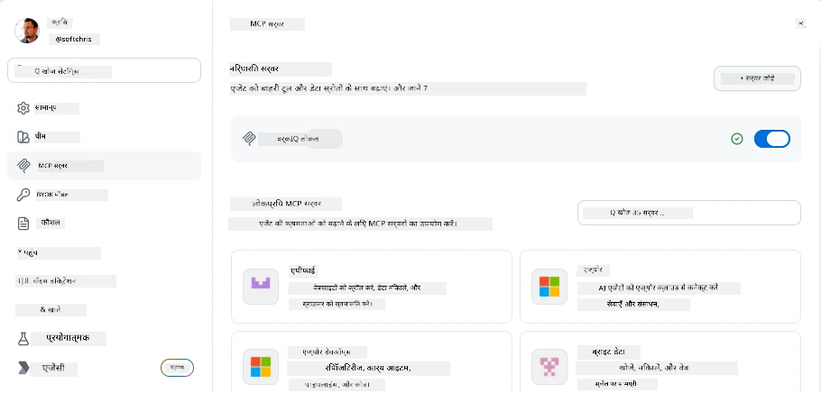
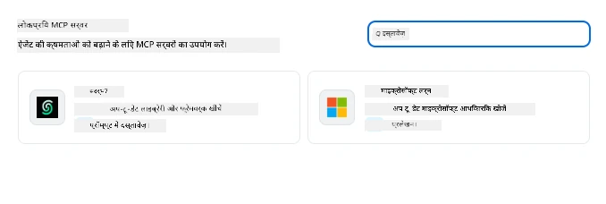
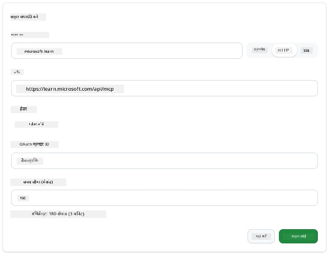
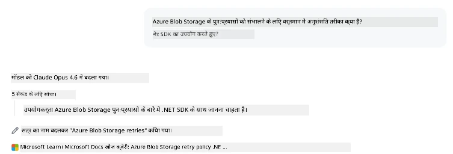
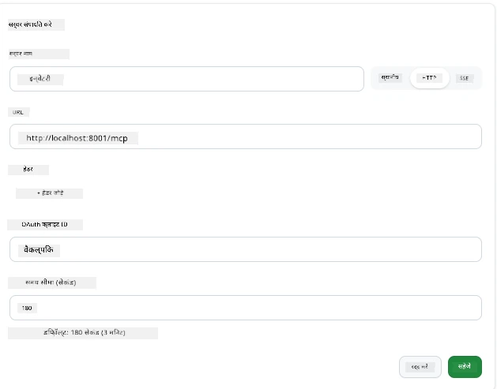
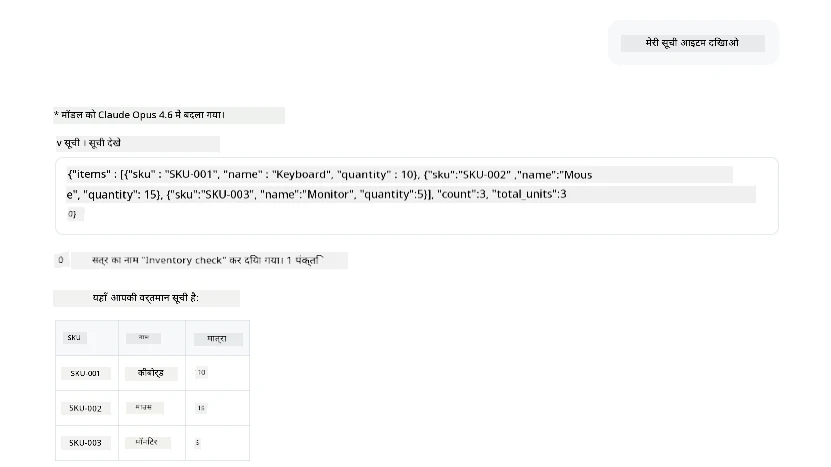
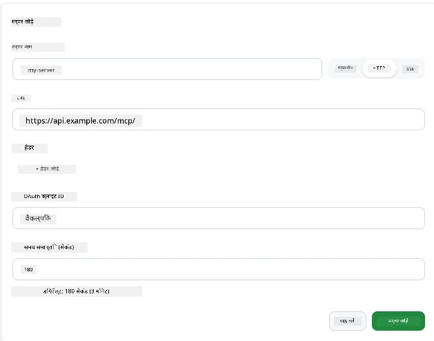
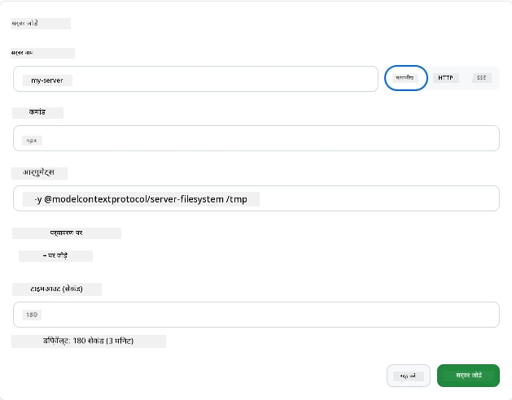

# GitHub Copilot ऐप में MCP सर्वर का उपयोग करना

अब आप जानते हैं कि MCP कैसे काम करता है। आपने सर्वर बनाए हैं, टूल्स और संसाधनों को परिभाषित किया है, और क्लाइंट्स को जोड़ा है। जो हमने अब तक नहीं किया है वह है नजरिया बदलना: आप सर्वर बनाने वाले की जगह, इसका उपयोग करने वाले के रूप में इसका उपयोग करना कैसा दिखता है—एक AI-समर्थित ऐप के उपयोगकर्ता के रूप में जो MCP का समर्थन करता है?

[GitHub Copilot App](https://github.com/github/app) एक डेस्कटॉप ऐप है जो MCP सर्वरों का उपयोग कर सकता है। MCP सर्वरों को इससे जोड़कर, आप एक नया स्तर अनलॉक करते हैं: Copilot अब आपकी दस्तावेज़ीकरण, आंतरिक API कॉल, डेटाबेस क्वेरी, या किसी भी सर्विस से बात कर सकता है जिसे आपने सर्वर में लिपटा रखा है। ऐप होस्ट बन जाता है; आपके MCP सर्वर इसके टूल बन जाते हैं।

यह पाठ आपको इस पूरी प्रक्रिया के माध्यम से ले जाएगा—MCP सेटिंग पैनल खोजने से लेकर एक वास्तविक दस्तावेज़ सर्वर को जोड़ने और फिर अपना स्वयं का कस्टम सर्वर जोड़ने तक।

## सीखने के उद्देश्य

इस पाठ के अंत तक, आप सक्षम होंगे:

- Copilot ऐप सेटिंग्स में MCP सर्वर पैनल को ढूंढना और नेविगेट करना।
- होस्ट किए गए दस्तावेज़ सर्वर से जुड़ना और इसका सत्र में उपयोग करना।
- एक कस्टम सर्वर पंजीकृत करना और पुष्टि करना कि Copilot उसके टूल्स को बुला सकता है।
- यह कॉन्फ़िगर करना कि एक सर्वर को कॉल कैसे किया जाता है, पर्यावरण चर या कस्टम हेडर प्रदान करके (यदि HTTP)

## MCP होस्ट के रूप में Copilot ऐप

यह मूल विचार है: **Copilot के एजेंट स्मार्ट हैं, लेकिन उन्हें केवल वही पता है जो आप उन्हें बताते हैं।** डिफ़ॉल्ट रूप से, एक एजेंट आपके कार्यक्षेत्र की फाइलें पढ़ सकता है और टर्मिनल कमांड चला सकता है, लेकिन वह बिना मदद के आपके डेटाबेस को क्वेरी नहीं कर सकता, आपका कैलेंडर नहीं देख सकता, या कस्टम API कॉल नहीं कर सकता। यहीं MCP सर्वर काम में आते हैं। वे Copilot और आपकी प्रणालियों—डेटाबेस, संस्करण नियंत्रण, API, डिज़ाइन टूल—के बीच पुल का काम करते हैं, एजेंट्स को उस जानकारी और क्रियाओं तक पहुंच देते हैं जो उन्हें कार्य पूरा करने के लिए चाहिए।

आइए पहले उन सेटिंग्स को खोजें जो आपके ऐप के MCP सर्वरों को प्रबंधित करती हैं।

## कदम 1: MCP सेटिंग पैनल खोजना

Copilot ऐप खोलें और नीचे-बाएँ कोने में एक गियर (cog) आइकन खोजें और उस पर क्लिक करें।


सुनिश्चित करें कि आपने "MCP Servers" चुना है और अब आपको ऊपर पहले से कॉन्फ़िगर किए गए सर्वर दिखाई देंगे, नीचे लोकप्रिय सर्वरों की मार्केटप्लेस, और ऊपर "Add Server" बटन इस प्रकार दिखाई देगा:



यह आपका कंट्रोल सेंटर है। आप यहाँ सर्वर जोड़ते, हटाते, सक्षम या अक्षम करते हैं। परिवर्तन नई सत्रों में प्रभावी होंगे; यदि आपका कोई सत्र खुला है, तो इस सूची को बदलने के बाद आपको नया सत्र शुरू करना होगा।

## कदम 2: एक दस्तावेज़ सर्वर से कनेक्ट करना

आइए तुरंत कुछ उपयोगी करें। Microsoft Docs MCP सर्वर Copilot को आधिकारिक Microsoft दस्तावेज़ीकरण तक पहुंच देता है। इसमें Azure, .NET, TypeScript, और भी बहुत कुछ शामिल है। एजेंट अपने प्रशिक्षण डेटा (जिसकी कटऑफ तिथि होती है) पर निर्भर रहने की बजाय, क्वेरी के समय वर्तमान दस्तावेज़ प्राप्त कर सकता है।

इसे जोड़ने का तरीका निम्न है:

1. लोकप्रिय सर्वरों के ग्रिड में, **learn** टाइप करें और "Microsoft Learn" नाम के सर्वर का चयन करें।

   

   क्लिक करते ही, यह आपको एक फॉर्म दिखाएगा जिसमें नाम, ट्रांसपोर्ट प्रकार और URL पहले से भरे हुए होते हैं, बस आपको "Add Server" पर क्लिक करना है।

2. "Add Server" पर क्लिक करें, सर्वर से कनेक्ट होने में कुछ सेकंड लगेंगे।

   

   जोड़ने के बाद, यह शीर्ष क्षेत्र में कॉन्फ़िगर किए गए सर्वर के रूप में दिखना चाहिए। अब इसे आज़माते हैं।

3. डायलॉग बंद करें और Quick chat चुनें।

4. Microsoft Learn सर्वर पर एक टूल चलाने के लिए नीचे दिए गए प्रॉम्प्ट टाइप करें।

   ```text
   What's the current recommended approach for handling Azure Blob Storage 
   retries using the .NET SDK?
   ```

   

आप देखेंगे कि यह हमने अभी जोड़ा MCP सर्वर कैसे संदर्भित करता है।

## कदम 3: एक कस्टम stdio सर्वर से कनेक्ट करना

प्रीसेट सुविधाजनक हैं, लेकिन असली ताकत आपके अपने सर्वरों को जोड़ने में है। मान लीजिए आपने एक सर्वर बनाया है (या प्रदान किया गया है) जो आपकी आंतरिक API या कंपनी के ज्ञान आधार को एक्सपोज़ करता है। इस मामले में, हम एक MCP सर्वर का उपयोग करेंगे जिसे हमने अपने कंपनी के इन्वेंटरी प्रबंधन के लिए बनाया है।

1. गियर पर क्लिक करें और फिर से "MCP servers" चुनें।

2. "Add Server" बटन चुनें और "+ Add Custom server" पर क्लिक करें, और निम्न मान प्रदान करें:

   - नाम: `Inventory Server`
   - ट्रांसपोर्ट चुनें (दाईं ओर), **http**

   "Add Server" चुनें और यह आपके कॉन्फ़िगर किए गए सर्वरों की सूची में दिखाई देना चाहिए।

   

4. इसे परीक्षण करने के लिए, इस प्रकार की प्रॉम्प्ट चलाएं:

    ```
    list inventory
    ```

   

   अब आप अपनी कस्टम-बिल्ट सर्वर से लौटाए गए इन्वेंटरी आइटमों की सूची देख पाएंगे।

शानदार, अब आपको Copilot ऐप में बाहरी और अपने स्वयं के MCP सर्वर जोड़ने की अच्छी समझ होनी चाहिए। अगला, चलिए रहस्यों और पर्यावरण चर को संभालने के बारे में बात करते हैं।

## कदम 4: उन्नत सेटिंग्स

अब तक, आपने देखा है कि MCP सर्वर जोड़ने के लिए आप केवल नाम और URL प्रदान करते हैं। लेकिन अगर आपके सर्वर को API कुंजी या कुछ अन्य मानों की जरूरत हो तो? ठीक है, ट्रांसपोर्ट प्रकार के आधार पर, हम इसे जरूरी चीजें प्रदान कर सकते हैं।

- **http या SSE ट्रांसपोर्ट**: यहां हम ज़रूरत के अनुसार हेडर सेट कर सकते हैं।

   प्रमाणीकृत के लिए, आप उदाहरण के तौर पर Authorization हेडर निर्दिष्ट कर सकते हैं। मान एक स्थिर स्ट्रिंग हो सकता है। यदि आप OAuth का उपयोग करते हैं, तो आप इसके बजाय OAuth क्लाइंट ID दे सकते हैं।

   

- **stdio ट्रांसपोर्ट**: पर्यावरण चर सेट किए जा सकते हैं।

   यहां आप जितने चाहें उतने पर्यावरण चर निर्दिष्ट कर सकते हैं जिन्हें सर्वर को शुरू करते समय पास किया जाना चाहिए।

   

## सारांश

Copilot ऐप MCP सर्वरों को एजेंट की क्षमताओं के पहला-श्रेणी विस्तार के रूप में मानता है। आपने इस पाठ में MCP सर्वर जोड़ने से लेकर उनका सत्र में उपयोग करने तक पूरा सफर देखा है। अब आप सार्वजनिक सर्वरों, आंतरिक API, और कस्टम टूल्स से कनेक्ट कर सकते हैं, जिससे आपके एजेंट को वह जानकारी और क्रियाएं मिलती हैं जिनकी उन्हें स्वायत्त रूप से कार्य पूरा करने के लिए आवश्यकता है।

## 📚 अतिरिक्त संसाधन

### आधिकारिक दस्तावेज़

- [GitHub Copilot App](https://github.com/github/app)
- [MCP Specification](https://modelcontextprotocol.io/specification/2025-03-26) - मॉडल कॉन्टेक्स्ट प्रोटोकॉल विनिर्देशन

### समुदाय
- [MCP Community Discord](https://discord.com/invite/ByRwuEEgH4) - लाइव चर्चाएं
- [GitHub Discussions](https://github.com/microsoft/MCP-Server-and-PostgreSQL-Sample-Retail/discussions) - प्रश्न एवं उत्तर और साझा करना
- [Stack Overflow](https://stackoverflow.com/questions/tagged/model-context-protocol) - तकनीकी प्रश्न

---

<!-- CO-OP TRANSLATOR DISCLAIMER START -->
**अस्वीकरण**:
इस दस्तावेज़ का अनुवाद AI अनुवाद सेवा [Co-op Translator](https://github.com/Azure/co-op-translator) का उपयोग करके किया गया है। जबकि हम सटीकता के लिए प्रयास करते हैं, कृपया ध्यान दें कि स्वचालित अनुवादों में त्रुटियाँ या अशुद्धियाँ हो सकती हैं। मूल दस्तावेज़ अपनी मूल भाषा में ही प्रामाणिक स्रोत माना जाना चाहिए। महत्वपूर्ण जानकारी के लिए, पेशेवर मानव अनुवाद की सिफारिश की जाती है। इस अनुवाद के उपयोग से उत्पन्न किसी भी गलतफहमी या गलत व्याख्या के लिए हम उत्तरदायी नहीं हैं।
<!-- CO-OP TRANSLATOR DISCLAIMER END -->