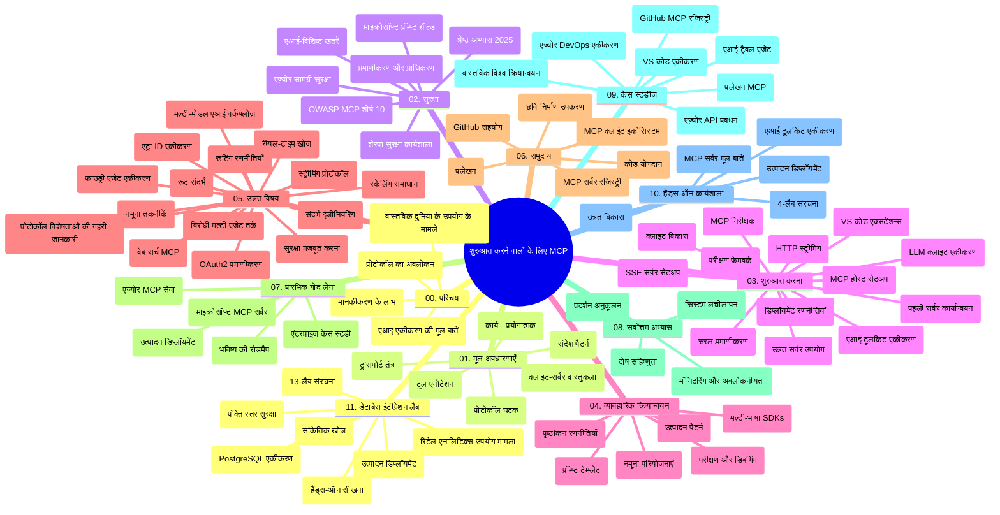

# Model Context Protocol (MCP) शुरुआती लोगों के लिए - अध्ययन गाइड

यह अध्ययन गाइड "Model Context Protocol (MCP) शुरुआती लोगों के लिए" पाठ्यक्रम के रिपॉजिटरी संरचना और सामग्री का एक अवलोकन प्रदान करता है। इस गाइड का उपयोग करके आप रिपॉजिटरी को प्रभावी ढंग से नेविगेट कर सकते हैं और उपलब्ध संसाधनों का अधिकतम लाभ उठा सकते हैं।

## रिपॉजिटरी का अवलोकन

Model Context Protocol (MCP) AI मॉडल और क्लाइंट एप्लिकेशन के बीच इंटरैक्शन के लिए एक मानकीकृत फ्रेमवर्क है। मूल रूप से Anthropic द्वारा बनाया गया, MCP अब आधिकारिक GitHub संगठन के माध्यम से व्यापक MCP समुदाय द्वारा बनाए रखा जाता है। यह रिपॉजिटरी C#, Java, JavaScript, Python, और TypeScript में हैंड्स-ऑन कोड उदाहरणों के साथ एक व्यापक पाठ्यक्रम प्रदान करती है, जो AI डेवलपर्स, सिस्टम आर्किटेक्ट्स, और सॉफ्टवेयर इंजीनियरों के लिए डिज़ाइन किया गया है।

## विजुअल करिकुलम मैप

## रिपॉजिटरी संरचना

रिपॉजिटरी को ग्यारह मुख्य भागों में व्यवस्थित किया गया है, जो MCP के विभिन्न पहलुओं पर केंद्रित हैं:

1. **परिचय (00-Introduction/)**
   - Model Context Protocol का अवलोकन
   - AI पाइपलाइनों में मानकीकरण क्यों महत्वपूर्ण है
   - व्यावहारिक उपयोग के मामले और लाभ

2. **मूल अवधारणाएँ (01-CoreConcepts/)**
   - क्लाइंट-सरवर आर्किटेक्चर
   - प्रमुख प्रोटोकॉल घटक
   - MCP में मेसेजिंग पैटर्न

3. **सुरक्षा (02-Security/)**
   - MCP-आधारित सिस्टम में सुरक्षा खतरे
   - इम्प्लीमेंटेशन को सुरक्षित बनाने के लिए सर्वोत्तम प्रथाएँ
   - प्रमाणीकरण और प्राधिकरण रणनीतियाँ
   - **व्यापक सुरक्षा प्रलेखन**:
     - MCP Security Best Practices 2025
     - Azure Content Safety Implementation Guide
     - MCP Security Controls and Techniques
     - MCP Best Practices Quick Reference
   - **प्रमुख सुरक्षा विषय**:
     - प्रॉम्प्ट इंजेक्शन और टूल पॉइजनिंग हमले
     - सेशन हाईजैकिंग और कन्फ्यूज्ड डिप्यू प्रॉब्लम
     - टोकन पासथ्रू कमजोरियां
     - अत्यधिक अनुमतियाँ और एक्सेस नियंत्रण
     - AI घटकों के लिए सप्लाई चेन सुरक्षा
     - Microsoft Prompt Shields एकीकरण

4. **शुरुआत (03-GettingStarted/)**
   - वातावरण सेटअप और कॉन्फ़िगरेशन
   - बुनियादी MCP सर्वर और क्लाइंट बनाना
   - मौजूदा अनुप्रयोगों के साथ एकीकरण
   - समाविष्ट खंड:
     - पहला सर्वर इम्प्लीमेंटेशन
     - क्लाइंट विकास
     - LLM क्लाइंट एकीकरण
     - VS Code एकीकरण
     - Server-Sent Events (SSE) सर्वर
     - उन्नत सर्वर उपयोग
     - HTTP स्ट्रीमिंग
     - AI टूलकिट एकीकरण
     - परीक्षण रणनीतियाँ
     - परिनियोजन दिशा-निर्देश

5. **व्यावहारिक इम्प्लीमेंटेशन (04-PracticalImplementation/)**
   - विभिन्न प्रोग्रामिंग भाषाओं में SDK का उपयोग
   - डिबगिंग, परीक्षण, और सत्यापन तकनीकें
   - पुन: प्रयोज्य प्रॉम्प्ट टेम्पलेट्स और वर्कफ़्लोज़ बनाना
   - इम्प्लीमेंटेशन उदाहरणों के साथ नमूना परियोजनाएँ

6. **उन्नत विषय (05-AdvancedTopics/)**
   - संदर्भ इंजीनियरिंग तकनीकें
   - Foundry एजेंट एकीकरण
   - मल्टी-मोडल AI वर्कफ़्लोज़
   - OAuth2 प्रमाणीकरण डेमो
   - रियल-टाइम खोज क्षमताएँ
   - रियल-टाइम स्ट्रीमिंग
   - रूट संदर्भों का कार्यान्वयन
   - रूटिंग रणनीतियाँ
   - सैंपलिंग तकनीकें
   - स्केलिंग अप्रोच
   - सुरक्षा विचार
   - Entra ID सुरक्षा एकीकरण
   - वेब खोज एकीकरण
   - विरोधात्मक मल्टी-एजेंट तर्कशक्ति (बहस पैटर्न)

7. **समुदाय योगदान (06-CommunityContributions/)**
   - कोड और डॉक्यूमेंटेशन में योगदान कैसे करें
   - GitHub के माध्यम से सहयोग
   - समुदाय-संचालित सुधार और प्रतिक्रिया
   - विभिन्न MCP क्लाइंट्स का उपयोग (Claude Desktop, Cline, VSCode)
   - लोकप्रिय MCP सर्वरों के साथ काम करना जिसमें इमेज जनरेशन शामिल है

8. **प्रारंभिक अपनाने से सीख (07-LessonsfromEarlyAdoption/)**
   - वास्तविक दुनिया के कार्यान्वयन और सफलता की कहानियाँ
   - MCP-आधारित समाधानों का निर्माण और परिनियोजन
   - रुझान और भविष्य की रोडमैप
   - **Microsoft MCP सर्वर गाइड**: 10 प्रोडक्शन-रेडी Microsoft MCP सर्वरों के लिए व्यापक मार्गदर्शिका जिसमें शामिल हैं:
     - Microsoft Learn Docs MCP Server
     - Azure MCP Server (15+ विशेष कनेक्टर्स)
     - GitHub MCP Server
     - Azure DevOps MCP Server
     - MarkItDown MCP Server
     - SQL Server MCP Server
     - Playwright MCP Server
     - Dev Box MCP Server
     - Microsoft Foundry MCP Server
     - Microsoft 365 Agents Toolkit MCP Server

9. **सर्वोत्तम प्रथाएँ (08-BestPractices/)**
   - प्रदर्शन अनुकूलन और ट्यूनिंग
   - दोष-सहनशील MCP सिस्टम डिजाइन करना
   - परीक्षण और लचीलापन रणनीतियाँ

10. **केस स्टडीज (09-CaseStudy/)**
    - **सात व्यापक केस स्टडीज** जो MCP की विविध स्थितियों में बहुमुखी प्रतिभा दिखाती हैं:
    - **Azure AI ट्रैवल एजेंट्स**: Azure OpenAI और AI Search के साथ मल्टी-एजेंट ऑर्केस्ट्रेशन
    - **Azure DevOps एकीकरण**: YouTube डेटा अपडेट के साथ वर्कफ़्लो प्रक्रियाओं का स्वचालन
    - **रियल-टाइम डॉक्यूमेंटेशन पुनःप्राप्ति**: Python कंसोल क्लाइंट के साथ HTTP स्ट्रीमिंग
    - **इंटरैक्टिव स्टडी प्लान जनरेटर**: Chainlit वेब ऐप के साथ संवादात्मक AI
    - **इन-एडिटर डॉक्यूमेंटेशन**: VS Code एकीकरण GitHub Copilot वर्कफ़्लोज़ के साथ
    - **Azure API प्रबंधन**: MCP सर्वर निर्माण के साथ एंटरप्राइज API एकीकरण
    - **GitHub MCP रजिस्ट्री**: इकोसिस्टम विकास और एजेंटिक इंटीग्रेशन प्लेटफॉर्म
    - एंटरप्राइज एकीकरण, डेवलपर उत्पादकता, और इकोसिस्टम विकास को कवर करने वाले इम्प्लीमेंटेशन उदाहरण

11. **हैंड्स-ऑन कार्यशाला (10-StreamliningAIWorkflowsBuildingAnMCPServerWithAIToolkit/)**
    - MCP को AI टूलकिट के साथ संयोजित करते हुए व्यापक हैंड्स-ऑन कार्यशाला
    - AI मॉडल्स और वास्तविक दुनिया के टूल्स के बीच बुद्धिमान एप्लिकेशन बनाना
    - बुनियादी बातें, कस्टम सर्वर विकास, और उत्पादन परिनियोजन रणनीतियाँ शामिल व्यावहारिक मॉड्यूल
    - **प्रयोगशाला संरचना**:
      - लैब 1: MCP सर्वर की मूल बातें
      - लैब 2: उन्नत MCP सर्वर विकास
      - लैब 3: AI टूलकिट एकीकरण
      - लैब 4: उत्पादन परिनियोजन और स्केलिंग
    - चरण-दर-चरण निर्देशों के साथ लैब-आधारित सीखने का दृष्टिकोण

12. **MCP सर्वर डेटाबेस एकीकरण लैब्स (11-MCPServerHandsOnLabs/)**
    - **13-लैब सीखने का व्यापक मार्ग** प्रदान करता है जो PostgreSQL इंटीग्रेशन के साथ प्रोडक्शन-रेडी MCP सर्वर बनाता है
    - **Zava Retail उपयोग मामले का उपयोग करते हुए वास्तविक दुनिया की रिटेल एनालिटिक्स कार्यान्वयन**
    - **एंटरप्राइज-ग्रेड पैटर्न** जिसमें Row Level Security (RLS), सेमेंटिक सर्च, और मल्टी-टेनेंट डेटा एक्सेस शामिल हैं
    - **पूर्ण लैब संरचना**:
      - **लैब 00-03: आधार** - परिचय, आर्किटेक्चर, सुरक्षा, वातावरण सेटअप
      - **लैब 04-06: MCP सर्वर बनाना** - डेटाबेस डिज़ाइन, MCP सर्वर इम्प्लीमेंटेशन, टूल विकास
      - **लैब 07-09: उन्नत फीचर्स** - सेमेंटिक सर्च, परीक्षण और डिबगिंग, VS Code एकीकरण
      - **लैब 10-12: उत्पादन और सर्वोत्तम प्रथाएं** - परिनियोजन, मॉनिटरिंग, अनुकूलन
    - **कवर की गई प्रौद्योगिकियाँ**: FastMCP फ्रेमवर्क, PostgreSQL, Azure OpenAI, Azure कंटेनर ऐप्स, Application Insights
    - **सीखने के परिणाम**: प्रोडक्शन-रेडी MCP सर्वर, डेटाबेस इंटीग्रेशन पैटर्न, AI-समर्थित एनालिटिक्स, एंटरप्राइज सुरक्षा

## अतिरिक्त संसाधन

रिपॉजिटरी में सहायक संसाधन शामिल हैं:

- **Images फोल्डर**: पाठ्यक्रम में उपयोग किए गए आरेख और चित्र
- **अनुवाद**: दस्तावेज़ीकरण के स्वचालित अनुवाद के साथ बहुभाषी समर्थन
- **आधिकारिक MCP संसाधन**:
  - [MCP Documentation](https://modelcontextprotocol.io/)
  - [MCP Specification](https://spec.modelcontextprotocol.io/)
  - [MCP GitHub Repository](https://github.com/modelcontextprotocol)

## इस रिपॉजिटरी का उपयोग कैसे करें

1. **क्रमिक अध्ययन**: संरचित सीखने के लिए अध्यायों को क्रमिक रूप से (00 से 11 तक) पढ़ें।
2. **भाषा-विशिष्ट फोकस**: यदि आप किसी विशेष प्रोग्रामिंग भाषा में रुचि रखते हैं, तो अपनी पसंदीदा भाषा में इम्प्लीमेंटेशन के लिए सैंपल्स डायरेक्टरी जांचें।
3. **व्यावहारिक इम्प्लीमेंटेशन**: "शुरुआत" अनुभाग से शुरू करें जिससे आपका वातावरण सेट हो और आपका पहला MCP सर्वर और क्लाइंट बन सके।
4. **उन्नत खोज**: जब मूल बातें समझ में आ जाएं, तो ज्ञान बढ़ाने के लिए उन्नत विषयों में जाएं।
5. **समुदाय सहभागिता**: MCP समुदाय में शामिल हों, GitHub चर्चाओं और Discord चैनलों के माध्यम से विशेषज्ञों और अन्य डेवलपर्स से जुड़ें।

## MCP क्लाइंट्स और टूल्स

पाठ्यक्रम में विभिन्न MCP क्लाइंट्स और टूल्स कवर किए गए हैं:

1. **आधिकारिक क्लाइंट्स**:
   - Visual Studio Code
   - MCP Visual Studio Code में
   - Claude Desktop
   - VSCode में Claude
   - Claude API

2. **समुदाय क्लाइंट्स**:
   - Cline (टर्मिनल-आधारित)
   - Cursor (कोड एडिटर)
   - ChatMCP
   - Windsurf

3. **MCP प्रबंधन उपकरण**:
   - MCP CLI
   - MCP Manager
   - MCP Linker
   - MCP Router

## लोकप्रिय MCP सर्वर

रिपॉजिटरी विभिन्न MCP सर्वरों का परिचय कराती है, जिनमें शामिल हैं:

1. **आधिकारिक Microsoft MCP सर्वर**:
   - Microsoft Learn Docs MCP Server
   - Azure MCP Server (15+ विशेष कनेक्टर्स)
   - GitHub MCP Server
   - Azure DevOps MCP Server
   - MarkItDown MCP Server
   - SQL Server MCP Server
   - Playwright MCP Server
   - Dev Box MCP Server
   - Microsoft Foundry MCP Server
   - Microsoft 365 Agents Toolkit MCP Server

2. **आधिकारिक संदर्भ सर्वर**:
   - फाइलसिस्टम
   - Fetch
   - मेमोरी
   - सीक्वेंशियल थिंकिंग

3. **इमेज जनरेशन**:
   - Azure OpenAI DALL-E 3
   - Stable Diffusion WebUI
   - Replicate

4. **विकास उपकरण**:
   - Git MCP
   - टर्मिनल कंट्रोल
   - कोड असिस्टेंट

5. **विशेषीकृत सर्वर**:
   - Salesforce
   - Microsoft Teams
   - Jira & Confluence

## योगदान

यह रिपॉजिटरी समुदाय से योगदान का स्वागत करती है। MCP इकोसिस्टम में प्रभावी योगदान के लिए मार्गदर्शन के लिए समुदाय योगदान अनुभाग देखें।

----

*यह अध्ययन गाइड अंतिम बार 5 फरवरी, 2026 को अपडेट किया गया था, जो नवीनतम MCP Specification 2025-11-25 को दर्शाता है और उस तिथि तक रिपॉजिटरी का अवलोकन प्रदान करता है। इस तिथि के बाद रिपॉजिटरी सामग्री अपडेट हो सकती है।*

---

<!-- CO-OP TRANSLATOR DISCLAIMER START -->
**अस्वीकरण**:
इस दस्तावेज़ का अनुवाद AI अनुवाद सेवा [Co-op Translator](https://github.com/Azure/co-op-translator) का उपयोग करके किया गया है। जबकि हम सटीकता के लिए प्रयास करते हैं, कृपया ध्यान दें कि स्वचालित अनुवादों में त्रुटियाँ या अशुद्धियाँ हो सकती हैं। मूल दस्तावेज़ अपनी मूल भाषा में ही प्रामाणिक स्रोत माना जाना चाहिए। महत्वपूर्ण जानकारी के लिए, पेशेवर मानव अनुवाद की सिफारिश की जाती है। इस अनुवाद के उपयोग से उत्पन्न किसी भी गलतफहमी या गलत व्याख्या के लिए हम उत्तरदायी नहीं हैं।
<!-- CO-OP TRANSLATOR DISCLAIMER END -->