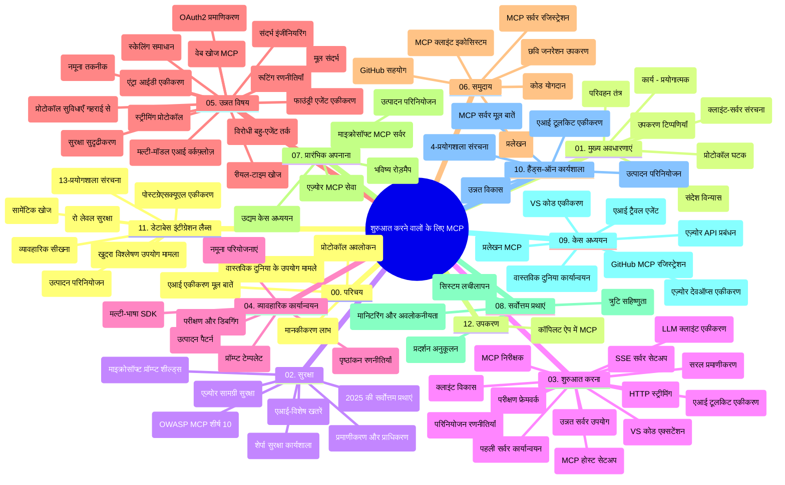

# शुरुआती के लिए मॉडल संदर्भ प्रोटोकॉल (MCP) - अध्ययन गाइड

यह अध्ययन गाइड "मॉडल संदर्भ प्रोटोकॉल (MCP) फॉर बिगिनर्स" पाठ्यक्रम के लिए रिपॉजिटरी संरचना और सामग्री का अवलोकन प्रदान करता है। इस गाइड का उपयोग रिपॉजिटरी में कुशलतापूर्वक नेविगेट करने और उपलब्ध संसाधनों का अधिकतम लाभ उठाने के लिए करें।

## रिपॉजिटरी अवलोकन

मॉडल संदर्भ प्रोटोकॉल (MCP) AI मॉडल और क्लाइंट अनुप्रयोगों के बीच इंटरैक्शन के लिए एक मानकीकृत फ्रेमवर्क है। मूल रूप से Anthropic द्वारा बनाया गया, MCP अब आधिकारिक GitHub संगठन के माध्यम से व्यापक MCP समुदाय द्वारा बनाए रखा जाता है। यह रिपॉजिटरी AI डेवलपर्स, सिस्टम आर्किटेक्ट्स, और सॉफ़्टवेयर इंजीनियरों के लिए डिज़ाइन किए गए C#, Java, JavaScript, Python, और TypeScript में हैंड्स-ऑन कोड उदाहरणों के साथ एक व्यापक पाठ्यक्रम प्रदान करती है।

## दृश्य पाठ्यक्रम मानचित्र

## रिपॉजिटरी संरचना

रिपॉजिटरी बारह मुख्य खंडों में व्यवस्थित है, जो MCP के विभिन्न पहलुओं पर केंद्रित हैं:

1. **परिचय (00-Introduction/)**
   - मॉडल संदर्भ प्रोटोकॉल का अवलोकन
   - AI पाइपलाइनों में मानकीकरण क्यों महत्वपूर्ण है
   - व्यावहारिक उपयोग के मामले और लाभ

2. **कोर कॉन्सेप्ट्स (01-CoreConcepts/)**
   - क्लाइंट-सर्वर वास्तुकला
   - प्रमुख प्रोटोकॉल घटक
   - MCP में संदेश पैटर्न

3. **सुरक्षा (02-Security/)**
   - MCP-आधारित प्रणालियों में सुरक्षा खतरे
   - कार्यान्वयन की सुरक्षा के लिए सर्वोत्तम अभ्यास
   - प्रमाणीकरण और प्राधिकरण रणनीतियाँ
   - **व्यापक सुरक्षा दस्तावेज़ीकरण**:
     - MCP सुरक्षा सर्वोत्तम अभ्यास 2025
     - Azure कंटेंट सेफ्टी इम्प्लीमेंटेशन गाइड
     - MCP सुरक्षा नियंत्रण और तकनीकें
     - MCP सर्वोत्तम अभ्यास त्वरित संदर्भ
   - **प्रमुख सुरक्षा विषय**:
     - प्रॉम्प्ट इंजेक्शन और टूल पॉइज़निंग हमले
     - सेशन हाईजैकिंग और कन्फ्यूज़्ड डिप्टी समस्याएं
     - टोकन पासथ्रू कमजोरियां
     - अत्यधिक अनुमतियाँ और एक्सेस नियंत्रण
     - AI घटकों के लिए सप्लाई चेन सुरक्षा
     - माइक्रोसॉफ्ट प्रॉम्प्ट शील्ड्स एकीकरण

4. **शुरूआत करना (03-GettingStarted/)**
   - पर्यावरण सेटअप और कॉन्फ़िगरेशन
   - बुनियादी MCP सर्वर और क्लाइंट बनाना
   - मौजूदा अनुप्रयोगों के साथ एकीकरण
   - निम्नलिखित अनुभाग शामिल हैं:
     - पहला सर्वर कार्यान्वयन
     - क्लाइंट विकास
     - LLM क्लाइंट एकीकरण
     - VS कोड एकीकरण
     - सर्वर-भेजे गए इवेंट्स (SSE) सर्वर
     - उन्नत सर्वर उपयोग
     - HTTP स्ट्रीमिंग
     - AI टूलकिट एकीकरण
     - परीक्षण रणनीतियाँ
     - परिनियोजन दिशानिर्देश

5. **व्यावहारिक कार्यान्वयन (04-PracticalImplementation/)**
   - विभिन्न प्रोग्रामिंग भाषाओं में SDK का उपयोग
   - डिबगिंग, परीक्षण और सत्यापन तकनीकें
   - पुन: उपयोग योग्य प्रॉम्प्ट टेम्पलेट्स और वर्कफ़्लोज़ बनाना
   - कार्यान्वयन उदाहरणों के साथ नमूना प्रोजेक्ट

6. **उन्नत विषय (05-AdvancedTopics/)**
   - संदर्भ इंजीनियरिंग तकनीकें
   - फाउंड्री एजेंट एकीकरण
   - मल्टी-मोडल AI वर्कफ़्लोज़
   - OAuth2 प्रमाणीकरण डेमो
   - वास्तविक समय खोज क्षमताएं
   - वास्तविक समय स्ट्रीमिंग
   - रूट संदर्भ कार्यान्वयन
   - राउटिंग रणनीतियाँ
   - सैम्पलिंग तकनीकें
   - स्केलिंग दृष्टिकोण
   - सुरक्षा विचार
   - Entra ID सुरक्षा एकीकरण
   - वेब खोज एकीकरण
   - विरोधी मल्टी-एजेंट तर्क (बहस पैटर्न)

7. **समुदाय योगदान (06-CommunityContributions/)**
   - कोड और दस्तावेज़ में योगदान कैसे करें
   - GitHub के माध्यम से सहयोग
   - समुदाय-चालित सुधार और प्रतिक्रिया
   - विभिन्न MCP क्लाइंट्स का उपयोग (Claude Desktop, Cline, VSCode)
   - लोकप्रिय MCP सर्वरों के साथ कार्य (जिसमें छवि निर्माण शामिल है)

8. **प्रारंभिक अपनाने से सीख (07-LessonsfromEarlyAdoption/)**
   - वास्तविक दुनिया में कार्यान्वयन और सफलता कथाएँ
   - MCP-आधारित समाधानों का निर्माण और परिनियोजन
   - प्रवृत्तियां और भविष्य का रोडमैप
   - **Microsoft MCP सर्वर गाइड**: 10 प्रोडक्शन-तैयार Microsoft MCP सर्वरों के लिए व्यापक गाइड, जिनमें शामिल हैं:
     - Microsoft Learn Docs MCP Server
     - Azure MCP Server (15+ विशिष्ट कनेक्टर्स)
     - GitHub MCP Server
     - Azure DevOps MCP Server
     - MarkItDown MCP Server
     - SQL Server MCP Server
     - Playwright MCP Server
     - Dev Box MCP Server
     - Microsoft Foundry MCP Server
     - Microsoft 365 Agents Toolkit MCP Server

9. **सर्वोत्तम अभ्यास (08-BestPractices/)**
   - प्रदर्शन अनुकूलन और ट्यूनिंग
   - दोष-प्रतिरोधी MCP सिस्टम डिजाइन करना
   - परीक्षण और प्रत्यास्था रणनीतियाँ

10. **केस स्टडीज़ (09-CaseStudy/)**
    - **सात व्यापक केस स्टडीज़** जो विभिन्न परिदृश्यों में MCP की बहुमुखी प्रतिभा दर्शाती हैं:
    - **Azure AI ट्रैवल एजेंट्स**: Azure OpenAI और AI Search के साथ मल्टी-एजेंट ऑर्केस्ट्रेशन
    - **Azure DevOps एकीकरण**: यूट्यूब डेटा अपडेट्स के साथ वर्कफ़्लो प्रक्रियाओं का स्वचालन
    - **रियल-टाइम डाक्यूमेंटेशन पुनः प्राप्ति**: स्ट्रीमिंग HTTP के साथ Python कंसोल क्लाइंट
    - **इंटरएक्टिव अध्ययन योजना जनरेटर**: Chainlit वेब ऐप के साथ संवादात्मक AI
    - **इन-एडिटर डाक्यूमेंटेशन**: GitHub Copilot वर्कफ़्लोज़ के साथ VS कोड एकीकरण
    - **Azure API प्रबंधन**: MCP सर्वर निर्माण के साथ एंटरप्राइज़ API एकीकरण
    - **GitHub MCP रजिस्ट्री**: पारिस्थितिकी तंत्र विकास और एजेंटिक एकीकरण प्लेटफ़ॉर्म
    - एंटरप्राइज़ एकीकरण, डेवलपर उत्पादकता, और पारिस्थितिकी तंत्र विकास में फैले कार्यान्वयन उदाहरण

11. **हैंड्स-ऑन कार्यशाला (10-StreamliningAIWorkflowsBuildingAnMCPServerWithAIToolkit/)**
    - MCP को AI टूलकिट के साथ संयोजित करती एक व्यापक हैंड्स-ऑन कार्यशाला
    - AI मॉडल्स को वास्तविक दुनिया के टूल्स से जोड़ने वाले बुद्धिमान अनुप्रयोग बनाना
    - बुनियादी अवधारणाओं, कस्टम सर्वर विकास, और प्रोडक्शन परिनियोजन रणनीतियों को कवर करने वाले व्यावहारिक मॉड्यूल
    - **लैब संरचना**:
      - लैब 1: MCP सर्वर मूल बातें
      - लैब 2: उन्नत MCP सर्वर विकास
      - लैब 3: AI टूलकिट एकीकरण
      - लैब 4: प्रोडक्शन परिनियोजन और स्केलिंग
    - चरण-दर-चरण निर्देशों के साथ लैब-आधारित सीखने का दृष्टिकोण

12. **MCP सर्वर डेटाबेस एकीकरण लैब्स (11-MCPServerHandsOnLabs/)**
    - PostgreSQL एकीकरण के साथ प्रोडक्शन-तैयार MCP सर्वर बनाने के लिए **व्यापक 13-लैब सीखने का मार्ग**
    - Zava Retail उपयोग केस के साथ वास्तविक दुनिया की रिटेल एनालिटिक्स कार्यान्वयन
    - एंटरप्राइज़-ग्रेड पैटर्न्स जिसमें Row Level Security (RLS), सैमान्टिक सर्च, और मल्टी-टेनेन्ट डेटा एक्सेस शामिल हैं
    - **पूर्ण लैब संरचना**:
      - **लैब्स 00-03: नींव** - परिचय, वास्तुकला, सुरक्षा, पर्यावरण सेटअप
      - **लैब्स 04-06: MCP सर्वर निर्माण** - डेटाबेस डिज़ाइन, MCP सर्वर कार्यान्वयन, टूल विकास
      - **लैब्स 07-09: उन्नत फीचर्स** - सैमान्टिक सर्च, परीक्षण & डिबगिंग, VS कोड एकीकरण
      - **लैब्स 10-12: प्रोडक्शन & सर्वोत्तम अभ्यास** - परिनियोजन, निगरानी, अनुकूलन
    - **आवृत प्रौद्योगिकियां**: FastMCP फ्रेमवर्क, PostgreSQL, Azure OpenAI, Azure कंटेनर ऐप्स, एप्लिकेशन इंसाइट्स
    - **सीखने के परिणाम**: प्रोडक्शन-तैयार MCP सर्वर, डेटाबेस एकीकरण पैटर्न, AI-संचालित एनालिटिक्स, एंटरप्राइज़ सुरक्षा

13. **टूलिंग (12-tooling/)**
    - Copilot ऐप और अन्य टूल्स में MCP का उपयोग कैसे करें सीखें

## अतिरिक्त संसाधन

रिपॉजिटरी में सहायक संसाधन शामिल हैं:

- **इमेजेस फ़ोल्डर**: पाठ्यक्रम में उपयोग किए गए आरेख और चित्र
- **अनुवाद**: दस्तावेज़ीकरण के स्वचालित अनुवाद के साथ बहुभाषी समर्थन
- **आधिकारिक MCP संसाधन**:
  - [MCP Documentation](https://modelcontextprotocol.io/)
  - [MCP Specification](https://spec.modelcontextprotocol.io/)
  - [MCP GitHub Repository](https://github.com/modelcontextprotocol)

## इस रिपॉजिटरी का उपयोग कैसे करें

1. **क्रमिक सीखना**: संरचित सीखने के लिए अध्यायों को क्रम में (00 से 11 तक) पढ़ें।
2. **भाषा-विशिष्ट फोकस**: यदि आप किसी विशिष्ट प्रोग्रामिंग भाषा में रुचि रखते हैं, तो पसंदीदा भाषा में कार्यान्वयन के लिए सैंपल डायरेक्टरीज़ देखें।
3. **व्यावहारिक कार्यान्वयन**: अपना पर्यावरण सेट अप करने और अपना पहला MCP सर्वर और क्लाइंट बनाने के लिए "शुरूआत करना" अनुभाग से शुरू करें।
4. **उन्नत अन्वेषण**: मूल बातें समझने के बाद, अपने ज्ञान का विस्तार करने के लिए उन्नत विषयों में उतरें।
5. **समुदाय सहभागिता**: विशेषज्ञों और अन्य डेवलपर्स से जुड़ने के लिए MCP समुदाय में GitHub चर्चाओं और Discord चैनलों के माध्यम से शामिल हों।

## MCP क्लाइंट्स और टूल्स

पाठ्यक्रम विभिन्न MCP क्लाइंट्स और टूल्स को कवर करता है:

1. **आधिकारिक क्लाइंट्स**:
   - Visual Studio Code
   - MCP in Visual Studio Code
   - Claude Desktop
   - VSCode में Claude
   - Claude API

2. **समुदाय क्लाइंट्स**:
   - Cline (टर्मिनल-आधारित)
   - Cursor (कोड संपादक)
   - ChatMCP
   - Windsurf

3. **MCP प्रबंधन टूल्स**:
   - MCP CLI
   - MCP Manager
   - MCP Linker
   - MCP Router

## लोकप्रिय MCP सर्वर

रिपॉजिटरी विभिन्न MCP सर्वरों को प्रस्तुत करती है, जिनमें शामिल हैं:

1. **आधिकारिक Microsoft MCP सर्वर**:
   - Microsoft Learn Docs MCP Server
   - Azure MCP Server (15+ विशिष्ट कनेक्टर्स)
   - GitHub MCP Server
   - Azure DevOps MCP Server
   - MarkItDown MCP Server
   - SQL Server MCP Server
   - Playwright MCP Server
   - Dev Box MCP Server
   - Microsoft Foundry MCP Server
   - Microsoft 365 Agents Toolkit MCP Server

2. **आधिकारिक संदर्भ सर्वर**:
   - फ़ाइल सिस्टम
   - Fetch
   - Memory
   - Sequential Thinking

3. **इमेज जेनरेशन**:
   - Azure OpenAI DALL-E 3
   - Stable Diffusion WebUI
   - Replicate

4. **डेवलपमेंट टूल्स**:
   - Git MCP
   - टर्मिनल कंट्रोल
   - कोड असिस्टेंट

5. **विशिष्ट सर्वर**:
   - Salesforce
   - Microsoft Teams
   - Jira & Confluence

## योगदान

यह रिपॉजिटरी समुदाय से योगदानों का स्वागत करती है। MCP पारिस्थितिकी तंत्र में प्रभावी योगदान के लिए मार्गदर्शन के लिए समुदाय योगदान अनुभाग देखें।

----

*यह अध्ययन गाइड अंतिम बार 5 फ़रवरी, 2026 को अपडेट किया गया था, जो नवीनतम MCP स्पेसिफिकेशन 2025-11-25 पर आधारित है और उस दिनांक तक रिपॉजिटरी का अवलोकन प्रदान करता है। इसके बाद रिपॉजिटरी सामग्री अपडेट की जा सकती है।*

---

<!-- CO-OP TRANSLATOR DISCLAIMER START -->
**अस्वीकरण**:
इस दस्तावेज़ का अनुवाद AI अनुवाद सेवा [Co-op Translator](https://github.com/Azure/co-op-translator) का उपयोग करके किया गया है। जबकि हम सटीकता के लिए प्रयास करते हैं, कृपया ध्यान दें कि स्वचालित अनुवादों में त्रुटियाँ या अशुद्धियाँ हो सकती हैं। मूल दस्तावेज़ अपनी मूल भाषा में ही प्रामाणिक स्रोत माना जाना चाहिए। महत्वपूर्ण जानकारी के लिए, पेशेवर मानव अनुवाद की सिफारिश की जाती है। इस अनुवाद के उपयोग से उत्पन्न किसी भी गलतफहमी या गलत व्याख्या के लिए हम उत्तरदायी नहीं हैं।
<!-- CO-OP TRANSLATOR DISCLAIMER END -->