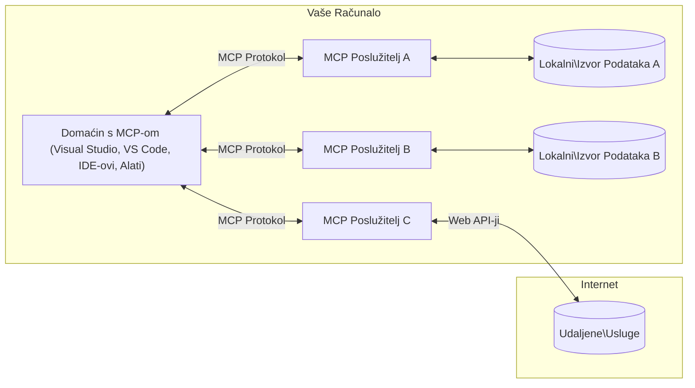

# MCP Core Concepts: Ovladavanje Model Context Protocolom za integraciju AI-ja

[](https://youtu.be/earDzWGtE84)

_(Kliknite na sliku gore za prikaz videa ovog sata)_

[Model Context Protocol (MCP)](https://github.com/modelcontextprotocol) je moćan, standardizirani okvir koji optimizira komunikaciju između velikih jezičnih modela (LLM) i vanjskih alata, aplikacija i izvora podataka. 
Ovaj vodič će vas provesti kroz osnovne koncepte MCP-a. Naučit ćete o njegovoj klijentsko-poslužiteljskoj arhitekturi, ključnim komponentama, mehanici komunikacije i najboljim praksama implementacije.

- **Izričiti pristanak korisnika**: Cijeli pristup podacima i operacije zahtijevaju izričitu suglasnost korisnika prije izvršenja. Korisnici moraju jasno razumjeti koji će podaci biti pristupljeni i koje će se radnje izvesti, uz detaljnu kontrolu nad dopuštenjima i ovlastima.

- **Zaštita privatnosti podataka**: Korisnički se podaci otkrivaju samo s izričitim pristankom i moraju biti zaštićeni snažnim kontrolama pristupa kroz cijeli životni ciklus interakcije. Implementacije moraju spriječiti neovlašten prijenos podataka i održati stroge granice privatnosti.

- **Sigurnost izvođenja alata**: Svaki poziv alata zahtijeva izričiti pristanak korisnika s jasnim razumijevanjem funkcionalnosti alata, parametara i potencijalnog utjecaja. Snažne sigurnosne granice moraju spriječiti nenamjerno, nesigurno ili zlonamjerno izvođenje alata.

- **Sigurnost transportnog sloja**: Svi komunikacijski kanali trebaju koristiti odgovarajuće mehanizme enkripcije i autentikacije. Udaljene veze trebaju implementirati sigurne transportne protokole i pravilno upravljanje vjerodajnicama.

#### Smjernice za implementaciju:

- **Upravljanje dopuštenjima**: Implementirajte sustave finog upravljanja dopuštenjima koji korisnicima omogućuju kontrolu pristupa poslužiteljima, alatima i resursima  
- **Autentikacija i autorizacija**: Koristite sigurne metode autentikacije (OAuth, API ključeve) uz pravilno upravljanje i isteka tokena  
- **Validacija ulaza**: Validirajte sve parametre i ulazne podatke prema definiranim shemama kako biste spriječili injekcijske napade  
- **Evidencija revizije**: Održavajte sveobuhvatne zapise svih operacija za praćenje sigurnosti i usklađenost

## Pregled

Ovaj sat istražuje temeljnu arhitekturu i komponente koje čine Model Context Protocol (MCP) ekosustav. Naučit ćete o klijentsko-poslužiteljskoj arhitekturi, ključnim komponentama i mehanizmima komunikacije koji pokreću MCP interakcije.

## Ključni ciljevi učenja

Do kraja ovog sata ćete:

- Razumjeti MCP klijentsko-poslužiteljsku arhitekturu.  
- Identificirati uloge i odgovornosti domaćina, klijenata i poslužitelja.
- Analizirati osnovne značajke zbog kojih je MCP fleksibilni sloj integracije.  
- Naučiti kako informacije teku unutar MCP ekosustava.  
- Steći praktične uvide kroz primjere koda u .NET, Javi, Pythonu i JavaScriptu.

## MCP arhitektura: Dubinski pregled

MCP ekosustav je izgrađen na modelu klijent-poslužitelj. Ova modularna struktura omogućuje AI aplikacijama učinkovit rad s alatima, bazama podataka, API-jima i kontekstualnim resursima. Razložimo ovu arhitekturu na njene osnovne komponente.

U svojoj biti, MCP slijedi klijentsko-poslužiteljsku arhitekturu gdje domaćinska aplikacija može biti povezana s više poslužitelja:


- **MCP domaćini**: Programi poput VSCode, Claude Desktop, IDE-i ili AI alati koji žele pristupiti podacima putem MCP-a  
- **MCP klijenti**: Klijentski protokoli koji održavaju 1:1 veze s poslužiteljima  
- **MCP poslužitelji**: Lagani programi koji svaki izlažu specifične mogućnosti kroz standardizirani Model Context Protocol  
- **Lokalni izvori podataka**: Datoteke, baze podataka i usluge na vašem računalu kojima MCP poslužitelji mogu sigurno pristupiti  
- **Udaljene usluge**: Vanjski sustavi dostupni putem interneta s kojima se MCP poslužitelji mogu povezati putem API-ja.

MCP protokol je razvijajući se standard s verzioniranjem temeljenim na datumu (format YYYY-MM-DD). Trenutna verzija protokola je **2025-11-25**. Možete vidjeti najnovija ažuriranja [specifikacije protokola](https://modelcontextprotocol.io/specification/2025-11-25/)

### 1. Domaćini (Hosts)

U Model Context Protocolu (MCP), **Domaćini** su AI aplikacije koje služe kao primarno sučelje kroz koje korisnici komuniciraju s protokolom. Domaćini koordiniraju i upravljaju vezama prema više MCP poslužitelja stvarajući za svaku vezu posvećene MCP klijente. Primjeri domaćina uključuju:

- **AI aplikacije**: Claude Desktop, Visual Studio Code, Claude Code  
- **Razvojna okruženja**: IDE-i i uređivači koda s MCP integracijom  
- **Prilagođene aplikacije**: Namjenski AI agenti i alati

**Domaćini** su aplikacije koje koordiniraju interakcije s AI modelima. Oni:

- **Orkestriraju AI modele**: Izvršavaju ili komuniciraju s LLM-ovima kako bi generirali odgovore i koordinirali AI tijekove rada  
- **Upravljaju klijentskim vezama**: Kreiraju i održavaju jednog MCP klijenta po MCP poslužiteljskoj vezi  
- **Kontroliraju korisničko sučelje**: Upravljaju protokom razgovora, korisničkim interakcijama i prikazom odgovora  
- **Provodu sigurnosne mjere**: Nadziru dopuštenja, sigurnosne principe i autentikaciju  
- **Upravljaju korisničkim pristankom**: Rukovode odobravanjem korisnika za dijeljenje podataka i izvođenje alata

### 2. Klijenti (Clients)

**Klijenti** su ključne komponente koje održavaju posvećene 1-na-1 veze između domaćina i MCP poslužitelja. Svaki MCP klijent inicira domaćin za povezivanje sa specifičnim MCP poslužiteljem, osiguravajući organizirane i sigurne komunikacijske kanale. Više klijenata omogućava domaćinima istovremenu vezu s više poslužitelja.

**Klijenti** su konektorski dijelovi unutar domaćinske aplikacije. Oni:

- **Komunikacija via protokol**: Šalju JSON-RPC 2.0 zahtjeve poslužiteljima s uputama i promptovima  
- **Pregovaranje mogućnosti**: Dogovaraju podržane značajke i verzije protokola s poslužiteljima tijekom inicijalizacije  
- **Izvršavanje alata**: Upravljaju zahtjevima za izvođenje alata od modela i obrađuju odgovore  
- **Ažuriranja u stvarnom vremenu**: Rukovode notifikacijama i real-time updateovima od poslužitelja  
- **Obrada odgovora**: Procesiraju i formatiraju odgovore poslužitelja za prikaz korisnicima

### 3. Poslužitelji (Servers)

**Poslužitelji** su programi koji pružaju kontekst, alate i mogućnosti MCP klijentima. Oni mogu raditi lokalno (na istoj mašini kao domaćin) ili udaljeno (na vanjskim platformama), te su odgovorni za obradu klijentskih zahtjeva i pružanje strukturiranih odgovora. Poslužitelji izlažu specifične funkcionalnosti kroz standardizirani Model Context Protocol.

**Poslužitelji** su servisi koji pružaju kontekstualne informacije i funkcionalnosti. Oni:

- **Registracija značajki**: Registriraju i izlažu dostupne primitve (resurse, promptove, alate) klijentima  
- **Obrada zahtjeva**: Primaju i izvršavaju pozive alata, zahtjeve za resurse i promptove od klijenata  
- **Pružanje konteksta**: Davanje kontekstualnih podataka i informacija za poboljšanje modelskih odgovora  
- **Upravljanje stanjem**: Održavaju stanje sesije i upravljaju interakcijama koje zahtijevaju stanje kad je potrebno  
- **Notifikacije u stvarnom vremenu**: Šalju obavijesti o promjenama funkcionalnosti i ažuriranjima povezanim klijentima

Poslužitelji mogu biti razvijeni od strane bilo koga za proširenje modelskih mogućnosti specijaliziranim funkcionalnostima te podržavaju lokalni i udaljeni način implementacije.

### 4. Poslužiteljske primitivne funkcije (Server Primitives)

Poslužitelji u Model Context Protocolu (MCP) pružaju tri osnovne **primitivne funkcije** koje definiraju temeljne gradivne blokove za bogate interakcije između klijenata, domaćina i jezičnih modela. Te primitivne funkcije specificiraju vrste kontekstualnih informacija i radnji dostupnih kroz protokol.

MCP poslužitelji mogu izložiti bilo koju kombinaciju sljedeće tri osnovne primitivne funkcije:

#### Resursi (Resources)

**Resursi** su izvori podataka koji pružaju kontekstualne informacije AI aplikacijama. Predstavljaju statički ili dinamički sadržaj koji može unaprijediti razumijevanje modela i donošenje odluka:

- **Kontekstualni podaci**: Strukturirane informacije i kontekst za potrošnju od strane AI modela
- **Baze znanja**: Repozitoriji dokumenata, članci, priručnici i znanstveni radovi  
- **Lokalni izvori podataka**: Datoteke, baze podataka i lokalne sistemske informacije  
- **Vanjski podaci**: Odgovori API-ja, web servisi i podaci udaljenih sustava  
- **Dinamički sadržaj**: Podaci u stvarnom vremenu koji se ažuriraju na temelju vanjskih uvjeta

Resursi su identificirani URI-jem i podržavaju otkrivanje putem `resources/list` i dohvat putem `resources/read` metoda:

```text
file://documents/project-spec.md
database://production/users/schema
api://weather/current
```

#### Promptovi (Prompts)

**Promptovi** su ponovo upotrebljivi predlošci koji pomažu strukturirati interakcije s jezičnim modelima. Oni pružaju standardizirane obrasce interakcija i templatirane tokove rada:

- **Templatom bazirane interakcije**: Prestrukturirane poruke i početnici razgovora  
- **Predlošci tijeka rada**: Standardizirani nizovi za uobičajene zadatke i interakcije  
- **Few-shot primjeri**: Predlošci temeljeni na primjerima za upute modelu  
- **Sistemski promptovi**: Temeljni promptovi koji definiraju ponašanje i kontekst modela  
- **Dinamički predlošci**: Parametrizirani promptovi koji se prilagođavaju specifičnim kontekstima

Promptovi podržavaju zamjenu varijabli i mogu se otkriti putem `prompts/list` te dohvatiti s `prompts/get`:

```markdown
Generate a {{task_type}} for {{product}} targeting {{audience}} with the following requirements: {{requirements}}
```

#### Alati (Tools)

**Alati** su izvršne funkcije koje AI modeli mogu pozvati za izvođenje specifičnih radnji. Oni predstavljaju "glagole" MCP ekosustava, omogućujući modelima interakciju s vanjskim sustavima:

- **Izvršne funkcije**: Pojedinačne operacije koje modeli mogu pozvati sa specifičnim parametrima  
- **Integracija vanjskih sustava**: API pozivi, upiti u bazu, rad s datotekama, izračuni  
- **Jedinstveni identitet**: Svaki alat ima jedinstveno ime, opis i shemu parametara  
- **Strukturirani ulaz/izlaz**: Alati prihvaćaju validirane parametre i vraćaju strukturirane, tipizirane odgovore  
- **Mogućnosti akcija**: Omogućavaju modelima izvođenje stvarnih radnji i dohvat live podataka

Alati se definiraju JSON Shemom za validaciju parametara i otkrivaju se preko `tools/list` te pozivaju preko `tools/call`. Alati također mogu uključivati **ikone** kao dodatne metapodatke za bolju prezentaciju u korisničkom sučelju.

**Annotacije alata**: Alati podržavaju opisne oznake ponašanja (npr. `readOnlyHint`, `destructiveHint`) koje opisuju je li alat samo za čitanje ili destruktivan, pomažući klijentima donijeti informirane odluke o izvođenju alata.

Primjer definicije alata:

```typescript
server.tool(
  "search_products", 
  {
    query: z.string().describe("Search query for products"),
    category: z.string().optional().describe("Product category filter"),
    max_results: z.number().default(10).describe("Maximum results to return")
  }, 
  async (params) => {
    // Izvrši pretraživanje i vrati strukturirane rezultate
    return await productService.search(params);
  }
);
```

## Klijentske primitivne funkcije (Client Primitives)

U Model Context Protocolu (MCP), **klijenti** mogu izložiti primitivne funkcije koje omogućuju poslužiteljima zahtijevati dodatne mogućnosti od domaćinske aplikacije. Ove klijentske primitivne funkcije omogućuju bogatije, interaktivnije implementacije poslužitelja koje mogu pristupati mogućnostima AI modela i korisničkim interakcijama.

### Uzorkovanje (Sampling)

**Uzorkovanje** omogućuje poslužiteljima da traže dovršetke od jezičnog modela unutar AI aplikacije klijenta. Ova primitivna funkcija omogućuje poslužiteljima pristup LLM mogućnostima bez ugrađivanja vlastitih ovisnosti o modelu:

- **Neovisni pristup modelu**: Poslužitelji mogu tražiti dovršetke bez uključivanja LLM SDK-ova ili upravljanja pristupom modelu  
- **AI inicirana od strane poslužitelja**: Omogućuje poslužiteljima autonomno generiranje sadržaja koristeći model klijenta  
- **Rekurzivne LLM interakcije**: Podržava složene scenarije gdje poslužitelji trebaju AI pomoć u obradi  
- **Dinamička generacija sadržaja**: Poslužitelji mogu kreirati kontekstualne odgovore koristeći model domaćina  
- **Podrška za pozivanje alata**: Poslužitelji mogu uključiti parametre `tools` i `toolChoice` za omogućavanje modelu klijenta pozivanje alata tijekom uzorkovanja

Uzorkovanje se inicira putem metode `sampling/complete`, gdje poslužitelji šalju zahtjeve za završetke klijentima.

### Korijeni (Roots)

**Korijeni** pružaju standardizirani način klijentima za izlaganje granica datotečnog sustava poslužiteljima, pomažući poslužiteljima razumjeti do kojih direktorija i datoteka imaju pristup:

- **Granice datotečnog sustava**: Definiraju područja u kojima poslužitelji mogu raditi unutar datotečnog sustava  
- **Kontrola pristupa**: Pomažu poslužiteljima da shvate do kojih direktorija i datoteka imaju dozvolu pristupa  
- **Dinamička ažuriranja**: Klijenti mogu obavještavati poslužitelje kada se lista korijena promijeni  
- **URI identifikacija**: Korijeni koriste `file://` URI-je za identifikaciju dostupnih direktorija i datoteka

Korijeni se otkrivaju putem metode `roots/list`, a klijenti šalju obavijesti `notifications/roots/list_changed` kada se korijeni izmijene.

### Elicitacija (Elicitation)  

**Elicitacija** omogućuje poslužiteljima da putem klijentskog sučelja zatraže dodatne informacije ili potvrdu od korisnika:

- **Zahtjevi za unos korisnika**: Poslužitelji mogu tražiti dodatne informacije kad su potrebne za izvršenje alata  
- **Dijalozi potvrde**: Traženje korisničkog odobrenja za osjetljive ili važne operacije  
- **Interaktivni tijekovi rada**: Omogućuje poslužiteljima kreiranje korak-po-korak korisničkih interakcija  
- **Dinamičko prikupljanje parametara**: Okupljanje nedostajućih ili opcionalnih parametara tijekom izvođenja alata

Zahtjevi za elicitation šalju se korištenjem metode `elicitation/request` za prikupljanje korisničkog ulaza kroz klijentovo sučelje.

**URL mod elicitation**: Poslužitelji također mogu zatražiti interakcije korisnika temeljene na URL-ovima, omogućujući poslužiteljima da korisnike usmjere na vanjske web stranice radi autentikacije, potvrde ili unosa podataka.

### Evidencija (Logging)

**Evidencija** omogućuje poslužiteljima slanje strukturiranih log poruka klijentima radi ispravljanja pogrešaka, praćenja i operativne transparentnosti:

- **Podrška za debugiranje**: Omogućuje poslužiteljima pružanje detaljnih zapisa izvršenja za otklanjanje pogrešaka  
- **Praćenje operacija**: Slanje statusnih ažuriranja i metrika izvedbe klijentima  
- **Izvještavanje o pogreškama**: Pružanje detaljnog konteksta pogrešaka i dijagnostičkih informacija  
- **Auditski zapisi**: Kreiranje sveobuhvatnih zapisa o operacijama i odlukama poslužitelja

Log poruke se šalju klijentima kako bi osigurale transparentnost rada poslužitelja i olakšale otklanjanje pogrešaka.

## Tok informacija u MCP-u

Model Context Protocol (MCP) definira strukturirani tok informacija između domaćina, klijenata, poslužitelja i modela. Razumijevanje ovog toka pomaže pojasniti kako se obrađuju korisnički zahtjevi i kako se vanjski alati i podaci integriraju u odgovore modela.
- **Domaćin inicira vezu**  
  Aplikacija domaćina (kao što je IDE ili sučelje za chat) uspostavlja vezu s MCP poslužiteljem, obično putem STDIO, WebSocket ili drugog podržanog prijenosa.

- **Pregovaranje o mogućnostima**  
  Klijent (ugrađen u domaćina) i poslužitelj razmjenjuju informacije o podržanim značajkama, alatima, resursima i verzijama protokola. To osigurava da obje strane razumiju koje su mogućnosti dostupne za sesiju.

- **Zahtjev korisnika**  
  Korisnik komunicira s domaćinom (npr. unosi upit ili naredbu). Domaćin prikuplja ovaj unos i prosljeđuje ga klijentu na obradu.

- **Korištenje resursa ili alata**  
  - Klijent može zatražiti dodatni kontekst ili resurse od poslužitelja (kao što su datoteke, unosi u bazama podataka ili članci iz baze znanja) kako bi obogatio razumijevanje modela.  
  - Ako model utvrdi da je potreban alat (npr. za dohvaćanje podataka, izvođenje izračuna ili poziv API-ja), klijent šalje zahtjev za poziv alata poslužitelju, navodeći ime alata i parametre.

- **Izvršenje na poslužitelju**  
  Poslužitelj prima zahtjev za resurs ili alat, izvršava potrebne operacije (npr. pokretanje funkcije, upit baze podataka ili dohvaćanje datoteke) i vraća rezultate klijentu u strukturiranom obliku.

- **Generiranje odgovora**  
  Klijent integrira odgovore poslužitelja (podatke resursa, izlaze alata itd.) u trenutnu interakciju s modelom. Model koristi te informacije za generiranje sveobuhvatnog i kontekstualno relevantnog odgovora.

- **Prikaz rezultata**  
  Domaćin prima konačni izlaz od klijenta i prikazuje ga korisniku, često uključujući tekst generiran modelom i rezultate izvršenja alata ili pronalaska resursa.

Ovaj tok omogućuje MCP da podrži napredne, interaktivne i kontekstualno svjesne AI aplikacije povezivanjem modela s vanjskim alatima i izvorima podataka.

## Arhitektura i slojevi protokola

MCP se sastoji od dva odvojena arhitektonska sloja koja zajedno rade na pružanju potpunog komunikacijskog okvira:

### Sloj podataka

**Sloj podataka** implementira osnovni MCP protokol koristeći **JSON-RPC 2.0** kao temelj. Ovaj sloj definira strukturu poruka, semantiku i obrasce interakcija:

#### Osnovne komponente:

- **JSON-RPC 2.0 protokol**: Sva komunikacija koristi standardizirani JSON-RPC 2.0 format poruka za pozive metoda, odgovore i obavijesti  
- **Upravljanje životnim ciklusom**: Rukuje inicijalizacijom veze, pregovaranjem mogućnosti i završetkom sesije između klijenata i poslužitelja  
- **Primitivi poslužitelja**: Omogućava poslužiteljima pružanje osnovne funkcionalnosti putem alata, resursa i promptova  
- **Primitivi klijenta**: Omogućava poslužiteljima zahtjeve za uzorkovanjem iz LLM-ova, prikupljanje korisničkog unosa i slanje log poruka  
- **Obavijesti u stvarnom vremenu**: Podržava asinkrone obavijesti za dinamičke nadogradnje bez potrebe za provjerom stanja

#### Ključne značajke:

- **Pregovaranje verzija protokola**: Koristi vremenski označeno verzioniranje (GGGG-MM-DD) za osiguranje kompatibilnosti  
- **Otkriće mogućnosti**: Klijenti i poslužitelji razmjenjuju informacije o podržanim značajkama tijekom inicijalizacije  
- **Stanja sesija**: Održava stanje veze kroz više interakcija radi kontinuiteta konteksta

### Sloj prijenosa

**Sloj prijenosa** upravlja komunikacijskim kanalima, strukturiranjem poruka i autentifikacijom između sudionika MCP-a:

#### Podržani mehanizmi prijenosa:

1. **STDIO prijenos**:  
   - Koristi standardne ulazno/izlazne tokove za izravnu komunikaciju procesa  
   - Optimalan za lokalne procese na istom računalu bez mrežnog opterećenja  
   - Često korišten za lokalne implementacije MCP poslužitelja

2. **Streamable HTTP prijenos**:  
   - Koristi HTTP POST za poruke od klijenta do poslužitelja  
   - Opcionalno Server-Sent Events (SSE) za streaming od poslužitelja do klijenta  
   - Omogućuje komunikaciju s udaljenim poslužiteljima preko mreža  
   - Podržava standardnu HTTP autentifikaciju (bearer tokeni, API ključevi, prilagođeni zaglavlja)  
   - MCP preporučuje OAuth za sigurnu autentifikaciju temeljenu na tokenima

#### Apstrakcija prijenosa:

Sloj prijenosa apstrahira detalje komunikacije od sloja podataka, omogućujući korištenje jednakog JSON-RPC 2.0 formata poruka za sve mehanizme prijenosa. Ova apstrakcija omogućuje aplikacijama neprimjetno prebacivanje između lokalnih i udaljenih poslužitelja.

### Sigurnosni aspekti

Implementacije MCP-a moraju se pridržavati nekoliko ključnih sigurnosnih načela kako bi osigurale sigurne, pouzdane i zaštićene interakcije kroz sve operacije protokola:

- **Pristanak i kontrola korisnika**: Korisnici moraju dati izričiti pristanak prije pristupa bilo kakvim podacima ili izvođenja operacija. Trebaju imati jasan nadzor nad podacima koji se dijele i radnjama koje se odobravaju, podržano intuitivnim korisničkim sučeljima za pregled i potvrdu aktivnosti.

- **Privatnost podataka**: Korisnički podaci trebaju biti izloženi isključivo uz izričiti pristanak i moraju biti zaštićeni odgovarajućim kontrolama pristupa. Implementacije MCP-a moraju spriječiti neovlašteni prijenos podataka i osigurati održavanje privatnosti kroz sve interakcije.

- **Sigurnost alata**: Prije poziva bilo kojeg alata potreban je izričiti korisnički pristanak. Korisnici trebaju biti jasno informirani o funkcionalnosti svakog alata, a snažne sigurnosne granice moraju se provoditi kako bi se spriječilo neželjeno ili nesigurno izvršavanje alata.

Pridržavanjem ovih sigurnosnih načela MCP osigurava povjerenje korisnika, zaštitu privatnosti i sigurnost kroz sve interakcije protokola dok istovremeno omogućuje snažne AI integracije.

## Primjeri koda: Ključne komponente

Ispod su prikazi koda na nekoliko popularnih programskih jezika koji ilustriraju kako implementirati ključne MCP poslužiteljske komponente i alate.

### Primjer u .NET-u: Izrada jednostavnog MCP poslužitelja s alatima

Evo praktičnog primjera u .NET-u koji pokazuje kako implementirati jednostavan MCP poslužitelj s prilagođenim alatima. Ovaj primjer prikazuje kako definirati i registrirati alate, obrađivati zahtjeve i povezati poslužitelj koristeći Model Context Protocol.

```csharp
using System;
using System.Threading.Tasks;
using ModelContextProtocol.Server;
using ModelContextProtocol.Server.Transport;
using ModelContextProtocol.Server.Tools;

public class WeatherServer
{
    public static async Task Main(string[] args)
    {
        // Create an MCP server
        var server = new McpServer(
            name: "Weather MCP Server",
            version: "1.0.0"
        );
        
        // Register our custom weather tool
        server.AddTool<string, WeatherData>("weatherTool", 
            description: "Gets current weather for a location",
            execute: async (location) => {
                // Call weather API (simplified)
                var weatherData = await GetWeatherDataAsync(location);
                return weatherData;
            });
        
        // Connect the server using stdio transport
        var transport = new StdioServerTransport();
        await server.ConnectAsync(transport);
        
        Console.WriteLine("Weather MCP Server started");
        
        // Keep the server running until process is terminated
        await Task.Delay(-1);
    }
    
    private static async Task<WeatherData> GetWeatherDataAsync(string location)
    {
        // This would normally call a weather API
        // Simplified for demonstration
        await Task.Delay(100); // Simulate API call
        return new WeatherData { 
            Temperature = 72.5,
            Conditions = "Sunny",
            Location = location
        };
    }
}

public class WeatherData
{
    public double Temperature { get; set; }
    public string Conditions { get; set; }
    public string Location { get; set; }
}
```

### Primjer u Javi: MCP poslužiteljske komponente

Ovaj primjer demonstrira isti MCP poslužitelj i registraciju alata kao gore navedeni .NET primjer, ali implementirano u Javi.

```java
import io.modelcontextprotocol.server.McpServer;
import io.modelcontextprotocol.server.McpToolDefinition;
import io.modelcontextprotocol.server.transport.StdioServerTransport;
import io.modelcontextprotocol.server.tool.ToolExecutionContext;
import io.modelcontextprotocol.server.tool.ToolResponse;

public class WeatherMcpServer {
    public static void main(String[] args) throws Exception {
        // Kreiraj MCP poslužitelj
        McpServer server = McpServer.builder()
            .name("Weather MCP Server")
            .version("1.0.0")
            .build();
            
        // Registriraj vremenski alat
        server.registerTool(McpToolDefinition.builder("weatherTool")
            .description("Gets current weather for a location")
            .parameter("location", String.class)
            .execute((ToolExecutionContext ctx) -> {
                String location = ctx.getParameter("location", String.class);
                
                // Dohvati vremenske podatke (pojednostavljeno)
                WeatherData data = getWeatherData(location);
                
                // Vrati formatirani odgovor
                return ToolResponse.content(
                    String.format("Temperature: %.1f°F, Conditions: %s, Location: %s", 
                    data.getTemperature(), 
                    data.getConditions(), 
                    data.getLocation())
                );
            })
            .build());
        
        // Poveži poslužitelj koristeći stdio transport
        try (StdioServerTransport transport = new StdioServerTransport()) {
            server.connect(transport);
            System.out.println("Weather MCP Server started");
            // Održi rad poslužitelja dok se proces ne prekine
            Thread.currentThread().join();
        }
    }
    
    private static WeatherData getWeatherData(String location) {
        // Implementacija bi pozvala vremenski API
        // Pojednostavljeno za potrebe primjera
        return new WeatherData(72.5, "Sunny", location);
    }
}

class WeatherData {
    private double temperature;
    private String conditions;
    private String location;
    
    public WeatherData(double temperature, String conditions, String location) {
        this.temperature = temperature;
        this.conditions = conditions;
        this.location = location;
    }
    
    public double getTemperature() {
        return temperature;
    }
    
    public String getConditions() {
        return conditions;
    }
    
    public String getLocation() {
        return location;
    }
}
```

### Primjer u Pythonu: Izgradnja MCP poslužitelja

Ovaj primjer koristi fastmcp, stoga ga prvo instalirajte:

```python
pip install fastmcp
```
Kod primjera:

```python
#!/usr/bin/env python3
import asyncio
from fastmcp import FastMCP
from fastmcp.transports.stdio import serve_stdio

# Kreirajte FastMCP poslužitelj
mcp = FastMCP(
    name="Weather MCP Server",
    version="1.0.0"
)

@mcp.tool()
def get_weather(location: str) -> dict:
    """Gets current weather for a location."""
    return {
        "temperature": 72.5,
        "conditions": "Sunny",
        "location": location
    }

# Alternativni pristup koristeći klasu
class WeatherTools:
    @mcp.tool()
    def forecast(self, location: str, days: int = 1) -> dict:
        """Gets weather forecast for a location for the specified number of days."""
        return {
            "location": location,
            "forecast": [
                {"day": i+1, "temperature": 70 + i, "conditions": "Partly Cloudy"}
                for i in range(days)
            ]
        }

# Registrirajte klasu alata
weather_tools = WeatherTools()

# Pokrenite poslužitelj
if __name__ == "__main__":
    asyncio.run(serve_stdio(mcp))
```

### Primjer u JavaScriptu: Izrada MCP Poslužitelja

Ovaj primjer prikazuje stvaranje MCP poslužitelja u JavaScriptu i kako registrirati dva alata vezana uz vremenske uvjete.

```javascript
// Korištenje službenog Model Context Protocol SDK-a
import { McpServer } from "@modelcontextprotocol/sdk/server/mcp.js";
import { StdioServerTransport } from "@modelcontextprotocol/sdk/server/stdio.js";
import { z } from "zod"; // Za provjeru parametara

// Kreiraj MCP poslužitelj
const server = new McpServer({
  name: "Weather MCP Server",
  version: "1.0.0"
});

// Definiraj alat za vremensku prognozu
server.tool(
  "weatherTool",
  {
    location: z.string().describe("The location to get weather for")
  },
  async ({ location }) => {
    // Ovo bi obično pozivalo vremenski API
    // Pojednostavljeno za demonstraciju
    const weatherData = await getWeatherData(location);
    
    return {
      content: [
        { 
          type: "text", 
          text: `Temperature: ${weatherData.temperature}°F, Conditions: ${weatherData.conditions}, Location: ${weatherData.location}` 
        }
      ]
    };
  }
);

// Definiraj alat za prognozu
server.tool(
  "forecastTool",
  {
    location: z.string(),
    days: z.number().default(3).describe("Number of days for forecast")
  },
  async ({ location, days }) => {
    // Ovo bi obično pozivalo vremenski API
    // Pojednostavljeno za demonstraciju
    const forecast = await getForecastData(location, days);
    
    return {
      content: [
        { 
          type: "text", 
          text: `${days}-day forecast for ${location}: ${JSON.stringify(forecast)}` 
        }
      ]
    };
  }
);

// Pomoćne funkcije
async function getWeatherData(location) {
  // Simuliraj poziv API-ja
  return {
    temperature: 72.5,
    conditions: "Sunny",
    location: location
  };
}

async function getForecastData(location, days) {
  // Simuliraj poziv API-ja
  return Array.from({ length: days }, (_, i) => ({
    day: i + 1,
    temperature: 70 + Math.floor(Math.random() * 10),
    conditions: i % 2 === 0 ? "Sunny" : "Partly Cloudy"
  }));
}

// Poveži poslužitelj koristeći stdio prijenos
const transport = new StdioServerTransport();
server.connect(transport).catch(console.error);

console.log("Weather MCP Server started");
```

Ovaj JavaScript primjer demonstrira kako stvoriti MCP poslužitelj koristeći Model Context Protocol SDK. Pokazuje kako registrirati dva alata nazvana `weatherTool` i `forecastTool` i učiniti ih dostupnima MCP klijentima preko `StdioServerTransport`.

## Sigurnost i autorizacija

MCP uključuje nekoliko ugrađenih koncepata i mehanizama za upravljanje sigurnošću i autorizacijom tijekom cijelog protokola:

1. **Kontrola dopuštenja alata**  
  Klijenti mogu odrediti koje alate model smije koristiti tijekom sesije. Time se osigurava da su dostupni samo eksplicitno autorizirani alati, smanjujući rizik od neželjenih ili nesigurnih operacija. Dozvole se mogu dinamički konfigurirati na temelju korisničkih preferencija, organizacijskih pravila ili konteksta interakcije.

2. **Autentikacija**  
  Poslužitelji mogu zahtijevati autentikaciju prije omogućavanja pristupa alatima, resursima ili osjetljivim operacijama. To može uključivati API ključeve, OAuth tokene ili druge sheme autentikacije. Ispravna autentikacija osigurava da samo pouzdani klijenti i korisnici mogu pozivati mogućnosti poslužitelja.

3. **Validacija**  
  Provjera parametara se provodi za sve pozive alata. Svaki alat definira očekivane tipove, formate i ograničenja za svoje parametre, a poslužitelj provjerava dolazne zahtjeve sukladno tome. Time se sprječava dolazak nepravilnih ili zlonamjernih unosa u implementacije alata i pomaže u održavanju integriteta operacija.

4. **Ograničenje brzine (Rate Limiting)**  
  Kako bi se spriječila zlouporaba i osigurala pravedna uporaba resursa poslužitelja, MCP poslužitelji mogu implementirati ograničenje brzine za pozive alata i pristup resursima. Ograničenja se mogu primjenjivati po korisniku, sesiji ili globalno te štite od DoS napada ili pretjerane potrošnje resursa.

Kombiniranjem ovih mehanizama MCP pruža sigurnu osnovu za integraciju jezičnih modela s vanjskim alatima i izvorima podataka, istovremeno korisnicima i programerima dajući detaljnu kontrolu nad pristupom i uporabom.

## Poruke protokola i tok komunikacije

MCP komunikacija koristi strukturirane **JSON-RPC 2.0** poruke za olakšavanje jasnih i pouzdanih interakcija između domaćina, klijenata i poslužitelja. Protokol definira specifične obrasce poruka za različite vrste operacija:

### Osnovni tipovi poruka:

#### **Poruke za inicijalizaciju**
- **`initialize` zahtjev**: Uspostavlja vezu i pregovara verziju protokola i mogućnosti  
- **`initialize` odgovor**: Potvrđuje podržane značajke i informacije o poslužitelju  
- **`notifications/initialized`**: Označava da je inicijalizacija završena i sesija je spremna

#### **Poruke za otkrivanje**
- **`tools/list` zahtjev**: Otkrije dostupne alate na poslužitelju  
- **`resources/list` zahtjev**: Navodi dostupne resurse (izvore podataka)  
- **`prompts/list` zahtjev**: Dohvaća dostupne predloške promptova

#### **Poruke za izvršenje**  
- **`tools/call` zahtjev**: Izvršava određeni alat s danim parametrima  
- **`resources/read` zahtjev**: Dohvaća sadržaj određenog resursa  
- **`prompts/get` zahtjev**: Dohvaća predložak prompta s opcionalnim parametrima

#### **Poruke na strani klijenta**
- **`sampling/complete` zahtjev**: Poslužitelj zahtijeva dovršetak LLM-a od klijenta  
- **`elicitation/request`**: Poslužitelj traži korisnički unos kroz klijentsko sučelje  
- **Poruke zapisivanja (Logging messages)**: Poslužitelj šalje strukturirane log poruke klijentu

#### **Obavijesne poruke**
- **`notifications/tools/list_changed`**: Poslužitelj obavještava klijenta o promjenama alata  
- **`notifications/resources/list_changed`**: Poslužitelj obavještava klijenta o promjenama resursa  
- **`notifications/prompts/list_changed`**: Poslužitelj obavještava klijenta o promjenama promptova

### Struktura poruka:

Sve MCP poruke slijede JSON-RPC 2.0 format s:  
- **Zahtjevi**: uključuju `id`, `method` i opcionalne `params`  
- **Odgovori**: uključuju `id` i rezultat (`result`) ili pogrešku (`error`)  
- **Obavijesti**: uključuju `method` i opcionalne `params` (bez `id` i bez očekivanja odgovora)

Ova strukturirana komunikacija osigurava pouzdane, pratljive i proširive interakcije koje podupiru napredne scenarije poput ažuriranja u stvarnom vremenu, lančanja alata i robusnog rukovanja greškama.

### Zadaci (eksperimentalno)

**Zadaci** su eksperimentalna značajka koja pruža trajne omotače izvršavanja omogućujući odgođeno dohvaćanje rezultata i praćenje statusa MCP zahtjeva:

- **Dugotrajne operacije**: Praćenje skupih izračuna, automatizacija tijekova rada i batch obrada  
- **Odgođeni rezultati**: Provjera statusa zadatka i dohvaćanje rezultata po završetku operacija  
- **Praćenje statusa**: Nadziranje napretka zadatka kroz definirane faze životnog ciklusa  
- **Višestepene operacije**: Podrška složenim tijekovima rada koji obuhvaćaju više interakcija

Zadaci obavijaju standardne MCP zahtjeve omogućujući asinkrone obrasce izvršavanja za operacije koje se ne mogu odmah dovršiti.

## Ključne poruke

- **Arhitektura**: MCP koristi arhitekturu klijent-poslužitelj gdje domaćini upravljaju višestrukim klijentskim vezama prema poslužiteljima  
- **Sudionici**: Ekosustav uključuje domaćine (AI aplikacije), klijente (spojne komponente protokola) i poslužitelje (pružatelje mogućnosti)  
- **Mehanizmi prijenosa**: Komunikacija podržava STDIO (lokalno) i Streamable HTTP s opcionalnim SSE (udaljeno)  
- **Osnovni primitivci**: Poslužitelji izlažu alate (izvršne funkcije), resurse (izvore podataka) i promptove (predloške)  
- **Primitivi klijenta**: Poslužitelji mogu tražiti uzorkovanje (kompletiranje LLM-a s podrškom poziva alata), prikupljanje (korisnički unos uključujući URL način rada), korijene (granice datotečnog sustava) i logiranje od klijenata  
- **Eksperimentalne značajke**: Zadaci pružaju trajne omotače izvršavanja za dugotrajne operacije  
- **Osnova protokola**: Izgrađen na JSON-RPC 2.0 s vremenskom oznakom verzije (trenutno: 2025-11-25)  
- **Mogućnosti u stvarnom vremenu**: Podržava obavijesti za dinamičke nadogradnje i sinkronizaciju u stvarnom vremenu  
- **Sigurnost na prvom mjestu**: Izričiti korisnički pristanak, zaštita privatnosti podataka i siguran prijenos temeljni su zahtjevi

## Vježba

Dizajnirajte jednostavan MCP alat koji bi bio koristan u vašem području. Definirajte:  
1. Kako bi se alat zvao  
2. Koje bi parametre primao  
3. Koji bi izlaz davao  
4. Kako bi model mogao koristiti taj alat za rješavanje korisničkih problema

---

## Što slijedi

Sljedeće: [Poglavlje 2: Sigurnost](../02-Security/README.md)

---

<!-- CO-OP TRANSLATOR DISCLAIMER START -->
**Izjava o odricanju odgovornosti**:
Ovaj je dokument preveden korištenjem AI usluge prevođenja [Co-op Translator](https://github.com/Azure/co-op-translator). Iako težimo točnosti, imajte na umu da automatski prijevodi mogu sadržavati pogreške ili netočnosti. Izvorni dokument na izvornom jeziku treba smatrati ovlaštenim izvorom. Za kritične informacije preporučuje se profesionalni ljudski prijevod. Ne snosimo odgovornost za bilo kakva nesporazuma ili pogrešna tumačenja koja proizlaze iz korištenja ovog prijevoda.
<!-- CO-OP TRANSLATOR DISCLAIMER END -->