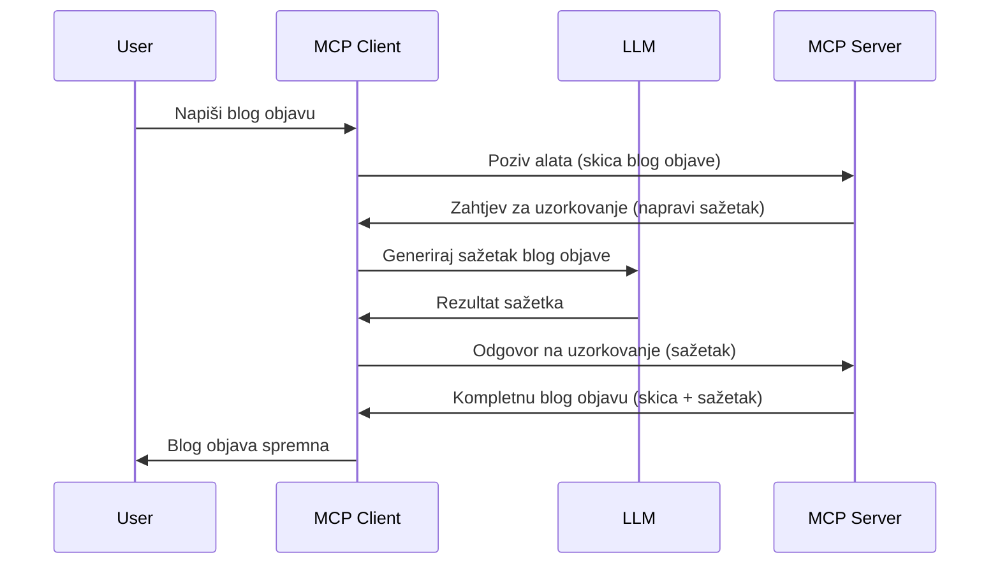

# Sampling - delegiranje značajki Klijentu

Ponekad je potrebno da MCP Klijent i MCP Server surađuju kako bi postigli zajednički cilj. Možete imati situaciju u kojoj Server treba pomoć LLM-a koji se nalazi na klijentu. Za takvu situaciju trebate koristiti sampling.

Istražimo neke slučajeve upotrebe i kako izgraditi rješenje koje uključuje sampling.

## Pregled

U ovoj lekciji fokusiramo se na objašnjenje kada i gdje koristiti Sampling te kako ga konfigurirati.

## Ciljevi učenja

U ovom poglavlju ćemo:

- Objasniti što je Sampling i kada ga koristiti.
- Pokazati kako konfigurirati Sampling u MCP-u.
- Dati primjere korištenja Samplinga u praksi.

## Što je Sampling i zašto ga koristiti?

Sampling je napredna značajka koja radi na sljedeći način:



### Zahtjev za Sampling

Ok, sada imamo širok pregled vjerodostojnog scenarija, razgovarajmo o zahtjevu za sampling koji server šalje nazad klijentu. Evo kako takav zahtjev može izgledati u JSON-RPC formatu:

```json
{
  "jsonrpc": "2.0",
  "id": 1,
  "method": "sampling/createMessage",
  "params": {
    "messages": [
      {
        "role": "user",
        "content": {
          "type": "text",
          "text": "Create a blog post summary of the following blog post: <BLOG POST>"
        }
      }
    ],
    "modelPreferences": {
      "hints": [
        {
          "name": "claude-3-sonnet"
        }
      ],
      "intelligencePriority": 0.8,
      "speedPriority": 0.5
    },
    "systemPrompt": "You are a helpful assistant.",
    "maxTokens": 100
  }
}
```

Ovdje vrijedi istaknuti nekoliko stvari:

- Prompt, pod content -> text, je naš prompt koji je uputa LLM-u da sažme sadržaj blog posta.

- **modelPreferences**. Ovaj dio je upravo to, preferencija, preporuka koju konfiguraciju koristiti s LLM-om. Korisnik može odlučiti hoće li slijediti ove preporuke ili ih promijeniti. U ovom slučaju postoje preporuke o modelu koji treba koristiti te prioritetu brzine i inteligencije.
- **systemPrompt**, ovo je vaš uobičajeni sistemski prompt koji daje vašem LLM-u osobnost i sadrži upute za vođenje.
- **maxTokens**, ovo je još jedno svojstvo koje kaže koliko tokena se preporučuje koristiti za ovaj zadatak.

### Odgovor na Sampling

Ovaj odgovor MCP Klijent na kraju šalje nazad MCP Serveru i rezultat je poziva LLM-u na strani klijenta, čekanja tog odgovora i zatim sastavljanja ove poruke. Evo kako može izgledati u JSON-RPC:

```json
{
  "jsonrpc": "2.0",
  "id": 1,
  "result": {
    "role": "assistant",
    "content": {
      "type": "text",
      "text": "Here's your abstract <ABSTRACT>"
    },
    "model": "gpt-5",
    "stopReason": "endTurn"
  }
}
```

Primijetite kako je odgovor sažetak blog posta upravo onako kako smo tražili. Također primijetite da korišteni `model` nije onaj za koji smo tražili nego "gpt-5" umjesto "claude-3-sonnet". Ovo ilustrira da korisnik može promijeniti mišljenje o tome što će koristiti i da je vaš sampling zahtjev samo preporuka.

Ok, sada kada razumijemo glavni tijek i korisnu zadaću za korištenje "izrada blog posta + sažetak", pogledajmo što trebamo napraviti da to funkcionira.

### Vrste poruka

Sampling poruke nisu ograničene samo na tekst nego možete slati i slike i audio. Evo kako JSON-RPC izgleda drugačije:

**Tekst**

```json
{
  "type": "text",
  "text": "The message content"
}
```

**Sadržaj slike**

```json
{
  "type": "image",
  "data": "base64-encoded-image-data",
  "mimeType": "image/jpeg"
}
```

**Audio sadržaj**

```json
{
  "type": "audio",
  "data": "base64-encoded-audio-data",
  "mimeType": "audio/wav"
}
```

> NOTE: za detaljnije informacije o Samplingu, pogledajte [službenu dokumentaciju](https://modelcontextprotocol.io/specification/2025-11-25/client/sampling)

## Kako konfigurirati Sampling u Klijentu

> Napomena: ako gradite samo server, ovdje ne trebate puno raditi.

U klijentu morate specificirati sljedeću značajku ovako:

```json
{
  "capabilities": {
    "sampling": {}
  }
}
```

Ovo će biti prepoznato kada vaš odabrani klijent inicijalizira vezu sa serverom.

## Primjer Samplinga u praksi - Izrada blog posta

Napisat ćemo zajedno sampling server, trebamo napraviti sljedeće:

1. Kreirati alat na Serveru.
1. Taj alat treba napraviti sampling zahtjev.
1. Alat treba čekati odgovor na sampling zahtjev sa klijenta.
1. Zatim proizvesti rezultat alata.

Pogledajmo kod korak po korak:

### -1- Kreirajte alat

**python**

```python
@mcp.tool()
async def create_blog(title: str, content: str, ctx: Context[ServerSession, None]) -> str:
    """Create a blog post and generate a summary"""

```

### -2- Kreirajte sampling zahtjev

Proširite svoj alat sljedećim kodom:

**python**

```python
post = BlogPost(
        id=len(posts) + 1,
        title=title,
        content=content,
        abstract=""
    )

prompt = f"Create an abstract of the following blog post: title: {title} and draft: {content} "

result = await ctx.session.create_message(
        messages=[
            SamplingMessage(
                role="user",
                content=TextContent(type="text", text=prompt),
            )
        ],
        max_tokens=100,
)

```

### -3- Pričekajte odgovor i vratite odgovor

**python**

```python
post.abstract = result.content.text

posts.append(post)

# vrati kompletan proizvod
return json.dumps({
    "id": post.title,
    "abstract": post.abstract
})
```

### -4- Cijeli kod

**python**

```python
from starlette.applications import Starlette
from starlette.routing import Mount, Host

from mcp.server.fastmcp import Context, FastMCP

from mcp.server.session import ServerSession
from mcp.types import SamplingMessage, TextContent

import json


from uuid import uuid4
from typing import List
from pydantic import BaseModel


mcp = FastMCP("Blog post generator")

# app = FastAPI()

posts = []

class BlogPost(BaseModel):
    id: int
    title: str
    content: str
    abstract: str

posts: List[BlogPost] = []

@mcp.tool()
async def create_blog(title: str, content: str, ctx: Context[ServerSession, None]) -> str:
    """Create a blog post and generate a summary"""

    post = BlogPost(
        id=len(posts) + 1,
        title=title,
        content=content,
        abstract=""
    )

    prompt = f"Create an abstract of the following blog post: title: {title} and draft: {content} "

    result = await ctx.session.create_message(
        messages=[
            SamplingMessage(
                role="user",
                content=TextContent(type="text", text=prompt),
            )
        ],
        max_tokens=100,
    )

    post.abstract = result.content.text

    posts.append(post)

    # vrati cijeli blog post
    return json.dumps({
        "id": post.title,
        "abstract": post.abstract
    })

if __name__ == "__main__":
    print("Starting server...")
    # mcp.run()
    mcp.run(transport="streamable-http")

# pokreni aplikaciju s: python server.py
```

### -5- Testiranje u Visual Studio Codeu

Da biste ovo testirali u Visual Studio Codeu, učinite sljedeće:

1. Pokrenite server u terminalu
1. Dodajte ga u *mcp.json* (i osigurajte da je pokrenut), nešto poput ovoga:

   ```json
   "servers": {
      "blog-server": {
        "type": "http",
        "url": "http://localhost:8000/mcp"
      }
   }
   ```

1. Upisati prompt:

   ```text
   create a blog post named "Where Python comes from", the content is "Python is actually named after Monty Python Flying Circus"
   ```

1. Dopustite da se sampling izvrši. Prvi put kada ovo testirate bit će vam prikazan dodatni dijalog koji morate prihvatiti, zatim ćete vidjeti uobičajeni dijalog za traženje pokretanja alata

1. Pregledajte rezultate. Vidjet ćete rezultate lijepo prikazane u GitHub Copilot Chatu, ali možete pregledati i sirovi JSON odgovor.

**Bonus**. Alati u Visual Studio Codeu imaju sjajnu podršku za sampling. Možete konfigurirati pristup Samplingu na instaliranom serveru tako da učinite sljedeće:

1. Navigirajte u sekciju ekstenzija.
1. Odaberite ikonu zupčanika za svoj instalirani server u sekciji "MCP SERVERS - INSTALLED".
1 Odaberite "Configure Model Access", ovdje možete odabrati koje modele GitHub Copilot smije koristiti za sampling. Također možete vidjeti sve nedavne sampling zahtjeve odabirom "Show Sampling requests".

## Zadatak

U ovom zadatku izgradit ćete nešto drugačiji Sampling, naime integraciju za sampling koja podržava generiranje opisa proizvoda. Evo vašeg scenarija:

**Scenarij**: Radnik u back officeu e-trgovine treba pomoć, previše vremena mu oduzima generiranje opisa proizvoda. Stoga trebate izgraditi rješenje u kojem ćete zvati alat "create_product" s argumentima "title" i "keywords" i trebao bi proizvesti kompletan proizvod uključujući polje "description" koje bi trebao popuniti LLM klijenta.

TIP: koristite što ste ranije naučili za izgradnju ovog servera i njegovog alata koristeći sampling zahtjev.

## Rješenje

[Rješenje](./solution/README.md)

## Ključni ishodi

Sampling je moćna značajka koja omogućuje serveru delegiranje zadataka klijentu kada mu treba pomoć LLM-a.

## Što slijedi

- [Poglavlje 4 - Praktična implementacija](../../04-PracticalImplementation/README.md)

---

<!-- CO-OP TRANSLATOR DISCLAIMER START -->
**Napomena**:
Ovaj dokument je preveden korištenjem AI prevoditeljskog servisa [Co-op Translator](https://github.com/Azure/co-op-translator). Iako težimo točnosti, imajte na umu da automatski prijevodi mogu sadržavati greške ili netočnosti. Izvorni dokument na izvornom jeziku treba smatrati autoritativnim izvorom. Za važne informacije preporuča se profesionalni ljudski prijevod. Nismo odgovorni za bilo kakva nesporazumevanja ili pogrešne interpretacije koje proizlaze iz korištenja ovog prijevoda.
<!-- CO-OP TRANSLATOR DISCLAIMER END -->