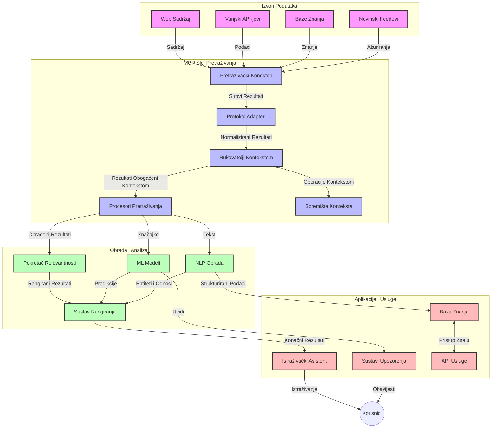
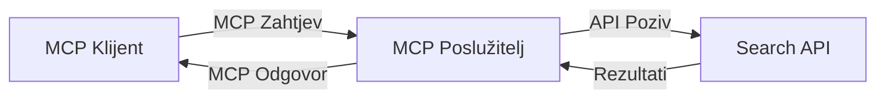
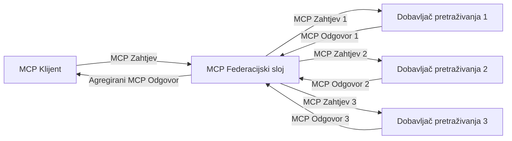
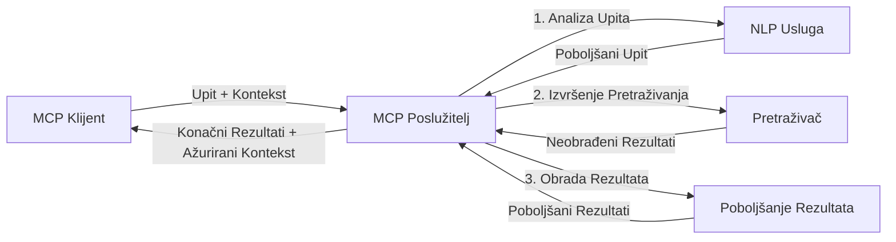

# Protokol konteksta modela za pretraživanje weba u stvarnom vremenu

## Pregled

Pretraživanje weba u stvarnom vremenu postalo je bitno u današnjem okruženju vođenom informacijama, gdje aplikacije trebaju trenutan pristup ažuriranim informacijama s interneta kako bi pružile relevantne i pravovremene odgovore. Protokol konteksta modela (MCP) predstavlja značajan napredak u optimizaciji ovih procesa pretraživanja u stvarnom vremenu, poboljšavajući učinkovitost pretraživanja, održavajući kontekstualni integritet te unaprjeđujući ukupne performanse sustava.

Ovaj modul istražuje kako MCP transformira pretraživanje weba u stvarnom vremenu pružajući standardizirani pristup upravljanju kontekstom preko AI modela, tražilica i aplikacija.

### Što ćete naučiti

U ovom iscrpnom vodiču otkrit ćete:

- Kako MCP stvara neprimjetan most između AI modela i mogućnosti pretraživanja weba u stvarnom vremenu
- Arhitektonske obrasce za implementaciju učinkovitih i skalabilnih rješenja za pretraživanje s MCP-om
- Tehnike za očuvanje konteksta pretraživanja preko više upita i interakcija
- Praktične implementacije koda u Pythonu i JavaScriptu za različite scenarije pretraživanja
- Metode za usklađivanje relevantnosti, aktualnosti i performansi u sustavima pretraživanja potpomognutim MCP-om

## Uvod u pretraživanje weba u stvarnom vremenu

Pretraživanje weba u stvarnom vremenu je tehnološki pristup koji omogućuje kontinuirano upitavanje, procesuiranje i analizu web-baziranih informacija čim se objave ili ažuriraju, što sustavima omogućuje pružanje svježih i relevantnih podataka s minimalnim zakašnjenjem. Za razliku od tradicionalnih tražilica koje koriste indeksirane podatke koji mogu biti stare satima ili danima, pretraživanje u stvarnom vremenu obrađuje žive podatke s weba, isporučujući uvide i informacije koje odražavaju trenutno stanje online sadržaja.

### Temeljni koncepti pretraživanja weba u stvarnom vremenu:

- **Kontinuirano procesiranje upita**: Upiti se obrađuju nad podacima koji se stalno ažuriraju
- **Prioritet aktualnosti**: Sustavi su dizajnirani da daju prednost svježim informacijama
- **Usklađivanje relevantnosti**: Održavanje balansa između relevantnosti i aktualnosti
- **Skalabilna arhitektura**: Sustavi moraju podnijeti promjenjive opterećenja upita i količine podataka
- **Kontekstualno razumijevanje**: Održavanje korisničkog konteksta kroz više iteracija pretraživanja ključno je za smislenije rezultate
- **Dinamička reformulacija upita**: Prilagodljivo mijenjanje upita na temelju konteksta i prethodnih rezultata
- **Integracija više izvora**: Kombiniranje rezultata iz više tražilica i web izvora
- **Semantičko razumijevanje**: Obrada upita i sadržaja temeljena na značenju, a ne samo na ključnim riječima
- **Rangiranje u stvarnom vremenu**: Kontinuirano podešavanje poretka rezultata kako nove informacije postaju dostupne

### Protokol konteksta modela i pretraživanje weba u stvarnom vremenu

Protokol konteksta modela (MCP) rješava nekoliko ključnih izazova u okruženjima pretraživanja weba u stvarnom vremenu:

1. **Očuvanje konteksta pretraživanja**: MCP standardizira način održavanja konteksta preko distribuiranih komponenti pretraživanja, osiguravajući da AI modeli i obradni čvorovi imaju pristup relevantnoj povijesti upita i korisničkim preferencijama.

2. **Učinkovito upravljanje upitima**: Osiguravajući strukturirane mehanizme za prijenos konteksta, MCP smanjuje troškove ponavljanja konteksta pri svakoj iteraciji pretraživanja.

3. **Interoperabilnost**: MCP stvara zajednički jezik za dijeljenje konteksta između različitih tehnologija pretraživanja i AI modela, omogućujući fleksibilnije i proširivo arhitekture.

4. **Optimizirani kontekst za pretraživanje**: Implementacije MCP-a mogu prioritetizirati koje su elemente konteksta najrelevantniji za učinkovito pretraživanje, optimizirajući i performanse i točnost.

5. **Prilagodljivo procesiranje pretraživanja**: Kroz adekvatno upravljanje kontekstom pomoću MCP-a, sustavi pretraživanja mogu dinamički prilagođavati procesiranje temeljem mijenjajućih potreba korisnika i informativnih krajolika.

U suvremenim aplikacijama, od agregacije vijesti do istraživačkih asistenata, integracija MCP-a s tehnologijama pretraživanja omogućuje inteligentnije, kontekstualno svjesno pretraživanje koje može davati sve relevantnije rezultate kako se korisničke interakcije nastavljaju.

## Ciljevi učenja

Na kraju ove lekcije moći ćete:

- Razumjeti osnove pretraživanja weba u stvarnom vremenu i njegove izazove u modernim aplikacijama
- Objasniti kako Protokol konteksta modela (MCP) poboljšava mogućnosti pretraživanja u stvarnom vremenu
- Implementirati rješenja za pretraživanje temeljena na MCP-u koristeći popularne okvire i API-je
- Dizajnirati i implementirati skalabilne, visoko-performansne arhitekture pretraživanja s MCP-om
- Primijeniti koncepte MCP-a na različite primjere upotrebe uključujući semantičko pretraživanje, pomoć u istraživanju i AI-poboljšano pregledavanje
- Procijeniti nove trendove i buduće inovacije u tehnologijama pretraživanja temeljene na MCP-u
- Razvijati sustave za pretraživanje svjesne konteksta koji uče iz korisničkih interakcija
- Integrirati mogućnosti pretraživanja weba u AI asistente koristeći standardizirane MCP protokole
- Kreirati višestupanjske cjevovode pretraživanja koji postupno poboljšavaju rezultate temeljem konteksta
- Optimizirati performanse pretraživanja uz održavanje sveobuhvatne svijesti o kontekstu

### Definicija i značaj

Pretraživanje weba u stvarnom vremenu uključuje kontinuirano upitavanje, dohvaćanje i isporuku web-baziranih informacija s minimalnim zakašnjenjem. Za razliku od tradicionalnih tražilica koje povremeno indeksiraju web, pretraživanje u stvarnom vremenu ima za cilj izložiti informacije čim postanu dostupne, omogućujući trenutan pristup najnovijem sadržaju.

Ključne karakteristike pretraživanja weba u stvarnom vremenu uključuju:

- **Svježina**: Prioritet novom sadržaju i ažuriranjima
- **Kontinuirano procesiranje**: Stalni nadzor novih informacija
- **Prilagodba upita**: Dorada upita prema kontekstu i povratnim informacijama
- **Momentalna isporuka**: Pružanje rezultata pretraživanja bez odgode
- **Zadržavanje konteksta**: Nadovezivanje na prethodne upite radi bolje relevantnosti

### Izazovi tradicionalnog pretraživanja weba

Tradicionalni pristupi pretraživanju weba suočavaju se sa nekoliko ograničenja u primjeni na scenarije u stvarnom vremenu:

1. **Fragmentacija konteksta**: Poteškoće u održavanju konteksta pretraživanja kroz više upita
2. **Svježina informacija**: Izazovi u pristupu i prioritetiziranju najnovijih podataka
3. **Kompleksnost integracije**: Problemi interoperabilnosti između sustava pretraživanja i aplikacija
4. **Problemi s latencijom**: Balansiranje opsežnog pretraživanja sa zahtjevima vremena odziva
5. **Podešavanje relevantnosti**: Osiguravanje točnosti i relevantnosti uz davanje prioriteta aktualnosti

## Razumijevanje protokola konteksta modela (MCP) za pretraživanje

### Što je MCP u kontekstima pretraživanja?

Protokol konteksta modela (MCP) je standardizirani komunikacijski protokol dizajniran za olakšavanje učinkovite interakcije između AI modela i aplikacija. U kontekstu pretraživanja weba u stvarnom vremenu, MCP pruža okvir za:

- Očuvanje konteksta pretraživanja tijekom nizova upita
- Standardizaciju formata upita i rezultata pretraživanja
- Optimizaciju prijenosa parametara pretraživanja i rezultata
- Poboljšanje komunikacije između modela i tražilica

### Temeljne komponente i arhitektura

MCP arhitektura za pretraživanje weba u stvarnom vremenu sastoji se od glavnih komponenti:

1. **Upravitelji konteksta upita**: Upravljaju i održavaju kontekst pretraživanja kroz više upita
2. **Procesori pretraživanja**: Obrada dolaznih zahtjeva za pretraživanje koristeći tehnike svjesne konteksta
3. **Adapteri protokola**: Pretvaraju se između različitih pretraživačkih API-ja uz očuvanje konteksta
4. **Spremište konteksta**: Učinkovito pohranjuje i dohvaća povijest pretraživanja i preferencije
5. **Konektori pretraživanja**: Povezuju se s različitim tražilicama i web API-jima



### Kako MCP poboljšava pretraživanje weba u stvarnom vremenu

MCP rješava izazove tradicionalnog pretraživanja kroz:

- **Kontekstualnu kontinuitet**: Održavanje odnosa između upita kroz cijelu sesiju pretraživanja
- **Optimiziran prijenos**: Smanjenje suvišnosti u parametrima pretraživanja kroz inteligentno upravljanje kontekstom
- **Standardizirane sučelje**: Pružanje dosljednih API-ja za komponente pretraživanja
- **Smanjena latencija**: Minimiziranje procesorskog opterećenja kroz učinkovito upravljanje kontekstom
- **Poboljšana relevantnost**: Unapređivanje relevantnosti pretraživanja očuvanjem korisničke namjere kroz više upita

## Integracija i implementacija

Sustavi za pretraživanje weba u stvarnom vremenu zahtijevaju pažljiv arhitektonski dizajn i implementaciju kako bi se održale i performanse i kontekstualni integritet. Protokol konteksta modela nudi standardizirani pristup integraciji AI modela i tehnologija pretraživanja, omogućujući sofisticiranije, kontekstualno svjesne cjevovode pretraživanja.

### Pregled integracije MCP-a u arhitekture pretraživanja

Implementacija MCP-a u okruženjima pretraživanja u stvarnom vremenu uključuje nekoliko ključnih razmatranja:

1. **Serijalizacija konteksta pretraživanja**: MCP pruža učinkovite mehanizme kodiranja kontekstualnih informacija unutar zahtjeva za pretraživanje, osiguravajući da se bitni kontekst prenosi s upitom kroz cijeli procesni tok. To uključuje standardizirane formate serijalizacije optimizirane za metapodatke povezane s pretraživanjem.

2. **Procesiranje pretraživanja s održavanjem stanja**: MCP omogućuje pametnije procesiranje s održavanjem stanja čuvanjem dosljedne reprezentacije konteksta tijekom iteracija pretraživanja. To je osobito vrijedno u višestupanjskim cjevovodima pretraživanja gdje rafiniranje konteksta unaprjeđuje rezultate.

3. **Proširenje i rafiniranje upita**: Implementacije MCP-a u sustavima pretraživanja mogu olakšati naprednu ekspanziju i rafiniranje upita na temelju akumuliranog konteksta, dopuštajući sve relevantnije rezultate kako sesija pretraživanja napreduje.

4. **Keširanje i prioritetizacija rezultata**: Standardiziranjem rukovanja kontekstom, MCP pomaže u upravljanju keširanjem i prioritetizacijom rezultata, dopuštajući komponentama da se prilagođavaju prema mijenjajućem se kontekstu pretraživanja.

5. **Federacija i agregacija pretraživanja**: MCP omogućuje sofisticiraniju federaciju pretraživanja preko više pozadinskih sustava pružajući strukturirane reprezentacije konteksta pretraživanja, omogućujući smisleniju agregaciju rezultata iz različitih izvora.

Implementacija MCP-a preko raznih tehnologija pretraživanja stvara jedinstveni pristup upravljanju kontekstom, smanjujući potrebu za prilagođenim integracijskim kodom dok istovremeno unapređuje sposobnost sustava za održavanje smislenog konteksta kako upiti evoluiraju.

### MCP u različitim implementacijama pretraživanja weba

Ovi primjeri prate trenutnu specifikaciju MCP-a koja se fokusira na JSON-RPC bazirani protokol s različitim mehanizmima prijenosa. Kod prikazuje kako možete implementirati prilagođene integracije pretraživanja uz održavanje pune kompatibilnosti s MCP protokolom.


<details>
<summary>Python implementacija s generičkim Search API-jem</summary>

```python
import asyncio
import json
import aiohttp
from typing import Dict, Any, Optional, List
from contextlib import asynccontextmanager
from collections.abc import AsyncIterator

# Uvezi standardne MCP biblioteke
from mcp.client.session import ClientSession
from mcp.client.streamable_http import streamablehttp_client
from mcp.types import TextContent, CreateMessageRequestParams, CreateMessageResult
from mcp.server.fastmcp import FastMCP

# Kreiraj FastMCP poslužitelj za web pretraživanje
search_server = FastMCP("WebSearch")

# Klasa za upravljanje operacijama pretraživanja weba
class WebSearchHandler:
    def __init__(self, api_endpoint: str, api_key: str):
        self.api_endpoint = api_endpoint
        self.api_key = api_key
        self.session = None
        
    async def initialize(self):
        """Initialize the HTTP session"""
        self.session = aiohttp.ClientSession(
            headers={"Authorization": f"Bearer {self.api_key}"}
        )
    
    async def close(self):
        """Close the HTTP session"""
        if self.session:
            await self.session.close()
            
    async def perform_search(self, query: str, max_results: int = 5, 
                           include_domains: List[str] = None, 
                           exclude_domains: List[str] = None,
                           time_period: str = "any") -> Dict[str, Any]:
        """Perform web search using the search API"""
        # Konstrukcija parametara pretraživanja
        search_params = {
            "q": query,
            "limit": max_results,
            "time": time_period
        }
        
        if include_domains:
            search_params["site"] = ",".join(include_domains)
            
        if exclude_domains:
            search_params["exclude_site"] = ",".join(exclude_domains)
        
        # Izvrši zahtjev za pretraživanje
        try:
            async with self.session.get(
                self.api_endpoint,
                params=search_params
            ) as response:
                if response.status != 200:
                    error_text = await response.text()
                    raise Exception(f"Search API error: {response.status} - {error_text}")
                
                search_data = await response.json()
                
                # Pretvori API-specifični odgovor u standardni format
                results = []
                for item in search_data.get("results", []):
                    results.append({
                        "title": item.get("title", ""),
                        "url": item.get("url", ""),
                        "snippet": item.get("snippet", ""),
                        "date": item.get("published_date", ""),
                        "source": item.get("source", "")
                    })
                
                return {
                    "query": query,
                    "totalResults": len(results),
                    "results": results
                }
        except Exception as e:
            print(f"Search API request error: {e}")
            raise

# Inicijaliziraj rukovatelja pretraživanjem
search_handler = WebSearchHandler(
    api_endpoint="https://api.search-service.example/search",
    api_key="your-api-key-here"
)

# Postavi lifespan za upravljanje rukovateljem pretraživanja
@asyncio.asynccontextmanager
async def app_lifespan(server: FastMCP):
    """Manage application lifecycle"""
    await search_handler.initialize()
    try:
        yield {"search_handler": search_handler}
    finally:
        await search_handler.close()

# Postavi lifespan za poslužitelj
search_server = FastMCP("WebSearch", lifespan=app_lifespan)

# Registriraj alat za web pretraživanje
@search_server.tool()
async def web_search(query: str, max_results: int = 5, 
                   include_domains: List[str] = None,
                   exclude_domains: List[str] = None,
                   time_period: str = "any") -> Dict[str, Any]:
    """
    Search the web for information
    
    Args:
        query: The search query
        max_results: Maximum number of results to return (default: 5)
        include_domains: List of domains to include in search results
        exclude_domains: List of domains to exclude from search results
        time_period: Time period for results ("day", "week", "month", "any")
        
    Returns:
        Dictionary containing search results
    """
    ctx = search_server.get_context()
    search_handler = ctx.request_context.lifespan_context["search_handler"]
    
    results = await search_handler.perform_search(
        query=query,
        max_results=max_results,
        include_domains=include_domains,
        exclude_domains=exclude_domains,
        time_period=time_period
    )
    
    return results

# Primjer korištenja klijenta
async def client_example():
    # Poveži se na poslužitelj pretraživanja koristeći Streamable HTTP transport
    async with streamablehttp_client("http://localhost:8000/mcp") as (read, write, _):
        async with ClientSession(read, write) as session:
            # Inicijaliziraj vezu
            await session.initialize()
            
            # Pozovi alat web_search
            search_results = await session.call_tool(
                "web_search", 
                {
                    "query": "latest developments in AI and Model Context Protocol",
                    "max_results": 5,
                    "time_period": "day",
                    "include_domains": ["github.com", "microsoft.com"]
                }
            )
            
            print(f"Search results: {search_results}")

# Primjer izvršavanja poslužitelja
if __name__ == "__main__":
    # Pokreni poslužitelj sa Streamable HTTP transportom
    search_server.run(transport="streamable-http")
```
</details> 

<details>
<summary>JavaScript implementacija za pretraživanje u pregledniku</summary>


```javascript
// Implementacija MCP poslužitelja za web pretraživanje
import { McpServer, ResourceTemplate } from '@modelcontextprotocol/sdk/server/mcp.js';
import { StreamableHTTPServerTransport } from '@modelcontextprotocol/sdk/server/streamableHttp.js';
import { z } from 'zod';

// Kreirajte MCP poslužitelj za web pretraživanje
const searchServer = new McpServer({
    name: "BrowserSearch",
    description: "A server that provides web search capabilities"
});

// Klasa servisa za pretraživanje
class SearchService {
    constructor(searchApiUrl, apiKey) {
        this.searchApiUrl = searchApiUrl;
        this.apiKey = apiKey;
    }

    async performSearch(parameters) {
        const {
            query = '',
            maxResults = 5,
            includeDomains = [],
            excludeDomains = [],
            timePeriod = 'any'
        } = parameters;
        
        // Konstruirajte URL za pretraživanje s parametrima
        const url = new URL(this.searchApiUrl);
        url.searchParams.append('q', query);
        url.searchParams.append('limit', maxResults);
        url.searchParams.append('time', timePeriod);
        
        if (includeDomains.length > 0) {
            url.searchParams.append('site', includeDomains.join(','));
        }
        
        if (excludeDomains.length > 0) {
            url.searchParams.append('exclude_site', excludeDomains.join(','));
        }
        
        try {
            const response = await fetch(url.toString(), {
                method: 'GET',
                headers: {
                    'Authorization': `Bearer ${this.apiKey}`,
                    'Content-Type': 'application/json'
                }
            });
            
            if (!response.ok) {
                const errorText = await response.text();
                throw new Error(`Search API error: ${response.status} - ${errorText}`);
            }
            
            const searchData = await response.json();
            
            // Pretvorite odgovor specifičan za API u standardni format
            const results = searchData.results?.map(item => ({
                title: item.title || '',
                url: item.url || '',
                snippet: item.snippet || '',
                date: item.published_date || '',
                source: item.source || ''
            })) || [];
            
            return {
                query,
                totalResults: results.length,
                results
            };
        } catch (error) {
            console.error('Search API request error:', error);
            throw error;
        }
    }
}

// Inicijalizirajte servis za pretraživanje
const searchService = new SearchService(
    'https://api.search-service.example/search',
    'your-api-key-here'
);

// Postavite pružatelja konteksta za poslužitelj
searchServer.setContextProvider(() => {
    return {
        searchService
    };
});

// Registrirajte alat za web pretraživanje
searchServer.tool({
    name: 'web_search',
    description: 'Search the web for information',
    parameters: {
        type: 'object',
        properties: {
            query: {
                type: 'string',
                description: 'The search query'
            },
            maxResults: {
                type: 'integer',
                description: 'Maximum number of results to return',
                default: 5
            },
            includeDomains: {
                type: 'array',
                items: { type: 'string' },
                description: 'List of domains to include in search results'
            },
            excludeDomains: {
                type: 'array',
                items: { type: 'string' },
                description: 'List of domains to exclude from search results'
            },
            timePeriod: {
                type: 'string',
                description: 'Time period for results',
                enum: ['day', 'week', 'month', 'any'],
                default: 'any'
            }
        },
        required: ['query']
    },
    handler: async (params, context) => {
        const { searchService } = context;
        return await searchService.performSearch(params);
    }
});

// Primjer klijentskog koda za povezivanje s poslužiteljem za pretraživanje
import { Client } from '@modelcontextprotocol/sdk/client/index.js';
import { StreamableHTTPClientTransport } from '@modelcontextprotocol/sdk/client/streamableHttp.js';

async function connectToSearchServer() {
    // Povežite se s poslužiteljem za pretraživanje
    const transport = new StreamableHTTPClientTransport(
        new URL('http://localhost:8000/mcp')
    );
    
    const client = new Client({
        name: 'search-client',
        version: '1.0.0'
    });
    
    await client.connect(transport);
    
    // Izvršite alat za pretraživanje
    const searchResults = await client.callTool({
        name: 'web_search',
        arguments: {
            query: 'Model Context Protocol implementation examples',
            maxResults: 10,
            timePeriod: 'week',
            includeDomains: ['github.com', 'docs.microsoft.com']
        }
    });
    
    console.log('Search results:', searchResults);
    
    // Očistite resurse
    await client.disconnect();
}

// Pokrenite poslužitelj
const transport = new StreamableHTTPServerTransport();
await searchServer.connect(transport);
console.log('Search server running at http://localhost:8000/mcp');

// U zasebnom procesu ili nakon pokretanja poslužitelja
// connectToSearchServer().catch(console.error);
```
</details> 


## Odricanje od odgovornosti za primjere koda

> **Važna napomena**: Primjeri koda u nastavku prikazuju integraciju Protokola konteksta modela (MCP) s funkcionalnošću pretraživanja weba. Iako slijede obrasce i strukture službenih MCP SDK-ova, oni su pojednostavljeni u edukacijske svrhe.
> 
> Ovi primjeri prikazuju:
> 
> 1. **Python implementaciju**: Implementaciju FastMCP servera koji pruža alat za pretraživanje weba i povezuje se s vanjskim pretraživačkim API-jem. Ovaj primjer demonstrira pravilno upravljanje životnim ciklusom, rukovanje kontekstom i implementaciju alata slijedeći obrasce [službenog MCP Python SDK-a](https://github.com/modelcontextprotocol/python-sdk). Server koristi preporučeni Streamable HTTP transport koji je zamijenio stariji SSE transport za produkcijska okruženja.
> 
> 2. **JavaScript implementaciju**: Implementaciju u TypeScript/JavaScriptu koristeći FastMCP obrazac iz [službenog MCP TypeScript SDK-a](https://github.com/modelcontextprotocol/typescript-sdk) za kreiranje servera za pretraživanje s ispravnim definicijama alata i klijentskim vezama. Slijedi najnovije preporučene obrasce za upravljanje sesijama i očuvanje konteksta.
> 
> Ovi primjeri zahtijevaju dodatno rukovanje pogreškama, autentifikaciju i specifični kod za integraciju API-ja za produkcijsku upotrebu. API endpointi pretraživanja prikazani (`https://api.search-service.example/search`) su rezervni i trebali bi se zamijeniti stvarnim endpointima usluga za pretraživanje.
> 
> Za potpune detalje implementacije i najnovije pristupe, molimo pogledajte [službenu MCP specifikaciju](https://spec.modelcontextprotocol.io/) i dokumentaciju SDK-a.

## Temeljni koncepti

### Okvir Protokola konteksta modela (MCP)

Na svojoj osnovi, Protokol konteksta modela pruža standardizirani način da AI modeli, aplikacije i servisi razmjenjuju kontekst. U pretraživanju weba u stvarnom vremenu, ovaj okvir je ključan za stvaranje koherentnih iskustava pretraživanja s više okretaja. Ključne komponente uključuju:

1. **Klijent-server arhitektura**: MCP uspostavlja jasnu podjelu između klijenata pretraživanja (zahtjevača) i servera pretraživanja (pružatelja), omogućujući fleksibilne modele implementacije.

2. **JSON-RPC komunikacija**: Protokol koristi JSON-RPC za razmjenu poruka, što ga čini kompatibilnim s web tehnologijama i laganim za implementaciju na različitim platformama.

3. **Upravljanje kontekstom**: MCP definira strukturirane metode za održavanje, ažuriranje i upotrebu konteksta pretraživanja kroz više interakcija.

4. **Definicije alata**: Mogućnosti pretraživanja izlažu se kao standardizirani alati s jasno definiranim parametrima i povratnim vrijednostima.

5. **Podrška za streaming**: Protokol podržava strujanje rezultata, što je ključno za pretraživanje u stvarnom vremenu gdje rezultati mogu stizati postepeno.

### Obrasci integracije pretraživanja weba

Prilikom integracije MCP-a s pretraživanjem weba pojavljuju se nekoliko obrazaca:

#### 1. Izravna integracija pružatelja pretraživanja



U ovom obrascu, MCP server izravno se povezuje s jednim ili više API-ja za pretraživanje, prevodeći MCP zahtjeve u specifične API pozive i formatirajući rezultate kao MCP odgovore.

#### 2. Federirano pretraživanje s očuvanjem konteksta



Ovaj obrazac distribuira upite za pretraživanje preko više MCP-kompatibilnih pružatelja, svaki potencijalno specijaliziran za različite vrste sadržaja ili mogućnosti pretraživanja, a istovremeno održava jedinstveni kontekst.

#### 3. Pretraživački lanac obogaćen kontekstom



U ovom obrascu, proces pretraživanja podijeljen je na više faza, pri čemu se kontekst obogaćuje na svakom koraku, rezultirajući progresivno relevantnijim rezultatima.

### Komponente konteksta pretraživanja

U pretraživanju weba baziranom na MCP-u, kontekst obično uključuje:

- **Povijest upita**: Prethodni upiti u sesiji
- **Korisničke preferencije**: Jezik, regija, postavke sigurnog pretraživanja
- **Povijest interakcija**: Koje su rezultate korisnici kliknuli, vrijeme provedeno na rezultatima
- **Parametri pretraživanja**: Filtri, redoslijedi sortiranja i drugi modifikatori pretraživanja
- **Znanje o domeni**: Temeljni kontekst relevantan za predmet pretraživanja
- **Vremenski kontekst**: Faktori relevantnosti temeljeni na vremenu
- **Preferencije izvora**: Pouzdani ili preferirani izvori informacija

## Primjeri upotrebe i primjene

### Istraživanje i prikupljanje informacija

MCP poboljšava istraživačke tijekove rada kroz:

- Očuvanje konteksta istraživanja kroz sesije pretraživanja
- Omogućavanje sofisticiranijih i kontekstualno relevantnih upita
- Podršku federacije pretraživanja preko više izvora
- Olakšavanje izvlačenja znanja iz rezultata pretraživanja

### Praćenje vijesti i trendova u stvarnom vremenu

Pretraživanje potpomognuto MCP-om nudi prednosti za praćenje vijesti:

- Otkriće novih vijesti gotovo u stvarnom vremenu
- Kontekstualno filtriranje relevantnih informacija
- Praćenje tema i entiteta preko više izvora
- Personalizirane obavijesti o vijestima na temelju korisničkog konteksta

### AI-poboljšano pregledavanje i istraživanje

MCP stvara nove mogućnosti za AI-poboljšano pregledavanje:

- Kontekstualni prijedlozi pretraživanja temeljeni na trenutačnoj aktivnosti u pregledniku
- Besprijekorna integracija web pretraživanja s asistentima pokretanim LLM modelima
- Više-okretno rafiniranje pretraživanja s održanim kontekstom
- Poboljšano provjeravanje činjenica i verifikacija informacija

## Budući trendovi i inovacije

### Evolucija MCP-a u pretraživanju weba

Gledajući prema naprijed, očekujemo da će MCP evoluirati kako bi odgovorio na:
- **Multimodalna pretraga**: Integracija pretrage teksta, slike, zvuka i videa sa sačuvanim kontekstom
- **Decentralizirana pretraga**: Podrška za distribuirane i federirane ekosisteme pretrage
- **Privatnost pretrage**: Mehanizmi pretrage koji poštuju privatnost i uzimaju u obzir kontekst
- **Razumijevanje upita**: Duboka semantička analiza prirodnojezičnih upita za pretragu

### Potencijalni tehnološki napredci

Nove tehnologije koje će oblikovati budućnost MCP pretrage:

1. **Neuronske arhitekture pretrage**: Sustavi pretraživanja zasnovani na ugradnji optimizirani za MCP
2. **Personalizirani kontekst pretrage**: Učenje individualnih obrazaca pretraživanja korisnika kroz vrijeme
3. **Integracija grafova znanja**: Kontekstualna pretraga poboljšana domen-specifičnim grafovima znanja
4. **Kros-modalni kontekst**: Održavanje konteksta preko različitih modaliteta pretrage

## Praktične vježbe

### Vježba 1: Postavljanje osnovne MCP pipeline pretrage

U ovoj vježbi naučit ćete kako:
- Konfigurirati osnovno MCP okruženje za pretragu
- Implementirati rukovatelje kontekstom za web pretragu
- Testirati i validirati očuvanje konteksta kroz iteracije pretrage

### Vježba 2: Izgradnja istraživačkog asistenta s MCP pretragom

Kreirajte potpunu aplikaciju koja:
- Procesira istraživačka pitanja na prirodnom jeziku
- Izvodi pretrage na webu u skladu s kontekstom
- Sintetizira informacije iz više izvora
- Prikazuje organizirane rezultate istraživanja

### Vježba 3: Implementacija federacije pretrage s više izvora u MCP

Napredna vježba koja obuhvaća:
- Slanje upita u skladu s kontekstom na više tražilica
- Rangiranje i agregaciju rezultata
- Kontekstualno uklanjanje dupliciranih rezultata pretrage
- Obradu meta-podataka specifičnih za izvore

## Dodatni resursi

- [Model Context Protocol Specification](https://spec.modelcontextprotocol.io/) - Službena specifikacija MCP i detaljna dokumentacija protokola
- [Model Context Protocol Documentation](https://modelcontextprotocol.io/) - Detaljni vodiči i priručnici za implementaciju
- [MCP Python SDK](https://github.com/modelcontextprotocol/python-sdk) - Službena Python implementacija MCP protokola
- [MCP TypeScript SDK](https://github.com/modelcontextprotocol/typescript-sdk) - Službena TypeScript implementacija MCP protokola
- [MCP Reference Servers](https://github.com/modelcontextprotocol/servers) - Referentne implementacije MCP servera
- [Bing Web Search API Documentation](https://learn.microsoft.com/en-us/bing/search-apis/bing-web-search/overview) - Microsoftov API za web pretragu
- [Google Custom Search JSON API](https://developers.google.com/custom-search/v1/overview) - Googleov programabilni tražilica
- [SerpAPI Documentation](https://serpapi.com/search-api) - API za rezultate tražilice
- [Meilisearch Documentation](https://www.meilisearch.com/docs) - Open-source tražilica
- [Elasticsearch Documentation](https://www.elastic.co/guide/index.html) - Distribuirana tražilica i alat za analitiku
- [LangChain Documentation](https://python.langchain.com/docs/get_started/introduction) - Izgradnja aplikacija s LLM-ovima

## Ishodi učenja

Nakon završetka ovog modula moći ćete:

- Razumjeti osnove pretrage weba u stvarnom vremenu i njene izazove
- Objasniti kako Model Context Protocol (MCP) unapređuje mogućnosti pretrage weba u stvarnom vremenu
- Implementirati MCP-bazirana rješenja za pretragu koristeći popularne okvire i API-je
- Dizajnirati i implementirati skalabilne, visokoučinkovite arhitekture pretrage s MCP-om
- Primijeniti MCP koncepte u različitim slučajevima korištenja uključujući semantičku pretragu, asistenciju u istraživanju i pregledavanje s podrškom umjetne inteligencije
- Procijeniti nove trendove i buduće inovacije u MCP-baziranim tehnologijama pretrage

### Razmatranja povjerenja i sigurnosti

Prilikom implementacije MCP-baziranih rješenja za web pretragu, imajte na umu sljedeća važna načela iz MCP specifikacije:

1. **Složnost korisnika i kontrola**: Korisnici moraju izričito pristati i razumjeti sve pristupe i operacije nad podacima. Ovo je osobito važno za implementacije web pretrage koje mogu pristupati vanjskim izvorima podataka.

2. **Privatnost podataka**: Osigurajte odgovarajuće postupanje s upitima i rezultatima pretrage, posebno ako sadrže osjetljive informacije. Implementirajte odgovarajuće kontrole pristupa za zaštitu korisničkih podataka.

3. **Sigurnost alata**: Implementirajte ispravnu autorizaciju i validaciju alata za pretragu jer oni predstavljaju potencijalne sigurnosne rizike kroz izvršavanje proizvoljnog koda. Opisi ponašanja alata trebaju se smatrati nepouzdanim osim ako nisu dobiveni od pouzdanog servera.

4. **Jasna dokumentacija**: Osigurajte jasnu dokumentaciju o mogućnostima, ograničenjima i sigurnosnim razmatranjima vaše MCP-bazirane implementacije pretrage, slijedeći smjernice iz MCP specifikacije.

5. **Robusni tokovi pristanka**: Izgradite robusne tokove pristanka i autorizacije koji jasno objašnjavaju što svaki alat radi prije nego što se dopusti njegova uporaba, osobito za alate koji komuniciraju s vanjskim web resursima.

Za potpune detalje o MCP sigurnosti i razmatranjima pouzdanosti, pogledajte [službenu dokumentaciju](https://modelcontextprotocol.io/specification/2025-11-25/basic/security_best_practices).

## Što je sljedeće

- [5.12 Entra ID autentikacija za Model Context Protocol servere](../mcp-security-entra/README.md)

---

<!-- CO-OP TRANSLATOR DISCLAIMER START -->
**Napomena**:
Ovaj dokument je preveden korištenjem AI prevoditeljskog servisa [Co-op Translator](https://github.com/Azure/co-op-translator). Iako težimo točnosti, imajte na umu da automatski prijevodi mogu sadržavati greške ili netočnosti. Izvorni dokument na izvornom jeziku treba smatrati autoritativnim izvorom. Za važne informacije preporuča se profesionalni ljudski prijevod. Nismo odgovorni za bilo kakva nesporazumevanja ili pogrešne interpretacije koje proizlaze iz korištenja ovog prijevoda.
<!-- CO-OP TRANSLATOR DISCLAIMER END -->