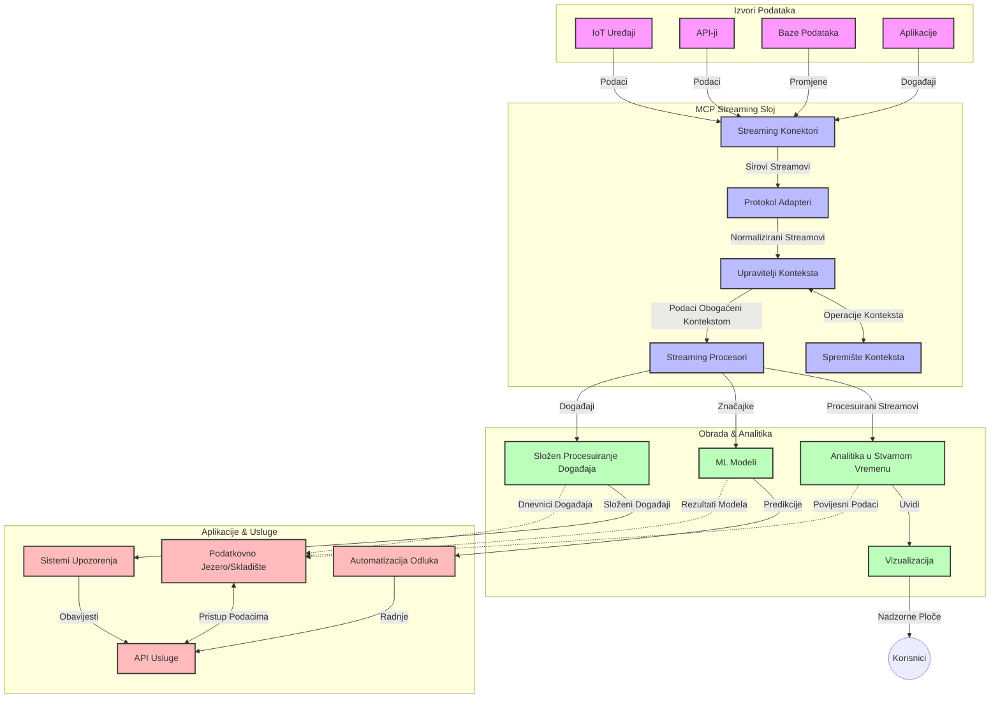

# Protokol Konteksta Modela za Streaming Podataka u Stvarnom Vremenu

## Pregled

Streaming podataka u stvarnom vremenu postao je ključan u današnjem svijetu vođenom podacima, gdje tvrtke i aplikacije zahtijevaju trenutni pristup informacijama kako bi donosile pravovremene odluke. Protokol Konteksta Modela (MCP) predstavlja značajan napredak u optimizaciji ovih procesa streaming podataka u stvarnom vremenu, poboljšavajući učinkovitost obrade podataka, održavajući kontekstualni integritet i unapređujući ukupne performanse sustava.

Ovaj modul istražuje kako MCP transformira streaming podataka u stvarnom vremenu pružajući standardizirani pristup upravljanju kontekstom među AI modelima, platformama za streaming i aplikacijama.

## Uvod u Streaming Podataka u Stvarnom Vremenu

Streaming podataka u stvarnom vremenu tehnološki je paradigma koja omogućava kontinuirani prijenos, obradu i analizu podataka dok se generiraju, dopuštajući sustavima da odmah reagiraju na nove informacije. Za razliku od tradicionalne obrade u skupinama koja radi na statičkim skupovima podataka, streaming obrađuje podatke u pokretu, pružajući uvide i akcije s minimalnom latencijom.

### Osnovni pojmovi streaminga podataka u stvarnom vremenu:

- **Kontinuirani tok podataka**: Podaci se obrađuju kao kontinuirani, nikad završavajući tok događaja ili zapisa.
- **Obrada s niskom latencijom**: Sustavi su dizajnirani da minimiziraju vrijeme između generiranja i obrade podataka.
- **Skalabilnost**: Streaming arhitekture moraju podnijeti varijabilne volumene i brzine podataka.
- **Otpornost na pogreške**: Sustavi trebaju biti otporni na kvarove kako bi osigurali neprekinuti tok podataka.
- **Obrada sa stanjem**: Održavanje konteksta kroz događaje ključno je za smisleniju analizu.

### Protokol Konteksta Modela i Streaming u Stvarnom Vremenu

Protokol Konteksta Modela (MCP) rješava nekoliko ključnih izazova u okruženjima streaminga u stvarnom vremenu:

1. **Kontekstualna kontinuitet**: MCP standardizira način održavanja konteksta među distribuiranim komponentama streaminga, osiguravajući da AI modeli i čvorovi obrade imaju pristup relevantnom povijesnom i okolišnom kontekstu.

2. **Učinkovito upravljanje stanjem**: Pružajući strukturirane mehanizme za prijenos konteksta, MCP smanjuje opterećenje upravljanja stanjem u streaming cjevovodima.

3. **Interoperabilnost**: MCP stvara zajednički jezik za dijeljenje konteksta između raznih streaming tehnologija i AI modela, omogućujući fleksibilnije i proširive arhitekture.

4. **Kontekst optimiziran za streaming**: Implementacije MCP-a mogu prioritizirati koje su stavke konteksta najvažnije za donošenje odluka u stvarnom vremenu, optimizirajući performanse i točnost.

5. **Prilagodljiva obrada**: Uz pravilno upravljanje kontekstom kroz MCP, streaming sustavi mogu dinamički prilagođavati obradu na temelju promjenjivih uvjeta i obrazaca u podacima.

U suvremenim aplikacijama od IoT senzorskih mreža do financijskih trgovačkih platformi, integracija MCP-a s streaming tehnologijama omogućuje inteligentniju, kontekstualno svjesnu obradu koja može pravovremeno odgovarati na složene, evoluirajuće situacije u stvarnom vremenu.

## Ciljevi Učenja

Na kraju ovog sata moći ćete:

- Razumjeti osnove streaminga podataka u stvarnom vremenu i njegove izazove
- Objasniti kako Protokol Konteksta Modela (MCP) unapređuje streaming podataka u stvarnom vremenu
- Implementirati streaming rješenja temeljena na MCP-u koristeći popularne okvire poput Kafke i Pulsara
- Dizajnirati i implementirati arhitekture streaminga otporne na kvarove i visoke izvedbe s MCP-om
- Primijeniti koncepte MCP-a u slučajevima korištenja za IoT, financijsko trgovanje i analitiku vođenu AI-jem
- Procijeniti nove trendove i buduće inovacije u tehnologijama streaminga temeljenima na MCP-u


### Definicija i Značaj

Streaming podataka u stvarnom vremenu uključuje kontinuiranu generaciju, obradu i isporuku podataka s minimalnom latencijom. Za razliku od obrade u skupinama gdje se podaci prikupljaju i obrađuju u grupama, streaming podaci obrađuju se postupno kako dolaze, omogućujući trenutne uvide i radnje.

Ključne karakteristike streaminga podataka u stvarnom vremenu uključuju:

- **Niska latencija**: Obrada i analiza podataka unutar milisekundi do sekundi
- **Kontinuirani tok**: Neprekidni tokovi podataka iz različitih izvora
- **Neposredna obrada**: Analiza podataka čim stignu, a ne u skupinama
- **Arhitektura vođena događajima**: Reagiranje na događaje čim se dogode

### Izazovi u Tradicionalnom Streaming Podacima

Tradicionalni pristupi streamingu podataka suočavaju se s nekoliko ograničenja:

1. **Gubitak konteksta**: Teškoće u održavanju konteksta kroz distribuirane sustave
2. **Problemi sa skalabilnošću**: Izazovi u skaliranju za rukovanje velikim volumima i brzinom podataka
3. **Kompleksnost integracije**: Problemi s interoperabilnošću među različitim sustavima
4. **Upravljanje latencijom**: Uravnoteženje propusnosti i vremena obrade
5. **Dosljednost podataka**: Osiguravanje točnosti i potpunosti podataka kroz tok

## Razumijevanje Protokola Konteksta Modela (MCP)

### Što je MCP?

Protokol Konteksta Modela (MCP) je standardizirani komunikacijski protokol dizajniran za olakšavanje učinkovite interakcije između AI modela i aplikacija. U kontekstu streaminga podataka u stvarnom vremenu, MCP pruža okvir za:

- Očuvanje konteksta kroz cijeli cjevovod podataka
- Standardizaciju formata razmjene podataka
- Optimizaciju prijenosa velikih skupova podataka
- Poboljšanje komunikacije model-model i model-aplikacija

### Osnovne Komponente i Arhitektura

Arhitektura MCP-a za streaming u stvarnom vremenu sastoji se od nekoliko ključnih komponenti:

1. **Upravljači kontekstom**: Upravljaju i održavaju kontekstualne informacije kroz streaming cjevovod
2. **Procesori streama**: Procesuiraju dolazne tokove podataka koristeći tehnike osviještene o kontekstu
3. **Adapteri protokola**: Pretvaraju između različitih streaming protokola uz očuvanje konteksta
4. **Spremište konteksta**: Učinkovito pohranjuje i dohvaća kontekstualne informacije
5. **Streaming konektori**: Povezuju se s raznim platformama za streaming (Kafka, Pulsar, Kinesis i sl.)



### Kako MCP Poboljšava Rukovanje Podacima u Stvarnom Vremenu

MCP rješava tradicionalne izazove streaminga kroz:

- **Kontekstualni integritet**: Održavanje veza između podataka kroz cijeli cjevovod
- **Optimizirani prijenos**: Smanjenje suvišnosti u izmjeni podataka kroz inteligentno upravljanje kontekstom
- **Standardizirani sučelja**: Pružanje dosljednih API-ja za streaming komponente
- **Smanjena latencija**: Minimiziranje troškova obrade kroz učinkovito upravljanje kontekstom
- **Poboljšana skalabilnost**: Podrška horizontalnoj ekspanziji uz očuvanje konteksta

## Integracija i Implementacija

Sustavi streaminga podataka u stvarnom vremenu zahtijevaju pažljiv arhitektonski dizajn i implementaciju kako bi održali i performanse i kontekstualni integritet. Protokol Konteksta Modela nudi standardizirani pristup integraciji AI modela i tehnologija streaminga, dopuštajući sofisticiranije, kontekstualno svjesne cjevovode obrade.

### Pregled Integracije MCP-a u Streaming Arhitekture

Implementacija MCP-a u okruženjima streaminga u stvarnom vremenu uključuje nekoliko ključnih razmatranja:

1. **Serijalizacija i prijenos konteksta**: MCP pruža učinkovite mehanizme za kodiranje kontekstualnih informacija unutar paketa streaming podataka, osiguravajući da se ključni kontekst prenosi zajedno s podacima kroz cijeli cjevovod obrade. To uključuje standardizirane formate serijalizacije optimizirane za streaming prijenos.

2. **Staterful obrada streama**: MCP omogućuje inteligentniju obradu sa stanjem održavajući dosljednu reprezentaciju konteksta kroz čvorove obrade. Ovo je posebno vrijedno u distribuiranim streaming arhitekturama gdje je upravljanje stanjem tradicionalno izazov.

3. **Vrijeme događaja nasuprot vremenu obrade**: Implementacije MCP-a u streaming sustavima moraju razlikovati kada su se događaji dogodili i kada se obrađuju. Protokol može uključivati vremenski kontekst koji čuva semantiku vremena događaja.

4. **Upravljanje povratnim pritiskom**: Standardizacijom upravljanja kontekstom, MCP pomaže u kontroli povratnog pritiska u streaming sustavima, dopusteći komponentama da komuniciraju svoje obradne kapacitete i prilagode tok podataka prema potrebama.

5. **Prozori konteksta i agregacija**: MCP omogućava sofisticiranije operacije prozora pružajući strukturirane prikaze vremenskog i relacijskog konteksta, omogućujući smislenije agregacije preko tokova događaja.

6. **Točno-jednokratna obrada**: U streaming sustavima koji zahtijevaju točno-jednokratnu semantiku, MCP može uključiti metapodatke obrade za praćenje i verifikaciju statusa obrade kroz distribuirane komponente.

Implementacija MCP-a preko različitih streaming tehnologija stvara jedinstveni pristup upravljanju kontekstom, smanjujući potrebu za prilagođenim integracijskim kodovima dok istovremeno poboljšava sposobnost sustava da održava smisleni kontekst kako podaci prolaze kroz cjevovod.

### MCP u Različitim Okvirima za Streaming Podataka

Ovi primjeri prate trenutnu specifikaciju MCP-a koja se fokusira na protokol temeljen na JSON-RPC s različitim mehanizmima prijenosa. Kod demonstrira kako možete implementirati prilagođene transportere koji integriraju streaming platforme poput Kafke i Pulsara uz očuvanje pune kompatibilnosti s MCP protokolom.

Primjeri su osmišljeni da pokažu kako se streaming platforme mogu integrirati s MCP-om za pružanje obrade podataka u stvarnom vremenu uz očuvanje kontekstualne svijesti koja je središnja u MCP-u. Ovaj pristup osigurava da primjeri koda točno odražavaju trenutačno stanje specifikacije MCP-a zaključno s lipnjem 2025.

MCP se može integrirati s popularnim streaming okvirima uključujući:

#### Integracija Apache Kafke

```python
import asyncio
import json
from typing import Dict, Any, Optional
from confluent_kafka import Consumer, Producer, KafkaError
from mcp.client import Client, ClientCapabilities
from mcp.core.message import JsonRpcMessage
from mcp.core.transports import Transport

# Prilagođena transportna klasa za povezivanje MCP-a s kafkom
class KafkaMCPTransport(Transport):
    def __init__(self, bootstrap_servers: str, input_topic: str, output_topic: str):
        self.bootstrap_servers = bootstrap_servers
        self.input_topic = input_topic
        self.output_topic = output_topic
        self.producer = Producer({'bootstrap.servers': bootstrap_servers})
        self.consumer = Consumer({
            'bootstrap.servers': bootstrap_servers,
            'group.id': 'mcp-client-group',
            'auto.offset.reset': 'earliest'
        })
        self.message_queue = asyncio.Queue()
        self.running = False
        self.consumer_task = None
        
    async def connect(self):
        """Connect to Kafka and start consuming messages"""
        self.consumer.subscribe([self.input_topic])
        self.running = True
        self.consumer_task = asyncio.create_task(self._consume_messages())
        return self
        
    async def _consume_messages(self):
        """Background task to consume messages from Kafka and queue them for processing"""
        while self.running:
            try:
                msg = self.consumer.poll(1.0)
                if msg is None:
                    await asyncio.sleep(0.1)
                    continue
                
                if msg.error():
                    if msg.error().code() == KafkaError._PARTITION_EOF:
                        continue
                    print(f"Consumer error: {msg.error()}")
                    continue
                
                # Parsiraj vrijednost poruke kao JSON-RPC
                try:
                    message_str = msg.value().decode('utf-8')
                    message_data = json.loads(message_str)
                    mcp_message = JsonRpcMessage.from_dict(message_data)
                    await self.message_queue.put(mcp_message)
                except Exception as e:
                    print(f"Error parsing message: {e}")
            except Exception as e:
                print(f"Error in consumer loop: {e}")
                await asyncio.sleep(1)
    
    async def read(self) -> Optional[JsonRpcMessage]:
        """Read the next message from the queue"""
        try:
            message = await self.message_queue.get()
            return message
        except Exception as e:
            print(f"Error reading message: {e}")
            return None
    
    async def write(self, message: JsonRpcMessage) -> None:
        """Write a message to the Kafka output topic"""
        try:
            message_json = json.dumps(message.to_dict())
            self.producer.produce(
                self.output_topic,
                message_json.encode('utf-8'),
                callback=self._delivery_report
            )
            self.producer.poll(0)  # Pokreni povratne pozive
        except Exception as e:
            print(f"Error writing message: {e}")
    
    def _delivery_report(self, err, msg):
        """Kafka producer delivery callback"""
        if err is not None:
            print(f'Message delivery failed: {err}')
        else:
            print(f'Message delivered to {msg.topic()} [{msg.partition()}]')
    
    async def close(self) -> None:
        """Close the transport"""
        self.running = False
        if self.consumer_task:
            self.consumer_task.cancel()
            try:
                await self.consumer_task
            except asyncio.CancelledError:
                pass
        self.consumer.close()
        self.producer.flush()

# Primjer korištenja Kafka MCP transporta
async def kafka_mcp_example():
    # Kreiraj MCP klijenta s Kafka transportom
    client = Client(
        {"name": "kafka-mcp-client", "version": "1.0.0"},
        ClientCapabilities({})
    )
    
    # Kreiraj i poveži Kafka transport
    transport = KafkaMCPTransport(
        bootstrap_servers="localhost:9092",
        input_topic="mcp-responses",
        output_topic="mcp-requests"
    )
    
    await client.connect(transport)
    
    try:
        # Inicijaliziraj MCP sesiju
        await client.initialize()
        
        # Primjer izvršavanja alata putem MCP-a
        response = await client.execute_tool(
            "process_data",
            {
                "data": "sample data",
                "metadata": {
                    "source": "sensor-1",
                    "timestamp": "2025-06-12T10:30:00Z"
                }
            }
        )
        
        print(f"Tool execution response: {response}")
        
        # Čisto završavanje
        await client.shutdown()
    finally:
        await transport.close()

# Pokreni primjer
if __name__ == "__main__":
    asyncio.run(kafka_mcp_example())
```

#### Implementacija Apache Pulsara

```python
import asyncio
import json
import pulsar
from typing import Dict, Any, Optional
from mcp.core.message import JsonRpcMessage
from mcp.core.transports import Transport
from mcp.server import Server, ServerOptions
from mcp.server.tools import Tool, ToolExecutionContext, ToolMetadata

# Kreirajte prilagođeni MCP transport koji koristi Pulsar
class PulsarMCPTransport(Transport):
    def __init__(self, service_url: str, request_topic: str, response_topic: str):
        self.service_url = service_url
        self.request_topic = request_topic
        self.response_topic = response_topic
        self.client = pulsar.Client(service_url)
        self.producer = self.client.create_producer(response_topic)
        self.consumer = self.client.subscribe(
            request_topic,
            "mcp-server-subscription",
            consumer_type=pulsar.ConsumerType.Shared
        )
        self.message_queue = asyncio.Queue()
        self.running = False
        self.consumer_task = None
    
    async def connect(self):
        """Connect to Pulsar and start consuming messages"""
        self.running = True
        self.consumer_task = asyncio.create_task(self._consume_messages())
        return self
    
    async def _consume_messages(self):
        """Background task to consume messages from Pulsar and queue them for processing"""
        while self.running:
            try:
                # Neblokirajuće primanje s vremenskim ograničenjem
                msg = self.consumer.receive(timeout_millis=500)
                
                # Obradite poruku
                try:
                    message_str = msg.data().decode('utf-8')
                    message_data = json.loads(message_str)
                    mcp_message = JsonRpcMessage.from_dict(message_data)
                    await self.message_queue.put(mcp_message)
                    
                    # Potvrdite poruku
                    self.consumer.acknowledge(msg)
                except Exception as e:
                    print(f"Error processing message: {e}")
                    # Negativno potvrdite ako je došlo do pogreške
                    self.consumer.negative_acknowledge(msg)
            except Exception as e:
                # Rukujte istekom vremena ili drugim iznimkama
                await asyncio.sleep(0.1)
    
    async def read(self) -> Optional[JsonRpcMessage]:
        """Read the next message from the queue"""
        try:
            message = await self.message_queue.get()
            return message
        except Exception as e:
            print(f"Error reading message: {e}")
            return None
    
    async def write(self, message: JsonRpcMessage) -> None:
        """Write a message to the Pulsar output topic"""
        try:
            message_json = json.dumps(message.to_dict())
            self.producer.send(message_json.encode('utf-8'))
        except Exception as e:
            print(f"Error writing message: {e}")
    
    async def close(self) -> None:
        """Close the transport"""
        self.running = False
        if self.consumer_task:
            self.consumer_task.cancel()
            try:
                await self.consumer_task
            except asyncio.CancelledError:
                pass
        self.consumer.close()
        self.producer.close()
        self.client.close()

# Definirajte primjer MCP alata koji obrađuje podatke u streamu
@Tool(
    name="process_streaming_data",
    description="Process streaming data with context preservation",
    metadata=ToolMetadata(
        required_capabilities=["streaming"]
    )
)
async def process_streaming_data(
    ctx: ToolExecutionContext,
    data: str,
    source: str,
    priority: str = "medium"
) -> Dict[str, Any]:
    """
    Process streaming data while preserving context
    
    Args:
        ctx: Tool execution context
        data: The data to process
        source: The source of the data
        priority: Priority level (low, medium, high)
        
    Returns:
        Dict containing processed results and context information
    """
    # Primjer obrade koji koristi MCP kontekst
    print(f"Processing data from {source} with priority {priority}")
    
    # Pristupite kontekstu razgovora iz MCP-a
    conversation_id = ctx.conversation_id if hasattr(ctx, 'conversation_id') else "unknown"
    
    # Vratite rezultate s poboljšanim kontekstom
    return {
        "processed_data": f"Processed: {data}",
        "context": {
            "conversation_id": conversation_id,
            "source": source,
            "priority": priority,
            "processing_timestamp": ctx.get_current_time_iso()
        }
    }

# Primjer implementacije MCP servera koristeći Pulsar transport
async def run_mcp_server_with_pulsar():
    # Kreirajte MCP server
    server = Server(
        {"name": "pulsar-mcp-server", "version": "1.0.0"},
        ServerOptions(
            capabilities={"streaming": True}
        )
    )
    
    # Registrirajte naš alat
    server.register_tool(process_streaming_data)
    
    # Kreirajte i povežite Pulsar transport
    transport = PulsarMCPTransport(
        service_url="pulsar://localhost:6650",
        request_topic="mcp-requests",
        response_topic="mcp-responses"
    )
    
    try:
        # Pokrenite server s Pulsar transportom
        await server.run(transport)
    finally:
        await transport.close()

# Pokrenite server
if __name__ == "__main__":
    asyncio.run(run_mcp_server_with_pulsar())
```

### Najbolje Prakse za Implementaciju

Kod implementacije MCP-a za streaming u stvarnom vremenu:

1. **Dizajnirajte za otpornost na pogreške**:
   - Implementirajte pravilno rukovanje greškama
   - Koristite redove mrtvih poruka za neuspjele poruke
   - Dizajnirajte idempotentne procesore

2. **Optimizirajte za izvedbu**:
   - Konfigurirajte odgovarajuće veličine međuspremnika
   - Koristite serije gdje je prikladno
   - Implementirajte mehanizme povratnog pritiska

3. **Pratite i nadgledajte**:
   - Pratite metrike obrade streama
   - Nadgledajte širenje konteksta
   - Postavite upozorenja za anomalije

4. **Osigurajte vaše tokove**:
   - Implementirajte enkripciju za osjetljive podatke
   - Koristite autentifikaciju i autorizaciju
   - Primijenite odgovarajuće kontrole pristupa


### MCP u IoT-u i Edge Computingu

MCP poboljšava IoT streaming:

- Očuvanjem konteksta uređaja kroz cjevovod obrade
- Omogućavanjem učinkovite edge-to-cloud streaming komunikacije
- Podrškom za analitiku u stvarnom vremenu nad IoT tokovima podataka
- Omogućavanjem komunikacije uređaj-uređaj s kontekstom

Primjer: Mreže senzora u pametnim gradovima
```
Sensors → Edge Gateways → MCP Stream Processors → Real-time Analytics → Automated Responses
```

### Uloga u Financijskim Transakcijama i Trgovanju Visoke Učestalosti

MCP pruža značajne prednosti za financijski streaming podataka:

- Ultra-niska latencija obrade za trgovačke odluke
- Održavanje konteksta transakcija kroz cijelu obradu
- Podrška složenoj obradi događaja s kontekstualnom sviješću
- Osiguravanje dosljednosti podataka u distribuiranim trgovačkim sustavima

### Unapređenje AI-Vođene Analitike Podataka

MCP stvara nove mogućnosti za streaming analitiku:

- Trening i izvođenje modela u stvarnom vremenu
- Kontinuirano učenje iz streaming podataka
- Ekstrakcija značajki uz kontekst
- Višemodelski cjevovodi izvođenja uz očuvani kontekst

## Budući Trendovi i Inovacije

### Evolucija MCP-a u Okruženjima Stvarnog Vremena

Gledajući unaprijed, očekujemo da će MCP evoluirati kako bi adresirao:

- **Integraciju kvantnog računarstva**: Priprema streaming sustava baziranih na kvantnim tehnologijama
- **Edge-nativnu obradu**: Premještanje više kontekstualno osviještene obrade na edge uređaje
- **Autonomno upravljanje streamom**: Samooptimizirajući cjevovodi za streaming
- **Ferderirani streaming**: Distribuirana obrada uz očuvanje privatnosti

### Potencijalni Tehnološki Napredci

Nove tehnologije koje će oblikovati budućnost MCP streaminga:

1. **AI-optimizirani streaming protokoli**: Prilagođeni protokoli dizajnirani za AI radne opterećenja
2. **Integracija neuromorfskog računarstva**: Računanje inspirirano mozgom za obradu tokova podataka
3. **Serverless streaming**: Streaming upravljan događajima, skalabilan bez upravljanja infrastrukturom
4. **Distribuirana spremišta konteksta**: Globalno distribuirano, ali visokokonzistentno upravljanje kontekstom

## Praktične Vježbe

### Vježba 1: Postavljanje Osnovnog MCP Streaming Cjevovoda

U ovoj vježbi naučit ćete kako:
- Konfigurirati osnovno MCP streaming okruženje
- Implementirati upravljače konteksta za obradu streama
- Testirati i potvrditi očuvanje konteksta

### Vježba 2: Izrada Dashboarda za Analitiku u Stvarnom Vremenu

Napravite kompletnu aplikaciju koja:
- Prima streaming podatke koristeći MCP
- Procesira tok uz održavanje konteksta
- Vizualizira rezultate u stvarnom vremenu

### Vježba 3: Implementacija Složene Obrađene Događaja s MCP-om

Napredna vježba koja pokriva:
- Detekciju obrazaca u tokovima
- Kontekstualnu korelaciju kroz više tokova
- Generiranje složenih događaja uz očuvani kontekst

## Dodatni Resursi

- [Specifikacija Protokola Konteksta Modela](https://modelcontextprotocol.io) - Službena MCP specifikacija i dokumentacija
- [Dokumentacija Apache Kafke](https://kafka.apache.org/documentation/) - Naučite o Kafki za obradu streama
- [Apache Pulsar](https://pulsar.apache.org/) - Jedinstvena platforma za slanje poruka i streaming
- [Streaming Systems: The What, Where, When, and How of Large-Scale Data Processing](https://www.oreilly.com/library/view/streaming-systems/9781491983867/) - Sveobuhvatna knjiga o streaming arhitekturama
- [Microsoft Azure Event Hubs](https://learn.microsoft.com/azure/event-hubs/event-hubs-about) - Upravljačka usluga za event streaming
- [MLflow Dokumentacija](https://mlflow.org/docs/latest/index.html) - Za praćenje i implementaciju ML modela
- [Real-Time Analytics with Apache Storm](https://storm.apache.org/releases/current/index.html) - Okvir za obradu u stvarnom vremenu
- [Flink ML](https://nightlies.apache.org/flink/flink-ml-docs-master/) - Biblioteka za strojno učenje za Apache Flink
- [LangChain Dokumentacija](https://python.langchain.com/docs/get_started/introduction) - Izrada aplikacija s velikim jezičnim modelima


## Ishodi Učenja

Završetkom ovog modula moći ćete:

- Razumjeti osnove streaminga podataka u stvarnom vremenu i njegove izazove
- Objasniti kako Protokol Konteksta Modela (MCP) unapređuje streaming podataka u stvarnom vremenu
- Implementirati streaming rješenja temeljena na MCP-u koristeći popularne okvire poput Kafke i Pulsara
- Dizajnirati i implementirati arhitekture streaminga otporne na kvarove i visoke izvedbe s MCP-om
- Primijeniti koncepte MCP-a u slučajevima korištenja za IoT, financijsko trgovanje i analitiku vođenu AI-jem
- Procijeniti nove trendove i buduće inovacije u tehnologijama streaminga temeljenima na MCP-u

## Što slijedi

- [5.11 Realtime Search](../mcp-realtimesearch/README.md)

---

<!-- CO-OP TRANSLATOR DISCLAIMER START -->
**Napomena**:
Ovaj dokument je preveden korištenjem AI prevoditeljskog servisa [Co-op Translator](https://github.com/Azure/co-op-translator). Iako težimo točnosti, imajte na umu da automatski prijevodi mogu sadržavati greške ili netočnosti. Izvorni dokument na izvornom jeziku treba smatrati autoritativnim izvorom. Za važne informacije preporuča se profesionalni ljudski prijevod. Nismo odgovorni za bilo kakva nesporazumevanja ili pogrešne interpretacije koje proizlaze iz korištenja ovog prijevoda.
<!-- CO-OP TRANSLATOR DISCLAIMER END -->