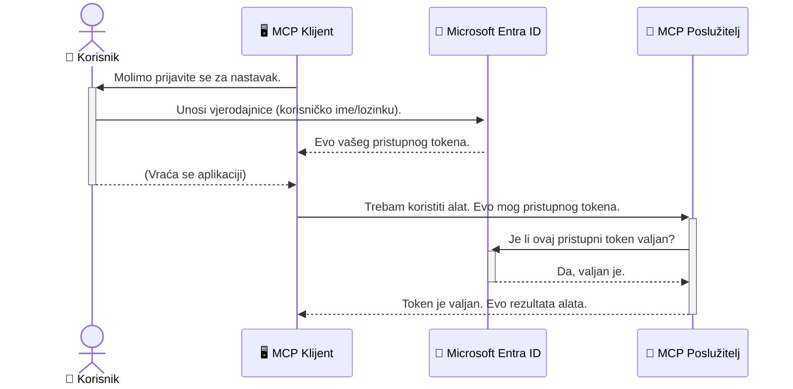

# Osiguravanje AI radnih tokova: Entra ID autentifikacija za MCP servere

## Uvod
Sigurnost vašeg Model Context Protocol (MCP) servera jednako je važna kao i zaključavanje ulaznih vrata vaše kuće. Ostaviti MCP server otvoren izlaže vaše alate i podatke neovlaštenom pristupu, što može dovesti do sigurnosnih propusta. Microsoft Entra ID pruža snažno rješenje za upravljanje identitetom i pristupom u oblaku, pomažući osigurati da samo ovlašteni korisnici i aplikacije mogu komunicirati s vašim MCP serverom. U ovom dijelu naučit ćete kako zaštititi svoje AI radne tokove korištenjem Entra ID autentifikacije.

## Ciljevi učenja
Na kraju ovog dijela moći ćete:

- Razumjeti važnost osiguranja MCP servera.
- Objasniti osnove Microsoft Entra ID i OAuth 2.0 autentifikacije.
- Prepoznati razliku između javnih i povjerljivih klijenata.
- Implementirati Entra ID autentifikaciju u lokalnim (javni klijent) i udaljenim (povjerljivi klijent) scenarijima MCP servera.
- Primijeniti najbolje sigurnosne prakse pri razvoju AI radnih tokova.

## Sigurnost i MCP

Baš kao što ne biste ostavili vrata svoje kuće otključana, ne biste trebali ostaviti MCP server otvoren za pristup bilo kome. Sigurnost vaših AI radnih tokova ključna je za izgradnju robusnih, pouzdanih i sigurnih aplikacija. Ova glava će vas upoznati s korištenjem Microsoft Entra ID za osiguranje vaših MCP servera, osiguravajući da samo ovlašteni korisnici i aplikacije mogu pristupiti vašim alatima i podacima.

## Zašto je sigurnost važna za MCP servere

Zamislite da vaš MCP server ima alat koji može slati e-poštu ili pristupiti bazi podataka korisnika. Nesiguran server značilo bi da bilo tko potencijalno može koristiti taj alat, što može dovesti do neovlaštenog pristupa podacima, neželjene pošte ili drugih zlonamjernih aktivnosti.

Implementacijom autentifikacije osiguravate da se svaki zahtjev prema vašem serveru provjerava, potvrđujući identitet korisnika ili aplikacije koja šalje zahtjev. Ovo je prvi i najvažniji korak u osiguranju vaših AI radnih tokova.

## Uvod u Microsoft Entra ID

[**Microsoft Entra ID**](https://adoption.microsoft.com/microsoft-security/entra/) je usluga za upravljanje identitetom i pristupom u oblaku. Zamislite ga kao univerzalnog sigurnosnog čuvara za vaše aplikacije. Rukuje složenim procesom provjere korisničkog identiteta (autentifikacija) i određivanja što smiju raditi (autorizacija).

Korištenjem Entra ID-a možete:

- Omogućiti siguran prijavu korisnika.
- Zaštititi API-je i usluge.
- Upravljati pravilima pristupa s jednog mjesta.

Za MCP servere, Entra ID pruža robusno i široko prihvaćeno rješenje za upravljanje tko može pristupiti funkcionalnostima vašeg servera.

---

## Razumijevanje Magije: Kako Entra ID autentifikacija funkcionira

Entra ID koristi otvorene standarde poput **OAuth 2.0** za upravljanje autentifikacijom. Iako detalji mogu biti složeni, osnovni koncept je jednostavan i može se razumjeti kroz analogiju.

### Blagi uvod u OAuth 2.0: Ključ službenika za parkiranje

Zamislite OAuth 2.0 kao uslugu parkiranja za vaš auto. Kada stignete u restoran, ne dajete službeniku glavni ključ od auta. Umjesto toga, dajete mu **ključ službenika za parkiranje** koji ima ograničene ovlasti — može upaliti auto i zaključati vrata, ali ne može otvoriti prtljažnik ili pretinac za rukavice.

U ovoj analogiji:

- **Vi** ste **Korisnik**.
- **Vaš auto** je **MCP Server** s vrijednim alatima i podacima.
- **Službenik za parkiranje** je **Microsoft Entra ID**.
- **Osoblje za parkiranje** je **MCP Klijent** (aplikacija koja pokušava pristupiti serveru).
- **Ključ službenika za parkiranje** je **Access Token** (pristupni token).

Pristupni token je siguran niz znakova koji MCP klijent prima od Entra ID-a nakon što se prijavite. Klijent zatim predaje taj token MCP serveru pri svakom zahtjevu. Server može provjeriti token kako bi potvrdio da je zahtjev legitiman i da klijent ima potrebne ovlasti, sve to bez da ikada mora rukovati vašim stvarnim vjerodajnicama (poput lozinke).

### Tijek autentifikacije

Evo kako proces funkcionira u praksi:



### Uvod u Microsoft Authentication Library (MSAL)

Prije nego što uđemo u kod, važno je upoznati ključni dio koji ćete vidjeti u primjerima: **Microsoft Authentication Library (MSAL)**.

MSAL je biblioteka koju je razvio Microsoft i koja znatno olakšava programerima rukovanje autentifikacijom. Umjesto da sami napišete sav složeni kod koji upravlja sigurnosnim tokenima, prijavama i osvježavanjem sesija, MSAL to preuzima na sebe.

Korištenje biblioteke poput MSAL se snažno preporučuje jer:

- **Sigurna je:** Implementira industrijske standarde i najbolje sigurnosne prakse, smanjujući rizik od ranjivosti u vašem kodu.
- **Pojednostavljuje razvoj:** Apstrahira složenost OAuth 2.0 i OpenID Connect protokola, omogućujući vam da dodate robusnu autentifikaciju u aplikaciju uz svega nekoliko linija koda.
- **Održava se:** Microsoft aktivno održava i ažurira MSAL kako bi se nosio s novim sigurnosnim prijetnjama i promjenama platformi.

MSAL podržava širok raspon programskih jezika i razvojnih okvira, uključujući .NET, JavaScript/TypeScript, Python, Java, Go, kao i mobilne platforme poput iOS-a i Androida. To znači da možete koristiti iste dosljedne obrasce autentifikacije kroz cijeli svoj tehnološki sloj.

Za više informacija o MSAL-u, možete pogledati službenu [MSAL opis dokumentacije](https://learn.microsoft.com/entra/identity-platform/msal-overview).

---

## Osiguravanje vašeg MCP servera s Entra ID: korak po korak vodič

Sada ćemo proći kroz kako osigurati lokalni MCP server (onaj koji komunicira preko `stdio`) koristeći Entra ID. Ovaj primjer koristi **javni klijent**, što je prikladno za aplikacije koje se izvode na korisničkom računalu, poput desktop aplikacije ili lokalnog razvojog servera.

### Scenarij 1: Osiguravanje lokalnog MCP servera (s javnim klijentom)

U ovom scenariju pogledat ćemo MCP server koji se izvodi lokalno, komunicira preko `stdio` i koristi Entra ID za autentifikaciju korisnika prije nego što dopusti pristup njegovim alatima. Server će imati jedan alat koji dohvaća korisničke informacije s Microsoft Graph API-ja.

#### 1. Postavljanje aplikacije u Entra ID

Prije nego što napišete bilo kakav kod, potrebno je registrirati vašu aplikaciju u Microsoft Entra ID. To obavještava Entra ID o vašoj aplikaciji i daje joj dozvolu za korištenje autentifikacijskog servisa.

1. Otvorite **[Microsoft Entra portal](https://entra.microsoft.com/)**.
2. Idite na **App registrations** i kliknite **New registration**.
3. Dajte aplikaciji ime (npr. "My Local MCP Server").
4. Za **Supported account types** odaberite **Accounts in this organizational directory only**.
5. Polje **Redirect URI** možete ostaviti praznim za ovaj primjer.
6. Kliknite **Register**.

Nakon registracije, zabilježite **Application (client) ID** i **Directory (tenant) ID**. Trebat će vam u kodu.

#### 2. Kod: analiza

Pogledajmo ključne dijelove koda koji upravljaju autentifikacijom. Cijeli kod ovog primjera dostupan je u [Entra ID - Local - WAM](https://github.com/Azure-Samples/mcp-auth-servers/tree/main/src/entra-id-local-wam) mapi na [mcp-auth-servers GitHub repozitoriju](https://github.com/Azure-Samples/mcp-auth-servers).

**`AuthenticationService.cs`**

Ova klasa upravlja interakcijom s Entra ID-om.

- **`CreateAsync`**: Ova metoda inicijalizira `PublicClientApplication` iz MSAL-a. Konfigurirana je s vašim `clientId` i `tenantId` aplikacije.
- **`WithBroker`**: Omogućava korištenje posrednika (kao Windows Web Account Manager), što pruža sigurnije i neprimjetnije iskustvo jedinstvene prijave.
- **`AcquireTokenAsync`**: Osnovna metoda. Prvo pokušava dobiti token tiho (bez ponovne prijave korisnika ako već postoji važeća sesija). Ako tiho preuzimanje tokena ne uspije, tražit će od korisnika interaktivnu prijavu.

```csharp
// Simplified for clarity
public static async Task<AuthenticationService> CreateAsync(ILogger<AuthenticationService> logger)
{
    var msalClient = PublicClientApplicationBuilder
        .Create(_clientId) // Your Application (client) ID
        .WithAuthority(AadAuthorityAudience.AzureAdMyOrg)
        .WithTenantId(_tenantId) // Your Directory (tenant) ID
        .WithBroker(new BrokerOptions(BrokerOptions.OperatingSystems.Windows))
        .Build();

    // ... cache registration ...

    return new AuthenticationService(logger, msalClient);
}

public async Task<string> AcquireTokenAsync()
{
    try
    {
        // Try silent authentication first
        var accounts = await _msalClient.GetAccountsAsync();
        var account = accounts.FirstOrDefault();

        AuthenticationResult? result = null;

        if (account != null)
        {
            result = await _msalClient.AcquireTokenSilent(_scopes, account).ExecuteAsync();
        }
        else
        {
            // If no account, or silent fails, go interactive
            result = await _msalClient.AcquireTokenInteractive(_scopes).ExecuteAsync();
        }

        return result.AccessToken;
    }
    catch (Exception ex)
    {
        _logger.LogError(ex, "An error occurred while acquiring the token.");
        throw; // Optionally rethrow the exception for higher-level handling
    }
}
```

**`Program.cs`**

Ovdje se postavlja MCP server i integrira servis za autentifikaciju.

- **`AddSingleton<AuthenticationService>`**: Registrira `AuthenticationService` u kontejner za injekciju ovisnosti, kako bi ga drugi dijelovi aplikacije (npr. naš alat) mogli koristiti.
- **`GetUserDetailsFromGraph` alat**: Ovaj alat traži instancu `AuthenticationService`. Prije bilo kakvog postupka, poziva `authService.AcquireTokenAsync()` da dobije važeći pristupni token. Ako je autentifikacija uspješna, koristi token za poziv Microsoft Graph API-ja radi dohvata korisničkih detalja.

```csharp
// Simplified for clarity
[McpServerTool(Name = "GetUserDetailsFromGraph")]
public static async Task<string> GetUserDetailsFromGraph(
    AuthenticationService authService)
{
    try
    {
        // This will trigger the authentication flow
        var accessToken = await authService.AcquireTokenAsync();

        // Use the token to create a GraphServiceClient
        var graphClient = new GraphServiceClient(
            new BaseBearerTokenAuthenticationProvider(new TokenProvider(authService)));

        var user = await graphClient.Me.GetAsync();

        return System.Text.Json.JsonSerializer.Serialize(user);
    }
    catch (Exception ex)
    {
        return $"Error: {ex.Message}";
    }
}
```

#### 3. Kako sve funkcionira zajedno

1. Kad MCP klijent pokušava koristiti alat `GetUserDetailsFromGraph`, alat prvo poziva `AcquireTokenAsync`.
2. `AcquireTokenAsync` aktivira MSAL biblioteku da provjeri postoji li važeći token.
3. Ako token nije pronađen, MSAL preko posrednika traži od korisnika da se prijavi sa svojim Entra ID računom.
4. Nakon prijave, Entra ID izdaje pristupni token.
5. Alat prima token i koristi ga za siguran poziv Microsoft Graph API-ja.
6. Korisnički detalji se vraćaju MCP klijentu.

Ovim se procesom osigurava da samo autentificirani korisnici mogu koristiti alat, učinkovito osiguravajući vaš lokalni MCP server.

### Scenarij 2: Osiguravanje udaljenog MCP servera (s povjerljivim klijentom)

Kada vaš MCP server radi na udaljenom stroju (npr. cloud serveru) i komunicira preko protokola poput HTTP streaminga, sigurnosni zahtjevi su drugačiji. U tom slučaju trebate koristiti **povjerljivog klijenta** i **Authorization Code Flow**. Ovo je sigurnija metoda jer se tajne aplikacije nikada ne izlažu pregledniku.

Ovaj primjer koristi MCP server baziran na TypeScript-u koji koristi Express.js za rukovanje HTTP zahtjevima.

#### 1. Postavljanje aplikacije u Entra ID

Postavljanje u Entra ID je slično kao kod javnog klijenta, ali s jednom ključnom razlikom: morate stvoriti **client secret** (tajnu klijenta).

1. Otvorite **[Microsoft Entra portal](https://entra.microsoft.com/)**.
2. U registraciji vaše aplikacije idite na karticu **Certificates & secrets**.
3. Kliknite **New client secret**, dajte joj opis i kliknite **Add**.
4. **Važno:** Odmah kopirajte vrijednost tajne. Nećete je moći ponovo vidjeti.
5. Također trebate konfigurirati **Redirect URI**. Idite na karticu **Authentication**, kliknite **Add a platform**, odaberite **Web** i unesite redirect URI za vašu aplikaciju (npr. `http://localhost:3001/auth/callback`).

> **⚠️ Važna sigurnosna napomena:** Za produkcijske aplikacije Microsoft snažno preporučuje korištenje metoda autentifikacije bez tajni (secretless), poput **Managed Identity** ili **Workload Identity Federation** umjesto klijentskih tajni. Klijentske tajne predstavljaju sigurnosni rizik jer se mogu otkriti ili kompromitirati. Managed identity pristupi nude sigurniji način uklanjanjem potrebe za pohranom vjerodajnica u vašem kodu ili konfiguraciji.
>
> Za više informacija o managed identitetima i njihovoj implementaciji pogledajte [Pregled managed identities for Azure resources](https://learn.microsoft.com/entra/identity/managed-identities-azure-resources/overview).

#### 2. Kod: analiza

Ovaj primjer koristi pristup temeljen na sesiji. Kada se korisnik autentificira, server pohranjuje pristupni token i osvježavajući token u sesiju i daje korisniku sesijski token. Taj sesijski token se onda koristi za daljnje zahtjeve. Cijeli kod ovog primjera dostupan je u [Entra ID - Confidential client](https://github.com/Azure-Samples/mcp-auth-servers/tree/main/src/entra-id-cca-session) mapi na [mcp-auth-servers GitHub repozitoriju](https://github.com/Azure-Samples/mcp-auth-servers).

**`Server.ts`**

Ova datoteka postavlja Express server i MCP transportni sloj.

- **`requireBearerAuth`**: Middleware koji štiti `/sse` i `/message` endpointove. Provjerava postoji li valjani bearer token u zaglavlju `Authorization`.
- **`EntraIdServerAuthProvider`**: Prilagođena klasa koja implementira sučelje `McpServerAuthorizationProvider`. Odgovorna je za upravljanje OAuth 2.0 tijekovima.
- **`/auth/callback`**: Endpoint koji rukuje preusmjeravanjem s Entra ID-a nakon korisnikove autentifikacije. Razmjenjuje authorization code za pristupni i osvježavajući token.

```typescript
// Pojednostavljeno radi jasnoće
const app = express();
const { server } = createServer();
const provider = new EntraIdServerAuthProvider();

// Zaštitite SSE krajnju točku
app.get("/sse", requireBearerAuth({
  provider,
  requiredScopes: ["User.Read"]
}), async (req, res) => {
  // ... povežite se s transportom ...
});

// Zaštitite krajnju točku poruke
app.post("/message", requireBearerAuth({
  provider,
  requiredScopes: ["User.Read"]
}), async (req, res) => {
  // ... obradite poruku ...
});

// Obradite OAuth 2.0 povratni poziv
app.get("/auth/callback", (req, res) => {
  provider.handleCallback(req.query.code, req.query.state)
    .then(result => {
      // ... obradite uspjeh ili neuspjeh ...
    });
});
```

**`Tools.ts`**

Ovdje su definirani alati koje MCP server pruža. Alat `getUserDetails` je sličan onom iz prethodnog primjera, ali pristupni token dohvaća iz sesije.

```typescript
// Pojednostavljeno radi jasnoće
server.setRequestHandler(CallToolRequestSchema, async (request) => {
  const { name } = request.params;
  const context = request.params?.context as { token?: string } | undefined;
  const sessionToken = context?.token;

  if (name === ToolName.GET_USER_DETAILS) {
    if (!sessionToken) {
      throw new AuthenticationError("Authentication token is missing or invalid. Ensure the token is provided in the request context.");
    }

    // Dohvati Entra ID token iz spremišta sesije
    const tokenData = tokenStore.getToken(sessionToken);
    const entraIdToken = tokenData.accessToken;

    const graphClient = Client.init({
      authProvider: (done) => {
        done(null, entraIdToken);
      }
    });

    const user = await graphClient.api('/me').get();

    // ... vrati detalje korisnika ...
  }
});
```

**`auth/EntraIdServerAuthProvider.ts`**

Ova klasa upravlja logikom:

- Preusmjeravanja korisnika na Entra ID stranicu za prijavu.
- Razmjene authorization code za pristupni token.
- Pohrane tokena u `tokenStore`.
- Osvježavanja pristupnog tokena kad istekne.

#### 3. Kako to sve funkcionira zajedno

1. Kada korisnik prvi put pokuša povezati se s MCP serverom, `requireBearerAuth` middleware uoči da nema važeću sesiju i preusmjeri ga na Entra ID stranicu za prijavu.
2. Korisnik se prijavljuje sa svojim Entra ID računom.
3. Entra ID preusmjerava korisnika natrag na `/auth/callback` endpoint s autorizacijskim kodom.  
4. Poslužitelj zamjenjuje kod za pristupni token i refresh token, pohranjuje ih i stvara sesijski token koji se šalje klijentu.  
5. Klijent sada može koristiti ovaj sesijski token u zaglavlju `Authorization` za sve buduće zahtjeve prema MCP poslužitelju.  
6. Kad se pozove alat `getUserDetails`, koristi sesijski token za dohvat Entra ID pristupnog tokena, a zatim koristi taj token za poziv Microsoft Graph API-ja.

Ovaj tijek je složeniji od toka javnog klijenta, ali je potreban za internetom dostupne endpointove. Budući da su udaljeni MCP poslužitelji dostupni preko javnog interneta, trebaju jače sigurnosne mjere kako bi se zaštitili od neovlaštenog pristupa i potencijalnih napada.


## Najbolje sigurnosne prakse

- **Uvijek koristite HTTPS**: Šifrirajte komunikaciju između klijenta i poslužitelja kako biste zaštitili tokene od presretanja.  
- **Implementirajte kontrolu pristupa temeljenu na ulogama (RBAC)**: Ne provjeravajte samo *je li* korisnik autentificiran; provjerite *što* smije raditi. Možete definirati uloge u Entra ID-u i provjeravati ih u vašem MCP poslužitelju.  
- **Pratite i nadgledajte**: Zabilježite sve događaje autentifikacije kako biste mogli otkriti i reagirati na sumnjive aktivnosti.  
- **Rukovanje ograničenjem i usporavanjem zahtjeva**: Microsoft Graph i drugi API-ji provode ograničenja broja zahtjeva kako bi spriječili zlouporabu. Implementirajte eksponencijalni backoff i logiku ponovnog pokušaja u vašem MCP poslužitelju kako biste na primjeren način obradili HTTP 429 (Previše zahtjeva) odgovore. Razmotrite keširanje često pristupanih podataka kako biste smanjili pozive API-u.  
- **Sigurna pohrana tokena**: Pohranite pristupne i osvježavajuće tokene sigurno. Za lokalne aplikacije koristite sigurnosne mehanizme sustava. Za poslužiteljske aplikacije razmotrite korištenje enkriptirane pohrane ili sigurnih usluga upravljanja ključevima poput Azure Key Vault-a.  
- **Rukovanje istekom tokena**: Pristupni tokeni imaju ograničen životni vijek. Implementirajte automatsko osvježavanje tokena pomoću refresh tokena kako bi korisničko iskustvo bilo neometano bez potrebe za ponovnim prijavljivanjem.  
- **Razmotrite korištenje Azure API Managementa**: Dok implementacija sigurnosti direktno u vašem MCP poslužitelju pruža finu kontrolu, API Gateway-jevi poput Azure API Managementa mogu automatski rukovati mnogim sigurnosnim pitanjima, uključujući autentifikaciju, autorizaciju, ograničenje broja zahtjeva i nadzor. Oni pružaju centralizirani sloj sigurnosti koji stoji između vaših klijenata i MCP poslužitelja. Za više detalja o korištenju API Gateway-ja s MCP, pogledajte naš [Azure API Management Your Auth Gateway For MCP Servers](https://techcommunity.microsoft.com/blog/integrationsonazureblog/azure-api-management-your-auth-gateway-for-mcp-servers/4402690).


## Ključne točke

- Zaštita vašeg MCP poslužitelja ključna je za sigurnost vaših podataka i alata.  
- Microsoft Entra ID pruža robusno i skalabilno rješenje za autentifikaciju i autorizaciju.  
- Koristite **javnog klijenta** za lokalne aplikacije i **povjerljivog klijenta** za udaljene poslužitelje.  
- **Authorization Code Flow** je najsigurnija opcija za web aplikacije.  


## Vježba

1. Razmislite o MCP poslužitelju koji biste mogli izgraditi. Bi li to bio lokalni ili udaljeni poslužitelj?  
2. Na temelju vašeg odgovora, biste li koristili javnog ili povjerljivog klijenta?  
3. Koju bi dozvolu vaš MCP poslužitelj tražio za izvođenje radnji prema Microsoft Graphu?  


## Praktične vježbe

### Vježba 1: Registracija aplikacije u Entra ID-u  
Navigirajte do Microsoft Entra portala.  
Registrirajte novu aplikaciju za vaš MCP poslužitelj.  
Zabilježite Application (client) ID i Directory (tenant) ID.

### Vježba 2: Osiguranje lokalnog MCP poslužitelja (javnog klijenta)  
- Slijedite primjer koda za integraciju MSAL-a (Microsoft Authentication Library) za autentifikaciju korisnika.  
- Testirajte autentifikacijski tijek pozivom MCP alata koji dohvaća detalje korisnika iz Microsoft Grapha.

### Vježba 3: Osiguranje udaljenog MCP poslužitelja (povjerljivog klijenta)  
- Registrirajte povjerljivog klijenta u Entra ID-u i kreirajte klijentsku tajnu.  
- Konfigurirajte svoj Express.js MCP poslužitelj za korištenje Authorization Code Flow-a.  
- Testirajte zaštićene endpointove i potvrdite pristup temeljen na tokenu.

### Vježba 4: Primjena najboljih sigurnosnih praksi  
- Omogućite HTTPS za lokalni ili udaljeni poslužitelj.  
- Implementirajte kontrolu pristupa temeljenu na ulogama (RBAC) u logici poslužitelja.  
- Dodajte rukovanje istekom tokena i sigurnu pohranu tokena.

## Resursi

1. **MSAL Pregledna dokumentacija**  
   Naučite kako Microsoft Authentication Library (MSAL) omogućuje sigurnu akviziciju tokena na više platformi:  
   [MSAL Overview on Microsoft Learn](https://learn.microsoft.com/en-gb/entra/msal/overview)

2. **Azure-Samples/mcp-auth-servers GitHub repozitorij**  
   Referentne implementacije MCP poslužitelja koje prikazuju tokove autentifikacije:  
   [Azure-Samples/mcp-auth-servers on GitHub](https://github.com/Azure-Samples/mcp-auth-servers)

3. **Pregled Managed Identities for Azure Resources**  
   Razumijte kako ukloniti tajne korištenjem sustavom ili korisnikom dodijeljenih upravljanih identiteta:  
   [Managed Identities Overview on Microsoft Learn](https://learn.microsoft.com/en-us/entra/identity/managed-identities-azure-resources/)

4. **Azure API Management: Vaš Auth Gateway za MCP poslužitelje**  
   Detaljan pregled korištenja APIM-a kao sigurnosnog OAuth2 gateway-ja za MCP poslužitelje:  
   [Azure API Management Your Auth Gateway For MCP Servers](https://techcommunity.microsoft.com/blog/integrationsonazureblog/azure-api-management-your-auth-gateway-for-mcp-servers/4402690)

5. **Microsoft Graph Popis dozvola**  
   Sveobuhvatan popis delegiranih i aplikacijskih dozvola za Microsoft Graph:  
   [Microsoft Graph Permissions Reference](https://learn.microsoft.com/zh-tw/graph/permissions-reference)


## Ishodi učenja
Nakon završetka ovog dijela moći ćete:

- Objasniti zašto je autentifikacija ključna za MCP poslužitelje i AI tijekove rada.  
- Postaviti i konfigurirati Entra ID autentifikaciju za lokalne i udaljene MCP poslužitelje.  
- Izabrati odgovarajući tip klijenta (javnog ili povjerljivog) ovisno o implementaciji poslužitelja.  
- Implementirati sigurne prakse kodiranja, uključujući pohranu tokena i autorizaciju temeljenu na ulogama.  
- S pouzdanjem zaštititi vaš MCP poslužitelj i njegove alate od neovlaštenog pristupa.

## Što slijedi

- [5.13 Model Context Protocol (MCP) Integracija s Microsoft Foundry](../mcp-foundry-agent-integration/README.md)

---

<!-- CO-OP TRANSLATOR DISCLAIMER START -->
**Napomena**:
Ovaj dokument je preveden korištenjem AI prevoditeljskog servisa [Co-op Translator](https://github.com/Azure/co-op-translator). Iako težimo točnosti, imajte na umu da automatski prijevodi mogu sadržavati greške ili netočnosti. Izvorni dokument na izvornom jeziku treba smatrati autoritativnim izvorom. Za važne informacije preporuča se profesionalni ljudski prijevod. Nismo odgovorni za bilo kakva nesporazumevanja ili pogrešne interpretacije koje proizlaze iz korištenja ovog prijevoda.
<!-- CO-OP TRANSLATOR DISCLAIMER END -->