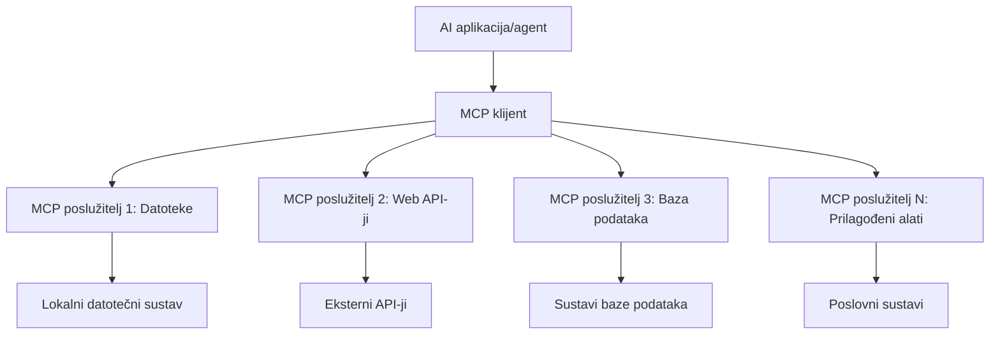

# 🌐 Modul 2: MCP s osnovama Microsoft Foundry Toolkit-a

[]()
[]()
[]()

## 📋 Ciljevi učenja

Do kraja ovog modula moći ćete:
- ✅ Razumjeti arhitekturu i prednosti Model Context Protocola (MCP)
- ✅ Istražiti Microsoftov MCP ekosustav poslužitelja
- ✅ Integrirati MCP poslužitelje s Microsoft Foundry Toolkit Agent Builder-om
- ✅ Izgraditi funkcionalnog agenta za automatizaciju preglednika koristeći Playwright MCP
- ✅ Konfigurirati i testirati MCP alate unutar vaših agenata
- ✅ Izvesti i implementirati agente pokretane MCP-om za upotrebu u produkciji

## 🎯 Nadogradnja na Modul 1

U Modulu 1 savladali smo osnove Microsoft Foundry Toolkit-a i kreirali našeg prvog Python agenta. Sada ćemo vaše agente **supernapuniti** povezivanjem s vanjskim alatima i uslugama putem revolucionarnog **Model Context Protocola (MCP)**.

Razmislite o tome kao nadogradnji sa osnovnog kalkulatora na punokrvno računalo – vaši AI agenti će steći sposobnost da:
- 🌐 Pregledavaju i komuniciraju s web-stranicama
- 📁 Pristupaju i manipuliraju datotekama
- 🔧 Integriraju se s poslovnim sustavima
- 📊 Obradjuju podatke u stvarnom vremenu iz API-ja

## 🧠 Razumijevanje Model Context Protocola (MCP)

### 🔍 Što je MCP?

Model Context Protocol (MCP) je **"USB-C za AI aplikacije"** – revolucionarni otvoreni standard koji povezuje velike jezične modele (LLM) s vanjskim alatima, izvorima podataka i uslugama. Baš kao što je USB-C eliminirao kaos kabela nudeći jedan univerzalni konektor, MCP uklanja složenost AI integracije jedinstvenim standardiziranim protokolom.

### 🎯 Problem koji MCP rješava

**Prije MCP-a:**
- 🔧 Prilagođene integracije za svaki alat
- 🔄 Zaključavanje kod dobavljača s vlasničkim rješenjima  
- 🔒 Sigurnosni propusti zbog ad-hoc veza
- ⏱️ Mjeseci razvoja za osnovne integracije

**Sa MCP-om:**
- ⚡ Plug-and-play integracija alata
- 🔄 Neovisan odnos prema dobavljačima
- 🛡️ Ugrađene sigurnosne najbolje prakse
- 🚀 Dodavanje novih funkcionalnosti u nekoliko minuta

### 🏗️ Detaljna arhitektura MCP-a

MCP slijedi **klijent-poslužitelj arhitekturu** koja stvara siguran i skalabilan ekosustav:



**🔧 Osnovne komponente:**

| Komponenta | Uloga | Primjeri |
|-----------|------|----------|
| **MCP Hostovi** | Aplikacije koje koriste MCP usluge | Claude Desktop, VS Code, Microsoft Foundry Toolkit |
| **MCP Klijenti** | Rukovatelji protokolom (1:1 s poslužiteljima) | Ugrađeni u host aplikacije |
| **MCP Poslužitelji** | Izlažu mogućnosti putem standardnog protokola | Playwright, Files, Azure, GitHub |
| **Transportni sloj** | Metode komunikacije | stdio, HTTP, WebSockets |


## 🏢 Microsoftov MCP ekosustav poslužitelja

Microsoft predvodi MCP ekosustav s opsežnim skupom enterprise razine poslužitelja koji zadovoljavaju stvarne poslovne potrebe.

### 🌟 Istaknuti Microsoft MCP poslužitelji

#### 1. ☁️ Azure MCP Server
**🔗 Repo**: [azure/azure-mcp](https://github.com/azure/azure-mcp)
**🎯 Svrha**: Sveobuhvatno upravljanje Azure resursima s AI integracijom

**✨ Ključne značajke:**
- Deklarativno osiguravanje infrastrukture
- Praćenje resursa u stvarnom vremenu
- Preporuke za optimizaciju troškova
- Provjera usklađenosti sa sigurnosnim politikama

**🚀 Primjene:**
- Infrastruktura kao kod s AI asistencijom
- Automatizirano skaliranje resursa
- Optimizacija troškova u oblaku
- Automatizacija DevOps tijekova rada

#### 2. 📊 Microsoft Dataverse MCP
**📚 Dokumentacija**: [Microsoft Dataverse Integration](https://go.microsoft.com/fwlink/?linkid=2320176)
**🎯 Svrha**: Sučelje prirodnog jezika za poslovne podatke

**✨ Ključne značajke:**
- Upiti baze podataka na prirodnom jeziku
- Razumijevanje poslovnog konteksta
- Prilagođene predloške upita
- Upravljanje podacima na razini poduzeća

**🚀 Primjene:**
- Izvještavanje poslovne inteligencije
- Analiza podataka o kupcima
- Uvidi u prodajni tok
- Upiti usklađenosti podataka

#### 3. 🌐 Playwright MCP Server
**🔗 Repo**: [microsoft/playwright-mcp](https://github.com/microsoft/playwright-mcp)
**🎯 Svrha**: Automatizacija preglednika i web interakcije

**✨ Ključne značajke:**
- Automatizacija preko više preglednika (Chrome, Firefox, Safari)
- Inteligentno prepoznavanje elemenata
- Snimanje slika i generiranje PDF-a
- Praćenje mrežnog prometa

**🚀 Primjene:**
- Automatizirani testni tijekovi rada
- Web scraping i ekstrakcija podataka
- Praćenje korisničkog sučelja i iskustva
- Automatizacija analize konkurencije

#### 4. 📁 Files MCP Server
**🔗 Repo**: [microsoft/files-mcp-server](https://github.com/microsoft/files-mcp-server)
**🎯 Svrha**: Inteligentno upravljanje datotečnim sustavima

**✨ Ključne značajke:**
- Deklarativno upravljanje datotekama
- Sinkronizacija sadržaja
- Integracija s kontrolom verzija
- Ekstrakcija metapodataka

**🚀 Primjene:**
- Upravljanje dokumentacijom
- Organizacija repozitorija koda
- Tijekovi rada u objavljivanju sadržaja
- Obrada datoteka u podatkovnim tokovima

#### 5. 📝 MarkItDown MCP Server
**🔗 Repo**: [microsoft/markitdown](https://github.com/microsoft/markitdown)
**🎯 Svrha**: Napredna obrada i manipulacija Markdown sadržajem

**✨ Ključne značajke:**
- Detaljno parsiranje Markdowna
- Konverzija formata (MD ↔ HTML ↔ PDF)
- Analiza strukture sadržaja
- Obrada predložaka

**🚀 Primjene:**
- Tijekovi rada tehničke dokumentacije
- Sustavi za upravljanje sadržajem
- Generiranje izvještaja
- Automatizacija baza znanja

#### 6. 📈 Clarity MCP Server
**📦 Paket**: [@microsoft/clarity-mcp-server](https://www.npmjs.com/package/@microsoft/clarity-mcp-server)
**🎯 Svrha**: Web analitika i uvidi u ponašanje korisnika

**✨ Ključne značajke:**
- Analiza podataka toplinskih karata
- Snimke korisničkih sesija
- Metrike performansi
- Analiza konverzijskih tokova

**🚀 Primjene:**
- Optimizacija web stranica
- Istraživanje korisničkog iskustva
- Analiza A/B testiranja
- Poslovne inteligentne nadzorne ploče

### 🌍 Zajednički ekosustav

Osim Microsoftovih poslužitelja, MCP ekosustav uključuje:
- **🐙 GitHub MCP**: Upravljanje repozitorijima i analiza koda
- **🗄️ MCP-ove za baze podataka**: Integracije PostgreSQL, MySQL, MongoDB
- **☁️ MCP-ove pružatelja oblaka**: AWS, GCP, Digital Ocean alati
- **📧 MCP-ove za komunikaciju**: Slack, Teams, Email integracije

## 🛠️ Praktična radionica: Izgradnja agenta za automatizaciju preglednika

**🎯 Cilj projekta**: Kreirati inteligentnog agenta za automatizaciju preglednika koristeći Playwright MCP poslužitelj koji može navigirati web-stranicama, izvoditi ekstrakciju informacija i obavljati složene web interakcije.

### 🚀 Faza 1: Postavljanje temelja agenta

#### Korak 1: Inicijalizirajte svog agenta
1. **Otvorite Microsoft Foundry Toolkit Agent Builder**
2. **Kreirajte novog agenta** s konfiguracijom:
   - **Ime**: `BrowserAgent`
   - **Model**: Odaberite GPT-4o


### 🔧 Faza 2: MCP integracijski tijek rada

#### Korak 3: Dodajte MCP integraciju poslužitelja
1. **Idite na odjeljak Alati** u Agent Builder-u
2. **Kliknite "Add Tool"** da otvorite izbornik integracije
3. **Odaberite "MCP Server"** iz dostupnih opcija


**🔍 Razumijevanje vrsta alata:**
- **Ugrađeni alati**: Unaprijed konfigurirane funkcije Microsoft Foundry Toolkit-a
- **MCP poslužitelji**: Integracije vanjskih usluga
- **Prilagođeni API-ji**: Vaše vlastite usluge
- **Funkcijsko pozivanje**: Izravan pristup funkcijama modela

#### Korak 4: Odabir MCP poslužitelja
1. **Odaberite opciju "MCP Server"** za nastavak


2. **Pregledajte MCP katalog** za istraživanje dostupnih integracija


### 🎮 Faza 3: Konfiguracija Playwright MCP-a

#### Korak 5: Odaberite i konfigurirajte Playwright
1. **Kliknite "Use Featured MCP Servers"** za pristup Microsoftovim verificiranim poslužiteljima
2. **Odaberite "Playwright"** s liste istaknutih
3. **Prihvatite zadani MCP ID** ili prilagodite za vaše okruženje


#### Korak 6: Omogućite Playwright mogućnosti
**🔑 Kritični korak**: Odaberite **SVE** dostupne Playwright metode za maksimalnu funkcionalnost


**🛠️ Neophodni Playwright alati:**
- **Navigacija**: `goto`, `goBack`, `goForward`, `reload`
- **Interakcija**: `click`, `fill`, `press`, `hover`, `drag`
- **Ekstrakcija**: `textContent`, `innerHTML`, `getAttribute`
- **Validacija**: `isVisible`, `isEnabled`, `waitForSelector`
- **Snimanje**: `screenshot`, `pdf`, `video`
- **Mreža**: `setExtraHTTPHeaders`, `route`, `waitForResponse`

#### Korak 7: Provjerite uspjeh integracije
**✅ Indikatori uspjeha:**
- Svi alati su vidljivi u sučelju Agent Builder-a
- Nema poruka o greškama u integracijskom panelu
- Status Playwright poslužitelja prikazuje "Connected"


**🔧 Uobičajene poteškoće i rješenja:**
- **Veza nije uspjela**: Provjerite internetsku vezu i postavke vatrozida
- **Nedostaju alati**: Provjerite jesu li sve mogućnosti odabrane tijekom postavljanja
- **Greške u dopuštenjima**: Potvrdite da VS Code ima potrebne sistemske dozvole

### 🎯 Faza 4: Napredno kreiranje promptova

#### Korak 8: Dizajnirajte inteligentne sistemske promptove
Kreirajte sofisticirane promte koji iskorištavaju pun potencijal Playwright-a:

```markdown
# Web Automation Expert System Prompt

## Core Identity
You are an advanced web automation specialist with deep expertise in browser automation, web scraping, and user experience analysis. You have access to Playwright tools for comprehensive browser control.

## Capabilities & Approach
### Navigation Strategy
- Always start with screenshots to understand page layout
- Use semantic selectors (text content, labels) when possible
- Implement wait strategies for dynamic content
- Handle single-page applications (SPAs) effectively

### Error Handling
- Retry failed operations with exponential backoff
- Provide clear error descriptions and solutions
- Suggest alternative approaches when primary methods fail
- Always capture diagnostic screenshots on errors

### Data Extraction
- Extract structured data in JSON format when possible
- Provide confidence scores for extracted information
- Validate data completeness and accuracy
- Handle pagination and infinite scroll scenarios

### Reporting
- Include step-by-step execution logs
- Provide before/after screenshots for verification
- Suggest optimizations and alternative approaches
- Document any limitations or edge cases encountered

## Ethical Guidelines
- Respect robots.txt and rate limiting
- Avoid overloading target servers
- Only extract publicly available information
- Follow website terms of service
```

#### Korak 9: Izradite dinamične korisničke promptove
Dizajnirajte promte koji demonstriraju razne mogućnosti:

**🌐 Primjer web analize:**
```markdown
Navigate to github.com/kinfey and provide a comprehensive analysis including:
1. Repository structure and organization
2. Recent activity and contribution patterns  
3. Documentation quality assessment
4. Technology stack identification
5. Community engagement metrics
6. Notable projects and their purposes

Include screenshots at key steps and provide actionable insights.
```


### 🚀 Faza 5: Izvršenje i testiranje

#### Korak 10: Pokrenite svoju prvu automatizaciju
1. **Kliknite "Run"** za pokretanje sekvence automatizacije
2. **Pratite izvršenje u stvarnom vremenu**:
   - Chrome preglednik se automatski pokreće
   - Agent navigira na ciljanu web-stranicu
   - Snimke ekrana bilježe svaki glavni korak
   - Rezultati analize se prikazuju u stvarnom vremenu


#### Korak 11: Analizirajte rezultate i uvide
Pregledajte sveobuhvatnu analizu u sučelju Agent Builder-a:


### 🌟 Faza 6: Napredne funkcionalnosti i implementacija

#### Korak 12: Izvoz i produkcijska implementacija
Agent Builder podržava više opcija za implementaciju:


## 🎓 Sažetak Modula 2 i sljedeći koraci

### 🏆 Postignuće otključano: Majstor integracije MCP-a

**✅ Savladane vještine:**
- [ ] Razumijevanje arhitekture i prednosti MCP-a
- [ ] Snalaženje u Microsoftovom MCP ekosustavu poslužitelja
- [ ] Integracija Playwright MCP-a s Microsoft Foundry Toolkit-om
- [ ] Izgradnja sofisticiranih agenata za automatizaciju preglednika
- [ ] Napredno kreiranje promptova za web automatizaciju

### 📚 Dodatni resursi

- **🔗 MCP specifikacija**: [Službena dokumentacija protokola](https://modelcontextprotocol.io/)
- **🛠️ Playwright API**: [Potpuni pregled metoda](https://playwright.dev/docs/api/class-playwright)
- **🏢 Microsoft MCP poslužitelji**: [Vodič za enterprise integracije](https://github.com/microsoft/mcp-servers)
- **🌍 Primjeri zajednice**: [Galerija MCP poslužitelja](https://github.com/modelcontextprotocol/servers)

**🎉 Čestitamo!** Uspješno ste svladali integraciju MCP-a i sada možete graditi AI agente spremne za produkciju s mogućnostima vanjskih alata!


### 🔜 Nastavite na sljedeći modul

Spremni za podizanje MCP vještina? Nastavite na **[Modul 3: Napredni razvoj MCP-a s Microsoft Foundry Toolkit-om](../lab3/README.md)** gdje ćete naučiti:
- Kreirati vlastite prilagođene MCP poslužitelje
- Konfigurirati i koristiti najnoviji MCP Python SDK
- Postaviti MCP Inspector za otklanjanje pogrešaka
- Ovladati naprednim tijekovima razvoja MCP poslužitelja
- Izgraditi vremenski MCP poslužitelj od nule

---

<!-- CO-OP TRANSLATOR DISCLAIMER START -->
**Napomena**:
Ovaj dokument je preveden korištenjem AI prevoditeljskog servisa [Co-op Translator](https://github.com/Azure/co-op-translator). Iako težimo točnosti, imajte na umu da automatski prijevodi mogu sadržavati greške ili netočnosti. Izvorni dokument na izvornom jeziku treba smatrati autoritativnim izvorom. Za važne informacije preporuča se profesionalni ljudski prijevod. Nismo odgovorni za bilo kakva nesporazumevanja ili pogrešne interpretacije koje proizlaze iz korištenja ovog prijevoda.
<!-- CO-OP TRANSLATOR DISCLAIMER END -->