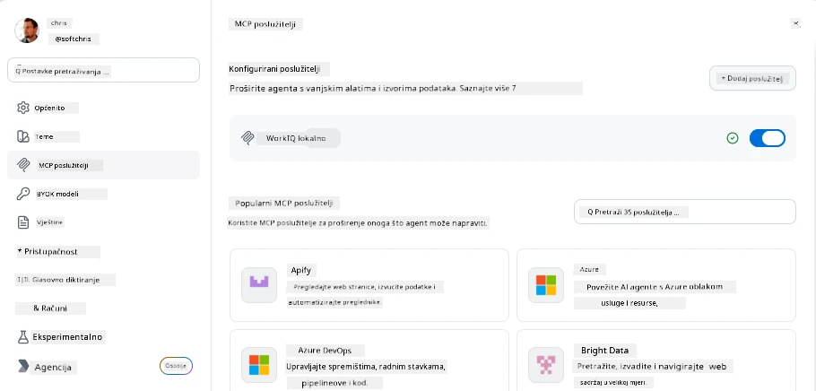
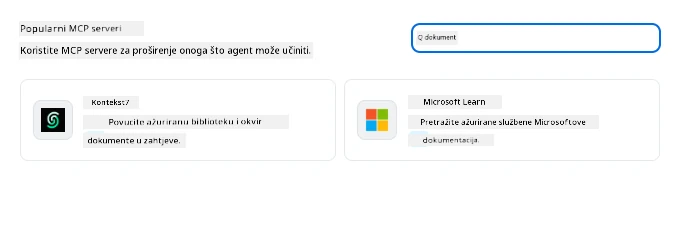
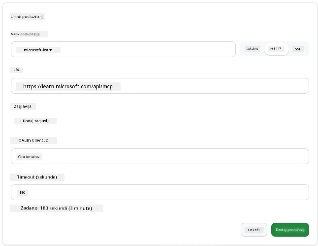
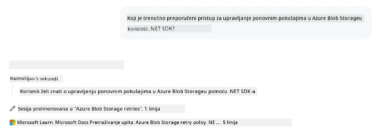
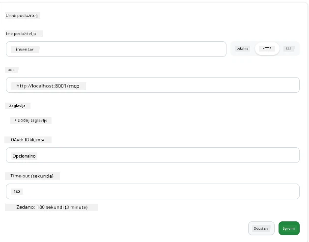
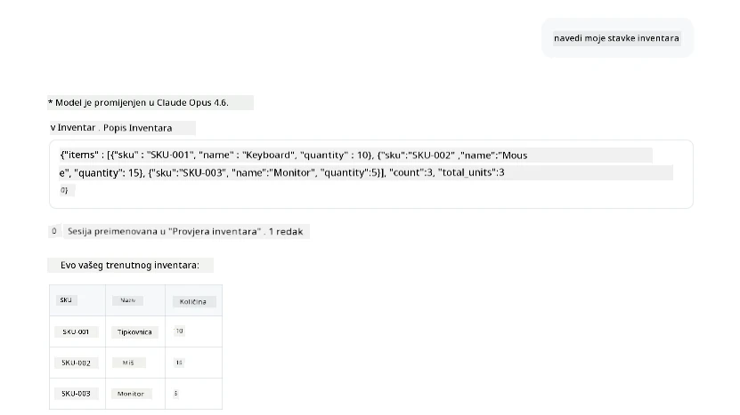
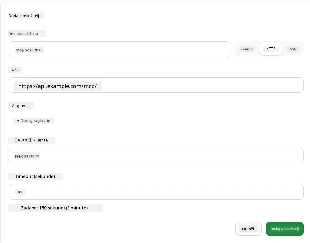
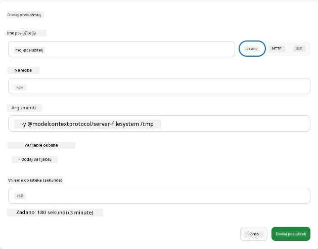

# Korištenje MCP servera u GitHub Copilot aplikaciji

Do sada znate kako MCP funkcionira. Izgradili ste servere, definirali alate i resurse te povezali klijente. Ono što još nismo napravili jest promijeniti perspektivu: umjesto da ste vi taj koji gradi server, kako izgleda biti na *potrošačkoj* strani—kao korisnik AI-pokretane aplikacije koja podržava MCP?

[GitHub Copilot App](https://github.com/github/app) je desktop aplikacija koja može koristiti MCP servere. Povezujući MCP servere s njom, otključavate novu razinu: Copilot sada može pristupati vašoj dokumentaciji, pozivati vaše interne API-je, ispitivati vašu bazu podataka ili razgovarati s bilo kojom uslugom koju ste umotali u server. Aplikacija postaje domaćin; vaši MCP serveri postaju njezini alati.

Ova lekcija vodi vas kroz to iskustvo od početka do kraja—od pronalaska MCP postavki do povezivanja stvarnog dokumentacijskog servera pa zatim spajanja vlastitog prilagođenog servera.

## Ciljevi učenja

Do kraja ove lekcije moći ćete:

- Pronaći i navigirati MCP Servers ploču u postavkama Copilot aplikacije.
- Povezati hostani dokumentacijski server i koristiti ga u sesiji.
- Registrirati prilagođeni server i potvrditi da Copilot može pozivati njegove alate.
- Konfigurirati način pozivanja servera pružajući varijable okoline ili prilagođene zaglavlja (ako je HTTP)

## Copilot aplikacija kao MCP domaćin

Evo osnovne ideje: **Copilotovi agenti su pametni, ali znaju samo ono što im kažete.** Po defaultu agent može čitati datoteke u vašem radnom prostoru i izvršavati naredbe u terminalu, no ne može ispitivati vašu bazu podataka, zavirivati u vaš kalendar ili pozivati prilagođeni API bez pomoći. Tu dolaze MCP serveri. Oni služe kao mostovi između Copilota i vaših sustava—baza podataka, verzioniranja, API-ja, alata za dizajn—dajući agentima pristup informacijama i radnjama koje trebaju za dovršavanje zadataka.

Počnimo pronalaskom tih postavki za upravljanje MCP serverima vaše aplikacije.

## Korak 1: Pronalazak MCP postavki

Otvorite Copilot aplikaciju i pronađite ikonu zupčanika na donjem lijevom kutu i kliknite ju.


Provjerite je li odabrano "MCP Servers" i sada biste trebali vidjeti već konfigurirane servere pri vrhu, tržište popularnih servera na dnu, i gumb "Add Server" na vrhu ovako:



Ovo je vaš kontrolni centar. Ovdje dodajete, uklanjate, omogućujete i onemogućujete servere. Promjene se odnose na nove sesije; ako imate otvorenu sesiju, trebate započeti novu nakon što promijenite ovu listu.

## Korak 2: Povezivanje dokumentacijskog servera

Učinićemo nešto odmah korisno. Microsoft Docs MCP server daje Copilotu pristup službenoj Microsoft dokumentaciji. To uključuje Azure, .NET, TypeScript i još više. Umjesto da se agent oslanja na svoje trenirane podatke (koji imaju datum prekida), sada može dohvatiti aktualnu dokumentaciju u vrijeme upita.

Kako ga dodati:

1. U mreži popularnih servera napišite **learn** i odaberite server pod nazivom "Microsoft Learn".

   

   Nakon klika, pojavit će se obrazac gdje su ime, tip transporta i URL unaprijed popunjeni, a vi samo kliknite "Add Server".

2. Kliknite "Add Server", povezivanje sa serverom bi trebalo potrajati nekoliko sekundi.

   

   Nakon dodavanja, server bi se trebao prikazati gore kao konfigurirani server. Pokušajmo ga sljedeće koristiti.

3. Zatvorite dijalog i odaberite Quick chat.

4. Unesite dolje navedeni upit da pokrenete alat na Microsoft Learn serveru.

   ```text
   What's the current recommended approach for handling Azure Blob Storage 
   retries using the .NET SDK?
   ```

   

Trebali biste vidjeti kako se poziva MCP Server koji smo upravo dodali.

## Korak 3: Povezivanje prilagođenog stdio servera

Predlošci su praktični, ali prava snaga je u povezivanju vlastitih servera. Recimo da ste izgradili server (ili vam je dan) koji otkriva vaš interni API ili bazu znanja tvrtke. U ovom primjeru koristit ćemo MCP Server koji smo sami napravili za upravljanje inventarom naše tvrtke.

1. Kliknite zupčanik i opet odaberite "MCP servers".

2. Odaberite gumb "Add Server" pa "+ Add Custom server" i unesite sljedeće vrijednosti:

   - Name: `Inventory Server`
   - Odaberite transport (desno), **http**

   Odaberite "Add Server" i server bi se trebao pojaviti na vašoj listi konfiguriranih servera.

   

4. Za testiranje pokrenite upit ovako:

    ```
    list inventory
    ```

   

   Sada biste trebali vidjeti popis inventarnih stavki koje vraća vaš prilagođeni server.

Odlično, sada biste trebali imati dobar pregled kako dodati vanjske kao i vlastite MCP servere u Copilot aplikaciju. Sljedeće ćemo govoriti o rukovanju tajnama i varijablama okoline.

## Korak 4: Napredne postavke

Do sada ste vidjeli kako dodati MCP servere gdje samo navedete ime i URL. Ali što ako vaš server treba API ključ ili neku drugu vrijednost? Pa, ovisno o tipu transporta, možemo mu dati što treba.

- **http ili SSE transport**: Ovdje možemo postaviti zaglavlja po potrebi.

   Za autentifikaciju možete naznačiti zaglavlje Authorization, na primjer. Vrijednost može biti statički niz. Ako koristite OAuth, možete umjesto toga dati OAuth client ID.

   

- **stdio transport**: Varijable okoline se mogu postaviti.

   Ovdje možete navesti koliko god trebate varijabli okoline koje će se poslati serveru pri pokretanju.

   

## Sažetak

Copilot aplikacija tretira MCP servere kao ravnopravna proširenja mogućnosti agenta. Vidjeli ste cijeli put u ovoj lekciji od dodavanja MCP servera do korištenja u sesiji. Sada se možete povezivati s javnim serverima, internim API-jima i prilagođenim alatima, dajući svojim agentima mogućnost pristupa informacijama i radnjama potrebnima za samostalno izvršavanje zadataka.

## 📚 Dodatni resursi

### Službena dokumentacija

- [GitHub Copilot App](https://github.com/github/app)
- [MCP Specification](https://modelcontextprotocol.io/specification/2025-03-26) - Specifikacija Model Context Protocola

### Zajednica
- [MCP Community Discord](https://discord.com/invite/ByRwuEEgH4) - Žive rasprave
- [GitHub Discussions](https://github.com/microsoft/MCP-Server-and-PostgreSQL-Sample-Retail/discussions) - Pitanja i odgovori, dijeljenje
- [Stack Overflow](https://stackoverflow.com/questions/tagged/model-context-protocol) - Tehnička pitanja

---

<!-- CO-OP TRANSLATOR DISCLAIMER START -->
**Napomena**:
Ovaj dokument je preveden korištenjem AI prevoditeljskog servisa [Co-op Translator](https://github.com/Azure/co-op-translator). Iako težimo točnosti, imajte na umu da automatski prijevodi mogu sadržavati greške ili netočnosti. Izvorni dokument na izvornom jeziku treba smatrati autoritativnim izvorom. Za važne informacije preporuča se profesionalni ljudski prijevod. Nismo odgovorni za bilo kakva nesporazumevanja ili pogrešne interpretacije koje proizlaze iz korištenja ovog prijevoda.
<!-- CO-OP TRANSLATOR DISCLAIMER END -->