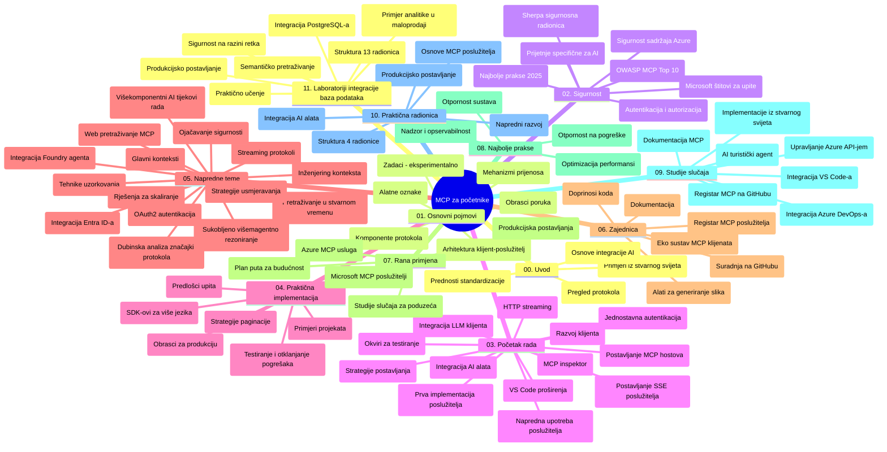

# Model Context Protocol (MCP) za početnike - Vodič za učenje

Ovaj vodič za učenje pruža pregled strukture i sadržaja repozitorija za nastavnu cjelinu "Model Context Protocol (MCP) za početnike". Koristite ovaj vodič za učinkovito snalaženje u repozitoriju i maksimalno iskorištavanje dostupnih resursa.

## Pregled repozitorija

Model Context Protocol (MCP) je standardizirani okvir za interakcije između AI modela i klijentskih aplikacija. Izvorno kreiran od strane Anthropic-a, MCP sada održava šira MCP zajednica putem službene GitHub organizacije. Ovaj repozitorij pruža cjelovitu nastavnu cjelinu s praktičnim primjerima koda u C#, Javi, JavaScriptu, Pythonu i TypeScriptu, namijenjenu AI developerima, sistemskim arhitektima i softverskim inženjerima.

## Vizualna karta nastavnog plana

## Struktura repozitorija

Repozitorij je organiziran u jedanaest glavnih odjeljaka, od kojih se svaki fokusira na različite aspekte MCP:

1. **Uvod (00-Introduction/)**
   - Pregled Model Context Protocola
   - Zašto standardizacija ima važnost u AI procesima
   - Praktični slučajevi upotrebe i prednosti

2. **Osnovni koncepti (01-CoreConcepts/)**
   - Klijent-poslužitelj arhitektura
   - Ključne komponente protokola
   - Oblici razmjene poruka u MCP-u

3. **Sigurnost (02-Security/)**
   - Sigurnosne prijetnje u sustavima baziranim na MCP-u
   - Najbolje prakse za osiguravanje implementacija
   - Strategije autentikacije i autorizacije
   - **Sveobuhvatna sigurnosna dokumentacija**:
     - MCP Sigurnosne Najbolje Prakse 2025
     - Vodič za implementaciju Azure Content Safety
     - MCP sigurnosne kontrole i tehnike
     - Brzi referentni vodič najboljih MCP praksi
   - **Ključne teme sigurnosti**:
     - Napadi ubrizgavanja upita (prompt injection) i trovanje alata
     - Otimanja sesije i problemi s "confused deputy"
     - Ranljivosti prolaza tokena
     - Prekomjerne dozvole i kontrola pristupa
     - Sigurnost lanca opskrbe za AI komponente
     - Integracija Microsoft Prompt Shields

4. **Početak rada (03-GettingStarted/)**
   - Postavljanje i konfiguracija okruženja
   - Kreiranje osnovnih MCP poslužitelja i klijenata
   - Integracija s postojećim aplikacijama
   - Uključuje odjeljke za:
     - Prvu implementaciju poslužitelja
     - Razvoj klijenta
     - Integraciju s LLM klijentom
     - Integraciju s VS Code-om
     - Server-Sent Events (SSE) poslužitelj
     - Naprednu uporabu poslužitelja
     - HTTP streaming
     - Integraciju AI Toolkit-a
     - Strategije testiranja
     - Smjernice za implementaciju

5. **Praktična implementacija (04-PracticalImplementation/)**
   - Korištenje SDK-ova u različitim programskim jezicima
   - Tehnike otklanjanja pogrešaka, testiranja i provjere
   - Izrada višekratno upotrebljivih predložaka upita i radnih tokova
   - Primjeri projekata s implementacijama

6. **Napredne teme (05-AdvancedTopics/)**
   - Tehnike inženjeringa konteksta
   - Integracija Foundry agenta
   - Multi-modalni AI radni tokovi
   - Demonstracije OAuth2 autentikacije
   - Pretraživanje u stvarnom vremenu
   - Streaming u stvarnom vremenu
   - Implementacija root konteksta
   - Strategije usmjeravanja
   - Tehnike uzorkovanja
   - Pristupi skaliranju
   - Sigurnosni aspekti
   - Integracija Entra ID sigurnosti
   - Integracija web pretraživanja
   - Suparnički multi-agentni rezonacijski obrasci (debatni obrasci)

7. **Doprinosi zajednice (06-CommunityContributions/)**
   - Kako pridonijeti kodom i dokumentacijom
   - Suradnja putem GitHub-a
   - Poboljšanja i povratne informacije iz zajednice
   - Korištenje različitih MCP klijenata (Claude Desktop, Cline, VSCode)
   - Rad s popularnim MCP poslužiteljima uključujući generiranje slika

8. **Pouke iz ranog usvajanja (07-LessonsfromEarlyAdoption/)**
   - Implementacije iz stvarnog svijeta i uspješne priče
   - Izgradnja i implementacija rješenja baziranih na MCP-u
   - Trendovi i budući planovi
   - **Vodič za Microsoft MCP poslužitelje**: Sveobuhvatan vodič za 10 Microsoft MCP poslužitelja spremnih za produkciju uključujući:
     - Microsoft Learn Docs MCP poslužitelj
     - Azure MCP poslužitelj (15+ specijaliziranih konektora)
     - GitHub MCP poslužitelj
     - Azure DevOps MCP poslužitelj
     - MarkItDown MCP poslužitelj
     - SQL Server MCP poslužitelj
     - Playwright MCP poslužitelj
     - Dev Box MCP poslužitelj
     - Microsoft Foundry MCP poslužitelj
     - Microsoft 365 Agents Toolkit MCP poslužitelj

9. **Najbolje prakse (08-BestPractices/)**
   - Podešavanje i optimizacija performansi
   - Dizajn otpornosti MCP sustava
   - Strategije testiranja i otpornosti

10. **Studije slučaja (09-CaseStudy/)**
    - **Sedam opsežnih studija slučaja** koje pokazuju svestranost MCP-a u različitim scenarijima:
    - **Azure AI Travel Agents**: Multi-agentna orkestracija s Azure OpenAI i AI pretraživanjem
    - **Integracija Azure DevOps-a**: Automatizacija radnih procesa s YouTube ažuriranjima podataka
    - **Preuzimanje dokumentacije u stvarnom vremenu**: Python konzolni klijent s HTTP streamingom
    - **Interaktivni Generator Studijskog Plana**: Chainlit web aplikacija s konverzacijskim AI-jem
    - **Dokumentacija unutar uređivača**: Integracija s VS Code i GitHub Copilot radnim tokovima
    - **Azure API Management**: Integracija enterprise API-ja s izradom MCP poslužitelja
    - **GitHub MCP Registar**: Razvoj ekosustava i platforma za agentsku integraciju
    - Primjeri implementacija koji pokrivaju enterprise integracije, produktivnost developera i razvoj ekosustava

11. **Praktična radionica (10-StreamliningAIWorkflowsBuildingAnMCPServerWithAIToolkit/)**
    - Sveobuhvatna praktična radionica koja kombinira MCP s AI Toolkit-om
    - Izgradnja inteligentnih aplikacija koje povezuju AI modele s alatima iz stvarnog svijeta
    - Praktični moduli koji pokrivaju osnove, razvoj prilagođenih poslužitelja i strategije produkcijske implementacije
    - **Struktura laboratorija**:
      - Laboratorij 1: Osnove MCP poslužitelja
      - Laboratorij 2: Napredni razvoj MCP poslužitelja
      - Laboratorij 3: Integracija AI Toolkit-a
      - Laboratorij 4: Produkcijska implementacija i skaliranje
    - Pristup učenju kroz laboratorijske vježbe s uputama korak-po-korak

12. **MCP Server Integracijski laboratoriji (11-MCPServerHandsOnLabs/)**
    - **Sveobuhvatan put učenja s 13 laboratorija** za izgradnju produkcijski spremnih MCP poslužitelja s integracijom PostgreSQL-a
    - **Implementacija analitike u stvarnom svijetu za maloprodaju** koristeći Zava Retail primjer
    - **Enterprise obrasci** uključujući sigurnost na razini retka (Row Level Security - RLS), semantičko pretraživanje i višekorisnički pristup podacima
    - **Cjelokupna struktura laboratorija**:
      - **Laboratoriji 00-03: Osnove** - Uvod, arhitektura, sigurnost, postavljanje okruženja
      - **Laboratoriji 04-06: Izgradnja MCP poslužitelja** - Dizajn baze podataka, implementacija MCP poslužitelja, razvoj alata
      - **Laboratoriji 07-09: Napredne značajke** - Semantičko pretraživanje, testiranje i otklanjanje pogrešaka, integracija s VS Code
      - **Laboratoriji 10-12: Produkcija i najbolje prakse** - Implementacija, nadzor, optimizacija
    - **Tehnologije**: FastMCP framework, PostgreSQL, Azure OpenAI, Azure Container Apps, Application Insights
    - **Ishodi učenja**: Produkcijski spremni MCP poslužitelji, obrasci integracije baza, AI-pokretana analitika, enterprise sigurnost

## Dodatni resursi

Repozitorij uključuje pomoćne resurse:

- **Folder slika**: Sadrži dijagrame i ilustracije korištene kroz nastavni plan
- **Prijevodi**: Podrška za više jezika s automatskim prijevodima dokumentacije
- **Službeni MCP resursi**:
  - [MCP Dokumentacija](https://modelcontextprotocol.io/)
  - [MCP Specifikacija](https://spec.modelcontextprotocol.io/)
  - [MCP GitHub Repozitorij](https://github.com/modelcontextprotocol)

## Kako koristiti ovaj repozitorij

1. **Učenje po redoslijedu**: Slijedite poglavlja redom (od 00 do 11) za strukturirano učenje.
2. **Fokus na određeni programski jezik**: Ako ste zainteresirani za određeni programski jezik, istražite direktorije sa uzorcima implementacija na željenom jeziku.
3. **Praktična implementacija**: Počnite s odjeljkom "Početak rada" kako biste postavili okruženje i kreirali svoj prvi MCP poslužitelj i klijenta.
4. **Napredno istraživanje**: Nakon upoznavanja s osnovama, zaronite u napredne teme za proširenje znanja.
5. **Uključenost u zajednicu**: Pridružite se MCP zajednici putem GitHub rasprava i Discord kanala kako biste se povezali s ekspertima i kolegama developerima.

## MCP klijenti i alati

Nastavni plan pokriva razne MCP klijente i alate:

1. **Službeni klijenti**:
   - Visual Studio Code
   - MCP u Visual Studio Code-u
   - Claude Desktop
   - Claude u VSCode-u
   - Claude API

2. **Klijenti zajednice**:
   - Cline (terminalski baziran)
   - Cursor (uređivač koda)
   - ChatMCP
   - Windsurf

3. **Alati za upravljanje MCP-om**:
   - MCP CLI
   - MCP Manager
   - MCP Linker
   - MCP Router

## Popularni MCP poslužitelji

Repozitorij predstavlja razne MCP poslužitelje, uključujući:

1. **Službeni Microsoft MCP poslužitelji**:
   - Microsoft Learn Docs MCP poslužitelj
   - Azure MCP poslužitelj (15+ specijaliziranih konektora)
   - GitHub MCP poslužitelj
   - Azure DevOps MCP poslužitelj
   - MarkItDown MCP poslužitelj
   - SQL Server MCP poslužitelj
   - Playwright MCP poslužitelj
   - Dev Box MCP poslužitelj
   - Microsoft Foundry MCP poslužitelj
   - Microsoft 365 Agents Toolkit MCP poslužitelj

2. **Službeni referentni poslužitelji**:
   - Filesystem
   - Fetch
   - Memory
   - Sequential Thinking

3. **Generiranje slika**:
   - Azure OpenAI DALL-E 3
   - Stable Diffusion WebUI
   - Replicate

4. **Razvojni alati**:
   - Git MCP
   - Terminal Control
   - Code Assistant

5. **Specijalizirani poslužitelji**:
   - Salesforce
   - Microsoft Teams
   - Jira & Confluence

## Doprinose

Ovaj repozitorij dobrodošao je za doprinose iz zajednice. Pogledajte odjeljak Doprinosi zajednice za upute o tome kako učinkovito doprinositi MCP ekosustavu.

----

*Ovaj vodič za učenje je zadnji put ažuriran 5. veljače 2026. godine, u skladu s najnovijom MCP Specifikacijom 2025-11-25 te pruža pregled repozitorija na taj datum. Sadržaj repozitorija može se ažurirati nakon tog datuma.*

---

<!-- CO-OP TRANSLATOR DISCLAIMER START -->
**Napomena**:
Ovaj dokument je preveden korištenjem AI prevoditeljskog servisa [Co-op Translator](https://github.com/Azure/co-op-translator). Iako težimo točnosti, imajte na umu da automatski prijevodi mogu sadržavati greške ili netočnosti. Izvorni dokument na izvornom jeziku treba smatrati autoritativnim izvorom. Za važne informacije preporuča se profesionalni ljudski prijevod. Nismo odgovorni za bilo kakva nesporazumevanja ili pogrešne interpretacije koje proizlaze iz korištenja ovog prijevoda.
<!-- CO-OP TRANSLATOR DISCLAIMER END -->