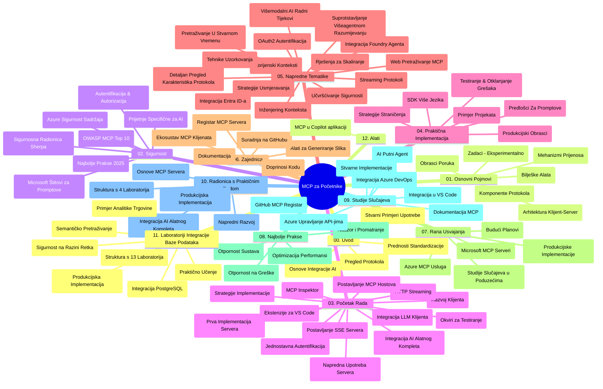

# Model Context Protocol (MCP) za početnike - Vodič za učenje

Ovaj vodič za učenje pruža pregled strukture i sadržaja repozitorija za kurikulum "Model Context Protocol (MCP) za početnike". Koristite ovaj vodič za učinkovitu navigaciju repozitorijem i maksimalno iskorištavanje dostupnih resursa.

## Pregled repozitorija

Model Context Protocol (MCP) je standardizirani okvir za interakcije između AI modela i klijentskih aplikacija. Izvorno ga je stvorio Anthropic, a sada ga održava šira MCP zajednica putem službene GitHub organizacije. Ovaj repozitorij pruža sveobuhvatan kurikulum s praktičnim primjerima koda u C#, Java, JavaScript, Python i TypeScript, namijenjen AI developerima, arhitektima sustava i softverskim inženjerima.

## Vizualna karta kurikuluma

## Struktura repozitorija

Repozitorij je organiziran u dvanaest glavnih odjeljaka, od kojih se svaki fokusira na različite aspekte MCP-a:

1. **Uvod (00-Introduction/)**
   - Pregled Model Context Protocola
   - Zašto je standardizacija važna u AI procesima
   - Praktični primjeri korištenja i prednosti

2. **Osnovni pojmovi (01-CoreConcepts/)**
   - Klijent-poslužitelj arhitektura
   - Ključne komponente protokola
   - Obrasci poruka u MCP-u

3. **Sigurnost (02-Security/)**
   - Prijetnje sigurnosti u sustavima zasnovanim na MCP-u
   - Najbolje prakse za sigurnu implementaciju
   - Strategije autentifikacije i autorizacije
   - **Sveobuhvatna dokumentacija o sigurnosti**:
     - MCP Najbolje prakse sigurnosti 2025
     - Vodič za implementaciju Azure Content Safety
     - MCP sigurnosne kontrole i tehnike
     - Brzi pregled MCP najboljih praksi
   - **Ključne sigurnosne teme**:
     - Napadi ubrizgavanja navođenja i trovanja alata
     - Preuzimanje sesije i problemi "confused deputy"
     - Ranljivosti u prosljeđivanju tokena
     - Pretjerana dopuštenja i kontrola pristupa
     - Sigurnost lanca opskrbe za AI komponente
     - Integracija Microsoft Prompt Shields

4. **Početak rada (03-GettingStarted/)**
   - Postavljanje i konfiguracija okruženja
   - Kreiranje osnovnih MCP poslužitelja i klijenata
   - Integracija s postojećim aplikacijama
   - Uključuje odjeljke za:
     - Prvu implementaciju poslužitelja
     - Razvoj klijenta
     - Integraciju LLM klijenta
     - Integraciju u VS Code
     - Server-Sent Events (SSE) poslužitelj
     - Naprednu uporabu poslužitelja
     - HTTP streaming
     - Integraciju AI Toolkita
     - Strategije testiranja
     - Smjernice za implementaciju

5. **Praktična implementacija (04-PracticalImplementation/)**
   - Korištenje SDK-ova za različite programske jezike
   - Tehnike otklanjanja pogrešaka, testiranja i validacije
   - Izrada ponovnih predložaka upita i radnih tokova
   - Primjeri projekata s implementacijama

6. **Napredne teme (05-AdvancedTopics/)**
   - Tehnike "context engineering"
   - Integracija Foundry agenta
   - Višestruki modaliteti AI radnih tokova
   - Demonstracije OAuth2 autentifikacije
   - Pretraživanje u stvarnom vremenu
   - Streaming u stvarnom vremenu
   - Implementacija root konteksta
   - Strategije usmjeravanja
   - Tehnike uzorkovanja
   - Pristupi skaliranju
   - Sigurnosna razmatranja
   - Integracija Entra ID sigurnosti
   - Integracija web pretraživanja
   - Antagonističko rezoniranje multi-agent sustava (obrasci debata)

7. **Doprinosi zajednice (06-CommunityContributions/)**
   - Kako doprinijeti kodom i dokumentacijom
   - Suradnja putem GitHub-a
   - Poboljšanja i povratne informacije vođene zajednicom
   - Korištenje različitih MCP klijenata (Claude Desktop, Cline, VSCode)
   - Rad s popularnim MCP poslužiteljima uključujući generiranje slika

8. **Lekcije iz ranog usvajanja (07-LessonsfromEarlyAdoption/)**
   - Implementacije i uspješne priče iz stvarnog svijeta
   - Izgradnja i implementacija rješenja baziranih na MCP-u
   - Trendovi i budući razvojni plan
   - **Vodič za Microsoft MCP poslužitelje**: Sveobuhvatan vodič za 10 proizvodno spremnih Microsoft MCP poslužitelja, uključujući:
     - Microsoft Learn Docs MCP poslužitelj
     - Azure MCP poslužitelj (15+ specijaliziranih konektora)
     - GitHub MCP poslužitelj
     - Azure DevOps MCP poslužitelj
     - MarkItDown MCP poslužitelj
     - SQL Server MCP poslužitelj
     - Playwright MCP poslužitelj
     - Dev Box MCP poslužitelj
     - Microsoft Foundry MCP poslužitelj
     - Microsoft 365 Agents Toolkit MCP poslužitelj

9. **Najbolje prakse (08-BestPractices/)**
   - Podešavanje performansi i optimizacija
   - Dizajniranje MCP sustava otpornih na greške
   - Strategije testiranja i otpornosti

10. **Studije slučaja (09-CaseStudy/)**
    - **Sedam sveobuhvatnih studija slučaja** koje pokazuju svestranost MCP-a u različitim scenarijima:
    - **Azure AI Travel Agents**: Multi-agentna orkestracija s Azure OpenAI i AI pretraživanjem
    - **Azure DevOps integracija**: Automatizacija radnih procesa s ažuriranjima podataka s YouTube-a
    - **Preuzimanje dokumentacije u realnom vremenu**: Python konzolni klijent s HTTP streamingom
    - **Interaktivni generator studijskih planova**: Chainlit web aplikacija s konverzacijskim AI
    - **Dokumentacija unutar uređivača**: Integracija u VS Code s radnim tokovima GitHub Copilota
    - **Azure API Management**: Integracija enterprise API-ja s izradom MCP poslužitelja
    - **GitHub MCP registar**: Razvoj ekosustava i platforma za agentsku integraciju
    - Primjeri implementacije koji pokrivaju enterprise integraciju, produktivnost developera i razvoj ekosustava

11. **Radionica s praktičnim radom (10-StreamliningAIWorkflowsBuildingAnMCPServerWithAIToolkit/)**
    - Sveobuhvatna radionica s praktičnim radom koja kombinira MCP s AI Toolkitom
    - Izrada inteligentnih aplikacija koje povezuju AI modele i stvarne alate
    - Praktični moduli koji pokrivaju osnove, razvoj prilagođenih poslužitelja i strategije produkcijskog uvođenja
    - **Struktura laboratorija**:
      - Laboratorij 1: Osnove MCP poslužitelja
      - Laboratorij 2: Napredni razvoj MCP poslužitelja
      - Laboratorij 3: Integracija AI Toolkita
      - Laboratorij 4: Produkcijska implementacija i skaliranje
    - Pristup učenju temeljen na koracima i uputama

12. **MCP server baza podataka laboratoriji (11-MCPServerHandsOnLabs/)**
    - **Sveobuhvatan put učenja kroz 13 laboratorija** za izradu produkcijski spremnih MCP poslužitelja s PostgreSQL integracijom
    - **Implementacija analitike u maloprodaji** korištenjem primjera Zava Retail slučaja
    - **Enterprise-sučelni obrasci** uključujući Row Level Security (RLS), semantičko pretraživanje i višekorisnički pristup podacima
    - **Potpuna struktura laboratorija**:
      - **Laboratoriji 00-03: Osnove** - Uvod, arhitektura, sigurnost, postavljanje okruženja
      - **Laboratoriji 04-06: Izgradnja MCP poslužitelja** - Dizajn baze podataka, implementacija MCP poslužitelja, razvoj alata
      - **Laboratoriji 07-09: Napredne značajke** - Semantičko pretraživanje, testiranje i debugiranje, integracija u VS Code
      - **Laboratoriji 10-12: Produkcija i najbolje prakse** - Implementacija, nadzor, optimizacija
    - **Tehnologije koje se obrađuju**: FastMCP framework, PostgreSQL, Azure OpenAI, Azure Container Apps, Application Insights
    - **Ishodi učenja**: Produkcijski spremni MCP poslužitelji, obrasci integracije baza podataka, AI-poticana analitika, sigurnost enterprise razine

13. **Alati (12-tooling/)**
    - Naučite kako koristiti MCP u aplikaciji Copilot i drugim alatima

## Dodatni resursi

Repozitorij uključuje dodatne resurse:

- **Mapa sa slikama**: Sadrži dijagrame i ilustracije korištene kroz kurikulum
- **Prijevodi**: Višejezična podrška s automatskim prijevodima dokumentacije
- **Službeni MCP resursi**:
  - [MCP dokumentacija](https://modelcontextprotocol.io/)
  - [MCP specifikacija](https://spec.modelcontextprotocol.io/)
  - [MCP GitHub repozitorij](https://github.com/modelcontextprotocol)

## Kako koristiti ovaj repozitorij

1. **Sekvencijalno učenje**: Slijedite poglavlja redom (00 do 11) za strukturirano učenje.
2. **Fokus na određeni jezik**: Ako vas zanima neki programski jezik, istražite direktorije uzoraka za implementacije na željenom jeziku.
3. **Praktična implementacija**: Počnite s odjeljkom "Početak rada" za postavljanje okruženja i kreiranje prvog MCP poslužitelja i klijenta.
4. **Napredno istraživanje**: Nakon što steknete osnovno znanje, započnite s istraživanjem naprednih tema kako biste proširili znanje.
5. **Sudjelovanje u zajednici**: Pridružite se MCP zajednici preko GitHub diskusija i Discord kanala kako biste se povezali s ekspertima i kolegama developerima.

## MCP klijenti i alati

Kurikulum pokriva različite MCP klijente i alate:

1. **Službeni klijenti**:
   - Visual Studio Code 
   - MCP u Visual Studio Code-u
   - Claude Desktop
   - Claude u VSCode-u 
   - Claude API

2. **Zajednički klijenti**:
   - Cline (terminalni klijent)
   - Cursor (uređivač koda)
   - ChatMCP
   - Windsurf

3. **MCP alati za upravljanje**:
   - MCP CLI
   - MCP Manager
   - MCP Linker
   - MCP Router

## Popularni MCP poslužitelji

Repozitorij predstavlja različite MCP poslužitelje, uključujući:

1. **Službeni Microsoft MCP poslužitelji**:
   - Microsoft Learn Docs MCP poslužitelj
   - Azure MCP poslužitelj (15+ specijaliziranih konektora)
   - GitHub MCP poslužitelj
   - Azure DevOps MCP poslužitelj
   - MarkItDown MCP poslužitelj
   - SQL Server MCP poslužitelj
   - Playwright MCP poslužitelj
   - Dev Box MCP poslužitelj
   - Microsoft Foundry MCP poslužitelj
   - Microsoft 365 Agents Toolkit MCP poslužitelj

2. **Službeni referentni poslužitelji**:
   - Filesystem
   - Fetch
   - Memory
   - Sequential Thinking

3. **Generiranje slika**:
   - Azure OpenAI DALL-E 3
   - Stable Diffusion WebUI
   - Replicate

4. **Razvojni alati**:
   - Git MCP
   - Terminal Control
   - Code Assistant

5. **Specijalizirani poslužitelji**:
   - Salesforce
   - Microsoft Teams
   - Jira & Confluence

## Doprinose

Ovaj repozitorij pozdravlja doprinose zajednice. Pogledajte odjeljak Doprinosi zajednice za smjernice o tome kako učinkovito doprinijeti MCP ekosustavu.

----

*Ovaj vodič za učenje zadnji put je ažuriran 5. veljače 2026. godine, odražavajući najnoviju MCP Specifikaciju 2025-11-25 i pruža pregled repozitorija na taj datum. Sadržaj repozitorija može biti ažuriran nakon ovog datuma.*

---

<!-- CO-OP TRANSLATOR DISCLAIMER START -->
**Napomena**:
Ovaj dokument je preveden korištenjem AI prevoditeljskog servisa [Co-op Translator](https://github.com/Azure/co-op-translator). Iako težimo točnosti, imajte na umu da automatski prijevodi mogu sadržavati greške ili netočnosti. Izvorni dokument na izvornom jeziku treba smatrati autoritativnim izvorom. Za važne informacije preporuča se profesionalni ljudski prijevod. Nismo odgovorni za bilo kakva nesporazumevanja ili pogrešne interpretacije koje proizlaze iz korištenja ovog prijevoda.
<!-- CO-OP TRANSLATOR DISCLAIMER END -->