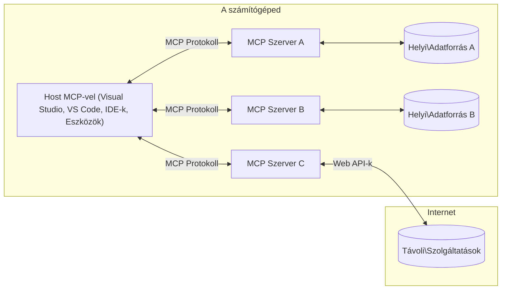

# MCP Alapfogalmak: A Model Context Protocol mesteri elsajátítása az AI integrációhoz

[](https://youtu.be/earDzWGtE84)

_(Kattints a fenti képre a tanóra videójának megtekintéséhez)_

A [Model Context Protocol (MCP)](https://github.com/modelcontextprotocol) egy erőteljes, szabványosított keretrendszer, amely optimalizálja a kommunikációt a nagy nyelvi modellek (LLM-ek) és külső eszközök, alkalmazások, valamint adatforrások között.  
Ez az útmutató végigvezet a MCP alapfogalmain. Megismered a kliens-szerver architektúrát, az alapvető összetevőket, a kommunikációs mechanizmusokat és a megvalósítás legjobb gyakorlatait.

- **Explicit felhasználói hozzájárulás**: Minden adat-hozzáférés és művelet explicit felhasználói jóváhagyást igényel a végrehajtás előtt. A felhasználóknak világosan érteniük kell, milyen adatokhoz férnek hozzá és milyen műveletek lesznek végrehajtva, részletes engedélyezési és jogosultsági irányítással.

- **Adatvédelmi védelem**: A felhasználói adatok csak explicit hozzájárulással kerülnek nyilvánosságra, és azokat erős hozzáférésvezérléssel kell védeni az egész interakciós ciklus alatt. A megvalósításoknak meg kell akadályozniuk az illetéktelen adatátvitelt, és szigorú adatvédelmi határokat kell betartaniuk.

- **Eszközvégrehajtás biztonsága**: Minden eszközhívás explicit felhasználói jóváhagyást igényel, amely tisztán megismerteti az eszköz működését, paramétereit és lehetséges hatását. Erős biztonsági határoknak kell megakadályozniuk a nem szándékolt, veszélyes vagy rosszindulatú eszközvégrehajtást.

- **Transzport réteg biztonsága**: Minden kommunikációs csatornán megfelelő titkosítási és hitelesítési mechanizmusokat kell alkalmazni. A távoli kapcsolatok biztonságos transzport protokollokat és megfelelő hitelesítő adatkezelést kell, hogy használjanak.

#### Megvalósítási irányelvek:

- **Engedélyezés kezelése**: Finomhangolt engedélyezési rendszerek megvalósítása, melyek lehetővé teszik a felhasználók számára, hogy kontrollálják, mely szerverek, eszközök és erőforrások érhetők el  
- **Hitelesítés és jogosultságkezelés**: Biztonságos hitelesítési módszerek (OAuth, API kulcsok) alkalmazása megfelelő token-kezeléssel és lejáratkezeléssel  
- **Bemeneti érvényesítés**: Minden paraméter és adatok érvényesítése a meghatározott sémák szerint az injekciós támadások megelőzése érdekében  
- **Auditnaplózás**: Átfogó naplók vezetése minden műveletről biztonsági megfigyelés és megfelelőség céljából

## Áttekintés

Ez a tanóra feltárja a Model Context Protocol (MCP) környezetének alapvető architektúráját és elemeit. Megismerheted a kliens-szerver architektúrát, a kulcsfontosságú összetevőket és azokat a kommunikációs mechanizmusokat, amelyek az MCP interakciókat működtetik.

## Fő tanulási célok

A tanóra végére képes leszel:

- Megérteni a MCP kliens-szerver architektúrát.
- Felismerni a Hostok, Kliensek és Szerverek szerepét és felelősségeit.
- Elemezni azokat az alapvető funkciókat, amelyek a MCP-t rugalmas integrációs réteggé teszik.
- Megtanulni, hogyan áramlik az információ az MCP ökoszisztémán belül.
- Gyakorlati betekintést nyerni kódpéldákon keresztül .NET, Java, Python és JavaScript nyelven.

## MCP Architektúra: Mélyebb betekintés

Az MCP ökoszisztéma kliens-szerver modellre épül. Ez a moduláris struktúra lehetővé teszi az AI alkalmazások számára, hogy hatékonyan lépjenek kapcsolatba eszközökkel, adatbázisokkal, API-kkal és kontextuális erőforrásokkal. Nézzük meg ezt az architektúrát alapvető összetevőire bontva.

Az MCP alapvetően kliens-szerver architektúrát követ, ahol egy host alkalmazás több szerverhez csatlakozhat:


- **MCP Hostok**: Olyan programok, mint a VSCode, Claude Desktop, IDE-k vagy AI eszközök, amelyek adatokat akarnak elérni az MCP-n keresztül  
- **MCP Kliensek**: Protokoll kliensek, amelyek 1:1 kapcsolatot tartanak fenn a szerverekkel  
- **MCP Szerverek**: Könnyű súlyú programok, amelyek specifikus képességeket tesznek elérhetővé a szabványosított Model Context Protocol által  
- **Helyi adatforrások**: A számítógéped fájljai, adatbázisai és szolgáltatásai, amelyekhez az MCP szerverek biztonságosan hozzáférhetnek  
- **Távoli szolgáltatások**: Külső rendszerek, amelyek az interneten keresztül érhetők el, és amelyekhez MCP szerverek API-kon keresztül kapcsolódhatnak

Az MCP protokoll egy fejlődő szabvány, mely dátum-alapú verziókezelést használ (YYYY-MM-DD formátumban). A jelenlegi protokoll verzió **2025-11-25**. A legújabb frissítéseket a [protokoll specifikációban](https://modelcontextprotocol.io/specification/2025-11-25/) találhatod meg.

### 1. Hostok

A Model Context Protocol (MCP) esetén a **Hostok** azok az AI alkalmazások, amelyek a protokoll elsődleges felhasználói interfészét szolgáltatják. A Hostok koordinálják és kezelik a kapcsolódásokat több MCP szerverhez azzal, hogy dedikált MCP kliens példányokat hoznak létre minden szerverkapcsolathoz. Host példák:

- **AI alkalmazások**: Claude Desktop, Visual Studio Code, Claude Code  
- **Fejlesztői környezetek**: IDE-k és kódszerkesztők, melyek MCP integrációval rendelkeznek  
- **Egyedi alkalmazások**: Kifejezetten AI ügynökök és eszközök

A **Hostok** az AI modell interakciók koordinálói. Ezek:

- **AI modellek orkestrálása**: LLM-eket indítanak vagy lépnek kapcsolatba velük válasz generálására és AI munkafolyamatok koordinálására  
- **Klienskapcsolatok kezelése**: Minden MCP szerverkapcsolathoz létrehoznak és fenntartanak egy MCP klienst  
- **Felhasználói felület vezérlése**: Kezelik a beszélgetés folyamatát, a felhasználói interakciókat és a válaszok bemutatását  
- **Biztonság érvényesítése**: Engedélyeket, biztonsági korlátokat és hitelesítést kezelnek  
- **Felhasználói hozzájárulás kezelése**: Kezelik a felhasználói jóváhagyást az adatmegosztáshoz és eszközvégrehajtáshoz

### 2. Kliensek

A **Kliensek** alapvető összetevők, amelyek fenntartanak dedikált egy-egy kapcsolódást a Hostok és az MCP szerverek között. Minden MCP kliens a Host által jön létre egy adott MCP szerverhez való kapcsolódáshoz, biztosítva a rendszerezett és biztonságos kommunikációs csatornákat. Több kliens lehetővé teszi, hogy a Host egyszerre több szerverhez csatlakozzon.

A **Kliensek** olyan komponensek a host alkalmazáson belül, amelyek:

- **Protokoll kommunikáció**: JSON-RPC 2.0 kéréseket küldenek a szerverekhez promptokkal és utasításokkal  
- **Képesség-egyeztetés**: A szerverekkel egyeztetik a támogatott funkciókat és protokoll verziókat inicializáláskor  
- **Eszközvégrehajtás**: Kezelik a modellek eszközvégrehajtási kérelmeit és feldolgozzák a válaszokat  
- **Valós idejű frissítések**: Kezelik a szerverek értesítéseit és frissítéseit valós időben  
- **Válasz feldolgozás**: Feldolgozzák és formázzák a szerver válaszait a felhasználók számára

### 3. Szerverek

A **Szerverek** olyan programok, amelyek kontextust, eszközöket és képességeket biztosítanak az MCP kliensek számára. Ezek futtathatók helyileg (ugyanazon a gépen, ahol a Host) vagy távolról (külső platformokon), és felelősek a kliens kérések kezeléséért és strukturált válaszok biztosításáért. A szerverek specifikus funkcionalitást tesznek elérhetővé a szabványos Model Context Protocol-on keresztül.

A **Szerverek** olyan szolgáltatások, amelyek kontextust és képességeket nyújtanak. Ezek:

- **Funkciók regisztrálása**: Regisztrálják és elérhetővé teszik az elérhető primitíveket (erőforrások, promptok, eszközök) a klienseknek  
- **Kérések feldolgozása**: Fogadják és végrehajtják az eszközhívásokat, erőforráskéréseket és promptkéréseket a kliensektől  
- **Kontextus szolgáltatása**: Kontextuális információkat és adatokat biztosítanak a modell válaszok javításához  
- **Állapot kezelés**: Fenntartják a munkamenet állapotát és szükség esetén kezelik az állapottartó interakciókat  
- **Valós idejű értesítések**: Értesítéseket küldenek a képességváltozásokról és frissítésekről a kapcsolódó klienseknek

A szervereket bárki fejlesztheti, hogy kiterjessze a modell képességeit speciális funkcionalitással, és támogatják mind a helyi, mind a távoli telepítést.

### 4. Szerver primitívek

A Model Context Protocol (MCP) szerverei három alapvető **primitívet** biztosítanak, amelyek meghatározzák a kliens, a host és a nyelvi modellek közötti gazdag interakciók alapját. Ezek a primitívek szabályozzák az elérhető kontextuális információk és műveletek típusait a protokollon keresztül.

Az MCP szerverek bármilyen kombinációban elérhetővé tehetik a következő három alap primitívet:

#### Erőforrások

Az **erőforrások** olyan adatforrások, amelyek kontextuális információkat szolgáltatnak az AI alkalmazások számára. Statikus vagy dinamikus tartalmat képviselnek, amelyek javíthatják a modell megértését és döntéshozatalát:

- **Kontextuális adatok**: Strukturált információ és kontextus AI modell fogyasztáshoz  
- **Tudásbázisok**: Dokumentum tárolók, cikkek, kézikönyvek és kutatási anyagok  
- **Helyi adatforrások**: Fájlok, adatbázisok és helyi rendszer információk  
- **Külső adatok**: API válaszok, webszolgáltatások és távoli rendszeradatok  
- **Dinamikus tartalom**: Valós idejű adatok, melyek külső feltételek alapján frissülnek

Az erőforrások URI-k alapján azonosíthatók, és felfedezésüket a `resources/list`, lekérésüket a `resources/read` metódusok segítik:

```text
file://documents/project-spec.md
database://production/users/schema
api://weather/current
```

#### Promptok

A **promptok** újrahasznosítható sablonok, amelyek segítik a nyelvi modellekkel való interakciók strukturálását. Standardizált interakciós mintákat és sablonos munkafolyamatokat biztosítanak:

- **Sablonalapú interakciók**: Előre strukturált üzenetek és beszélgetésindítók  
- **Munkafolyamat sablonok**: Szabványosított lépéssorozatok gyakori feladatokhoz és interakciókhoz  
- **Few-shot példák**: Minta alapú sablonok modell instrukcióhoz  
- **Rendszer promptok**: Alapvető promptok, amelyek definiálják a modell viselkedését és kontextusát  
- **Dinamikus sablonok**: Paraméterezett promptok, amelyek alkalmazkodnak a speciális kontextusokhoz

A promptok támogatják a változók behelyettesítését, felfedezhetők `prompts/list` metódussal, lekérhetők a `prompts/get` segítségével:

```markdown
Generate a {{task_type}} for {{product}} targeting {{audience}} with the following requirements: {{requirements}}
```

#### Eszközök

Az **eszközök** végrehajtható funkciók, amelyeket az AI modellek hívhatnak meg konkrét műveletek elvégzésére. Ezek az MCP ökoszisztéma „igéi”, amelyek lehetővé teszik a modellek számára, hogy külső rendszerekkel lépjenek kapcsolatba:

- **Végrehajtható funkciók**: Elkülönült műveletek, amelyeket a modellek specifikus paraméterekkel hívhatnak meg  
- **Külső rendszer integráció**: API hívások, adatbázis lekérdezések, fájlműveletek, számítások  
- **Egyedi azonosító**: Minden eszköznek megvan a saját neve, leírása és paraméter sémája  
- **Strukturált bemenet-kimenet**: Az eszközök validált paramétereket fogadnak és strukturált, típusos válaszokat adnak vissza  
- **Akció képességek**: Lehetővé teszik a modellek számára a valós világban történő műveleteket és élő adatok lekérését

Az eszközök paramétervalidációja JSON Sémával történik, felfedezésük a `tools/list`, végrehajtásuk a `tools/call`. Az eszközök tartalmazhatnak **ikonokat** is további metaadatként a jobb UI bemutatáshoz.

**Eszköz annotációk**: Az eszközök viselkedési annotációkat támogatnak (pl. `readOnlyHint`, `destructiveHint`), amelyek leírják, hogy egy eszköz csak olvasható vagy destruktív jellegű-e, segítve ezzel a klienseket a megalapozott döntések meghozatalában az eszközvégrehajtást illetően.

Példa eszköz definícióra:

```typescript
server.tool(
  "search_products", 
  {
    query: z.string().describe("Search query for products"),
    category: z.string().optional().describe("Product category filter"),
    max_results: z.number().default(10).describe("Maximum results to return")
  }, 
  async (params) => {
    // Hajtsa végre a keresést, és adjon vissza strukturált eredményeket
    return await productService.search(params);
  }
);
```

## Kliens primitívek

A Model Context Protocol (MCP) esetén a **kliensek** is kiállíthatnak primitíveket, amelyek lehetővé teszik a szerverek számára, hogy további képességeket kérjenek a host alkalmazástól. Ezek a kliens oldali primitívek gazdagabb, interaktívabb szerver implementációkat tesznek lehetővé, amelyek hozzáférnek az AI modell képességeihez és a felhasználói interakciókhoz.

### Mintavételezés

A **mintavételezés** lehetővé teszi a szerverek számára, hogy nyelvi modell kiegészítéseket kérjenek a kliens AI alkalmazásától. Ez a primitív lehetővé teszi, hogy a szerverek a saját LLM függőségek nélkül férjenek hozzá az LLM képességekhez:

- **Modelltől független hozzáférés**: A szerverek kiegészítési kéréseket intézhetnek anélkül, hogy magukba ágyaznák az LLM SDK-kat vagy kezelnék a modell hozzáférést  
- **Szerver által kezdeményezett AI**: A szerverek önállóan generálhatnak tartalmat a kliens AI modell segítségével  
- **Rekurzív LLM interakciók**: Támogatja az összetett forgatókönyveket, ahol a szerverek AI segítséget kérnek a feldolgozáshoz  
- **Dinamikus tartalom generálás**: A szerverek kontextuális válaszokat hozhatnak létre a host modelljének használatával  
- **Eszközhívás támogatás**: A szerverek beilleszthetnek `tools` és `toolChoice` paramétereket, amelyek lehetővé teszik a kliens modelljének eszközök meghívását mintavételezés közben.

A mintavételezés a `sampling/complete` metóduson keresztül indul, ahol a szerverek kiegészítési kérelmeket küldenek a klienseknek.

### Gyökerek

A **Gyökerek** szabványos módot biztosítanak a kliensek számára, hogy fájlrendszer határokat fedjenek fel a szervereknek, így segítve a szervereket abban, hogy megértsék, mely könyvtárakhoz és fájlokhoz van hozzáférésük:

- **Fájlrendszer határai**: Meghatározzák, hol tudnak működni a szerverek a fájlrendszerben  
- **Hozzáférés-vezérlés**: Segítik a szervereket annak megértésében, mely könyvtárakhoz és fájlokhoz van engedélyük hozzáférni  
- **Dinamikus frissítések**: A kliensek értesíthetik a szervereket a gyökérlista változásairól  
- **URI alapú azonosítás**: A gyökerek `file://` URI-ket használnak az elérhető könyvtárak és fájlok azonosítására

A gyökerek felfedezése a `roots/list` metódussal történik, a kliens pedig `notifications/roots/list_changed` értesítést küld, ha a gyökerek változnak.

### Kérdezés  

A **Kérdezés** lehetővé teszi a szerverek számára, hogy további információkat vagy megerősítést kérjenek a felhasználóktól a kliens felületén keresztül:

- **Felhasználói bemenet kérése**: A szerverek plusz információt kérhetnek, amikor eszköz végrehajtáshoz szükséges  
- **Megerősítő párbeszédek**: Felhasználói jóváhagyást kérnek érzékeny vagy jelentős műveletekhez  
- **Interaktív munkafolyamatok**: Lehetővé teszik lépésről-lépésre haladó felhasználói interakciók létrehozását  
- **Dinamikus paramétergyűjtés**: Hiányzó vagy opcionális paraméterek begyűjtése eszközvégrehajtás közben

A kérdezési kéréseket a `elicitation/request` metóduson keresztül intézik a felhasználói bemenet összegyűjtésére a kliens interfészén.

**URL módú kérdezés**: A szerverek URL alapú felhasználói interakciókat is kérhetnek, amelyek során a felhasználókat külső weboldalakra irányítják hitelesítés, megerősítés vagy adatbevitel céljából.

### Naplózás

A **naplózás** lehetővé teszi a szerverek számára, hogy strukturált naplóüzeneteket küldjenek a klienseknek hibakeresés, megfigyelés és üzemeltetési átláthatóság céljából:

- **Hibakeresési támogatás**: A szerverek részletes végrehajtási naplókat biztosíthatnak a hibaelhárításhoz  
- **Üzemeltetési megfigyelés**: Állapotfrissítéseket és teljesítmény mutatókat küldenek a klienseknek  
- **Hibajelentés**: Részletes hibakörnyezetet és diagnosztikai információkat nyújtanak  
- **Audit nyomvonalak**: Átfogó naplókat hoznak létre a szerver működéséről és döntéseiről

A naplóüzeneteket a klienseknek küldik az átláthatóság biztosítása és a hibakeresés megkönnyítése érdekében.

## Az információáramlás az MCP-ben

A Model Context Protocol (MCP) definiál egy strukturált információáramlást a hostok, kliensek, szerverek és modellek között. Ennek megértése segít tisztázni, hogy miként dolgozódnak fel a felhasználói kérések és hogyan integrálódnak a külső eszközök és adatok a modell válaszaiba.
- **A gazda kezdeményezi a kapcsolatot**  
  A gazdaalkalmazás (például egy IDE vagy chat felület) létrehoz egy kapcsolatot egy MCP szerverrel, általában STDIO, WebSocket vagy más támogatott közlekedési módon keresztül.

- **Képesség egyeztetés**  
  Az ügyfél (a gazdába ágyazva) és a szerver információt cserél a támogatott funkciókról, eszközökről, erőforrásokról és protokoll verziókról. Ez biztosítja, hogy mindkét fél értse, milyen képességek állnak rendelkezésre a munkamenet során.

- **Felhasználói kérés**  
  A felhasználó interakcióba lép a gazdával (pl. promptot vagy parancsot ad meg). A gazda begyűjti ezt a bemenetet, és továbbítja az ügyfélnek feldolgozásra.

- **Erőforrás vagy eszköz használata**  
  - Az ügyfél további kontextust vagy erőforrásokat kérhet a szervertől (például fájlokat, adatbázis bejegyzéseket vagy tudásbázis cikkeket), hogy gazdagítsa a modell megértését.  
  - Ha a modell úgy ítéli meg, hogy eszközre van szükség (például adat lekérése, számítás végrehajtása vagy API hívás), az ügyfél eszköz meghívási kérelmet küld a szervernek az eszköz nevének és paramétereinek megadásával.

- **Szerver végrehajtás**  
  A szerver fogadja az erőforrás- vagy eszközkérést, végrehajtja a szükséges műveleteket (pl. függvény futtatása, adatbázis lekérdezés vagy fájl letöltés), és strukturált formátumban visszaküldi az eredményeket az ügyfélnek.

- **Válaszgenerálás**  
  Az ügyfél integrálja a szerver válaszait (erőforrásadatok, eszköz kimenetek stb.) a folyamatban lévő modell interakcióba. A modell ezt az információt felhasználva állít elő részletes és kontextusban releváns választ.

- **Eredmény bemutatása**  
  A gazda megkapja az ügyféltől a végső eredményt, és bemutatja a felhasználónak, gyakran tartalmazva a modell által generált szöveget és az eszközvégrehajtás vagy erőforrás lekérések eredményeit.

Ez a folyamat lehetővé teszi az MCP számára, hogy fejlett, interaktív és kontextusérzékeny MI-alkalmazásokat támogasson azáltal, hogy zökkenőmentesen összekapcsolja a modelleket külső eszközökkel és adatforrásokkal.

## Protokoll Architektúra és Rétegek

Az MCP két elkülönült architekturális rétegből áll, amelyek együtt működnek egy teljes kommunikációs keretrendszer biztosításához:

### Adat Réteg

Az **Adat Réteg** az MCP protokoll magját valósítja meg a **JSON-RPC 2.0** használatával alapként. Ez a réteg definiálja az üzenetszerkezetet, szemantikát és az interakciós mintákat:

#### Fő komponensek:

- **JSON-RPC 2.0 protokoll**: Minden kommunikáció szabványosított JSON-RPC 2.0 üzenetformátumban történik metódushívások, válaszok és értesítések esetén  
- **Életciklus kezelése**: Kezeli a kapcsolat inicializálását, a képességek egyeztetését és a munkamenet lezárását ügyfelek és szerverek között  
- **Szerver primitívek**: Lehetővé teszi, hogy a szerverek eszközökkel, erőforrásokkal és promptokkal nyújtsanak alapfunkciókat  
- **Ügyfél primitívek**: Lehetővé teszi a szerverek számára, hogy LLM mintavételezést kérjenek, felhasználói bemenetet kérjenek, valamint naplóüzeneteket küldjenek  
- **Valós idejű értesítések**: Támogatja az aszinkron értesítéseket dinamikus frissítésekhez lekérdezés nélkül

#### Kulcsfunkciók:

- **Protokoll verzió egyeztetés**: Dátumalapú verziókezelést (ÉÉÉÉ-HH-NN) használ a kompatibilitás biztosítására  
- **Képesség felfedezés**: Az ügyfelek és szerverek a inicializáció során cserélnek információkat a támogatott funkciókról  
- **Állapotmegőrző munkamenetek**: Fenntartja a kapcsolat állapotát több interakción keresztül a kontextus következetessége érdekében

### Közlekedési Réteg

A **Közlekedési Réteg** kezeli a kommunikációs csatornákat, az üzenetkeretezést és az azonosítást az MCP résztvevők között:

#### Támogatott közlekedési módok:

1. **STDIO közlekedés**:  
   - Szabványos bemenet/kimeneti csatornákat használ a közvetlen folyamatok közötti kommunikációhoz  
   - Optimális egyazon gépen futó helyi folyamatok számára hálózati terhelés nélkül  
   - Gyakran használt helyi MCP szerver megvalósításoknál

2. **Streamelhető HTTP közlekedés**:  
   - HTTP POST-t használ ügyfél-szerver üzenetekhez  
   - Opcionális Server-Sent Events (SSE) a szerver-ügyfél streameléshez  
   - Lehetővé teszi távoli szerver kommunikációját hálózatokon keresztül  
   - Támogatja a szabványos HTTP hitelesítést (bearer tokenek, API kulcsok, egyedi fejlécek)  
   - Az MCP az OAuth használatát ajánlja a biztonságos token-alapú hitelesítéshez

#### Közlekedési absztrakció:

A közlekedési réteg elrejti a kommunikáció részleteit az adat réteg elől, lehetővé téve ugyanazon JSON-RPC 2.0 üzenetformátum használatát minden közlekedési mechanizmuson keresztül. Ez az absztrakció lehetővé teszi a helyi és távoli szerverek közti zökkenőmentes váltást.

### Biztonsági megfontolások

Az MCP megvalósításoknak több kritikus biztonsági elvet kell követniük a biztonságos, megbízható és biztonságos interakciók érdekében a teljes protokoll működés során:

- **Felhasználói beleegyezés és irányítás**: A felhasználóknak kifejezett hozzájárulást kell adniuk bármilyen adat elérése vagy művelet végrehajtása előtt. Világos kontrollt kell biztosítani a megosztott adatok és engedélyezett műveletek felett, intuitív felhasználói felületekkel az események áttekintésére és jóváhagyására.

- **Adatvédelem**: A felhasználói adatokat csak kifejezett hozzájárulással szabad megosztani, megfelelő hozzáférés-szabályozás mellett. Az MCP implementációknak meg kell akadályozniuk az illetéktelen adatátvitelt, és biztosítaniuk kell a magánszféra megőrzését minden interakció során.

- **Eszközbiztonság**: Minden eszköz meghívása előtt kifejezett felhasználói beleegyezés szükséges. A felhasználóknak tisztában kell lenniük az eszközök működésével, és erős biztonsági határokat kell alkalmazni a nem szándékos vagy nem biztonságos eszközvégrehajtás megakadályozására.

Ezeknek a biztonsági elveknek a betartásával az MCP biztosítja a felhasználói bizalmat, az adatvédelmet és a biztonságot a teljes protokoll interakció során, miközben erőteljes MI integrációkat tesz lehetővé.

## Kódpéldák: Kulcsfontosságú komponensek

Az alábbiakban néhány népszerű programozási nyelven mutatunk be kódpéldákat, amelyek illusztrálják, hogyan lehet megvalósítani az MCP szerver kulcselemeit és eszközeit.

### .NET példa: Egyszerű MCP szerver létrehozása eszközökkel

Itt egy gyakorlati .NET kódpélda, amely bemutatja, hogyan lehet egyszerű MCP szervert létrehozni egyedi eszközökkel. Ez a példa szemlélteti az eszközök definiálását és regisztrálását, kérések kezelését és a szerverhez való kapcsolódást a Model Context Protocol segítségével.

```csharp
using System;
using System.Threading.Tasks;
using ModelContextProtocol.Server;
using ModelContextProtocol.Server.Transport;
using ModelContextProtocol.Server.Tools;

public class WeatherServer
{
    public static async Task Main(string[] args)
    {
        // Create an MCP server
        var server = new McpServer(
            name: "Weather MCP Server",
            version: "1.0.0"
        );
        
        // Register our custom weather tool
        server.AddTool<string, WeatherData>("weatherTool", 
            description: "Gets current weather for a location",
            execute: async (location) => {
                // Call weather API (simplified)
                var weatherData = await GetWeatherDataAsync(location);
                return weatherData;
            });
        
        // Connect the server using stdio transport
        var transport = new StdioServerTransport();
        await server.ConnectAsync(transport);
        
        Console.WriteLine("Weather MCP Server started");
        
        // Keep the server running until process is terminated
        await Task.Delay(-1);
    }
    
    private static async Task<WeatherData> GetWeatherDataAsync(string location)
    {
        // This would normally call a weather API
        // Simplified for demonstration
        await Task.Delay(100); // Simulate API call
        return new WeatherData { 
            Temperature = 72.5,
            Conditions = "Sunny",
            Location = location
        };
    }
}

public class WeatherData
{
    public double Temperature { get; set; }
    public string Conditions { get; set; }
    public string Location { get; set; }
}
```

### Java példa: MCP szerver komponensek

Ez a példa ugyanazt az MCP szervert és eszközregisztrációt mutatja be, mint a fenti .NET példa, de Java nyelven megvalósítva.

```java
import io.modelcontextprotocol.server.McpServer;
import io.modelcontextprotocol.server.McpToolDefinition;
import io.modelcontextprotocol.server.transport.StdioServerTransport;
import io.modelcontextprotocol.server.tool.ToolExecutionContext;
import io.modelcontextprotocol.server.tool.ToolResponse;

public class WeatherMcpServer {
    public static void main(String[] args) throws Exception {
        // Hozzon létre egy MCP szervert
        McpServer server = McpServer.builder()
            .name("Weather MCP Server")
            .version("1.0.0")
            .build();
            
        // Regisztráljon egy időjárás eszközt
        server.registerTool(McpToolDefinition.builder("weatherTool")
            .description("Gets current weather for a location")
            .parameter("location", String.class)
            .execute((ToolExecutionContext ctx) -> {
                String location = ctx.getParameter("location", String.class);
                
                // Szerezze be az időjárási adatokat (egyszerűsített)
                WeatherData data = getWeatherData(location);
                
                // Adja vissza a formázott választ
                return ToolResponse.content(
                    String.format("Temperature: %.1f°F, Conditions: %s, Location: %s", 
                    data.getTemperature(), 
                    data.getConditions(), 
                    data.getLocation())
                );
            })
            .build());
        
        // Csatlakoztassa a szervert stdio átvitel használatával
        try (StdioServerTransport transport = new StdioServerTransport()) {
            server.connect(transport);
            System.out.println("Weather MCP Server started");
            // Tartsa futva a szervert, amíg a folyamat le nem áll
            Thread.currentThread().join();
        }
    }
    
    private static WeatherData getWeatherData(String location) {
        // A megvalósítás egy időjárás API-t hívna meg
        // Egyszerűsítve példa célokra
        return new WeatherData(72.5, "Sunny", location);
    }
}

class WeatherData {
    private double temperature;
    private String conditions;
    private String location;
    
    public WeatherData(double temperature, String conditions, String location) {
        this.temperature = temperature;
        this.conditions = conditions;
        this.location = location;
    }
    
    public double getTemperature() {
        return temperature;
    }
    
    public String getConditions() {
        return conditions;
    }
    
    public String getLocation() {
        return location;
    }
}
```

### Python példa: MCP szerver építése

Ez a példa a fastmcp csomagot használja, ezért kérjük, előzetesen telepítse azt:

```python
pip install fastmcp
```
Kódminta:

```python
#!/usr/bin/env python3
import asyncio
from fastmcp import FastMCP
from fastmcp.transports.stdio import serve_stdio

# FastMCP szerver létrehozása
mcp = FastMCP(
    name="Weather MCP Server",
    version="1.0.0"
)

@mcp.tool()
def get_weather(location: str) -> dict:
    """Gets current weather for a location."""
    return {
        "temperature": 72.5,
        "conditions": "Sunny",
        "location": location
    }

# Alternatív megközelítés osztály használatával
class WeatherTools:
    @mcp.tool()
    def forecast(self, location: str, days: int = 1) -> dict:
        """Gets weather forecast for a location for the specified number of days."""
        return {
            "location": location,
            "forecast": [
                {"day": i+1, "temperature": 70 + i, "conditions": "Partly Cloudy"}
                for i in range(days)
            ]
        }

# Osztály eszközök regisztrálása
weather_tools = WeatherTools()

# Szerver indítása
if __name__ == "__main__":
    asyncio.run(serve_stdio(mcp))
```

### JavaScript példa: MCP szerver létrehozása

Ez a példa megmutatja, hogyan hozhat létre MCP szervert JavaScript-ben, és hogyan lehet regisztrálni két időjárással kapcsolatos eszközt.

```javascript
// Az hivatalos Model Context Protocol SDK használata
import { McpServer } from "@modelcontextprotocol/sdk/server/mcp.js";
import { StdioServerTransport } from "@modelcontextprotocol/sdk/server/stdio.js";
import { z } from "zod"; // A paraméterek érvényesítéséhez

// MCP szerver létrehozása
const server = new McpServer({
  name: "Weather MCP Server",
  version: "1.0.0"
});

// Időjárás eszköz definiálása
server.tool(
  "weatherTool",
  {
    location: z.string().describe("The location to get weather for")
  },
  async ({ location }) => {
    // Ez normálisan egy időjárás API-t hívna meg
    // Egyszerűsítve a bemutatóhoz
    const weatherData = await getWeatherData(location);
    
    return {
      content: [
        { 
          type: "text", 
          text: `Temperature: ${weatherData.temperature}°F, Conditions: ${weatherData.conditions}, Location: ${weatherData.location}` 
        }
      ]
    };
  }
);

// Előrejelzés eszköz definiálása
server.tool(
  "forecastTool",
  {
    location: z.string(),
    days: z.number().default(3).describe("Number of days for forecast")
  },
  async ({ location, days }) => {
    // Ez normálisan egy időjárás API-t hívna meg
    // Egyszerűsítve a bemutatóhoz
    const forecast = await getForecastData(location, days);
    
    return {
      content: [
        { 
          type: "text", 
          text: `${days}-day forecast for ${location}: ${JSON.stringify(forecast)}` 
        }
      ]
    };
  }
);

// Segédfüggvények
async function getWeatherData(location) {
  // API hívás szimulálása
  return {
    temperature: 72.5,
    conditions: "Sunny",
    location: location
  };
}

async function getForecastData(location, days) {
  // API hívás szimulálása
  return Array.from({ length: days }, (_, i) => ({
    day: i + 1,
    temperature: 70 + Math.floor(Math.random() * 10),
    conditions: i % 2 === 0 ? "Sunny" : "Partly Cloudy"
  }));
}

// A szerver csatlakoztatása stdio transzporttal
const transport = new StdioServerTransport();
server.connect(transport).catch(console.error);

console.log("Weather MCP Server started");
```

Ez a JavaScript példa bemutatja, hogyan lehet MCP szervert létrehozni, amely időjárás témájú eszközöket regisztrál és stdio közlekedésen keresztül kapcsolódik, hogy kezelje a bejövő ügyfél kéréseket.

## Biztonság és jogosultságkezelés

Az MCP több beépített koncepciót és mechanizmust foglal magában a protokoll biztonságának és engedélyezésének kezelésére:

1. **Eszköz engedélyezés szabályozás**:  
  Az ügyfelek megadhatják, hogy a modell mely eszközöket használhatja egy munkamenet során. Ez biztosítja, hogy kizárólag kifejezetten engedélyezett eszközök legyenek elérhetőek, csökkentve a nem kívánt vagy nem biztonságos műveletek kockázatát. Az engedélyek dinamikusan konfigurálhatók felhasználói preferenciák, szervezeti szabályzatok vagy az interakció kontextusa alapján.

2. **Hitelesítés**:  
  A szerverek előírhatják a hitelesítést az eszközök, erőforrások vagy érzékeny műveletek elérése előtt. Ez magában foglalhat API kulcsokat, OAuth tokeneket vagy más hitelesítési rendszereket. A megfelelő hitelesítés biztosítja, hogy csak megbízható ügyfelek és felhasználók férjenek hozzá a szerver oldali képességekhez.

3. **Érvényesítés**:  
  Minden eszköz meghívásnál paraméterellenőrzés érvényesül. Minden eszköz definiálja a paraméterek elvárt típusait, formátumait és korlátait, és a szerver ennek megfelelően érvényesíti a bejövő kéréseket. Ez megakadályozza a hibás vagy rosszindulatú bemenetek eljutását az eszközimplementációkhoz, és védi a műveletek integritását.

4. **Korlátozás**:  
  Az erőforrások visszaélésszerű használatának megakadályozására és a méltányos hozzáférés biztosítására az MCP szerverek eszköz meghívásokra és erőforrás elérésre korlátozásokat vezethetnek be. Ezek alkalmazhatók felhasználóra, munkamenetre vagy globálisan, és segítenek a szolgáltatásmegtagadásos támadások és a túlzott erőforrás-felhasználás megelőzésében.

E mechanizmusok együttes alkalmazásával az MCP biztonságos alapot szolgáltat a nyelvi modellek külső eszközökkel és adatforrásokkal való integrációjához, miközben a felhasználóknak és fejlesztőknek finomhangolt hozzáférés- és használatszabályozást kínál.

## Protokoll üzenetek és kommunikációs folyamat

Az MCP kommunikáció szabványosított **JSON-RPC 2.0** üzeneteket használ, hogy világos és megbízható interakciókat biztosítson a gazda, az ügyfél és a szerver között. A protokoll specifikus üzenetmintákat definiál különböző művelettípusokhoz:

### Alapvető üzenettípusok:

#### **Inicializációs üzenetek**
- **`initialize` kérés**: Kapcsolat létesítése és protokoll verzió, képességek egyeztetése  
- **`initialize` válasz**: A támogatott funkciók és szerver információ megerősítése  
- **`notifications/initialized`**: Jelzi, hogy az inicializáció befejeződött, és a munkamenet készen áll

#### **Felfedezési üzenetek**
- **`tools/list` kérés**: Elérhető eszközök listázása a szerverről  
- **`resources/list` kérés**: Elérhető erőforrások (adatforrások) listázása  
- **`prompts/list` kérés**: Elérhető prompt sablonok lekérése

#### **Végrehajtási üzenetek**  
- **`tools/call` kérés**: Egy adott eszköz végrehajtása megadott paraméterekkel  
- **`resources/read` kérés**: Egy adott erőforrás tartalmának lekérése  
- **`prompts/get` kérés**: Prompt sablon lekérése opcionális paraméterekkel

#### **Ügyfél oldali üzenetek**
- **`sampling/complete` kérés**: Szerver kér LLM kiegészítést az ügyféltől  
- **`elicitation/request`**: Szerver kéri a felhasználói bemenetet az ügyfélen keresztül  
- **Naplózási üzenetek**: Szerver strukturált naplóüzeneteket küld az ügyfélnek

#### **Értesítési üzenetek**
- **`notifications/tools/list_changed`**: Szerver értesíti az ügyfelet az eszközváltozásokról  
- **`notifications/resources/list_changed`**: Szerver értesíti az ügyfelet az erőforrásváltozásokról  
- **`notifications/prompts/list_changed`**: Szerver értesíti az ügyfelet a promptváltozásokról

### Üzenetszerkezet:

Minden MCP üzenet JSON-RPC 2.0 formátumot követ:  
- **Kérés üzenetek**: Tartalmazzák az `id`-t, a `method`-ot és opcionálisan a `params`-t  
- **Válasz üzenetek**: Tartalmazzák az `id`-t és vagy a `result`-ot vagy az `error`-t  
- **Értesítés üzenetek**: Tartalmazzák a `method`-ot és opcionálisan a `params`-t (nincs `id` és válasz nem várható)

Ez a strukturált kommunikáció megbízható, nyomon követhető és kiterjeszthető interakciókat tesz lehetővé, támogatva fejlett forgatókönyveket, mint például valós idejű frissítések, eszközláncok és robosztus hibakezelés.

### Feladatok (kísérleti)

A **Feladatok** egy kísérleti funkció, amely tartós végrehajtás burkolókat biztosít, lehetővé téve halasztott eredmény lekérést és státusz követést MCP kéréseknél:

- **Hosszú ideig tartó műveletek**: Költséges számítások, munkafolyamat automatizálás és kötegelt feldolgozás követése  
- **Eredmény késleltetés**: A feladat állapotának lekérdezése és az eredmények elérése a befejezés után  
- **Státusz nyomon követés**: A feladat előrehaladásának követése definiált életciklus állapotokon keresztül  
- **Többlépcsős műveletek**: Támogat komplex munkafolyamatokat, melyek több interakciót érintenek

A feladatok csomagolják a szokásos MCP kéréseket, hogy lehetővé tegyék az aszinkron végrehajtási mintákat azon műveletekhez, amelyek nem fejeződnek be azonnal.

## Főbb tanulságok

- **Architektúra**: Az MCP kliens-szerver architektúrát használ, ahol a gazdák több kliens kapcsolatát kezelik a szerverekhez  
- **Résztvevők**: Az ökoszisztéma részei a gazdák (MI alkalmazások), ügyfelek (protokoll csatlakozók) és szerverek (képesség szolgáltatók)  
- **Közlekedési mechanizmusok**: Kommunikációt támogat az STDIO (helyi) és a streamelhető HTTP opcionális SSE-vel (távoli)  
- **Mag primítívek**: A szerverek eszközöket (végrehajtható funkciók), erőforrásokat (adatforrások) és promptokat (sablonok) tesznek elérhetővé  
- **Ügyfél primitívek**: A szerverek kérhetnek mintavételezést (LLM kiegészítések eszközhívással), elicitation-t (felhasználói bemenet URL móddal), root-ok (fájlrendszer határok) és naplózást az ügyfelektől  
- **Kísérleti funkciók**: A Feladatok tartós végrehajtás burkolókat biztosítanak hosszú működésű műveletekhez  
- **Protokoll alapja**: JSON-RPC 2.0 használata dátumalapú verziózással (aktuális: 2025-11-25)  
- **Valós idejű képességek**: Támogat értesítéseket dinamikus frissítésekhez és valós idejű szinkronizációhoz  
- **Biztonsági szempontok elsődlegesek**: Kifejezett felhasználói beleegyezés, adatvédelem és biztonságos közlekedés alapkövetelmény

## Gyakorlat

Tervezzen egy egyszerű MCP eszközt, amely hasznos lenne az Ön szakterületén. Határozza meg:  
1. Az eszköz nevét  
2. Milyen paramétereket fogadna  
3. Milyen kimenetet adna vissza  
4. Hogyan használhatná a modell ezt az eszközt a felhasználói problémák megoldására


---

## Mi következik

Következő: [2. fejezet: Biztonság](../02-Security/README.md)

---

<!-- CO-OP TRANSLATOR DISCLAIMER START -->
**Nyilatkozat**:
Ezt a dokumentumot az AI fordítási szolgáltatás, a [Co-op Translator](https://github.com/Azure/co-op-translator) használatával fordítottuk le. Bár a pontosságra törekszünk, kérjük, vegye figyelembe, hogy az automatikus fordítások tartalmazhatnak hibákat vagy pontatlanságokat. Az eredeti dokumentum, annak anyanyelvén tekintendő hivatalos forrásnak. Kritikus információk esetén professzionális emberi fordítást javaslunk. Nem vállalunk felelősséget a fordítás használatából eredő félreértésekért vagy félreértelmezésekért.
<!-- CO-OP TRANSLATOR DISCLAIMER END -->