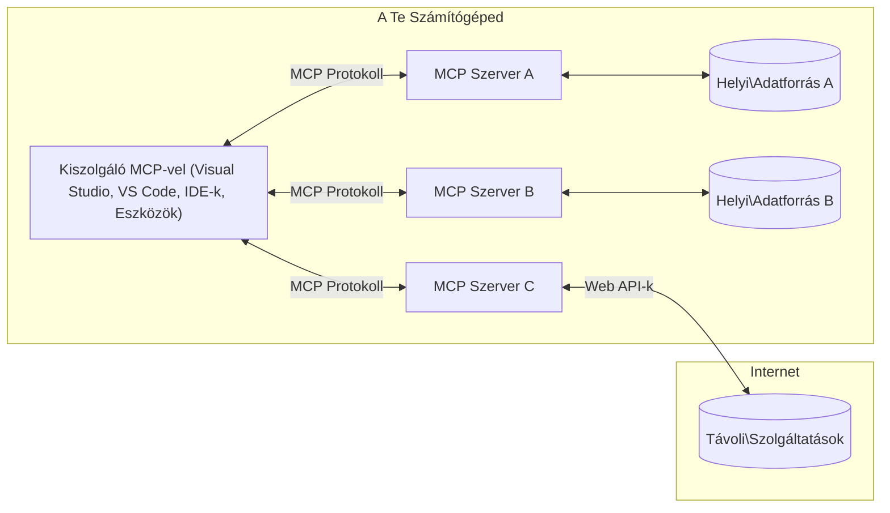

# MCP Alapfogalmak: A Model Context Protocol mesteri elsajátítása az AI integrációhoz

[](https://youtu.be/earDzWGtE84)

_(Kattints a fenti képre a leckevideó megtekintéséhez)_

A [Model Context Protocol (MCP)](https://github.com/modelcontextprotocol) egy hatékony, szabványosított keretrendszer, amely optimalizálja a kommunikációt a Nagyméretű Nyelvi Modellek (LLM-ek) és külső eszközök, alkalmazások, valamint adatforrások között. 
Ez az útmutató végigvezet az MCP alapfogalmain. Megismered az ügyfél-szerver architektúrát, az alapvető komponenseket, a kommunikációs mechanizmusokat és a megvalósítási legjobb gyakorlatokat.

- **Explicit felhasználói hozzájárulás**: Minden adat-hozzáférés és művelet előfeltétele az explicit felhasználói jóváhagyás. A felhasználónak világosan értenie kell, hogy milyen adatokhoz férnek hozzá és milyen műveletek hajtódnak végre, miközben részletes ellenőrzést kap a jogosultságok és engedélyek felett.

- **Adatvédelmi védelem**: A felhasználói adatokat csak explicit hozzájárulással teszik hozzáférhetővé, és az egész interakciós életciklus alatt robusztus hozzáférési korlátozásokkal kell védeni. A megvalósításoknak meg kell akadályozniuk az illetéktelen adatátvitelt és szigorú adatvédelmi határokat kell fenntartaniuk.

- **Eszközvégrehajtási biztonság**: Minden eszközhasználat explicit felhasználói engedélyhez kötött, ahol világosan érthető az eszköz működése, paraméterei és potenciális hatása. Robusztus biztonsági határok megakadályozzák a nem szándékolt, veszélyes vagy rosszindulatú eszközvégrehajtást.

- **Transzport réteg biztonság**: Minden kommunikációs csatornán megfelelő titkosítási és hitelesítési mechanizmusokat kell alkalmazni. A távoli kapcsolatok biztonságos transzport protokollokat és megfelelő hitelesítőkezelést használjanak.

#### Megvalósítási irányelvek:

- **Engedélykezelés**: Finomhangolt engedélyrendszerek megvalósítása, amelyek lehetővé teszik a felhasználók számára, hogy szabályozzák, mely szerverek, eszközök és erőforrások érhetők el
- **Hitelesítés és engedélyezés**: Biztonságos hitelesítési módszerek (OAuth, API kulcsok) használata megfelelő tokenkezeléssel és lejárati időkkel  
- **Bemeneti érvényesítés**: Az összes paraméter és adatbevitel érvényesítése meghatározott sémák szerint, hogy megelőzzék a befecskendezéses támadásokat
- **Audit naplózás**: Minden működés részletes naplózása biztonsági megfigyelés és megfelelőség érdekében

## Áttekintés

Ez a lecke bemutatja a Model Context Protocol (MCP) ökoszisztéma alapvető architektúráját és összetevőit. Megtanulod az ügyfél-szerver architektúrát, kulcselemeket és a kommunikációs mechanizmusokat, amelyek az MCP interakciók mögött állnak.

## Fő tanulási célok

A lecke végére képes leszel:

- Megérteni az MCP ügyfél-szerver architektúrát.
- Azonosítani a Házigazdák, Ügyfelek és Szerverek szerepét és felelősségeit.
- Elemezni az MCP rugalmasságát biztosító alapvető jellemzőket.
- Megérteni az információáramlást az MCP ökoszisztémán belül.
- Gyakorlati betekintést nyerni .NET, Java, Python és JavaScript példákon keresztül.

## MCP Architektúra: Mélyebb betekintés

Az MCP ökoszisztéma egy ügyfél-szerver modellen alapul. Ez a moduláris felépítés lehetővé teszi az AI alkalmazások számára az eszközökkel, adatbázisokkal, API-kkal és kontextuális erőforrásokkal való hatékony interakciót. Nézzük meg ezt az architektúrát alapvető összetevői mentén.

Az MCP alapja egy ügyfél-szerver architektúra, ahol egy host alkalmazás több szerverhez tud kapcsolódni:


- **MCP Házigazdák**: Olyan programok, mint VSCode, Claude Desktop, IDE-k vagy AI eszközök, amelyek MCP-n keresztül szeretnének adatokat elérni
- **MCP Ügyfelek**: Protokoll ügyfelek, amelyek 1:1 kapcsolatokat tartanak fenn a szerverekkel
- **MCP Szerverek**: Könnyűsúlyú programok, amelyek szabványos Model Context Protocol-en keresztül specifikus képességeket tesznek elérhetővé
- **Helyi Adatforrások**: A számítógéped fájljai, adatbázisai és szolgáltatásai, amelyekhez az MCP szerverek biztonságosan hozzáférhetnek
- **Távoli Szolgáltatások**: Külső rendszerek az interneten, amelyekhez az MCP szerverek API-kon keresztül tudnak kapcsolódni.

Az MCP Protokoll fejlődő szabvány, amely időalapú verziózást használ (ÉÉÉÉ-HH-NN formátum). A jelenlegi protokoll verzió a **2025-11-25**. A protokoll specifikáció [legfrissebb frissítéseit](https://modelcontextprotocol.io/specification/2025-11-25/) megtekintheted.

### 1. Házigazdák

A Model Context Protocol (MCP) esetében a **Házigazdák** azok az AI alkalmazások, amelyek a fő interfészt képezik a protokollal való felhasználói interakciókhoz. A házigazdák koordinálják és kezelik a több MCP szerverhez való kapcsolódást az adott szerverhez dedikált MCP ügyfelek létrehozásával. Házigazdák példái:

- **AI alkalmazások**: Claude Desktop, Visual Studio Code, Claude Code
- **Fejlesztői környezetek**: IDE-k és kódszerkesztők MCP integrációval  
- **Egyedi alkalmazások**: Célzott AI ügynökök és eszközök

A **Házigazdák** AI modell interakciókat koordináló alkalmazások. Ezek:

- **AI modellek irányítása**: LLM-ek futtatása vagy használata válaszgeneráláshoz és AI munkafolyamatok koordinációjához
- **Ügyfélkapcsolatok kezelése**: Minden MCP szerverkapcsolathoz egy-egy MCP ügyfél létrehozása és fenntartása
- **Felhasználói felület irányítása**: A beszélgetések kezelése, felhasználói interakciók és válaszok megjelenítése  
- **Biztonsági szabályok érvényesítése**: Jogosultságok, biztonsági korlátok és hitelesítés kezelése
- **Felhasználói hozzájárulás kezelése**: Adatmegosztás és eszközhasználat jóváhagyásának kezelése


### 2. Ügyfelek

Az **Ügyfelek** létfontosságú összetevők, amelyek dedikált egy-egy kapcsolatok fenntartásáért felelősek a Házigazdák és MCP szerverek között. Minden MCP ügyfelet a Házigazda hoz létre egy adott MCP szerverhez való kapcsolódáshoz, biztosítva a szervezett és biztonságos kommunikációs csatornákat. Több ügyfél lehetővé teszi, hogy a Házigazdák egyszerre több szerverhez csatlakozzanak.

Az **Ügyfelek** a házigazda alkalmazáson belüli kapcsolódó komponenst jelentenek. Ezek:

- **Protokoll kommunikáció**: JSON-RPC 2.0 kérések küldése a szervereknek promptokkal és utasításokkal
- **Képesség egyeztetés**: A támogatott funkciók és protokollverziók egyeztetése a szerverekkel inicializáláskor
- **Eszközvégrehajtás kezelése**: Eszközhasználati kérések kezelése modellektől, válaszok feldolgozása
- **Valós idejű frissítések**: Értesítések és valós idejű frissítések kezelése a szerverektől
- **Válasz feldolgozás**: A szerverválaszok feldolgozása és formázása a felhasználók felé való megjelenítéshez

### 3. Szerverek

A **Szerverek** olyan programok, amelyek kontextust, eszközöket és képességeket biztosítanak az MCP ügyfelek számára. Futtathatók lokálisan (ugyanazon a gépen, ahol a Házigazda van), vagy távolról (külső platformokon) és felelősek az ügyfél kérések kezeléséért és strukturált válaszadásért. A szerverek a szabványos Model Context Protocolon keresztül tesznek elérhetővé specifikus funkcionalitást.

A **Szerverek** olyan szolgáltatások, amelyek kontextust és képességeket nyújtanak. Ezek:

- **Funkció regisztráció**: Az elérhető primitívek (erőforrások, promptok, eszközök) regisztrálása és elérhetővé tétele az ügyfelek számára
- **Kérések feldolgozása**: Eszközhívások, erőforrás kérdések és prompt kérések fogadása és végrehajtása az ügyfelektől
- **Kontextus biztosítása**: Kontextuális információ és adat szolgáltatása a modell válaszok javításához
- **Állapotkezelés**: Munkamenet állapotának fenntartása és állapotfüggő interakciók kezelése, ha szükséges
- **Valós idejű értesítések**: Értesítések küldése a képességváltozásokról és frissítésekről a csatlakozott ügyfeleknek

A szervereket bárki fejlesztheti, hogy specializált funkcionalitással bővítse a modell képességeit, és támogatják a helyi és távoli telepítési forgatókönyveket is.

### 4. Szerver primitívek

Az Model Context Protocol (MCP) szerverei három alapvető **primitívet** biztosítanak, amelyek meghatározzák a kliens, házigazda és nyelvi modell közti gazdag interakciók fundamentális építőköveit. Ezek a primitívek specifikálják a protokollon keresztül elérhető kontextuális információk és műveletek típusait.

Az MCP szerverek az alábbi három alapvető primitív bármely kombinációját tehetik elérhetővé:

#### Erőforrások

Az **Erőforrások** olyan adatforrások, amelyek kontextuális információt szolgáltatnak AI alkalmazások számára. Statikus vagy dinamikus tartalmakat képviselnek, amelyek javítják a modell megértését és döntéshozatalát:

- **Kontextuális adatok**: Strukturált információ és kontextus AI modell fogyasztáshoz
- **Tudásbázisok**: Dokumentum tárak, cikkek, kézikönyvek és tudományos dolgozatok
- **Helyi adatforrások**: Fájlok, adatbázisok és helyi rendszerinformációk  
- **Külső adatok**: API válaszok, webszolgáltatások és távoli rendszeradatok
- **Dinamikus tartalom**: Valós idejű adatok, amelyek külső feltételek változására frissülnek

Az erőforrások URI-k alapján azonosíthatók és `resources/list` segítségével felfedezhetők, `resources/read` metódussal lekérdezhetők:

```text
file://documents/project-spec.md
database://production/users/schema
api://weather/current
```

#### Promptok

A **Promptok** újrahasznosítható sablonok, amelyek segítik a nyelvi modellekkel való interakciók struktúrálását. Szabványosított interakciós mintákat és sablonozott munkafolyamatokat biztosítanak:

- **Sablonalapú interakciók**: Előre strukturált üzenetek és beszélgetés indítók
- **Munkafolyamat sablonok**: Szabványosított lépések gyakori feladatokhoz és interakciókhoz
- **Few-shot példák**: Példákon alapuló utasítás sablonok modelleknek
- **Rendszer promptok**: Alapvető promptok, amelyek meghatározzák a modell viselkedését és kontextusát
- **Dinamikus sablonok**: Paraméterezett promptok, amelyek specifikus kontextusokhoz igazodnak

A promptok változóhelyettesítést támogatnak, `prompts/list` metódussal felfedezhetők és `prompts/get` hívással lekérdezhetők:

```markdown
Generate a {{task_type}} for {{product}} targeting {{audience}} with the following requirements: {{requirements}}
```

#### Eszközök

Az **Eszközök** végrehajtható funkciók, amelyeket az AI modellek hívhatnak meg specifikus műveletek végrehajtására. Ezek az MCP ökoszisztéma "igéi", amelyek lehetővé teszik modelleknek a külső rendszerekkel való interakciót:

- **Végrehajtható funkciók**: Elkülönült műveletek, amelyeket modellek adott paraméterekkel hívhatnak meg
- **Külső rendszer integráció**: API hívások, adatbázis lekérdezések, fájlműveletek, számítások
- **Egyedi azonosító**: Minden eszköznek egyedi neve, leírása és paramétersémája van
- **Strukturált I/O**: Az eszközök validált paramétereket fogadnak be és strukturált, típusos válaszokat adnak vissza
- **Műveleti képességek**: Lehetővé teszi a modelleknek valós világ műveletek végrehajtását és élő adatok lekérését

Az eszközök JSON Sémával vannak definiálva a paramétervalidáláshoz, felfedezhetők a `tools/list` végponton, és végrehajthatók a `tools/call` segítségével. Az eszközök tartalmazhatnak **ikonokat** is a jobb felhasználói megjelenítés érdekében.

**Eszköz annotációk**: Az eszközök támogatnak viselkedési annotációkat (pl. `readOnlyHint`, `destructiveHint`), amelyek leírják, hogy az adott eszköz csak olvasható vagy destruktív-e, segítve az ügyfeleket az eszköz végrehajtási döntések meghozatalában.

Példa eszköz definíció:

```typescript
server.tool(
  "search_products", 
  {
    query: z.string().describe("Search query for products"),
    category: z.string().optional().describe("Product category filter"),
    max_results: z.number().default(10).describe("Maximum results to return")
  }, 
  async (params) => {
    // Végrehajtja a keresést és visszaadja a strukturált eredményeket
    return await productService.search(params);
  }
);
```

## Ügyfél primitívek

Az Model Context Protocol (MCP) esetében az **ügyfelek** olyan primitíveket tehetnek elérhetővé, amelyek lehetővé teszik, hogy a szerverek további képességeket kérjenek a házigazda alkalmazástól. Ezek az ügyféloldali primitívek gazdagabb, interaktívabb szerver megvalósításokat tesznek lehetővé, amelyek hozzáférnek AI modell képességekhez és felhasználói interakciókhoz.

### Mintavételezés

A **Mintavételezés** lehetővé teszi a szerverek számára, hogy nyelvi modell kiegészítéseket kérjenek az ügyfél AI alkalmazásától. Ez a primitív lehetővé teszi, hogy a szerverek LLM képességekhez férjenek hozzá anélkül, hogy saját modell függőségeik lennének:

- **Modelltől független hozzáférés**: A szerverek kérhetnek kiegészítéseket anélkül, hogy LLM SDK-kat tartalmaznának vagy kezelnék a modell hozzáférést
- **Szerver által indított AI**: Lehetővé teszi a szerverek számára, hogy önállóan generáljanak tartalmat az ügyfél modelljével
- **Rekurzív LLM interakciók**: Támogat komplex forgatókönyveket, ahol a szerverek AI segítséget igényelnek a feldolgozáshoz
- **Dinamikus tartalom generálás**: A szerverek kontextuális válaszokat hozhatnak létre a házigazda modelljével
- **Eszközhívási támogatás**: A szerverek `tools` és `toolChoice` paramétereket is megadhatnak, hogy az ügyfél modell eszközöket hívhasson mintavételezés közben

A mintavételezés a `sampling/complete` metóduson keresztül történik, ahol a szerverek kiegészítési kérelmeket küldenek az ügyfeleknek.

### Gyökerek

A **Gyökerek** szabványos módszert biztosítanak az ügyfeleknek a fájlrendszer-határok szerverek felé való kitettségére, hogy a szerverek megértsék, mely könyvtárakhoz és fájlokhoz férnek hozzá:

- **Fájlrendszer határok**: Meghatározzák, hogy a szerverek mely helyeken működhetnek a fájlrendszerben
- **Hozzáférés szabályozás**: Segítenek a szervereknek megérteni, mely könyvtárakhoz és fájlokhoz van engedélyük
- **Dinamikus frissítések**: Az ügyfelek értesíthetik a szervereket, ha változik a gyökerek listája
- **URI alapú azonosítás**: A gyökerek `file://` URI-k segítségével azonosítják az elérhető könyvtárakat és fájlokat

A gyökerek a `roots/list` metódusan keresztül érhetők el, az ügyfelek `notifications/roots/list_changed` értesítést küldenek gyökérváltozás esetén.

### Kérés

Az **Kérés** lehetővé teszi a szerverek számára, hogy további információt vagy megerősítést kérjenek a felhasználóktól az ügyfél interfészen keresztül:

- **Felhasználói bemeneti kérések**: A szerverek kérhetnek további információkat, ha szükséges az eszközhasználathoz
- **Megerősítő párbeszédek**: Kérelmezhetik a felhasználói jóváhagyást érzékeny vagy kritikus műveletekhez
- **Interaktív munkafolyamatok**: Lehetővé teszi a szervereknek, hogy lépésről lépésre létező felhasználói interakciókat hozzanak létre
- **Dinamikus paramétergyűjtés**: Hiányzó vagy opcionális paraméterek összegyűjtése az eszköz végrehajtása közben

A kérések a `elicitation/request` metódussal történnek, felhasználói bemenet gyűjtésére az ügyfél interfészen.

**URL módú kérés**: A szerverek URL alapú felhasználói interakciókat is kérhetnek, amelyek lehetővé teszik, hogy a felhasználókat hitelesítés, megerősítés vagy adatbevitel céljából külső weboldalakra irányítsák.

### Naplózás

A **Naplózás** lehetővé teszi a szerverek számára, hogy strukturált naplóüzeneteket küldjenek az ügyfeleknek hibakeresés, megfigyelés és működési átláthatóság céljából:

- **Hibakeresési támogatás**: A szerverek részletes végrehajtási naplókat küldhetnek hibák elhárításához
- **Üzemeltetési megfigyelés**: Állapotfrissítéseket és teljesítménymutatókat továbbítanak az ügyfeleknek
- **Hibajelentés**: Részletes hibakontextust és diagnosztikai információkat szolgáltatnak
- **Audit nyomok**: Átfogó naplókat hoznak létre a szerver műveletekről és döntésekről

A naplóüzeneteket az ügyfelek felé küldik a szerver működésének átláthatósága és a hibakeresés megkönnyítése érdekében.

## Információáramlás az MCP-ben

A Model Context Protocol (MCP) meghatároz egy strukturált információáramlást a házigazdák, ügyfelek, szerverek és modellek között. Ennek az áramlásnak az ismerete segít megérteni, hogyan dolgozódnak fel a felhasználói kérések, és hogyan integrálódnak a külső eszközök és adatok a modell válaszaiba.
- **A host kezdeményezi a kapcsolatot**  
  A host alkalmazás (például egy IDE vagy chat felület) kapcsolatot létesít egy MCP szerverrel, általában STDIO, WebSocket vagy más támogatott protokollon keresztül.

- **Képességek egyeztetése**  
  Az ügyfél (ami a hostban van beágyazva) és a szerver információt cserél a támogatott funkcióikról, eszközeikről, forrásaikról és a protokoll verziókról. Ez biztosítja, hogy mindkét fél értse, milyen képességek állnak rendelkezésre az adott munkamenet során.

- **Felhasználói kérés**  
  A felhasználó interakcióba lép a hosttal (például beír egy parancsot vagy kérést). A host összegyűjti ezt a bemenetet, és továbbítja az ügyfélnek feldolgozásra.

- **Forrás vagy eszköz használata**  
  - Az ügyfél kérhet további kontextust vagy erőforrásokat a szervertől (például fájlokat, adatbázis-bejegyzéseket vagy tudásbázis cikkeket), hogy gazdagítsa a modell megértését.  
  - Ha a modell úgy dönt, hogy eszköz szükséges (például adat lekéréséhez, számítás elvégzéséhez vagy API híváshoz), az ügyfél eszköz meghívási kérelmet küld a szervernek, megadva az eszköz nevét és paramétereit.

- **Szerver végrehajtás**  
  A szerver megkapja az erőforrás- vagy eszközkérést, végrehajtja a szükséges műveleteket (például függvény futtatása, adatbázis lekérdezése vagy fájl lekérése), majd strukturált formátumban visszaküldi az eredményeket az ügyfélnek.

- **Válasz generálása**  
  Az ügyfél integrálja a szerver válaszait (erőforrásadatok, eszköz eredmények stb.) az aktuális modell interakcióba. A modell ezeket az információkat felhasználva generál egy átfogó és kontextusban releváns választ.

- **Eredmény megjelenítése**  
  A host megkapja az ügyféltől a végső kimenetet, és megjeleníti a felhasználónak, általában tartalmazva a modell által generált szöveget, valamint az eszközök végrehajtásából vagy forrás lekérdezésből származó eredményeket.

Ez a folyamat lehetővé teszi, hogy az MCP támogassa az előrehaladott, interaktív és kontextus-érzékeny AI alkalmazásokat azáltal, hogy zökkenőmentesen kapcsolja össze a modelleket külső eszközökkel és adatforrásokkal.

## Protokoll architektúra és rétegek

Az MCP két különálló architekturális rétegből áll, amelyek együttműködve nyújtanak teljes kommunikációs keretrendszert:

### Adat réteg

Az **Adat réteg** az MCP protokoll magját valósítja meg, alapja a **JSON-RPC 2.0**. Ez a réteg határozza meg az üzenetszerkezetet, szemantikát és interakciós mintákat:

#### Fő összetevők:

- **JSON-RPC 2.0 protokoll**: Az összes kommunikáció szabványosított JSON-RPC 2.0 üzenetformátumot használ metódushívásokhoz, válaszokhoz és értesítésekhez  
- **Életciklus-kezelés**: Kezeli a kapcsolat létrehozását, képességek egyeztetését és a munkamenet lezárását kliens és szerver között  
- **Szerver primitívek**: Lehetővé teszi, hogy a szerverek alapvető funkciókat nyújtsanak eszközök, erőforrások és promptok formájában  
- **Kliens primitívek**: Engedélyezi, hogy a szerverek kéréseket küldjenek LLM mintavételezésére, felhasználói bemenet kérésére és naplóüzenetek küldésére  
- **Valós idejű értesítések**: Támogatja az aszinkron értesítéseket dinamikus frissítésekhez lekérdezés nélkül

#### Kulcsjellemzők:

- **Protokoll verzió egyeztetés**: Dátumalapú verziókezelést (ÉÉÉÉ-HH-NN) használ a kompatibilitás biztosítására  
- **Képesség felfedezés**: A kliensek és szerverek egyeztetik a támogatott funkciókat inicializáláskor  
- **Állapotfüggő munkamenetek**: Kapcsolat állapotának megőrzése több interakción keresztül a kontextus folytonossága érdekében

### Szállítási réteg

A **Szállítási réteg** kezeli a kommunikációs csatornákat, üzenetkeretezést és az MCP résztvevők közti hitelesítést:

#### Támogatott szállítási mechanizmusok:

1. **STDIO szállítás**:  
   - Szabványos bemenet/kimeneten keresztüli közvetlen folyamatközi kommunikáció  
   - Kiváló helyi folyamatokhoz ugyanazon gépen belül hálózati overhead nélkül  
   - Gyakran használt helyi MCP szerver implementációkhoz

2. **Streamelhető HTTP szállítás**:  
   - HTTP POST használata kliens-szerver üzenetekhez  
   - Opcionális Server-Sent Events (SSE) szerver-kliens folyamatos adatátvitelhez  
   - Távoli szerverek közti hálózati kommunikáció engedélyezése  
   - Támogatja a szabványos HTTP hitelesítést (bearer tokenek, API kulcsok, egyedi fejlécek)  
   - Az MCP az OAuth használatát javasolja biztonságos token-alapú hitelesítéshez

#### Szállítási absztrakció:

A szállítási réteg elvonja a kommunikáció részleteit az adat rétegtől, lehetővé téve, hogy ugyanaz a JSON-RPC 2.0 üzenetformátum működjön minden szállítási mechanizmuson keresztül. Ez az absztrakció zökkenőmentes váltást tesz lehetővé helyi és távoli szerverek között.

### Biztonsági megfontolások

Az MCP implementációknak több kritikus biztonsági elvet kell követniük a protokollműveletek biztonságos, megbízható és biztonságos végrehajtása érdekében:

- **Felhasználói hozzájárulás és irányítás**: A felhasználónak explicit hozzájárulást kell adnia, mielőtt adatokat érnének el vagy műveleteket végeznének. Világos irányítást kell kapniuk arról, hogy milyen adatokat osztanak meg és mely műveletek engedélyezettek, támogatva intuitív felhasználói felületekkel a tevékenységek áttekinhetősége és jóváhagyása érdekében.

- **Adatvédelem**: A felhasználói adatokat csak explicit hozzájárulással szabad megosztani, és megfelelő hozzáférés-vezérléssel kell védeni. Az MCP implementációknak meg kell akadályozniuk az illetéktelen adatátvitelt, és biztosítaniuk kell az adatvédelem fenntartását minden interakció során.

- **Eszközbiztonság**: Mielőtt bármilyen eszközt meghívnának, explicit felhasználói hozzájárulás szükséges. A felhasználóknak világos képük kell, hogy legyen az eszközök funkcióiról, és szigorú biztonsági határokat kell alkalmazni nem kívánt vagy veszélyes végrehajtások megakadályozására.

Ezeknek a biztonsági elveknek a betartásával az MCP garantálja a felhasználói bizalmat, adatvédelmet és biztonságot a protokollműveletek során miközben lehetővé teszi az erős AI integrációkat.

## Kód példák: Kulcsösszetevők

Az alábbiakban több népszerű programozási nyelven mutatunk be kódpéldákat, amelyek illusztrálják, hogyan lehet implementálni az MCP szerver kulcsfontosságú összetevőit és eszközeit.

### .NET példa: Egyszerű MCP szerver létrehozása eszközökkel

Íme egy gyakorlati .NET kód példa, amely bemutatja, hogyan lehet egyszerű MCP szervert létrehozni egyedi eszközökkel. A példa szemlélteti, hogyan definiálhatók és regisztrálhatók eszközök, hogyan kezelődik a kérések és hogyan kapcsolódik a szerver a Model Context Protokol segítségével.

```csharp
using System;
using System.Threading.Tasks;
using ModelContextProtocol.Server;
using ModelContextProtocol.Server.Transport;
using ModelContextProtocol.Server.Tools;

public class WeatherServer
{
    public static async Task Main(string[] args)
    {
        // Create an MCP server
        var server = new McpServer(
            name: "Weather MCP Server",
            version: "1.0.0"
        );
        
        // Register our custom weather tool
        server.AddTool<string, WeatherData>("weatherTool", 
            description: "Gets current weather for a location",
            execute: async (location) => {
                // Call weather API (simplified)
                var weatherData = await GetWeatherDataAsync(location);
                return weatherData;
            });
        
        // Connect the server using stdio transport
        var transport = new StdioServerTransport();
        await server.ConnectAsync(transport);
        
        Console.WriteLine("Weather MCP Server started");
        
        // Keep the server running until process is terminated
        await Task.Delay(-1);
    }
    
    private static async Task<WeatherData> GetWeatherDataAsync(string location)
    {
        // This would normally call a weather API
        // Simplified for demonstration
        await Task.Delay(100); // Simulate API call
        return new WeatherData { 
            Temperature = 72.5,
            Conditions = "Sunny",
            Location = location
        };
    }
}

public class WeatherData
{
    public double Temperature { get; set; }
    public string Conditions { get; set; }
    public string Location { get; set; }
}
```

### Java példa: MCP szerver összetevők

Ez a példa ugyanazt az MCP szervert és eszköz regisztrációt mutatja be, mint a fenti .NET példa, de Java nyelven megvalósítva.

```java
import io.modelcontextprotocol.server.McpServer;
import io.modelcontextprotocol.server.McpToolDefinition;
import io.modelcontextprotocol.server.transport.StdioServerTransport;
import io.modelcontextprotocol.server.tool.ToolExecutionContext;
import io.modelcontextprotocol.server.tool.ToolResponse;

public class WeatherMcpServer {
    public static void main(String[] args) throws Exception {
        // Hozzon létre egy MCP szervert
        McpServer server = McpServer.builder()
            .name("Weather MCP Server")
            .version("1.0.0")
            .build();
            
        // Regisztráljon egy időjárás eszközt
        server.registerTool(McpToolDefinition.builder("weatherTool")
            .description("Gets current weather for a location")
            .parameter("location", String.class)
            .execute((ToolExecutionContext ctx) -> {
                String location = ctx.getParameter("location", String.class);
                
                // Szerezzen időjárás adatokat (egyszerűsítve)
                WeatherData data = getWeatherData(location);
                
                // Adjon vissza formázott választ
                return ToolResponse.content(
                    String.format("Temperature: %.1f°F, Conditions: %s, Location: %s", 
                    data.getTemperature(), 
                    data.getConditions(), 
                    data.getLocation())
                );
            })
            .build());
        
        // Csatlakoztassa a szervert stdio szállításon keresztül
        try (StdioServerTransport transport = new StdioServerTransport()) {
            server.connect(transport);
            System.out.println("Weather MCP Server started");
            // Tartsa futva a szervert, amíg a folyamat be nem fejeződik
            Thread.currentThread().join();
        }
    }
    
    private static WeatherData getWeatherData(String location) {
        // A megvalósítás egy időjárás API-t hívna meg
        // Egyszerűsített a példa kedvéért
        return new WeatherData(72.5, "Sunny", location);
    }
}

class WeatherData {
    private double temperature;
    private String conditions;
    private String location;
    
    public WeatherData(double temperature, String conditions, String location) {
        this.temperature = temperature;
        this.conditions = conditions;
        this.location = location;
    }
    
    public double getTemperature() {
        return temperature;
    }
    
    public String getConditions() {
        return conditions;
    }
    
    public String getLocation() {
        return location;
    }
}
```

### Python példa: MCP szerver építése

Ez a példa a fastmcp-t használja, kérjük, először telepítse azt:

```python
pip install fastmcp
```
Kódminták:

```python
#!/usr/bin/env python3
import asyncio
from fastmcp import FastMCP
from fastmcp.transports.stdio import serve_stdio

# Hozzon létre egy FastMCP szervert
mcp = FastMCP(
    name="Weather MCP Server",
    version="1.0.0"
)

@mcp.tool()
def get_weather(location: str) -> dict:
    """Gets current weather for a location."""
    return {
        "temperature": 72.5,
        "conditions": "Sunny",
        "location": location
    }

# Alternatív megközelítés osztály használatával
class WeatherTools:
    @mcp.tool()
    def forecast(self, location: str, days: int = 1) -> dict:
        """Gets weather forecast for a location for the specified number of days."""
        return {
            "location": location,
            "forecast": [
                {"day": i+1, "temperature": 70 + i, "conditions": "Partly Cloudy"}
                for i in range(days)
            ]
        }

# Regisztrálja az osztály eszközöket
weather_tools = WeatherTools()

# Indítsa el a szervert
if __name__ == "__main__":
    asyncio.run(serve_stdio(mcp))
```

### JavaScript példa: MCP szerver létrehozása

Ez a példa bemutatja az MCP szerver létrehozását JavaScriptben, és két időjárással kapcsolatos eszköz regisztrálását.

```javascript
// Az hivatalos Model Context Protocol SDK használata
import { McpServer } from "@modelcontextprotocol/sdk/server/mcp.js";
import { StdioServerTransport } from "@modelcontextprotocol/sdk/server/stdio.js";
import { z } from "zod"; // A paraméterek érvényesítéséhez

// MCP szerver létrehozása
const server = new McpServer({
  name: "Weather MCP Server",
  version: "1.0.0"
});

// Időjárás eszköz definiálása
server.tool(
  "weatherTool",
  {
    location: z.string().describe("The location to get weather for")
  },
  async ({ location }) => {
    // Ez normál esetben egy időjárás API-t hívna meg
    // Egyszerűsítve bemutató céljából
    const weatherData = await getWeatherData(location);
    
    return {
      content: [
        { 
          type: "text", 
          text: `Temperature: ${weatherData.temperature}°F, Conditions: ${weatherData.conditions}, Location: ${weatherData.location}` 
        }
      ]
    };
  }
);

// Előrejelző eszköz definiálása
server.tool(
  "forecastTool",
  {
    location: z.string(),
    days: z.number().default(3).describe("Number of days for forecast")
  },
  async ({ location, days }) => {
    // Ez normál esetben egy időjárás API-t hívna meg
    // Egyszerűsítve bemutató céljából
    const forecast = await getForecastData(location, days);
    
    return {
      content: [
        { 
          type: "text", 
          text: `${days}-day forecast for ${location}: ${JSON.stringify(forecast)}` 
        }
      ]
    };
  }
);

// Segédfüggvények
async function getWeatherData(location) {
  // API hívás szimulálása
  return {
    temperature: 72.5,
    conditions: "Sunny",
    location: location
  };
}

async function getForecastData(location, days) {
  // API hívás szimulálása
  return Array.from({ length: days }, (_, i) => ({
    day: i + 1,
    temperature: 70 + Math.floor(Math.random() * 10),
    conditions: i % 2 === 0 ? "Sunny" : "Partly Cloudy"
  }));
}

// A szerver csatlakoztatása stdio transzporttal
const transport = new StdioServerTransport();
server.connect(transport).catch(console.error);

console.log("Weather MCP Server started");
```

Ez a JavaScript példa megmutatja, hogyan lehet MCP szervert létrehozni a Model Context Protocol SDK használatával. Bemutatja, hogyan lehet regisztrálni két, `weatherTool` és `forecastTool` nevű eszközt, és hogyan lehet ezeket elérhetővé tenni MCP ügyfelek számára a `StdioServerTransport` segítségével.

## Biztonság és jogosultságkezelés

Az MCP tartalmaz több beépített koncepciót és mechanizmust a biztonság és jogosultságkezelés kezelésére a protokoll egészében:

1. **Eszköz engedélyezés kezelése**:  
  A kliensek megadhatják, hogy egy modell mely eszközöket használhat egy munkamenet alatt. Ez biztosítja, hogy csak explicit engedélyezett eszközök legyenek elérhetőek, csökkentve a nem szándékos vagy nem biztonságos műveletek kockázatát. Az engedélyeket dinamikusan lehet konfigurálni felhasználói beállítások, szervezeti szabályzatok vagy az interakció kontextusa alapján.

2. **Hitelesítés**:  
  A szerverek megkövetelhetik a hitelesítést, mielőtt hozzáférést adnának eszközökhöz, erőforrásokhoz vagy érzékeny műveletekhez. Ez magában foglalhat API kulcsokat, OAuth tokeneket vagy más hitelesítési rendszereket. A megfelelő hitelesítés biztosítja, hogy csak megbízható kliensek és felhasználók hívhassák meg a szerver oldali képességeket.

3. **Érvényesítés**:  
  Minden eszköz hívás paramétereit érvényesíteni kell. Minden eszköz definiálja a paramétereinek várt típusait, formátumait és korlátait, a szerver pedig ezt figyelmeztetően ellenőrzi. Ez megakadályozza a hibás vagy rosszindulatú inputok eljutását az eszköz megvalósításokhoz, elősegítve a műveletek integritását.

4. **Korlátozás (rate limiting)**:  
  Az MCP szerverek képesek korlátozni az eszközhasználatot és az erőforrások elérését visszaélések megelőzése és erőforrások igazságos használata érdekében. A korlátozások alkalmazhatók felhasználó, munkamenet vagy globális szinten, és segítenek védeni a szolgáltatás megtagadásos támadásokkal és túlzott erőforrás-felhasználással szemben.

Ezeknek a mechanizmusoknak a kombinálásával az MCP biztonságos alapot nyújt a nyelvi modellek integrálásához külső eszközökkel és adatforrásokkal, miközben részletes kontrollt biztosít a felhasználók és fejlesztők számára a hozzáférés és használat felett.

## Protokoll üzenetek és kommunikációs folyamat

Az MCP kommunikáció strukturált **JSON-RPC 2.0** üzeneteket használ a világos és megbízható interakciók biztosítására a hostok, kliensek és szerverek között. A protokoll külön üzenetmintákat definiál különböző típusú műveletekhez:

### Alapvető üzenettípusok:

#### **Inicializációs üzenetek**
- **`initialize` kérés**: Kapcsolat létesítése és a protokoll verzió, képességek egyeztetése  
- **`initialize` válasz**: Megerősíti a támogatott funkciókat és szerver információkat  
- **`notifications/initialized`**: Jelzi, hogy az inicializáció befejeződött és a munkamenet készen áll

#### **Felfedező üzenetek**
- **`tools/list` kérés**: Elérhető eszközök felfedezése a szerveren  
- **`resources/list` kérés**: Elérhető erőforrások (adatforrások) listázása  
- **`prompts/list` kérés**: Elérhető prompt sablonok lekérése

#### **Végrehajtási üzenetek**  
- **`tools/call` kérés**: Egy adott eszköz végrehajtása megadott paraméterekkel  
- **`resources/read` kérés**: Egy adott erőforrás tartalmának lekérése  
- **`prompts/get` kérés**: Prompt sablon lekérése opcionális paraméterekkel

#### **Kliens-oldali üzenetek**
- **`sampling/complete` kérés**: A szerver kéri az LLM kitöltést az ügyféltől  
- **`elicitation/request`**: A szerver felhasználói bemenetet kér az ügyfél felületén keresztül  
- **Naplózási üzenetek**: A szerver strukturált naplóüzeneteket küld az ügyfélnek

#### **Értesítési üzenetek**
- **`notifications/tools/list_changed`**: A szerver értesíti a klienst az eszközök változásáról  
- **`notifications/resources/list_changed`**: A szerver értesíti a klienst az erőforrások változásáról  
- **`notifications/prompts/list_changed`**: A szerver értesíti a klienst a promptok változásáról

### Üzenet szerkezete:

Minden MCP üzenet a JSON-RPC 2.0 formátumot követi:  
- **Kérés üzenetek**: tartalmazzák az `id`-t, `method`-ot, és opcionálisan `params`-t  
- **Válasz üzenetek**: tartalmazzák az `id`-t és vagy `result`-ot vagy `error`-t  
- **Értesítési üzenetek**: tartalmazzák a `method`-ot és opcionálisan `params`-t (nem tartalmaz `id`-t, válasz nem várható)

Ez a strukturált kommunikáció megbízható, nyomon követhető és kiterjeszthető interakciókat biztosít, támogatva előrehaladott forgatókönyveket, mint például valós idejű frissítések, eszköz láncolás és robosztus hibakezelés.

### Feladatok (kísérleti)

A **Feladatok** egy kísérleti funkció, amely tartós végrehajtási csomagokat nyújt, lehetővé téve a késleltetett eredmény lekérést és állapotkövetést MCP kérések esetén:

- **Hosszú lefutású műveletek**: drága számítások, munkafolyamat automatizálás és kötegelt feldolgozás nyomon követése  
- **Késleltetett eredmények**: lekérdezhető a feladat állapota és az eredmények elérhetővé válnak a művelet befejeződésekor  
- **Állapotkövetés**: a feladat előrehaladásának figyelése meghatározott életciklus állapotokon keresztül  
- **Többlépcsős műveletek**: komplex munkafolyamatok támogatása, amelyek több interakciót foglalnak magukban

A feladatok becsomagolják a szabványos MCP kéréseket, lehetővé téve az aszinkron végrehajtási mintákat azoknál a műveleteknél, amelyek azonnal nem fejeződnek be.

## Főbb tanulságok

- **Architektúra**: Az MCP kliens-szerver architektúrát használ, ahol a hostok több kliens kapcsolatot kezelnek szerverekhez  
- **Résztvevők**: Az ökoszisztéma tartalmaz hostokat (AI alkalmazások), kliens csatlakozókat és szerver kapacitás szolgáltatókat  
- **Szállítási mechanizmusok**: Kommunikáció támogatja a STDIO-t (helyi) és a streamelhető HTTP-t opcionális SSE-vel (távoli)  
- **Alapvető primitívek**: A szerverek expozíciója eszközök (végrehajtható függvények), erőforrások (adatforrások) és promptok (sablonok) formájában  
- **Kliens primitívek**: A szerverek kérhetnek mintavételezést (LLM kitöltések eszköz hívás támogatással), bemenet kérését (felhasználói input URL móddal), gyökereket (fájlrendszerhatárok) és naplózást az ügyfelektől  
- **Kísérleti funkciók**: Feladatok tartós végrehajtási csomagokat nyújtanak hosszú futású műveletekhez  
- **Protokoll alapja**: A JSON-RPC 2.0 alapú, dátumalapú verziókezeléssel (aktuális: 2025-11-25)  
- **Valós idejű képességek**: Támogatja az értesítéseket dinamikus frissítésekhez és valós idejű szinkronizációhoz  
- **Biztonság előtérben**: Explicit felhasználói hozzájárulás, adatvédelem, és biztonságos szállítás alapfeltételek

## Gyakorlat

Tervezzen egy egyszerű MCP eszközt, amely hasznos lehet az Ön területén. Határozza meg:  
1. Mi lenne az eszköz neve  
2. Milyen paramétereket fogadna el  
3. Milyen kimenetet adna vissza  
4. Hogyan használhatná a modell ezt az eszközt a felhasználói problémák megoldására

---

## Mi következik

Következő: [2. fejezet: Biztonság](../02-Security/README.md)

---

<!-- CO-OP TRANSLATOR DISCLAIMER START -->
**Jogi nyilatkozat**:
Ez a dokumentum az AI fordító szolgáltatás [Co-op Translator](https://github.com/Azure/co-op-translator) használatával készült. Bár igyekszünk a pontosságra, kérjük, vegye figyelembe, hogy az automatikus fordítások hibákat vagy pontatlanságokat tartalmazhatnak. Az eredeti dokumentum az anyanyelvén tekintendő hivatalos forrásnak. Kritikus információk esetén professzionális emberi fordítást javaslunk. Nem vállalunk felelősséget a fordítás használatából eredő félreértések vagy értelmezési hibák miatt.
<!-- CO-OP TRANSLATOR DISCLAIMER END -->