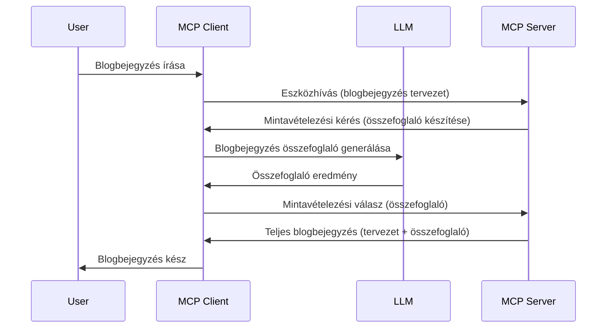

# Mintavételezés - képességek delegálása az ügyfélnek

Néha szükség van arra, hogy az MCP kliens és az MCP szerver együttműködjenek egy közös cél elérése érdekében. Előfordulhat, hogy a szerver egy olyan LLM segítségére támaszkodik, amely az ügyfélnél található. Ilyen helyzetben a mintavételezést kell használnod.

Nézzünk meg néhány használati esetet és azt, hogy miként építhetünk megoldást mintavételezés alkalmazásával.

## Áttekintés

Ebben a leckében arra fókuszálunk, hogy mikor és hol érdemes használni a mintavételezést, illetve hogyan kell konfigurálni azt.

## Tanulási célok

Ebben a fejezetben:

- Elmagyarázzuk, mi az a mintavételezés, és mikor használjuk.
- Bemutatjuk, hogyan kell az MCP-ben konfigurálni a mintavételezést.
- Példákat adunk a mintavételezés használatára.

## Mi az a mintavételezés és miért használjuk?

A mintavételezés egy fejlett funkció, amely a következőképpen működik:



### Mintavételezési kérés

Oké, most, hogy van egy nagy rálátásunk egy valós helyzetre, beszéljünk a szerver által az ügyfélnek küldött mintavételezési kérésről. Íme, hogyan nézhet ki egy ilyen kérés JSON-RPC formátumban:

```json
{
  "jsonrpc": "2.0",
  "id": 1,
  "method": "sampling/createMessage",
  "params": {
    "messages": [
      {
        "role": "user",
        "content": {
          "type": "text",
          "text": "Create a blog post summary of the following blog post: <BLOG POST>"
        }
      }
    ],
    "modelPreferences": {
      "hints": [
        {
          "name": "claude-3-sonnet"
        }
      ],
      "intelligencePriority": 0.8,
      "speedPriority": 0.5
    },
    "systemPrompt": "You are a helpful assistant.",
    "maxTokens": 100
  }
}
```

Itt néhány dologra érdemes felhívni a figyelmet:

- A Prompt, a content -> text alatt, az a prompt, ami egy utasítás az LLM-nek, hogy összefoglalja egy blogbejegyzés tartalmát.

- **modelPreferences**. Ez a rész valóban egy ajánlás, egy javaslat, hogy milyen konfigurációt használjunk az LLM-mel. A felhasználó eldöntheti, hogy követi-e ezeket az ajánlásokat, vagy megváltoztatja őket. Ebben az esetben ajánlások vannak a használandó modellről, valamint a sebesség és intelligencia prioritásáról.
- **systemPrompt**, ez a normál rendszer promptod, ami személyiséget ad az LLM-ednek és tartalmaz útmutató utasításokat.
- **maxTokens**, ez egy másik tulajdonság, ami megadja, hogy hány token használata ajánlott ehhez a feladathoz.

### Mintavételezési válasz

Ez a válasz az, amit az MCP kliens visszaküld az MCP szervernek, és az eredmény, amely az LLM hívásának eredményeként jön létre, megvárja a választ, majd felépíti ezt az üzenetet. Íme, hogyan nézhet ki JSON-RPC formátumban:

```json
{
  "jsonrpc": "2.0",
  "id": 1,
  "result": {
    "role": "assistant",
    "content": {
      "type": "text",
      "text": "Here's your abstract <ABSTRACT>"
    },
    "model": "gpt-5",
    "stopReason": "endTurn"
  }
}
```

Észreveheted, hogy a válasz egy kivonat a blogbejegyzésből, ahogyan kértük. Illetve arra is figyelj, hogy a használt `model` nem az, amit kértünk, hanem a "gpt-5" a "claude-3-sonnet" helyett. Ez azt mutatja, hogy a felhasználó megváltoztathatja, mit szeretne használni, és hogy a mintavételezési kérés csak egy ajánlás.

Oké, most, hogy értjük az alapfolyamatot, és egy hasznos feladatot rá, mint a "blogbejegyzés létrehozása + kivonat", nézzük meg, mit kell tennünk a működés érdekében.

### Üzenettípusok

A mintavételezési üzenetek nem csak szövegre korlátozódnak, hanem képeket és hanganyagot is küldhetsz. Íme, hogyan néz ki a JSON-RPC eltérő esetben:

**Szöveg**

```json
{
  "type": "text",
  "text": "The message content"
}
```

**Kép tartalom**

```json
{
  "type": "image",
  "data": "base64-encoded-image-data",
  "mimeType": "image/jpeg"
}
```

**Hang tartalom**

```json
{
  "type": "audio",
  "data": "base64-encoded-audio-data",
  "mimeType": "audio/wav"
}
```

> MEGJEGYZÉS: részletesebb információkért a mintavételezésről, nézd meg a [hivatalos dokumentációt](https://modelcontextprotocol.io/specification/2025-11-25/client/sampling)

## Hogyan konfiguráljuk a mintavételezést az ügyfélben

> Megjegyzés: ha csak szervert építesz, nem kell sokat tenned itt.

Egy ügyfélben a következőképpen kell megadni a funkciót:

```json
{
  "capabilities": {
    "sampling": {}
  }
}
```

Ezt követően a választott kliens kiválasztáskor és a szerverhez való csatlakozáskor ez fel lesz véve.

## Példa a mintavételezés használatára - Blogbejegyzés létrehozása

Kódoljunk együtt egy mintavételezési szervert, a következő lépéseket kell végrehajtanunk:

1. Hozz létre egy eszközt a szerveren.
1. Az eszköz hozzon létre egy mintavételezési kérést.
1. Az eszköz várjon az ügyfél mintavételezési kérésének megválaszolására.
1. Ezután az eszköz eredménye elkészül.

Nézzük lépésről lépésre a kódot:

### -1- Az eszköz létrehozása

**python**

```python
@mcp.tool()
async def create_blog(title: str, content: str, ctx: Context[ServerSession, None]) -> str:
    """Create a blog post and generate a summary"""

```

### -2- Mintavételezési kérés létrehozása

Bővítsd az eszközt a következő kóddal:

**python**

```python
post = BlogPost(
        id=len(posts) + 1,
        title=title,
        content=content,
        abstract=""
    )

prompt = f"Create an abstract of the following blog post: title: {title} and draft: {content} "

result = await ctx.session.create_message(
        messages=[
            SamplingMessage(
                role="user",
                content=TextContent(type="text", text=prompt),
            )
        ],
        max_tokens=100,
)

```

### -3- Várakozás a válaszra és válasz visszaadása

**python**

```python
post.abstract = result.content.text

posts.append(post)

# a teljes termék visszaadása
return json.dumps({
    "id": post.title,
    "abstract": post.abstract
})
```

### -4- Teljes kód

**python**

```python
from starlette.applications import Starlette
from starlette.routing import Mount, Host

from mcp.server.fastmcp import Context, FastMCP

from mcp.server.session import ServerSession
from mcp.types import SamplingMessage, TextContent

import json


from uuid import uuid4
from typing import List
from pydantic import BaseModel


mcp = FastMCP("Blog post generator")

# app = FastAPI()

posts = []

class BlogPost(BaseModel):
    id: int
    title: str
    content: str
    abstract: str

posts: List[BlogPost] = []

@mcp.tool()
async def create_blog(title: str, content: str, ctx: Context[ServerSession, None]) -> str:
    """Create a blog post and generate a summary"""

    post = BlogPost(
        id=len(posts) + 1,
        title=title,
        content=content,
        abstract=""
    )

    prompt = f"Create an abstract of the following blog post: title: {title} and draft: {content} "

    result = await ctx.session.create_message(
        messages=[
            SamplingMessage(
                role="user",
                content=TextContent(type="text", text=prompt),
            )
        ],
        max_tokens=100,
    )

    post.abstract = result.content.text

    posts.append(post)

    # adja vissza a teljes blogbejegyzést
    return json.dumps({
        "id": post.title,
        "abstract": post.abstract
    })

if __name__ == "__main__":
    print("Starting server...")
    # mcp.run()
    mcp.run(transport="streamable-http")

# futtassa az appot ezzel: python server.py
```

### -5- Tesztelés Visual Studio Code-ban

A Visual Studio Code-ban való teszteléshez kövesd a következő lépéseket:

1. Indítsd el a szervert a terminálban
1. Add hozzá a *mcp.json*-hoz (és ellenőrizd, hogy elindult), például így:

   ```json
   "servers": {
      "blog-server": {
        "type": "http",
        "url": "http://localhost:8000/mcp"
      }
   }
   ```

1. Írj be egy promptot:

   ```text
   create a blog post named "Where Python comes from", the content is "Python is actually named after Monty Python Flying Circus"
   ```

1. Engedélyezd a mintavételezést. Először, amikor kipróbálod, egy további párbeszédablak jelenik meg, amit el kell fogadnod, majd meglátod a szokásos párbeszédet, amely eszköz futtatását kéri.

1. Ellenőrizd az eredményeket. Az eredményeket szépen megjelenítve látod a GitHub Copilot Chatben, de a nyers JSON válasz is megvizsgálható.

**Bónusz**. A Visual Studio Code eszköztára kiváló támogatást nyújt a mintavételezéshez. Az alábbi módon konfigurálhatod a mintavételezés hozzáférést az installált szervereden:

1. Navigálj a bővítmény szekcióhoz.
1. Válaszd ki az installált szerverhez tartozó fogaskerék ikont az "MCP SERVERS - INSTALLED" szekcióban.
1 Válaszd a "Modell hozzáférés konfigurálása" opciót, itt kiválaszthatod, mely modellek használhatók a GitHub Copilot számára mintavételezés közben. Láthatod továbbá az összes utóbbi mintavételezési kérést a "Mintavételezési kérések megjelenítése" gombra kattintva.

## Feladat

Ebben a feladatban egy kissé eltérő mintavételezést építesz, nevezetesen egy mintavételezési integrációt, amely támogatja egy termékleírás generálását. Íme a forgatókönyved:

**Forgatókönyv**: Az e-kereskedelmi back office dolgozójának segítség kell, mert túl sok időt vesz igénybe termékleírásokat generálni. Ezért egy olyan megoldást kell építened, ahol egy "create_product" nevű eszközt hívsz meg "title" és "keywords" paraméterekkel, és amelynek eredménye egy teljes termék, beleértve egy "description" mezőt, amit az ügyfél LLM-je tölt ki.

TIPP: Használd, amit korábban tanultál, hogy összeállítsd ezt a szervert és eszközét mintavételezési kérés segítségével.

## Megoldás

[Megoldás](./solution/README.md)

## Főbb tanulságok

A mintavételezés egy erőteljes funkció, amely lehetővé teszi a szerver számára, hogy feladatokat delegáljon az ügyfélnek, amikor LLM segítségére van szüksége.

## Mi következik

- [4. fejezet - Gyakorlati megvalósítás](../../04-PracticalImplementation/README.md)

---

<!-- CO-OP TRANSLATOR DISCLAIMER START -->
**Jogi nyilatkozat**:
Ez a dokumentum az AI fordítási szolgáltatás, a [Co-op Translator](https://github.com/Azure/co-op-translator) segítségével készült. Bár az pontosságra törekszünk, kérjük, vegye figyelembe, hogy az automatikus fordítások hibákat vagy pontatlanságokat tartalmazhatnak. Az eredeti dokumentum az anyanyelvén tekintendő hiteles forrásnak. Fontos információk esetén professzionális emberi fordítást javasolunk. Nem vállalunk felelősséget semmilyen félreértésért vagy téves értelmezésért, amely ebből a fordításból ered.
<!-- CO-OP TRANSLATOR DISCLAIMER END -->