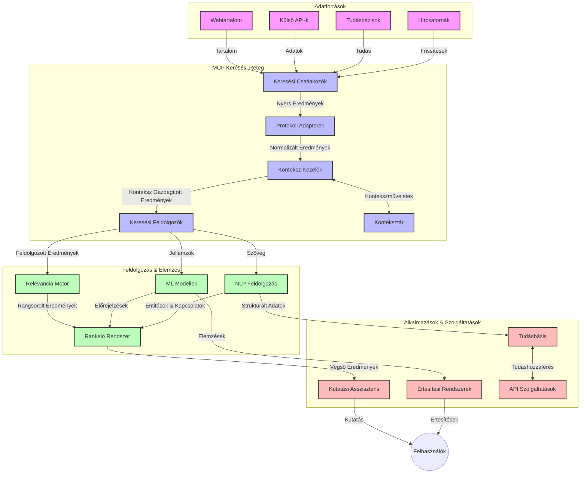
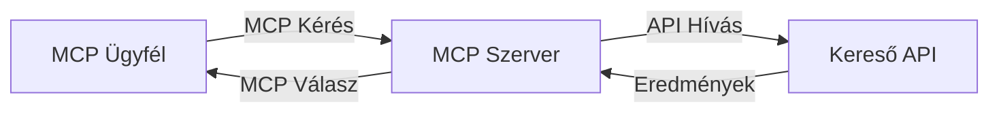
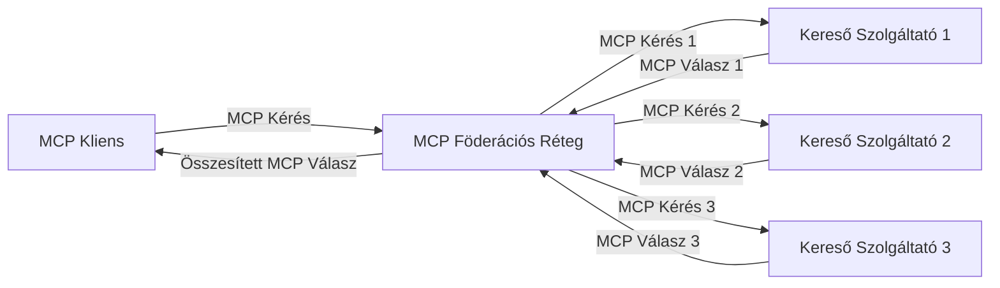
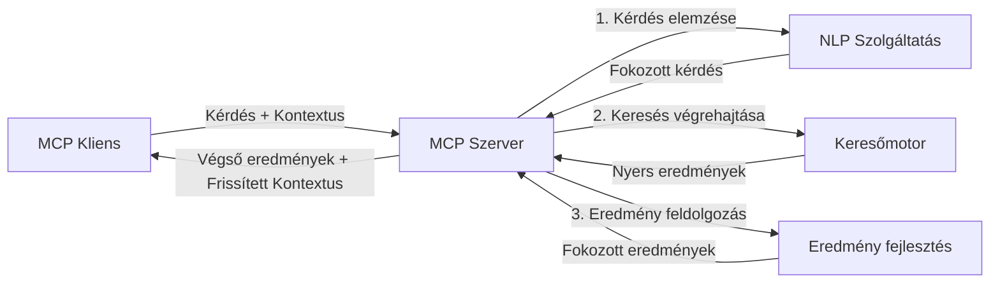

# Modell Kontextus Protokoll valós idejű webes kereséshez

## Áttekintés

A valós idejű webes keresés elengedhetetlenné vált a mai információközpontú környezetben, ahol az alkalmazásoknak azonnali hozzáférésre van szükségük a naprakész információkhoz az interneten annak érdekében, hogy releváns és időben megfelelő válaszokat nyújtsanak. A Modell Kontextus Protokoll (MCP) jelentős előrelépést képvisel ezeknek a valós idejű keresési folyamatoknak az optimalizálásában, növelve a keresés hatékonyságát, megőrizve a kontextuális integritást és javítva az egész rendszer teljesítményét.

Ez a modul azt vizsgálja, hogyan alakítja át az MCP a valós idejű webes keresést azáltal, hogy szabványosított megközelítést biztosít a kontextuskezeléshez az AI modellek, keresőmotorok és alkalmazások között.

### Amit megtanulsz

Ebben az átfogó útmutatóban megismerheted:

- Hogyan teremt az MCP zökkenőmentes hidat az AI modellek és a valós idejű webes keresési képességek között
- Architektúrális mintákat hatékony és skálázható keresési megoldások megvalósításához MCP-vel
- Technikákat a keresési kontextus megőrzésére több lekérdezés és interakció során
- Gyakorlati kódmegvalósításokat Pythonban és JavaScriptben különféle keresési helyzetekre
- Módszereket a relevancia, frissesség és teljesítmény egyensúlyának megteremtéséhez MCP-vezérelt keresési rendszerekben

## Bevezetés a valós idejű webes keresésbe

A valós idejű webes keresés egy technológiai megközelítés, amely lehetővé teszi az internetes adatfolyam folyamatos lekérdezését, feldolgozását és elemzését, ahogy azok megjelennek vagy frissülnek, így a rendszerek friss és releváns információkat tudnak szolgáltatni minimális késleltetéssel. Ellentétben a hagyományos keresőrendszerekkel, amelyek indexelt adatokat használnak, melyek órák vagy napok óta lehetnek tárolva, a valós idejű keresés élő webes adatokat használ, ezért olyan betekintést és információt nyújt, amelyek tükrözik az online tartalom aktuális állapotát.

### A valós idejű webes keresés alapfogalmai:

- **Folyamatos lekérdezés-feldolgozás**: A keresési lekérdezéseket folyamatosan frissülő adatforrásokon dolgozzák fel
- **Frissesség előnyben részesítése**: A rendszerek a friss információkat helyezik előtérbe
- **Relevancia és frissesség egyensúlya**: A relevancia és frissesség egyensúlyának fenntartása
- **Skálázható architektúra**: A rendszereknek kezelniük kell a változó lekérdezési terhelést és adatmennyiséget
- **Kontextuális megértés**: A felhasználói kontextus megtartása a keresési iterációk során elengedhetetlen a jelentős eredményekhez
- **Dinamikus lekérdezés-újrafogalmazás**: A lekérdezések adaptív módosítása a kontextus és korábbi eredmények alapján
- **Többszörös forrás integrációja**: Több keresőszolgáltató és webes forrás eredményeinek kombinálása
- **Szemantikai megértés**: A lekérdezések és tartalom feldolgozása jelentés alapján, nem csak kulcsszavak szerint
- **Valós idejű rangsorolás**: Az eredmények folyamatos rangsorolásának módosítása, ahogy új információk érkeznek

### A Modell Kontextus Protokoll és a valós idejű webes keresés

A Modell Kontextus Protokoll (MCP) számos kritikus kihívásra kínál megoldást a valós idejű webes keresési környezetekben:

1. **Keresési kontextus megőrzése**: Az MCP szabványosítja, hogyan őrizzék meg a kontextust az elosztott keresési komponensek között, biztosítva, hogy az AI modellek és feldolgozó csomópontok hozzáférjenek a releváns lekérdezési előzményekhez és felhasználói preferenciákhoz.

2. **Hatékony lekérdezés-kezelés**: Strukturált mechanizmusokat kínálva a kontextus átvitelére, az MCP csökkenti annak a terhét, hogy a kontextust minden keresési iterációban meg kell ismételni.

3. **Interoperabilitás**: Az MCP közös nyelvet teremt a kontextus megosztásához a különböző keresési technológiák és AI modellek között, lehetővé téve rugalmasabb és bővíthetőbb architektúrákat.

4. **Keresésre optimalizált kontextus**: Az MCP implementációk priorizálhatják, mely kontextuselemek a leghatékonyabbak a keresés szempontjából, optimalizálva a teljesítményt és a pontosságot.

5. **Adaptív keresési feldolgozás**: A megfelelő kontextuskezeléssel az MCP-n keresztül a keresési rendszerek dinamikusan tudják igazítani a feldolgozást a változó felhasználói igények és információs környezetek szerint.

A modern alkalmazásokban a híraggregációtól a kutatási asszisztensekig az MCP és a webes keresési technológiák integrációja intelligensebb, kontextus-érzékeny keresést tesz lehetővé, amely a felhasználói interakciók folytatásával egyre relevánsabb eredményeket képes nyújtani.

## Tanulási célok

A tananyag végére képes leszel:

- Megérteni a valós idejű webes keresés alapjait és a modern alkalmazások előtti kihívásokat
- Elmagyarázni, hogyan fejleszti az MCP a valós idejű webes keresési képességeket
- Megvalósítani MCP-alapú keresési megoldásokat népszerű keretrendszerek és API-k segítségével
- Tervezni és telepíteni skálázható, nagy teljesítményű keresési architektúrákat MCP-vel
- Alkalmazni az MCP fogalmait különféle felhasználási esetekhez, beleértve a szemantikus keresést, kutatási asszisztenciát és AI-vel támogatott böngészést
- Értékelni a MCP-alapú keresési technológiák felmerülő trendjeit és jövőbeli innovációit
- Fejleszteni kontextus-érzékeny keresési rendszereket, amelyek tanulnak a felhasználói interakciókból
- Integrálni webes keresési képességeket AI asszisztensekbe standardizált MCP protokollok használatával
- Létrehozni többlépcsős keresési csővezetékeket, amelyek a kontextus alapján fokozatosan szűrik az eredményeket
- Optimalizálni a keresési teljesítményt miközben megőrzik az átfogó kontextus-tudatosságot

### Meghatározás és jelentőség

A valós idejű webes keresés magában foglalja a webalapú információk folyamatos lekérdezését, visszakeresését és szolgáltatását minimális késleltetéssel. Ellentétben a hagyományos keresőmotorokkal, amelyek időszakosan feltérképezik és indexelik a webet, a valós idejű keresés célja az információk azonnali megjelenítése, így lehetővé téve azonnali hozzáférést a legaktuálisabb tartalomhoz.

A valós idejű webes keresés kulcsjellemzői:

- **Frissesség**: Az új tartalom és frissítések előnyben részesítése
- **Folyamatos feldolgozás**: Az új információk folyamatos figyelése
- **Lekérdezés adaptációja**: A keresési lekérdezések finomítása kontextus és visszajelzés alapján
- **Azonnali eredményszállítás**: A keresési eredmények minimális késedelemmel történő szolgáltatása
- **Kontextus megtartása**: A korábbi lekérdezésekre építve a relevancia javítása érdekében

### Kihívások a hagyományos webes keresésben

A hagyományos webes keresési megközelítések több korláttal rendelkeznek valós idejű helyzetekben:

1. **Kontextus fragmentáció**: Nehézség a keresési kontextus megtartásában több lekérdezés során
2. **Információ frissessége**: Kihívások a legfrissebb információkhoz való hozzáférés és azok prioritása terén
3. **Integrációs komplexitás**: Problémák az interoperabilitásban keresőrendszerek és alkalmazások között
4. **Késleltetési problémák**: A teljes körű keresés és a válaszidő követelmények egyensúlyozása
5. **Relevancia hangolása**: Pontosság és relevancia biztosítása a frissesség prioritása mellett

## A Modell Kontextus Protokoll (MCP) megértése a keresésben

### Mi az MCP a keresési kontextusban?

A Modell Kontextus Protokoll (MCP) egy szabványosított kommunikációs protokoll, amelyet az AI modellek és alkalmazások közötti hatékony interakció elősegítésére terveztek. A valós idejű webes keresés kontextusában az MCP keretrendszert biztosít a következőkhöz:

- A keresési kontextus megőrzése a lekérdezések során
- A keresési lekérdezések és eredmények szabványosított formátumban történő megadása
- A keresési paraméterek és eredmények továbbításának optimalizálása
- A modell és a keresőmotor közötti kommunikáció fejlesztése

### Főbb komponensek és architektúra

Az MCP architektúra valós idejű webes kereséshez számos kulcsfontosságú elemből áll:

1. **Lekérdezési kontextus kezelők**: Kezelik és megőrzik a keresési kontextust több lekérdezés során
2. **Keresési feldolgozók**: Kontextus-érzékeny technikákkal dolgozzák fel a bejövő keresési kérelmeket
3. **Protokoll adapterek**: Különböző keresési API-k közötti átalakítást végeznek a kontextus megtartásával
4. **Kontextus tár**: Hatékonyan tárolja és lekéri a keresési előzményeket és preferenciákat
5. **Keresési csatlakozók**: Kapcsolódnak különböző keresőmotorokhoz és webes API-khoz



### Hogyan javítja az MCP a valós idejű webes keresést

Az MCP a hagyományos webes keresési kihívásokat az alábbi módokon kezeli:

- **Kontextuális folytonosság**: Fenntartja a lekérdezések közötti kapcsolatot az egész keresési munkamenet során
- **Optimalizált továbbítás**: Csökkenti az ismétlődést a keresési paraméterekben intelligens kontextuskezeléssel
- **Szabványosított interfészek**: Konzisztens API-kat biztosít a keresési komponensek számára
- **Csökkentett késleltetés**: Minimalizálja a feldolgozási overhead-et hatékony kontextuskezeléssel
- **Javított relevancia**: Növeli a keresés relevanciáját a felhasználói szándék megőrzésével több lekérdezés során

## Integráció és megvalósítás

A valós idejű webes keresési rendszerek gondos architektúra-tervezést és megvalósítást igényelnek, hogy elérjék mind a teljesítményt, mind a kontextuális integritást. A Modell Kontextus Protokoll egy szabványosított megközelítést kínál az AI modellek és keresési technológiák integrálására, lehetővé téve fejlettebb, kontextus-érzékeny keresési láncok létrehozását.

### Az MCP integráció áttekintése keresési architektúrákban

Az MCP megvalósítása valós idejű webes keresési környezetben több kulcsfontosságú szempontot tartalmaz:

1. **Keresési kontextus sorosítása**: Az MCP hatékony mechanizmusokat kínál a kontextuális információk kódolására a keresési kérelmekben, biztosítva, hogy az alapvető kontextus kövesse a lekérdezést a feldolgozási csővezeték során. Ez szabványosított sorosítási formátumokat tartalmaz, amelyek optimalizáltak a kereséssel kapcsolatos metaadatokra.

2. **Állapotvezérelt keresési feldolgozás**: Az MCP támogatja az intelligensebb állapotvezérelt feldolgozást azáltal, hogy konzisztens kontextus-reprezentációt tart fenn a keresési iterációk során. Ez különösen értékes többlépcsős keresési láncokban, ahol a kontextus finomítása javítja az eredményeket.

3. **Lekérdezés bővítés és finomítás**: Az MCP megvalósítások lehetővé teszik a fejlett lekérdezés-bővítést és finomítást az összegyűjtött kontextus alapján, így a keresési munkamenet előrehaladtával egyre relevánsabb eredmények érhetők el.

4. **Eredmény gyorsítótárazás és priorizálás**: A kontextuskezelés szabványosításával az MCP segít kezelni az eredmények gyorsítótárazását és priorizálását, lehetővé téve az összetevők számára a keresési kontextus evolúciójához való alkalmazkodást.

5. **Keresési federáció és aggregáció**: Az MCP lehetővé teszi a többszörös backend között történő fejlettebb keresési federációt a keresési kontextus strukturált reprezentációinak biztosításával, megkönnyítve a sokszínű forrásokból származó eredmények értelmes aggregálását.

Az MCP különféle keresési technológiákban történő megvalósítása egységes megközelítést teremt a kontextuskezeléshez, csökkentve az egyedi integrációs kód szükségességét, miközben növeli a rendszer képességét, hogy jelentős kontextust tartson fenn a keresési lekérdezések fejlődése során.

### MCP különféle webes keresési megvalósításokban

Ezek a példák követik a jelenlegi MCP specifikációt, amely JSON-RPC alapú protokollra fókuszál, különböző transzport mechanizmusokkal. A kód bemutatja, hogyan valósíthatók meg egyedi keresési integrációk az MCP protokoll teljes körű kompatibilitásával.

<details>
<summary>Python megvalósítás általános keresési API-val</summary>

```python
import asyncio
import json
import aiohttp
from typing import Dict, Any, Optional, List
from contextlib import asynccontextmanager
from collections.abc import AsyncIterator

# Szabványos MCP könyvtárak importálása
from mcp.client.session import ClientSession
from mcp.client.streamable_http import streamablehttp_client
from mcp.types import TextContent, CreateMessageRequestParams, CreateMessageResult
from mcp.server.fastmcp import FastMCP

# FastMCP szerver létrehozása webes kereséshez
search_server = FastMCP("WebSearch")

# Osztály a webes keresési műveletek kezelésére
class WebSearchHandler:
    def __init__(self, api_endpoint: str, api_key: str):
        self.api_endpoint = api_endpoint
        self.api_key = api_key
        self.session = None
        
    async def initialize(self):
        """Initialize the HTTP session"""
        self.session = aiohttp.ClientSession(
            headers={"Authorization": f"Bearer {self.api_key}"}
        )
    
    async def close(self):
        """Close the HTTP session"""
        if self.session:
            await self.session.close()
            
    async def perform_search(self, query: str, max_results: int = 5, 
                           include_domains: List[str] = None, 
                           exclude_domains: List[str] = None,
                           time_period: str = "any") -> Dict[str, Any]:
        """Perform web search using the search API"""
        # Keresési paraméterek összeállítása
        search_params = {
            "q": query,
            "limit": max_results,
            "time": time_period
        }
        
        if include_domains:
            search_params["site"] = ",".join(include_domains)
            
        if exclude_domains:
            search_params["exclude_site"] = ",".join(exclude_domains)
        
        # Keresési kérés végrehajtása
        try:
            async with self.session.get(
                self.api_endpoint,
                params=search_params
            ) as response:
                if response.status != 200:
                    error_text = await response.text()
                    raise Exception(f"Search API error: {response.status} - {error_text}")
                
                search_data = await response.json()
                
                # API-specifikus válasz átalakítása szabványos formátumra
                results = []
                for item in search_data.get("results", []):
                    results.append({
                        "title": item.get("title", ""),
                        "url": item.get("url", ""),
                        "snippet": item.get("snippet", ""),
                        "date": item.get("published_date", ""),
                        "source": item.get("source", "")
                    })
                
                return {
                    "query": query,
                    "totalResults": len(results),
                    "results": results
                }
        except Exception as e:
            print(f"Search API request error: {e}")
            raise

# A keresési kezelő inicializálása
search_handler = WebSearchHandler(
    api_endpoint="https://api.search-service.example/search",
    api_key="your-api-key-here"
)

# Élettartam beállítása a keresési kezelő kezeléséhez
@asyncio.asynccontextmanager
async def app_lifespan(server: FastMCP):
    """Manage application lifecycle"""
    await search_handler.initialize()
    try:
        yield {"search_handler": search_handler}
    finally:
        await search_handler.close()

# Az élettartam beállítása a szerverhez
search_server = FastMCP("WebSearch", lifespan=app_lifespan)

# Webes keresési eszköz regisztrálása
@search_server.tool()
async def web_search(query: str, max_results: int = 5, 
                   include_domains: List[str] = None,
                   exclude_domains: List[str] = None,
                   time_period: str = "any") -> Dict[str, Any]:
    """
    Search the web for information
    
    Args:
        query: The search query
        max_results: Maximum number of results to return (default: 5)
        include_domains: List of domains to include in search results
        exclude_domains: List of domains to exclude from search results
        time_period: Time period for results ("day", "week", "month", "any")
        
    Returns:
        Dictionary containing search results
    """
    ctx = search_server.get_context()
    search_handler = ctx.request_context.lifespan_context["search_handler"]
    
    results = await search_handler.perform_search(
        query=query,
        max_results=max_results,
        include_domains=include_domains,
        exclude_domains=exclude_domains,
        time_period=time_period
    )
    
    return results

# Példa kliens használatra
async def client_example():
    # Kapcsolódás a keresőszerverhez Streamable HTTP átvitellel
    async with streamablehttp_client("http://localhost:8000/mcp") as (read, write, _):
        async with ClientSession(read, write) as session:
            # A kapcsolat inicializálása
            await session.initialize()
            
            # A web_search eszköz hívása
            search_results = await session.call_tool(
                "web_search", 
                {
                    "query": "latest developments in AI and Model Context Protocol",
                    "max_results": 5,
                    "time_period": "day",
                    "include_domains": ["github.com", "microsoft.com"]
                }
            )
            
            print(f"Search results: {search_results}")

# Példa a szerver futtatására
if __name__ == "__main__":
    # A szerver futtatása Streamable HTTP átvitellel
    search_server.run(transport="streamable-http")
```
</details> 

<details>
<summary>JavaScript megvalósítás böngésző-alapú kereséssel</summary>

```javascript
// MCP szerver megvalósítása webkereséshez
import { McpServer, ResourceTemplate } from '@modelcontextprotocol/sdk/server/mcp.js';
import { StreamableHTTPServerTransport } from '@modelcontextprotocol/sdk/server/streamableHttp.js';
import { z } from 'zod';

// MCP szerver létrehozása webkereséshez
const searchServer = new McpServer({
    name: "BrowserSearch",
    description: "A server that provides web search capabilities"
});

// Keresési szolgáltatás osztály
class SearchService {
    constructor(searchApiUrl, apiKey) {
        this.searchApiUrl = searchApiUrl;
        this.apiKey = apiKey;
    }

    async performSearch(parameters) {
        const {
            query = '',
            maxResults = 5,
            includeDomains = [],
            excludeDomains = [],
            timePeriod = 'any'
        } = parameters;
        
        // Keresési URL összeállítása paraméterekkel
        const url = new URL(this.searchApiUrl);
        url.searchParams.append('q', query);
        url.searchParams.append('limit', maxResults);
        url.searchParams.append('time', timePeriod);
        
        if (includeDomains.length > 0) {
            url.searchParams.append('site', includeDomains.join(','));
        }
        
        if (excludeDomains.length > 0) {
            url.searchParams.append('exclude_site', excludeDomains.join(','));
        }
        
        try {
            const response = await fetch(url.toString(), {
                method: 'GET',
                headers: {
                    'Authorization': `Bearer ${this.apiKey}`,
                    'Content-Type': 'application/json'
                }
            });
            
            if (!response.ok) {
                const errorText = await response.text();
                throw new Error(`Search API error: ${response.status} - ${errorText}`);
            }
            
            const searchData = await response.json();
            
            // API-specifikus válasz átalakítása szabványos formátumra
            const results = searchData.results?.map(item => ({
                title: item.title || '',
                url: item.url || '',
                snippet: item.snippet || '',
                date: item.published_date || '',
                source: item.source || ''
            })) || [];
            
            return {
                query,
                totalResults: results.length,
                results
            };
        } catch (error) {
            console.error('Search API request error:', error);
            throw error;
        }
    }
}

// A keresési szolgáltatás inicializálása
const searchService = new SearchService(
    'https://api.search-service.example/search',
    'your-api-key-here'
);

// Kontextus szolgáltató beállítása a szerverhez
searchServer.setContextProvider(() => {
    return {
        searchService
    };
});

// Webkereső eszköz regisztrálása
searchServer.tool({
    name: 'web_search',
    description: 'Search the web for information',
    parameters: {
        type: 'object',
        properties: {
            query: {
                type: 'string',
                description: 'The search query'
            },
            maxResults: {
                type: 'integer',
                description: 'Maximum number of results to return',
                default: 5
            },
            includeDomains: {
                type: 'array',
                items: { type: 'string' },
                description: 'List of domains to include in search results'
            },
            excludeDomains: {
                type: 'array',
                items: { type: 'string' },
                description: 'List of domains to exclude from search results'
            },
            timePeriod: {
                type: 'string',
                description: 'Time period for results',
                enum: ['day', 'week', 'month', 'any'],
                default: 'any'
            }
        },
        required: ['query']
    },
    handler: async (params, context) => {
        const { searchService } = context;
        return await searchService.performSearch(params);
    }
});

// Példa klienskód a keresőszerverhez való csatlakozáshoz
import { Client } from '@modelcontextprotocol/sdk/client/index.js';
import { StreamableHTTPClientTransport } from '@modelcontextprotocol/sdk/client/streamableHttp.js';

async function connectToSearchServer() {
    // Csatlakozás a keresőszerverhez
    const transport = new StreamableHTTPClientTransport(
        new URL('http://localhost:8000/mcp')
    );
    
    const client = new Client({
        name: 'search-client',
        version: '1.0.0'
    });
    
    await client.connect(transport);
    
    // A keresőeszköz végrehajtása
    const searchResults = await client.callTool({
        name: 'web_search',
        arguments: {
            query: 'Model Context Protocol implementation examples',
            maxResults: 10,
            timePeriod: 'week',
            includeDomains: ['github.com', 'docs.microsoft.com']
        }
    });
    
    console.log('Search results:', searchResults);
    
    // Takarítás
    await client.disconnect();
}

// A szerver indítása
const transport = new StreamableHTTPServerTransport();
await searchServer.connect(transport);
console.log('Search server running at http://localhost:8000/mcp');

// Külön folyamatban vagy a szerver elindítása után
// connectToSearchServer().catch(console.error);
```
</details> 

## Kódpéldák felelősségvállalása

> **Fontos megjegyzés**: Az alábbi kódpéldák a Modell Kontextus Protokoll (MCP) és a webes keresési funkciók integrációját mutatják be. Bár követik az hivatalos MCP SDK-k mintázatait és struktúráit, oktatási célokra egyszerűsítettek.
> 
> Ezek a példák bemutatják:
> 
> 1. **Python megvalósítás**: Egy FastMCP szerver implementációját, amely egy webes keresési eszközt kínál és külső keresési API-hoz kapcsolódik. Ez a példa megfelelő lifespan kezelést, kontextuskezelést és eszköz-implementációt mutat be az [hivatalos MCP Python SDK](https://github.com/modelcontextprotocol/python-sdk) mintáinak megfelelően. A szerver az ajánlott Streamable HTTP transzportot használja, amely a régebbi SSE transzportot váltotta fel a gyártási környezetekben.
> 
> 2. **JavaScript megvalósítás**: Egy TypeScript/JavaScript implementáció a FastMCP mintát követve az [hivatalos MCP TypeScript SDK](https://github.com/modelcontextprotocol/typescript-sdk) alapján, keresőszerver létrehozására megfelelő eszközdefiníciókkal és kliens kapcsolódásokkal. Követi a legfrissebb ajánlott mintákat a munkamenet-kezelés és kontextusmegőrzés terén.
> 
> Ezek a példák termelési használathoz további hibakezelést, autentikációt és specifikus API integrációs kódot igényelnének. A keresési API végpontok (`https://api.search-service.example/search`) helykitöltők, amelyeket valódi keresési szolgáltatások végpontjaival kell helyettesíteni.
> 
> A teljes megvalósítási részletekért és a legfrissebb megközelítésekért kérjük, tekintsd meg a [hivatalos MCP specifikációt](https://spec.modelcontextprotocol.io/) és az SDK dokumentációját.

## Alapfogalmak

### A Modell Kontextus Protokoll (MCP) keretrendszer

Alapvetően a Modell Kontextus Protokoll szabványosított módot biztosít az AI modellek, alkalmazások és szolgáltatások közötti kontextuscserére. A valós idejű webes keresésben ez a keretrendszer elengedhetetlen a koherens, többlépéses keresési élmények létrehozásához. A fő komponensek a következők:

1. **Ügyfél-szerver architektúra**: Az MCP világos választóvonalat teremt a keresési ügyfelek (kérők) és keresési szerverek (szolgáltatók) között, lehetővé téve rugalmas telepítési modelleket.

2. **JSON-RPC kommunikáció**: A protokoll JSON-RPC-t használ az üzenetváltáshoz, kompatibilissé téve a webes technológiákkal és megkönnyítve a megvalósítást különböző platformokon.

3. **Kontextuskezelés**: Az MCP strukturált módszereket definiál a keresési kontextus fenntartására, frissítésére és hasznosítására több interakció során.

4. **Eszközdefiníciók**: A keresési képességek szabványosított eszközökként jelennek meg, jól definiált paraméterekkel és visszatérési értékekkel.

5. **Streaming támogatás**: A protokoll támogatja az eredmények folyamatos áramlását, ami elengedhetetlen a valós idejű kereséshez, ahol az eredmények fokozatosan érkeznek.

### Webes keresési integrációs minták

Az MCP webes kereséssel való integrálásakor több mintázat figyelhető meg:

#### 1. Közvetlen keresőszolgáltató integráció



Ebben a mintában az MCP szerver közvetlenül interfészel egy vagy több keresési API-val, az MCP kéréseket API-specifikus hívásokká alakítva és az eredményeket MCP válaszokká formázva.

#### 2. Federált keresés kontextusmegőrzéssel



Ez a minta keresési lekérdezéseket oszt szét több MCP-kompatibilis keresőszolgáltató között, amelyek különböző tartalomtípusokra vagy keresési képességekre specializálódhatnak, miközben egységes kontextust tart fent.

#### 3. Kontextus által bővített keresési lánc



Ebben a mintában a keresési folyamat több szakaszra oszlik, ahol a kontextus minden lépésnél gazdagodik, így egyre relevánsabb eredmények jönnek létre.

### Keresési kontextus komponensek

MCP-alapú webes keresésben a kontextus tipikusan tartalmazza:

- **Lekérdezési előzmények**: A munkamenet korábbi keresési lekérdezései
- **Felhasználói preferenciák**: Nyelv, régió, biztonságos keresési beállítások
- **Interakciós előzmények**: Mely eredményeket kattintották meg, az eredményeken eltöltött idő
- **Keresési paraméterek**: Szűrők, rendezési sorrendek és egyéb keresési módosítók
- **Témakör-specifikus tudás**: A keresés szempontjából releváns tárgyi kontextus
- **Időbeli kontextus**: Időalapú relevancia tényezők
- **Forrás preferenciák**: Megbízható vagy preferált információforrások

## Használati esetek és alkalmazások

### Kutatás és információgyűjtés

Az MCP javítja a kutatási munkafolyamatokat azzal, hogy:

- Megőrzi a kutatási kontextust több keresési munkamenet során
- Lehetővé teszi összetettebb és kontextuálisan relevánsabb lekérdezéseket
- Támogatja a többforrásos keresési federációt
- Megkönnyíti a tudás kinyerését a keresési eredményekből

### Valós idejű hírek és trendfigyelés

MCP-vezérelt keresés előnyöket kínál hírek monitorozásához:

- Közel valós idejű felfedezése az új hír történeteknek
- Kontextus alapú releváns információk szűrése
- Téma- és entitáskövetés több forráson keresztül
- Személyre szabott hírértesítések a felhasználói kontextus alapján

### AI-vel támogatott böngészés és kutatás

Az MCP új lehetőségeket teremt az AI-vel támogatott böngészéshez:

- Kontextusfüggő keresési javaslatok a böngésző aktuális aktivitása alapján
- Webes keresés és LLM-alapú asszisztensek zökkenőmentes integrációja
- Többlépcsős keresési finomítás megőrzött kontextussal
- Fejlettebb tényellenőrzés és információ-verifikáció

## Jövőbeli trendek és innovációk

### MCP fejlődése a webes keresésben

Előre tekintve várható, hogy az MCP tovább fejlődik annak érdekében, hogy kezelje:
- **Multimodális keresés**: Szöveg-, kép-, hang- és videókeresés integrálása megőrzött kontextussal  
- **Decentralizált keresés**: Elosztott és szövetségi keresési ökoszisztémák támogatása  
- **Keresési adatvédelem**: Kontextusérzékeny adatvédelmet biztosító keresési mechanizmusok  
- **Lekérdezésértés**: Természetes nyelvű keresési lekérdezések mély szemantikai elemzése  

### Potenciális technológiai fejlesztések

A jövőbeli MCP keresést alakító feltörekvő technológiák:

1. **Neuronális keresési architektúrák**: Beágyazás-alapú keresőrendszerek optimalizálva MCP-hez  
2. **Személyre szabott keresési kontextus**: Egyéni felhasználói keresési minták hosszú távú tanulása  
3. **Tudásgráf integráció**: Kontexusban gazdagított keresés domainekre specializált tudásgráfokkal  
4. **Keresztmodalitású kontextus**: Kontexus fenntartása különböző keresési modalitások között  

## Gyakorlati feladatok

### 1. gyakorlat: Alap MCP keresési folyamat kiépítése

Ebben a gyakorlatban megtanulod, hogyan kell:  
- Alapvető MCP keresési környezetet konfigurálni  
- Kontextus kezelőket megvalósítani webes kereséshez  
- Tesztelni és érvényesíteni a kontextus megőrzését keresési iterációk között  

### 2. gyakorlat: Kutató asszisztens építése MCP kereséssel

Készíts egy komplett alkalmazást, ami:  
- Természetes nyelvű kutatási kérdéseket dolgoz fel  
- Kontextusérzékeny webes kereséseket végez  
- Több forrásból származó információkat szintetizál  
- Szervezett kutatási eredményeket mutat be  

### 3. gyakorlat: Többforrású keresési federáció megvalósítása MCP-vel

Haladó gyakorlat, amely lefedi:  
- Kontextusérzékeny lekérdezésküldést több keresőmotorhoz  
- Eredmények rangsorolását és aggregálását  
- Kontextuális duplikációk eltávolítását a keresési eredmények között  
- Forrás-specifikus metaadatok kezelését  

## További források

- [Model Context Protocol Specification](https://spec.modelcontextprotocol.io/) - Az MCP hivatalos specifikációja és részletes protokoll dokumentáció  
- [Model Context Protocol Documentation](https://modelcontextprotocol.io/) - Részletes oktatóanyagok és megvalósítási útmutatók  
- [MCP Python SDK](https://github.com/modelcontextprotocol/python-sdk) - Az MCP protokoll hivatalos Python implementációja  
- [MCP TypeScript SDK](https://github.com/modelcontextprotocol/typescript-sdk) - Az MCP protokoll hivatalos TypeScript implementációja  
- [MCP Reference Servers](https://github.com/modelcontextprotocol/servers) - MCP szerverek referencia implementációi  
- [Bing Web Search API Documentation](https://learn.microsoft.com/en-us/bing/search-apis/bing-web-search/overview) - A Microsoft webes kereső API-ja  
- [Google Custom Search JSON API](https://developers.google.com/custom-search/v1/overview) - A Google programozható keresője  
- [SerpAPI Documentation](https://serpapi.com/search-api) - Keresőmotor eredményoldal API  
- [Meilisearch Documentation](https://www.meilisearch.com/docs) - Nyílt forráskódú keresőmotor  
- [Elasticsearch Documentation](https://www.elastic.co/guide/index.html) - Elosztott kereső- és elemzőmotor  
- [LangChain Documentation](https://python.langchain.com/docs/get_started/introduction) - Alkalmazások építése LLM-ekkel  

## Tanulási eredmények

A modul elvégzése után képes leszel:

- Megérteni a valós idejű webes keresés alapjait és kihívásait  
- Elmagyarázni, hogyan fejleszti a Model Context Protocol (MCP) a valós idejű webes keresést  
- MCP alapú keresési megoldásokat megvalósítani népszerű keretrendszerekkel és API-kkal  
- Skálázható, nagy teljesítményű keresési architektúrákat tervezni és üzembe helyezni MCP-vel  
- MCP koncepciókat alkalmazni különböző esetekben, beleértve a szemantikus keresést, kutatási asszisztenciát és AI-val támogatott böngészést  
- Értékelni a felmerülő trendeket és jövőbeli innovációkat MCP alapú keresési technológiákban  

### Bizalom és biztonsági szempontok

MCP alapú webes keresési megoldások megvalósításakor tartsd szem előtt a MCP specifikáció fontos elveit:

1. **Felhasználói beleegyezés és kontroll**: A felhasználóknak kifejezetten hozzájárulniuk kell és érteniük kell minden adat-hozzáférést és műveletet. Ez különösen fontos külső adatokhoz kapcsolódó webes keresési megvalósítások esetén.  

2. **Adatvédelem**: Biztosíts megfelelő kezelést a keresési lekérdezések és eredmények számára, főleg ha érzékeny információkat tartalmazhatnak. Alkalmazz megfelelő hozzáférés-ellenőrzést a felhasználói adatok védelmére.  

3. **Eszközbiztonság**: Valósíts meg megfelelő jogosultsági és érvényesítési folyamatokat a kereső eszközöknél, mert ezek biztonsági kockázatot jelenthetnek tetszőleges kódvégrehajtáson keresztül. Az eszközök viselkedésének leírásait nem szabad megbízhatónak tekinteni, csak ha megbízható szervertől származnak.  

4. **Világos dokumentáció**: Biztosíts világos dokumentációt az MCP alapú keresési megvalósítás képességeiről, korlátairól és biztonsági megfontolásairól a MCP specifikáció megvalósítási irányelveinek megfelelően.  

5. **Robusztus beleegyezési folyamatok**: Építs robusztus beleegyezési és engedélyezési folyamatokat, amelyek egyértelműen elmagyarázzák, mit csinál egy eszköz, mielőtt engedélyezed használatát, különösen külső webes erőforrásokkal kommunikáló eszközök esetén.  

Az MCP biztonsági és bizalmi megfontolásairól további részletek az [hivatalos dokumentációban](https://modelcontextprotocol.io/specification/2025-11-25/basic/security_best_practices) találhatók.  

## Mi következik  

- [5.12 Entra ID Hitelesítés a Model Context Protocol szerverekhez](../mcp-security-entra/README.md)

---

<!-- CO-OP TRANSLATOR DISCLAIMER START -->
**Jogi nyilatkozat**:
Ez a dokumentum az AI fordítási szolgáltatás, a [Co-op Translator](https://github.com/Azure/co-op-translator) segítségével készült. Bár az pontosságra törekszünk, kérjük, vegye figyelembe, hogy az automatikus fordítások hibákat vagy pontatlanságokat tartalmazhatnak. Az eredeti dokumentum az anyanyelvén tekintendő hiteles forrásnak. Fontos információk esetén professzionális emberi fordítást javasolunk. Nem vállalunk felelősséget semmilyen félreértésért vagy téves értelmezésért, amely ebből a fordításból ered.
<!-- CO-OP TRANSLATOR DISCLAIMER END -->