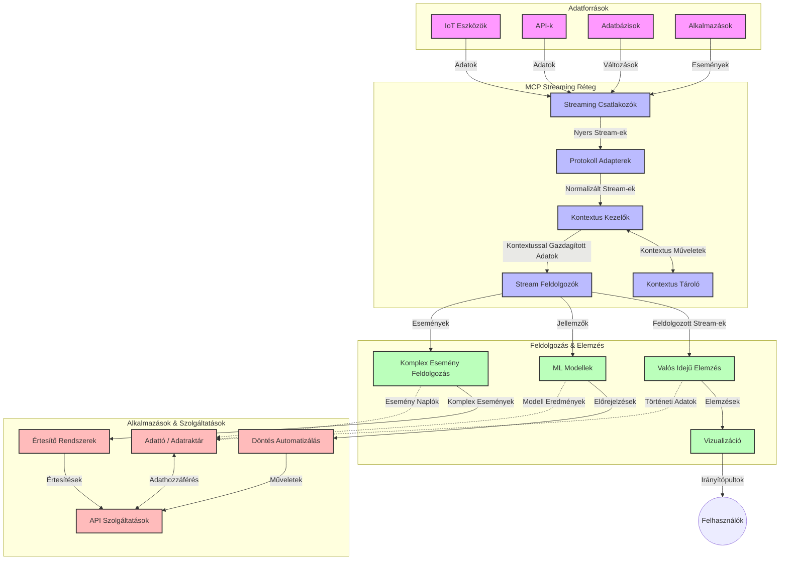

# Modellszintű Kontextus Protokoll valós idejű adatfolyamokhoz

## Áttekintés

A valós idejű adatfolyam alapvető fontosságúvá vált a mai adatvezérelt világban, ahol a vállalkozások és alkalmazások azonnali hozzáférést igényelnek az információkhoz a gyors döntéshozatal érdekében. A Modellszintű Kontextus Protokoll (MCP) jelentős előrelépést képvisel ezen valós idejű adatfolyamatok optimalizálásában, javítva az adatfeldolgozás hatékonyságát, megőrizve a kontextuális integritást és növelve a rendszer teljesítményét.

Ez a modul azt vizsgálja, hogyan alakítja át az MCP a valós idejű adatfolyamokat egy szabványosított megközelítést nyújtva a kontextuskezelésben az AI modellek, adatfolyam-platformok és alkalmazások között.

## Bevezetés a valós idejű adatfolyamba

A valós idejű adatfolyam egy technológiai paradigma, amely lehetővé teszi az adatok folyamatos átvitelét, feldolgozását és elemzését, ahogy azok keletkeznek, lehetővé téve a rendszerek azonnali reagálását az új információkra. Ellentétben a hagyományos kötegelt feldolgozással, amely statikus adathalmazokon működik, az adatfolyam mozgásban lévő adatokat kezel, minimális késleltetéssel adva betekintést és cselekvési lehetőséget.

### A valós idejű adatfolyam alapvető fogalmai:

- **Folyamatos adatforgalom**: Az adatok események vagy rekordok folyamatos, soha véget nem érő sorozataként kerülnek feldolgozásra.
- **Alacsony késleltetésű feldolgozás**: A rendszereket úgy tervezték, hogy minimalizálják az adatkeletkezés és a feldolgozás közötti időt.
- **Skálázhatóság**: Az adatfolyam-architektúráknak kezelniük kell a változó adatvolument és -sebességet.
- **Hibatűrés**: A rendszereknek ellenállónak kell lenniük a meghibásodásokkal szemben az adatfolyam folyamatos biztosítása érdekében.
- **Állapotfüggő feldolgozás**: A kontextus fenntartása az események között elengedhetetlen a releváns elemzéshez.

### A Modellszintű Kontextus Protokoll és a valós idejű adatfolyam

A Modellszintű Kontextus Protokoll (MCP) számos kritikus kihívást kezel a valós idejű adatfolyam környezetekben:

1. **Kontextuális folytonosság**: Az MCP szabványosítja, hogyan tartják fenn a kontextust az elosztott adatfolyam-összetevők között, biztosítva, hogy az AI modellek és a feldolgozó csomópontok hozzáférjenek a releváns történeti és környezeti kontextushoz.

2. **Hatékony állapotkezelés**: Strukturált mechanizmusokat nyújtva a kontextus átvitelére az MCP csökkenti az állapotkezelés overhead-jét az adatfolyam-vonalakban.

3. **Interoperabilitás**: Az MCP közös nyelvet teremt a kontextus megosztására a különböző adatfolyam technológiák és AI modellek között, lehetővé téve rugalmasabb és bővíthetőbb architektúrákat.

4. **Adatfolyamra optimalizált kontextus**: Az MCP megvalósítások kiemelhetik a valós idejű döntéshozatal szempontjából legfontosabb kontextuselemeket, optimalizálva a teljesítményt és pontosságot.

5. **Adaptív feldolgozás**: Megfelelő kontextuskezeléssel az MCP-n keresztül az adatfolyam rendszerek dinamikusan igazíthatják a feldolgozást az adatok változó körülményei és mintázatai alapján.

A modern alkalmazásokban az IoT érzékelőhálózatoktól a pénzügyi kereskedési platformokig az MCP integrációja a streaming technológiákkal intelligensebb, kontextus-érzékeny feldolgozást tesz lehetővé, amely valós időben képes megfelelően reagálni a bonyolult, folyamatosan változó helyzetekre.

## Tanulási célok

A tanóra végére képes leszel:

- Megérteni a valós idejű adatfolyam alapfogalmait és kihívásait
- Elmagyarázni, hogyan javítja a Modellszintű Kontextus Protokoll (MCP) a valós idejű adatfolyamokat
- MCP alapú adatfolyam-megoldásokat megvalósítani népszerű keretrendszerek, mint a Kafka és Pulsar használatával
- Megtervezni és telepíteni hibatűrő, nagy teljesítményű adatfolyam-architektúrákat MCP-vel
- MCP koncepciókat alkalmazni IoT, pénzügyi kereskedés és AI-vezérelt elemzési esetekben
- Értékelni a feltörekvő trendeket és jövőbeli innovációkat az MCP-alapú adatfolyam-technológiákban

### Meghatározás és jelentőség

A valós idejű adatfolyam a folyamatos adatgenerálást, feldolgozást és szállítást jelenti minimális késleltetéssel. Ellentétben a kötegelt feldolgozással, ahol az adatokat csoportokban gyűjtik és dolgozzák fel, az adatfolyam az adatokat fokozatosan, érkezésük után dolgozza fel, lehetővé téve az azonnali betekintést és cselekvést.

A valós idejű adatfolyam kulcsjellemzői:

- **Alacsony késleltetés**: Másodpercek, milliszekundumok alatti adatfeldolgozás és elemzés
- **Folyamatos áramlás**: Megszakítás nélküli adatfolyam különféle forrásokból
- **Azonnali feldolgozás**: Az adat érkezése szerinti elemzés, nem kötegelt feldolgozásban
- **Eseményvezérelt architektúra**: Reagálás az események bekövetkezésekor

### Kihívások a hagyományos adatfolyam-kezelésben

A hagyományos adatfolyam-megoldások számos korláttal küzdenek:

1. **Kontextusvesztés**: Nehézség a kontextus fenntartásában az elosztott rendszerek között
2. **Skálázási problémák**: Nehézség a nagy volumenű, nagy sebességű adat kezelésében
3. **Integrációs komplexitás**: Interoperabilitási problémák a különböző rendszerek között
4. **Késleltetés kezelése**: Az áteresztőképesség és a feldolgozási idő egyensúlyozása
5. **Adatkonzisztencia**: Az adatok pontosságának és teljességének biztosítása az egész adatfolyamon át

## A Modellszintű Kontextus Protokoll (MCP) megértése

### Mi az MCP?

A Modellszintű Kontextus Protokoll (MCP) egy szabványosított kommunikációs protokoll, amely hatékony együttműködést tesz lehetővé AI modellek és alkalmazások között. A valós idejű adatfolyamban az MCP keretrendszert biztosít a következőkhöz:

- A kontextus megőrzése az adatfeldolgozási csővezeték egészében
- Az adatcsere formátumok szabványosítása
- Nagyméretű adatkészletek továbbításának optimalizálása
- Modellközi és modell-alkalmazás közötti kommunikáció fokozása

### Fő komponensek és architektúra

Az MCP architektúrája valós idejű adatfolyamhoz több kulcselemből áll:

1. **Kontextuskezelők**: A kontextuális információk kezelése és fenntartása az adatfolyam csővezetékben
2. **Stream-feldolgozók**: Beérkező adatfolyamok feldolgozása kontextusérzékeny módszerekkel
3. **Protokoll adapterek**: Különböző adatfolyam-protokollok közti átalakítás kontextusmegőrzéssel
4. **Kontextustároló**: A kontextuális információk hatékony tárolása és lekérése
5. **Streaming kapcsolók**: Kapcsolódás különböző adatfolyam-platformokhoz (Kafka, Pulsar, Kinesis stb.)



### Hogyan javítja az MCP a valós idejű adatkezelést

Az MCP a hagyományos adatfolyam-kihívásokat az alábbi módokon kezeli:

- **Kontextuális integritás**: Az adatok közötti kapcsolatok fenntartása a teljes csővezetéken át
- **Optimalizált továbbítás**: Az adatexchange redundanciájának csökkentése intelligens kontextuskezeléssel
- **Szabványosított interfészek**: Konzisztens API-k biztosítása az adatfolyam-összetevők számára
- **Késleltetés csökkentése**: Feldolgozási overhead minimalizálása hatékony kontextuskezeléssel
- **Fokozott skálázhatóság**: Vízszintes skálázás támogatása a kontextus megőrzésével

## Integráció és megvalósítás

A valós idejű adatfolyam rendszerek gondos architekturális tervezést és implementációt igényelnek a teljesítmény és a kontextuális integritás fenntartásához. A Modellszintű Kontextus Protokoll szabványos megközelítést kínál az AI modellek és adatfolyam technológiák integrációjára, lehetővé téve kifinomultabb, kontextusérzékeny feldolgozási csővezetékek kialakítását.

### Az MCP integrálása az adatfolyam-architektúrákban

Az MCP megvalósítása valós idejű adatfolyamban több kulcstényezőt vesz figyelembe:

1. **Kontextus szerializáció és átvitel**: Az MCP hatékony mechanizmusokat kínál a kontextuális információk kódolására az adatfolyam adatcsomagjaiban, biztosítva, hogy a fontos kontextus az adatfeldolgozás során végig kövesse az adatot. Ez tartalmazza a streaming átvitelre optimalizált, szabványosított szerializációs formátumokat.

2. **Állapotfüggő adatfolyam-feldolgozás**: Az MCP lehetővé teszi az intelligensebb, állapotfüggő feldolgozást azáltal, hogy konzisztens kontextusábrázolást tart fenn a feldolgozó csomópontok között. Ez különösen értékes elosztott adatfolyam-architektúrákban, ahol az állapotkezelés hagyományosan kihívást jelent.

3. **Eseményidő vs. feldolgozási idő**: Az MCP megvalósításoknak foglalkozniuk kell azzal a kihívással, hogy megkülönböztessék az események bekövetkezési idejét és azok feldolgozási idejét. A protokoll képes beépíteni a temporális kontextust, amely megőrzi az eseményidő szemantikát.

4. **Nyomáscsökkentés (Backpressure) kezelése**: A kontextus kezelésének szabványosításával az MCP segít kezelni a nyomást az adatfolyam rendszerekben, lehetővé téve az összetevők számára, hogy kommunikálják feldolgozási kapacitásukat és ennek megfelelően állítsák a forgalmat.

5. **Kontextus ablakolás és aggregáció**: Az MCP támogatja a kifinomult ablakolási műveleteket strukturált reprezentációk biztosításával a temporális és relációs kontextusokról, lehetővé téve jelentősebb aggregációkat az eseményfolyamok között.

6. **Pontosan egyszeri feldolgozás**: Az olyan adatfolyam-rendszerekben, ahol pontosan egyszeri szemantikára van szükség, az MCP feldolgozási metaadatokat is beépíthet a feldolgozási állapot nyomon követésére és ellenőrzésére az elosztott összetevők között.

Az MCP különféle adatfolyam-technológiákon keresztüli megvalósítása egységes megközelítést teremt a kontextuskezelésre, csökkentve az egyedi integrációs kód szükségességét és növelve a rendszer képességét a jelentőségteljes kontextus fenntartására az adatfolyam áramlása során.

### MCP különböző adatfolyam-keretrendszerekben

Ezek a példák az aktuális MCP specifikációt követik, amely egy JSON-RPC alapú protokollra épül, különálló közlekedési mechanizmusokkal. A kód bemutatja, hogyan lehet egyedi átviteli megoldásokat megvalósítani streaming platformokkal, mint a Kafka és a Pulsar, miközben teljes kompatibilitást őriz meg az MCP protokollal.

A példák célja, hogy bemutassák, hogyan integrálhatók az adatfolyam platformok az MCP-vel a valós idejű adatfeldolgozás érdekében, megőrizve a kontextusérzékelést, amely az MCP központi eleme. Ez a megközelítés biztosítja, hogy a kódrészletek pontosan tükrözzék az MCP specifikáció jelenlegi állapotát 2025 júniusában.

Az MCP népszerű streaming keretrendszerekkel integrálható, beleértve:

#### Apache Kafka integráció

```python
import asyncio
import json
from typing import Dict, Any, Optional
from confluent_kafka import Consumer, Producer, KafkaError
from mcp.client import Client, ClientCapabilities
from mcp.core.message import JsonRpcMessage
from mcp.core.transports import Transport

# Egyéni szállítóosztály az MCP és a Kafka közötti kapcsolat létrehozásához
class KafkaMCPTransport(Transport):
    def __init__(self, bootstrap_servers: str, input_topic: str, output_topic: str):
        self.bootstrap_servers = bootstrap_servers
        self.input_topic = input_topic
        self.output_topic = output_topic
        self.producer = Producer({'bootstrap.servers': bootstrap_servers})
        self.consumer = Consumer({
            'bootstrap.servers': bootstrap_servers,
            'group.id': 'mcp-client-group',
            'auto.offset.reset': 'earliest'
        })
        self.message_queue = asyncio.Queue()
        self.running = False
        self.consumer_task = None
        
    async def connect(self):
        """Connect to Kafka and start consuming messages"""
        self.consumer.subscribe([self.input_topic])
        self.running = True
        self.consumer_task = asyncio.create_task(self._consume_messages())
        return self
        
    async def _consume_messages(self):
        """Background task to consume messages from Kafka and queue them for processing"""
        while self.running:
            try:
                msg = self.consumer.poll(1.0)
                if msg is None:
                    await asyncio.sleep(0.1)
                    continue
                
                if msg.error():
                    if msg.error().code() == KafkaError._PARTITION_EOF:
                        continue
                    print(f"Consumer error: {msg.error()}")
                    continue
                
                # A üzenetérték JSON-RPC-ként történő elemzése
                try:
                    message_str = msg.value().decode('utf-8')
                    message_data = json.loads(message_str)
                    mcp_message = JsonRpcMessage.from_dict(message_data)
                    await self.message_queue.put(mcp_message)
                except Exception as e:
                    print(f"Error parsing message: {e}")
            except Exception as e:
                print(f"Error in consumer loop: {e}")
                await asyncio.sleep(1)
    
    async def read(self) -> Optional[JsonRpcMessage]:
        """Read the next message from the queue"""
        try:
            message = await self.message_queue.get()
            return message
        except Exception as e:
            print(f"Error reading message: {e}")
            return None
    
    async def write(self, message: JsonRpcMessage) -> None:
        """Write a message to the Kafka output topic"""
        try:
            message_json = json.dumps(message.to_dict())
            self.producer.produce(
                self.output_topic,
                message_json.encode('utf-8'),
                callback=self._delivery_report
            )
            self.producer.poll(0)  # Visszahívások indítása
        except Exception as e:
            print(f"Error writing message: {e}")
    
    def _delivery_report(self, err, msg):
        """Kafka producer delivery callback"""
        if err is not None:
            print(f'Message delivery failed: {err}')
        else:
            print(f'Message delivered to {msg.topic()} [{msg.partition()}]')
    
    async def close(self) -> None:
        """Close the transport"""
        self.running = False
        if self.consumer_task:
            self.consumer_task.cancel()
            try:
                await self.consumer_task
            except asyncio.CancelledError:
                pass
        self.consumer.close()
        self.producer.flush()

# Példa a Kafka MCP szállító használatára
async def kafka_mcp_example():
    # MCP kliens létrehozása Kafka szállítóval
    client = Client(
        {"name": "kafka-mcp-client", "version": "1.0.0"},
        ClientCapabilities({})
    )
    
    # Kafka szállító létrehozása és csatlakoztatása
    transport = KafkaMCPTransport(
        bootstrap_servers="localhost:9092",
        input_topic="mcp-responses",
        output_topic="mcp-requests"
    )
    
    await client.connect(transport)
    
    try:
        # Az MCP munkamenet inicializálása
        await client.initialize()
        
        # Példa eszköz végrehajtására MCP-n keresztül
        response = await client.execute_tool(
            "process_data",
            {
                "data": "sample data",
                "metadata": {
                    "source": "sensor-1",
                    "timestamp": "2025-06-12T10:30:00Z"
                }
            }
        )
        
        print(f"Tool execution response: {response}")
        
        # Tiszta leállítás
        await client.shutdown()
    finally:
        await transport.close()

# A példa futtatása
if __name__ == "__main__":
    asyncio.run(kafka_mcp_example())
```

#### Apache Pulsar megvalósítás

```python
import asyncio
import json
import pulsar
from typing import Dict, Any, Optional
from mcp.core.message import JsonRpcMessage
from mcp.core.transports import Transport
from mcp.server import Server, ServerOptions
from mcp.server.tools import Tool, ToolExecutionContext, ToolMetadata

# Egyedi MCP szállítás létrehozása, amely a Pulsart használja
class PulsarMCPTransport(Transport):
    def __init__(self, service_url: str, request_topic: str, response_topic: str):
        self.service_url = service_url
        self.request_topic = request_topic
        self.response_topic = response_topic
        self.client = pulsar.Client(service_url)
        self.producer = self.client.create_producer(response_topic)
        self.consumer = self.client.subscribe(
            request_topic,
            "mcp-server-subscription",
            consumer_type=pulsar.ConsumerType.Shared
        )
        self.message_queue = asyncio.Queue()
        self.running = False
        self.consumer_task = None
    
    async def connect(self):
        """Connect to Pulsar and start consuming messages"""
        self.running = True
        self.consumer_task = asyncio.create_task(self._consume_messages())
        return self
    
    async def _consume_messages(self):
        """Background task to consume messages from Pulsar and queue them for processing"""
        while self.running:
            try:
                # Nem blokkoló fogadás időkorláttal
                msg = self.consumer.receive(timeout_millis=500)
                
                # Üzenet feldolgozása
                try:
                    message_str = msg.data().decode('utf-8')
                    message_data = json.loads(message_str)
                    mcp_message = JsonRpcMessage.from_dict(message_data)
                    await self.message_queue.put(mcp_message)
                    
                    # Üzenet visszaigazolása
                    self.consumer.acknowledge(msg)
                except Exception as e:
                    print(f"Error processing message: {e}")
                    # Negatív visszaigazolás hiba esetén
                    self.consumer.negative_acknowledge(msg)
            except Exception as e:
                # Időkorlát vagy egyéb kivételek kezelése
                await asyncio.sleep(0.1)
    
    async def read(self) -> Optional[JsonRpcMessage]:
        """Read the next message from the queue"""
        try:
            message = await self.message_queue.get()
            return message
        except Exception as e:
            print(f"Error reading message: {e}")
            return None
    
    async def write(self, message: JsonRpcMessage) -> None:
        """Write a message to the Pulsar output topic"""
        try:
            message_json = json.dumps(message.to_dict())
            self.producer.send(message_json.encode('utf-8'))
        except Exception as e:
            print(f"Error writing message: {e}")
    
    async def close(self) -> None:
        """Close the transport"""
        self.running = False
        if self.consumer_task:
            self.consumer_task.cancel()
            try:
                await self.consumer_task
            except asyncio.CancelledError:
                pass
        self.consumer.close()
        self.producer.close()
        self.client.close()

# Egy mintapélda MCP eszköz definiálása streaming adat feldolgozására
@Tool(
    name="process_streaming_data",
    description="Process streaming data with context preservation",
    metadata=ToolMetadata(
        required_capabilities=["streaming"]
    )
)
async def process_streaming_data(
    ctx: ToolExecutionContext,
    data: str,
    source: str,
    priority: str = "medium"
) -> Dict[str, Any]:
    """
    Process streaming data while preserving context
    
    Args:
        ctx: Tool execution context
        data: The data to process
        source: The source of the data
        priority: Priority level (low, medium, high)
        
    Returns:
        Dict containing processed results and context information
    """
    # Példa feldolgozás, amely kihasználja az MCP kontextust
    print(f"Processing data from {source} with priority {priority}")
    
    # Beszélgetési kontextus elérése az MCP-ből
    conversation_id = ctx.conversation_id if hasattr(ctx, 'conversation_id') else "unknown"
    
    # Eredmények visszaadása kibővített kontextussal
    return {
        "processed_data": f"Processed: {data}",
        "context": {
            "conversation_id": conversation_id,
            "source": source,
            "priority": priority,
            "processing_timestamp": ctx.get_current_time_iso()
        }
    }

# Példa MCP szerver implementáció Pulsar szállítással
async def run_mcp_server_with_pulsar():
    # MCP szerver létrehozása
    server = Server(
        {"name": "pulsar-mcp-server", "version": "1.0.0"},
        ServerOptions(
            capabilities={"streaming": True}
        )
    )
    
    # Az eszköz regisztrálása
    server.register_tool(process_streaming_data)
    
    # Pulsar szállítás létrehozása és csatlakoztatása
    transport = PulsarMCPTransport(
        service_url="pulsar://localhost:6650",
        request_topic="mcp-requests",
        response_topic="mcp-responses"
    )
    
    try:
        # A szerver indítása a Pulsar szállítással
        await server.run(transport)
    finally:
        await transport.close()

# A szerver futtatása
if __name__ == "__main__":
    asyncio.run(run_mcp_server_with_pulsar())
```

### Legjobb gyakorlatok telepítéskor

MCP valós idejű adatfolyamhoz történő megvalósításakor:

1. **Tervezzen hibatűrésre**:
   - Megfelelő hibakezelést valósítson meg
   - Használjon elhalt levelek sorát (dead-letter queue) a sikertelen üzenetekhez
   - Tervezzen idempotens feldolgozókat

2. **Optimalizáljon teljesítményre**:
   - Állítsa be a megfelelő pufferméreteket
   - Alkalmazzon kötegelést, ahol indokolt
   - Valósítson meg nyomáscsökkentő (backpressure) mechanizmusokat

3. **Figyelje és ellenőrizze**:
   - Kövesse az adatfolyam-feldolgozási metrikákat
   - Monitorozza a kontextus terjedését
   - Állítson be riasztásokat rendellenességek esetére

4. **Biztosítsa az adatfolyamokat**:
   - Titkosítást alkalmazzon érzékeny adatokhoz
   - Használjon hitelesítést és jogosultságkezelést
   - Alkalmazzon megfelelő hozzáférés-ellenőrzést


### MCP az IoT-ben és az élőhálózati (edge) számítástechnikában

Az MCP fejleszti az IoT adatfolyamokat azáltal, hogy:

- Megőrzi az eszközkontextust az adatfeldolgozási csővezetékben
- Lehetővé teszi a hatékony élőhálózati-felhő közötti adatfolyamot
- Támogatja az IoT adatfolyamok valós idejű elemzését
- Elősegíti az eszközök közti kommunikációt kontextussal együtt

Példa: Okos városi érzékelőhálózatok  
```
Sensors → Edge Gateways → MCP Stream Processors → Real-time Analytics → Automated Responses
```

### Szerepe a pénzügyi tranzakciókban és a magas frekvenciájú kereskedésben

Az MCP jelentős előnyöket nyújt a pénzügyi adatfolyamokhoz:

- Ultra-alacsony késleltetésű feldolgozás a kereskedési döntésekhez
- A tranzakciós kontextus fenntartása a teljes feldolgozás alatt
- Összetett eseményfeldolgozás támogatása kontextuális tudatossággal
- Az adatkonzisztencia biztosítása az elosztott kereskedési rendszerek között

### AI-vezérelt adat elemzés fejlesztése

Az MCP új lehetőségeket teremt az adatfolyam-elemzéshez:

- Valós idejű modelltréning és következtetés
- Folyamatos tanulás adatfolyamokból
- Kontextus-érzékeny jellemzők kinyerése
- Többmodellből álló következtetési csővezeték kontextus megőrzéssel

## Jövőbeli trendek és újítások

### Az MCP fejlődése valós idejű környezetekben

Előre tekintve azt várjuk, hogy az MCP a következőket célozza meg:

- **Kvantumszámítástechnika integrációja**: Felkészülés kvantum-alapú adatfolyam rendszerekre
- **Élőhálózati natív feldolgozás**: Egyre több kontextusérzékeny feldolgozás az élőhálózati eszközökön
- **Autonóm adatfolyam-menedzsment**: Öntanuló és optimalizáló adatfolyam-csővezetékek
- **Federált adatfolyam**: Elosztott feldolgozás adatvédelem megőrzése mellett

### Potenciális technológiai fejlődések

Feltörekvő technológiák, melyek alakítják az MCP adatfolyam jövőjét:

1. **AI-optimalizált adatfolyam-protokollok**: Kifejezetten AI munkaterhelések számára tervezett protokollok
2. **Neurormorfikus számítástechnika integrációja**: Az agy által inspirált számítás adatfolyam feldolgozáshoz
3. **Szerver nélküli adatfolyam**: Eseményvezérelt, skálázható streaming infrastruktúra-kezelés nélkül
4. **Elosztott kontextustárolók**: Globálisan elosztott, mégis magas konzisztenciájú kontextuskezelés

## Gyakorlati feladatok

### 1. feladat: Alap MCP adatfolyam csővezeték beállítása

Ebben a gyakorlatban megtanulod:

- Egy alap MCP adatfolyam környezet konfigurálását
- Kontextuskezelők megvalósítását az adatfolyam feldolgozásához
- A kontextus megőrzésének tesztelését és validálását

### 2. feladat: Valós idejű elemző műszerfal létrehozása

Készíts egy teljes alkalmazást, amely:

- MCP segítségével adatfolyamot vesz fel
- Feldolgozza a folyamot kontextus fenntartása mellett
- Valós időben megjeleníti az eredményeket

### 3. feladat: Összetett eseményfeldolgozás megvalósítása MCP-vel

Haladó feladat, amely lefedi:

- Mintaérzékelést adatfolyamokban
- Kontextuális korreláció több adatfolyamon át
- Összetett események generálása megőrzött kontextussal

## További források

- [Model Context Protocol Specification](https://modelcontextprotocol.io) - Hivatalos MCP specifikáció és dokumentáció  
- [Apache Kafka Documentation](https://kafka.apache.org/documentation/) - Kafka adatfolyam feldolgozásról  
- [Apache Pulsar](https://pulsar.apache.org/) - Egységes üzenetküldő és adatfolyam platform  
- [Streaming Systems: The What, Where, When, and How of Large-Scale Data Processing](https://www.oreilly.com/library/view/streaming-systems/9781491983867/) - Átfogó könyv adatfolyam-architektúrákról  
- [Microsoft Azure Event Hubs](https://learn.microsoft.com/azure/event-hubs/event-hubs-about) - Kezelt esemény streaming szolgáltatás  
- [MLflow Documentation](https://mlflow.org/docs/latest/index.html) - Gépi tanuló modellek követéséhez és telepítéséhez  
- [Real-Time Analytics with Apache Storm](https://storm.apache.org/releases/current/index.html) - Valós idejű számítási feldolgozó keretrendszer  
- [Flink ML](https://nightlies.apache.org/flink/flink-ml-docs-master/) - Gépi tanulási könyvtár Apache Flinkhez  
- [LangChain Documentation](https://python.langchain.com/docs/get_started/introduction) - LLM alapú alkalmazások fejlesztése

## Tanulási eredmények

A modul elvégzése után képes leszel:

- Megérteni a valós idejű adatfolyam alapjait és kihívásait
- Elmagyarázni, hogyan javítja az MCP a valós idejű adatfolyamokat
- MCP-alapú adatfolyam-megoldásokat megvalósítani népszerű keretrendszerekkel, mint Kafka és Pulsar
- Megtervezni és telepíteni hibatűrő, nagy teljesítményű adatfolyam-architektúrákat MCP-vel
- Alkalmazni az MCP koncepciókat IoT-ban, pénzügyi kereskedésben és AI-vezérelt elemzési esetekben
- Értékelni az MCP-alapú adatfolyam technológiák feltörekvő trendjeit és jövőbeli innovációit

## Mi a következő lépés

- [5.11 Valós idejű keresés](../mcp-realtimesearch/README.md)

---

<!-- CO-OP TRANSLATOR DISCLAIMER START -->
**Jogi nyilatkozat**:
Ez a dokumentum az AI fordítási szolgáltatás, a [Co-op Translator](https://github.com/Azure/co-op-translator) segítségével készült. Bár az pontosságra törekszünk, kérjük, vegye figyelembe, hogy az automatikus fordítások hibákat vagy pontatlanságokat tartalmazhatnak. Az eredeti dokumentum az anyanyelvén tekintendő hiteles forrásnak. Fontos információk esetén professzionális emberi fordítást javasolunk. Nem vállalunk felelősséget semmilyen félreértésért vagy téves értelmezésért, amely ebből a fordításból ered.
<!-- CO-OP TRANSLATOR DISCLAIMER END -->