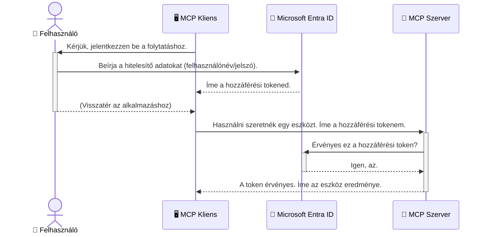

# AI munkafolyamatok biztonságossá tétele: Entra ID hitelesítés Model Context Protocol szerverekhez

## Bevezetés
Az MCP (Model Context Protocol) szerver védelme ugyanolyan fontos, mint az otthoni bejárati ajtó bezárása. Ha nyitva hagyod az MCP szerveredet, az jogosulatlan hozzáférésekhez vezethet, ami biztonsági kockázatot jelent. A Microsoft Entra ID egy megbízható, felhőalapú identitás- és hozzáférés-kezelési megoldás, amely biztosítja, hogy csak jogosult felhasználók és alkalmazások férhessenek hozzá az MCP szerveredhez. Ebben a szakaszban megtanulod, hogyan védd meg AI munkafolyamataidat Entra ID hitelesítéssel.

## Tanulási célok
A szakasz végére képes leszel:

- Megérteni az MCP szerverek biztonságának fontosságát.
- Elmagyarázni a Microsoft Entra ID és az OAuth 2.0 hitelesítés alapjait.
- Felismerni a nyilvános és titkosított (confidential) kliens közötti különbséget.
- Megvalósítani az Entra ID hitelesítést helyi (nyilvános kliens) és távoli (titkosított kliens) MCP szerver helyzetekben.
- Alkalmazni a biztonsági legjobb gyakorlatokat AI munkafolyamatok fejlesztése során.

## Biztonság és MCP

Ahogy az otthoni bejárati ajtót sem hagynád nyitva, úgy az MCP szervert sem szabad bárki számára elérhetővé tenni. AI munkafolyamataid biztonságossá tétele alapvető ahhoz, hogy megbízható, stabil és biztonságos alkalmazásokat építs. Ebben a fejezetben megismered, hogyan használhatod a Microsoft Entra ID-t az MCP szerverek védelmére, biztosítva, hogy csak jogosult felhasználók és alkalmazások férhessenek hozzá az eszközeidhez és adataidhoz.

## Miért fontos a biztonság az MCP szerverek esetében

Képzeld el, hogy az MCP szerverednek van egy eszköze, amely képes e-maileket küldeni vagy egy ügyféladatbázishoz hozzáférni. Ha a szerver nincs védve, bárki használhatná ezt az eszközt, ami jogosulatlan adathozzáféréshez, spam küldéséhez vagy egyéb rosszindulatú tevékenységekhez vezethet.

A hitelesítés alkalmazásával biztosítod, hogy minden szerverhez intézett kérés ellenőrizve legyen, megerősítve a kérés küldőjének személyazonosságát. Ez az első és legfontosabb lépés AI munkafolyamataid biztonságossá tételében.

## Bevezetés a Microsoft Entra ID-be

A [**Microsoft Entra ID**](https://adoption.microsoft.com/microsoft-security/entra/) egy felhőalapú identitás- és hozzáférés-kezelő szolgáltatás. Úgy képzeld el, mint az alkalmazásaid univerzális biztonsági őrét. Kezeli a bonyolult folyamatokat, mint a felhasználók személyazonosságának ellenőrzése (hitelesítés) és a jogosultságok meghatározása (engedélyezés).

Az Entra ID használatával:

- Biztonságos bejelentkezést biztosíthatsz a felhasználóknak.
- Védeni tudod az API-kat és szolgáltatásokat.
- Központilag kezelheted a hozzáférési szabályzatokat.

Az MCP szerverek esetében az Entra ID egy megbízható, széles körben elfogadott megoldást nyújt a hozzáférés kezelésére.

---

## A varázslat megértése: hogyan működik az Entra ID hitelesítés

Az Entra ID nyílt szabványokat használ, például az **OAuth 2.0**-t a hitelesítéshez. Bár a részletek bonyolultak lehetnek, az alapötlet egyszerű, és analógiával könnyen megérthető.

### Egy könnyed bevezető az OAuth 2.0-ba: a valeting kulcs

Gondolj az OAuth 2.0-ra úgy, mint egy autóvalétáló szolgáltatásra. Amikor megérkezel egy étterembe, nem adod át a kulcsaid mesterkulcsát a valetnak. Helyette egy **valet kulcsot** adsz neki, amely korlátozott jogosultságokkal rendelkezik: be tudja indítani az autót és bezárja az ajtókat, de nem tudja kinyitni a csomagtartót vagy az kesztyűtartót.

Ebben az analógiában:

- **Te** vagy a **Felhasználó**.
- **Az autód** az **MCP szerver**, amely értékes eszközöket és adatokat tartalmaz.
- A **Valet** a **Microsoft Entra ID**.
- A **Parkolófiú** az **MCP kliens** (az alkalmazás, amely a szerverhez próbál hozzáférni).
- A **Valet kulcs** az **Hozzáférési token**.

A hozzáférési token egy biztonságos szövegkarakterlánc, amelyet az MCP kliens kap az Entra ID-től a bejelentkezést követően. Ezután a kliens minden kérésnél ezt a tokent küldi el az MCP szervernek. A szerver ellenőrizni tudja a tokent annak érdekében, hogy megerősítse a kérés jogosultságát, és hogy a kliensnek megvan a szükséges engedélye, méghozzá anélkül, hogy valaha is kezelnie kellene a tényleges hitelesítő adataidat (például a jelszavadat).

### A hitelesítési folyamat

A folyamat a következőképpen működik a gyakorlatban:



### Bemutatkozik a Microsoft Authentication Library (MSAL)

Mielőtt belevágnánk a kódba, fontos bemutatni egy kulcskomponenst, amelyet a példákban látni fogsz: a **Microsoft Authentication Library (MSAL)**-t.

Az MSAL egy Microsoft által fejlesztett könyvtár, amely megkönnyíti a fejlesztők számára a hitelesítés kezelését. Ehelyett, hogy neked kellene megírnod a bonyolult kódot a biztonsági tokenek kezelésére, a bejelentkezésekre és a munkamenetek frissítésére, az MSAL végzi el a nehéz munkát.

Egy MSAL-hoz hasonló könyvtár használata erősen ajánlott, mert:

- **Biztonságos:** Iparági szabvány protokollokat és biztonsági legjobb gyakorlatokat valósít meg, csökkentve a sebezhetőségek kockázatát a kódodban.
- **Egyszerűsíti a fejlesztést:** Elrejti az OAuth 2.0 és az OpenID Connect protokollok komplexitását, így néhány sor kóddal megbízható hitelesítést adhatsz az alkalmazásodhoz.
- **Fenntartott:** A Microsoft aktívan karbantartja és frissíti az MSAL-t, hogy kezelje az új biztonsági fenyegetéseket és platformváltozásokat.

Az MSAL támogatja a .NET-et, JavaScript/TypeScript-et, Pythont, Javat, Go-t és mobilplatformokat (iOS, Android), így az egész technológiai halmazodban egységes hitelesítési mintákat használhatsz.

További információkért olvasd el a hivatalos [MSAL áttekintő dokumentációt](https://learn.microsoft.com/entra/identity-platform/msal-overview).

---

## Az MCP szervered védelme Entra ID-vel: lépésről lépésre

Most nézzük meg, hogyan védhetsz egy helyi MCP szervert (amely `stdio` kommunikációt használ) Entra ID segítségével. Ez a példa egy **nyilvános klienst** használ, amely alkalmas olyan alkalmazásokhoz, amelyek egy felhasználó gépén futnak, mint például egy asztali alkalmazás vagy helyi fejlesztői szerver.

### 1. Forgatókönyv: Helyi MCP szerver védelme (nyilvános klienssel)

Ebben a helyzetben egy helyben futó, `stdio`-n keresztül kommunikáló MCP szervert vizsgálunk, amely az Entra ID segítségével hitelesíti a felhasználót, mielőtt hozzáférést ad az eszközeihez. A szervernek lesz egyetlen eszköze, amely lekéri a felhasználó profiladatait a Microsoft Graph API-ból.

#### 1. Az alkalmazás regisztrálása az Entra ID-ben

Mielőtt bármilyen kódot írnál, regisztrálnod kell az alkalmazásodat a Microsoft Entra ID-ben. Ez jelzi az Entra ID-nek, hogy az alkalmazás engedélyt kap az autentikációs szolgáltatás használatára.

1. Navigálj a **[Microsoft Entra portálra](https://entra.microsoft.com/)**.
2. Menj az **App registrations** (Alkalmazásregisztrációk) részhez, majd kattints az **Új regisztráció** gombra.
3. Adj egy nevet az alkalmazásodnak (például "My Local MCP Server").
4. A **Supported account types** (Támogatott fióktípusok) alatt válaszd ki a **Csak ebben a szervezeti címtárban lévő fiókok** opciót.
5. A **Redirect URI** mezőt hagyhatod üresen ebben a példában.
6. Kattints a **Regisztráció** gombra.

A regisztráció után jegyezd fel az **Alkalmazás (kliens) azonosító** és a **Címtár (bérlő) azonosító** értékeket, mert szükséged lesz rájuk a kódban.

#### 2. A kód: egyszerűsített áttekintés

Nézzük meg a kód kulcsfontosságú részeit, amelyek a hitelesítést kezelik. A teljes kód elérhető az [Entra ID - Local - WAM](https://github.com/Azure-Samples/mcp-auth-servers/tree/main/src/entra-id-local-wam) mappában a [mcp-auth-servers GitHub tárolóban](https://github.com/Azure-Samples/mcp-auth-servers).

**`AuthenticationService.cs`**

Ez az osztály kezeli az Entra ID-vel való kommunikációt.

- **`CreateAsync`**: Ez a metódus inicializálja a MSAL `PublicClientApplication` példányt az alkalmazás `clientId` és `tenantId` értékeivel.
- **`WithBroker`**: Engedélyezi a broker (például a Windows Web Account Manager) használatát, amely biztonságosabb és zökkenőmentes egyetlen bejelentkezést biztosít.
- **`AcquireTokenAsync`**: Ez a fő metódus. Először megpróbálja halkban (interakció nélkül) megszerezni a tokent, így a felhasználónak nem kell újra bejelentkeznie, ha már van érvényes munkamenete. Ha ez nem sikerül, interaktív bejelentkezést kér.

```csharp
// Simplified for clarity
public static async Task<AuthenticationService> CreateAsync(ILogger<AuthenticationService> logger)
{
    var msalClient = PublicClientApplicationBuilder
        .Create(_clientId) // Your Application (client) ID
        .WithAuthority(AadAuthorityAudience.AzureAdMyOrg)
        .WithTenantId(_tenantId) // Your Directory (tenant) ID
        .WithBroker(new BrokerOptions(BrokerOptions.OperatingSystems.Windows))
        .Build();

    // ... cache registration ...

    return new AuthenticationService(logger, msalClient);
}

public async Task<string> AcquireTokenAsync()
{
    try
    {
        // Try silent authentication first
        var accounts = await _msalClient.GetAccountsAsync();
        var account = accounts.FirstOrDefault();

        AuthenticationResult? result = null;

        if (account != null)
        {
            result = await _msalClient.AcquireTokenSilent(_scopes, account).ExecuteAsync();
        }
        else
        {
            // If no account, or silent fails, go interactive
            result = await _msalClient.AcquireTokenInteractive(_scopes).ExecuteAsync();
        }

        return result.AccessToken;
    }
    catch (Exception ex)
    {
        _logger.LogError(ex, "An error occurred while acquiring the token.");
        throw; // Optionally rethrow the exception for higher-level handling
    }
}
```

**`Program.cs`**

Itt állítják be az MCP szervert és integrálják a hitelesítési szolgáltatást.

- **`AddSingleton<AuthenticationService>`**: Regisztrálja az `AuthenticationService`-t a függőséginjektáló tárolóba, hogy más részek (például az eszköz) használhassák.
- **`GetUserDetailsFromGraph` eszköz**: Ehhez az eszközhöz szükséges az `AuthenticationService` egy példánya. Mielőtt bármit tenne, meghívja az `authService.AcquireTokenAsync()`-t, hogy érvényes hozzáférési tokent szerezzen. Ha a hitelesítés sikeres, a tokent használja a Microsoft Graph API hívásához, hogy lekérje a felhasználó adatait.

```csharp
// Simplified for clarity
[McpServerTool(Name = "GetUserDetailsFromGraph")]
public static async Task<string> GetUserDetailsFromGraph(
    AuthenticationService authService)
{
    try
    {
        // This will trigger the authentication flow
        var accessToken = await authService.AcquireTokenAsync();

        // Use the token to create a GraphServiceClient
        var graphClient = new GraphServiceClient(
            new BaseBearerTokenAuthenticationProvider(new TokenProvider(authService)));

        var user = await graphClient.Me.GetAsync();

        return System.Text.Json.JsonSerializer.Serialize(user);
    }
    catch (Exception ex)
    {
        return $"Error: {ex.Message}";
    }
}
```

#### 3. Hogyan működik mindez együtt

1. Amikor az MCP kliens megpróbálja használni a `GetUserDetailsFromGraph` eszközt, az eszköz először meghívja az `AcquireTokenAsync`-t.
2. Az `AcquireTokenAsync` elindítja az MSAL könyvtárat, hogy ellenőrizze az érvényes tokent.
3. Ha nincs token, az MSAL a brokeren keresztül interaktív bejelentkezést kér az Entra ID fiókkal.
4. A bejelentkezést követően az Entra ID kibocsát egy hozzáférési tokent.
5. Az eszköz megkapja a tokent, és használja azt egy biztonságos Microsoft Graph API híváshoz.
6. A felhasználó adatait visszaküldik az MCP kliensnek.

Ez a folyamat biztosítja, hogy csak hitelesített felhasználók használhassák az eszközt, ezáltal hatékonyan védve a helyi MCP szerveredet.

### 2. forgatókönyv: Távoli MCP szerver védelme (titkosított klienssel)

Amikor az MCP szerver egy távoli gépen fut (például egy felhőszerveren), és olyan protokollon kommunikál, mint a HTTP Streaming, a biztonsági követelmények eltérőek. Ebben az esetben **titkosított klienst** és az **Authorization Code Flow**-t kell használnod. Ez biztonságosabb, mert az alkalmazás titkai soha nem kerülnek ki a böngészőhöz.

Ez a példa egy TypeScript-alapú MCP szervert mutat be, amely Express.js-t használ HTTP-kérések kezelésére.

#### 1. Az alkalmazás regisztrálása az Entra ID-ben

Az Entra ID-ben történő beállítás hasonló a nyilvános klienshez, de egy lényeges különbség van: létre kell hozni egy **kliens titkot**.

1. Navigálj a **[Microsoft Entra portálra](https://entra.microsoft.com/)**.
2. Az alkalmazásod regisztrációjában menj a **Tanúsítványok és titkok** fülre.
3. Kattints az **Új kliensi titok** gombra, adj neki leírást, majd kattints a **Hozzáadás** gombra.
4. **Fontos:** Azonnal másold ki a titok értékét, mert később nem fogod tudni újra megtekinteni.
5. Konfigurálnod kell a **Redirect URI**-t is. Lépj az **Hitelesítés** fülre, kattints a **Platform hozzáadása**, válaszd a **Web**-et, és add meg az alkalmazásod átirányítási URI-ját (például `http://localhost:3001/auth/callback`).

> **⚠️ Fontos biztonsági megjegyzés:** Éles környezetben a Microsoft erősen ajánlja a **titok nélküli hitelesítés** módszereit, mint például a **Managed Identity** vagy a **Workload Identity Federation** használatát a kliens titkok helyett. A kliens titkok biztonsági kockázatot jelentenek, mert ki lehet őket szivárogtatni vagy kompromittálni. A Managed Identity sokkal biztonságosabb, mert kiküszöböli a hitelesítő adatok kódba vagy konfigurációba történő tárolásának szükségességét.
>
> További információkért a kezelt identitásokról és használatukról lásd a [Managed identities for Azure resources áttekintést](https://learn.microsoft.com/entra/identity/managed-identities-azure-resources/overview).

#### 2. A kód: egyszerűsített áttekintés

Ez a példa egy munkamenet-alapú megközelítést használ. Amikor a felhasználó hitelesít, a szerver eltárolja a hozzáférési tokent és a frissítési tokent a munkamenetben, és átad egy munkamenet tokent a felhasználónak. Ezt a munkamenet tokent használják a további kérésekhez. A teljes kód elérhető az [Entra ID - Confidential client](https://github.com/Azure-Samples/mcp-auth-servers/tree/main/src/entra-id-cca-session) mappában a [mcp-auth-servers GitHub tárolóban](https://github.com/Azure-Samples/mcp-auth-servers).

**`Server.ts`**

Ez a fájl állítja be az Express szervert és az MCP átviteli réteget.

- **`requireBearerAuth`**: Ez egy köztes réteg (middleware), amely védi a `/sse` és `/message` végpontokat. Ellenőrzi, hogy van-e érvényes bearer token az `Authorization` fejlécben.
- **`EntraIdServerAuthProvider`**: Ez egy egyedi osztály, amely megvalósítja a `McpServerAuthorizationProvider` interfészt. Felelős az OAuth 2.0 folyamat kezeléséért.
- **`/auth/callback`**: Ez a végpont kezeli az Entra ID-ből érkező visszairányítást, amikor a felhasználó hitelesítve lett. Az authorization code-ot hozzáférési és frissítési tokenekre váltja.

```typescript
// Egyszerűsítve az áttekinthetőség érdekében
const app = express();
const { server } = createServer();
const provider = new EntraIdServerAuthProvider();

// Védd az SSE végpontot
app.get("/sse", requireBearerAuth({
  provider,
  requiredScopes: ["User.Read"]
}), async (req, res) => {
  // ... csatlakozás a szállításhoz ...
});

// Védd az üzenet végpontot
app.post("/message", requireBearerAuth({
  provider,
  requiredScopes: ["User.Read"]
}), async (req, res) => {
  // ... kezeld az üzenetet ...
});

// Kezeld az OAuth 2.0 visszahívást
app.get("/auth/callback", (req, res) => {
  provider.handleCallback(req.query.code, req.query.state)
    .then(result => {
      // ... kezeld a sikert vagy a hibát ...
    });
});
```

**`Tools.ts`**

Ez a fájl definiálja az MCP szerver által biztosított eszközöket. A `getUserDetails` eszköz hasonló az előző példához, de a hozzáférési tokent a munkamenetből szerzi meg.

```typescript
// Egyszerűsítve az érthetőség érdekében
server.setRequestHandler(CallToolRequestSchema, async (request) => {
  const { name } = request.params;
  const context = request.params?.context as { token?: string } | undefined;
  const sessionToken = context?.token;

  if (name === ToolName.GET_USER_DETAILS) {
    if (!sessionToken) {
      throw new AuthenticationError("Authentication token is missing or invalid. Ensure the token is provided in the request context.");
    }

    // Szerezd meg az Entra ID tokent a munkamenet tárolóból
    const tokenData = tokenStore.getToken(sessionToken);
    const entraIdToken = tokenData.accessToken;

    const graphClient = Client.init({
      authProvider: (done) => {
        done(null, entraIdToken);
      }
    });

    const user = await graphClient.api('/me').get();

    // ... adja vissza a felhasználói részleteket ...
  }
});
```

**`auth/EntraIdServerAuthProvider.ts`**

Ez az osztály kezeli:

- A felhasználó átirányítását az Entra ID bejelentkezési oldalára.
- Az authorization code cseréjét hozzáférési tokenre.
- A tokenek tárolását a `tokenStore`-ban.
- A hozzáférési token frissítését, amikor az lejár.

#### 3. Hogyan működik mindez együtt

1. Amikor a felhasználó először próbál kapcsolódni az MCP szerverhez, a `requireBearerAuth` middleware észleli, hogy nincs érvényes munkamenete, ezért átirányítja őt az Entra ID bejelentkezési oldalára.
2. A felhasználó bejelentkezik az Entra ID fiókjával.
3. Az Entra ID visszairányítja a felhasználót a `/auth/callback` végponthoz egy engedélyezési kóddal.
4. A szerver a kódot hozzáférési tokenre és frissítési tokenre váltja, elmenti őket, és létrehoz egy munkamenet-tokenet, amelyet elküld a kliensnek.
5. A kliens mostantól használhatja ezt a munkamenet-tokenet az `Authorization` fejlécben az MCP szerverhez küldött összes jövőbeni kérésnél.
6. Amikor a `getUserDetails` eszközt hívják, az a munkamenet-token segítségével lekéri az Entra ID hozzáférési tokent, majd azzal hívja meg a Microsoft Graph API-t.

Ez a folyamat bonyolultabb, mint a nyilvános kliens folyamata, de internetes végpontok esetén szükséges. Mivel a távoli MCP szerverek nyilvános interneten érhetők el, erősebb biztonsági intézkedésekre van szükség a jogosulatlan hozzáférés és a potenciális támadások elleni védelem érdekében.


## Biztonsági legjobb gyakorlatok

- **Mindig használj HTTPS-t**: Titkosítsd a kommunikációt a kliens és a szerver között, hogy megvédd a tokeneket a lehallgatástól.
- **Alkalmazz szerepalapú hozzáférés-vezérlést (RBAC)**: Ne csak azt ellenőrizd, *hogy* a felhasználó hitelesített-e; ellenőrizd, *mit* jogosult tenni. Definiálhatsz szerepeket az Entra ID-ben, és azokat ellenőrizheted az MCP szerveredben.
- **Figyelj és auditálj**: Naplózz minden hitelesítési eseményt, hogy észlelhesd és reagálhass gyanús tevékenységre.
- **Kezeld a sebességkorlátozást és a sávszélesség korlátozást**: A Microsoft Graph és más API-k sebességkorlátot alkalmaznak a visszaélések megelőzése érdekében. Az MCP szerveredben implementálj exponenciális visszalépést és újrapróbálkozási logikát az HTTP 429 (Túl sok kérés) válaszok megfelelő kezelésére. Gondolj arra, hogy gyakran használt adatokat cache-elj az API-hívások csökkentése érdekében.
- **Biztonságos token tárolás**: Tárold biztonságosan a hozzáférési és frissítési tokeneket. Helyi alkalmazások esetén használd a rendszer biztonságos tárolási mechanizmusait. Szerver alkalmazásoknál fontold meg a titkosított tárolást vagy biztonságos kulcskezelő szolgáltatások, mint az Azure Key Vault használatát.
- **Token lejárat kezelése**: A hozzáférési tokenek élettartama korlátozott. Implementálj automatikus token frissítést a frissítési tokenek segítségével, hogy a felhasználói élmény megszakítás nélkül működjön újra-hitelesítést igénylése nélkül.
- **Fontold meg az Azure API Management használatát**: Bár a biztonság közvetlen implementálása az MCP szerverben részletes irányítást ad, API átjárók, mint az Azure API Management automatikusan kezelhetik sok biztonsági kérdést, beleértve a hitelesítést, jogosultságkezelést, sebességkorlátozást és monitorozást. Központosított biztonsági réteget biztosítanak, amely a kliensek és az MCP szerverek között helyezkedik el. További részletek az API átjárók MCP-vel való használatáról: [Azure API Management Your Auth Gateway For MCP Servers](https://techcommunity.microsoft.com/blog/integrationsonazureblog/azure-api-management-your-auth-gateway-for-mcp-servers/4402690).


## Főbb tanulságok

- Az MCP szerver biztonságossá tétele kulcsfontosságú az adatok és eszközök védelme érdekében.
- A Microsoft Entra ID robusztus és skálázható megoldást nyújt hitelesítéshez és jogosultságkezeléshez.
- Használj **nyilvános klienst** helyi alkalmazásokhoz, és **titkos klienst** távoli szerverekhez.
- Az **Engedélyezési kód folyamat** a legbiztonságosabb opció webalkalmazások számára.


## Gyakorlat

1. Gondolj egy MCP szerverre, amit esetleg építenél. Helyi szerver lenne, vagy távoli szerver?
2. Válaszod alapján nyilvános vagy titkos klienst használnál?
3. Milyen engedélyeket kérne az MCP szervered a Microsoft Graph ellen végzett műveletekhez?


## Gyakorlati feladatok

### 1. gyakorlat: Alkalmazás regisztrálása az Entra ID-ben
Lépj be a Microsoft Entra portálra.
Regisztrálj egy új alkalmazást az MCP szerveredhez.
Jegyezd fel az Alkalmazás (kliens) azonosítóját és a Katalógus (bérlő) azonosítóját.

### 2. gyakorlat: Helyi MCP szerver biztonságossá tétele (Nyilvános kliens)
- Kövesd a kódpéldát az MSAL (Microsoft Authentication Library) integrálásához a felhasználói hitelesítéshez.
- Teszteld a hitelesítési folyamatot az MCP eszköz hívásával, amely lekéri a felhasználói adatokat a Microsoft Graphból.

### 3. gyakorlat: Távoli MCP szerver biztonságossá tétele (Titkos kliens)
- Regisztrálj egy titkos klienst az Entra ID-ben és hozz létre egy kliens titkot.
- Konfiguráld az Express.js alapú MCP szervered az Engedélyezési kód folyamat használatára.
- Teszteld a védett végpontokat és erősítsd meg a token alapú hozzáférést.

### 4. gyakorlat: Biztonsági legjobb gyakorlatok alkalmazása
- Engedélyezd a HTTPS-t helyi vagy távoli szervereden.
- Implementálj szerepalapú hozzáférés-vezérlést (RBAC) a szerver logikájában.
- Adj hozzá token lejárat kezelést és biztonságos token tárolást.

## Források

1. **MSAL áttekintő dokumentáció**  
   Ismerd meg, hogyan teszi lehetővé a Microsoft Authentication Library (MSAL) a biztonságos token beszerzést különböző platformokon:  
   [MSAL áttekintő a Microsoft Learn-en](https://learn.microsoft.com/en-gb/entra/msal/overview)

2. **Azure-Samples/mcp-auth-servers GitHub tároló**  
   Referenciaimplementációk MCP szerverekhez, amelyek hitelesítési folyamatokat demonstrálnak:  
   [Azure-Samples/mcp-auth-servers GitHubon](https://github.com/Azure-Samples/mcp-auth-servers)

3. **Managed Identities for Azure Resources áttekintő**  
   Olyan módszerek megértése, amelyek eltüntetik a titkokat rendszer- vagy felhasználóhoz rendelt kezelt identitások használatával:  
   [Managed Identities áttekintő a Microsoft Learn-en](https://learn.microsoft.com/en-us/entra/identity/managed-identities-azure-resources/)

4. **Azure API Management: Az MCP szerverek hitelesítési átjárója**  
   Mélyebb bemutató az APIM használatáról biztonságos OAuth2 átjáróként MCP szerverekhez:  
   [Azure API Management Your Auth Gateway For MCP Servers](https://techcommunity.microsoft.com/blog/integrationsonazureblog/azure-api-management-your-auth-gateway-for-mcp-servers/4402690)

5. **Microsoft Graph engedélyek referencia**  
   Átfogó lista a delegált és alkalmazás engedélyekről a Microsoft Graphhoz:  
   [Microsoft Graph Permissions Reference](https://learn.microsoft.com/zh-tw/graph/permissions-reference)


## Tanulási eredmények
A szekció elvégzése után képes leszel:

- Megfogalmazni, miért kritikus a hitelesítés az MCP szerverek és AI munkafolyamatok számára.
- Beállítani és konfigurálni az Entra ID hitelesítést helyi és távoli MCP szerver forgatókönyvekhez.
- Kiválasztani a megfelelő kliens típust (nyilvános vagy titkos) a szervered telepítése alapján.
- Biztonságos kódolási gyakorlatok implementálása, beleértve a token tárolását és a szerepalapú jogosultságkezelést.
- Magabiztosan megvédeni az MCP szerveredet és eszközeit a jogosulatlan hozzáféréstől.

## Mi következik ezután

- [5.13 Model Context Protocol (MCP) integráció a Microsoft Foundry-val](../mcp-foundry-agent-integration/README.md)

---

<!-- CO-OP TRANSLATOR DISCLAIMER START -->
**Jogi nyilatkozat**:
Ez a dokumentum az AI fordítási szolgáltatás, a [Co-op Translator](https://github.com/Azure/co-op-translator) segítségével készült. Bár az pontosságra törekszünk, kérjük, vegye figyelembe, hogy az automatikus fordítások hibákat vagy pontatlanságokat tartalmazhatnak. Az eredeti dokumentum az anyanyelvén tekintendő hiteles forrásnak. Fontos információk esetén professzionális emberi fordítást javasolunk. Nem vállalunk felelősséget semmilyen félreértésért vagy téves értelmezésért, amely ebből a fordításból ered.
<!-- CO-OP TRANSLATOR DISCLAIMER END -->