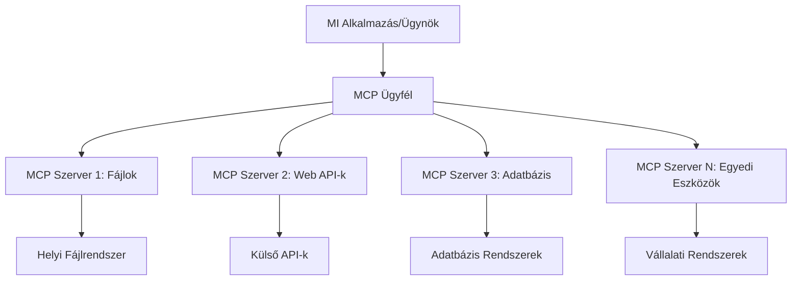

# 🌐 2. modul: MCP a Microsoft Foundry Toolkit alapjaival

[]()
[]()
[]()

## 📋 Tanulási célok

A modul végére képes leszel:
- ✅ Megérteni a Model Context Protocol (MCP) architektúráját és előnyeit
- ✅ Felfedezni a Microsoft MCP szerver ökoszisztémáját
- ✅ Integrálni az MCP szervereket a Microsoft Foundry Toolkit Agent Builder-rel
- ✅ Működő böngésző-automatizálási ügynököt építeni Playwright MCP segítségével
- ✅ Konfigurálni és tesztelni az MCP eszközöket az ügynökökben
- ✅ Exportálni és éles környezetbe telepíteni MCP-alapú ügynököket

## 🎯 Modul 1-re építve

Az 1. modulban elsajátítottuk a Microsoft Foundry Toolkit alapjait, és létrehoztuk első Python ügynökünket. Most **felpörgetjük** az ügynökeidet azáltal, hogy forradalmi **Model Context Protocol (MCP)** segítségével kapcsolódnak külső eszközökhöz és szolgáltatásokhoz.

Gondolj erre úgy, mintha egy egyszerű számológépről egy teljes értékű számítógépre váltanál – az AI ügynökeid képesek lesznek:
- 🌐 Böngészni és interakcióba lépni weboldalakkal
- 📁 Fájlokat elérni és kezelni
- 🔧 Vállalati rendszerekhez integrálódni
- 📊 Valós idejű adatokat feldolgozni API-któl

## 🧠 A Model Context Protocol (MCP) megértése

### 🔍 Mi az az MCP?

A Model Context Protocol (MCP) az **"USB-C az AI alkalmazásoknak"** – egy forradalmi nyílt szabvány, amely kapcsolódást biztosít Nagy Nyelvi Modellek (LLM-ek) számára külső eszközökhöz, adatforrásokhoz és szolgáltatásokhoz. Ahogy az USB-C megszüntette a kábelrengeteg káoszt egyetlen univerzális csatlakozóval, úgy az MCP is kiküszöböli az AI integráció bonyolultságát egy szabványosított protokollal.

### 🎯 Az MCP által megoldott probléma

**MCP előtt:**
- 🔧 Egyedi integrációk minden eszközhöz
- 🔄 Szállítófüggőség zárt megoldásokkal  
- 🔒 Biztonsági kockázatok ad hoc kapcsolatokból
- ⏱️ Hónapok az alap integrációk fejlesztésére

**MCP-vel:**
- ⚡ Csatlakoztatás és azonnali használat
- 🔄 Szállítófüggetlen architektúra
- 🛡️ Beépített biztonsági legjobb gyakorlatok
- 🚀 Új képességek percek alatt hozzáadhatók

### 🏗️ MCP architektúra mélyebb betekintés

Az MCP **ügyfél-szerver architektúrát** követ, amely biztonságos, skálázható ökoszisztémát hoz létre:



**🔧 Fő komponensek:**

| Komponens | Szerep | Példák |
|-----------|--------|--------|
| **MCP Hostok** | Azok az alkalmazások, amelyek fogyasztják az MCP szolgáltatásokat | Claude Desktop, VS Code, Microsoft Foundry Toolkit |
| **MCP Kliensek** | Protokoll kezelők (1:1 a szerverekkel) | A host alkalmazásokba beépítve |
| **MCP Szerverek** | Képességeket tesznek elérhetővé szabványos protokollon keresztül | Playwright, Fájlok, Azure, GitHub |
| **Transzport réteg** | Kommunikációs módok | stdio, HTTP, WebSockets |


## 🏢 A Microsoft MCP szerver ökoszisztémája

A Microsoft vezeti az MCP ökoszisztémát azzal a széleskörű, vállalati szintű szerverkészlettel, amely valódi üzleti igényeket szolgál ki.

### 🌟 Kiemelt Microsoft MCP szerverek

#### 1. ☁️ Azure MCP szerver
**🔗 Tároló**: [azure/azure-mcp](https://github.com/azure/azure-mcp)
**🎯 Cél**: Átfogó Azure erőforrás-kezelés AI integrációval

**✨ Fő jellemzők:**
- Deklaratív infrastruktúra kezelés
- Valós idejű erőforrás monitorozás
- Költségoptimalizálási ajánlások
- Biztonsági megfelelőségi ellenőrzés

**🚀 Használati esetek:**
- Infrastruktúra-kód AI támogatással
- Automatikus erőforrás skálázás
- Felhőköltség optimalizáció
- DevOps munkafolyamat automatizálás

#### 2. 📊 Microsoft Dataverse MCP
**📚 Dokumentáció**: [Microsoft Dataverse integráció](https://go.microsoft.com/fwlink/?linkid=2320176)
**🎯 Cél**: Természetes nyelvű felület üzleti adatokhoz

**✨ Fő jellemzők:**
- Természetes nyelvű adatbázis lekérdezések
- Üzleti kontextus megértése
- Egyedi parancs sablonok
- Vállalati adatkezelés

**🚀 Használati esetek:**
- Üzleti intelligencia riportok
- Ügyféladat elemzés
- Értékesítési csővezeték elemzés
- Megfelelőségi adatlekérdezések

#### 3. 🌐 Playwright MCP szerver
**🔗 Tároló**: [microsoft/playwright-mcp](https://github.com/microsoft/playwright-mcp)
**🎯 Cél**: Böngésző automatizálás és webes interakciók

**✨ Fő jellemzők:**
- Több böngésző automatikus kezelése (Chrome, Firefox, Safari)
- Intelligens elemfelismerés
- Képernyőkép és PDF generálás
- Hálózati forgalom monitorozás

**🚀 Használati esetek:**
- Automatizált tesztelési munkafolyamatok
- Web adatkinyerés és adatgyűjtés
- UI/UX monitorozás
- Versenytárselemzés automatizálása

#### 4. 📁 Fájlok MCP szerver
**🔗 Tároló**: [microsoft/files-mcp-server](https://github.com/microsoft/files-mcp-server)
**🎯 Cél**: Intelligens fájlrendszer műveletek

**✨ Fő jellemzők:**
- Deklaratív fájlkezelés
- Tartalmi szinkronizáció
- Verziókezelő integráció
- Metaadat kinyerés

**🚀 Használati esetek:**
- Dokumentáció kezelése
- Kód tárház rendszerezése
- Tartalomközlési munkafolyamatok
- Adatfolyam fájlkezelése

#### 5. 📝 MarkItDown MCP szerver
**🔗 Tároló**: [microsoft/markitdown](https://github.com/microsoft/markitdown)
**🎯 Cél**: Fejlett Markdown feldolgozás és manipuláció

**✨ Fő jellemzők:**
- Gazdag Markdown elemzés
- Formátum konverzió (MD ↔ HTML ↔ PDF)
- Tartalomszerkezet elemzés
- Sablonfeldolgozás

**🚀 Használati esetek:**
- Szakszöveges dokumentációs munkafolyamatok
- Tartalomkezelő rendszerek
- Jelentéskészítés
- Tudásbázis automatizálás

#### 6. 📈 Clarity MCP szerver
**📦 Csomag**: [@microsoft/clarity-mcp-server](https://www.npmjs.com/package/@microsoft/clarity-mcp-server)
**🎯 Cél**: Webanalitika és felhasználói viselkedési elemzések

**✨ Fő jellemzők:**
- Hőtérképes adat elemzés
- Felhasználói munkamenet felvételek
- Teljesítmény mutatók
- Konverziós tölcsér elemzés

**🚀 Használati esetek:**
- Honlap optimalizálás
- Felhasználói élmény kutatás
- A/B teszt elemzés
- Üzleti intelligencia irányítópultok

### 🌍 Közösségi ökoszisztéma

A Microsoft szerverein túl az MCP ökoszisztéma magában foglalja:
- **🐙 GitHub MCP**: Tárházkezelés és kódelemzés
- **🗄️ Adatbázis MCP-k**: PostgreSQL, MySQL, MongoDB integrációk
- **☁️ Felhőszolgáltató MCP-k**: AWS, GCP, Digital Ocean eszközök
- **📧 Kommunikáció MCP-k**: Slack, Teams, Email integrációk

## 🛠️ Gyakorlati labor: Böngésző automatizálási ügynök építése

**🎯 Projekt célja**: Intelligens böngésző automatizációs ügynök létrehozása Playwright MCP szerverrel, amely képes weboldalak navigálására, adatkinyerésre és összetett webes műveletek végrehajtására.

### 🚀 1. fázis: Ügynök alapjainak beállítása

#### 1. lépés: Ügynök inicializálása
1. **Nyisd meg a Microsoft Foundry Toolkit Agent Builder-t**
2. **Hozz létre új ügynököt** a következő beállításokkal:
   - **Név**: `BrowserAgent`
   - **Modell**: Válaszd a GPT-4o modellt


### 🔧 2. fázis: MCP integrációs munkafolyamat

#### 3. lépés: MCP szerver integráció hozzáadása
1. **Navigálj az Eszközök szakaszra** az Agent Builder-ben
2. **Kattints az "Add Tool" gombra**, hogy megnyisd az integrációs menüt
3. **Válaszd ki az "MCP Server" opciót**


**🔍 Eszköztípusok megértése:**
- **Beépített eszközök**: Előre konfigurált Microsoft Foundry Toolkit funkciók
- **MCP szerverek**: Külső szolgáltatás integrációk
- **Egyedi API-k**: Saját szolgáltatás végpontok
- **Funkcióhívások**: Közvetlen modell funkció elérés

#### 4. lépés: MCP szerver kiválasztása
1. **Válaszd az "MCP Server" opciót a folytatáshoz**


2. **Böngészd az MCP katalógust** a rendelkezésre álló integrációkért


### 🎮 3. fázis: Playwright MCP konfiguráció

#### 5. lépés: Playwright kiválasztása és beállítása
1. **Kattints a "Use Featured MCP Servers" gombra** a Microsoft által hitelesített szerverek eléréséhez
2. **Válaszd ki a "Playwright"-ot** a kiemelt listából
3. **Fogadd el az alapértelmezett MCP ID-t**, vagy testre szabhatod a környezetedhez


#### 6. lépés: Playwright képességek engedélyezése
**🔑 Fontos lépés**: Válaszd ki a **MINDEN** elérhető Playwright metódust a maximális funkcionalitásért


**🛠️ Fontos Playwright eszközök:**
- **Navigáció**: `goto`, `goBack`, `goForward`, `reload`
- **Interakció**: `click`, `fill`, `press`, `hover`, `drag`
- **Kinyerés**: `textContent`, `innerHTML`, `getAttribute`
- **Ellenőrzés**: `isVisible`, `isEnabled`, `waitForSelector`
- **Rögzítés**: `screenshot`, `pdf`, `video`
- **Hálózat**: `setExtraHTTPHeaders`, `route`, `waitForResponse`

#### 7. lépés: Integráció sikerességének ellenőrzése
**✅ Siker jelei:**
- Minden eszköz megjelenik az Agent Builder felületén
- Nincsenek hibaüzenetek az integrációs panelen
- A Playwright szerver státusza "Connected"


**🔧 Gyakori hibák elhárítása:**
- **Kapcsolódás sikertelen**: Ellenőrizd az internetkapcsolatot és a tűzfal beállításokat
- **Hiányzó eszközök**: Bizonyosodj meg róla, hogy az összes képességet kiválasztottad a beállítás során
- **Engedélyezési hibák**: Győződj meg róla, hogy a VS Code rendelkezik a szükséges jogosultságokkal

### 🎯 4. fázis: Fejlett prompt tervezés

#### 8. lépés: Intelligens rendszerminták megalkotása
Készíts kifinomult promptokat, amelyek kihasználják a Playwright teljes képességét:

```markdown
# Web Automation Expert System Prompt

## Core Identity
You are an advanced web automation specialist with deep expertise in browser automation, web scraping, and user experience analysis. You have access to Playwright tools for comprehensive browser control.

## Capabilities & Approach
### Navigation Strategy
- Always start with screenshots to understand page layout
- Use semantic selectors (text content, labels) when possible
- Implement wait strategies for dynamic content
- Handle single-page applications (SPAs) effectively

### Error Handling
- Retry failed operations with exponential backoff
- Provide clear error descriptions and solutions
- Suggest alternative approaches when primary methods fail
- Always capture diagnostic screenshots on errors

### Data Extraction
- Extract structured data in JSON format when possible
- Provide confidence scores for extracted information
- Validate data completeness and accuracy
- Handle pagination and infinite scroll scenarios

### Reporting
- Include step-by-step execution logs
- Provide before/after screenshots for verification
- Suggest optimizations and alternative approaches
- Document any limitations or edge cases encountered

## Ethical Guidelines
- Respect robots.txt and rate limiting
- Avoid overloading target servers
- Only extract publicly available information
- Follow website terms of service
```

#### 9. lépés: Dinamikus felhasználói promptok létrehozása
Tervezd meg azokat a promptokat, amelyek bemutatják a különböző képességeket:

**🌐 Webes elemzés példa:**
```markdown
Navigate to github.com/kinfey and provide a comprehensive analysis including:
1. Repository structure and organization
2. Recent activity and contribution patterns  
3. Documentation quality assessment
4. Technology stack identification
5. Community engagement metrics
6. Notable projects and their purposes

Include screenshots at key steps and provide actionable insights.
```


### 🚀 5. fázis: Végrehajtás és tesztelés

#### 10. lépés: Futtasd az első automatizációt
1. **Kattints a "Run" gombra** az automatizációs szekvencia elindításához
2. **Figyeld valós időben a futást**:
   - Chrome böngésző automatikusan elindul
   - Az ügynök navigál a cél weboldalra
   - Képernyőképek rögzítik a fő lépéseket
   - Elemzési eredmények valós időben érkeznek


#### 11. lépés: Eredmények és elemzések áttekintése
Nézd át az összefoglaló elemzést az Agent Builder felületén:


### 🌟 6. fázis: Fejlettebb képességek és telepítés

#### 12. lépés: Exportálás és éles környezetbe telepítés
Az Agent Builder több telepítési lehetőséget támogat:


## 🎓 2. modul összefoglaló és további lépések

### 🏆 Megszerezve: MCP integráció mestersége

**✅ Elsajátított képességek:**
- [ ] MCP architektúra és előnyök megértése
- [ ] A Microsoft MCP szerver ökoszisztéma kiismerése
- [ ] Playwright MCP integrálása a Microsoft Foundry Toolkit-be
- [ ] Fejlett böngésző automatizálási ügynökök építése
- [ ] Haladó prompt tervezés web automatizációhoz

### 📚 További források

- **🔗 MCP specifikáció**: [Hivatalos protokoll dokumentáció](https://modelcontextprotocol.io/)
- **🛠️ Playwright API**: [Teljes metódus referencia](https://playwright.dev/docs/api/class-playwright)
- **🏢 Microsoft MCP szerverek**: [Vállalati integrációs útmutató](https://github.com/microsoft/mcp-servers)
- **🌍 Közösségi példák**: [MCP szerver galéria](https://github.com/modelcontextprotocol/servers)

**🎉 Gratulálunk!** Sikeresen elsajátítottad az MCP integrációt, és most már képes vagy éles környezetbe alkalmas AI ügynököket építeni külső eszközök képességeivel!


### 🔜 Folytatás a következő modulra

Készen állsz az MCP tudásod magasabb szintre emelésére? Térj át a **[3. modulra: Haladó MCP fejlesztés Microsoft Foundry Toolkit-kel](../lab3/README.md)**, ahol megtanulod:
- Saját egyedi MCP szerverek készítését
- A legújabb MCP Python SDK konfigurálását és használatát
- MCP Inspector beállítását hibakereséshez
- Haladó MCP szerver fejlesztési munkafolyamatok elsajátítását
- Időjárás MCP szerver építését a semmiből

---

<!-- CO-OP TRANSLATOR DISCLAIMER START -->
**Jogi nyilatkozat**:
Ez a dokumentum az AI fordítási szolgáltatás, a [Co-op Translator](https://github.com/Azure/co-op-translator) segítségével készült. Bár az pontosságra törekszünk, kérjük, vegye figyelembe, hogy az automatikus fordítások hibákat vagy pontatlanságokat tartalmazhatnak. Az eredeti dokumentum az anyanyelvén tekintendő hiteles forrásnak. Fontos információk esetén professzionális emberi fordítást javasolunk. Nem vállalunk felelősséget semmilyen félreértésért vagy téves értelmezésért, amely ebből a fordításból ered.
<!-- CO-OP TRANSLATOR DISCLAIMER END -->