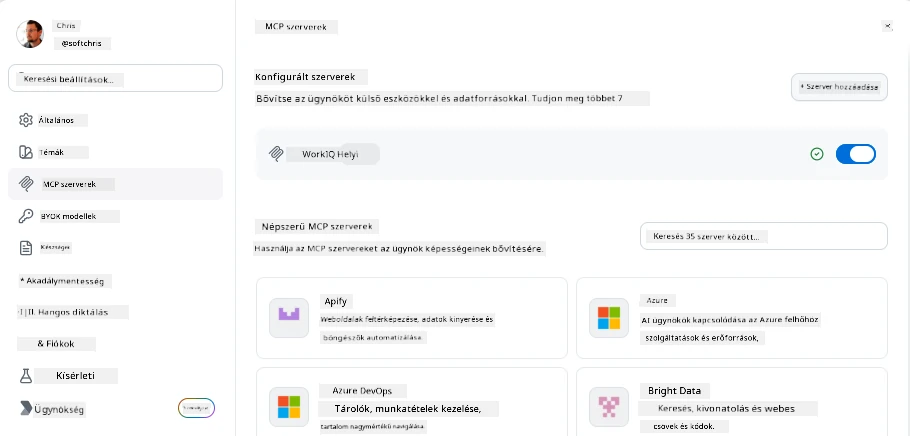
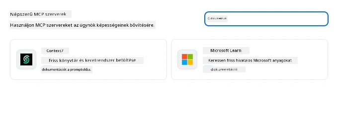
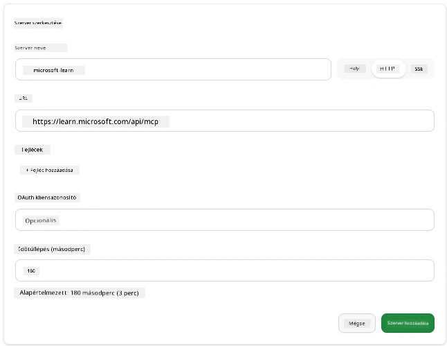
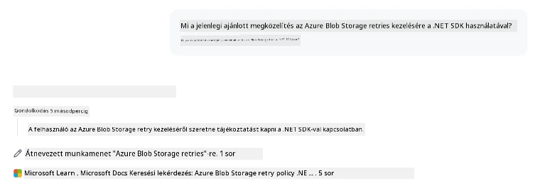
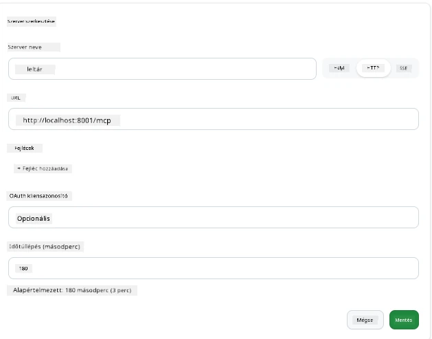
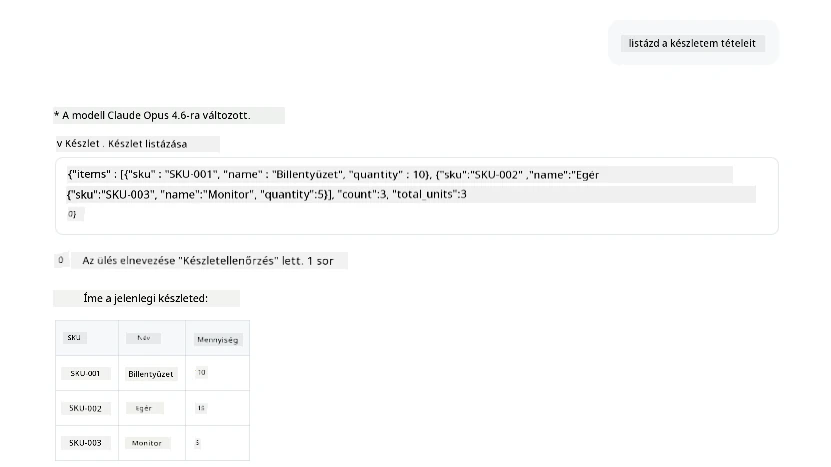
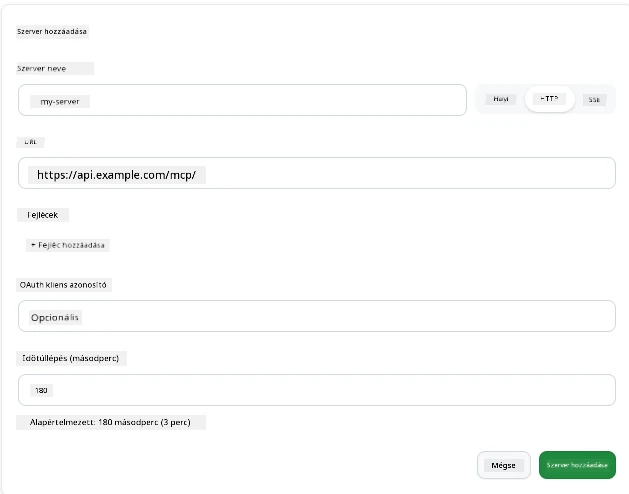
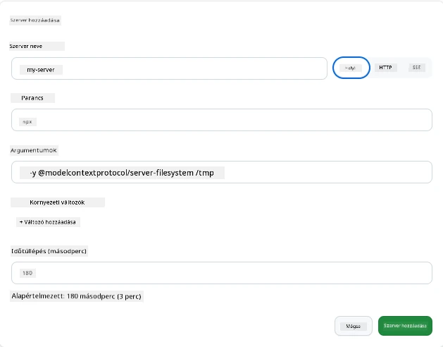

# MCP-szerverek használata a GitHub Copilot alkalmazásban

Mostanra már tudod, hogyan működik az MCP. Építettél szervereket, definiáltál eszközöket és erőforrásokat, és összekötötted az ügyfeleket. Amit még nem tettünk meg, az az, hogy megfordítsuk a perspektívát: ahelyett, hogy te építenéd a szervert, milyen az *fogyasztói* oldalról nézve—egy olyan mesterséges intelligenciával működő alkalmazás felhasználójaként, amely támogatja az MCP-t?

A [GitHub Copilot App](https://github.com/github/app) egy asztali alkalmazás, amely használhat MCP-szervereket. Ha MCP-szervereket csatlakoztatsz hozzá, új szint nyílik meg: a Copilot most már hozzáférhet a dokumentációdhoz, hívhatja a belső API-jaidat, lekérdezheti az adatbázisodat vagy kommunikálhat bármilyen szolgáltatással, amelyet egy szerverbe csomagoltál. Az alkalmazás a gazda lesz; a te MCP-szervereid pedig az eszközei.

Ez a lecke végigvezet téged ezen a teljes folyamaton – az MCP beállítások panel megtalálásától kezdve egy valódi dokumentációs szerver csatlakoztatásán át egészen egy saját, egyedi szerver összekötéséig.

## Tanulási célok

A lecke végére képes leszel:

- Megtalálni és navigálni az MCP Servers panelt a Copilot alkalmazás beállításaiban.
- Csatlakoztatni egy hosztolt dokumentációs szervert és használni azt egy munkamenet során.
- Regisztrálni egy egyedi szervert és ellenőrizni, hogy a Copilot képes-e meghívni az eszközeit.
- Konfigurálni, hogyan hívódik meg egy szerver, megadva környezeti változókat vagy egyedi fejléceket (ha HTTP-ről van szó).

## A Copilot alkalmazás mint MCP gazda

Itt a legfontosabb gondolat: **a Copilot ügynökei okosak, de csak azt tudják, amit te mondasz nekik.** Alapértelmezés szerint egy ügynök képes a munkaterületed fájljait olvasni és terminálparancsokat futtatni, de nem kérdezheti le az adatbázisodat, nem pillanthat bele a naptáradba, és nem hívhat meg egy egyedi API-t segítség nélkül. Itt lépnek be az MCP-szerverek. Ezek hidat képeznek a Copilot és rendszereid között – adatbázisok, verziókezelés, API-k, tervező eszközök –, hogy az ügynökök hozzáférjenek a szükséges információkhoz és műveletekhez a feladatok elvégzéséhez.

Kezdjük azzal, hogy megtaláljuk az alkalmazásod MCP-szervereinek kezeléséhez szükséges beállításokat.

## 1. lépés: Az MCP beállítások panel megtalálása

Nyisd meg a Copilot alkalmazást, és keresd meg a bal alsó sarokban található fogaskerék ikont, majd kattints rá.


Győződj meg róla, hogy az „MCP Servers” van kiválasztva, ekkor a már beállított szervereket a tetején látod, az ismert szerverek piacterét alul, és fent egy „Add Server” gombot, valahogy így:



Ez a vezérlőközpontod. Itt adhatsz hozzá, távolíthatsz el, engedélyezhetsz vagy tilthatsz le szervereket. A változtatások új munkamenetekre lépnek életbe; ha van nyitott munkameneted, le kell zárnod és újat kell indítanod a listamódosítás után.

## 2. lépés: Dokumentációs szerver csatlakoztatása

Csináljunk valami azonnal hasznosat. A Microsoft Docs MCP szerver hozzáférést biztosít a Copilot számára a hivatalos Microsoft dokumentációhoz. Ez magában foglalja az Azure-t, .NET-et, TypeScriptet és még sok mást. Ahelyett, hogy az ügynök a tanítási adatkészletére támaszkodna (amely egy adott dátumban lezáródik), a lekérdezés idején élő, aktuális dokumentációkat tud lehívni.

Így adhatod hozzá:

1. A népszerű szerverek között írd be a **learn** szót és válaszd ki a „Microsoft Learn” nevű szervert.

   

   Kattintás után egy űrlapot kapsz, ahol a név, az átvitel típusa és az URL előre ki van töltve, neked csak az „Add Server” gombra kell kattintanod.

2. Kattints az „Add Server” gombra, néhány másodperc alatt csatlakozik a szerverhez.

   

   Ha hozzáadva, akkor a tetején egy konfigurált szerverként jelenik meg. Próbáljuk ki most.

3. Zárd be a párbeszédablakot és válaszd a „Quick chat” opciót.

4. Írd be az alábbi kérést, hogy aktiváld az eszközt a Microsoft Learn szerveren.

   ```text
   What's the current recommended approach for handling Azure Blob Storage 
   retries using the .NET SDK?
   ```

   

Látnod kell, hogy hivatkozik az általunk most hozzáadott MCP szerverre.

## 3. lépés: Egy egyedi stdio szerver csatlakoztatása

A beépített konfigurációk kényelmesek, de az igazi erő a saját szervereid csatlakoztatásában rejlik. Tegyük fel, hogy te magad építettél (vagy kaptál) egy szervert, amely a belső API-dat vagy a céges tudásbázist teszi elérhetővé. Ebben az esetben egy olyan MCP szervert fogunk használni, amely a cégünk készletkezelését kezeli.

1. Kattints a fogaskerékre és ismét válaszd az „MCP servers”-t.

2. Kattints az „Add Server” gombra, majd a „+ Add Custom server”-re és add meg a következő értékeket:

   - Név: `Inventory Server`
   - Válaszd ki az átvitel típusát (jobbra), **http**

   Kattints az „Add Server”-re, és meg kell jelennie a konfigurált szerverek listájában.

   

4. Teszteléshez futtass egy ilyen promptot:

    ```
    list inventory
    ```

   

Most egy listát kell látnod a készlet tételekről, amelyet a saját, általad épített szerver adott vissza.

Remek, most már jó rálátásod van arra, hogyan adhatsz hozzá külső és saját MCP-szervereket a Copilot alkalmazáshoz. Következőként nézzük meg, hogyan kezeld titkokat és környezeti változókat.

## 4. lépés: Haladó beállítások

Eddig láttad, hogyan adhatsz MCP szervereket, ahol csak nevet és URL-t adsz meg. De mi van, ha a szerveredhez API-kulcs vagy más érték kell? Nos, az átvitel típusától függően megadhatjuk, amire szükség van.

- **http vagy SSE átvitel**: Itt beállíthatunk fejléceket szükség szerint.

   Az autentikációhoz például megadhatsz egy Authorization fejlécet. Az értéke lehet statikus szöveg is. Ha OAuth-ot használsz, adhatod neki OAuth kliensazonosítót is.

   

- **stdio átvitel**: Környezeti változókat állíthatsz be.

   Itt tetszőleges számú környezeti változót adhatsz meg, amelyeket a szerver indításakor át kell adni.

   

## Összefoglalás

A Copilot App az MCP szervereket az ügynök képességeinek elsőrangú kiterjesztéseiként kezeli. Ebben a leckében végigvettük a teljes folyamatot a MCP szerverek hozzáadásától azok használatáig egy munkamenet során. Mostantól csatlakozhatsz nyilvános szerverekhez, belső API-khoz és egyedi eszközökhöz, így az ügynökeid megkapják azt az információt és műveleteket, amelyek szükségesek feladataik autonóm teljesítéséhez.

## 📚 További források

### Hivatalos dokumentáció

- [GitHub Copilot App](https://github.com/github/app)
- [MCP Specification](https://modelcontextprotocol.io/specification/2025-03-26) - Model Context Protocol specifikáció

### Közösség
- [MCP Community Discord](https://discord.com/invite/ByRwuEEgH4) - Élő beszélgetések
- [GitHub Discussions](https://github.com/microsoft/MCP-Server-and-PostgreSQL-Sample-Retail/discussions) - Kérdések és megosztások
- [Stack Overflow](https://stackoverflow.com/questions/tagged/model-context-protocol) - Műszaki kérdések

---

<!-- CO-OP TRANSLATOR DISCLAIMER START -->
**Jogi nyilatkozat**:
Ez a dokumentum az AI fordítási szolgáltatás, a [Co-op Translator](https://github.com/Azure/co-op-translator) segítségével készült. Bár az pontosságra törekszünk, kérjük, vegye figyelembe, hogy az automatikus fordítások hibákat vagy pontatlanságokat tartalmazhatnak. Az eredeti dokumentum az anyanyelvén tekintendő hiteles forrásnak. Fontos információk esetén professzionális emberi fordítást javasolunk. Nem vállalunk felelősséget semmilyen félreértésért vagy téves értelmezésért, amely ebből a fordításból ered.
<!-- CO-OP TRANSLATOR DISCLAIMER END -->