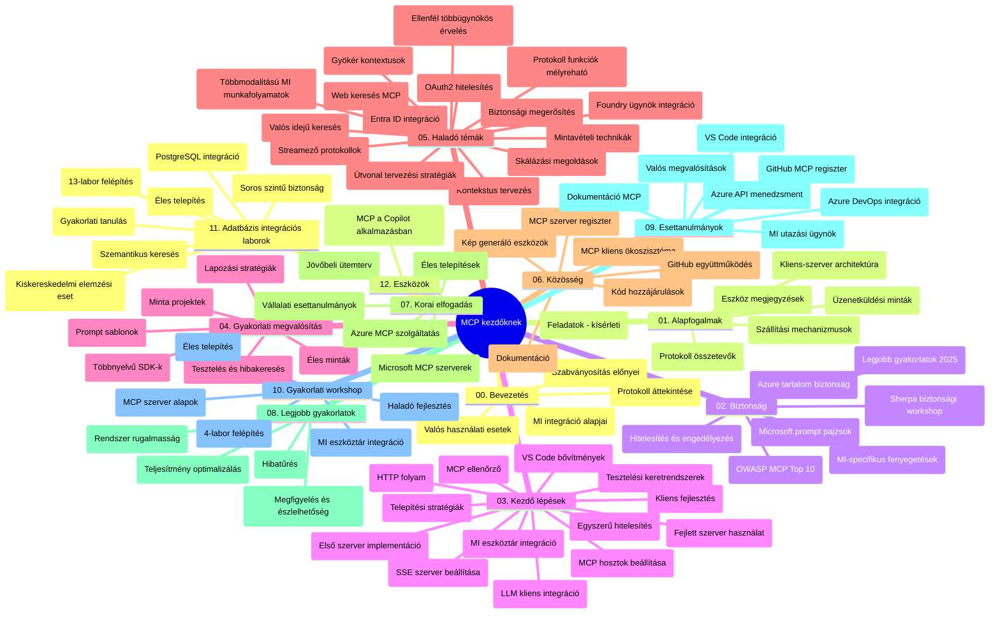

# Model Context Protocol (MCP) kezdőknek – Tanulmányi útmutató

Ez a tanulmányi útmutató áttekintést nyújt a "Model Context Protocol (MCP) kezdőknek" tanterv adattárstruktúrájáról és tartalmáról. Használd ezt az útmutatót az adattár hatékony böngészéséhez és a rendelkezésre álló erőforrások maximális kihasználásához.

## Adattár áttekintése

A Model Context Protocol (MCP) egy szabványosított keretrendszer az AI modellek és kliensalkalmazások közötti interakciókhoz. Eredetileg az Anthropic hozta létre, az MCP-t most a szélesebb MCP közösség tartja karban az hivatalos GitHub szervezet keretében. Ez az adattár átfogó tananyagot kínál kézzel fogható kódpéldákkal C#, Java, JavaScript, Python és TypeScript nyelveken, AI fejlesztők, rendszertervezők és szoftvermérnökök számára.

## Vizualizált tanterv térkép

## Adattár szerkezete

Az adattár tizenkét fő részre van bontva, amelyek mindegyike az MCP különböző aspektusaira fókuszál:

1. **Bevezetés (00-Introduction/)**
   - A Model Context Protocol áttekintése
   - Miért fontos a szabványosítás az AI folyamatokban
   - Gyakorlati használati esetek és előnyök

2. **Alapfogalmak (01-CoreConcepts/)**
   - Kliens-szerver architektúra
   - A protokoll kulcsfontosságú összetevői
   - Üzenetküldési minták MCP-ben

3. **Biztonság (02-Security/)**
   - Biztonsági fenyegetések MCP-alapú rendszerekben
   - Legjobb gyakorlatok a biztonságos megvalósításhoz
   - Hitelesítési és jogosultság-kezelési stratégiák
   - **Átfogó biztonsági dokumentáció**:
     - MCP Biztonsági legjobb gyakorlatok 2025
     - Azure Tartalombiztonsági megvalósítási útmutató
     - MCP Biztonsági vezérlők és technikák
     - MCP Gyakorlati rövid útmutató
   - **Kulcsfontosságú biztonsági témák**:
     - Prompt injection és eszközmérgezés támadások
     - Munkamenet eltérítés és félrevezetett közvetítő problémák
     - Token átvitel sebezhetőségek
     - Túlzott jogosultságok és hozzáférés-vezérlés
     - Ellátási lánc biztonsága AI komponenseknél
     - Microsoft Prompt Shields integráció

4. **Első lépések (03-GettingStarted/)**
   - Környezet beállítása és konfigurálása
   - Alapvető MCP szerverek és kliensek létrehozása
   - Integráció meglévő alkalmazásokkal
   - Tartalmazza a következő részeket:
     - Első szerver megvalósítás
     - Kliens fejlesztés
     - LLM kliens integráció
     - VS Code integráció
     - Server-Sent Events (SSE) szerver
     - Fejlett szerverhasználat
     - HTTP streaming
     - AI Toolkit integráció
     - Tesztelési stratégiák
     - Telepítési irányelvek

5. **Gyakorlati megvalósítás (04-PracticalImplementation/)**
   - SDK-k használata különböző programozási nyelveken
   - Hibakeresés, tesztelés és validációs technikák
   - Újrafelhasználható prompt sablonok és munkafolyamatok készítése
   - Példaprojektek megvalósítási példákkal

6. **Haladó témák (05-AdvancedTopics/)**
   - Kontextus tervezési technikák
   - Foundry agent integráció
   - Multimodális AI munkafolyamatok
   - OAuth2 hitelesítési demók
   - Valós idejű keresési képességek
   - Valós idejű streaming
   - Root context-ek implementálása
   - Routing stratégiák
   - Mintavételezési technikák
   - Skálázási megközelítések
   - Biztonsági megfontolások
   - Entra ID biztonsági integráció
   - Webes keresés integráció
   - Ellenséges multi-agent érvelés (vita minták)

7. **Közösségi hozzájárulások (06-CommunityContributions/)**
   - Kód és dokumentáció hozzájárulás módja
   - Együttműködés GitHub-on
   - Közösségvezérelt fejlesztések és visszajelzések
   - Különböző MCP kliensek használata (Claude Desktop, Cline, VSCode)
   - Népszerű MCP szerverekkel való munka, beleértve a képgenerálást is

8. **Korai alkalmazás tanulságai (07-LessonsfromEarlyAdoption/)**
   - Valós megvalósítások és sikertörténetek
   - MCP-alapú megoldások építése és élesítése
   - Trendek és jövőbeli fejlesztési útvonal
   - **Microsoft MCP szerverek útmutató**: Átfogó útmutató 10 éles Microsoft MCP szerverhez, például:
     - Microsoft Learn Docs MCP szerver
     - Azure MCP szerver (több mint 15 specializált csatlakozóval)
     - GitHub MCP szerver
     - Azure DevOps MCP szerver
     - MarkItDown MCP szerver
     - SQL Server MCP szerver
     - Playwright MCP szerver
     - Dev Box MCP szerver
     - Microsoft Foundry MCP szerver
     - Microsoft 365 Agents Toolkit MCP szerver

9. **Legjobb gyakorlatok (08-BestPractices/)**
   - Teljesítmény hangolás és optimalizálás
   - Hibabiztos MCP rendszerek tervezése
   - Tesztelési és ellenálló képesség stratégiák

10. **Esettanulmányok (09-CaseStudy/)**
    - **Hét átfogó esettanulmány** az MCP sokoldalúságáról különböző helyzetekben:
    - **Azure AI Utazási Ügynökök**: Több-agentes koordináció Azure OpenAI és AI Search használatával
    - **Azure DevOps integráció**: Munkafolyamat automatizálás YouTube adatfrissítésekkel
    - **Valós idejű dokumentum lekérés**: Python konzolos kliens HTTP streaminggel
    - **Interaktív tanulmányi terv generátor**: Chainlit webalkalmazás beszélgető AI-val
    - **Szerkesztőben dokumentáció**: VS Code integráció GitHub Copilot munkafolyamatokkal
    - **Azure API menedzsment**: Vállalati API integráció MCP szerver létrehozásával
    - **GitHub MCP Registry**: Ökoszisztéma fejlesztés és agentikus integrációs platform
    - Implementációs példák átfogva vállalati integrációt, fejlesztői termelékenységet és ökoszisztéma fejlesztést

11. **Gyakorlati workshop (10-StreamliningAIWorkflowsBuildingAnMCPServerWithAIToolkit/)**
    - Átfogó gyakorlati workshop, amely az MCP-t és az AI Toolkit-et kombinálja
    - Intelligens alkalmazások építése, amelyek összekapcsolják az AI modelleket valós világ eszközökkel
    - Gyakorlati modulok az alapoktól az egyedi szerverfejlesztésen át az éles telepítésig
    - **Labor szerkezet**:
      - Labor 1: MCP szerver alapjai
      - Labor 2: Haladó MCP szerver fejlesztés
      - Labor 3: AI Toolkit integráció
      - Labor 4: Éles telepítés és skálázás
    - Labor-alapú tanulási megközelítés lépésről lépésre

12. **MCP szerver adatbázis integrációs laborok (11-MCPServerHandsOnLabs/)**
    - **Átfogó 13 laborból álló tanulási útvonal** éles MCP szerverek felépítéséhez PostgreSQL integrációval
    - **Valós kiskereskedelmi elemzési megvalósítás** a Zava Retail esettanulmány alapján
    - **Vállalati szintű minták** többek között Row Level Security (RLS), szemantikus keresés és több bérlős adat-hozzáférés
    - **Teljes labor felépítés**:
      - **Lab 00-03: Alapok** - Bevezetés, Architektúra, Biztonság, Környezet beállítása
      - **Lab 04-06: MCP szerver építése** - Adatbázis tervezés, MCP szerver megvalósítás, Eszköz fejlesztés
      - **Lab 07-09: Haladó funkciók** - Szemantikus keresés, Tesztelés és hibakeresés, VS Code integráció
      - **Lab 10-12: Élesítés és legjobb gyakorlatok** - Telepítés, Monitorozás, Optimalizálás
    - **Fedett technológiák**: FastMCP keretrendszer, PostgreSQL, Azure OpenAI, Azure Container Apps, Application Insights
    - **Tanulási eredmények**: Éles MCP szerverek, adatbázis integrációs minták, AI-alapú elemzések, vállalati biztonság

13. **Eszközök (12-tooling/)**
    - Megtanulhatod, hogyan használd az MCP-t a Copilot alkalmazásban és más eszközökben

## További erőforrások

Az adattár további támogató anyagokat is tartalmaz:

- **Képek mappa**: Tartalmazza a tananyag során használt diagramokat és illusztrációkat
- **Fordítások**: Többnyelvű támogatás, automatikus dokumentáció fordításokkal
- **Hivatalos MCP erőforrások**:
  - [MCP Dokumentáció](https://modelcontextprotocol.io/)
  - [MCP Specifikáció](https://spec.modelcontextprotocol.io/)
  - [MCP GitHub adattár](https://github.com/modelcontextprotocol)

## Hogyan használd ezt az adattárat

1. **Sorrendbeni tanulás**: Kövesd a fejezeteket sorrendben (00-tól 11-ig) a strukturált tanulás érdekében.
2. **Nyelvspecifikus fókusz**: Ha egy adott programozási nyelv érdekel, böngéssz a mintakönyvtárakban a preferált nyelven elérhető megvalósításokért.
3. **Gyakorlati megvalósítás**: Kezdd az "Első lépések" résszel a környezet beállításához és az első MCP szerver és kliens létrehozásához.
4. **Haladó felfedezés**: Ha már magabiztos vagy az alapokban, merülj el a haladó témákban a tudás bővítése érdekében.
5. **Közösségi részvétel**: Csatlakozz az MCP közösséghez GitHub viták és Discord csatornák segítségével, hogy kapcsolatba léphess szakértőkkel és fejlesztőtársakkal.

## MCP kliensek és eszközök

A tananyag többféle MCP klienset és eszközt ismertet:

1. **Hivatalos kliensek**:
   - Visual Studio Code
   - MCP Visual Studio Code-ban
   - Claude Desktop
   - Claude VSCode-ban
   - Claude API

2. **Közösségi kliensek**:
   - Cline (terminál alapú)
   - Cursor (kódszerkesztő)
   - ChatMCP
   - Windsurf

3. **MCP menedzsment eszközök**:
   - MCP CLI
   - MCP Manager
   - MCP Linker
   - MCP Router

## Népszerű MCP szerverek

Az adattár bemutat több MCP szervert, többek között:

1. **Hivatalos Microsoft MCP szerverek**:
   - Microsoft Learn Docs MCP szerver
   - Azure MCP szerver (15+ specializált csatlakozóval)
   - GitHub MCP szerver
   - Azure DevOps MCP szerver
   - MarkItDown MCP szerver
   - SQL Server MCP szerver
   - Playwright MCP szerver
   - Dev Box MCP szerver
   - Microsoft Foundry MCP szerver
   - Microsoft 365 Agents Toolkit MCP szerver

2. **Hivatalos referencia szerverek**:
   - Fájlrendszer
   - Fetch
   - Memória
   - Szekvenciális gondolkodás

3. **Képgenerálás**:
   - Azure OpenAI DALL-E 3
   - Stable Diffusion WebUI
   - Replicate

4. **Fejlesztői eszközök**:
   - Git MCP
   - Terminál vezérlés
   - Kód asszisztens

5. **Speciális szerverek**:
   - Salesforce
   - Microsoft Teams
   - Jira & Confluence

## Hozzájárulás

Ez az adattár örömmel fogadja a közösség hozzájárulásait. A Közösségi hozzájárulások részben találsz útmutatást arra, hogyan járulhatsz hozzá hatékonyan az MCP ökoszisztémához.

----

*Ez a tanulmányi útmutató utoljára 2026. február 5-én lett frissítve, tükrözve a legfrissebb MCP Specifikáció 2025-11-25 verzióját, és az adattár állapotát ezen időpont szerint mutatja be. Az adattár tartalma a későbbiekben frissülhet.*

---

<!-- CO-OP TRANSLATOR DISCLAIMER START -->
**Jogi nyilatkozat**:
Ez a dokumentum az AI fordítási szolgáltatás, a [Co-op Translator](https://github.com/Azure/co-op-translator) segítségével készült. Bár az pontosságra törekszünk, kérjük, vegye figyelembe, hogy az automatikus fordítások hibákat vagy pontatlanságokat tartalmazhatnak. Az eredeti dokumentum az anyanyelvén tekintendő hiteles forrásnak. Fontos információk esetén professzionális emberi fordítást javasolunk. Nem vállalunk felelősséget semmilyen félreértésért vagy téves értelmezésért, amely ebből a fordításból ered.
<!-- CO-OP TRANSLATOR DISCLAIMER END -->