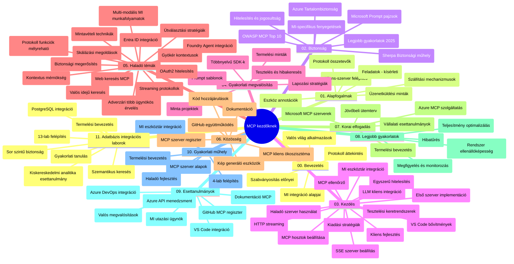

# Model Context Protocol (MCP) kezdőknek – Tanulmányi útmutató

Ez a tanulmányi útmutató áttekintést nyújt a „Model Context Protocol (MCP) kezdőknek” tananyag tárhelyének felépítéséről és tartalmáról. Használd ezt az útmutatót a tárhely hatékony navigálásához és az elérhető források maximális kihasználásához.

## Tárhely áttekintése

A Model Context Protocol (MCP) egy szabványosított keretrendszer az AI modellek és kliensalkalmazások közötti interakciókhoz. Eredetileg az Anthropic hozta létre, az MCP-t most a szélesebb MCP közösség tartja karban az hivatalos GitHub szervezeten keresztül. Ez a tárhely átfogó tananyagot kínál kézzel fogható kódpéldákkal C#, Java, JavaScript, Python és TypeScript nyelveken, AI fejlesztőknek, rendszertervezőknek és szoftvermérnököknek szánva.

## Vizuális tananyag térkép

## Tárhely felépítése

A tárhely tizenegy fő részre tagolódik, amelyek mindegyike az MCP különböző aspektusaira fókuszál:

1. **Bevezetés (00-Introduction/)**
   - A Model Context Protocol áttekintése
   - Miért fontos a szabványosítás az AI folyamatokban
   - Gyakorlati alkalmazási esetek és előnyök

2. **Alapfogalmak (01-CoreConcepts/)**
   - Kliens-szerver architektúra
   - A protokoll kulcskomponensei
   - Üzenetküldési minták az MCP-ben

3. **Biztonság (02-Security/)**
   - Biztonsági fenyegetések MCP-alapú rendszerekben
   - Legjobb gyakorlatok a biztonságos megvalósításhoz
   - Hitelesítési és jogosultság-kezelési stratégiák
   - **Átfogó biztonsági dokumentáció**:
     - MCP Biztonsági Legjobb Gyakorlatok 2025
     - Azure Tartalombiztonsági Megvalósítási Útmutató
     - MCP Biztonsági Ellenőrzések és Technikák
     - MCP Gyorsreferencia a Legjobb Gyakorlatokhoz
   - **Kulcsfontosságú biztonsági témák**:
     - Prompt injekció és eszközmérgezés támadások
     - Munkamenet-eltérítés és félrevezetett helyettes problémák
     - Token átadás sebezhetőségek
     - Túlzott jogosultságok és hozzáférés-vezérlés
     - Ellátási lánc biztonság AI komponensek számára
     - Microsoft Prompt Shields integráció

4. **Kezdőlépések (03-GettingStarted/)**
   - Környezet beállítása és konfigurálása
   - Egyszerű MCP szerverek és kliensek létrehozása
   - Integráció meglévő alkalmazásokkal
   - Tartalmaz részeket:
     - Első szerver megvalósítás
     - Kliens fejlesztés
     - LLM kliens integráció
     - VS Code integráció
     - Szerver-küldte események (SSE) szerver
     - Haladó szerverhasználat
     - HTTP streaming
     - AI Toolkit integráció
     - Tesztelési stratégiák
     - Telepítési útmutatók

5. **Gyakorlati megvalósítás (04-PracticalImplementation/)**
   - SDK-k használata különféle programozási nyelveken
   - Hibakeresés, tesztelés és validálási technikák
   - Újrahasználható prompt sablonok és munkafolyamatok készítése
   - Mintaprojektek megvalósítási példákkal

6. **Haladó témakörök (05-AdvancedTopics/)**
   - Kontextus mérnöki technikák
   - Foundry agent integráció
   - Többmodalitású AI munkafolyamatok
   - OAuth2 hitelesítési bemutatók
   - Valós idejű keresési képességek
   - Valós idejű streaming
   - Root kontextusok megvalósítása
   - Útválasztási stratégiák
   - Mintavételezési technikák
   - Méretezési megközelítések
   - Biztonsági megfontolások
   - Entra ID biztonsági integráció
   - Webes keresési integráció
   - Ellenséges többügynökös érvelés (vita minták)

7. **Közösségi hozzájárulások (06-CommunityContributions/)**
   - Hogyan lehet kódot és dokumentációt hozzájárulni
   - Együttműködés GitHub-on
   - Közösség által vezérelt fejlesztések és visszajelzések
   - Különféle MCP kliensek használata (Claude Desktop, Cline, VSCode)
   - Népszerű MCP szerverekkel való munka, beleértve a képgenerálást is

8. **Tapasztalatok korai elfogadásból (07-LessonsfromEarlyAdoption/)**
   - Valós megvalósítások és sikertörténetek
   - MCP-alapú megoldások építése és telepítése
   - Trendek és jövőbeli útiterv
   - **Microsoft MCP Szerverek útmutató**: Átfogó útmutató 10 gyártásra kész Microsoft MCP szerverhez, köztük:
     - Microsoft Learn Docs MCP Server
     - Azure MCP Server (15+ speciális csatlakozó)
     - GitHub MCP Server
     - Azure DevOps MCP Server
     - MarkItDown MCP Server
     - SQL Server MCP Server
     - Playwright MCP Server
     - Dev Box MCP Server
     - Microsoft Foundry MCP Server
     - Microsoft 365 Agents Toolkit MCP Server

9. **Legjobb gyakorlatok (08-BestPractices/)**
   - Teljesítményhangolás és optimalizáció
   - Hibabiztos MCP rendszerek tervezése
   - Tesztelési és ellenállóképességi stratégiák

10. **Esettanulmányok (09-CaseStudy/)**
    - **Hét átfogó esettanulmány** az MCP sokoldalúságának bemutatására különféle helyzetekben:
    - **Azure AI Utazási ügynökök**: Többügynökös összehangolás Azure OpenAI és AI kereséssel
    - **Azure DevOps integráció**: Munkafolyamatok automatizálása YouTube adatfrissítésekkel
    - **Valós idejű dokumentumlekérés**: Python konzol kliens HTTP streameléssel
    - **Interaktív tanulmányi terv generátor**: Chainlit webalkalmazás konverzációs AI-val
    - **Szerkesztőn belüli dokumentáció**: VS Code integráció GitHub Copilot munkafolyamatokkal
    - **Azure API menedzsment**: Vállalati API integráció és MCP szerver létrehozás
    - **GitHub MCP Registry**: Ökoszisztéma fejlesztés és autonóm integrációs platform
    - Megvalósítási példák vállalati integráció, fejlesztői termelékenység és ökoszisztéma fejlesztés területén

11. **Gyakorlati műhely (10-StreamliningAIWorkflowsBuildingAnMCPServerWithAIToolkit/)**
    - Átfogó gyakorlati műhely MCP és AI Toolkit kombinálásával
    - Intelligens alkalmazások építése, amelyek összekapcsolják az AI modelleket a valós eszközökkel
    - Gyakorlati modulok az alapoktól a testreszabott szerver fejlesztésen át a gyártási telepítésig
    - **Labor felépítés**:
      - Labor 1: MCP szerver alapjai
      - Labor 2: Haladó MCP szerverfejlesztés
      - Labor 3: AI Toolkit integráció
      - Labor 4: Gyártási telepítés és méretezés
    - Labor-alapú tanulási megközelítés lépésről lépésre útmutatókkal

12. **MCP szerver adatbázis integrációs laborok (11-MCPServerHandsOnLabs/)**
    - **Átfogó 13-laboros tananyag** gyártásra kész MCP szerverek építéséhez PostgreSQL integrációval
    - **Valós kereskedelmi elemzés megvalósítás** a Zava Retail esettanulmány használatával
    - **Vállalati szintű minták** Row Level Security (RLS), szemantikus keresés és többbérlős adat-hozzáférés terén
    - **Teljes labor felépítés**:
      - **Laborok 00-03: Alapok** - Bevezetés, Architektúra, Biztonság, Környezet beállítás
      - **Laborok 04-06: MCP szerver építése** - Adatbázis tervezés, MCP szerver megvalósítás, Eszköz fejlesztés
      - **Laborok 07-09: Haladó funkciók** - Szemantikus keresés, tesztelés és hibakeresés, VS Code integráció
      - **Laborok 10-12: Gyártás és legjobb gyakorlatok** - Telepítés, felügyelet, optimalizálás
    - **Technológiák**: FastMCP keretrendszer, PostgreSQL, Azure OpenAI, Azure Container Apps, Application Insights
    - **Tanulási eredmények**: Gyártásra kész MCP szerverek, adatbázis integrációs minták, AI-alapú elemzések, vállalati biztonság

## További források

A tárhely tartalmazza a támogató forrásokat:

- **Képek mappa**: Ábrákat és illusztrációkat tartalmaz a tananyaghoz
- **Fordítások**: Többnyelvű támogatás automatikus dokumentáció fordításokkal
- **Hivatalos MCP források**:
  - [MCP Dokumentáció](https://modelcontextprotocol.io/)
  - [MCP Specifikáció](https://spec.modelcontextprotocol.io/)
  - [MCP GitHub Tárhely](https://github.com/modelcontextprotocol)

## Hogyan használd ezt a tárhelyet

1. **Sorrendbeli tanulás**: Kövesd a fejezeteket sorrendben (00-tól 11-ig) a strukturált tanulási élményért.
2. **Nyelvspecifikus fókusz**: Ha egy adott programozási nyelv érdekel, böngészd a mintakönyvtárakat a választott nyelv megvalósításaiért.
3. **Gyakorlati megvalósítás**: Kezdd a „Kezdőlépések” résszel a környezet beállításához és az első MCP szerver, illetve kliens létrehozásához.
4. **Haladó felfedezés**: Amint kényelmes vagy az alapokkal, merülj el a haladó témákban a tudás bővítéséért.
5. **Közösségi részvétel**: Csatlakozz az MCP közösséghez GitHub beszélgetéseken és Discord csatornákon, hogy kapcsolatba léphess szakértőkkel és fejlesztőtársakkal.

## MCP kliensek és eszközök

A tananyag különféle MCP klienseket és eszközöket fed le:

1. **Hivatalos kliensek**:
   - Visual Studio Code
   - MCP a Visual Studio Code-ban
   - Claude Desktop
   - Claude VSCode-ban
   - Claude API

2. **Közösségi kliensek**:
   - Cline (terminál alapú)
   - Cursor (kódszerkesztő)
   - ChatMCP
   - Windsurf

3. **MCP menedzsment eszközök**:
   - MCP CLI
   - MCP Manager
   - MCP Linker
   - MCP Router

## Népszerű MCP szerverek

A tárhely különféle MCP szervereket mutat be, többek között:

1. **Hivatalos Microsoft MCP szerverek**:
   - Microsoft Learn Docs MCP Server
   - Azure MCP Server (15+ speciális csatlakozó)
   - GitHub MCP Server
   - Azure DevOps MCP Server
   - MarkItDown MCP Server
   - SQL Server MCP Server
   - Playwright MCP Server
   - Dev Box MCP Server
   - Microsoft Foundry MCP Server
   - Microsoft 365 Agents Toolkit MCP Server

2. **Hivatalos referenciaszerverek**:
   - Fájlrendszer
   - Fetch
   - Memória
   - Szekvenciális gondolkodás

3. **Képgenerálás**:
   - Azure OpenAI DALL-E 3
   - Stable Diffusion WebUI
   - Replicate

4. **Fejlesztői eszközök**:
   - Git MCP
   - Terminál vezérlés
   - Kód asszisztens

5. **Speciális szerverek**:
   - Salesforce
   - Microsoft Teams
   - Jira & Confluence

## Hozzájárulás

Ez a tárhely szívesen fogadja a közösség hozzájárulásait. Lásd a Közösségi hozzájárulások részt, ahol útmutatót találsz a MCP ökoszisztémához való hatékony hozzájáruláshoz.

----

*Ez a tanulmányi útmutató utoljára 2026. február 5-én frissült, tükrözve a legújabb MCP Specifikáció 2025-11-25 verzióját, és a tárhely adott napi állapotát mutatja be. A tárhely tartalma azóta frissülhet.*

---

<!-- CO-OP TRANSLATOR DISCLAIMER START -->
**Jogi nyilatkozat**:
Ez a dokumentum az AI fordítási szolgáltatás, a [Co-op Translator](https://github.com/Azure/co-op-translator) segítségével készült. Bár az pontosságra törekszünk, kérjük, vegye figyelembe, hogy az automatikus fordítások hibákat vagy pontatlanságokat tartalmazhatnak. Az eredeti dokumentum az anyanyelvén tekintendő hiteles forrásnak. Fontos információk esetén professzionális emberi fordítást javasolunk. Nem vállalunk felelősséget semmilyen félreértésért vagy téves értelmezésért, amely ebből a fordításból ered.
<!-- CO-OP TRANSLATOR DISCLAIMER END -->