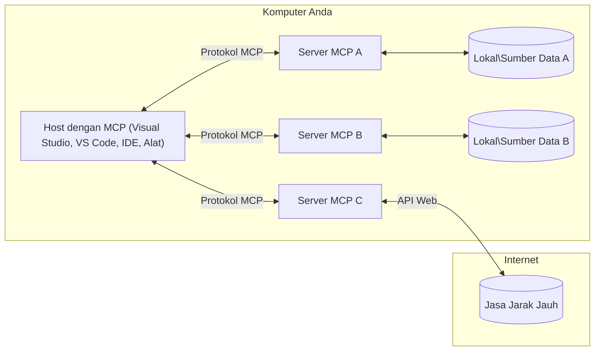

# Konsep Inti MCP: Menguasai Model Context Protocol untuk Integrasi AI

[](https://youtu.be/earDzWGtE84)

_(Klik gambar di atas untuk melihat video pelajaran ini)_

[Model Context Protocol (MCP)](https://github.com/modelcontextprotocol) adalah kerangka kerja standar yang kuat untuk mengoptimalkan komunikasi antara Large Language Models (LLM) dan alat eksternal, aplikasi, serta sumber data.  
Panduan ini akan membimbing Anda memahami konsep inti MCP. Anda akan belajar tentang arsitektur klien-server, komponen penting, mekanisme komunikasi, dan praktik terbaik implementasi.

- **Persetujuan Pengguna yang Eksplisit**: Semua akses data dan operasi memerlukan persetujuan eksplisit pengguna sebelum dijalankan. Pengguna harus memahami dengan jelas data apa yang akan diakses dan tindakan apa yang akan dilakukan, dengan kontrol granular atas izin dan otorisasi.

- **Perlindungan Privasi Data**: Data pengguna hanya akan diungkapkan dengan persetujuan eksplisit dan harus dilindungi dengan kontrol akses yang kuat sepanjang seluruh siklus interaksi. Implementasi harus mencegah transmisi data tanpa izin dan menjaga batasan privasi yang ketat.

- **Keamanan Eksekusi Alat**: Setiap pemanggilan alat memerlukan persetujuan eksplisit pengguna dengan pemahaman jelas tentang fungsi alat, parameter, dan dampak potensial. Batas keamanan yang kuat harus mencegah eksekusi alat yang tidak disengaja, tidak aman, atau berbahaya.

- **Keamanan Lapisan Transportasi**: Semua saluran komunikasi harus menggunakan mekanisme enkripsi dan autentikasi yang sesuai. Koneksi jarak jauh harus mengimplementasikan protokol transportasi aman dan manajemen kredensial yang tepat.

#### Pedoman Implementasi:

- **Manajemen Izin**: Terapkan sistem izin yang terperinci yang memungkinkan pengguna mengontrol server, alat, dan sumber daya yang dapat diakses  
- **Autentikasi & Otorisasi**: Gunakan metode autentikasi yang aman (OAuth, kunci API) dengan manajemen token dan kadaluarsa yang tepat  
- **Validasi Input**: Validasi semua parameter dan input data sesuai skema yang ditentukan untuk mencegah serangan injeksi  
- **Audit Logging**: Simpan log komprehensif dari semua operasi untuk pemantauan keamanan dan kepatuhan  

## Ikhtisar

Pelajaran ini mengeksplorasi arsitektur fundamental dan komponen yang membentuk ekosistem Model Context Protocol (MCP). Anda akan mempelajari arsitektur klien-server, komponen utama, dan mekanisme komunikasi yang menggerakkan interaksi MCP.

## Tujuan Pembelajaran Utama

Setelah menyelesaikan pelajaran ini, Anda akan:

- Memahami arsitektur klien-server MCP.  
- Mengidentifikasi peran dan tanggung jawab Host, Klien, dan Server.  
- Menganalisis fitur inti yang membuat MCP sebagai lapisan integrasi yang fleksibel.  
- Mempelajari bagaimana aliran informasi dalam ekosistem MCP.  
- Mendapatkan wawasan praktis melalui contoh kode di .NET, Java, Python, dan JavaScript.

## Arsitektur MCP: Tinjauan Mendalam

Ekosistem MCP dibangun atas model klien-server. Struktur modular ini memungkinkan aplikasi AI berinteraksi secara efisien dengan alat, basis data, API, dan sumber daya kontekstual. Mari kita uraikan arsitektur ini ke dalam komponen intinya.

Pada dasarnya, MCP mengikuti arsitektur klien-server di mana aplikasi host dapat terhubung ke beberapa server:


- **Host MCP**: Program seperti VSCode, Claude Desktop, IDE, atau alat AI yang ingin mengakses data melalui MCP  
- **Klien MCP**: Klien protokol yang memelihara koneksi 1:1 dengan server  
- **Server MCP**: Program ringan yang masing-masing menyediakan kemampuan spesifik melalui Model Context Protocol standar  
- **Sumber Data Lokal**: File, basis data, dan layanan komputer Anda yang dapat diakses secara aman oleh server MCP  
- **Layanan Jarak Jauh**: Sistem eksternal yang tersedia melalui internet dan dapat diakses server MCP melalui API.

Protokol MCP adalah standar yang terus berkembang menggunakan versi berbasis tanggal (format YYYY-MM-DD). Versi protokol saat ini adalah **2025-11-25**. Anda dapat melihat pembaruan terbaru pada [spesifikasi protokol](https://modelcontextprotocol.io/specification/2025-11-25/)

### 1. Host

Dalam Model Context Protocol (MCP), **Host** adalah aplikasi AI yang berfungsi sebagai antarmuka utama tempat pengguna berinteraksi dengan protokol. Host mengoordinasikan dan mengelola koneksi ke banyak server MCP dengan membuat klien MCP khusus untuk setiap koneksi server. Contoh Host antara lain:

- **Aplikasi AI**: Claude Desktop, Visual Studio Code, Claude Code  
- **Lingkungan Pengembangan**: IDE dan editor kode dengan integrasi MCP  
- **Aplikasi Kustom**: Agen AI dan alat yang dibangun khusus  

**Host** adalah aplikasi yang mengkoordinasikan interaksi model AI. Mereka:

- **Mengorkestrasi Model AI**: Menjalankan atau berinteraksi dengan LLM untuk menghasilkan respons dan mengoordinasi alur kerja AI  
- **Mengelola Koneksi Klien**: Membuat dan memelihara satu klien MCP per koneksi server MCP  
- **Mengendalikan Antarmuka Pengguna**: Menangani alur percakapan, interaksi pengguna, dan penyajian respons  
- **Melaksanakan Keamanan**: Mengontrol izin, pembatasan keamanan, dan autentikasi  
- **Menangani Persetujuan Pengguna**: Mengelola persetujuan pengguna untuk berbagi data dan eksekusi alat  

### 2. Klien

**Klien** adalah komponen penting yang memelihara koneksi satu-ke-satu khusus antara Host dan server MCP. Setiap klien MCP dibuat oleh Host untuk terhubung ke server MCP tertentu, memastikan saluran komunikasi yang terorganisir dan aman. Banyak klien memungkinkan Host terhubung ke banyak server secara bersamaan.

**Klien** adalah komponen penghubung dalam aplikasi host. Mereka:

- **Komunikasi Protokol**: Mengirim permintaan JSON-RPC 2.0 ke server dengan prompt dan instruksi  
- **Negosiasi Kemampuan**: Melakukan negosiasi fitur dan versi protokol yang didukung dengan server saat inisialisasi  
- **Eksekusi Alat**: Mengelola permintaan eksekusi alat dari model dan memproses respons  
- **Pembaruan Real-time**: Menangani notifikasi dan pembaruan real-time dari server  
- **Pemrosesan Respons**: Memproses dan memformat respons server untuk ditampilkan ke pengguna  

### 3. Server

**Server** adalah program yang menyediakan konteks, alat, dan kemampuan kepada klien MCP. Server dapat dijalankan secara lokal (di mesin yang sama dengan Host) atau jarak jauh (pada platform eksternal), dan bertanggung jawab untuk menangani permintaan klien serta menyediakan respons yang terstruktur. Server mengekspos fungsi spesifik melalui Model Context Protocol yang distandarisasi.

**Server** adalah layanan yang menyediakan konteks dan kemampuan. Mereka:

- **Pendaftaran Fitur**: Mendaftarkan dan mengekspos primitif yang tersedia (sumber daya, prompt, alat) kepada klien  
- **Pemrosesan Permintaan**: Menerima dan mengeksekusi pemanggilan alat, permintaan sumber daya, dan permintaan prompt dari klien  
- **Penyediaan Konteks**: Menyediakan informasi kontekstual dan data untuk meningkatkan respons model  
- **Manajemen Status**: Memelihara status sesi dan menangani interaksi yang membutuhkan status jika diperlukan  
- **Notifikasi Real-time**: Mengirim notifikasi tentang perubahan kemampuan dan pembaruan ke klien yang terhubung  

Server dapat dikembangkan oleh siapa saja untuk memperluas kemampuan model dengan fungsi khusus, dan mendukung skenario penerapan lokal maupun jarak jauh.

### 4. Primitif Server

Server dalam Model Context Protocol (MCP) menyediakan tiga **primitif** inti yang menentukan blok bangunan dasar untuk interaksi kaya antara klien, host, dan model bahasa. Primitif ini menentukan jenis informasi kontekstual dan tindakan yang tersedia melalui protokol.

Server MCP dapat mengekspos kombinasi dari tiga primitif inti berikut:

#### Sumber Daya

**Sumber Daya** adalah sumber data yang menyediakan informasi kontekstual ke aplikasi AI. Mereka mewakili konten statis atau dinamis yang dapat meningkatkan pemahaman dan pengambilan keputusan model:

- **Data Kontekstual**: Informasi terstruktur dan konteks untuk konsumsi model AI  
- **Basis Pengetahuan**: Repositori dokumen, artikel, manual, dan makalah riset  
- **Sumber Data Lokal**: File, basis data, dan informasi sistem lokal  
- **Data Eksternal**: Respons API, layanan web, dan data sistem jarak jauh  
- **Konten Dinamis**: Data real-time yang diperbarui berdasarkan kondisi eksternal  

Sumber daya diidentifikasi oleh URI dan mendukung penemuan melalui metode `resources/list` dan pengambilan melalui `resources/read`:

```text
file://documents/project-spec.md
database://production/users/schema
api://weather/current
```

#### Prompt

**Prompt** adalah templat yang dapat digunakan ulang yang membantu menyusun interaksi dengan model bahasa. Prompt menyediakan pola interaksi standar dan alur kerja terstruktur:

- **Interaksi Berbasis Templat**: Pesan dan pembuka percakapan yang sudah terstruktur sebelumnya  
- **Templat Alur Kerja**: Urutan standar untuk tugas dan interaksi umum  
- **Contoh Few-shot**: Templat berbasis contoh untuk instruksi model  
- **Prompt Sistem**: Prompt dasar yang menentukan perilaku dan konteks model  
- **Templat Dinamis**: Prompt parameterisasi yang beradaptasi dengan konteks spesifik  

Prompt mendukung substitusi variabel dan dapat ditemukan melalui `prompts/list` serta diambil dengan `prompts/get`:

```markdown
Generate a {{task_type}} for {{product}} targeting {{audience}} with the following requirements: {{requirements}}
```

#### Alat

**Alat** adalah fungsi yang dapat dieksekusi yang bisa dipanggil model AI untuk melakukan tindakan spesifik. Mereka mewakili "kata kerja" di ekosistem MCP, memungkinkan model berinteraksi dengan sistem eksternal:

- **Fungsi Eksekusi**: Operasi diskrit yang dapat dipanggil model dengan parameter tertentu  
- **Integrasi Sistem Eksternal**: Panggilan API, query basis data, operasi file, perhitungan  
- **Identitas Unik**: Setiap alat memiliki nama, deskripsi, dan skema parameter yang berbeda  
- **I/O Terstruktur**: Alat menerima parameter tervalidasi dan mengembalikan respons terstruktur dan bertipe  
- **Kemampuan Aksi**: Memungkinkan model melakukan tindakan dunia nyata dan mengambil data langsung  

Alat didefinisikan dengan JSON Schema untuk validasi parameter dan ditemukan melalui `tools/list` serta dijalankan lewat `tools/call`. Alat juga dapat menyertakan **ikon** sebagai metadata tambahan untuk presentasi UI yang lebih baik.

**Anotasi Alat**: Alat mendukung anotasi perilaku (misalnya, `readOnlyHint`, `destructiveHint`) yang menggambarkan apakah alat bersifat hanya baca atau destruktif, membantu klien membuat keputusan terinformasi terkait eksekusi alat.

Contoh definisi alat:

```typescript
server.tool(
  "search_products", 
  {
    query: z.string().describe("Search query for products"),
    category: z.string().optional().describe("Product category filter"),
    max_results: z.number().default(10).describe("Maximum results to return")
  }, 
  async (params) => {
    // Jalankan pencarian dan kembalikan hasil yang terstruktur
    return await productService.search(params);
  }
);
```

## Primitif Klien

Dalam Model Context Protocol (MCP), **klien** dapat mengekspos primitif yang memungkinkan server meminta kemampuan tambahan dari aplikasi host. Primitif sisi klien ini memungkinkan implementasi server yang lebih kaya dan interaktif yang dapat mengakses kemampuan model AI dan interaksi pengguna.

### Sampling

**Sampling** memungkinkan server meminta penyelesaian model bahasa dari aplikasi AI klien. Primitif ini memungkinkan server mengakses kemampuan LLM tanpa menyematkan ketergantungan model mereka sendiri:

- **Akses Mandiri Model**: Server dapat meminta penyelesaian tanpa menyertakan SDK LLM atau mengelola akses model  
- **AI Inisiasi Server**: Memungkinkan server untuk secara otonom menghasilkan konten menggunakan model AI klien  
- **Interaksi LLM Rekursif**: Mendukung skenario kompleks di mana server membutuhkan bantuan AI untuk pemrosesan  
- **Generasi Konten Dinamis**: Membolehkan server membuat respons kontekstual menggunakan model host  
- **Dukungan Pemanggilan Alat**: Server dapat menyertakan parameter `tools` dan `toolChoice` untuk memungkinkan model klien memanggil alat saat sampling  

Sampling dimulai melalui metode `sampling/complete` di mana server mengirim permintaan penyelesaian ke klien.

### Roots

**Roots** menyediakan cara standar bagi klien untuk mengekspos batas sistem file kepada server, membantu server memahami direktori dan file mana yang dapat diakses:

- **Batas Sistem File**: Mendefinisikan batas di mana server dapat beroperasi dalam sistem file  
- **Kontrol Akses**: Membantu server memahami direktori dan file yang memiliki izin akses  
- **Pembaruan Dinamis**: Klien dapat memberi tahu server saat daftar roots berubah  
- **Identifikasi Berbasis URI**: Roots menggunakan URI `file://` untuk mengidentifikasi direktori dan file yang dapat diakses  

Roots ditemukan melalui metode `roots/list`, dengan klien mengirim `notifications/roots/list_changed` saat roots berubah.

### Elicitation

**Elicitation** memungkinkan server meminta informasi tambahan atau konfirmasi dari pengguna melalui antarmuka klien:

- **Permintaan Input Pengguna**: Server dapat meminta informasi tambahan saat diperlukan untuk eksekusi alat  
- **Dialog Konfirmasi**: Meminta persetujuan pengguna untuk operasi sensitif atau berdampak  
- **Alur Kerja Interaktif**: Memungkinkan server membuat interaksi pengguna tahap demi tahap  
- **Pengumpulan Parameter Dinamis**: Mengumpulkan parameter yang hilang atau opsional selama eksekusi alat  

Permintaan elicitation dibuat menggunakan metode `elicitation/request` untuk mengumpulkan input pengguna melalui antarmuka klien.

**Mode Elicitation URL**: Server juga dapat meminta interaksi pengguna berbasis URL, memungkinkan server mengarahkan pengguna ke halaman web eksternal untuk autentikasi, konfirmasi, atau pengisian data.

### Logging

**Logging** memungkinkan server mengirim pesan log terstruktur ke klien untuk debugging, pemantauan, dan visibilitas operasional:

- **Dukungan Debugging**: Memungkinkan server menyediakan log eksekusi rinci untuk pemecahan masalah  
- **Pemantauan Operasional**: Mengirim pembaruan status dan metrik kinerja ke klien  
- **Pelaporan Kesalahan**: Menyediakan konteks kesalahan dan informasi diagnostik rinci  
- **Jejak Audit**: Membuat log komprehensif tentang operasi dan keputusan server  

Pesan logging dikirim ke klien untuk memberikan transparansi pada operasi server dan memfasilitasi debugging.

## Aliran Informasi dalam MCP

Model Context Protocol (MCP) mendefinisikan aliran informasi terstruktur antara host, klien, server, dan model. Memahami aliran ini membantu memperjelas bagaimana permintaan pengguna diproses dan bagaimana alat eksternal serta data diintegrasikan ke dalam respons model.
- **Host Memulai Koneksi**  
  Aplikasi host (seperti IDE atau antarmuka chat) membuat koneksi ke server MCP, biasanya melalui STDIO, WebSocket, atau transport lain yang didukung.

- **Negosiasi Kapabilitas**  
  Klien (tertanam di host) dan server bertukar informasi tentang fitur, alat, sumber daya, dan versi protokol yang mereka dukung. Ini memastikan kedua belah pihak memahami kapabilitas yang tersedia untuk sesi tersebut.

- **Permintaan Pengguna**  
  Pengguna berinteraksi dengan host (misalnya, memasukkan prompt atau perintah). Host mengumpulkan input ini dan mengirimkannya ke klien untuk diproses.

- **Penggunaan Sumber Daya atau Alat**  
  - Klien dapat meminta konteks tambahan atau sumber daya dari server (seperti file, entri database, atau artikel basis pengetahuan) untuk memperkaya pemahaman model.  
  - Jika model menentukan bahwa sebuah alat diperlukan (misalnya untuk mengambil data, melakukan perhitungan, atau memanggil API), klien mengirim permintaan pemanggilan alat ke server, dengan menentukan nama alat dan parameter.

- **Eksekusi Server**  
  Server menerima permintaan sumber daya atau alat, menjalankan operasi yang diperlukan (seperti menjalankan fungsi, mengquery database, atau mengambil file), dan mengembalikan hasilnya kepada klien dalam format terstruktur.

- **Pembuatan Respons**  
  Klien mengintegrasikan respons server (data sumber daya, keluaran alat, dll.) ke dalam interaksi model yang sedang berlangsung. Model menggunakan informasi ini untuk menghasilkan respons yang komprehensif dan relevan secara kontekstual.

- **Presentasi Hasil**  
  Host menerima keluaran akhir dari klien dan menyajikannya kepada pengguna, sering kali mencakup teks yang dihasilkan model serta hasil dari eksekusi alat atau pencarian sumber daya.

Alur ini memungkinkan MCP mendukung aplikasi AI canggih, interaktif, dan sadar konteks dengan menghubungkan model secara mulus dengan alat dan sumber data eksternal.

## Arsitektur & Lapisan Protokol

MCP terdiri dari dua lapisan arsitektur yang berbeda yang bekerja bersama untuk menyediakan kerangka kerja komunikasi lengkap:

### Lapisan Data

**Lapisan Data** mengimplementasikan protokol inti MCP menggunakan **JSON-RPC 2.0** sebagai dasarnya. Lapisan ini mendefinisikan struktur pesan, semantik, dan pola interaksi:

#### Komponen Inti:

- **Protokol JSON-RPC 2.0**: Semua komunikasi menggunakan format pesan JSON-RPC 2.0 yang distandarisasi untuk panggilan metode, respons, dan notifikasi  
- **Manajemen Siklus Hidup**: Mengelola inisialisasi koneksi, negosiasi kapabilitas, dan penghentian sesi antara klien dan server  
- **Primitif Server**: Memungkinkan server menyediakan fungsi inti melalui alat, sumber daya, dan prompt  
- **Primitif Klien**: Memungkinkan server meminta sampling dari LLM, meminta input pengguna, dan mengirim pesan log  
- **Notifikasi Real-time**: Mendukung notifikasi asinkron untuk update dinamis tanpa polling

#### Fitur Utama:

- **Negosiasi Versi Protokol**: Menggunakan penomoran versi berbasis tanggal (YYYY-MM-DD) untuk memastikan kompatibilitas  
- **Penemuan Kapabilitas**: Klien dan server bertukar informasi fitur yang didukung saat inisialisasi  
- **Sesi Stateful**: Memelihara status koneksi antar interaksi untuk kontinuitas konteks

### Lapisan Transport

**Lapisan Transport** mengelola saluran komunikasi, framing pesan, dan otentikasi antar peserta MCP:

#### Mekanisme Transport yang Didukung:

1. **Transport STDIO**:  
   - Menggunakan aliran input/output standar untuk komunikasi proses langsung  
   - Optimal untuk proses lokal di mesin yang sama tanpa overhead jaringan  
   - Umum digunakan untuk implementasi server MCP lokal

2. **Transport HTTP Streamable**:  
   - Menggunakan HTTP POST untuk pesan klien ke server  
   - Opsional Server-Sent Events (SSE) untuk streaming server ke klien  
   - Memungkinkan komunikasi server jarak jauh melalui jaringan  
   - Mendukung otentikasi HTTP standar (bearer token, API key, header khusus)  
   - MCP merekomendasikan OAuth untuk otentikasi token yang aman

#### Abstraksi Transport:

Lapisan transport mengabstraksi detail komunikasi dari lapisan data, memungkinkan format pesan JSON-RPC 2.0 yang sama digunakan pada semua mekanisme transport. Abstraksi ini memungkinkan aplikasi beralih mulus antara server lokal dan jarak jauh.

### Pertimbangan Keamanan

Implementasi MCP harus mematuhi beberapa prinsip keamanan penting untuk menjamin interaksi yang aman, dapat dipercaya, dan terlindungi di seluruh operasi protokol:

- **Persetujuan dan Kontrol Pengguna**: Pengguna harus memberikan persetujuan eksplisit sebelum data diakses atau operasi dilakukan. Mereka harus memiliki kontrol jelas atas data apa yang dibagikan dan tindakan apa yang diizinkan, didukung oleh antarmuka pengguna yang intuitif untuk meninjau dan menyetujui aktivitas.

- **Privasi Data**: Data pengguna hanya boleh diakses dengan persetujuan eksplisit dan harus dilindungi dengan kontrol akses yang tepat. Implementasi MCP harus melindungi dari transmisi data tanpa izin dan memastikan privasi terjaga sepanjang interaksi.

- **Keamanan Alat**: Sebelum memanggil alat apapun, diperlukan persetujuan eksplisit dari pengguna. Pengguna harus memahami fungsi setiap alat dengan jelas, serta batasan keamanan yang ketat harus diterapkan untuk mencegah eksekusi alat yang tidak diinginkan atau tidak aman.

Dengan mengikuti prinsip-prinsip keamanan ini, MCP memastikan kepercayaan, privasi, dan keamanan pengguna tetap terjaga di seluruh interaksi protokol sambil memungkinkan integrasi AI yang kuat.

## Contoh Kode: Komponen Kunci

Berikut beberapa contoh kode dalam berbagai bahasa pemrograman populer yang menggambarkan cara mengimplementasikan komponen server MCP utama dan alat.

### Contoh .NET: Membuat Server MCP Sederhana dengan Alat

Berikut contoh kode .NET praktis yang menunjukkan cara mengimplementasikan server MCP sederhana dengan alat kustom. Contoh ini memperlihatkan cara mendefinisikan dan mendaftarkan alat, menangani permintaan, dan menghubungkan server menggunakan Model Context Protocol.

```csharp
using System;
using System.Threading.Tasks;
using ModelContextProtocol.Server;
using ModelContextProtocol.Server.Transport;
using ModelContextProtocol.Server.Tools;

public class WeatherServer
{
    public static async Task Main(string[] args)
    {
        // Create an MCP server
        var server = new McpServer(
            name: "Weather MCP Server",
            version: "1.0.0"
        );
        
        // Register our custom weather tool
        server.AddTool<string, WeatherData>("weatherTool", 
            description: "Gets current weather for a location",
            execute: async (location) => {
                // Call weather API (simplified)
                var weatherData = await GetWeatherDataAsync(location);
                return weatherData;
            });
        
        // Connect the server using stdio transport
        var transport = new StdioServerTransport();
        await server.ConnectAsync(transport);
        
        Console.WriteLine("Weather MCP Server started");
        
        // Keep the server running until process is terminated
        await Task.Delay(-1);
    }
    
    private static async Task<WeatherData> GetWeatherDataAsync(string location)
    {
        // This would normally call a weather API
        // Simplified for demonstration
        await Task.Delay(100); // Simulate API call
        return new WeatherData { 
            Temperature = 72.5,
            Conditions = "Sunny",
            Location = location
        };
    }
}

public class WeatherData
{
    public double Temperature { get; set; }
    public string Conditions { get; set; }
    public string Location { get; set; }
}
```

### Contoh Java: Komponen Server MCP

Contoh ini menunjukkan server MCP dan pendaftaran alat yang sama seperti contoh .NET di atas, tetapi diimplementasikan dalam Java.

```java
import io.modelcontextprotocol.server.McpServer;
import io.modelcontextprotocol.server.McpToolDefinition;
import io.modelcontextprotocol.server.transport.StdioServerTransport;
import io.modelcontextprotocol.server.tool.ToolExecutionContext;
import io.modelcontextprotocol.server.tool.ToolResponse;

public class WeatherMcpServer {
    public static void main(String[] args) throws Exception {
        // Buat server MCP
        McpServer server = McpServer.builder()
            .name("Weather MCP Server")
            .version("1.0.0")
            .build();
            
        // Daftarkan alat cuaca
        server.registerTool(McpToolDefinition.builder("weatherTool")
            .description("Gets current weather for a location")
            .parameter("location", String.class)
            .execute((ToolExecutionContext ctx) -> {
                String location = ctx.getParameter("location", String.class);
                
                // Dapatkan data cuaca (disederhanakan)
                WeatherData data = getWeatherData(location);
                
                // Kembalikan respons yang sudah diformat
                return ToolResponse.content(
                    String.format("Temperature: %.1f°F, Conditions: %s, Location: %s", 
                    data.getTemperature(), 
                    data.getConditions(), 
                    data.getLocation())
                );
            })
            .build());
        
        // Sambungkan server menggunakan transport stdio
        try (StdioServerTransport transport = new StdioServerTransport()) {
            server.connect(transport);
            System.out.println("Weather MCP Server started");
            // Jaga server tetap berjalan sampai proses dihentikan
            Thread.currentThread().join();
        }
    }
    
    private static WeatherData getWeatherData(String location) {
        // Implementasi akan memanggil API cuaca
        // Disederhanakan untuk keperluan contoh
        return new WeatherData(72.5, "Sunny", location);
    }
}

class WeatherData {
    private double temperature;
    private String conditions;
    private String location;
    
    public WeatherData(double temperature, String conditions, String location) {
        this.temperature = temperature;
        this.conditions = conditions;
        this.location = location;
    }
    
    public double getTemperature() {
        return temperature;
    }
    
    public String getConditions() {
        return conditions;
    }
    
    public String getLocation() {
        return location;
    }
}
```

### Contoh Python: Membangun Server MCP

Contoh ini menggunakan fastmcp, jadi pastikan Anda menginstalnya terlebih dahulu:

```python
pip install fastmcp
```
Contoh Kode:

```python
#!/usr/bin/env python3
import asyncio
from fastmcp import FastMCP
from fastmcp.transports.stdio import serve_stdio

# Membuat server FastMCP
mcp = FastMCP(
    name="Weather MCP Server",
    version="1.0.0"
)

@mcp.tool()
def get_weather(location: str) -> dict:
    """Gets current weather for a location."""
    return {
        "temperature": 72.5,
        "conditions": "Sunny",
        "location": location
    }

# Pendekatan alternatif menggunakan kelas
class WeatherTools:
    @mcp.tool()
    def forecast(self, location: str, days: int = 1) -> dict:
        """Gets weather forecast for a location for the specified number of days."""
        return {
            "location": location,
            "forecast": [
                {"day": i+1, "temperature": 70 + i, "conditions": "Partly Cloudy"}
                for i in range(days)
            ]
        }

# Mendaftarkan alat kelas
weather_tools = WeatherTools()

# Memulai server
if __name__ == "__main__":
    asyncio.run(serve_stdio(mcp))
```

### Contoh JavaScript: Membuat Server MCP

Contoh ini menunjukkan pembuatan server MCP dalam JavaScript dan cara mendaftarkan dua alat terkait cuaca.

```javascript
// Menggunakan SDK Protokol Konteks Model resmi
import { McpServer } from "@modelcontextprotocol/sdk/server/mcp.js";
import { StdioServerTransport } from "@modelcontextprotocol/sdk/server/stdio.js";
import { z } from "zod"; // Untuk validasi parameter

// Membuat server MCP
const server = new McpServer({
  name: "Weather MCP Server",
  version: "1.0.0"
});

// Mendefinisikan alat cuaca
server.tool(
  "weatherTool",
  {
    location: z.string().describe("The location to get weather for")
  },
  async ({ location }) => {
    // Ini biasanya memanggil API cuaca
    // Disederhanakan untuk demonstrasi
    const weatherData = await getWeatherData(location);
    
    return {
      content: [
        { 
          type: "text", 
          text: `Temperature: ${weatherData.temperature}°F, Conditions: ${weatherData.conditions}, Location: ${weatherData.location}` 
        }
      ]
    };
  }
);

// Mendefinisikan alat ramalan
server.tool(
  "forecastTool",
  {
    location: z.string(),
    days: z.number().default(3).describe("Number of days for forecast")
  },
  async ({ location, days }) => {
    // Ini biasanya memanggil API cuaca
    // Disederhanakan untuk demonstrasi
    const forecast = await getForecastData(location, days);
    
    return {
      content: [
        { 
          type: "text", 
          text: `${days}-day forecast for ${location}: ${JSON.stringify(forecast)}` 
        }
      ]
    };
  }
);

// Fungsi pembantu
async function getWeatherData(location) {
  // Mensimulasikan panggilan API
  return {
    temperature: 72.5,
    conditions: "Sunny",
    location: location
  };
}

async function getForecastData(location, days) {
  // Mensimulasikan panggilan API
  return Array.from({ length: days }, (_, i) => ({
    day: i + 1,
    temperature: 70 + Math.floor(Math.random() * 10),
    conditions: i % 2 === 0 ? "Sunny" : "Partly Cloudy"
  }));
}

// Menghubungkan server menggunakan transport stdio
const transport = new StdioServerTransport();
server.connect(transport).catch(console.error);

console.log("Weather MCP Server started");
```

Contoh JavaScript ini memperlihatkan cara membuat server MCP menggunakan Model Context Protocol SDK. Ini menunjukkan cara mendaftarkan dua alat bernama `weatherTool` dan `forecastTool` dan membuatnya tersedia untuk klien MCP melalui `StdioServerTransport`.

## Keamanan dan Otorisasi

MCP mencakup beberapa konsep dan mekanisme bawaan untuk mengelola keamanan dan otorisasi di seluruh protokol:

1. **Kontrol Izin Alat**:  
  Klien dapat menentukan alat mana yang boleh digunakan model selama sesi agar hanya alat yang secara eksplisit diotorisasi yang dapat diakses, mengurangi risiko operasi yang tidak diinginkan atau tidak aman. Izin dapat dikonfigurasi secara dinamis berdasarkan preferensi pengguna, kebijakan organisasi, atau konteks interaksi.

2. **Otentikasi**:  
  Server dapat mengharuskan otentikasi sebelum memberikan akses ke alat, sumber daya, atau operasi sensitif. Hal ini dapat melibatkan API key, token OAuth, atau skema otentikasi lain. Otentikasi yang tepat memastikan hanya klien dan pengguna tepercaya yang dapat memanggil kapabilitas sisi server.

3. **Validasi**:  
  Validasi parameter diberlakukan untuk semua pemanggilan alat. Setiap alat mendefinisikan tipe, format, dan batasan yang diharapkan untuk parameternya, dan server memvalidasi permintaan yang masuk sesuai itu. Ini mencegah input yang salah bentuk atau berpotensi berbahaya dari mencapai implementasi alat dan membantu menjaga integritas operasi.

4. **Pembatasan Laju**:  
  Untuk mencegah penyalahgunaan dan memastikan penggunaan sumber daya server yang adil, server MCP dapat menerapkan pembatasan laju untuk panggilan alat dan akses sumber daya. Pembatasan ini dapat diterapkan per pengguna, sesi, atau global, dan membantu melindungi dari serangan penolakan layanan atau konsumsi sumber daya berlebihan.

Dengan menggabungkan mekanisme ini, MCP menyediakan fondasi yang aman untuk mengintegrasikan model bahasa dengan alat dan sumber data eksternal, sekaligus memberikan kendali granular bagi pengguna dan pengembang atas akses dan penggunaan.

## Pesan Protokol & Alur Komunikasi

Komunikasi MCP menggunakan pesan terstruktur **JSON-RPC 2.0** untuk memfasilitasi interaksi yang jelas dan andal antara host, klien, dan server. Protokol mendefinisikan pola pesan spesifik untuk berbagai jenis operasi:

### Jenis Pesan Inti:

#### **Pesan Inisialisasi**  
- Permintaan `initialize`: Membangun koneksi dan menegosiasikan versi protokol serta kapabilitas  
- Respons `initialize`: Mengonfirmasi fitur yang didukung dan informasi server  
- `notifications/initialized`: Memberitahu bahwa inisialisasi selesai dan sesi siap digunakan

#### **Pesan Penemuan**  
- Permintaan `tools/list`: Menemukan alat yang tersedia dari server  
- Permintaan `resources/list`: Mendaftar sumber daya yang tersedia (sumber data)  
- Permintaan `prompts/list`: Mengambil template prompt yang tersedia

#### **Pesan Eksekusi**  
- Permintaan `tools/call`: Menjalankan alat tertentu dengan parameter yang diberikan  
- Permintaan `resources/read`: Mengambil konten dari sumber daya tertentu  
- Permintaan `prompts/get`: Mengambil template prompt dengan parameter opsional

#### **Pesan Sisi Klien**  
- Permintaan `sampling/complete`: Server meminta penyelesaian LLM dari klien  
- `elicitation/request`: Server meminta input pengguna melalui antarmuka klien  
- Pesan Logging: Server mengirim pesan log terstruktur ke klien

#### **Pesan Notifikasi**  
- `notifications/tools/list_changed`: Server memberitahu klien tentang perubahan alat  
- `notifications/resources/list_changed`: Server memberitahu klien tentang perubahan sumber daya  
- `notifications/prompts/list_changed`: Server memberitahu klien tentang perubahan prompt

### Struktur Pesan:

Semua pesan MCP mengikuti format JSON-RPC 2.0 dengan:  
- **Pesan Permintaan**: Memuat `id`, `method`, dan opsional `params`  
- **Pesan Respons**: Memuat `id` dan salah satu `result` atau `error`  
- **Pesan Notifikasi**: Memuat `method` dan opsional `params` (tidak ada `id` atau respons yang diharapkan)

Komunikasi terstruktur ini memastikan interaksi yang andal, dapat dilacak, dan dapat diperluas mendukung skenario canggih seperti pembaruan real-time, chaining alat, dan penanganan error yang robust.

### Tugas (Eksperimental)

**Tugas** adalah fitur eksperimental yang menyediakan pembungkus eksekusi tahan lama memungkinkan pengambilan hasil tunda dan pelacakan status untuk permintaan MCP:

- **Operasi Jangka Panjang**: Melacak komputasi mahal, otomatisasi alur kerja, dan pemrosesan batch  
- **Hasil Ditunda**: Polling status tugas dan mengambil hasil saat operasi selesai  
- **Pelacakan Status**: Memantau kemajuan tugas melalui status siklus hidup yang ditentukan  
- **Operasi Multi-Langkah**: Mendukung alur kerja kompleks yang melibatkan banyak interaksi

Tugas membungkus permintaan MCP standar untuk memungkinkan pola eksekusi asinkron pada operasi yang tidak dapat selesai segera.

## Poin Penting

- **Arsitektur**: MCP menggunakan arsitektur klien-server di mana host mengelola banyak koneksi klien ke server  
- **Peserta**: Ekosistem mencakup host (aplikasi AI), klien (penghubung protokol), dan server (penyedia kapabilitas)  
- **Mekanisme Transport**: Komunikasi mendukung STDIO (lokal) dan HTTP Streamable dengan SSE opsional (jarak jauh)  
- **Primitif Inti**: Server mengekspos alat (fungsi yang dapat dijalankan), sumber daya (sumber data), dan prompt (template)  
- **Primitif Klien**: Server dapat meminta sampling (penyelesaian LLM dengan dukungan pemanggilan alat), elicitation (input pengguna termasuk mode URL), roots (batas sistem berkas), dan logging dari klien  
- **Fitur Eksperimental**: Tugas menyediakan pembungkus eksekusi tahan lama untuk operasi jangka panjang  
- **Dasar Protokol**: Dibangun di atas JSON-RPC 2.0 dengan penomoran versi berbasis tanggal (saat ini: 2025-11-25)  
- **Kapabilitas Real-time**: Mendukung notifikasi untuk pembaruan dinamis dan sinkronisasi real-time  
- **Keamanan Utama**: Persetujuan eksplisit pengguna, perlindungan privasi data, dan transport yang aman adalah persyaratan inti

## Latihan

Rancang sebuah alat MCP sederhana yang berguna dalam domain Anda. Definisikan:  
1. Nama alat tersebut  
2. Parameter apa yang diterima  
3. Output apa yang akan dikembalikan  
4. Bagaimana model dapat menggunakan alat ini untuk menyelesaikan masalah pengguna


---

## Selanjutnya

Selanjutnya: [Bab 2: Keamanan](../02-Security/README.md)

---

<!-- CO-OP TRANSLATOR DISCLAIMER START -->
**Penafian**:  
Dokumen ini telah diterjemahkan menggunakan layanan terjemahan AI [Co-op Translator](https://github.com/Azure/co-op-translator). Meskipun kami berupaya untuk memastikan keakuratan, harap diingat bahwa terjemahan otomatis dapat mengandung kesalahan atau ketidakakuratan. Dokumen asli dalam bahasa aslinya harus dianggap sebagai sumber yang sahih. Untuk informasi penting, disarankan menggunakan terjemahan profesional oleh manusia. Kami tidak bertanggung jawab atas kesalahpahaman atau salah tafsir yang timbul dari penggunaan terjemahan ini.
<!-- CO-OP TRANSLATOR DISCLAIMER END -->