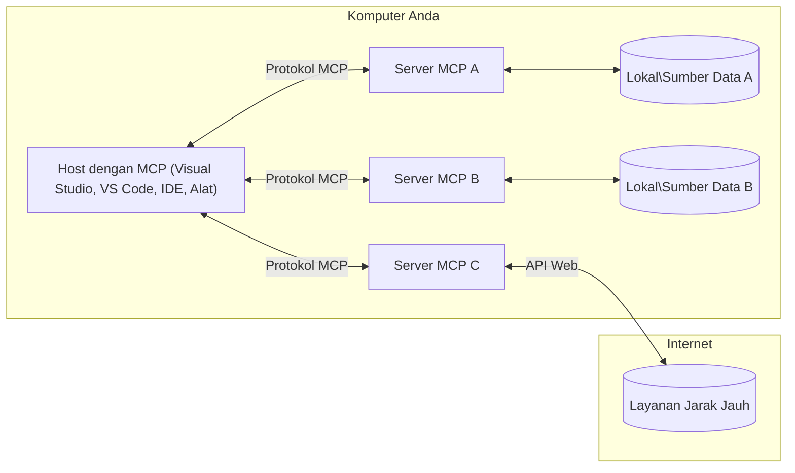

# Konsep Inti MCP: Menguasai Protokol Konteks Model untuk Integrasi AI

[](https://youtu.be/earDzWGtE84)

_(Klik gambar di atas untuk melihat video pelajaran ini)_

[Model Context Protocol (MCP)](https://github.com/modelcontextprotocol) adalah kerangka kerja standar yang kuat yang mengoptimalkan komunikasi antara Large Language Models (LLM) dan alat eksternal, aplikasi, serta sumber data.  
Panduan ini akan membimbing Anda melalui konsep inti MCP. Anda akan mempelajari arsitektur client-server-nya, komponen penting, mekanisme komunikasi, dan praktik terbaik implementasi.

- **Persetujuan Pengguna yang Eksplisit**: Semua akses data dan operasi memerlukan persetujuan eksplisit pengguna sebelum eksekusi. Pengguna harus jelas memahami data apa yang akan diakses dan tindakan apa yang akan dilakukan, dengan kontrol granular atas izin dan otorisasi.
  
- **Perlindungan Privasi Data**: Data pengguna hanya akan disajikan dengan persetujuan eksplisit dan harus dilindungi oleh kontrol akses yang kuat sepanjang siklus interaksi. Implementasi harus mencegah transmisi data yang tidak berwenang dan menjaga batas privasi yang ketat.
  
- **Keamanan Eksekusi Alat**: Setiap pemanggilan alat membutuhkan persetujuan pengguna secara eksplisit dengan pemahaman yang jelas tentang fungsi alat, parameter, dan potensi dampaknya. Batas keamanan yang kuat harus mencegah eksekusi alat yang tidak disengaja, tidak aman, atau berbahaya.
  
- **Keamanan Lapisan Transportasi**: Semua saluran komunikasi harus menggunakan mekanisme enkripsi dan otentikasi yang sesuai. Koneksi jarak jauh harus mengimplementasikan protokol transportasi yang aman dan manajemen kredensial yang tepat.

#### Pedoman Implementasi:

- **Manajemen Izin**: Terapkan sistem izin yang terperinci yang memungkinkan pengguna mengontrol server, alat, dan sumber daya yang dapat diakses  
- **Otentikasi & Otorisasi**: Gunakan metode otentikasi yang aman (OAuth, kunci API) dengan manajemen token dan masa berlaku yang tepat  
- **Validasi Input**: Validasi semua parameter dan input data sesuai skema yang ditentukan untuk mencegah serangan injeksi  
- **Pencatatan Audit**: Pertahankan log komprehensif dari semua operasi untuk pemantauan keamanan dan kepatuhan

## Ikhtisar

Pelajaran ini mengeksplorasi arsitektur fundamental dan komponen-komponen yang membentuk ekosistem Model Context Protocol (MCP). Anda akan mempelajari arsitektur client-server, komponen kunci, dan mekanisme komunikasi yang menjalankan interaksi MCP.

## Tujuan Pembelajaran Utama

Pada akhir pelajaran ini, Anda akan:

- Memahami arsitektur client-server MCP.  
- Mengidentifikasi peran dan tanggung jawab Host, Client, dan Server.  
- Menganalisis fitur inti yang membuat MCP menjadi lapisan integrasi yang fleksibel.  
- Mempelajari bagaimana informasi mengalir dalam ekosistem MCP.  
- Mendapatkan wawasan praktis melalui contoh kode dalam .NET, Java, Python, dan JavaScript.

## Arsitektur MCP: Tinjauan Mendalam

Ekosistem MCP dibangun dengan model client-server. Struktur modular ini memungkinkan aplikasi AI berinteraksi dengan alat, basis data, API, dan sumber daya kontekstual secara efisien. Mari kita uraikan arsitektur ini dalam komponen intinya.

Pada intinya, MCP mengikuti arsitektur client-server di mana aplikasi host dapat terhubung ke beberapa server:


- **Host MCP**: Program seperti VSCode, Claude Desktop, IDE, atau alat AI yang ingin mengakses data melalui MCP  
- **Client MCP**: Klien protokol yang mempertahankan koneksi 1:1 dengan server  
- **Server MCP**: Program ringan yang masing-masing menyediakan kemampuan tertentu melalui Model Context Protocol yang standar  
- **Sumber Data Lokal**: File komputer Anda, basis data, dan layanan yang dapat diakses secara aman oleh server MCP  
- **Layanan Jarak Jauh**: Sistem eksternal yang tersedia melalui internet yang dapat dihubungi server MCP melalui API.

Protokol MCP adalah standar yang terus berkembang menggunakan versi berdasarkan tanggal (format YYYY-MM-DD). Versi protokol saat ini adalah **2025-11-25**. Anda dapat melihat pembaruan terbaru pada [spesifikasi protokol](https://modelcontextprotocol.io/specification/2025-11-25/)

### 1. Hosts

Dalam Model Context Protocol (MCP), **Hosts** adalah aplikasi AI yang berfungsi sebagai antarmuka utama tempat pengguna berinteraksi dengan protokol. Hosts mengoordinasikan dan mengelola koneksi ke beberapa server MCP dengan membuat client MCP khusus untuk setiap koneksi server. Contoh Host meliputi:

- **Aplikasi AI**: Claude Desktop, Visual Studio Code, Claude Code  
- **Lingkungan Pengembangan**: IDE dan editor kode dengan integrasi MCP  
- **Aplikasi Kustom**: Agen dan alat AI yang dibangun khusus

**Hosts** adalah aplikasi yang mengoordinasikan interaksi model AI. Mereka:

- **Mengorkestrasi Model AI**: Menjalankan atau berinteraksi dengan LLM untuk menghasilkan respons dan mengoordinasikan alur kerja AI  
- **Mengelola Koneksi Client**: Membuat dan memelihara satu client MCP per koneksi server MCP  
- **Mengendalikan Antarmuka Pengguna**: Menangani alur percakapan, interaksi pengguna, dan penyajian respons  
- **Menegakkan Keamanan**: Mengendalikan izin, batasan keamanan, dan otentikasi  
- **Menangani Persetujuan Pengguna**: Mengelola persetujuan pengguna untuk berbagi data dan menjalankan alat

### 2. Clients

**Clients** adalah komponen penting yang mempertahankan koneksi satu-ke-satu yang khusus antara Hosts dan server MCP. Setiap client MCP dipanggil oleh Host untuk terhubung ke server MCP tertentu, memastikan saluran komunikasi yang terorganisir dan aman. Banyak client memungkinkan Host terhubung ke banyak server secara bersamaan.

**Clients** adalah komponen penghubung dalam aplikasi host. Mereka:

- **Komunikasi Protokol**: Mengirim permintaan JSON-RPC 2.0 ke server dengan prompt dan instruksi  
- **Negosiasi Kemampuan**: Menegosiasikan fitur dan versi protokol yang didukung dengan server saat inisialisasi  
- **Eksekusi Alat**: Mengelola permintaan eksekusi alat dari model dan memproses respon  
- **Pembaruan Real-time**: Menangani notifikasi dan pembaruan real-time dari server  
- **Pemrosesan Respons**: Memproses dan memformat respons server untuk ditampilkan ke pengguna

### 3. Servers

**Servers** adalah program yang menyediakan konteks, alat, dan kemampuan kepada client MCP. Mereka dapat dieksekusi secara lokal (pada mesin yang sama dengan Host) atau jarak jauh (di platform eksternal), dan bertanggung jawab menangani permintaan client serta menyediakan respons terstruktur. Server mengekspose fungsi tertentu melalui Model Context Protocol yang standar.

**Servers** adalah layanan yang menyediakan konteks dan kemampuan. Mereka:

- **Registrasi Fitur**: Mendaftarkan dan mengekspos primitif yang tersedia (sumber daya, prompt, alat) kepada client  
- **Pemrosesan Permintaan**: Menerima dan mengeksekusi panggilan alat, permintaan sumber daya, dan permintaan prompt dari client  
- **Penyediaan Konteks**: Memberikan informasi dan data kontekstual untuk meningkatkan respons model  
- **Manajemen Status**: Memelihara status sesi dan menangani interaksi stateful bila diperlukan  
- **Notifikasi Real-time**: Mengirim notifikasi terkait perubahan dan pembaruan kemampuan ke client yang terhubung

Server dapat dikembangkan oleh siapa saja untuk memperluas kemampuan model dengan fungsi khusus, dan mendukung skenario penerapan lokal serta jarak jauh.

### 4. Server Primitives

Server dalam Model Context Protocol (MCP) menyediakan tiga **primitif** inti yang mendefinisikan blok bangunan fundamental untuk interaksi kaya antara client, host, dan model bahasa. Primitif ini menetapkan jenis informasi kontekstual dan tindakan yang tersedia melalui protokol.

Server MCP dapat mengekspos kombinasi dari tiga primitif inti berikut ini:

#### Resources

**Resources** adalah sumber data yang menyediakan informasi kontekstual untuk aplikasi AI. Mereka merepresentasikan konten statis atau dinamis yang dapat meningkatkan pemahaman model dan pengambilan keputusan:

- **Data Kontekstual**: Informasi terstruktur dan konteks untuk konsumsi model AI  
- **Basis Pengetahuan**: Repositori dokumen, artikel, manual, dan makalah riset  
- **Sumber Data Lokal**: File, basis data, dan informasi sistem lokal  
- **Data Eksternal**: Respons API, layanan web, dan data sistem jarak jauh  
- **Konten Dinamis**: Data real-time yang diperbarui berdasarkan kondisi eksternal

Resources diidentifikasi melalui URI dan mendukung penemuan lewat metode `resources/list` serta pengambilan melalui `resources/read`:

```text
file://documents/project-spec.md
database://production/users/schema
api://weather/current
```

#### Prompts

**Prompts** adalah template yang dapat digunakan kembali untuk membantu menstrukturkan interaksi dengan model bahasa. Mereka menyediakan pola interaksi standar dan alur kerja yang menggunakan template:

- **Interaksi Berbasis Template**: Pesan dan pembuka percakapan yang sudah terstruktur  
- **Template Alur Kerja**: Urutan standar untuk tugas dan interaksi umum  
- **Contoh Few-shot**: Template berbasis contoh untuk instruksi model  
- **Prompt Sistem**: Prompt dasar yang mendefinisikan perilaku dan konteks model  
- **Template Dinamis**: Prompt parametrik yang menyesuaikan dengan konteks spesifik

Prompts mendukung substitusi variabel dan dapat ditemukan melalui `prompts/list` dan diambil dengan `prompts/get`:

```markdown
Generate a {{task_type}} for {{product}} targeting {{audience}} with the following requirements: {{requirements}}
```

#### Tools

**Tools** adalah fungsi yang dapat dieksekusi yang dapat dipanggil oleh model AI untuk melakukan tindakan spesifik. Mereka merupakan "kata kerja" dalam ekosistem MCP, memungkinkan model berinteraksi dengan sistem eksternal:

- **Fungsi Eksekusi**: Operasi terpisah yang dapat dipanggil model dengan parameter tertentu  
- **Integrasi Sistem Eksternal**: Panggilan API, kueri basis data, operasi file, perhitungan  
- **Identitas Unik**: Setiap alat memiliki nama, deskripsi, dan skema parameter yang berbeda  
- **I/O Terstruktur**: Alat menerima parameter yang divalidasi dan mengembalikan respons terstruktur dan bertipe  
- **Kemampuan Aksi**: Memungkinkan model melakukan tindakan dunia nyata dan mengambil data langsung

Alat didefinisikan dengan JSON Schema untuk validasi parameter dan ditemukan melalui `tools/list` serta dijalankan lewat `tools/call`. Tools juga dapat menyertakan **ikon** sebagai metadata tambahan untuk presentasi UI yang lebih baik.

**Anotasi Alat**: Tools mendukung anotasi perilaku (misal, `readOnlyHint`, `destructiveHint`) yang mendeskripsikan apakah alat bersifat hanya-baca atau destruktif, membantu client membuat keputusan yang tepat tentang eksekusi alat.

Contoh definisi alat:

```typescript
server.tool(
  "search_products", 
  {
    query: z.string().describe("Search query for products"),
    category: z.string().optional().describe("Product category filter"),
    max_results: z.number().default(10).describe("Maximum results to return")
  }, 
  async (params) => {
    // Jalankan pencarian dan kembalikan hasil yang terstruktur
    return await productService.search(params);
  }
);
```

## Client Primitives

Dalam Model Context Protocol (MCP), **client** dapat mengekspos primitif yang memungkinkan server meminta kemampuan tambahan dari aplikasi host. Primitif sisi client ini memungkinkan implementasi server yang lebih kaya dan interaktif yang dapat mengakses kemampuan model AI dan interaksi pengguna.

### Sampling

**Sampling** memungkinkan server meminta pelengkapan model bahasa dari aplikasi AI client. Primitif ini memberi server akses ke kemampuan LLM tanpa harus menyertakan dependensi model mereka sendiri:

- **Akses Independen Model**: Server dapat meminta pelengkapan tanpa menyertakan SDK LLM atau mengelola akses model  
- **AI Inisiasi Server**: Memungkinkan server secara mandiri menghasilkan konten menggunakan model AI client  
- **Interaksi LLM Rekursif**: Mendukung skenario kompleks di mana server memerlukan bantuan AI untuk pemrosesan  
- **Generasi Konten Dinamis**: Membolehkan server membuat respons kontekstual menggunakan model host  
- **Dukungan Pemanggilan Alat**: Server dapat menyertakan parameter `tools` dan `toolChoice` untuk memungkinkan model client memanggil alat selama sampling

Sampling diinisiasi lewat metode `sampling/complete`, di mana server mengirim permintaan pelengkapan ke client.

### Roots

**Roots** menyediakan cara standar bagi client untuk mengekspos batasan sistem file ke server, membantu server memahami direktori dan file mana saja yang dapat diakses:

- **Batasan Sistem File**: Mendefinisikan batas operasional server di dalam sistem file  
- **Kontrol Akses**: Membantu server memahami direktori dan file yang dapat diakses berdasarkan izin  
- **Pembaruan Dinamis**: Client dapat memberitahukan server saat daftar roots berubah  
- **Identifikasi Berbasis URI**: Roots menggunakan URI `file://` untuk mengidentifikasi direktori dan file yang dapat diakses

Roots ditemukan melalui metode `roots/list`, dengan client mengirimkan `notifications/roots/list_changed` saat roots berubah.

### Elicitation

**Elicitation** memungkinkan server meminta informasi tambahan atau konfirmasi dari pengguna melalui antarmuka client:

- **Permintaan Input Pengguna**: Server dapat meminta informasi tambahan saat diperlukan untuk eksekusi alat  
- **Dialog Konfirmasi**: Meminta persetujuan pengguna untuk operasi yang sensitif atau berdampak besar  
- **Alur Interaktif**: Memungkinkan server membuat interaksi pengguna langkah demi langkah  
- **Pengumpulan Parameter Dinamis**: Mengumpulkan parameter yang hilang atau opsional selama eksekusi alat

Permintaan elicitation dibuat menggunakan metode `elicitation/request` untuk mengumpulkan input pengguna melalui antarmuka client.

**Mode Elicitation URL**: Server juga dapat meminta interaksi pengguna berbasis URL, memungkinkan server mengarahkan pengguna ke halaman web eksternal untuk otentikasi, konfirmasi, atau pengisian data.

### Logging

**Logging** memungkinkan server mengirim pesan log terstruktur ke client untuk debugging, pemantauan, dan visibilitas operasional:

- **Dukungan Debugging**: Memungkinkan server menyediakan log eksekusi terperinci untuk pemecahan masalah  
- **Pemantauan Operasional**: Mengirim pembaruan status dan metrik kinerja ke client  
- **Pelaporan Kesalahan**: Menyediakan konteks kesalahan yang detail dan informasi diagnostik  
- **Jejak Audit**: Membuat catatan komprehensif tentang operasi dan keputusan server

Pesan logging dikirim ke client untuk memberikan transparansi operasi server dan memudahkan debugging.

## Aliran Informasi dalam MCP

Model Context Protocol (MCP) mendefinisikan aliran informasi yang terstruktur antara host, client, server, dan model. Memahami aliran ini membantu memperjelas bagaimana permintaan pengguna diproses dan bagaimana alat eksternal serta data diintegrasikan ke dalam respons model.
- **Host Memulai Koneksi**  
  Aplikasi host (seperti IDE atau antarmuka chat) membuat koneksi ke server MCP, biasanya melalui STDIO, WebSocket, atau transportasi lain yang didukung.

- **Negosiasi Kapabilitas**  
  Klien (yang tertanam di host) dan server bertukar informasi tentang fitur, alat, sumber daya, dan versi protokol yang mereka dukung. Ini memastikan kedua pihak memahami kapabilitas yang tersedia untuk sesi tersebut.

- **Permintaan Pengguna**  
  Pengguna berinteraksi dengan host (misalnya, memasukkan prompt atau perintah). Host mengumpulkan input ini dan meneruskannya ke klien untuk diproses.

- **Penggunaan Sumber Daya atau Alat**  
  - Klien dapat meminta konteks tambahan atau sumber daya dari server (seperti file, entri basis data, atau artikel basis pengetahuan) untuk memperkaya pemahaman model.  
  - Jika model menentukan bahwa sebuah alat diperlukan (misalnya, untuk mengambil data, melakukan perhitungan, atau memanggil API), klien mengirim permintaan pemanggilan alat ke server, dengan menyebutkan nama alat dan parameter.

- **Eksekusi Server**  
  Server menerima permintaan sumber daya atau alat, menjalankan operasi yang diperlukan (seperti menjalankan fungsi, query basis data, atau mengambil file), dan mengembalikan hasil ke klien dalam format terstruktur.

- **Generasi Respon**  
  Klien mengintegrasikan respons server (data sumber daya, keluaran alat, dll.) ke dalam interaksi model yang sedang berjalan. Model menggunakan informasi ini untuk menghasilkan respons yang komprehensif dan relevan secara kontekstual.

- **Penyajian Hasil**  
  Host menerima keluaran akhir dari klien dan menyajikannya ke pengguna, sering kali mencakup teks yang dihasilkan model serta hasil dari eksekusi alat atau pencarian sumber daya.

Alur ini memungkinkan MCP mendukung aplikasi AI yang interaktif, kontekstual, dan canggih dengan menghubungkan model secara mulus dengan alat dan sumber data eksternal.

## Arsitektur & Lapisan Protokol

MCP terdiri dari dua lapisan arsitektur yang berbeda yang bekerja sama untuk menyediakan kerangka komunikasi lengkap:

### Lapisan Data

**Lapisan Data** mengimplementasikan protokol inti MCP menggunakan **JSON-RPC 2.0** sebagai fondasi. Lapisan ini mendefinisikan struktur pesan, semantik, dan pola interaksi:

#### Komponen Inti:

- **Protokol JSON-RPC 2.0**: Semua komunikasi menggunakan format pesan JSON-RPC 2.0 standar untuk pemanggilan metode, respons, dan notifikasi  
- **Manajemen Siklus Hidup**: Menangani inisialisasi koneksi, negosiasi kapabilitas, dan terminasi sesi antara klien dan server  
- **Primitif Server**: Memungkinkan server menyediakan fungsi inti melalui alat, sumber daya, dan prompt  
- **Primitif Klien**: Memungkinkan server meminta sampling dari LLM, meminta input pengguna, dan mengirim pesan log  
- **Notifikasi Real-time**: Mendukung notifikasi asinkron untuk pembaruan dinamis tanpa polling

#### Fitur Utama:

- **Negosiasi Versi Protokol**: Menggunakan penomoran versi berbasis tanggal (YYYY-MM-DD) untuk memastikan kompatibilitas  
- **Penemuan Kapabilitas**: Klien dan server bertukar informasi fitur yang didukung selama inisialisasi  
- **Sesi Stateful**: Mempertahankan status koneksi selama beberapa interaksi untuk kontinuitas konteks

### Lapisan Transportasi

**Lapisan Transportasi** mengelola saluran komunikasi, framing pesan, dan autentikasi antar partisipan MCP:

#### Mekanisme Transportasi yang Didukung:

1. **Transportasi STDIO**:  
   - Menggunakan aliran input/output standar untuk komunikasi langsung antar proses  
   - Optimal untuk proses lokal pada mesin yang sama tanpa overhead jaringan  
   - Umum digunakan untuk implementasi server MCP lokal

2. **Transportasi HTTP Streamable**:  
   - Menggunakan HTTP POST untuk pesan klien-ke-server  
   - Opsional Server-Sent Events (SSE) untuk streaming server-ke-klien  
   - Memungkinkan komunikasi server jarak jauh melalui jaringan  
   - Mendukung autentikasi HTTP standar (token bearer, kunci API, header khusus)  
   - MCP merekomendasikan OAuth untuk autentikasi token yang aman

#### Abstraksi Transportasi:

Lapisan transportasi mengabstraksi detail komunikasi dari lapisan data, sehingga memungkinkan format pesan JSON-RPC 2.0 yang sama digunakan di semua mekanisme transportasi. Abstraksi ini memungkinkan aplikasi beralih mulus antara server lokal dan jarak jauh.

### Pertimbangan Keamanan

Implementasi MCP harus mematuhi beberapa prinsip keamanan penting untuk memastikan interaksi aman, dapat dipercaya, dan terlindungi dalam semua operasi protokol:

- **Persetujuan dan Kontrol Pengguna**: Pengguna harus memberikan persetujuan eksplisit sebelum data diakses atau operasi dilakukan. Mereka harus memiliki kontrol jelas atas data yang dibagikan dan tindakan yang diotorisasi, didukung oleh antarmuka pengguna yang intuitif untuk meninjau dan menyetujui aktivitas.

- **Privasi Data**: Data pengguna hanya boleh dibuka dengan persetujuan eksplisit dan harus dilindungi dengan kontrol akses yang tepat. Implementasi MCP harus melindungi dari transmisi data yang tidak sah dan memastikan privasi terjaga sepanjang interaksi.

- **Keamanan Alat**: Sebelum memanggil alat apapun, diperlukan persetujuan eksplisit dari pengguna. Pengguna harus memahami fungsi masing-masing alat dengan jelas, dan batas keamanan yang kuat harus ditegakkan untuk mencegah eksekusi alat yang tidak diinginkan atau tidak aman.

Dengan mengikuti prinsip keamanan ini, MCP memastikan kepercayaan, privasi, dan keselamatan pengguna terjaga di semua interaksi protokol sekaligus memungkinkan integrasi AI yang kuat.

## Contoh Kode: Komponen Utama

Berikut ini contoh kode dalam beberapa bahasa pemrograman populer yang menggambarkan bagaimana mengimplementasikan komponen server MCP utama dan alat.

### Contoh .NET: Membuat Server MCP Sederhana dengan Alat

Berikut contoh kode .NET praktis yang mendemonstrasikan cara mengimplementasikan server MCP sederhana dengan alat kustom. Contoh ini menunjukkan cara mendefinisikan dan mendaftarkan alat, menangani permintaan, dan menghubungkan server menggunakan Model Context Protocol.

```csharp
using System;
using System.Threading.Tasks;
using ModelContextProtocol.Server;
using ModelContextProtocol.Server.Transport;
using ModelContextProtocol.Server.Tools;

public class WeatherServer
{
    public static async Task Main(string[] args)
    {
        // Create an MCP server
        var server = new McpServer(
            name: "Weather MCP Server",
            version: "1.0.0"
        );
        
        // Register our custom weather tool
        server.AddTool<string, WeatherData>("weatherTool", 
            description: "Gets current weather for a location",
            execute: async (location) => {
                // Call weather API (simplified)
                var weatherData = await GetWeatherDataAsync(location);
                return weatherData;
            });
        
        // Connect the server using stdio transport
        var transport = new StdioServerTransport();
        await server.ConnectAsync(transport);
        
        Console.WriteLine("Weather MCP Server started");
        
        // Keep the server running until process is terminated
        await Task.Delay(-1);
    }
    
    private static async Task<WeatherData> GetWeatherDataAsync(string location)
    {
        // This would normally call a weather API
        // Simplified for demonstration
        await Task.Delay(100); // Simulate API call
        return new WeatherData { 
            Temperature = 72.5,
            Conditions = "Sunny",
            Location = location
        };
    }
}

public class WeatherData
{
    public double Temperature { get; set; }
    public string Conditions { get; set; }
    public string Location { get; set; }
}
```


### Contoh Java: Komponen Server MCP

Contoh ini mendemonstrasikan server MCP dan pendaftaran alat yang sama seperti contoh .NET di atas, tetapi diimplementasikan dalam Java.

```java
import io.modelcontextprotocol.server.McpServer;
import io.modelcontextprotocol.server.McpToolDefinition;
import io.modelcontextprotocol.server.transport.StdioServerTransport;
import io.modelcontextprotocol.server.tool.ToolExecutionContext;
import io.modelcontextprotocol.server.tool.ToolResponse;

public class WeatherMcpServer {
    public static void main(String[] args) throws Exception {
        // Buat server MCP
        McpServer server = McpServer.builder()
            .name("Weather MCP Server")
            .version("1.0.0")
            .build();
            
        // Daftarkan alat cuaca
        server.registerTool(McpToolDefinition.builder("weatherTool")
            .description("Gets current weather for a location")
            .parameter("location", String.class)
            .execute((ToolExecutionContext ctx) -> {
                String location = ctx.getParameter("location", String.class);
                
                // Dapatkan data cuaca (disederhanakan)
                WeatherData data = getWeatherData(location);
                
                // Kembalikan respons yang diformat
                return ToolResponse.content(
                    String.format("Temperature: %.1f°F, Conditions: %s, Location: %s", 
                    data.getTemperature(), 
                    data.getConditions(), 
                    data.getLocation())
                );
            })
            .build());
        
        // Hubungkan server menggunakan transportasi stdio
        try (StdioServerTransport transport = new StdioServerTransport()) {
            server.connect(transport);
            System.out.println("Weather MCP Server started");
            // Pertahankan server berjalan sampai proses dihentikan
            Thread.currentThread().join();
        }
    }
    
    private static WeatherData getWeatherData(String location) {
        // Implementasi akan memanggil API cuaca
        // Disederhanakan untuk keperluan contoh
        return new WeatherData(72.5, "Sunny", location);
    }
}

class WeatherData {
    private double temperature;
    private String conditions;
    private String location;
    
    public WeatherData(double temperature, String conditions, String location) {
        this.temperature = temperature;
        this.conditions = conditions;
        this.location = location;
    }
    
    public double getTemperature() {
        return temperature;
    }
    
    public String getConditions() {
        return conditions;
    }
    
    public String getLocation() {
        return location;
    }
}
```


### Contoh Python: Membangun Server MCP

Contoh ini menggunakan fastmcp, jadi pastikan Anda menginstalnya terlebih dahulu:

```python
pip install fastmcp
```
Code Sample:

```python
#!/usr/bin/env python3
import asyncio
from fastmcp import FastMCP
from fastmcp.transports.stdio import serve_stdio

# Buat server FastMCP
mcp = FastMCP(
    name="Weather MCP Server",
    version="1.0.0"
)

@mcp.tool()
def get_weather(location: str) -> dict:
    """Gets current weather for a location."""
    return {
        "temperature": 72.5,
        "conditions": "Sunny",
        "location": location
    }

# Pendekatan alternatif menggunakan kelas
class WeatherTools:
    @mcp.tool()
    def forecast(self, location: str, days: int = 1) -> dict:
        """Gets weather forecast for a location for the specified number of days."""
        return {
            "location": location,
            "forecast": [
                {"day": i+1, "temperature": 70 + i, "conditions": "Partly Cloudy"}
                for i in range(days)
            ]
        }

# Daftarkan alat kelas
weather_tools = WeatherTools()

# Mulai server
if __name__ == "__main__":
    asyncio.run(serve_stdio(mcp))
```


### Contoh JavaScript: Membuat Server MCP

Contoh ini menunjukkan pembuatan server MCP dalam JavaScript dan cara mendaftarkan dua alat terkait cuaca.

```javascript
// Menggunakan SDK Protokol Konteks Model resmi
import { McpServer } from "@modelcontextprotocol/sdk/server/mcp.js";
import { StdioServerTransport } from "@modelcontextprotocol/sdk/server/stdio.js";
import { z } from "zod"; // Untuk validasi parameter

// Membuat server MCP
const server = new McpServer({
  name: "Weather MCP Server",
  version: "1.0.0"
});

// Mendefinisikan alat cuaca
server.tool(
  "weatherTool",
  {
    location: z.string().describe("The location to get weather for")
  },
  async ({ location }) => {
    // Ini biasanya memanggil API cuaca
    // Disederhanakan untuk demonstrasi
    const weatherData = await getWeatherData(location);
    
    return {
      content: [
        { 
          type: "text", 
          text: `Temperature: ${weatherData.temperature}°F, Conditions: ${weatherData.conditions}, Location: ${weatherData.location}` 
        }
      ]
    };
  }
);

// Mendefinisikan alat prakiraan
server.tool(
  "forecastTool",
  {
    location: z.string(),
    days: z.number().default(3).describe("Number of days for forecast")
  },
  async ({ location, days }) => {
    // Ini biasanya memanggil API cuaca
    // Disederhanakan untuk demonstrasi
    const forecast = await getForecastData(location, days);
    
    return {
      content: [
        { 
          type: "text", 
          text: `${days}-day forecast for ${location}: ${JSON.stringify(forecast)}` 
        }
      ]
    };
  }
);

// Fungsi pembantu
async function getWeatherData(location) {
  // Mensimulasikan panggilan API
  return {
    temperature: 72.5,
    conditions: "Sunny",
    location: location
  };
}

async function getForecastData(location, days) {
  // Mensimulasikan panggilan API
  return Array.from({ length: days }, (_, i) => ({
    day: i + 1,
    temperature: 70 + Math.floor(Math.random() * 10),
    conditions: i % 2 === 0 ? "Sunny" : "Partly Cloudy"
  }));
}

// Menghubungkan server menggunakan transport stdio
const transport = new StdioServerTransport();
server.connect(transport).catch(console.error);

console.log("Weather MCP Server started");
```


Contoh JavaScript ini mendemonstrasikan bagaimana membuat server MCP yang mendaftarkan alat terkait cuaca dan menghubungkan menggunakan transport stdio untuk menangani permintaan klien yang masuk.

## Keamanan dan Otorisasi

MCP menyertakan beberapa konsep dan mekanisme bawaan untuk mengelola keamanan dan otorisasi sepanjang protokol:

1. **Kontrol Izin Alat**:  
  Klien dapat menentukan alat mana yang diizinkan model untuk digunakan selama sesi. Ini memastikan hanya alat yang secara eksplisit diotorisasi yang dapat diakses, mengurangi risiko operasi yang tidak diinginkan atau tidak aman. Izin dapat dikonfigurasi secara dinamis berdasarkan preferensi pengguna, kebijakan organisasi, atau konteks interaksi.

2. **Autentikasi**:  
  Server dapat mengharuskan autentikasi sebelum memberikan akses ke alat, sumber daya, atau operasi sensitif. Ini dapat melibatkan kunci API, token OAuth, atau skema autentikasi lainnya. Autentikasi yang tepat memastikan hanya klien dan pengguna terpercaya yang dapat memanggil kapabilitas sisi server.

3. **Validasi**:  
  Validasi parameter diberlakukan untuk semua pemanggilan alat. Setiap alat mendefinisikan tipe, format, dan batasan yang diharapkan untuk parameternya, dan server memvalidasi permintaan masuk sesuai dengan ini. Ini mencegah input yang salah format atau berbahaya mencapai implementasi alat dan membantu menjaga integritas operasi.

4. **Pembatasan Laju (Rate Limiting)**:  
  Untuk mencegah penyalahgunaan dan memastikan penggunaan sumber daya server yang adil, server MCP dapat menerapkan pembatasan laju untuk pemanggilan alat dan akses sumber daya. Pembatasan ini dapat diterapkan per pengguna, per sesi, atau secara global, dan membantu melindungi dari serangan penolakan layanan atau konsumsi sumber daya berlebihan.

Dengan menggabungkan mekanisme ini, MCP menyediakan fondasi yang aman untuk mengintegrasikan model bahasa dengan alat dan sumber data eksternal, sambil memberikan kontrol granular kepada pengguna dan pengembang atas akses dan penggunaan.

## Pesan Protokol & Alur Komunikasi

Komunikasi MCP menggunakan pesan **JSON-RPC 2.0** terstruktur untuk memfasilitasi interaksi yang jelas dan dapat diandalkan antara host, klien, dan server. Protokol mendefinisikan pola pesan khusus untuk berbagai jenis operasi:

### Jenis Pesan Inti:

#### **Pesan Inisialisasi**
- Permintaan **`initialize`**: Membuka koneksi dan menegosiasikan versi protokol dan kapabilitas  
- Respon **`initialize`**: Mengonfirmasi fitur yang didukung dan informasi server  
- **`notifications/initialized`**: Menandakan bahwa inisialisasi selesai dan sesi siap digunakan

#### **Pesan Penemuan**
- Permintaan **`tools/list`**: Menemukan alat yang tersedia dari server  
- Permintaan **`resources/list`**: Mendaftar sumber daya yang tersedia (sumber data)  
- Permintaan **`prompts/list`**: Mengambil template prompt yang tersedia

#### **Pesan Eksekusi**  
- Permintaan **`tools/call`**: Menjalankan alat tertentu dengan parameter yang diberikan  
- Permintaan **`resources/read`**: Mengambil konten dari sumber daya tertentu  
- Permintaan **`prompts/get`**: Mengambil template prompt dengan parameter opsional

#### **Pesan Sisi Klien**
- Permintaan **`sampling/complete`**: Server meminta penyelesaian LLM dari klien  
- **`elicitation/request`**: Server meminta input pengguna melalui antarmuka klien  
- Pesan Logging: Server mengirim pesan log terstruktur ke klien

#### **Pesan Notifikasi**
- **`notifications/tools/list_changed`**: Server memberi tahu klien tentang perubahan alat  
- **`notifications/resources/list_changed`**: Server memberi tahu klien tentang perubahan sumber daya  
- **`notifications/prompts/list_changed`**: Server memberi tahu klien tentang perubahan prompt

### Struktur Pesan:

Semua pesan MCP mengikuti format JSON-RPC 2.0 dengan:  
- **Pesan Permintaan**: Berisi `id`, `method`, dan opsional `params`  
- **Pesan Respon**: Berisi `id` dan `result` atau `error`  
- **Pesan Notifikasi**: Berisi `method` dan opsional `params` (tanpa `id` dan tanpa respon yang diharapkan)

Komunikasi terstruktur ini memastikan interaksi yang dapat diandalkan, dapat dilacak, dan dapat dikembangkan, mendukung skenario canggih seperti pembaruan real-time, chaining alat, dan penanganan kesalahan yang kuat.

### Tugas (Eksperimental)

**Tugas** adalah fitur eksperimental yang menyediakan pembungkus eksekusi tahan lama untuk memungkinkan pengambilan hasil tertunda dan pelacakan status untuk permintaan MCP:

- **Operasi Jangka Panjang**: Melacak komputasi mahal, otomasi alur kerja, dan pemrosesan batch  
- **Hasil Tertunda**: Polling status tugas dan mengambil hasil saat operasi selesai  
- **Pelacakan Status**: Memantau kemajuan tugas melalui status siklus hidup yang didefinisikan  
- **Operasi Multi-Langkah**: Mendukung alur kerja kompleks yang mencakup beberapa interaksi

Tugas membungkus permintaan MCP standar untuk memungkinkan pola eksekusi asinkron untuk operasi yang tidak dapat selesai segera.

## Poin Penting

- **Arsitektur**: MCP menggunakan arsitektur klien-server di mana host mengelola beberapa koneksi klien ke server  
- **Partisipan**: Ekosistem mencakup host (aplikasi AI), klien (penghubung protokol), dan server (penyedia kapabilitas)  
- **Mekanisme Transportasi**: Komunikasi mendukung STDIO (lokal) dan HTTP Streamable dengan SSE opsional (jarak jauh)  
- **Primitif Inti**: Server mengekspose alat (fungsi eksekusi), sumber daya (sumber data), dan prompt (template)  
- **Primitif Klien**: Server dapat meminta sampling (penyelesaian LLM dengan dukungan pemanggilan alat), elicitation (input pengguna termasuk mode URL), roots (batas filesystem), dan logging dari klien  
- **Fitur Eksperimental**: Tugas menyediakan pembungkus eksekusi tahan lama untuk operasi jangka panjang  
- **Fondasi Protokol**: Dibangun di atas JSON-RPC 2.0 dengan penomoran versi berbasis tanggal (terkini: 2025-11-25)  
- **Kapabilitas Real-time**: Mendukung notifikasi untuk pembaruan dinamis dan sinkronisasi real-time  
- **Keamanan Utama**: Persetujuan eksplisit pengguna, perlindungan privasi data, dan transportasi aman adalah persyaratan inti

## Latihan

Rancang alat MCP sederhana yang berguna di domain Anda. Definisikan:  
1. Nama alat tersebut  
2. Parameter apa yang diterima  
3. Keluaran apa yang diberikan  
4. Bagaimana model dapat menggunakan alat ini untuk menyelesaikan masalah pengguna

---

## Selanjutnya

Selanjutnya: [Bab 2: Keamanan](../02-Security/README.md)

---

<!-- CO-OP TRANSLATOR DISCLAIMER START -->
**Sanggahan**:  
Dokumen ini telah diterjemahkan menggunakan layanan terjemahan AI [Co-op Translator](https://github.com/Azure/co-op-translator). Meskipun kami berupaya untuk mencapai akurasi, harap diingat bahwa terjemahan otomatis mungkin mengandung kesalahan atau ketidakakuratan. Dokumen asli dalam bahasa aslinya harus dianggap sebagai sumber yang sahih. Untuk informasi penting, disarankan menggunakan terjemahan profesional oleh manusia. Kami tidak bertanggung jawab atas kesalahpahaman atau salah tafsir yang timbul dari penggunaan terjemahan ini.
<!-- CO-OP TRANSLATOR DISCLAIMER END -->